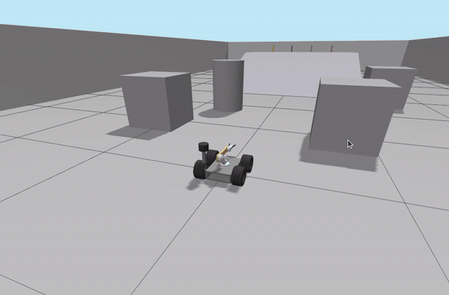

# How to Run COCO 2.0

COCO is a simulated autonomous mobile manipulator: a four-wheel
differential-drive base with a two-joint arm. It drives across an arena under
Nav2, climbs a ramp under a learned policy, finds a colour-selected cylinder
by sight on the platform above, picks it up, carries it home and puts it
down — checking at every step whether the step actually worked.

This page gets you from a fresh clone to watching that happen. There is one
demonstration, and it is the whole robot.

---

## 1. Requirements

| | |
|---|---|
| OS | Ubuntu 24.04 |
| ROS 2 | Jazzy |
| Simulator | Gazebo Harmonic (`gz sim`) |
| Python | 3.12 |

```bash
sudo apt install \
    ros-jazzy-desktop ros-jazzy-ros-gz \
    ros-jazzy-navigation2 ros-jazzy-nav2-bringup ros-jazzy-nav2-smac-planner \
    ros-jazzy-moveit ros-jazzy-ros2-control ros-jazzy-ros2-controllers \
    ros-jazzy-slam-toolbox ros-jazzy-cv-bridge ros-jazzy-rmw-cyclonedds-cpp

pip install --user numpy scipy stable-baselines3 gymnasium
```

All four Python packages are required to *run* COCO, not just to develop it:
`numpy`/`scipy` build the localization monitor's scan-vs-map distance field,
and `stable-baselines3`/`gymnasium` load the ramp policy.

---

## 2. Setup

Everything is on `main`. There is no other branch, and nothing to download
separately — the trained ramp policy ships in the repository.

```bash
mkdir -p ~/ros2_ws/src && cd ~/ros2_ws/src
git clone https://github.com/GauthamCodes/coco-robot-jazzy-2.0.git
cd coco-robot-jazzy-2.0

rosdep install --from-paths . --ignore-src -r -y --rosdistro jazzy

cd ../..                     # back to the workspace root
colcon build --symlink-install --packages-select \
    coco_config coco_sim coco_rl coco_perception \
    coco_moveit_config custom_teleop gazebo_models coco_mission coco_web
```

**Expect:** `Summary: 9 packages finished`, **0 errors**. `setuptools`
deprecation warnings on stderr are normal.

`--packages-select` keeps unrelated packages in your workspace out of the
build. If the workspace holds nothing but this clone, plain `colcon build
--symlink-install` works too.

### Source the environment — in every terminal, first

```bash
cd <your clone>          # e.g. ~/ros2_ws/src/coco-robot-jazzy-2.0
source ./setup_env.sh
```

`setup_env.sh` finds the workspace from its own path, so the clone can live
anywhere under `<workspace>/src/`. It sources ROS and this workspace's
overlay, puts CycloneDDS on loopback, points Gazebo at the right version, and
falls back to Mesa rendering when the NVIDIA driver is not loaded. If it
prints `note: no overlay at <ws>/install — run colcon build`, that note is the
whole diagnosis: build first, source second.

---

## 3. Run COCO ⭐



*COCO autonomously navigates, climbs, identifies a target, grasps it, returns
home and places it. Four moments from one continuous run; the clip ends on
the carry home.*

### Command

Three terminals, each with `./setup_env.sh` sourced.

```bash
# T1 — the simulator
ros2 launch gazebo_models full_world_robo.launch.py traverse:=true
```

```bash
# T2 — the robot: Nav2, the ramp policy, perception, MoveIt, the executive
ros2 launch coco_mission mission.launch.py rviz:=false
```

```bash
# T3 — start the mission and watch it
ros2 service call /mission/start std_srvs/srv/Trigger
ros2 topic echo /mission/state --field data
```

That is the whole run. No environment variables, no policy path, nothing to
configure: the trained ramp policy ships in the repository and the launch
file loads it by default. Bringing the stack up never moves the robot —
nothing happens until you call `/mission/start`.

`rviz:=false` leaves the GPU to the simulator, so you watch the robot itself
in the Gazebo window. Drop it for the RViz mission view — map, both plans and
the perception markers — at the cost of running all three renderers at once.

To fetch a different cylinder, add `target_colour:=red` (or `green`,
`yellow`) to the T2 command.

**Before every run**, and after every run, tear the simulator down:

```bash
bash "$(ros2 pkg prefix gazebo_models)/lib/gazebo_models/ros_clean.sh"
```

Each mission needs a **fresh simulator**: the Gazebo `DetachableJoint` binds
its child on first spawn, so a second run in the same simulator picks nothing
up and reports success anyway.

### What happens

```
navigate  →  climb  →  detect target  →  grasp  →  return  →  place
```

Nav2 drives the flat. The ramp cannot be planned onto at all — the lidar
plane cuts an 18° slope, so the ramp scans as a solid wall — so a learned PPO
policy takes the wheels for the climb and hands them back at the top. On the
platform the camera measures where the cylinder actually is, a visual servo
drives onto that estimate, and MoveIt picks it up. Then back down, home, and
set down. A 19-state executive decides after each step whether the step
worked.

`/mission/state` steps through the sixteen nominal states in order:

```
IDLE → LOCALIZE → NAVIGATE_TO_RAMP → ALIGN_FOR_CLIMB → CLIMB → VERIFY_CLIMB
→ SEARCH_TARGET → STOW_ARM → APPROACH_TARGET → GRASP → VERIFY_GRASP
→ DESCEND → RETURN_HOME → PLACE → VERIFY_PLACEMENT → COMPLETE
```

### Success

The last line on `/mission/state` reads:

```
state=COMPLETE ... result=fetch
```

`COMPLETE` with `result=fetch` is the win. The mission otherwise ends in
`ABORT`, and an `ABORT` always carries a `reason=`.

**Takes about five minutes with the Gazebo window open** — this page's
verification run reached `COMPLETE` **303 s** after `/mission/start`, with
`attempt=1` and no failure reason at any sample, and the grasp verified from
the simulator's own ground truth at **35.1 mm** of lift. Headless
(`gui:=false`) the measured nominal is **187 s**.

The standing success rate is **19 of 20** over a 20-run matrix, five runs of
each colour with a fresh simulator every run. When a run does fail it is
almost always `RETURN_HOME`: the ramp and the platform are deliberately
outside the map, and AMCL can come off them mispositioned, after which the
planner refuses a path home. That limitation is measured and written up in
[`README.md`](README.md) and [`docs/RESULTS.md`](docs/RESULTS.md) rather than
smoothed over. Start a fresh simulator and run it again.

### Common problems

| What you see | What to do |
|---|---|
| `package 'coco_mission' not found` | The overlay was not sourced, or was sourced before the build. Build from the workspace root, **then** `source ./setup_env.sh` in each terminal. |
| Every Nav2 goal rejected, *"Action server is inactive"*; RViz empty; the map missing | Orphaned processes from a previous run are holding a stale `/clock`. Run `ros_clean.sh` and start again. The tell is that each run is worse than the last. |
| The mission stalls at `CLIMB`, `ramp_driver` refused `/ramp/climb` | No policy was found. The shipped one lives at `coco_rl/policies/phase5_24deg_s0p0.zip` and is installed by the build — rebuild `coco_rl` and source again. |
| The robot picks nothing up, but the run still reports success | The simulator was reused. Every mission needs a fresh one; `ros_clean.sh` between runs. |

Two behaviours that are **known, and not faults in your setup**: the
localization monitor reads `UNKNOWN` on the ramp and the platform, because
they are outside the map and there is nothing to score a scan against; and
`/cmd_vel_nav` has several publishers, a documented and unfixed topic loop
that means the collision monitor's gating does not reach the wheels. Both are
in [`README.md`](README.md) under *Known limitations*.

---

## 4. Tests

Run them **per package, from inside that package's directory, on a clean ROS
graph**. A live stack changes what the `coco_mission` fixtures see, and one
pytest run across the whole workspace dies on duplicate test module names
before it runs anything.

```bash
source ./setup_env.sh
bash "$(ros2 pkg prefix gazebo_models)/lib/gazebo_models/ros_clean.sh"

cd coco_mission && python3 -m pytest -q && cd ..
```

Repeat for `coco_config`, `custom_teleop`, `coco_rl`, `coco_perception`,
`coco_moveit_config` and `coco_sim`; `gazebo_models` needs one extra flag,
`python3 -m pytest -q --ignore=test_integration`.

**Expect 829 passing, 0 failing, 0 skipped** across the eight packages
(`coco_config` 70, `custom_teleop` 67, `coco_rl` 164, `coco_perception` 139,
`gazebo_models` 41, `coco_moveit_config` 12, `coco_sim` 55, `coco_mission`
281). `coco_web` has no tests; pytest exits 4 there, and that is not a
failure.

---

## 5. Technical documentation

- [`README.md`](README.md) — what COCO is, what was measured, and what it
  still cannot do
- [`docs/ARCHITECTURE.md`](docs/ARCHITECTURE.md) — the nine packages, the
  four control paradigms, and who owns the wheels in each mission state
- [`docs/RESULTS.md`](docs/RESULTS.md) — every measured number and the run
  that produced it; `docs/data/` holds the raw CSVs and the analysis scripts
- [`docs/DESIGN_DECISIONS.md`](docs/DESIGN_DECISIONS.md) — problem,
  diagnosis, fix, evidence, including the things that turned out to be wrong

Also here: [`docs/RUNNING.md`](docs/RUNNING.md) runs the individual
subsystems on their own — teleop, mapping, standalone Nav2, MoveIt
pick-and-place, the browser panel — and [`CLAUDE.md`](CLAUDE.md) carries the
engineering constraints, if you intend to change the code rather than run it.
