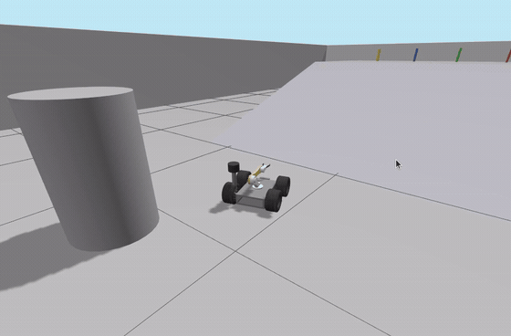
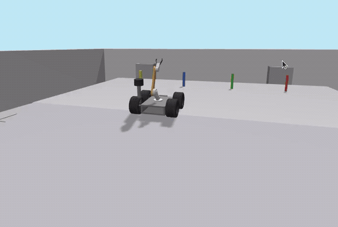

# How to Run COCO 2.0

COCO is a simulated mobile manipulator: a four-wheel differential-drive base
with a two-joint arm. It drives across an arena, climbs a ramp under a learned
policy, finds a colour-selected cylinder by sight on the platform above, picks
it up, carries it home and puts it down — checking at every step whether the
step actually worked. This page gets you from a fresh clone to watching that
happen, in four demos.

Every command below was run against this repository before it was written
down. Where something does not work, this page says so rather than leaving you
to find out.

| | |
|---|---|
| What it is and what was measured | [`README.md`](README.md) |
| How the system is put together | [`docs/ARCHITECTURE.md`](docs/ARCHITECTURE.md) |
| Every number, with the run that produced it | [`docs/RESULTS.md`](docs/RESULTS.md) |
| Why it is built this way | [`docs/DESIGN_DECISIONS.md`](docs/DESIGN_DECISIONS.md) |

---

## 1. What you need

| | |
|---|---|
| OS | Ubuntu 24.04 |
| ROS 2 | Jazzy |
| Simulator | Gazebo Harmonic (`gz sim`) |
| Python | 3.12 |

ROS packages, all from the Jazzy binaries:

```bash
sudo apt install \
    ros-jazzy-desktop ros-jazzy-ros-gz \
    ros-jazzy-navigation2 ros-jazzy-nav2-bringup ros-jazzy-nav2-smac-planner \
    ros-jazzy-moveit ros-jazzy-ros2-control ros-jazzy-ros2-controllers \
    ros-jazzy-slam-toolbox ros-jazzy-cv-bridge ros-jazzy-rmw-cyclonedds-cpp
```

Python packages beyond what ROS installs:

```bash
pip install --user numpy scipy stable-baselines3 gymnasium
```

`numpy` and `scipy` are **required** — the localization monitor builds its
scan-vs-map distance field with `scipy.ndimage` and will not start without
them. `stable-baselines3` and `gymnasium` are required to *run* the ramp
policy, not just to train one, so three of the four demos below need them.

> **`rosdep install` does not work on this repository right now.**
> `coco_sim/package.xml` contains a `--` inside an XML comment, which is not
> legal XML, so `rosdep` exits 1 having resolved nothing. Install the packages
> above by hand. The list is taken from the nine `package.xml` manifests; it
> has not been re-tested on a clean machine.

---

## 2. Set up

Everything is on `main`. No other branch is needed.

```bash
mkdir -p ~/ros2_ws/src && cd ~/ros2_ws/src
git clone https://github.com/GauthamCodes/coco-robot-jazzy-2.0.git

cd ~/ros2_ws
colcon build --symlink-install --packages-select \
    coco_config coco_sim coco_rl coco_perception \
    coco_moveit_config custom_teleop gazebo_models coco_mission coco_web
```

**Expect:** `Summary: 9 packages finished`, **0 errors**. `setuptools`
deprecation warnings on stderr are normal and are not a problem.

`--packages-select` is not optional if your workspace holds anything else —
it keeps unrelated packages out of the build.

### Source the environment — every terminal, first

```bash
source ~/ros2_ws/src/coco-robot-jazzy-2.0/setup_env.sh
```

Use it for **everything**, including `rviz2`. It sources ROS and this
workspace's overlay, puts CycloneDDS on loopback, points Gazebo at the right
version, and falls back to Mesa rendering when the NVIDIA driver is not
loaded. It finds the workspace from its own path, so the clone can live
anywhere. If it prints `note: no overlay at <ws>/install — run colcon build`,
that note is the whole diagnosis: build first, source second.

### The ramp policy — read this before Demo A

**The trained climb policy is not in this repository.** It is a training
artefact, not source, and Demos A, B and D all need it: without one,
`ramp_driver` refuses `/ramp/climb` and the mission stops at the climb.

Point the demos at a policy `.zip` once per terminal:

```bash
export COCO_POLICY=/path/to/your/policy.zip
```

Every climb result quoted in this project was measured with
`phase5_24deg_s0p0.zip`, the last stage of the shipped curriculum. If you do
not have that file, `train_curriculum.sh` in the repository root reproduces
it. **Demo C needs no policy.**

---

## 3. Before every run

```bash
bash "$(ros2 pkg prefix gazebo_models)/lib/gazebo_models/ros_clean.sh"
```

Three rules, each of which has cost a run here:

- **One Gazebo at a time, and a fresh simulator for every mission run.** The
  Gazebo `DetachableJoint` binds its child on first spawn; a second run in the
  same simulator welds nothing and **reports success anyway**.
- **Always tear down with `ros_clean.sh`,** never by killing the launch file
  by name. The simulator launch starts helper processes whose command lines do
  not contain the launch file's name, and a survivor leaves a stale `/clock`
  behind. The tell is that each run is worse than the last.
- **There is no `--fast` option, and you should not add one.** Unlocking the
  real-time factor makes simulated time outrun ROS message delivery, the
  velocity watchdog pumps the wheels, and the robot rears over backwards.

`ros_clean.sh --list` shows what it would kill without killing anything.

---

## 4. Demo A — the full autonomous fetch ⭐ start here


*Four moments from one continuous run, in order: out across the flat, up the
ramp, the pick on the platform, and the carry home. Cut from the project's
75 s release recording, which plays faster than real time. The recording ends
with the cylinder still carried, so the set-down is not shown here.*

The whole system: Nav2 on the flat, a learned policy on the ramp, vision
across the platform, MoveIt for the arm, and a 19-state executive deciding
after each step whether it worked.

### Command

Three terminals, each with `setup_env.sh` sourced.

```bash
# T1 — the simulator
ros2 launch gazebo_models full_world_robo.launch.py traverse:=true gui:=false
```

```bash
# T2 — the stack
ros2 launch coco_mission mission.launch.py rviz:=false \
    target_source:=target_pose target_colour:=blue policy:="$COCO_POLICY"
```

```bash
# T3 — check it came up, then start it
ros2 lifecycle get /amcl                        # must read: active [3]
ros2 topic info /diff_drive_controller/cmd_vel  # must read: Publisher count: 1

ros2 service call /mission/start std_srvs/srv/Trigger
ros2 topic echo /mission/state --field data
```

`target_colour` picks which cylinder to fetch: `red`, `green`, `blue` or
`yellow`. Bringing the stack up never moves the robot — nothing happens until
you call `/mission/start`.

### What you should see

The robot drives out across the flat under Nav2, climbs the ramp under the
policy, confirms the colour in front of it, crosses the platform under vision,
picks the cylinder up, descends, drives home and sets it down. `/mission/state`
steps through sixteen states in order:

```
IDLE → LOCALIZE → NAVIGATE_TO_RAMP → ALIGN_FOR_CLIMB → CLIMB → VERIFY_CLIMB
→ SEARCH_TARGET → STOW_ARM → APPROACH_TARGET → GRASP → VERIFY_GRASP
→ DESCEND → RETURN_HOME → PLACE → VERIFY_PLACEMENT → COMPLETE
```

### Success

```
state=COMPLETE prev=VERIFY_PLACEMENT ... retries=0 reason=-- result=fetch
```

`COMPLETE` with `result=fetch` is the win. The mission otherwise ends in
`ABORT`, and an `ABORT` always carries a `reason=`.

### Common failure

The mission reaches `CLIMB` and stops — `$COCO_POLICY` is unset or wrong, and
`ramp_driver` refused the climb (§2). Every Nav2 goal rejected as *"Action
server is inactive"* is a leftover process from a previous run: `ros_clean.sh`
and start again.

**Takes:** about 3 minutes. The verification run for this page reached
`COMPLETE` **178 s** after `/mission/start`, with `retries=0` and no failure
reason at any sample. The recorded nominal is **184 s**, and the standing
success rate is **19 of 20** over a 20-run matrix — see
[`docs/RESULTS.md`](docs/RESULTS.md).

---

## 5. Demo B — terrain: up, across and down



*The handoff that Demo A does once: Nav2 brings the robot to the ramp foot, the
policy takes the wheels and climbs, and the robot arrives on the platform where
the four coloured targets are. Same run and same recording as Demo A.*

The ramp cannot be driven by Nav2 at all: the lidar plane sits at 0.2135 m, an
18° slope cuts that plane, and the ramp therefore scans as a solid wall that
Nav2 will not plan onto. The learned policy owns the wheels for the climb and
hands them back at the top. Separately, a terrain observer estimates ground
grade from the IMU and the wheels — it **publishes only and drives nothing**.

### Command

```bash
# T1 — the simulator
ros2 launch gazebo_models full_world_robo.launch.py traverse:=true gui:=false
```

```bash
# T2 — the stack, with the mission executive left out
ros2 launch coco_mission mission.launch.py rviz:=false \
    executive:=false policy:="$COCO_POLICY"
```

```bash
# T3 — climb, cross, descend, come home. No grasp.
ros2 run gazebo_models traverse_demo.py --colour blue --no-grasp

# and, if you want to watch the terrain estimate while it runs:
ros2 topic echo /terrain/state
```

`executive:=false` matters: the executive and `traverse_demo.py` both own
`/mission/mode`, and two publishers on it would fight.

### What you should see

The robot drives to the ramp foot under Nav2, the wheels hand over, it climbs
the slope holding its lane, confirms the colour from the platform, drives back
down under a scripted descent and navigates home. `/terrain/state` carries the
grade estimate as a diagnostic while this happens.

### Success

```
vision: blue CONFIRMED
home to within 0.14 m
TRAVERSE COMPLETE
```

`TRAVERSE COMPLETE` is the success condition, with the colour confirmed from
the platform. The homing distance on the last line varies between runs — 0.14 m
is what the verification run for this page happened to get, not a threshold.

**Takes:** about 3 minutes. Grade is observable to **0.1–1.4° MAE**; ground
friction is measured **not identifiable** on this robot at all, and
[`docs/DESIGN_DECISIONS.md`](docs/DESIGN_DECISIONS.md) explains why that is a
result rather than a gap.

---

## 6. Demo C — a perception-driven grasp



*The robot crosses the platform under vision and picks the blue cylinder off
it. The cylinder goes from standing on the platform to riding on the robot.
Same recording as Demo A.*

The target's position is **measured, not assumed**. The camera finds the
colour, `target_pose_node` turns it into metres, the approach controller drives
onto that estimate, and the arm picks the object up — then the object's own
height is read out of the simulator to check it actually moved. **This demo
needs no ramp policy.**

### Command

Three terminals. A **fresh simulator** is required for each grasp, for the
`DetachableJoint` reason in §3.

```bash
# T1 — the simulator
ros2 launch gazebo_models full_world_robo.launch.py traverse:=true gui:=false
```

```bash
# T2 — perception, approach and grasp servers; no executive
ros2 launch coco_mission mission.launch.py rviz:=false \
    executive:=false target_source:=target_pose target_colour:=blue
```

```bash
# T3 — drive exactly one grasp and report what happened
cd ~/ros2_ws/src/coco-robot-jazzy-2.0/docs/data
python3 c2m4_grasp.py --colour blue --standoff 0.45 --lateral 0.0 \
    --out /tmp/my_grasp.csv
```

**Exactly one node may publish `/perception/target`.** `target_source:=` sets
both topics that the pipeline needs; check with
`ros2 topic info /perception/target` that the publisher count is 1.

### What you should see

The harness reports each link of the chain in turn — what perception measured,
whether the pose was reachable, where the base stopped, and whether the object
actually left the ground:

```
     perception_validity : VALID
            perception_x : 0.4488
   perception_reach_appr : REACHABLE
        approach_outcome : arrived
                 grasp_x : 0.1547
                 lift_mm : 220.8
           lift_verified : True
```

### Success

The `outcome` column of the CSV reads `success`, with `lift_verified True`.
`grasp_x` should land in the 5.5 mm approach window between 0.1510 and 0.1565.

### Common failure

The harness always prints
`grasp_outcome : failed at confirm it stayed down`, **including on runs that
succeed** — all eight committed grasps in `docs/data/c2m4_grasp.csv` carry that
line. It refers to a check inside the set-down phase. The field that decides
the run is `outcome`, not `grasp_outcome`.

**Takes:** about 2 minutes; the harness reported 71.9 s for the grasp itself.
Measured across the project: **60/60** benchmark placements localised to
0.7 / 1.4 / 2.4 mm (min/median/max), and **8/8** live grasps physically
verified.

---

## 7. Demo D — localization failure detection


*Two recorded runs. Top: the verdict the monitor published, second by second —
the healthy run is never `INCONSISTENT`; the injected run turns `INCONSISTENT`
as soon as the divergence lands. Middle: the scan-vs-map signal the verdict is
computed from. Bottom: what the wheels were actually commanded.*

A robot that is lost and *confident* looks exactly like a robot that is right
and confident, so AMCL's own covariance is useless here — it is measured to
move the **wrong way** at a real divergence. This monitor instead compares the
live laser scan against the map, which detects the same failure in 0.4 s.

**This demo is a figure rather than a clip on purpose, and it ends in a
failure.** Read the success condition carefully.

### Command

Bring up Demo A's two terminals, then, **before** calling `/mission/start`:

```bash
# T3 — record what the monitor says for the whole mission
cd ~/ros2_ws/src/coco-robot-jazzy-2.0/docs/data
python3 c2m51_hrec.py --out /tmp/run.csv --tag mine --hz 10 --stop-on-terminal
```

```bash
# T4 — arm a 3 m pose error, to fire when the mission reaches RETURN_HOME
cd ~/ros2_ws/src/coco-robot-jazzy-2.0/docs/data
python3 c2m51_inject.py --state RETURN_HOME --dy -3.0 --dyaw 0.0
```

```bash
# T5 — start the mission, then score the recording afterwards
ros2 service call /mission/start std_srvs/srv/Trigger
python3 c2m51_hrec.py --summarise /tmp/run.csv
```

The injector only writes `/initialpose` — the same topic RViz's *2D Pose
Estimate* button uses. It is an operator action, not a hook into the code
being tested. To watch the signal on a healthy mission instead, skip the
injector and run `ros2 topic echo /localization/health`.

### What you should see

On a healthy stack the monitor is quiet:

```
verdict=CONSISTENT reason=OK degraded=0 healthy=1 d=0.016 mapped=1
```

Then the injector fires, and the monitor notices without being told:

```
INJECTED: (8.91, 0.00) -> (8.91, -3.00) in RETURN_HOME
```

The executive stops the robot at the arbiter, re-seeds AMCL and spins to
re-observe, and the mission ends with a stated reason.

### Success

Detection, and an honest ending — a **non-zero** trigger count from the
summary, and a mission that stops with a stated reason:

```
INCONSISTENT samples on mapped ground : 136
DISTINCT RECOVERY TRIGGERS           : 1

state=ABORT prev=RECOVERY ... reason=RETURN_FAILED result=aborted
```

Those two counts are what the verification run for this page recorded; the
exact numbers move from run to run and are not thresholds. What must hold is
that the detector fires at all, and only after the injection.

**`ABORT` is the expected outcome and the demo still passed.** The detector
found a divergence it was never told about and the robot stopped safely. What
it does *not* do is get home: severe confident divergence is **detected but not
reliably recovered**, and no run has yet produced
degradation → recovery → resume → `COMPLETE`. That limitation is measured,
recorded in [`README.md`](README.md) and
[`docs/RESULTS.md`](docs/RESULTS.md), and deliberately not claimed away.

On a **healthy** mission the same summary must read
`DISTINCT RECOVERY TRIGGERS : 0`. Two whole healthy missions recorded zero.

**Takes:** about 3 minutes.

---

## 8. RViz

Two saved configurations. Both start with the stack; you do not need to open
RViz yourself.

```bash
# clean mission view — swap this in for T2 of any demo above
ros2 launch coco_mission mission.launch.py rviz:=true rviz_config:=mission \
    target_source:=target_pose target_colour:=blue policy:="$COCO_POLICY"
```

```bash
# debug view — costmaps, particle cloud, TF
ros2 launch coco_mission mission.launch.py rviz:=true rviz_config:=mission_debug \
    target_source:=target_pose target_colour:=blue policy:="$COCO_POLICY"
```


**Use `rviz:=false` for anything you intend to measure.** Every localization
number in this project was taken with RViz off, because Gazebo, RViz and
`move_group` together on one machine confound the result.

---

## 9. Tests

Run them **per package, from inside that package's directory, on a clean ROS
graph** — a live stack changes what the `coco_mission` fixtures see, and a
single pytest run across the whole workspace dies on duplicate test module
names before it runs anything.

```bash
source ~/ros2_ws/src/coco-robot-jazzy-2.0/setup_env.sh
bash "$(ros2 pkg prefix gazebo_models)/lib/gazebo_models/ros_clean.sh"

cd ~/ros2_ws/src/coco-robot-jazzy-2.0/coco_mission && python3 -m pytest -q
```

Repeat for `coco_config`, `custom_teleop`, `coco_rl`, `coco_perception`,
`coco_moveit_config`, `coco_sim`, and — with one extra flag —
`gazebo_models`:

```bash
cd ~/ros2_ws/src/coco-robot-jazzy-2.0/gazebo_models
python3 -m pytest -q --ignore=test_integration
```

**Expect 829 passing, 0 failing, 0 skipped** across the eight packages
(`coco_config` 70, `custom_teleop` 67, `coco_rl` 164, `coco_perception` 139,
`gazebo_models` 41, `coco_moveit_config` 12, `coco_sim` 55, `coco_mission`
281). `coco_web` has no tests; pytest exits 4 there and that is not a failure.

---

## 10. If something goes wrong

| What you see | What it means | What to do |
|---|---|---|
| `package 'coco_mission' not found` | the overlay was not sourced, or was sourced before the build | build from `~/ros2_ws`, **then** `source setup_env.sh` in each terminal |
| Every Nav2 goal rejected, *"Action server is inactive"* | orphaned processes from a previous run holding a stale `/clock` | `ros_clean.sh`, then start again |
| The mission stalls at `CLIMB` | no ramp policy — `ramp_driver` refused `/ramp/climb` | set `$COCO_POLICY` (§2) |
| A node you just added is "not found" | stale build; `--symlink-install` does not cover a changed `CMakeLists.txt` | rebuild before debugging anything else |
| RViz empty, or a field on a topic reads wrong | a duplicate publisher — an orphan asserting a stale value | check `ros2 topic info <topic>` reads `Publisher count: 1`; `ros_clean.sh` |
| `rosdep install` exits 1 | `coco_sim/package.xml` is not well-formed XML | install the dependencies by hand (§1) |

Two behaviours that are **known, and not faults in your setup**:

- The localization monitor reads `UNKNOWN` for long stretches. That is correct
  — the ramp and the platform are outside the map, so there is nothing to score
  the scan against. It is why Demo D's figure is grey through the middle of
  both runs.
- `/cmd_vel_nav` has several publishers. That topic loop is documented and
  **not fixed**: it means the collision monitor's gating does not reach the
  wheels. See [`README.md`](README.md) under *Known limitations* before
  assuming the collision monitor can stop this robot.

---

## 11. Where to read more

- [`docs/ARCHITECTURE.md`](docs/ARCHITECTURE.md) — the nine packages, the four
  control paradigms, and who owns the wheels in each mission state
- [`docs/RESULTS.md`](docs/RESULTS.md) — every measured number and the run that
  produced it; `docs/data/` holds the raw CSVs and the analysis scripts, so the
  figures can be recomputed rather than taken on trust
- [`docs/DESIGN_DECISIONS.md`](docs/DESIGN_DECISIONS.md) — problem, diagnosis,
  fix, evidence, including the things that turned out to be wrong
- [`docs/SESSION_LOG.md`](docs/SESSION_LOG.md) — the full development history
- [`docs/RUNNING.md`](docs/RUNNING.md) — the v1 subsystem demos (teleop,
  mapping, standalone Nav2, MoveIt pick-and-place, the browser panel), each
  runnable on its own
- [`CLAUDE.md`](CLAUDE.md) — the engineering constraints and the trap list, if
  you intend to change the code rather than run it
