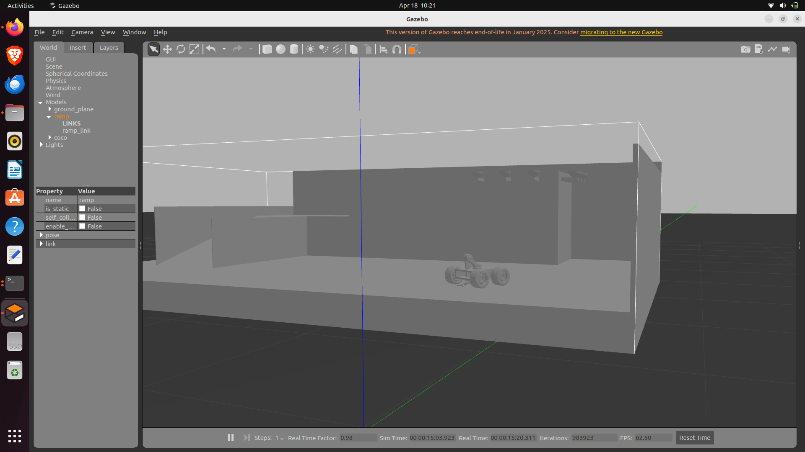

# Coco Robot — ROS2 Gazebo Simulation

A 4-wheel differential drive robot with a 3-DOF arm and gripper, simulated in Gazebo Classic with ROS2 Humble. Built to eventually support autonomous ramp traversal and pick-and-place using reinforcement learning.

---


## Repository Structure

```
coco-robot-ros2/
├── gazebo_models/          # CMake package — robot model, world, launch
│   ├── urdf/
│   │   ├── coco_robo2.urdf           # Main robot URDF
│   │   ├── abs.urdf                  # Ramp model
│   │   └── coco_arm_controller.yaml  # ros2_control config
│   ├── meshes/             # STL files for all links
│   ├── worlds/
│   │   └── coco_world.world          # Walled arena
│   └── launch/
│       └── full_world_robo.launch.py # Main launch file
└── custom_teleop/          # Python package — keyboard teleop nodes
    └── custom_teleop/
        ├── teleop_arm_node.py
        └── teleop_wheels_node.py
```

---

## Robot Description

- **Base**: 4-wheel differential drive
  - Joints: `base_Revolute-1` through `base_Revolute-4`
  - Drive: `gazebo_ros_diff_drive` plugin via `/cmd_vel`
- **Arm**: 3-DOF + 2-finger gripper
  - Joints: `m_link1_Revolute-6`, `m_link2_Revolute-7`, `m_link3_Revolute-8`, `m_link3_Revolute-9`
  - Control: `ros2_control` ForwardCommandController (position)
- **Platform**: Ramp (`abs.urdf`) with custom STL mesh
- **Wheel geometry**: radius=0.0585m, separation=0.274m

---

## Dependencies

```bash
sudo apt install ros-humble-gazebo-ros-pkgs \
                 ros-humble-ros2-control \
                 ros-humble-ros2-controllers \
                 ros-humble-gazebo-ros2-control \
                 ros-humble-diff-drive-controller \
                 ros-humble-joint-state-broadcaster \
                 ros-humble-forward-command-controller \
                 ros-humble-robot-state-publisher
```

---

## Build & Launch

```bash
cd ~/ros2_ws
colcon build --symlink-install --packages-select gazebo_models custom_teleop
source install/setup.bash
ros2 launch gazebo_models full_world_robo.launch.py
```

---

## Teleop Controls

### Wheel Teleop
```bash
ros2 run custom_teleop teleop_wheels_node
```
| Key | Action |
|-----|--------|
| w | Forward |
| s | Backward |
| a | Turn left |
| d | Turn right |
| x | Stop |
| q | Quit |

### Arm Teleop
```bash
ros2 run custom_teleop teleop_arm_node
```
| Key | Action |
|-----|--------|
| w / s | Shoulder (m_link1) |
| e / d | Elbow (m_link2) |
| r / f | Wrist (m_link3) |
| SPACE | Reset to home |
| q | Quit |

---

## Controllers

| Controller | Type | Topic |
|-----------|------|-------|
| joint_state_broadcaster | JointStateBroadcaster | /joint_states |
| m_link1_controller | ForwardCommandController | /m_link1_controller/commands |
| m_link2_controller | ForwardCommandController | /m_link2_controller/commands |
| m_link3_controller | ForwardCommandController | /m_link3_controller/commands |
| m_link3_Revolute_9_controller | ForwardCommandController | /m_link3_Revolute_9_controller/commands |

Wheels are driven directly via Gazebo plugin on `/cmd_vel`.

```bash
# Check all active controllers
ros2 control list_controllers
```

---

## Direct Topic Commands

```bash
# Drive forward
ros2 topic pub --once /cmd_vel geometry_msgs/msg/Twist "{linear: {x: 0.3}, angular: {z: 0.0}}"

# Turn left
ros2 topic pub --once /cmd_vel geometry_msgs/msg/Twist "{linear: {x: 0.0}, angular: {z: 0.5}}"

# Arm joint position (radians)
ros2 topic pub --once /m_link1_controller/commands std_msgs/msg/Float64MultiArray "{data: [0.5]}"
ros2 topic pub --once /m_link2_controller/commands std_msgs/msg/Float64MultiArray "{data: [0.5]}"
ros2 topic pub --once /m_link3_controller/commands std_msgs/msg/Float64MultiArray "{data: [0.3]}"
```

---

## Diagnostics

```bash
ros2 topic list                              # All active topics
ros2 topic echo /joint_states               # All 8 joint positions
ros2 topic echo /diff_drive_controller/odom # Wheel odometry
ros2 run tf2_tools view_frames              # TF tree
```

---

## Simulation World

The robot spawns in a walled arena (`coco_world.world`):

- Robot spawn: `(-2.0, 0.0)` facing east
- Ramp spawn: `(3.0, 0.0)`
- Walls: 12m × 7m arena
- Real-time factor: ~0.3 on integrated GPU, ~1.0 on dedicated GPU

---

## Physical Robot Control (ST3215 Servos)

```bash
# Scan servo IDs
python3 scripts/scan_ids.py

# Real-time feedback
python3 scripts/realtime_feedback.py

# Teach and replay mode
python3 scripts/teach_replay.py
```

---

## Roadmap

| Layer | Status | Description |
|-------|--------|-------------|
| Layer 1 | ✅ Complete | Xacro/URDF, ros2_control for arm, Gazebo diff drive, world file, teleop |
| Layer 2 | Planned | LiDAR + depth camera, Nav2, MoveIt2 |
| Layer 3 | Planned | RL — Gymnasium wrapper, PPO/SAC via Stable-Baselines3 |

---

## Known Issues / Future Fixes

- Real-time factor is low (~0.3) on integrated GPU — headless mode helps
- Rear two wheels are passive (front axle drives only)
- Arm can oscillate briefly at spawn before home position publishers fire
- Wheel joint axes have mixed orientations from original CAD export — accounted for in plugin config

---

## Images




## Troubleshooting

### Build Issues

**Problem**: `Package 'gazebo_models' not found`
**Solution**: Make sure you've sourced ROS2 and built the workspace:
```bash
source /opt/ros/humble/setup.bash
./build.sh
source install/setup.bash
```

**Problem**: Mesh files not loading in Gazebo
**Solution**: Rebuild with symlink-install to ensure paths are correct:
```bash
./build.sh clean
./build.sh
```

### Runtime Issues

**Problem**: Gazebo crashes or low FPS
**Solution**: 
- Use headless mode: `./run.sh gui:=false`
- Check GPU drivers: `glxinfo | grep rendering`
- Reduce physics update rate in world file

**Problem**: Controllers not loading
**Solution**: Check controller manager status:
```bash
ros2 control list_controllers
ros2 control list_hardware_interfaces
```

**Problem**: Teleop not responding
**Solution**: 
- Check if simulation is running: `ros2 topic list`
- Verify `/cmd_vel` topic exists: `ros2 topic info /cmd_vel`
- Check for timeout warnings in teleop node output

### Common Issues

**Q**: Robot spawns but doesn't move
**A**: Wait 5-10 seconds for controllers to initialize, check `ros2 control list_controllers`

**Q**: Arm oscillates at startup
**A**: Normal behavior, controllers stabilize after ~5 seconds

**Q**: "Auto-stop" warning appears immediately  
**A**: Normal safety feature, press any movement key to resume control

## System Requirements

### Minimum
- Ubuntu 22.04 LTS
- ROS2 Humble
- 4GB RAM
- Integrated GPU

### Recommended
- Ubuntu 22.04 LTS
- ROS2 Humble
- 8GB+ RAM
- Dedicated GPU (NVIDIA/AMD)
- SSD storage

### Required ROS2 Packages
All dependencies are listed in `package.xml` files. Install with:
```bash
sudo apt install ros-humble-gazebo-ros-pkgs \
                 ros-humble-ros2-control \
                 ros-humble-ros2-controllers \
                 ros-humble-gazebo-ros2-control
```

See full dependency list in README Dependencies section.

## Helper Scripts

- `./build.sh [clean]` - Build workspace (clean option removes build artifacts)
- `./run.sh [args]` - Launch Gazebo simulation  
- `./teleop.sh [wheels|arm]` - Launch teleop control
- `./rviz.sh` - Launch RViz visualization

