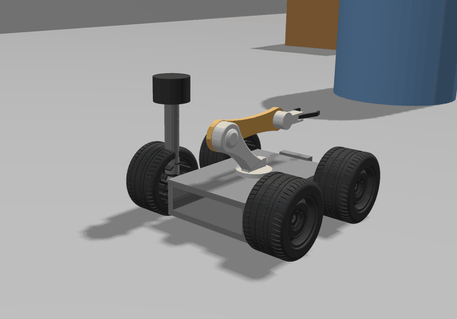
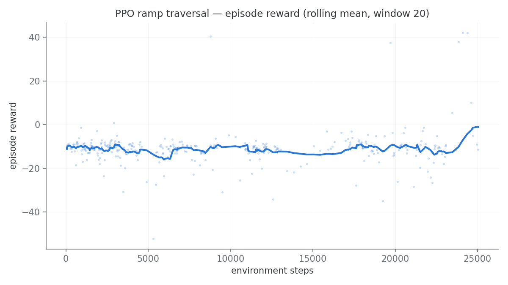
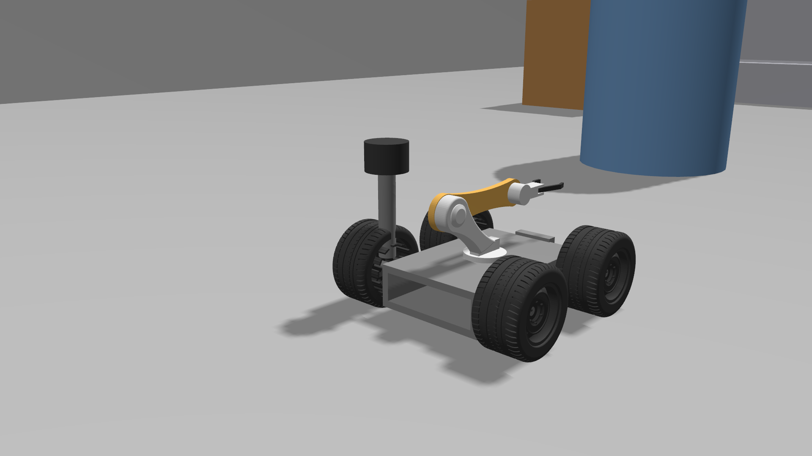
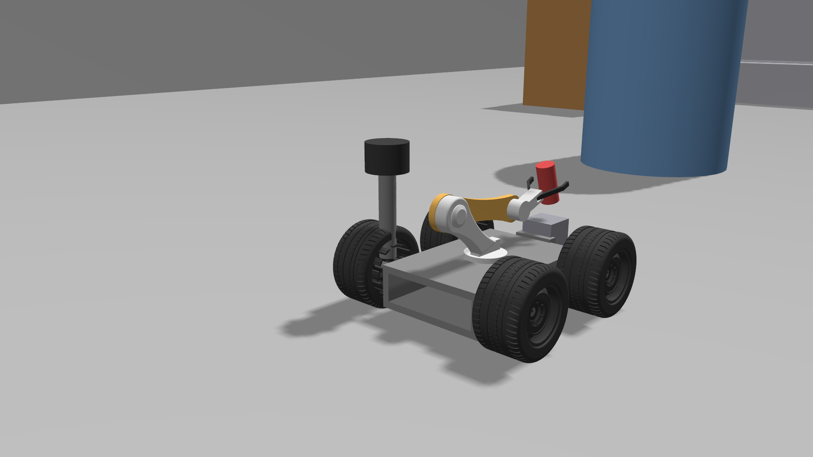
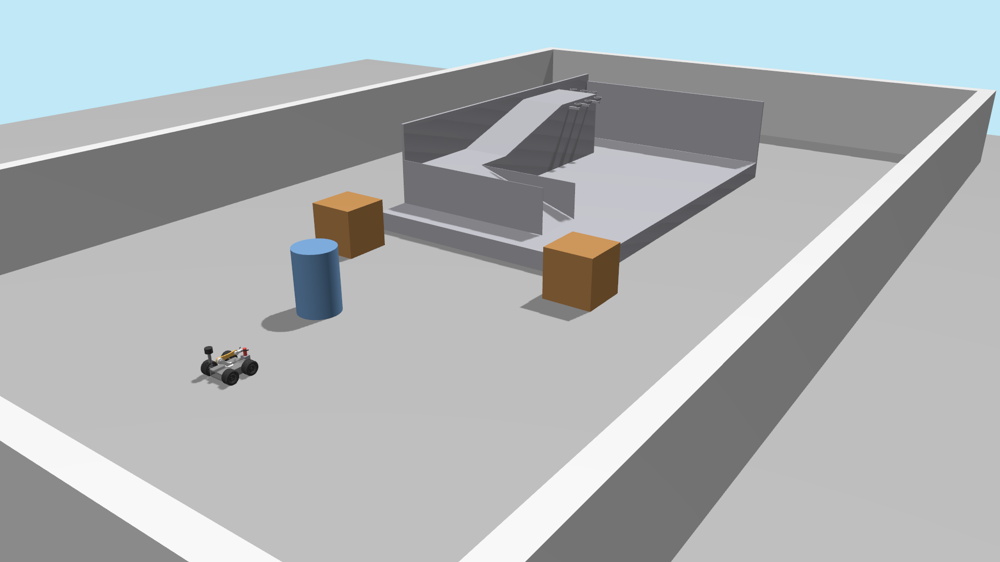
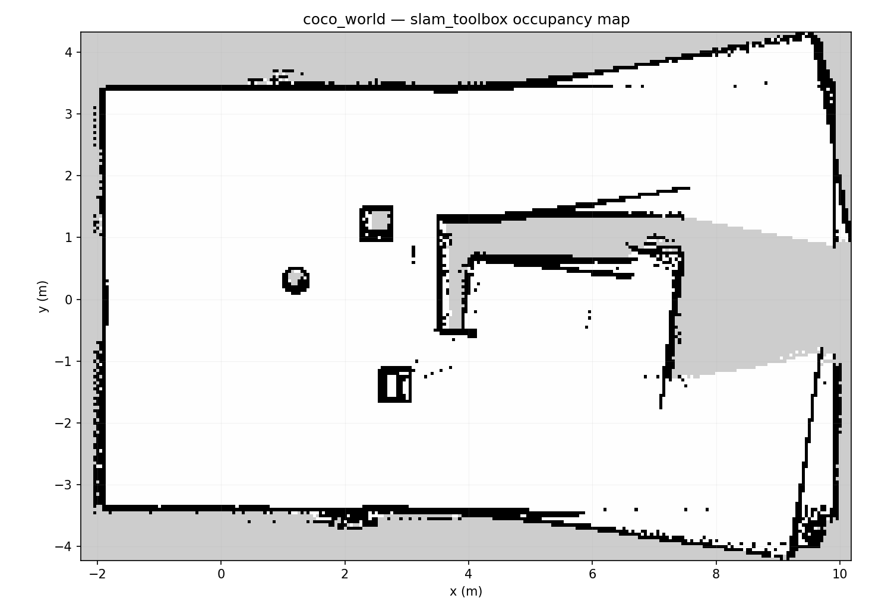
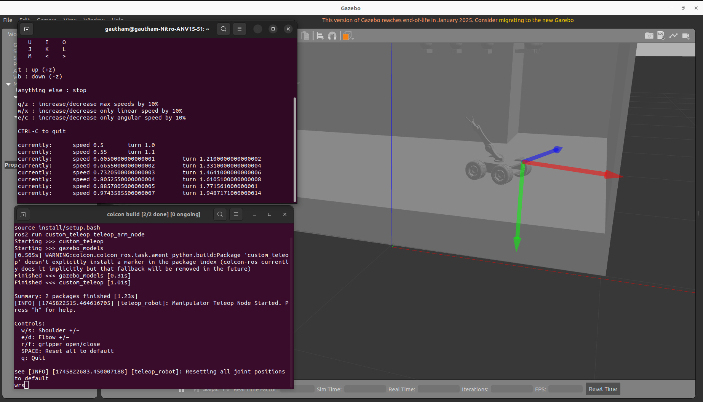

# Coco Robot — ROS 2 Jazzy + Gazebo Harmonic

A 4-wheel-drive mobile manipulator — differential-drive base, 2-DOF planar
arm, 2-finger gripper — that maps an arena, navigates it autonomously, and
picks up and puts down a cylinder. Simulated in **Gazebo Harmonic** on
**ROS 2 Jazzy**.



I built this by porting my earlier Humble/Gazebo Classic robot to
Jazzy/Harmonic, then taking it well past the port: re-rooting the CAD model
to a REP-103 z-up frame, deriving a closed-form IK solver for the arm,
caging the grasp so it survives the lift, and tuning slam_toolbox out of a
scan-matching degeneracy. Those four are written up in
**[docs/DESIGN_DECISIONS.md](docs/DESIGN_DECISIONS.md)** — problem,
diagnosis, fix, evidence.

## Results

Everything below is measured on this machine, with the reproduction command
in **[docs/RESULTS.md](docs/RESULTS.md)**.

| | Result |
|---|---|
| **Nav2 goals** | **10/10** reached, mean 17.2 s; verified to 9 cm against ground truth |
| **Pick and place** | **4/4** at the tuned target; cylinder back on the pedestal at z = 0.1280 m every run |
| **IK accuracy** | 20,000/20,000 round-trips, max error 1.7 × 10⁻¹⁶ m, 1.5 µs per solve |
| **Simulation** | RTF ≈ 1.0; every sensor at its nominal rate, measured in sim time |
| **Tests** | 92 unit + 6 launch-test cases in CI, 0 skipped |
| **RL challenge** | **Rebuilt and climbing.** Diagnosed the shipped ramp as geometrically unclimbable (~66° face), replaced it with a parametric wedge — robot now reaches the summit at a measured 18.1° pitch: [details](docs/RESULTS.md#reinforcement-learning) |

The first RL result was **0/10**, and chasing it down is the story worth
telling: the shipped ramp mesh was a CAD shell with a ~66° near-vertical face —
unclimbable by anything on wheels — and the goal only reached the ramp foot.
Both are now fixed with a parametric wedge generator, a summit goal and a
12→18→24° difficulty curriculum, and the robot demonstrably climbs (measured
18.1° pitch at the summit, reproduced across runs). The old 0/10 is kept as a
labelled *before*. A full curriculum training run is still compute-bound and
outstanding — the short smoke runs only prove the pipeline works, so no
success-rate claim is made until the curriculum actually runs.
Separately, `--target` grasp re-targeting still does **not** work (0/5 away
from the tuned point) and is reported as such rather than omitted.

> **Companion project:** [red_ball_nav](https://github.com/GauthamCodes/red_ball_nav)
> — perception-driven navigation on a TurtleBot3, working inside a
> third-party robot description rather than a custom one.

> **Start here:** [docs/RUNNING.md](docs/RUNNING.md) — exact commands for all
> six demos · [docs/ARCHITECTURE.md](docs/ARCHITECTURE.md) — node/topic graph
> and TF tree · [docs/FUTURE_WORK.md](docs/FUTURE_WORK.md) — known limitations.

---

## Highlights

- **Modern sim stack** — ported from Humble/Gazebo Classic to Jazzy/Harmonic
  (`ros_gz_sim`, `gz_ros2_control`, `ros_gz_bridge`), real-time factor ≈ 1.0
- **All-wheel drive through ros2_control** — a single `DiffDriveController`
  drives all four wheels (2 per side) and publishes odometry + TF
- **Trajectory-controlled arm** — `JointTrajectoryController` for the arm and
  gripper: holds position from the instant of activation (no free-swing at
  spawn) and is MoveIt2-ready
- **REP-103-correct model** — the robot is re-rooted on a z-up
  `base_footprint`/`base_link`, so odom/TF semantics are right and the whole
  Nav stack works on top without hacks
- **Perception** — 240° GPU lidar (`/scan`) + RGBD camera
  (`/camera/image_raw`, depth, point cloud)
- **Autonomous navigation** — slam_toolbox builds the arena map; Nav2 + AMCL
  drive the base to goal poses on the saved map
- **Collision-checked manipulation that actually holds on** — MoveIt2
  planning plus a closed-form 2-link IK; the gripper carries a cylinder
  through a full pick → lift → place cycle and sets it back down
- **Ground-truth instrumentation** — a gz `OdometryPublisher` gives absolute
  pose for RL rewards and automated world-state sanity checks (MoveIt
  "success" alone can hide a physics blow-up)
- **Tested** — 92 pytest tests run in CI on every push, across IK
  round-trips, arm joint-limit maths (including a check that they still
  match the URDF), RL reward/outcome classification, learning-curve
  parsing, the waypoint steering law and teleop; `custom_teleop` is
  additionally flake8/pep257/copyright-clean under `colcon test`. CI fails
  if the collected count drops, so a suite cannot skip itself silently

---

## Repository Structure

```
coco-robot-ros2/
├── gazebo_models/                    # ament_cmake — model, world, nav stack
│   ├── urdf/
│   │   ├── coco_robo2.xacro          # Robot model (single source of truth)
│   │   ├── coco_controllers.yaml     # ros2_control: diff drive + arm + gripper
│   │   └── ramp.sdf                  # Static ramp: parametric climbable wedge
│   ├── worlds/coco_world.world       # Walled arena + obstacles (Harmonic)
│   ├── config/
│   │   ├── bridge.yaml               # ros_gz_bridge: clock + sensor topics
│   │   ├── slam_params.yaml          # slam_toolbox (online async)
│   │   └── nav2_params.yaml          # Nav2 stack (AMCL auto-init at spawn)
│   ├── maps/coco_world.{pgm,yaml}    # Saved SLAM map of the arena
│   ├── launch/
│   │   ├── full_world_robo.launch.py # Sim: world + robot + controllers
│   │   ├── slam.launch.py            # Mapping (lifecycle-managed)
│   │   ├── nav.launch.py             # Autonomous navigation
│   │   └── rsp.launch.py             # robot_state_publisher + RViz
│   ├── scripts/
│   │   ├── gen_ramp.py               # Parametric ramp wedge generator (STL)
│   │   ├── climb_check.py            # Headless proof the robot climbs it
│   │   ├── map_drive.py              # Closed-loop mapping drive
│   │   └── verify_sim.py             # One-shot graph/sensor health check
│   └── meshes/                       # STL visuals + ramp_wedge_{12,18,24}.stl
├── custom_teleop/                    # ament_python — teleop + glue nodes
│   └── custom_teleop/
│       ├── teleop_wheels_node.py     # Keyboard base teleop (TwistStamped)
│       ├── teleop_arm_node.py        # Keyboard arm teleop (JointTrajectory)
│       └── cmd_vel_relay.py          # Nav2 /cmd_vel -> DiffDriveController
├── coco_moveit_config/               # MoveIt2: SRDF, move_group launch,
│   └── scripts/pick_place.py         #   collision-checked pick-and-place demo
├── coco_web/                         # Browser panel: rosbridge + roslibjs
│   └── web/index.html                #   joystick / arm sliders / camera / map
├── coco_rl/                          # Gymnasium env + SB3 PPO training
│   └── coco_rl/ramp_env.py           #   ramp-traversal environment
├── coco_config/                      # Shared params + diagnostics nodes
├── .github/workflows/ci.yml          # Build + model validation + tests
├── Dockerfile, docker-compose.yml    # Full stack on osrf/ros:jazzy-desktop
├── setup_env.sh                      # Per-terminal env setup (source this)
├── verify_all.sh                     # One-command end-to-end verification
├── train_curriculum.sh               # Unattended 12°→18°→24° PPO curriculum
└── docs/                             # RUNNING.md, FUTURE_WORK.md, images
```

---

## Robot Description

| Subsystem | Details |
|---|---|
| Base | 4 driven wheels, differential (skid) steer; radius 0.0585 m, track 0.274 m |
| Drive control | `diff_drive_controller/DiffDriveController` (all 4 wheels, velocity interfaces) |
| Arm | 2 revolute joints (shoulder `m_link1_Revolute-6`, elbow `m_link2_Revolute-7`) via `arm_controller` (JTC) |
| Gripper | 2 finger joints (`m_link3_Revolute-8/-9`) via `gripper_controller` (JTC) |
| Lidar | 240° front arc, 480 samples, 0.15–12 m, 10 Hz (`gpu_lidar`) |
| Camera | RGBD 320×240 @ 15 Hz, RGB + depth + point cloud |
| Frames | `map → odom → base_footprint → base_link → …` (REP-103 z-up) |

> **Model note:** the CAD export used a Y-up frame and originally mounted the
> arm bracket on the chassis *bottom* — the robot literally rested on its own
> elbow, which caused the low real-time factor and the arm oscillation at
> spawn documented in earlier revisions. The xacro re-roots the model z-up
> and mounts the arm on the top face; RTF went from ~0.23 to ~1.0.

---

## Prerequisites

Ubuntu 24.04, ROS 2 Jazzy, Gazebo Harmonic (`gz-sim` 8.x).

```bash
sudo apt install ros-jazzy-ros-gz ros-jazzy-gz-ros2-control \
                 ros-jazzy-ros2-control ros-jazzy-ros2-controllers \
                 ros-jazzy-navigation2 ros-jazzy-nav2-bringup \
                 ros-jazzy-slam-toolbox ros-jazzy-xacro \
                 ros-jazzy-rmw-cyclonedds-cpp
```

`rmw-cyclonedds-cpp` is not optional: `setup_env.sh` selects it as the RMW,
so without the deb nothing starts. Demos 4–5 additionally need
`ros-jazzy-moveit`, `ros-jazzy-rosbridge-suite` and
`ros-jazzy-web-video-server` — see those sections.

## Build

```bash
mkdir -p ~/ros2_ws/src && cd ~/ros2_ws/src
git clone https://github.com/GauthamCodes/coco-robot-ros2.git

cd ~/ros2_ws
rosdep install --from-paths src --ignore-src -r -y     # optional but recommended
colcon build --symlink-install --packages-select \
  gazebo_models custom_teleop coco_config coco_moveit_config coco_web coco_rl
source install/setup.bash
```

(Or `source src/coco-robot-ros2/setup_env.sh` in each terminal — it sources
ROS + the workspace and picks a working render engine automatically.)

### Container

`Dockerfile` and `docker-compose.yml` build the whole stack on
`osrf/ros:jazzy-desktop`, including the MoveIt / rosbridge / web-video-server
debs that this dev machine runs from a user-space prefix. They are provided
for reproducibility and have **not** been runtime-tested here (no Docker on
the dev box) — see `docs/FUTURE_WORK.md`.

```bash
docker compose build && docker compose up
```

---

## 1. Simulation + teleop

```bash
ros2 launch gazebo_models full_world_robo.launch.py          # gui:=false for headless
```

Spawns the arena, ramp and robot, and activates four controllers
(`joint_state_broadcaster`, `diff_drive_controller`, `arm_controller`,
`gripper_controller`).

```bash
# Base teleop (TwistStamped — Jazzy's diff_drive_controller is stamped-only)
ros2 run custom_teleop teleop_wheels_node

# Arm/gripper teleop (JointTrajectory)
ros2 run custom_teleop teleop_arm_node
```

Direct topic commands:

```bash
# Drive forward
ros2 topic pub -r 10 /diff_drive_controller/cmd_vel geometry_msgs/msg/TwistStamped \
  "{twist: {linear: {x: 0.3}}}"

# Arm to a pose (shoulder, elbow — radians)
ros2 topic pub --once /arm_controller/joint_trajectory trajectory_msgs/msg/JointTrajectory \
  "{joint_names: [m_link1_Revolute-6, m_link2_Revolute-7],
    points: [{positions: [-1.2, -0.5], time_from_start: {sec: 2}}]}"

# Gripper open / close (fingers mirror)
ros2 topic pub --once /gripper_controller/joint_trajectory trajectory_msgs/msg/JointTrajectory \
  "{joint_names: [m_link3_Revolute-8, m_link3_Revolute-9],
    points: [{positions: [0.5, -0.5], time_from_start: {sec: 1}}]}"
```

## 2. Mapping (slam_toolbox)

```bash
ros2 launch gazebo_models slam.launch.py       # lifecycle: auto-configures + activates
ros2 run gazebo_models map_drive.py            # or drive manually

ros2 run nav2_map_server map_saver_cli \
  -f src/coco-robot-ros2/gazebo_models/maps/coco_world \
  --ros-args -p use_sim_time:=true
```

A saved map of `coco_world` ships with the package, so this step is optional.

## 3. Autonomous navigation (Nav2)

```bash
ros2 launch gazebo_models nav.launch.py
```

AMCL auto-initialises at the spawn pose (the map frame is anchored there —
slam_toolbox sets the map origin at its start pose). Then:

```bash
ros2 action send_goal /navigate_to_pose nav2_msgs/action/NavigateToPose \
  "{pose: {header: {frame_id: map}, pose: {position: {x: 1.0, y: 0.0}, orientation: {w: 1.0}}}}"
```

Nav2's output (`/cmd_vel`, TwistStamped) reaches the wheels through the
`cmd_vel_relay` node started by `nav.launch.py`.

---

## 4. MoveIt2 pick-and-place

```bash
sudo apt install ros-jazzy-moveit    # see docs/RUNNING.md Demo 4

ros2 launch gazebo_models full_world_robo.launch.py
ros2 launch coco_moveit_config move_group.launch.py
ros2 run coco_moveit_config pick_place.py
```

The demo spawns a pedestal + cylinder behind the robot (the arm's
workspace), mirrors them into the MoveIt planning scene, and runs a fully
collision-checked 13-step sequence: move up → open gripper → stage scene
objects → hover above target → allow gripper-target contact → grasp
approach → close gripper → raise → lift → place → release → retreat above
target → home. The grasp poses come from a closed-form 2-link IK
(`arm_ik.py`, unit-tested to 1e-9 round-trip
accuracy), gripper–target contact is only allowed in the
AllowedCollisionMatrix once the gripper hovers directly above the target,
and ground-truth pose checks before/after the run make a physics blow-up
impossible to miss. The cylinder is **carried through the whole arc** and
set back down on its pedestal — fingertip end-stop lips cage it against
sliding off the rigid pads.


*(The full sequence at ~3× speed: stage → hover → grasp → carry → place →
home. Stills: [mid-carry](docs/images/pick_carry.png),
[placing back](docs/images/pick_place_return.png).)*

`pick_place.py --target X Z` re-solves the IK and re-sizes the pedestal for
a different grasp point. **The IK re-targeting works; the grasp does not
generalise** — measured 0/5 on nearby targets, against 4/4 at the shipped
one. Reachable IK turns out to be necessary but not sufficient: the
approach path, the re-placed pedestal and the fingertip geometry must all
agree, and outside the tuned point they do not. The run aborts naming the
failed step rather than reporting success. Numbers in
[docs/RESULTS.md](docs/RESULTS.md#pick-and-place).

## 5. Browser control panel

```bash
sudo apt install ros-jazzy-rosbridge-suite ros-jazzy-web-video-server

ros2 launch coco_web web.launch.py
# open http://<robot-ip>:8000 from any device on the same network
```

Single-page panel (vendored roslibjs + nipplejs, no CDN needed):
- virtual joystick → `/diff_drive_controller/cmd_vel` (TwistStamped)
- shoulder / elbow / gripper sliders → the JointTrajectoryControllers
- live MJPEG camera stream (web_video_server, port 8081)
- occupancy-grid map view with **click-to-navigate** (`/goal_pose` → Nav2)
- Teleop / Autonomous mode toggle

## 6. RL ramp traversal (Gymnasium + PPO)

```bash
pip install --user --break-system-packages gymnasium stable-baselines3 \
    torch --index-url https://download.pytorch.org/whl/cpu
# CPU torch on purpose: the MLP policy is tiny and the simulator (RTF ~1)
# is the bottleneck, so the ~5 GB CUDA build buys nothing here.

ros2 launch gazebo_models full_world_robo.launch.py gui:=false
python3 -m coco_rl.train_ppo --steps 1024          # smoke test (~3 min)
python3 -m coco_rl.train_ppo --steps 200000 --fast # real training
```

`coco_rl.ramp_env.CocoRampEnv` wraps the *running* simulation:
continuous `[linear, angular]` actions → `cmd_vel`; observations from
odometry + IMU (pose, velocity, roll/pitch); episode reset teleports the
robot with the Gazebo `set_pose` service; reward = forward progress
− tilt penalty, terminal on tip-over or reaching the ramp-top region
(reward math lives in pure, unit-tested functions in `coco_rl.reward`).
Rewards use the **ground-truth pose** from a gz `OdometryPublisher`
plugin — wheel odometry under-reads on the ramp slope. The env steps on
**sim time**, so `--fast` (which unlocks the physics real-time-factor cap
for the run and restores it afterwards) transparently speeds up training.



**47k steps, 528 episodes** (one run, checkpoint-resumed at 25k). The
honest read: PPO has **not** solved this task yet. The rolling mean sits
between −11 and −13 for essentially the whole run. Around 18–20k steps a
handful of episodes do reach the goal region (+40 returns, rolling mean
briefly touching +4), but the policy does not hold onto that behaviour
and settles back. Deterministic evaluation of the 25k checkpoint scores
**0/10** — no tip-overs, but ten timeouts:

```
$ python3 -m coco_rl.evaluate ppo50k_25000_steps.zip --episodes 10 --fast
episode  1: timeout return   -8.50  steps 400
...
success rate: 0/10 (0%)  tipped: 0  timeout: 10
```

So what is finished is the **infrastructure**, not the policy: the env,
ground-truth reward path, sim-time stepping, fast physics, checkpoint /
resume, domain randomization, deterministic evaluation and curve plotting
all work end-to-end and are unit-tested. What is missing is compute —
47k steps is roughly an order of magnitude short for this task on a
CPU-bound simulator (~1–8 env steps/s here). See FUTURE_WORK item 9.

---

## Controllers

| Controller | Type | Command topic |
|---|---|---|
| `joint_state_broadcaster` | JointStateBroadcaster | — (publishes `/joint_states`) |
| `diff_drive_controller` | DiffDriveController | `/diff_drive_controller/cmd_vel` (TwistStamped) |
| `arm_controller` | JointTrajectoryController | `/arm_controller/joint_trajectory` |
| `gripper_controller` | JointTrajectoryController | `/gripper_controller/joint_trajectory` |

```bash
ros2 control list_controllers
```

## Key Topics

| Topic | Type | Direction |
|---|---|---|
| `/scan` | `sensor_msgs/LaserScan` | lidar → SLAM / Nav2 costmaps |
| `/camera/image_raw`, `/camera/depth/image_raw`, `/camera/points` | Image / PointCloud2 | camera out |
| `/diff_drive_controller/odom` | `nav_msgs/Odometry` | wheel odometry |
| `/cmd_vel` | `geometry_msgs/TwistStamped` | Nav2 out → relay → wheels |
| `/map` | `nav_msgs/OccupancyGrid` | SLAM / map server |

---

## Troubleshooting

| Problem | Fix |
|---|---|
| Robot doesn't move on `/cmd_vel` | Jazzy's `diff_drive_controller` accepts **TwistStamped only**, on `/diff_drive_controller/cmd_vel`; plain Twist is ignored |
| slam_toolbox silent, no `/map` | It's a lifecycle node — use `slam.launch.py` (auto configure+activate) or `ros2 lifecycle set /slam_toolbox configure` then `activate` |
| Nav2 goal rejected / TF errors | Robot must start at the spawn pose — the AMCL initial pose in `nav2_params.yaml` is map (0,0) = spawn |
| Planner "failed to create plan" | Goal is in unobserved (gray) map space — pick a goal inside the mapped area or extend the map |
| Low real-time factor | Run headless (`gui:=false`); check the GPU is used for the lidar (`__EGL_VENDOR_LIBRARY_FILENAMES` for NVIDIA) |


---

## Roadmap

| Layer | Status | Description |
|-------|--------|-------------|
| 1 | ✅ | Jazzy/Harmonic port, z-up model, 4WD ros2_control, JTC arm, RTF ≈ 1.0 |
| 2 | ✅ | Lidar + RGBD camera, slam_toolbox mapping, Nav2 autonomous navigation |
| 3 | ✅ | MoveIt2 arm planning + collision-checked pick-and-place |
| 4 | ✅ | Browser control panel (rosbridge + roslibjs + web_video_server) |
| 5 | ✅ infra / 🧗 curriculum challenge | RL: Gymnasium env + PPO with ground-truth rewards, fast physics, resume, randomization, seeding, deterministic eval — all verified and unit-tested. The original 47k-step policy scored 0/10; that was traced to a **geometrically unclimbable ramp mesh** (~66° face) and a goal that only reached the ramp foot. Rebuilt into a genuinely climbable **parametric wedge + 12→18→24° curriculum** (`gen_ramp.py`, summit goal) — the robot now reaches the summit under drive at a measured 18.1° pitch. Full curriculum training is still compute-bound at ~1–8 env steps/s — scaling paths in [FUTURE_WORK](docs/FUTURE_WORK.md) item 9 |

Layer 5's infrastructure is complete and unit-tested, and the ramp is now
climbable by construction rather than by luck — verified end to end with
`./verify_all.sh`. The original 0/10 is kept as a labelled *before*, alongside
the diagnosis (mesh profiling → 66°/39° faces → the goal was the foot) and the
engineered replacement, because a portfolio that hides its negative results is
not evidence of judgement. See
[docs/RESULTS.md](docs/RESULTS.md#reinforcement-learning) and
[DESIGN_DECISIONS.md](docs/DESIGN_DECISIONS.md#diagnosing-and-replacing-the-unclimbable-ramp).

## Images

All screenshots are from the current Jazzy/Harmonic build.

| | |
|---|---|
|  |  |
| The mobile manipulator: 4WD base, 2-DOF arm, 2-finger gripper, lidar mast, RGBD camera | Mid-carry: the cylinder is held through the full lift arc |
|  |  |
| The arena: obstacles, walled ramp structure, 12 m × 7 m | slam_toolbox occupancy map from the scripted mapping drive |
|  |  |
| PPO return over 528 episodes — the rolling mean never escapes −11…−13 | Keyboard arm teleop through the JointTrajectoryController |

Browser control panel (Layer 4, from the original build — UI unchanged):


## License

Apache-2.0 — see [LICENSE](LICENSE).
