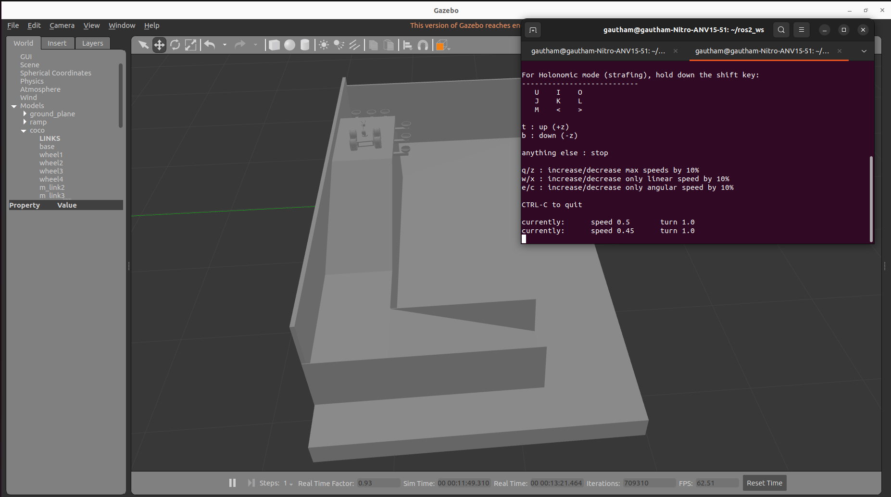

# Coco Robot — ROS 2 Jazzy + Gazebo Harmonic

A 4-wheel-drive mobile manipulator (differential-drive base + 3-DOF arm +
2-finger gripper) simulated in **Gazebo Harmonic** on **ROS 2 Jazzy**, with
lidar/RGBD perception, **slam_toolbox** mapping and fully autonomous
**Nav2** navigation.


---

## Highlights

- **Modern sim stack** — ported from Humble/Gazebo Classic to Jazzy/Harmonic
  (`ros_gz_sim`, `gz_ros2_control`, `ros_gz_bridge`), real-time factor ≈ 1.0
- **All-wheel drive through ros2_control** — a single `DiffDriveController`
  drives all four wheels (2 per side) and publishes odometry + TF
- **Trajectory-controlled arm** — `JointTrajectoryController` for the arm and
  gripper: holds position from the instant of activation (no free-swing at
  spawn) and is MoveIt2-ready
- **REP-103-correct model** — the robot is re-rooted on a z-up
  `base_footprint`/`base_link`, so odom/TF semantics are right and the whole
  Nav stack works on top without hacks
- **Perception** — 240° GPU lidar (`/scan`) + RGBD camera
  (`/camera/image_raw`, depth, point cloud)
- **Autonomous navigation** — slam_toolbox builds the arena map; Nav2 + AMCL
  drive the base to goal poses on the saved map

---

## Repository Structure

```
coco-robot-ros2/
├── gazebo_models/                    # ament_cmake — model, world, nav stack
│   ├── urdf/
│   │   ├── coco_robo2.xacro          # Robot model (single source of truth)
│   │   ├── coco_controllers.yaml     # ros2_control: diff drive + arm + gripper
│   │   └── ramp.sdf                  # Static ramp (Harmonic SDF)
│   ├── worlds/coco_world.world       # Walled arena + obstacles (Harmonic)
│   ├── config/
│   │   ├── bridge.yaml               # ros_gz_bridge: clock + sensor topics
│   │   ├── slam_params.yaml          # slam_toolbox (online async)
│   │   └── nav2_params.yaml          # Nav2 stack (AMCL auto-init at spawn)
│   ├── maps/coco_world.{pgm,yaml}    # Saved SLAM map of the arena
│   ├── launch/
│   │   ├── full_world_robo.launch.py # Sim: world + robot + controllers
│   │   ├── slam.launch.py            # Mapping (lifecycle-managed)
│   │   ├── nav.launch.py             # Autonomous navigation
│   │   └── rsp.launch.py             # robot_state_publisher only (RViz)
│   ├── scripts/map_drive.py          # Scripted mapping drive pattern
│   └── meshes/                       # STL visuals
├── custom_teleop/                    # ament_python — teleop + glue nodes
│   └── custom_teleop/
│       ├── teleop_wheels_node.py     # Keyboard base teleop (TwistStamped)
│       ├── teleop_arm_node.py        # Keyboard arm teleop (JointTrajectory)
│       └── cmd_vel_relay.py          # Nav2 /cmd_vel -> DiffDriveController
└── coco_config/                      # Shared parameter package
```

---

## Robot Description

| Subsystem | Details |
|---|---|
| Base | 4 driven wheels, differential (skid) steer; radius 0.0585 m, track 0.274 m |
| Drive control | `diff_drive_controller/DiffDriveController` (all 4 wheels, velocity interfaces) |
| Arm | 2 revolute joints (shoulder `m_link1_Revolute-6`, elbow `m_link2_Revolute-7`) via `arm_controller` (JTC) |
| Gripper | 2 finger joints (`m_link3_Revolute-8/-9`) via `gripper_controller` (JTC) |
| Lidar | 240° front arc, 480 samples, 0.15–12 m, 10 Hz (`gpu_lidar`) |
| Camera | RGBD 320×240 @ 15 Hz, RGB + depth + point cloud |
| Frames | `map → odom → base_footprint → base_link → …` (REP-103 z-up) |

> **Model note:** the CAD export used a Y-up frame and originally mounted the
> arm bracket on the chassis *bottom* — the robot literally rested on its own
> elbow, which caused the low real-time factor and the arm oscillation at
> spawn documented in earlier revisions. The xacro re-roots the model z-up
> and mounts the arm on the top face; RTF went from ~0.23 to ~1.0.

---

## Prerequisites

Ubuntu 24.04, ROS 2 Jazzy, Gazebo Harmonic (`gz-sim` 8.x).

```bash
sudo apt install ros-jazzy-ros-gz ros-jazzy-gz-ros2-control \
                 ros-jazzy-ros2-control ros-jazzy-ros2-controllers \
                 ros-jazzy-navigation2 ros-jazzy-nav2-bringup \
                 ros-jazzy-slam-toolbox ros-jazzy-xacro
```

## Build

```bash
cd ~/ros2_ws
colcon build --symlink-install --packages-select gazebo_models custom_teleop coco_config
source install/setup.bash
```

---

## 1. Simulation + teleop

```bash
ros2 launch gazebo_models full_world_robo.launch.py          # gui:=false for headless
```

Spawns the arena, ramp and robot, and activates four controllers
(`joint_state_broadcaster`, `diff_drive_controller`, `arm_controller`,
`gripper_controller`).

```bash
# Base teleop (TwistStamped — Jazzy's diff_drive_controller is stamped-only)
ros2 run custom_teleop teleop_wheels_node

# Arm/gripper teleop (JointTrajectory)
ros2 run custom_teleop teleop_arm_node
```

Direct topic commands:

```bash
# Drive forward
ros2 topic pub -r 10 /diff_drive_controller/cmd_vel geometry_msgs/msg/TwistStamped \
  "{twist: {linear: {x: 0.3}}}"

# Arm to a pose (shoulder, elbow — radians)
ros2 topic pub --once /arm_controller/joint_trajectory trajectory_msgs/msg/JointTrajectory \
  "{joint_names: [m_link1_Revolute-6, m_link2_Revolute-7],
    points: [{positions: [-1.2, -0.5], time_from_start: {sec: 2}}]}"

# Gripper open / close (fingers mirror)
ros2 topic pub --once /gripper_controller/joint_trajectory trajectory_msgs/msg/JointTrajectory \
  "{joint_names: [m_link3_Revolute-8, m_link3_Revolute-9],
    points: [{positions: [0.5, -0.5], time_from_start: {sec: 1}}]}"
```

## 2. Mapping (slam_toolbox)

```bash
ros2 launch gazebo_models slam.launch.py       # lifecycle: auto-configures + activates
python3 src/coco-robot-ros2/gazebo_models/scripts/map_drive.py   # or drive manually

ros2 run nav2_map_server map_saver_cli \
  -f src/coco-robot-ros2/gazebo_models/maps/coco_world \
  --ros-args -p use_sim_time:=true
```

A saved map of `coco_world` ships with the package, so this step is optional.

## 3. Autonomous navigation (Nav2)

```bash
ros2 launch gazebo_models nav.launch.py
```

AMCL auto-initialises at the spawn pose (the map frame is anchored there —
slam_toolbox sets the map origin at its start pose). Then:

```bash
ros2 action send_goal /navigate_to_pose nav2_msgs/action/NavigateToPose \
  "{pose: {header: {frame_id: map}, pose: {position: {x: 1.0, y: 0.0}, orientation: {w: 1.0}}}}"
```

Nav2's output (`/cmd_vel`, TwistStamped) reaches the wheels through the
`cmd_vel_relay` node started by `nav.launch.py`.

---

## Controllers

| Controller | Type | Command topic |
|---|---|---|
| `joint_state_broadcaster` | JointStateBroadcaster | — (publishes `/joint_states`) |
| `diff_drive_controller` | DiffDriveController | `/diff_drive_controller/cmd_vel` (TwistStamped) |
| `arm_controller` | JointTrajectoryController | `/arm_controller/joint_trajectory` |
| `gripper_controller` | JointTrajectoryController | `/gripper_controller/joint_trajectory` |

```bash
ros2 control list_controllers
```

## Key Topics

| Topic | Type | Direction |
|---|---|---|
| `/scan` | `sensor_msgs/LaserScan` | lidar → SLAM / Nav2 costmaps |
| `/camera/image_raw`, `/camera/depth/image_raw`, `/camera/points` | Image / PointCloud2 | camera out |
| `/diff_drive_controller/odom` | `nav_msgs/Odometry` | wheel odometry |
| `/cmd_vel` | `geometry_msgs/TwistStamped` | Nav2 out → relay → wheels |
| `/map` | `nav_msgs/OccupancyGrid` | SLAM / map server |

---

## Troubleshooting

| Problem | Fix |
|---|---|
| Robot doesn't move on `/cmd_vel` | Jazzy's `diff_drive_controller` accepts **TwistStamped only**, on `/diff_drive_controller/cmd_vel`; plain Twist is ignored |
| slam_toolbox silent, no `/map` | It's a lifecycle node — use `slam.launch.py` (auto configure+activate) or `ros2 lifecycle set /slam_toolbox configure` then `activate` |
| Nav2 goal rejected / TF errors | Robot must start at the spawn pose — the AMCL initial pose in `nav2_params.yaml` is map (0,0) = spawn |
| Planner "failed to create plan" | Goal is in unobserved (gray) map space — pick a goal inside the mapped area or extend the map |
| Low real-time factor | Run headless (`gui:=false`); check the GPU is used for the lidar (`__EGL_VENDOR_LIBRARY_FILENAMES` for NVIDIA) |

---

## 4. MoveIt2 pick-and-place

```bash
sudo apt install ros-jazzy-moveit    # or see coco_moveit_config/README notes

ros2 launch gazebo_models full_world_robo.launch.py
ros2 launch coco_moveit_config move_group.launch.py
ros2 run coco_moveit_config pick_place.py
```

The demo spawns a pedestal + cylinder in front of the robot, mirrors them
into the MoveIt planning scene (the cylinder goes into the
AllowedCollisionMatrix for the gripper links), and runs a fully
collision-checked joint-space sequence: up → open → pregrasp → grasp →
close → raise → lift → place → open → home. Deep-reach poses that would
scrape the chassis are rejected by the planner — self-collision checking
against the real collision geometry. Known limitation: the rigid 7 mm CAD
fingers pinch and drag the cylinder but cannot hold it through the whole
lift arc; compliant fingertips would fix this on hardware.

## 5. Browser control panel

```bash
sudo apt install ros-jazzy-rosbridge-suite ros-jazzy-web-video-server

ros2 launch coco_web web.launch.py
# open http://<robot-ip>:8000 from any device on the same network
```

Single-page panel (vendored roslibjs + nipplejs, no CDN needed):
- virtual joystick → `/diff_drive_controller/cmd_vel` (TwistStamped)
- shoulder / elbow / gripper sliders → the JointTrajectoryControllers
- live MJPEG camera stream (web_video_server, port 8081)
- occupancy-grid map view with **click-to-navigate** (`/goal_pose` → Nav2)
- Teleop / Autonomous mode toggle

## 6. RL ramp traversal (Gymnasium + PPO)

```bash
pip install --user --break-system-packages gymnasium stable-baselines3 \
    torch --index-url https://download.pytorch.org/whl/cpu
# CPU torch on purpose: the MLP policy is tiny and the simulator (RTF ~1)
# is the bottleneck, so the ~5 GB CUDA build buys nothing here.

ros2 launch gazebo_models full_world_robo.launch.py gui:=false
python3 -m coco_rl.train_ppo --steps 1024        # smoke test (~3 min)
python3 -m coco_rl.train_ppo --steps 200000      # real training (overnight)
```

`coco_rl.ramp_env.CocoRampEnv` wraps the *running* simulation:
continuous `[linear, angular]` actions → `cmd_vel`; observations from
odometry + IMU (pose, velocity, roll/pitch); episode reset teleports the
robot with the Gazebo `set_pose` service; reward = forward progress
− tilt penalty, terminal on tip-over or reaching the ramp-top region.

---

## Roadmap

| Layer | Status | Description |
|-------|--------|-------------|
| 1 | ✅ | Jazzy/Harmonic port, z-up model, 4WD ros2_control, JTC arm, RTF ≈ 1.0 |
| 2 | ✅ | Lidar + RGBD camera, slam_toolbox mapping, Nav2 autonomous navigation |
| 3 | ✅ | MoveIt2 arm planning + collision-checked pick-and-place |
| 4 | ✅ | Browser control panel (rosbridge + roslibjs + web_video_server) |
| 5 | ✅ | RL scaffold: Gymnasium env + PPO training loop (verified); full policy training is an overnight run |

## Images



