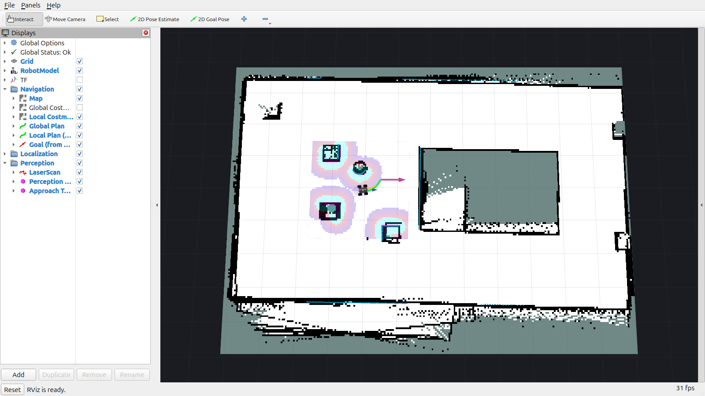
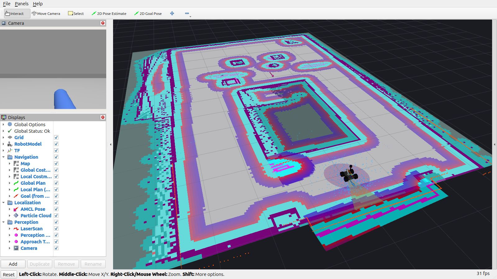
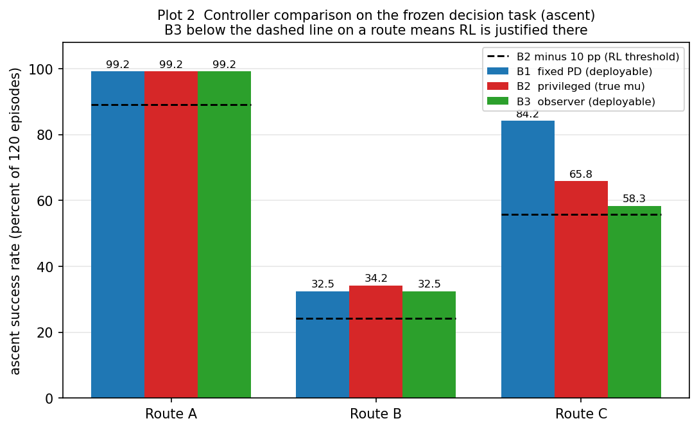

# COCO 2.0 — Autonomous Mobile Manipulator

**ROS 2 Jazzy · Gazebo Harmonic · Nav2 · MoveIt 2**

A 4-wheel differential-drive base with a 2-DOF planar arm that drives out
across an arena, climbs a ramp under a learned policy, identifies a
colour-selected cylinder by sight, picks it up from a raised platform,
carries it home and puts it down — deciding for itself, at every step,
whether the step actually worked.


| | |
|---|---|
| **Perception** | the target's position is *measured*, not assumed — 60 benchmark placements, 8 live grasps |
| **Terrain-aware control** | grade and traction estimated from the IMU and the wheels, published and not driven |
| **Autonomous navigation** | Nav2 on the flat, with arrival verified against world pose rather than the action result |
| **Manipulation** | MoveIt 2 plus a closed-form 2-link IK, driven by the measured pose |
| **Mission executive** | 19 explicit states with per-state contracts, timeouts, retries and structured failure reasons |
| **Localization health + recovery** | a scan-vs-map consistency signal, a persistence requirement, a safe stop proved at the arbiter, and a bounded recovery that verifies health before resuming |

### Start here

* **[HOW_TO_RUN.md](HOW_TO_RUN.md)** — every verified command: clone,
  build, launch, run a mission, the demonstrations, the tests, cleanup
* **[docs/ARCHITECTURE.md](docs/ARCHITECTURE.md)** — the packages, the
  four control paradigms, and who owns the wheels in each state
* **[docs/RESULTS.md](docs/RESULTS.md)** — every measured number, with
  the run that produced it
* **[docs/DESIGN_DECISIONS.md](docs/DESIGN_DECISIONS.md)** — problem,
  diagnosis, fix, evidence

---

## Results

Every number below was produced by a run on this machine. Each is marked
**measured** or **derived** in `docs/RESULTS.md`, alongside the command
that reproduces it; anything not yet measured says so rather than being
estimated.

▶ **[Watch the fetch mission end to end](https://github.com/GauthamCodes/coco-robot-ros2/releases/download/m6-fetch-demo/coco_fetch_demo.mp4)**
— one continuous uncut run, split-screen Gazebo and RViz, 75 s.

| | Result |
|---|---|
| **Fetch mission** | **19/20** over five runs of each of the four colours, fresh simulator every run. The base stopped inside a **5.5 mm** approach window **20/20** (sd 0.6 mm) and the grasp held **20/20** (lift 33.9–35.9 mm, ground truth). The one failure picked its target and then could not localise its way home: [details](docs/RESULTS.md#the-fetch-matrix--20-runs-5-per-colour) |
| **Perception** | **60/60** placements measured, 720/720 frames detected, horizontal error **0.7 / 1.4 / 2.4 mm** (min/median/max). Driving a real grasp: **8/8** picks physically verified by reading the object's own height out of the simulator, not by trusting an action result |
| **Mission executive** | A full fetch through all 16 nominal states with `retries=0` and no failure reason at any sample; then four live failure injections, which it handled **unchanged** |
| **Localization health** | The scan-vs-map signal fires **0 times** across two whole healthy missions (1714 and 1753 samples) and three healthy recorded legs, and detects an injected 3 m pose error from robot-observable information alone. AMCL covariance is measured to be the **wrong** signal — it moved the *wrong way* at the divergence |
| **Terrain estimation** | Grade is observable to **0.1–1.4° MAE**. Coulomb friction is measured **not identifiable** on this robot: τ spans **0.0003** across a μ span of 0.35 |
| **RL challenge** | **Solved — 10/10.** A PPO policy summits the ramp, evaluated deterministically at **10/10 on both the 18° and 24° grades**, re-verified 10/10 after the ramp rebuild without retraining |
| **Navigation** | **10/10** goals on a ten-goal tour (mean 34.7 s, 36.3 m driven, home to within 12 cm), planned by A\* — `SmacPlanner2D`, **6.2 % shorter** than the Dijkstra it replaced |
| **IK accuracy** | 20,000/20,000 round-trips, max error 1.7 × 10⁻¹⁶ m, 1.5 µs per solve |
| **Training throughput** | **3,712 steps/s at 8 workers = 427×** real time in headless MuJoCo; cross-engine parity **0.242 mm** worst case over 264 settle probes (**0.138 mm** geometric, the rest a constant compliance offset) |
| **Simulation** | RTF ≈ 1.0; every sensor at its nominal rate, measured in sim time |
| **Tests** | **829** passing across eight packages, **0 failures, 0 skipped**. Run per package on a clean ROS graph — [how](HOW_TO_RUN.md#test-suite) |

---

## Known limitations

These are current, reproducible, and deliberately not rounded up.

* **Severe localization divergence is detected but not reliably
  recovered.** The monitor sees a 3 m confidently-wrong pose and the
  executive safe-stops and re-seeds AMCL, but the mission does not get
  home. Two measured causes, neither in the executive:
  `recovery_alpha_fast/slow` are `0.0`, so AMCL cannot leave a mode it is
  confident in; and global relocalization on this near-rectangular map
  converged to a pose inside the ramp footprint, after which the planner
  reported "Start occupied". **No live run has produced
  degradation → recovery → resume → COMPLETE.** The recovery path is
  unit-tested; the end-to-end resume is not.
* **The collision monitor cannot stop this robot.** `/cmd_vel_nav` has
  seven publishers: `nav2_bringup` remaps `controller_server` and
  `velocity_smoother` onto the same topic the arbiter reads, so the
  collision monitor's output is fed back into the smoother's input.
  Measured: during an active slowdown with a 0.090 m/s gated cap, the
  wheels were commanded **0.300 m/s** on 84.2 % of samples. The fix is a
  topic rename; it is documented and **not applied**, because the wheel
  path is frozen and the standing 19/20 was measured with the loop in
  place.
* **`RETURN_HOME` fails by at least two distinct mechanisms**, six failed
  and five succeeded across all recorded sessions. One class is AMCL
  divergence and is now detectable; the other — position error inside the
  healthy band with yaw error reaching 1.31 rad — is **not separable by
  any signal recorded**, and no threshold is proposed for it.
* **`--target` grasp re-targeting does not work** away from the tuned
  point (0/5, later 5/14) and is reported as such rather than omitted.
* **The lateral reachability verdict is a lower bound**, not a limit: the
  approach controller nulls the bearing first, so a +30 mm lateral offset
  reached the grasp as −3.0 mm and succeeded.
* **Counts are not rates.** 60 placements, 8 grasps and 5 localization
  runs are each a small deterministic sample. The standing mission figure
  is the 20-run fetch matrix.
* The Docker images are provided for reproducibility and have **not**
  been runtime-tested here.

---

## Engineering lessons

The failures are kept because they are the part that took the work.

**The RL result was 0/10 before it was 10/10**, and three distinct bugs
were masking each other:

1. **The ramp was unclimbable.** The shipped mesh was a CAD shell with a
   ~66° near-vertical face, and the goal only reached the ramp *foot*.
   Rebuilt as a parametric wedge with a summit goal.
2. **The goal was unreachable by 1.6 cm.** It sat at the exact crest, but
   the wedge's back face is vertical — so the tip-over terminator fired
   *before* `x` crossed the line. A completed climb at x = 5.4838 was
   logged as a fall against a 5.5 m goal. That is why the first
   curriculum recorded 1 goal in 1,399 episodes.
3. **`--fast` was corrupting the control loop.** Unlocking the real-time
   factor makes sim time outrun wall-clock ROS delivery, so `cmd_vel`
   arrives late and the controller's 0.5 s watchdog repeatedly halts the
   wheels. That pumping reared the chassis over backwards. Same seed,
   same config: **with `--fast`, 531/533 episodes tipped and evaluation
   scored 0/10; without it, 0/533 tipped and evaluation scored 10/10** —
   and it ran *faster*, because physics was never the bottleneck.

**Other findings that changed the design**, each written up with its
evidence in [docs/DESIGN_DECISIONS.md](docs/DESIGN_DECISIONS.md):

* **Covariance is the wrong health signal.** The intuitive design —
  watch AMCL's covariance and act when it grows — is measured to fail:
  both divergence runs reported a *smaller* `sigma_xy` than either leg
  that finished. A filter that is wrong and sure looks exactly like a
  filter that is right and sure. The scan-vs-map likelihood detects the
  same divergence in 0.4 s.
* **Friction is not identifiable from an IMU and wheel encoders.** A
  steady climb is in equilibrium, so the traction ratio is pinned at
  `tan(grade)` whatever μ is, and the drivetrain cannot saturate the
  contact on the flat. Two earlier formulations were wrong in ways that
  *looked like the result being sought*.
* **A stale camera pitch survived every test.** A `-0.314 rad` constant
  outlived the geometry it described; two tests now assert the camera RPY
  is `(0,0,0)`.
* **A map that looks right in RViz can still be wrong.** The map and its
  RViz overlay are separate artefacts and were audited separately.
* **`/diff_drive_controller/cmd_vel` carries two message types.** The
  arbiter publishes `TwistStamped`; a `Twist` subscriber matches nothing,
  receives nothing, raises nothing, and `ros2 topic info` still reads
  healthy. It cost a run — the recorder captured 0 commands, which reads
  exactly like "no stale command was issued". **Any check whose success
  condition is "we saw nothing" must first prove it can see something.**
* **Integration bugs hide in topic ownership.** Swapping the perception
  source needed *two* topics, not one; setting only the point topic left
  a gate reading a topic nobody published, and the mission timed out in a
  way that looked like a camera fault.

---

## Architecture in one paragraph

Four control paradigms hand the same wheels back and forth through
`cmd_vel_arbiter`, which is the **sole** publisher to the controller:
Nav2 on the flat, a PPO policy on the ramp, a visual servo across the
platform, and MoveIt for the arm. `coco_mission`'s executive owns the
sequencing and the contracts; `coco_config` sits at the bottom holding
the shared constants that the robot model itself is generated from, so
there is exactly one source of truth for wheelbase, masses, joint limits
and sensor poses. Full node/topic graph and TF tree in
[docs/ARCHITECTURE.md](docs/ARCHITECTURE.md).

---

## Repository structure

```
coco-robot-jazzy-2.0/
├── README.md · HOW_TO_RUN.md · LICENSE
├── CLAUDE.md                         # repo engineering constraints + trap list
├── PROJECT_STATE.md                  # final state snapshot
├── coco_config/                      # shared constants — one source of truth
├── coco_sim/                         # world/model generation, MJCF from config
├── coco_rl/                          # Gymnasium envs, PPO training, baselines
│   ├── mujoco_env.py                 #   pure Python — imports no ROS, by rule
│   ├── terrain_observer.py           #   grade + traction from IMU and wheels
│   └── baselines.py                  #   classical controllers B0–B3
├── coco_perception/                  # HSV + depth object identification
│   ├── target_finder.py              #   which target is in front
│   └── target_pose.py                #   where it is, in metres
├── coco_mission/                     # the executive and localization health
│   ├── mission_states.py             #   pure state machine, 19 states
│   ├── mission_executive.py          #   the ROS adapter around it
│   ├── localization_health.py        #   pure scan-vs-map consistency
│   └── localization_monitor.py       #   the ROS adapter around that
├── coco_moveit_config/               # MoveIt 2: SRDF, move_group, pick/place
├── custom_teleop/                    # teleop + cmd_vel_arbiter (sole publisher)
├── gazebo_models/                    # robot model, worlds, Nav2, RViz configs
├── coco_web/                         # browser control panel (rosbridge)
├── docs/
│   ├── ARCHITECTURE.md · RESULTS.md · DESIGN_DECISIONS.md
│   ├── SESSION_LOG.md                # full development history
│   ├── data/                         # every measured CSV + its analysis script
│   └── images/
└── .github/workflows/                # build + model validation + tests
```

`docs/data/` holds the raw CSVs behind every number in `RESULTS.md`
together with the scripts that produced and analysed them, so the
reported figures can be recomputed rather than taken on trust.

---

## Robot description

| Subsystem | Details |
|---|---|
| Base | 4 driven wheels, differential (skid) steer; radius 0.0585 m, track 0.274 m |
| Drive control | `diff_drive_controller/DiffDriveController`, velocity interfaces |
| Arm | 2 revolute joints via `arm_controller` (JointTrajectoryController) |
| Gripper | 2 finger joints via `gripper_controller` (JTC) |
| Lidar | 240° front arc, 480 samples, 0.15–12 m, 10 Hz (`gpu_lidar`) |
| Camera | RGBD 320×240 @ 15 Hz, RGB + depth + point cloud |
| Frames | `map → odom → base_footprint → base_link → …` (REP-103 z-up) |

> **Model note:** the CAD export used a Y-up frame and originally mounted
> the arm bracket on the chassis *bottom* — the robot rested on its own
> elbow, which caused the low real-time factor and the arm oscillation at
> spawn documented in earlier revisions. The xacro re-roots the model z-up
> and mounts the arm on the top face; RTF went from ~0.23 to ~1.0.

### Key topics

| Topic | Type | Direction |
|---|---|---|
| `/scan` | `sensor_msgs/LaserScan` | lidar → SLAM / Nav2 costmaps |
| `/camera/image_raw`, `/camera/depth/image_raw`, `/camera/points` | Image / PointCloud2 | camera out |
| `/diff_drive_controller/cmd_vel` | `geometry_msgs/TwistStamped` | arbiter → wheels (sole publisher) |
| `/cmd_vel_teleop`, `/cmd_vel_nav`, `/cmd_vel_rl` | `geometry_msgs/TwistStamped` | arbiter inputs, one per source |
| `/perception/target` | `geometry_msgs/PointStamped` | measured target position |
| `/mission/state` | `std_msgs/String` | executive: state, retries, failure reason |
| `/localization/health` | `std_msgs/String` | scan-vs-map consistency verdict |
| `/map` | `nav_msgs/OccupancyGrid` | SLAM / map server |

---

## Quick start

Full, verified instructions are in **[HOW_TO_RUN.md](HOW_TO_RUN.md)**.
The short version:

```bash
# Ubuntu 24.04, ROS 2 Jazzy, Gazebo Harmonic
mkdir -p ~/ros2_ws/src && cd ~/ros2_ws/src
git clone https://github.com/GauthamCodes/coco-robot-jazzy-2.0.git

cd ~/ros2_ws
colcon build --symlink-install --packages-select \
    coco_config coco_sim coco_rl coco_perception \
    coco_moveit_config custom_teleop gazebo_models coco_mission coco_web
source src/coco-robot-jazzy-2.0/setup_env.sh
```

Then, in three terminals:

```bash
# T1 — the simulator. One Gazebo at a time; a fresh one per mission run.
ros2 launch gazebo_models full_world_robo.launch.py traverse:=true gui:=false

# T2 — the stack.
ros2 launch coco_mission mission.launch.py rviz:=false \
    target_source:=target_pose target_colour:=blue policy:="$COCO_POLICY"

# T3 — check the invariants, then start.
ros2 lifecycle get /amcl                        # must read: active [3]
ros2 topic info /diff_drive_controller/cmd_vel  # Publisher count: 1
ros2 service call /mission/start std_srvs/srv/Trigger
```

A nominal mission takes about **184 s** and ends in `COMPLETE` or in
`ABORT` with an explicit reason. Cleanup, the RViz views, the perception
and terrain demonstrations, the localization-recovery procedure and the
troubleshooting that was actually diagnosed are all in
[HOW_TO_RUN.md](HOW_TO_RUN.md).

> **Never pass `--fast`**, and there is deliberately no argument for it.
> See Engineering lessons above.

---

## Development history

The project was built in two phases. The numbering is historical and the
current system does not require it.

| Phase | Status | What it added |
|---|---|---|
| **v1 — M0–M6** | closed, measured | Jazzy/Harmonic port, z-up model, 4WD `ros2_control`, JTC arm; lidar + RGBD, slam_toolbox mapping, Nav2 + AMCL; MoveIt 2 pick-and-place; browser control panel; PPO ramp traversal; and the full fetch mission at **19/20** |
| **v2 — M7 "The Yard"** | Phases 1–3 done | Randomised multi-route terrain, RL training moved to headless MuJoCo for throughput, and classical baselines built specifically to test whether the policy is necessary — the answer to which is recorded even though it is unflattering |
| **COCO 2.0** | **complete, frozen** | Observability, terrain estimation, the mission executive, perception-driven manipulation, and localization health + recovery |

Full history, decision by decision, in
[docs/SESSION_LOG.md](docs/SESSION_LOG.md); the roadmap that produced it
in [docs/ROADMAP.md](docs/ROADMAP.md). The v1 subsystem demos — teleop,
mapping, standalone Nav2, MoveIt pick-and-place, the browser panel, RL
traversal — each runnable on their own, are in
[docs/RUNNING.md](docs/RUNNING.md).

> **Companion project:**
> [red_ball_nav](https://github.com/GauthamCodes/red_ball_nav) —
> perception-driven navigation on a TurtleBot3, working inside a
> third-party robot description rather than a custom one.

---

## Images

All screenshots are from the current Jazzy/Harmonic build.

| | |
|---|---|
|  |  |
| The mobile manipulator: 4WD base, 2-DOF arm, 2-finger gripper, lidar mast, RGBD camera | Mid-carry: the cylinder is held through the full lift arc |
|  |  |
| The arena: obstacles, walled ramp structure, 12 m × 7 m | slam_toolbox occupancy map from the scripted mapping drive |
|  |  |
| The clean mission RViz view | The debug view: costmaps, particle cloud, TF |
|  |  |
| PPO return over 528 episodes — the rolling mean never escapes −11…−13 | Classical baselines against the policy on the Yard routes |

---

## License

Apache-2.0 — see [LICENSE](LICENSE).

### A note on the planner name

`SmacPlanner2D` **is A\*** — a grid-based A\* with an 8-connected Moore
neighbourhood, recovering its path by back-tracing the node chain rather
than by NavFn's gradient descent over a potential field. The name does not
announce that, so it is worth stating: the 10/10 tour and the **6.2 %
shorter paths than Dijkstra** above are an A\*-beats-Dijkstra result
measured on this map.

One precision, because it is easy to overclaim: the heuristic is plain
Euclidean and **not** cost-aware. Cost-awareness lives in the traversal
cost (`cost_travel_multiplier`), not the heuristic — which is what keeps
the heuristic admissible. There is also **no heuristic-weight parameter**
on `SmacPlanner2D`, so the tidy "set the weight to zero and watch A\*
become Dijkstra" demonstration is not available without patching Nav2.
`NavfnPlanner`'s `use_astar` flag is the real heuristic on/off toggle in
this stack. Details in [docs/M7_DESIGN.md](docs/M7_DESIGN.md).

The local controller is **DWB**.
