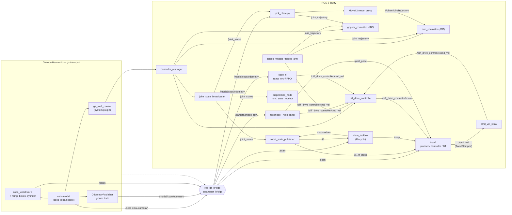

# Architecture

How the six packages, the Gazebo boundary and the ROS graph fit together.

## Node and topic graph

Everything left of the dashed line is Gazebo Harmonic (gz-transport);
everything right of it is ROS 2 Jazzy. A single `ros_gz_bridge` process
carries sensor data across, and `gz_ros2_control` is loaded *inside*
Gazebo as a system plugin, which is why the controllers appear on the ROS
side without a second bridge entry.



### The `cmd_vel_relay` hop

This is the part that confuses everyone, including me for an afternoon.

In ROS 2 Jazzy, `diff_drive_controller` subscribes to **`TwistStamped`**
on its own namespaced topic `/diff_drive_controller/cmd_vel`. Nav2
publishes its final velocity command on plain `/cmd_vel`. So a
stock Nav2 configuration drives nothing, silently — the goal is accepted,
the plan is computed, and the robot never moves.

`custom_teleop/cmd_vel_relay.py` republishes one onto the other, which
keeps `nav2_params.yaml` close to stock instead of forking it. It is
started by `nav.launch.py`, not by the simulation, because it is only
needed when Nav2 is running.

## TF tree

```
map
 └── odom                    (slam_toolbox, or AMCL when running Nav2)
      └── base_footprint     (diff_drive_controller, from wheel odometry)
           └── base_link     (+13.5 mm, the chassis origin)
                ├── chassis_link
                ├── wheel1 … wheel4
                ├── lidar_link
                ├── camera_link
                │    └── camera_optical_frame   (REP-103 optical frame)
                ├── imu_link
                └── m_link1 → m_link2 → m_link3
                                          ├── grip1
                                          └── grip2
```

`base_footprint` is the frame everything localisation-shaped keys off:
AMCL, the Nav2 costmaps, the collision monitor and the RViz fixed frame.
`base_link` sits 13.5 mm above it. Regenerate this tree from a running
simulation with:

```bash
ros2 run tf2_tools view_frames
```

## Package layout

| Package | Build type | What it owns |
|---|---|---|
| `gazebo_models` | ament_cmake | URDF/xacro, world, ramp, controller config, all bringup launch files, `verify_sim.py` / `map_drive.py`, SLAM + Nav2 params, the saved map |
| `custom_teleop` | ament_python | Keyboard teleop for base and arm, `cmd_vel_relay` |
| `coco_config` | ament_python | Shared constants (`robot.py`, `joint_limits.py`) and the diagnostics nodes |
| `coco_moveit_config` | ament_cmake | MoveIt2 configuration, `arm_ik.py`, `pick_place.py` |
| `coco_web` | ament_cmake | rosbridge + web_video_server bringup and the browser control panel |
| `coco_rl` | ament_python | Gymnasium environment, PPO training, evaluation, plotting |

`coco_config` is the only package the others depend on for constants,
which keeps the dependency graph acyclic. Note `gazebo_models`
`exec_depend`s on `custom_teleop` (for `cmd_vel_relay`), so `coco_config`
must not depend back on `gazebo_models` — a test that did closed a cycle
and made colcon refuse to order the workspace at all.

## Data flow by demo

| Demo | Path |
|---|---|
| Teleop | keyboard → `teleop_wheels` → `/diff_drive_controller/cmd_vel` → controller → Gazebo |
| SLAM | `/scan` + `/tf` → `slam_toolbox` → `/map`; `map_drive.py` supplies the route |
| Nav2 | goal → BT navigator → planner/controller → `/cmd_vel` → `cmd_vel_relay` → controller |
| Pick & place | `pick_place.py` → `arm_ik` → MoveIt2 `move_group` → `arm_controller`; grasp confirmed on `/joint_states` |
| Web panel | browser → rosbridge → `/diff_drive_controller/cmd_vel` and `/goal_pose`; video via `web_video_server` |
| RL | `ramp_env` ← `/model/coco/odometry` + `/imu`; actions → `/diff_drive_controller/cmd_vel`; steps on **sim** time |
