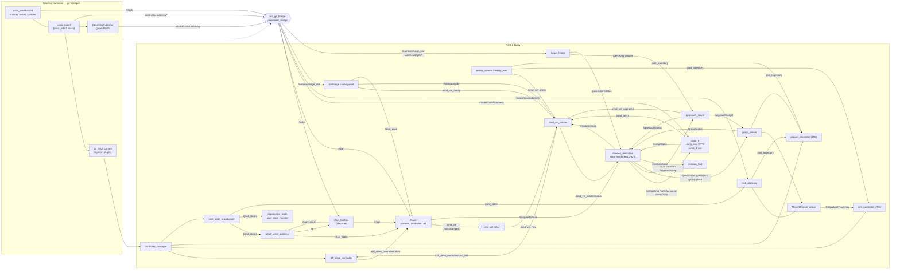
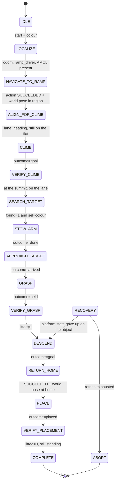

# Architecture

How the eight packages, the Gazebo boundary and the ROS graph fit together.

## Node and topic graph

Everything left of the dashed line is Gazebo Harmonic (gz-transport);
everything right of it is ROS 2 Jazzy. A single `ros_gz_bridge` process
carries sensor data across, and `gz_ros2_control` is loaded *inside*
Gazebo as a system plugin, which is why the controllers appear on the ROS
side without a second bridge entry.



### The `cmd_vel_relay` hop

This is the part that confuses everyone, including me for an afternoon.

In ROS 2 Jazzy, `diff_drive_controller` subscribes to **`TwistStamped`**
on its own namespaced topic `/diff_drive_controller/cmd_vel`. Nav2
publishes its final velocity command on plain `/cmd_vel`. So a
stock Nav2 configuration drives nothing, silently — the goal is accepted,
the plan is computed, and the robot never moves.

`custom_teleop/cmd_vel_relay.py` republishes one onto the other, which
keeps `nav2_params.yaml` close to stock instead of forking it. It is
started by `nav.launch.py`, not by the simulation, because it is only
needed when Nav2 is running.

### The `cmd_vel_arbiter`

Four nodes used to publish to `/diff_drive_controller/cmd_vel` directly:
the keyboard teleop, the Nav2 relay, the web panel's joystick and the RL
ramp environment. Two 10 Hz publishers on one topic do not override each
other — they interleave roughly 50/50 and the controller tracks the
average, so grabbing the joystick to stop a running policy produced a
robot at half speed rather than a robot stopping. That is a safety defect
before it is a missing feature.

`custom_teleop/cmd_vel_arbiter.py` is now the **sole** publisher to the
controller. It subscribes to `/cmd_vel_teleop`, `/cmd_vel_nav`,
`/cmd_vel_rl` and `/cmd_vel_approach`, latches which autonomous source is
eligible from `/mission/mode` (`idle` / `teleop` / `nav` / `rl` /
`approach`, with `auto` and `stop` accepted as aliases), and forwards
exactly one. The approach controller was given its own input rather than
borrowing `/cmd_vel_rl` for one reason worth the five lines: with two
publishers on one input, `/cmd_vel_arbiter/status` can no longer say which
controller is driving, and "the robot moved, but not the way that
controller intended" is the hardest thing to diagnose in this stack.

`idle` does double duty as the mission's stationary state: the wheels stop
but teleop can still preempt, which is exactly what is wanted while the arm
is grasping. There is deliberately no `grasp` mode. **Teleop always
preempts**, in every mode including `idle` — a human reaching for the
stick does not negotiate with the state machine. If no eligible source
has published for 0.3 s the arbiter commands zero for a second and then
goes quiet, so it does not spray zeros over the diagnostic scripts that
still drive the controller directly.

Three details are load-bearing and easy to get wrong:

- **Freshness is arrival time, never `header.stamp`.** The web panel
  sends `stamp: {sec: 0, nanosec: 0}`, so a stamp-based timeout would
  call every joystick message infinitely stale and the phone would never
  drive the robot.
- **The watchdog runs on a STEADY clock**, not the node clock. Under
  `use_sim_time` a paused or dead simulator freezes ROS time, which would
  freeze the watchdog and latch the last command forever — exactly the
  case the watchdog exists to catch.
- **Every outgoing message is re-stamped.** Jazzy's
  `diff_drive_controller` ages commands from `header.stamp` and drops
  anything older than its 0.5 s `cmd_vel_timeout`, so forwarding a held
  command with its original stamp would silently stop the robot.

`web.launch.py` starts it by default. Nav2's relay only feeds it when
started as `nav.launch.py arbiter:=true`; with the default `false` the
relay still publishes straight to the controller so a standalone Nav2 run
keeps working. If both end up publishing, the arbiter logs a warning
naming the topic rather than letting the interleaving return unnoticed.

## The mission executive

`coco_mission/scripts/mission_executive.py` is the top of the stack: an
explicit finite state machine that orchestrates the four control
paradigms and says, at every instant, which state the mission is in, why
it is there, how long it has had, and what happens if it fails. C2-M3
built it; before that the same sequence lived in
`gazebo_models/scripts/traverse_demo.py` as a blocking script.

It is split in two, and the split is the design:

| file | what it is |
|---|---|
| `mission_states.py` | the machine. **Pure Python** — no rclpy, no clock, no I/O. States, contracts, transitions, retry policy, failure reasons |
| `mission_executive.py` | the ROS adapter. Subscriptions in, one request out. Thin on purpose |

Everything interesting is in the pure half, so every transition, timeout,
retry and abort is testable with no ROS graph and no simulator, and the
same event sequence always produces the same transitions. The adapter has
its own tests that **construct the node**, which is the lesson C2-M2.1
paid for: a well-tested pure core behind an untested adapter is not a
tested system.

### The states



Any state can fail into `RECOVERY`, which is drawn once rather than
sixteen times. `RECOVERY` stops the robot first — `/ramp/stop`,
`/approach/stop`, cancel the Nav2 goal, `mode=idle` — and only then
decides whether to retry, come home, or abort.

### Who owns the wheels

The executive **never publishes velocity.** It publishes `/mission/mode`,
and `cmd_vel_arbiter` remains the sole publisher to
`/diff_drive_controller/cmd_vel`. Three tests assert it, one of them by
constructing the node and listing its publishers.

| state | `/mission/mode` | who is driving |
|---|---|---|
| IDLE, LOCALIZE | `idle` | nobody |
| NAVIGATE_TO_RAMP, RETURN_HOME | `nav` | Nav2 |
| ALIGN_FOR_CLIMB, VERIFY_CLIMB | `idle` | nobody — verification only |
| CLIMB, DESCEND | `rl` | ramp_driver |
| SEARCH_TARGET | `idle` | nobody |
| STOW_ARM, GRASP, VERIFY_GRASP, PLACE, VERIFY_PLACEMENT | `idle` | grasp_server (the arm, not the wheels) |
| APPROACH_TARGET | `approach` | approach_server |
| RECOVERY, ABORT, COMPLETE | `idle` | nobody |

`ALIGN_FOR_CLIMB` is a **verification** state, not an aligner. Making it
actuate would need a new velocity source, and adding one to satisfy a
state machine is how the arbiter invariant dies.

### Success is not the action returning success

Where a stronger observable exists, the state uses it:

- **Navigation** — `NavigateToPose` SUCCEEDED **and** the ground-truth
  world pose within Nav2's own `xy_goal_tolerance` of the goal. Nav2
  judges arrival by the AMCL pose it is also steering by; this does not.
- **Climb** — `outcome=goal` **and** the robot at the summit x **and**
  cross-track inside half the lane spacing. The measured 0.51 m drift
  reported `outcome=goal`.
- **Grasp** — `outcome=held` **and** `lifted=1` re-read after the action
  returned. Same underlying `check_lifted` probe, read again; it is not
  an independent sensor and is not claimed to be.
- **Placement** — `outcome=placed` **and** `lifted=0`, so an object still
  stuck to the palm is not a delivery.

### `/mission/state`

One `key=value` line, the shape every other status topic here uses:

```
state=CLIMB prev=ALIGN_FOR_CLIMB event=enter elapsed=12.3 timeout=180
attempt=1 retries=0 owner=ramp_driver mode=rl reason=-- result=--
```

C2-M1 published a free-text step label on the same topic. `mission_hud`
renders both, so `traverse_demo.py` — kept as the harness the M4/M5/M6
numbers were measured with — stays readable on the same HUD.

## TF tree

```
map
 └── odom                    (slam_toolbox, or AMCL when running Nav2)
      └── base_footprint     (diff_drive_controller, from wheel odometry)
           └── base_link     (+13.5 mm, the chassis origin)
                ├── chassis_link
                ├── wheel1 … wheel4
                ├── lidar_link
                ├── camera_link
                │    └── camera_optical_frame   (REP-103 optical frame)
                ├── imu_link
                └── m_link1 → m_link2 → m_link3
                                          ├── grip1
                                          └── grip2
```

`base_footprint` is the frame everything localisation-shaped keys off:
AMCL, the Nav2 costmaps, the collision monitor and the RViz fixed frame.
`base_link` sits 13.5 mm above it. Regenerate this tree from a running
simulation with:

```bash
ros2 run tf2_tools view_frames
```

## Package layout

| Package | Build type | What it owns |
|---|---|---|
| `gazebo_models` | ament_cmake | URDF/xacro, world, ramp, controller config, all bringup launch files, `verify_sim.py` / `map_drive.py`, SLAM + Nav2 params, the saved map |
| `custom_teleop` | ament_python | Keyboard teleop for base and arm, `cmd_vel_relay`, `cmd_vel_arbiter`, `approach_server` |
| `coco_config` | ament_python | Shared constants (`robot.py`, `joint_limits.py`) and the diagnostics nodes |
| `coco_moveit_config` | ament_cmake | MoveIt2 configuration, `arm_ik.py`, `arm_control.py`, `pick_place.py`, `grasp_server.py` |
| `coco_web` | ament_cmake | rosbridge + web_video_server bringup and the browser control panel |
| `coco_rl` | ament_python | Gymnasium environment, PPO training, evaluation, plotting, `ramp_driver` |
| `coco_perception` | ament_python | `target_finder` (HSV + depth object ID) and `vision_check` (its ground-truth harness) |
| `coco_mission` | ament_cmake | `mission.launch.py` — the only thing that composes all of the above |

`coco_config` is the only package the others depend on for constants,
which keeps the dependency graph acyclic. Note `gazebo_models`
`exec_depend`s on `custom_teleop` (for `cmd_vel_relay`), so `coco_config`
must not depend back on `gazebo_models` — a test that did closed a cycle
and made colcon refuse to order the workspace at all.

`coco_perception` is a separate package for the same reason it is not a
script in `gazebo_models`: it needs `cv_bridge` and OpenCV, and four
packages `<depend>` on `coco_config`, so putting it there would make all
of them pull OpenCV for nothing. It deliberately has no edge to
`gazebo_models` either — that would close the same cycle — so
`perception.launch.py` stands alone rather than being included from the
simulation bringup.

`coco_mission` exists for the same graph reason, discovered the same way.
The mission launcher naturally belongs in `gazebo_models`, which owns the
world and the sequencer script — but `coco_moveit_config` `exec_depend`s
on `gazebo_models` for the robot description, so a launch file in
`gazebo_models` that starts `move_group` closes a cycle and colcon
refuses to order the workspace at all. Anything that composes every layer
has to sit above all of them, so it gets a package containing one launch
file and nothing else.

`approach_server` lives in `custom_teleop` rather than `coco_perception`
because it is a **velocity source**, like `cmd_vel_relay` and the teleop
nodes, and belongs beside the arbiter that mediates them. It consumes
`geometry_msgs/PointStamped` off `/perception/target`, which is a message
type, not a dependency on the package that publishes it.

## Data flow by demo

| Demo | Path |
|---|---|
| Teleop | keyboard → `teleop_wheels` → `/diff_drive_controller/cmd_vel` → controller → Gazebo |
| SLAM | `/scan` + `/tf` → `slam_toolbox` → `/map`; `map_drive.py` supplies the route |
| Nav2 | goal → BT navigator → planner/controller → `/cmd_vel` → `cmd_vel_relay` → controller |
| Pick & place | `pick_place.py` → `arm_ik` → MoveIt2 `move_group` → `arm_controller`; grasp confirmed on `/joint_states` |
| Web panel | browser → rosbridge → `/cmd_vel_teleop`, `/mission/mode` and `/goal_pose`; video via `web_video_server` |
| RL | `ramp_env` ← `/model/coco/odometry` + `/imu`; actions → `/diff_drive_controller/cmd_vel`; steps on **sim** time |
| Mission | every velocity source → `cmd_vel_arbiter` (mode from `/mission/mode`, teleop preempts) → controller |

Every row above except the last is the **standalone** path, which is what
each demo does when run on its own. Under the arbiter the last hop into
the controller is replaced by the arbiter's input topic — `/cmd_vel_nav`,
`/cmd_vel_teleop` or `/cmd_vel_rl` — selected by launch argument or, for
`ramp_env`, by constructor argument.
