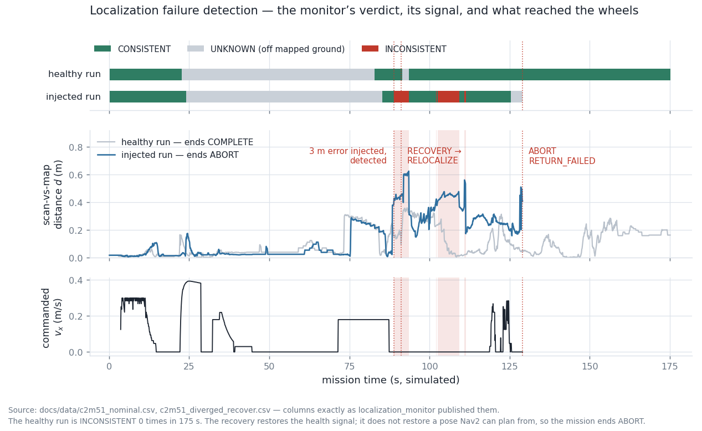
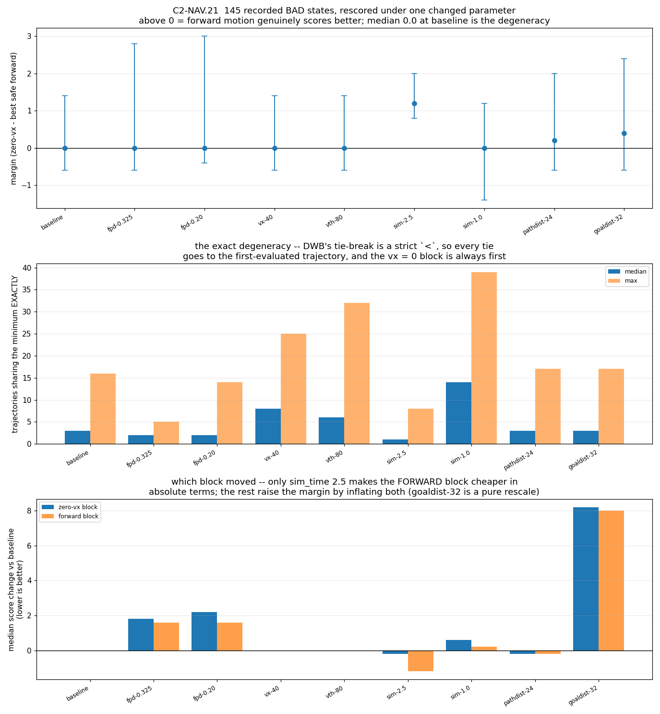
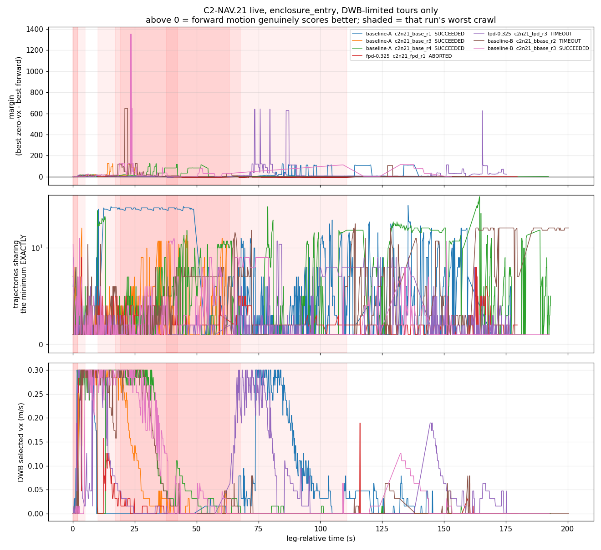

# Measured results

Every number here was measured on the machine described below, with the
command needed to reproduce it. Where something does not work, it is
reported as not working — see [pick-and-place](#pick-and-place) and
[reinforcement learning](#reinforcement-learning).

**Test machine.** Ubuntu 24.04, ROS 2 Jazzy, Gazebo Harmonic (gz-sim 8.11),
Intel laptop CPU + NVIDIA RTX 4050 (driver 580.159.03), headless
(`gui:=false`).

---

## Simulation health

Sensor and control-loop rates, measured in **simulation time** from message
stamps, so the numbers stay meaningful when the real-time factor is not 1.

```
$ ros2 run gazebo_models verify_sim.py

ok    /clock                              2984 msgs
ok    /joint_states                        100.0 Hz sim  (min 20.0)
ok    /scan                                 10.0 Hz sim  (min 8.0)
ok    /imu                                  50.0 Hz sim  (min 40.0)
ok    /camera/image_raw                     15.2 Hz sim  (min 10.0)
ok    /diff_drive_controller/odom           50.0 Hz sim  (min 30.0)
ok    /model/coco/odometry                  50.0 Hz sim  (min 40.0)

all checks passed
```

Every topic runs at its configured rate. The `min` column is the failure
threshold, deliberately well below nominal — `/joint_states` is the
loosest because the `controller_manager` loop is the first thing to dip
under load, and a slow control loop is still a working one.

Real-time factor is ≈1.0. It was ~0.23 before the model frame was fixed
— see [DESIGN_DECISIONS.md](DESIGN_DECISIONS.md#1-the-robot-was-resting-on-its-own-elbow).

---

## Navigation (Nav2)

Ten goals sent to `/navigate_to_pose` from the spawn pose, in the `map`
frame (map origin = spawn pose = world `(-2.0, 0.0)`). Reproduce with
`ros2 launch gazebo_models nav.launch.py` and the `ros2 action send_goal`
command in [RUNNING.md](RUNNING.md).

| # | Goal (map) | Result | Time |
|---|---|---|---|
| 1 | (+1.0, +0.0) | SUCCEEDED | 16.8 s |
| 2 | (+0.8, −2.2) | SUCCEEDED | 14.2 s |
| 3 | (+2.0, −1.0) | SUCCEEDED | 18.7 s |
| 4 | (+1.5, +1.0) | SUCCEEDED | 25.7 s |
| 5 | (+2.5, +0.5) | SUCCEEDED | 4.3 s |
| 6 | (+0.5, −1.5) | SUCCEEDED | 23.3 s |
| 7 | (+3.0, −0.5) | SUCCEEDED | 9.3 s |
| 8 | (+1.2, +1.8) | SUCCEEDED | 16.3 s |
| 9 | (+2.2, −2.0) | SUCCEEDED | 21.5 s |
| 10 | (+0.6, +1.2) | SUCCEEDED | 22.2 s |

**10/10 succeeded**, mean time-to-goal **17.2 s** (4.3 – 25.7 s).

Goals were verified against ground truth as well as Nav2's own report: a
goal to map (0.8, −2.2) left the robot at world (−1.137, −2.130), i.e.
within 9 cm of the requested point.

**Scope of this claim.** All ten goals are inside the mapped region.
Relocalisation from an arbitrary start pose is not exercised; AMCL is
initialised at the spawn pose.

**Superseded by M3.** The numbers above were measured with NavFn/Dijkstra
on the old map and the old world, and the corridor behind the ramp was
still unmapped. All three have since changed; the current numbers are
below.

### A\* — SmacPlanner2D, and the evidence for it

The planner was `nav2_navfn_planner::NavfnPlanner` with `use_astar:
false`, i.e. Dijkstra. Flipping that flag would have been the cheap move
and the wrong one: NavFn's A\* is *faster and produces worse paths* than
its own Dijkstra, because the gradient-descent extraction runs over a
less complete potential field. `GridBased` is now
`nav2_smac_planner::SmacPlanner2D` — real A\* on a 2D grid — and NavFn is
kept registered so the two can be compared by `planner_id` in one run.

`gazebo_models/scripts/plan_compare.py` is that comparison. Spawn → the
mission's pre-ramp pose in lane +0.75, which has to route around the Zone
A gate:

| planner | length (m) | plan (ms) | poses | min clearance (m) |
|---|---|---|---|---|
| **GridBased** (SmacPlanner2D, A\*) | **3.165** | 5.5 | 62 | 0.474 |
| NavFn (Dijkstra) | 3.373 | 5.6 | 134 | 0.496 |

A\* returns a **6.2 % shorter path at the same planning cost**, in half
the waypoints. Note the clearance column goes the other way — NavFn's
path stays 2 cm further from obstacles here. Both are far outside the
0.20 m robot radius, so it does not matter in this arena, but it is the
honest result rather than a clean sweep.

### Ten goals on the rebuilt stack

`nav_round_trip.py`, a `NavigateToPose` **action** client (the panel's
`/goal_pose` topic has no feedback, result or cancel), driving a ten-goal
tour: both pre-ramp lanes, the south-west, both lanes beside the ramp,
the east corridor in both directions, and home.

**10/10 succeeded**, mean **34.7 s**, median 27.5 s, range 11.1 – 123.5 s,
36.3 m driven, returned to within **0.12 m** of the start.

This is not comparable to the 17.2 s above — different goals, longer
routes, and it now includes the east corridor behind the ramp, which the
old map did not contain at all. The 123.5 s outlier is leg 2, a 1.5 m
lane change in front of the ramp foot that the robot has to solve by
backing out and going around.

### `allow_unknown: false`, and what it is actually protecting

With `track_unknown_space: true`, leaving `allow_unknown` true lets the
planner route confidently through unmapped space — fine in RViz, fails in
the world. It matters more than usual here: the 2D lidar sees only the
ramp's side faces, so **the ramp's interior is unknown**, and this
setting is what stops Nav2 planning a cheerful straight line over a ramp
it cannot climb. Verified — a goal at world (2.0, 0.0), inside the ramp
body:

```
planner       length m   plan ms   poses  min clear m
GridBased       FAILED
NavFn           FAILED
```

### Three more defects fixed, and one that measured nothing

- `global_costmap` ran `update_frequency`/`publish_frequency` at **1.0 Hz**
  while the local costmap ran 5.0/2.0. At 1 Hz an obstacle moving at the
  robot's own 0.25 m/s travels a quarter of a metre between updates. → 5.0.
- `collision_monitor`'s `PolygonStop` was a **0.1 m circle — smaller than
  the 0.20 m `robot_radius` both costmaps plan with**, so the stop zone
  lived inside the chassis and could only fire after contact. → 0.25, with
  slowdown and limit nested outside it at 0.40 and 0.55. All three had
  shipped as 0.1 m boxes.
- `PolygonLimit` was fully defined and **absent from the active
  `polygons:` list**; `VelocityPolygonStop` likewise, and has been deleted
  rather than left lying around. Dead config reads as protection that is
  not there.
- `BaseObstacle.scale` was **0.02 against `PathAlign`/`PathDist` at 32.0**
  — obstacle avoidance carrying 1/1600th the weight of path-following.
  Raised to 8.0, but **measuring it changed nothing**: driven clearance
  was 0.430 m at 0.02 and 0.432 m at 8.0. The route's tightest point is
  the 1.30 m Zone A gate, and a 0.4 m-wide robot centred in a 1.30 m gap
  is ~0.45 m from either side whatever the critic thinks. The measurement
  is saturated by geometry. It stays fixed because the old ratio would
  bite the moment a route offers a real choice, but no improvement is
  being claimed for it here.

An earlier version of this round *did* show clearance improving from
0.221 m to 0.43 m — that was `box_obstacle_1` being moved off the
mission's lane, not the critic. Reporting it as the critic's doing would
have been the easy mistake.

---

## Pick-and-place

### The shipped target: 4/4

`ros2 run coco_moveit_config pick_place.py`, four consecutive runs, with
the cylinder's position read from Gazebo ground truth afterwards.

| Run | Sequence | Gripper stall (rad) | Cylinder z |
|---|---|---|---|
| 1 | complete | 0.2444 / −0.1952 | 0.1280 |
| 2 | complete | 0.2348 / −0.2077 | 0.1280 |
| 3 | complete | 0.2349 / −0.2067 | 0.1280 |
| 4 | complete | 0.2361 / −0.2066 | 0.1280 |

**4/4 succeeded**, cylinder back on the pedestal at z = 0.1280 m every
time.

The "gripper stall" column is the finger position where the fingers stop,
against a commanded 0.02 rad. It is direct evidence that something is
physically held: closing on **empty air** runs all the way to the setpoint
instead. The spread across runs is 0.0096 rad (~0.5°), which is the
repeatability of the grasp itself.

### Re-targeting: 0/5 — a known limitation

`pick_place.py --target X Z` re-solves the IK and re-places the pedestal
for an arbitrary grasp point. The IK part works; the **demo does not**.

| Target (x, z) | Outcome | Cylinder z after |
|---|---|---|
| (0.160, 0.140) | rejected up front: "no hover pose above" | 0.1280 (untouched) |
| (0.150, 0.130) | aborted: empty grasp | 0.0134 (on the floor) |
| (0.145, 0.128) | aborted: empty grasp | 0.1280 |
| (0.152, 0.135) | aborted: empty grasp | 0.0137 (on the floor) |
| (0.140, 0.150) | aborted: empty grasp | 0.0140 (on the floor) |

**0/5 completed.** Only the shipped target (0.152, 0.128) works.

Two distinct behaviours, both correct as *failures*:

- (0.160, 0.140) is rejected before anything moves, because no valid hover
  pose exists above it. Clean.
- The rest reach the grasp pose, close on nothing, and abort naming the
  step. In three of four the approach knocked the cylinder off the
  pedestal onto the floor first.

**Why this is here.** Reachable IK is necessary but not sufficient: the
approach path, the re-placed pedestal and the fingertip geometry all have
to agree, and outside the tuned point they do not. This was found *by*
the grasp confirmation added in this round — before it, `move_gripper`
slept 1.5 s and returned success unconditionally, so all five of these
runs would have printed "Pick-and-place sequence complete" while the
cylinder lay on the floor. The README previously described `--target` as
working anywhere the IK finds reachable; that claim has been corrected.
Tracked in [FUTURE_WORK.md](FUTURE_WORK.md).

### Re-targeting with the magnet grasp: 5/14, and a different failure

Two changes were measured against the table above. First the MoveIt joint
tolerance went from 0.02 to 0.003 rad, which took the four points from 0/4
to 2/4 but left the ±10 mm box at 0/10. Then the friction pinch was
replaced with a gz `detachable_joint` magnet.

The ±10 mm box in that middle run **could not have passed**: at z = 0.128
the arm's x reach limit is 0.156 and the shipped grasp point (0.152, 0.128)
sits 4 mm inside it, so 4 of its 10 points were unreachable before physics
ran. The largest fully-reachable box around the shipped point is ±3 mm.
The box below is re-centred on (0.145, 0.128), where ±9 mm is reachable.

Fresh simulator per point — the DetachableJoint binds to the target model
on first spawn and never re-scans, so a second pick in the same sim welds
nothing (see below).

| Set | Points | Completed |
|---|---|---|
| `docs/RESULTS.md` four | 4 | **1** |
| ±9 mm box around (0.145, 0.128) | 10 | **4** |

**The grasp itself is solved.** Not one run failed on the grasp: the
"closed on empty air" outcome, which was every failure in the table above
and 6/6 of the reachable box points in the tolerance-only run, has
disappeared entirely. All five completed runs lifted the cylinder a
*measured* 32.4–39.8 mm, read back out of Gazebo rather than inferred from
finger positions.

**What fails now is motion planning, and it splits cleanly on x:**

| x | Outcome |
|---|---|
| ≥ 0.1505 | completed (5/5, ignoring one lift-check failure at 0.152) |
| ≤ 0.1468 | `grasp approach` failed, MoveItErrorCode 99999 (7/7) |

move_group's own log gives the reason, and it is not the grasp:

```
Constraint satisfied:: 'm_link1_Revolute-6' actual 0.322630, desired 0.321759
Constraint satisfied:: 'm_link2_Revolute-7' actual 0.920110, desired 0.919887
Found a contact between 'pedestal' (Object) and 'm_link3' (Robot link),
  which constitutes a collision
RRTConnect: Unable to sample any valid states for goal tree
```

The goal is kinematically fine and both joint constraints are satisfied.
It is rejected because the **palm intersects the pedestal**: the arm has
no wrist, so a grasp point closer to the robot is reached by curling the
forearm back over the 50 mm pedestal box. Pedestal *height* is not the
driver — points with a 90 mm pedestal fail as readily as one with 120 mm.
x is.

This matters for the fetch mission because the mission has **no
pedestal**. The four coloured objects sit on a flat ramp platform, where
the obstruction this measures does not exist. So 5/14 is the score for
*this demo scene*, not a bound on the mission, and the number to carry
forward is the grasp result: the magnet holds, verified physically, at
every point the planner will accept.

### The magnet binds once per simulator

`DetachableJoint` attaches its child the instant the model appears, not
when commanded — a cylinder spawned 1 m to the side at z = 0.80 hung there
instead of falling, and dropped the moment a detach was published. So
`pick_place.py` detaches immediately after spawning.

Worse, the binding is not renewed. Remove the target and spawn it again —
which is what `clear_scene()` does between runs — and the new model is
never bound. It falls freely, no state transition is published, and a
later attach command still answers `"attached"` while welding nothing.
Verified by attaching after a respawn and then moving the arm: the target
stayed on the ground.

That is a silent success, the exact failure class this demo was fixed for
once before, so the grasp is no longer trusted to the plugin's own state
topic. `check_lifted()` reads the target's height out of Gazebo and
requires it to have risen with the arm.

### A welded magnet stops the base turning, but not driving

Attaching on spawn has a second consequence that cost an afternoon to find.
The mission world spawns four targets on the platform, so the robot comes up
welded to four bodies six metres away. Measured, commanding −0.3 rad/s for
six seconds:

| | yaw before | yaw after |
|---|---|---|
| welded | 0.000 | **0.000** |
| detached | 0.000 | **−1.342** |

Translation is barely affected — commanded 0.3 m/s the robot still covered
1.0 m in 4 s, dragging the constraint — but it **cannot turn at all**. A
fixed joint constrains orientation as well as position, and yawing the palm
would have to swing four bodies through an arc six metres out.

This surfaced as `map_drive.py` aborting on its first waypoint, which is a
~90° turn in place, with nothing in the log but a timeout. The robot was
driving; it just could not point anywhere new. Because the first symptom
looks like a controller or steering fault, `gazebo_models/scripts/
magnet_release.py` exists to detach every target at startup, and
`full_world_robo.launch.py` runs it whenever `traverse:=true`.

---

## Inverse kinematics

Pure computation, no simulator. Reproduce with the numbers in
`coco_moveit_config/test/test_arm_ik.py`.

| Metric | Value |
|---|---|
| Round-trip recovery | 20,000 / 20,000 random joint pairs |
| Max round-trip error | 1.7 × 10⁻¹⁶ m |
| Mean round-trip error | 2.0 × 10⁻¹⁷ m |
| Solve time | 1.5 µs (≈675,000 solves/s) |
| FK at the verified grasp | fk(0.30, 0.58) = (0.1523, 0.1281) m |

Reachable pinch-point envelope in the `base_footprint` frame, sampled over
the joint-limit box:

| Axis | Range |
|---|---|
| x | −0.312 … +0.162 m |
| z | −0.063 … +0.385 m |

The envelope extends behind the robot (negative x) because the arm is rear-
mounted. Part of it is inside the chassis or below the floor and is not
usable — the envelope is the kinematic limit, not the free workspace.

---

## Tests

| Suite | Tests |
|---|---|
| `coco_rl` | 35 |
| `coco_config` | 19 |
| `coco_moveit_config` | 12 |
| `custom_teleop` | 11 |
| `gazebo_models` | 20 |
| **Total (unit)** | **97** |
| `gazebo_models` launch test (opt-in) | 6 cases |

0 failures, **0 skipped**. CI fails if the collected count drops below 75,
so a suite cannot vanish silently — which it previously did, when the
`coco_rl` tests `importorskip`'d on a `gymnasium` that CI never installed.

The rebuilt ramp added 13: 11 in `gazebo_models` for the wedge generator
(`test_gen_ramp.py`) and 2 in `coco_rl` pinning the summit goal.

> **Counting caveat.** A bare workspace-level `colcon test-result` reports a
> larger number (108 here) because ament_cmake packages keep a
> `build/<pkg>/Testing/<timestamp>/Test.xml` directory *per run*, and the scan
> sums the stale ones too. The table counts each package's current result file
> only (`pytest.xml` / `*.xunit.xml`). Delete `build/` for a clean total.

Reproduce:

```bash
colcon test --packages-select gazebo_models custom_teleop coco_config \
                              coco_moveit_config coco_rl
colcon test-result --verbose
```

---

## Reinforcement learning

The RL task was rebuilt after the original "unsolved" result was traced to
its real cause: the ramp was **geometrically unclimbable**, and the goal only
reached the ramp *foot*. Both are fixed, and the fix is measured below. Full
story in
[DESIGN_DECISIONS.md](DESIGN_DECISIONS.md#diagnosing-and-replacing-the-unclimbable-ramp).

### Before — the shipped mesh (0/10, and why)

| Metric | Value |
|---|---|
| Steps trained | 47,204 |
| Episodes | 528 |
| Rolling-mean return | −11 … −13 throughout |
| Deterministic evaluation | **0/10 successes** (0 tips, 10 timeouts) |


The robot survived (0 tips) but never climbed. The honest reason turned out
to be twofold, and neither was the policy:

1. **The mesh could not be climbed by anything.** Profiling `rampcoco.stl`
   (4.40 m run × 1.10 m rise) shows it is not a wedge: ~0.4 m from the foot
   the surface rears up into a **~66° near-vertical face with an overhang**,
   then a sustained ~39° grade. A skid-steer cannot mount a 66° face or a
   step taller than its wheel. Wheel-contact friction is `mu = 0.7` (no-slip
   to ~35°), so a clean grade would have been trivial.
2. **The goal was the foot, not the top.** `GOAL_X_PROGRESS` was 3.0 m,
   which from spawn `(-2,0)` reaches only world x≈1.0 — the ramp foot.
   "Climbing" was never the trained objective.

The 0/10 above is kept as the **before** baseline, not as the project's RL
result.

### After — the rebuilt curriculum, measured

The environment was replaced with a parametric wedge
([`gen_ramp.py`](../gazebo_models/scripts/gen_ramp.py)), a summit goal, and a
12° → 18° → 24° curriculum selected by `ramp_angle:=`. Measured on the test
machine with `./verify_all.sh`:

**The robot climbs.** `climb_check.py` drives it forward from spawn and
watches ground-truth odometry + IMU:

```
$ ros2 run gazebo_models climb_check.py
progress 5.21 m / goal 5.50 m   peak pitch 18.1 deg (>= 7.2 needed)
PASS climb_check: robot reached the 18 deg ramp summit under forward drive.
```

The **peak pitch of 18.1° against a requested 18.0° grade** is the load-bearing
number: it confirms the physics engine sees exactly the geometry `gen_ramp.py`
was asked to emit, so the grade is real rather than nominal.

**PPO smoke run** (2048 steps, seed 0, 18° wedge). This is a *plumbing check*,
and it is reported with its run-to-run spread rather than its best run, because
two identically-seeded runs disagree:

| Metric | Before (old ramp) | Run A | Run B | Run C |
|---|---|---|---|---|
| Episodes | 528 (47k steps) | 50 | 58 | 62 |
| Mean episode length | ~33 steps | 40.3 (max 130) | 34.9 (max 112) | 32.5 (max 122) |
| Mean return | −11 … −13 | −9.50 | −10.96 | −10.77 |
| Best episode return | negative throughout | +5.99 | −6.00 | −3.07 |

**Read this conservatively.** All three runs used `--seed 0`. `--seed` pins the
policy and action sampling but *not* the physics — Gazebo is not
bit-reproducible — so identically-seeded runs diverge, as the spread above
shows. Only run A reached a positive return; mean returns sit in roughly the
same band as the old ramp, and mean episode length straddles the old ~33 steps.
So 2048 steps of PPO demonstrates that the **pipeline runs correctly against
the new environment** and nothing more. It is not evidence of learning, and no
success-rate claim is made until the full curriculum has actually been trained.

The load-bearing evidence that the rebuild worked is `climb_check.py`, not
these returns: it is stable across runs (5.20–5.21 m progress, peak pitch
18.0–18.1°) and shows the robot physically reaching the summit on a grade the
old mesh made impossible.

**Nav2 is unaffected by the world change.** The rebuilt ramp and the one moved
cylinder do not disturb navigation — a goal at map `(1.0, 0.0)` still returns
`SUCCEEDED` in the same run (`./verify_all.sh --with-nav`, stage 7).

### SOLVED — 10/10 on the full task at 18° and 24°

A five-stage curriculum (`./train_curriculum.sh`) that walks the **start line** back
before raising the **grade** — 12° from +2.5 m, +1.0 m, 0 m, then 18°, then 24°, all at
the full 5.2 m goal. 207,400 env-steps, seed 0, `randomize off`.

| Stage | Episodes | Mean return | Deterministic eval |
|---|---|---|---|
| 12° from +2.5 m | 518 | 45.56 | not evaluated¹ |
| 12° from +1.0 m | 186 | 35.07 | 0/10² |
| 12° full distance | 197 | 45.41 | 0/10³ |
| **18° full distance** | 198 | 58.47 | **10/10 (100%)** |
| **24° full distance** | 214 | 60.72 | **10/10 (100%)** |

```
$ python3 -m coco_rl.evaluate phase5_24deg_s0p0.zip --episodes 10
episode  1: goal    return   69.82  steps 127
...
episode 10: goal    return   69.85  steps 127

success rate: 10/10 (100%)  tipped: 0  timeout: 0
```

126–127 steps and returns of 69.49–69.85 across ten episodes: the policy solves it the
same way every time, not occasionally by luck.

**Re-verified on the shortened ramp (M2).** The fetch mission needs a 1.5 m
platform at the crest, which only fits if the wedge's run drops 2.5 → 2.0 m
(otherwise the mirrored down-ramp lands 0.5 m from the east wall, too close for
the robot to turn around). That changes the geometry the policy trained on — at
18° the rise goes 0.81 → 0.65 m and the task 5.5 → 5.0 m — so the shipped policy
was re-evaluated rather than assumed to transfer:

| Grade | Result | Steps | Returns |
|---|---|---|---|
| 18° | **10/10**, 0 tipped, 0 timeout | 116–121 | 65.15–65.42 |
| 24° | **10/10**, 0 tipped, 0 timeout | 118–122 | 64.93–65.13 |

No retraining. The returns are ~4.5 lower purely because progress reward scales
with a task that is now 0.5 m shorter, and the step counts drop to match. The
*grade* is what the policy senses through pitch, and that did not change.

¹ Stage 1 completed, then a filename bug made the runner think it had failed; on resume
it was correctly skipped as done — and skipping a phase skips its evaluation.
² Evaluated on the full task while trained from +1.0 m, so it is scored on a metre more
than it practised. It reached 3.88 m of 5.2 m with **zero tips**.
³ A genuine matched failure: the greedy policy stalled at 4.34 m, reproducibly, with
returns identical to within 0.02. Continued training at 18° and 24° resolved it.

### The three bugs between 0/10 and 10/10

**1. The ramp was unclimbable.** Covered above.

**2. The goal sat 1.6 cm beyond the tip-over terminator.** The goal was the exact crest,
but the wedge's back face is vertical, so a robot whose base reaches the crest is already
pitching over the drop — and `is_tipped` (0.6 rad) fires before `x` crosses the line. A
completed climb at **x = 5.4838** was logged as `tipped` against a 5.5 m goal. This is
why the first 180k-step curriculum recorded **1 goal in 1,399 episodes** while best
returns reached +64. Fixed with `GOAL_MARGIN = 0.3`.

**3. `--fast` was corrupting the control loop.** The dominant cause. Unlocking the
real-time factor makes sim time outrun wall-clock ROS message delivery, so `cmd_vel`
arrives late and intermittently and the `diff_drive_controller`'s 0.5 s `cmd_vel_timeout`
**repeatedly halts the wheels**. That stop-start pumping reared the chassis nose-up and
flipped it backwards. Same seed, same configuration, only the flag differing:

| | with `--fast` | without |
|---|---|---|
| Episodes | 533 | 48 |
| Tipped | **531** | **0** |
| Goals | 2 | 31 |
| Mean return | −6.32 | +56.84 |
| Deterministic eval | **0/10** | **10/10** |
| Throughput | 8.2 steps/s | **8.7 steps/s** |

It also explains a reading that puzzled us for hours — commanded 0.4 m/s measuring only
0.11–0.15 m/s. The wheels were being halted for much of each step.

**`--fast` never bought anything.** `STEP_DT` is 0.1 s, so real time caps throughput at
10 env-steps/s, and the measured rate *with* the flag was 8.2. Physics was never the
bottleneck; the ROS round-trip always was. The flag was pure downside, and it is now
deprecated with a loud warning and removed from `train_curriculum.sh` and `verify_all.sh`.

The pattern holds across the whole investigation: every scripted check that passed
(`climb_check`, every manual probe) never called `set_physics`; every training run that
failed used `--fast`.

### Wrong diagnoses made along the way

Recorded because the process matters as much as the result. Each was stated confidently
and each was wrong:

1. *"Needs more compute."* Ignored that the environment was broken.
2. *"No per-step time penalty, so safe creeping wins."* `TIME_PENALTY = 0.01` had always
   existed; the claim came from reasoning about incentives over 10 evaluation episodes
   instead of reading 1,399 training episodes.
3. *"77–92% tipped."* Inferred from return and length, which cannot separate a tip-over
   (−10) from a `sim_stalled` truncation (reward 0.0) — the outcome was not being logged
   at all. Fixed by adding `info_keywords=('outcome',)` to the Monitor.
4. *"Wheel friction is mu = 2.5."* That is the gripper finger pads; the wheels are 0.7.
5. *"The simulator degrades over a long run."* A fresh sim gave the same result.

A 5-hour laptop suspend mid-run (03:43→09:01) is also worth recording: the run survived
it without a scratch because the env's stall deadlines use `time.monotonic()`, which does
not tick while suspended. Under the previous `time.time()` deadlines every one would have
expired at once on resume.

**Still compute-bound as well.****Still compute-bound as well.** The env steps at ~8 env steps/s (Gazebo is the
bottleneck), so each 60k phase is ~2 h. Reward shaping is the cheaper lever to
pull first; the scaling paths in [FUTURE_WORK.md](FUTURE_WORK.md) item 9 apply
after that.

**Reproducing the figure.** The Monitor CSVs are committed under
[`docs/data/`](data/):

```bash
python3 -m coco_rl.plot_curve \
    docs/data/ppo_run_part1_trimmed.monitor.csv \
    docs/data/ppo50k_b.monitor.csv \
    -o docs/images/ppo_learning_curve.png
```

This reproduces the committed PNG byte-for-byte
(md5 `dbd195d8926d8af2768220cdc7dbc64d`).

## Fetch mission — vision and object selection

`target_finder` measured against Gazebo ground truth by
[`vision_check`](../coco_perception/coco_perception/vision_check.py),
which teleports the robot to a grid of poses on the crest platform, asks
for each colour in turn, and compares the reported position with
`gz model -p`. Sim launched `traverse:=true gui:=false`, camera confirmed
at 14.9 Hz colour / 15.0 Hz depth before the run.

Teleport rather than climb, deliberately: the RL policy has a measured
+0.61 m of lateral drift, so using it as the transport would confound a
vision measurement with a locomotion one.

### Detection and position error

`d` is base_footprint to the target row; the camera sits 0.125 m further
forward. `dx`/`dy` are reported minus ground truth, in base_footprint.

| colour | Ø | d = 0.850 | 0.650 | 0.450 | 0.300 |
|---|---|---|---|---|---|
| red | 20 mm | −1.0, +2.0 | −1.0, +1.0 | −1.0, +1.0 | −1.0, −0.0 |
| green | 24 mm | −0.0, +2.0 | −1.0, +1.0 | −1.0, +1.0 | −1.0, +0.0 |
| blue | 28 mm | −1.0, +2.0 | −2.0, +1.0 | −1.0, +1.0 | −1.0, +0.0 |
| yellow | 32 mm | −1.0, +2.0 | −1.0, +1.0 | −1.0, +1.0 | −2.0, −0.0 |

**16/16 detected, 16/16 inside ±8 mm**, worst case 2 mm — against a
~27 mm approach window (see *Reach*, below). Two honest caveats:

- The status line carries three decimal places, so this measurement
  cannot resolve below 1 mm. "±2 mm" means "≤2 mm at 1 mm resolution",
  not that the error is exactly 2 mm.
- `dy` is **not** noise: it decays +2.0 → +1.0 → +1.0 → 0.0 as the robot
  closes in, which is what a constant *angular* bias looks like. 2 mm at
  0.725 m is 2.8 mrad, i.e. 0.6 px of centroid bias on a blob 6 px wide —
  sub-pixel, and it vanishes exactly where the grasp needs it to.
  `dx ≈ −1 mm` is roughly 10 % of the front-surface correction.

### Apparent width against the pinhole model

Predicted `diameter × fx / range` with fx = 221.765 px, measured from the
connected component:

| colour | 0.725 m | 0.525 m | 0.325 m | 0.175 m |
|---|---|---|---|---|
| red Ø20 | 6.1 → **6** | 8.4 → **8** | 13.6 → **14** | 25.3 → **26** |
| yellow Ø32 | 9.8 → **10** | 13.5 → **14** | 21.8 → **22** | 40.5 → **40** |

Every cell within 1 px. Note what this also shows: adjacent diameters
differ by ~1.3 px at the working distance, so **apparent size cannot
identify which object it is** — colour does that, and the width gate is
a sanity check on the range.

### Wrong-lane signal

Standing in one lane while asking for another's target. The neighbouring
object stays in frame at this distance, so the answer is a diagnosis
rather than a silence:

| asked for | standing in | result |
|---|---|---|
| red | green | `found=0 seen=green` |
| green | blue | `found=0 seen=blue` |
| blue | yellow | `found=0 seen=yellow` |

This is what the RL policy's lateral drift will show up as, and it costs
nothing to produce.

### Reach — why the targets are 158 mm tall

Scanned directly from `arm_ik.ik()`. The target's axis has to stop inside
`[chassis front + radius + 5 mm, max reach at the grasp height]`:

| grasp height | max reach | window, Ø12/18/24/30 as originally spawned |
|---|---|---|
| z = 0.030 (60 mm cylinder on the platform) | 0.1299 | +3.9 / +0.9 / **−2.1** / **−5.1** mm |

Two of the four mission targets were **geometrically impossible to
grasp**, and the other two needed the base to stop within 4 mm. Nothing
reported it: the world spawns, the camera sees them, and MoveIt returns
an unreachable goal at the last step of the mission.

At 158 mm tall the grasp band lands at z = 0.128 — `arm_ik.fk(0.30, 0.58)
= (0.15231, 0.12809)`, the exact pinch point with measured 32–40 mm
lifts — where max reach is 0.1608:

| colour | Ø | window | static tip angle |
|---|---|---|---|
| red | 20 mm | +30.8 mm | 7.2° |
| green | 24 mm | +28.8 mm | 8.6° |
| blue | 28 mm | +26.8 mm | 10.0° |
| yellow | 32 mm | +24.8 mm | 11.4° |

`coco_config/test/test_reach.py` fails if anyone shortens them again.

### Tip-over — the one risk the taller targets introduced

Measured, since 7–11° is not a large margin. RPY after spawn settling,
and again after the robot was teleported to the closest station
(base x = 3.75, its front face 0.15 m from the row) in all four lanes:

```
target_red     [4.049990 -0.750000 0.728839]  [ 0.000000 -0.000002  0.000000]
target_green   [4.049990 -0.250000 0.728839]  [ 0.000000 -0.000000  0.000000]
target_blue    [4.049990  0.250000 0.728839]  [ 0.000000 -0.000000  0.000000]
target_yellow  [4.049990  0.750000 0.728839]  [-0.000000  0.000002  0.000000]
```

Identical before and after: upright to 2 µrad, z exactly
0.6498 + 0.079, lateral drift 10 µm.

**That result holds only for a controlled approach, and the end-to-end
run below shows where it does not.** A robot arriving under RL control
with 0.59 m of lateral drift drove into `target_yellow` and knocked it
flat (`rpy [-1.5708, -0.4415, -1.5684]`). So: the taller targets are
stable against spawn settling and against the robot stopping beside
them, and they are not stable against being driven into. The cause is
the drift, not the height — but a 158 mm cylinder is easier to topple
than a 60 mm one, and that is the price of the reach fix. The fallback
(a 30 mm-deep grey plinth, ~20 mm window) is not needed for the
approach; it would not have helped here either.

### What the camera cannot do

Two limits worth stating because they are geometry, not tuning:

- **Nothing on the platform is visible from the flat ground.** The sight
  line over the crest edge (3.0, 0.6498) reaches z = 0.9068 at the target
  row from the pre-ramp pose, 0.8533 from mid-arena and 0.7750 from home;
  the targets top out at 0.8078. There is no pose from which the robot
  can survey the objects before choosing a lane, so the colour→lane
  decision is a table lookup in `coco_config.robot`.
- **The gripper's workspace is never in frame.** The arm reaches to
  base-x 0.1617 and the nearest visible ground is 0.252 at pitch 0. The
  design is classify-at-range then approach open-loop — and at the
  closest station there is 73 mm of travel left to the grasp pose, which
  at ~1 % wheel-odometry error is under 1 mm against a 27 mm window.

### End-to-end: the wrong-lane signal firing for real

One full `traverse_demo.py --colour blue` with the whole stack up — sim,
Nav2 (`arbiter:=true`), `cmd_vel_arbiter`, `target_finder`, `ramp_driver`
on the phase-5 policy:

| step | result |
|---|---|
| 1. nav to the pre-ramp pose (0.5, +0.25) | SUCCEEDED, 41.7 s |
| 2. RL climb | `outcome=goal`, 63 steps, `progress=4.70`, **`lateral=+0.59`** |
| 2b. confirm blue is in front | **`sel=blue found=0 seen=yellow`** |
| 3. scripted descent | `outcome=goal`, 423 steps, `progress=6.65` |
| 4. nav home | SUCCEEDED, 61.7 s |

`TRAVERSE COMPLETE`, home to within **0.03 m**. Arbiter source trace
`nav → rl → rl → nav`, one publisher on the wheel topic throughout.

The interesting line is 2b. The robot was sent to lane **+0.25** and
arrived at **+0.84** — 0.59 m of drift, which lands it in **yellow's**
lane at +0.75. `target_finder` reported exactly that: the requested blue
was not in front, and what *was* in front was yellow. This is the
wrong-lane diagnosis working on a real failure rather than a staged one,
and it independently reproduces the +0.61 m drift measured in M4.

It also puts a number on why M6 is blocked. The drift does not merely
miss the target: it drove the robot into a *different* target and
knocked it over. Grasping cannot be attempted until the policy holds a
lane.

### A bringup trap that cost three runs

The first three attempts at the run above failed with Nav2 rejecting
every goal (`bt_navigator: Action server is inactive`). The cause was not
Nav2: `ros2 launch gazebo_models full_world_robo.launch.py` spawns
`parameter_bridge`, `robot_state_publisher` and `cmd_vel_relay` as
**separate processes whose command lines do not contain
"full_world_robo"**. Killing only the launch pattern left six orphaned
bridges and five relays running across successive attempts, and a stale
`/clock` publisher makes every consumer see time jump backwards:

```
tf2_buffer: Detected jump back in time. Clearing TF buffer.
global_costmap: ... 'map' and 'base_footprint' ... are not part of the
                same tree. Tf has two or more unconnected trees.
amcl: Message Filter dropping message ... 'discarding because the queue
      is full'
```

AMCL then never updates, its `map→odom` expires, `global_costmap` never
finishes activating, `bt_navigator` is never activated, and it rejects
goals — four layers away from the actual fault. Each successive run was
*worse* than the last, which is the tell. Kill by process name, not by
launch-file name.

## Fetch mission — grasp and carry (M6)

### The +0.6 m drift was never the policy steering badly

M4 measured +0.61 m of lateral drift over the climb and M5 measured
+0.59 m, and both were written up as "the policy has no closed-loop
lateral control". That is true, and it is not the cause.

Teleport the robot to the pre-ramp pose at **exactly yaw 0** and the bare
policy climbs 2.5 m with **+0.03 m** of drift, in every lane:

| lane | end y (gz ground truth) | drift | outcome |
|---|---|---|---|
| −0.75 | −0.7184 | +0.032 | goal |
| −0.25 | −0.2185 | +0.032 | goal |
| +0.25 | +0.2804 | +0.030 | goal |
| +0.75 | +0.7826 | +0.033 | goal |

The policy holds a line to 3 cm over 2.5 m. What it cannot do is *correct*
one — and `nav2_params.yaml` sets `yaw_goal_tolerance: 0.25`, so a Nav2
leg is allowed to finish 0.25 rad off. **2.5 m of climb at 0.25 rad is
0.64 m of lateral**, which is the entire measured drift.

That reframes it from an accuracy problem to a safety one. Starting from a
Nav2-legal heading error, open loop:

| lane | start yaw | end y | drift | outcome |
|---|---|---|---|---|
| −0.75 | +0.25 | −0.168 | +0.582 | goal |
| −0.75 | −0.25 | **−1.174** | −0.424 | **timeout** |
| −0.25 | +0.25 | +0.330 | +0.580 | goal |
| −0.25 | −0.25 | −0.729 | −0.479 | goal |
| +0.25 | +0.25 | +0.829 | +0.579 | goal |
| +0.25 | −0.25 | −0.234 | −0.484 | goal |
| +0.75 | +0.25 | **+1.182** | +0.432 | **timeout** |
| +0.75 | −0.25 | +0.273 | −0.477 | goal |

The platform ends at ±1.25 m. Both outer-lane adverse cases finish within
**70 mm of the edge**, and neither reached the summit at all.

### The lane hold, and why the gains are what they are

`ramp_driver.lateral_hold` adds a clamped cross-track + heading correction
to the policy's yaw action. Linearising about the centreline with
v = 0.4 m/s and the env's `MAX_ANG` = 0.5 rad/s gives
ω_n = √(v·MAX_ANG·K_Y) and ζ = MAX_ANG·K_YAW/(2ω_n).

The clamp was swept first, on the theory that the correction was
authority-limited (it sat pinned at 0.4 for every step of every climb):

| clamp | +0.25 yaw | −0.25 yaw |
|---|---|---|
| 0.4 | +0.219 | −0.157 |
| 0.8 | +0.216 | −0.157 |
| 1.2 | +0.212 | −0.156 |
| 2.0 | +0.213 | −0.156 |

6 mm across a 5× range — so authority was not the limit. Bandwidth was:
the climb lasts ~6 s and at K_Y = 1.2 that is ω_n·t = 2.9 rad, under half
a correction cycle. Sweeping the gains instead:

| K_Y | K_YAW | ω_n | ζ | +0.25 yaw | −0.25 yaw |
|---|---|---|---|---|---|
| off | off | — | — | +0.582 | −0.484 |
| 1.2 | 1.6 | 0.49 | 0.82 | +0.218 | −0.155 |
| **3.0** | **2.5** | **0.77** | **0.81** | **+0.053** | **−0.016** |
| 5.0 | 3.2 | 1.00 | 0.80 | −0.021 | +0.061 |
| 8.0 | 4.0 | 1.26 | 0.79 | −0.078 | +0.107 |

The **sign flips** above 3.0: past that the loop crosses the centreline
before the climb ends. That is what makes 3.0/2.5 a real minimum rather
than the best of four noisy numbers. All 8 climbs reached the goal at
every gain setting tried, against 6/8 open loop.

Shipped: `LATERAL_GAIN = 3.0`, `HEADING_GAIN = 2.5`, `LATERAL_CLAMP = 0.8`
(just above the 0.625 peak those gains ask for). Worst case **0.053 m**
against 0.582 m open loop — **11×**, and no retraining.

> **Read that 0.053 m with its condition attached.** It was measured from a
> **teleported** start at a heading error of **exactly ±0.25 rad**, and it
> is displacement from where the climb began, not cross-track from the
> lane. Under **mission conditions** — arriving on a real Nav2 leg, with
> cross-track measured from the target lane centreline — the same
> controller gives **mean +0.120 m, max +0.301 m, with 3 of 20 runs more
> than a half-lane off**. Both numbers are real; they are not the same
> measurement. The comparison is laid out in
> [the envelope section below](#the-lane-holds-envelope-is-wider-than-0053-m-and-here-is-why).

### The 1.198 m nothing was driving

`GOAL_SUMMIT` ends the RL episode at world x = 2.700. The crest is at
3.000, the target row at 4.050, and the base has to stop at ~3.90 for the
arm to reach. Nav2 cannot drive that (from the flat the ramp scans as a
wall and the platform is unmapped with `allow_unknown: false`), the climb
episode has ended, and `/ramp/descend` drives straight through the row to
6.65 — which is how the M5 run knocked `target_yellow` flat.

`approach_server` fills it in four phases: `crest` (drive off the slope on
IMU pitch, 0.314 rad of grade against a 0.06 rad threshold), `servo` (pure
pursuit on `/perception/target`), `align` (turn in place to null the
bearing), `creep` (straight, blind, on wheel odometry).

`align`-then-`creep` rather than servoing to the end, because **perception
goes blind before the stop pose**: target_finder's minimum range is 0.15 m
of surface depth from a camera at base-x 0.125, so the last fix lands at a
target axis of ~0.29 m while the stop is at ~0.15. Nulling the bearing
first means the blind leg runs *along* the line to the target, so it
closes range without reintroducing lateral error.

### The approach window is 5.5 mm, and it has nothing to do with the target

Two corrections landed on this number, and the second replaced the whole
model.

**The far bound was measured at the wrong height.** `test_reach.py`
computed it as the arm's reach at the grasp height, 0.16085. The descent
starts from `GRASP_HOVER_CLEARANCE` above that, where reach is only
**0.15651** — and both ends have to be in the envelope or the plan cannot
be *started*, which move_group reports identically to an unreachable
goal. That cost 4.3 mm.

**The near bound was not what anyone thought.** With the far bound fixed
the windows still looked comfortable — 15.5 to 21.5 mm depending on
thickness, derived from `CHASSIS_FRONT_X + radius + PALM_MARGIN`. Then
the first end-to-end fetch stopped at base-x **0.1443**, comfortably
inside the 32 mm target's `[0.1410, 0.1565]`, and `/grasp/pick` failed at
*grasp approach* before physics ran.

Probing `move_group`'s `/check_state_validity` with `arm_ik` solutions at
1 mm steps found why:

| pinch base-x | `/check_state_validity` reports |
|---|---|
| ≤ 0.1440 | `chassis_link`/`m_link2` **and** `chassis_link`/`m_link3` |
| ≤ 0.1490 | `chassis_link`/`m_link2` |
| ≥ 0.1500 | valid |

The arm has no wrist. Reaching a pinch point closer to the base means
curling the forearm back over the chassis, and below 0.150 it is inside
the chassis collision box. `pick_place.py`'s `POSES` comment had said as
much in words since M3 — *"anything deeper than about [0.30, 0.58] clips
m_link2/m_link3 into the chassis box"* — this is that sentence with a
number on it.

`GRASP_SELF_COLLISION_X = 0.150` is 9 mm outside even the thickest
target's chassis bound, so it dominates all four:

| colour | Ø | chassis bound | window (target axis, base-x) | width | stop |
|---|---|---|---|---|---|
| red | 20 mm | 0.1350 | **0.1510 – 0.1565** | 5.5 mm | 0.15375 |
| green | 24 mm | 0.1370 | **0.1510 – 0.1565** | 5.5 mm | 0.15375 |
| blue | 28 mm | 0.1390 | **0.1510 – 0.1565** | 5.5 mm | 0.15375 |
| yellow | 32 mm | 0.1410 | **0.1510 – 0.1565** | 5.5 mm | 0.15375 |

At the working depth **this arm has one grasp pose, not four**. The
diameters stopped mattering the moment the bound was measured, which is
worth knowing before anyone tunes something per colour —
`test_every_colour_shares_one_window` exists so that attempt fails loudly
rather than quietly doing nothing.

The approach still stops at the **centre** rather than the demo's fixed
0.152, and centring matters more at 5.5 mm than it did at 15.5: 0.152
sits 1.0 mm above the near bound and 4.5 mm below the far one, so a stop
that aimed there would have 1 mm of margin on the side where being wrong
means the plan is rejected. Centring makes it ±2.75 mm. Nothing is lost
by moving off 0.152 — the grasp pose is solved from wherever the target
actually ends up, exactly as `pick_place.retarget()` already did.

Hitting ±2.75 mm is the reason `CREEP_SPEED` is 0.03 m/s rather than the
0.06 it started at. The creep can only stop on a control tick, so at
20 Hz the raw quantisation is 1.5 mm, plus 0.9 mm of braking at the
controller's 2.0 m/s² limit — one-sided, and measured at 3.5 mm of
overshoot on the first run. `CREEP_LEAD` subtracts half a tick plus the
braking distance from the commanded distance, which converts that into a
symmetric **±0.75 mm**.

### Only two arm poses can carry the object down the ramp

Computed against `arm_ik` with the palm rotation the weld freezes in — the
object tilts *with* the palm, it does not stay vertical — here is the
carried object's lowest point relative to the wheel contact plane:

| pose | pinch (x, z) | object tilt | level | 12° | 18° | 24° |
|---|---|---|---|---|---|---|
| `home` | (0.162, 0.148) | −16.0° | +0.025 | −0.016 | **−0.037** | −0.057 |
| `grasp` | (0.152, 0.128) | 0.0° | +0.000 | −0.032 | **−0.047** | −0.062 |
| `raise` | (0.156, 0.163) | +4.0° | +0.036 | +0.004 | **−0.012** | −0.027 |
| `lift` | (0.145, 0.235) | +12.6° | +0.110 | +0.083 | +0.068 | +0.053 |
| **`up`** | (0.045, 0.344) | +24.1° | +0.227 | +0.223 | **+0.218** | +0.210 |

The mission carries down an 18° slope. Three of the five would drag the
object into the ramp. `up` is the carry pose, with 0.218 m of clearance.

### The arm has to be stowed before the approach, not after

At `home` the pinch sits at base-x 0.162, z 0.148 — inside the volume the
target occupies once the robot has driven up to it (axis at ~0.149, body
from z 0 to 0.158). That is not merely a planning-scene collision at the
start state: it is the gripper physically walking into the cylinder during
the approach and knocking it over before anything has looked at it.
Hence `/grasp/stow`, called at step 2c, and `up` doing double duty as the
stow and the carry pose.

### The magnet fires before the fingers close

The reverse of the demo's order, and for a measured reason: the demo's
cylinder sits on a pedestal and is 28 mm thick, while these stand free on
the platform and the thinnest is 20 mm, which tips at about 7°. The
fingers do not close symmetrically — `grip2` carries a 0.2332 rad pitch in
its collision geometry — so closing first risks nudging a free-standing
target over before anything holds it. Welding first freezes it where it
stands and makes the close what it already was: corroborating evidence.

### End to end: the fetch completes

**M6 is closed.** One full `--colour blue` fetch on the v1 wedge world,
fresh simulator, with the corrected approach window. All seven steps,
230.9 s from the first log line to the last. Reproduce — and note the
**absolute** policy path, for the reason below:

```bash
# T1 — fresh simulator, every run
ros2 launch gazebo_models full_world_robo.launch.py traverse:=true gui:=false
# T2
ros2 launch coco_mission mission.launch.py \
    policy:=/home/gautham/coco_rl_runs/curriculum_20260726_211008/phase5_24deg_s0p0.zip
# T4
ros2 run gazebo_models traverse_demo.py --colour blue
```

| step | mode | result | time |
|---|---|---|---|
| 1. nav to the pre-ramp pose (0.5, +0.25) | `nav` | SUCCEEDED | 22.6 s |
| 2. RL climb | `rl` | `outcome=goal`, 60 steps, progress 4.72, **lateral +0.09** | 12.8 s |
| 2b. confirm blue is in front | — | `sel=blue found=1 … seen=green,blue,yellow` | 3.0 s |
| 2c. stow the arm | `idle` | `outcome=done` | 2.9 s |
| 3. approach the target | `approach` | `outcome=arrived`, travel 1.152 m | 12.7 s |
| 4. pick it up | `idle` | **`outcome=held`, `lifted=1`** | 26.9 s |
| 5. scripted descent, carrying | `rl` | `outcome=goal`, 322 steps, progress 6.65 | 16.7 s |
| 6. nav home | `nav` | SUCCEEDED | 103.6 s |
| 7. put it down at home | `idle` | `outcome=placed` | 17.7 s |

```
end (world): (-2.05, 0.02)
vision: blue CONFIRMED
home to within 0.06 m
FETCH COMPLETE — blue delivered
```

#### The window held

The number the milestone turned on:

```
arrived: target axis at base-x 0.1544 (window centre 0.1537), y -0.0000,
         creep 0.1631 of 0.1638 m
blue at base-x 0.1544, y -0.0000: grasp [0.2728, 0.5052],
                                  hover [-0.1054, 0.2935]
```

| | base-x | vs near 0.1510 | vs far 0.1565 | vs centre 0.15375 |
|---|---|---|---|---|
| first end-to-end attempt (before) | 0.1443 | **−6.7 mm, outside** | — | — |
| this run, `approach_server` reported | **0.1544** | +3.4 mm | −2.1 mm | +0.7 mm |
| this run, Gazebo ground truth | **0.1548** | +3.9 mm | −1.7 mm | +1.1 mm |

`/grasp/pick` **planned**: `check_target_pose` accepted the stop and
`solve_grasp` returned IK for both the grasp and the hover — the step the
previous attempt never reached. That attempt stopped 5.7 mm *below*
`GRASP_SELF_COLLISION_X = 0.150`. This one stopped above it by **+4.4 mm as
`approach_server` reported the stop (0.1544)** and **+4.8 mm as Gazebo
ground truth measured it (0.1548)** — two different instruments, quoted
separately rather than blended, because the gap between them is itself a
measurement and the whole window is only 5.5 mm wide.

The ground-truth row is an independent measurement, not a restatement. At
the instant the creep stopped the robot was at world (3.89573, 0.26346),
yaw −0.08396 rad, and `target_blue` sits at (4.049990, 0.250000), so the
target in `base_footprint` is (0.1548, −0.0005). That agrees with
`approach_server`'s dead-reckoned estimate to **0.45 mm in x and 0.48 mm
in y** — the same order as the ~2 mm perception residual measured in M5,
inside a 5.5 mm window.

Read the two y figures together, because they are the design working. The
base finished 13.5 mm off the lane centre in *world* y, at −4.81° of yaw,
and the target still landed 0.5 mm off the arm's plane in *base* frame.
That is what nulling the bearing before the blind leg buys: residual
heading error moves the robot **along** the line to the target instead of
sideways off it.

#### The grasp is physical, not reported

```
Magnet attached
Gripper reached closed without touching the target — the magnet, not the
  pinch, is the grasp
Target lifted 34.8 mm (z 0.7288 -> 0.7636) — the grasp is real
…
Target standing at z 0.0790 — the place is real
```

**34.8 mm of lift**, read out of Gazebo rather than inferred from finger
positions, inside the 32–40 mm band the pick-and-place demo measured. The
gripper reaching its setpoint is expected here rather than a failure: the
mission welds *before* closing, so `move_gripper` is called with
`expect_object=None` and the close is corroboration, not the grasp. The
place is confirmed the same way — `TARGET_HEIGHT / 2 = 0.0790` is the
cylinder standing on the floor, and ground truth puts `target_blue` at
world (−1.909110, −0.054373, 0.079000), beside the robot at (−2.05, 0.02).

#### One publisher on the wheels, throughout

`/cmd_vel_arbiter/status` collapsed to its transitions:

```
idle -> nav -> rl -> idle -> approach -> idle -> rl -> nav -> idle
```

which is steps 1 → 2 → 2c → 3 → 4 → 5 → 6 → 7. Four control paradigms
handed the same wheels back and forth eight times, with no interval in
which two sources were selected.

The claim rests on a guard that would have spoken, not on absence of
evidence. `cmd_vel_arbiter._check_sole_publisher()` runs on **every** status
tick, counts publishers on the output topic, and logs

> `another node is publishing {topic}. Arbitration is defeated: commands
> will interleave, not override. Point that source at an arbiter input
> instead.`

the moment there is more than one. Across the whole run the arbiter emitted
**25 log lines: 25 INFO, 0 WARN, 0 ERROR.** The guard was live and silent —
a stronger statement than "nothing was observed", because the mechanism
that caught the original four-publisher bug is the one being polled.

#### A `~` that never expands

`RUNNING.md` and `SESSION_LOG.md` both documented the launch as
`policy:=~/coco_rl_runs/…/phase5_24deg_s0p0.zip`. Bash does **not**
tilde-expand after `:=` — the word is not a variable assignment, so only a
*leading* tilde would expand — and `ramp_driver` hands the parameter
straight to `PPO.load` with no `os.path.expanduser` anywhere in the tree.
The literal `~` reaches `PPO.load` and raises inside the climb worker
thread, so it surfaces as a failed `/ramp/climb` rather than as a missing
file. Both commands now carry the absolute path; adding `expanduser` is
recorded as an open item in [SESSION_LOG.md](SESSION_LOG.md) rather than
done here.

#### Scope of this claim

Superseded by the 20-run matrix below, which replaces it with a rate.
The `--target` re-targeting limitation above (5/14) is unchanged and
unrelated — it is a property of the demo's pedestal scene, which the
mission does not have.

### The fetch matrix — 20 runs, 5 per colour

The single run above is one sample. This is the rate. Five runs of each
colour, **a fresh simulator for every one** (the `DetachableJoint` binds
once, so a reused sim welds nothing and reports success), headless, never
`--fast`, torn down by process name between runs.

```bash
# gazebo_models/scripts/ros_clean.sh between every run; per run:
ros2 launch gazebo_models full_world_robo.launch.py traverse:=true gui:=false
ros2 launch coco_mission mission.launch.py \
    policy:=/home/gautham/coco_rl_runs/curriculum_20260726_211008/phase5_24deg_s0p0.zip \
    target_colour:=<colour>
ros2 run gazebo_models traverse_demo.py --colour <colour>
```

| # | colour | lane | base-x rep | base-x truth | in win | grasp | lift mm | place | drift | dur s | furthest step |
|---|---|---|---|---|---|---|---|---|---|---|---|
| 01 | red | −0.75 | 0.1530 | 0.1534 | y | held | 34.5 | placed | +0.02 | 214.1 | 7 |
| 02 | green | −0.25 | 0.1536 | 0.1542 | y | held | 33.9 | placed | +0.05 | 256.7 | 7 |
| 03 | blue | +0.25 | 0.1545 | 0.1549 | y | held | 35.3 | placed | +0.06 | 175.6 | 7 |
| 04 | yellow | +0.75 | 0.1535 | 0.1543 | y | held | 35.4 | placed | +0.11 | 177.9 | 7 |
| 05 | red | −0.75 | 0.1538 | 0.1541 | y | held | 34.9 | placed | +0.04 | 171.3 | 7 |
| 06 | green | −0.25 | 0.1532 | 0.1539 | y | held | 34.7 | placed | +0.05 | 193.1 | 7 |
| 07 | blue | +0.25 | 0.1534 | 0.1541 | y | held | 35.9 | placed | +0.04 | 271.7 | 7 |
| 08 | yellow | +0.75 | 0.1532 | 0.1541 | y | held | 35.4 | placed | +0.11 | 322.5 | 7 |
| 09 | red | −0.75 | 0.1531 | 0.1535 | y | held | 35.1 | placed | +0.03 | 192.6 | 7 |
| 10 | green | −0.25 | 0.1531 | 0.1534 | y | held | 34.9 | placed | +0.05 | 163.7 | 7 |
| 11 | blue | +0.25 | 0.1536 | 0.1539 | y | held | 34.0 | placed | +0.02 | 197.9 | 7 |
| 12 | yellow | +0.75 | 0.1537 | 0.1544 | y | held | 35.6 | placed | +0.24 | 250.2 | 7 |
| 13 | red | −0.75 | 0.1535 | 0.1535 | y | held | 35.7 | placed | +0.03 | 224.8 | 7 |
| 14 | green | −0.25 | 0.1546 | 0.1552 | y | held | 35.9 | placed | +0.06 | 208.4 | 7 |
| **15** | **blue** | **+0.25** | **0.1533** | **0.1540** | **y** | **held** | **34.7** | **—** | **+0.03** | **116.7** | **6 — FAILED** |
| 16 | yellow | +0.75 | 0.1545 | 0.1549 | y | held | 35.1 | placed | +0.17 | 258.8 | 7 |
| 17 | red | −0.75 | 0.1541 | 0.1545 | y | held | 34.9 | placed | +0.05 | 228.6 | 7 |
| 18 | green | −0.25 | 0.1540 | 0.1544 | y | held | 35.6 | placed | +0.08 | 201.4 | 7 |
| 19 | blue | +0.25 | 0.1547 | 0.1556 | y | held | 35.7 | placed | +0.28 | 230.7 | 7 |
| 20 | yellow | +0.75 | 0.1543 | 0.1549 | y | held | 35.9 | placed | +0.10 | 198.6 | 7 |

**19/20 complete.** All four colours: red 5/5, green 5/5, yellow 5/5,
blue 4/5.

| | |
|---|---|
| base-x, ground truth | 0.1534 – 0.1556, mean **0.1543**, sd **0.6 mm** |
| base-x, reported | 0.1530 – 0.1547, mean 0.1537, sd 0.5 mm |
| \|truth − reported\| | 0.05 – 0.92 mm, mean **0.53 mm** |
| **inside the window** | **20/20** |
| grasp held | **20/20** |
| lift | 33.9 – 35.9 mm, every run |

The approach lands in a 5.5 mm window twenty times out of twenty with
0.6 mm of spread, and the grasp holds every time — including on the run
that later failed. The window is not marginal; it is comfortable.

Note the diameters do nothing, exactly as
`test_every_colour_shares_one_window` asserts: red at Ø20 and yellow at
Ø32 stop in the same place to within the noise, because
`GRASP_SELF_COLLISION_X` dominates all four.

#### The one failure: run 15, and it is a localisation failure

Run 15 picked its target and held it (`outcome=held`, `lifted=1`, 34.7 mm
lift, base-x 0.1540), descended, and then **could not be driven home**.
`nav_to` failed in 1.7 s — far too fast to be a driving failure:

```
PathDistCritic: None of the 5 first of 5 (5) points of the global plan
                were in the local costmap and free
GoalDistCritic: None of the points of the global plan were in the local costmap.
DWBLocalPlanner: No valid trajectories out of 819!
                 1.00:   PathDist/Trajectory Hits Unreachable Area.
bt_navigator: Goal failed
```

A global plan existed; none of it was anywhere near the local costmap.
The cause is AMCL, measured against ground truth in the `map` frame:

| | run 15 (failed) | run 11 (same colour, succeeded) |
|---|---|---|
| ground truth, map | (8.747, 0.149) | (−0.085, 0.016) |
| AMCL believed | (7.252, −2.962) | (−0.013, −0.055) |
| **gap** | **3.4 m** | **0.10 m** |

The descent ends at world x ≈ 6.65 — inside the corridor that
[DESIGN_DECISIONS.md §5](DESIGN_DECISIONS.md#5-one-corridor-would-not-map)
**deliberately leaves unmapped**. With no map features to scan-match,
AMCL dead-reckons on skid-steer wheel odometry, which is the one thing it
is worst at. Across the 20 runs the gap at the end of the descent was:

| | |
|---|---|
| AMCL gap at descent end | 0.119 – **1.183 m**, mean 0.378, sd 0.216 |
| run 15 | **1.182677 m — the maximum, 2.52× the next worst** |
| highest gap that still got home | **0.470066 m** (run 09) |

**What that does and does not establish.** An earlier draft of this
section said "every run ≤ 0.470 m got home", which is true and
**circular**: 0.470066 is simply the largest gap among the successes, so
the statement is true by construction and would have been true whatever
that value happened to be. Exactly **one** run sits above it.

The honest reading is that the data brackets the threshold rather than
locating it: somewhere in **(0.470, 1.183) m**, with **nothing sampled in
between**. Twenty runs is not enough to say where, and no claim is made
that 0.470 is safe or that 1.183 is the cliff.

So this is not a mission-logic defect and not a grasp defect: it is the
tail of a localisation error distribution, in a region the map was
knowingly left blank. The descent endpoint itself was normal — run 15
finished at x = 6.6477 against 6.6409 / 6.6536 / 6.6645 for the other blue
runs. **The robot fetched the object successfully and then could not find
its way home.** It is reported as a failed fetch because the mission is
not complete until the object is placed at home.

The fix is not in this session's scope. Recorded in
[FUTURE_WORK.md](FUTURE_WORK.md).

### The lane hold's envelope is wider than 0.053 m, and here is why

The gain sweep above reports a **0.053 m worst case** for `lateral_hold`.
That number is not wrong, but it was measured under a condition the
mission does not actually deliver: the robot was **teleported** to the
pre-ramp pose at exactly ±0.25 rad, the edge of Nav2's
`yaw_goal_tolerance`. These 20 runs arrive by driving a real Nav2 leg.

**Both envelopes, each with the condition that produced it.** These are
different measurements, not a correction of one by the other, and the
project quotes both rather than retiring the older one:

| condition | quantity | worst | mean |
|---|---|---|---|
| **teleported** start, heading error exactly ±0.25 rad | displacement from climb start | **0.053 m** | — |
| **mission**: arrived on a real Nav2 leg | **cross-track from the lane centreline** | **0.301 m** | **0.120 m** |
| | | 3 of 20 beyond a half-lane | 9 of 20 beyond 0.053 |

Two conditions differ between the rows and both matter: the *entry* (a
teleport pinned at ±0.25 rad versus a real Nav2 leg that lands anywhere up
to 0.472 rad) and the *quantity* (displacement from wherever the climb
started versus distance from the lane the robot was sent to). Quoting
0.053 m as the mission envelope conflates both. **The gains are unchanged**
— see the sign flip above 3.0 in the sweep, which is what makes 3.0/2.5 a
real minimum.

Measured over the 20 climbs, drift from the lane the climb started in:

| | |
|---|---|
| drift | +0.020 – **+0.280 m**, mean +0.081, sd 0.072 |
| **exceeds the documented 0.053 m** | **9 of 20** |
| worst case | **0.280 m = 5.3× the documented figure** |
| sign | **positive in all 20 runs** |

Per lane, and this is the shape of it:

| colour | lane | entry yaw (mean) | entry yaw range | drift mean | drift max |
|---|---|---|---|---|---|
| red | −0.75 | −0.2509 | −0.3912 … +0.1039 | +0.0340 | +0.050 |
| green | −0.25 | −0.1835 | −0.2425 … −0.1310 | +0.0580 | +0.080 |
| blue | +0.25 | +0.3384 | +0.2577 … +0.4721 | +0.0860 | **+0.280** |
| yellow | +0.75 | +0.3454 | +0.3065 … +0.4114 | **+0.1460** | +0.240 |

**The entry heading really is wider than the sweep assumed.** Measured at
the instant `/ramp/climb` fires:

| | |
|---|---|
| \|entry yaw\| | 0.104 – **0.472 rad (27.05°)**, mean 0.290 |
| **outside Nav2's `yaw_goal_tolerance: 0.25`** | **14 of 20** |

That is a settled pose, not a transient. In every one of the 20 runs the
yaw is unchanged over the following second (Δyaw = 0.0000), and in 12 of
the 14 over-tolerance runs the base had not translated as much as 5 mm in
the preceding 2 s. The robot has stopped, and it has stopped pointing up
to 27° off a goal that was sent with `orientation.w = 1.0`.

**It is not a localisation error.** The obvious suspect was AMCL: Nav2's
goal checker tests its estimate, so a badly localised robot could believe
it met a tolerance it missed. Measured, that is not what happens —
`/amcl_pose` against ground truth at the same instant:

| | |
|---|---|
| \|ground-truth yaw − AMCL yaw\| | 0.006 – 0.165 rad, mean **0.076** |
| AMCL believed itself within 0.25 | 7/20 |
| ground truth within 0.25 | 6/20 |

AMCL and the world agree to well under the discrepancy being explained,
and they disagree about tolerance compliance in **one run out of twenty**.
Nav2 is finishing these legs outside its own stated yaw tolerance, and
`SimpleGoalChecker`'s `stateful: true` does not explain it either — that
latches only the *xy* check, leaving yaw enforced. **The mechanism is not
yet identified** and is recorded as open rather than guessed at.

#### Does drift track the entry heading? Partly — and that is the honest answer

| | |
|---|---|
| Pearson r, entry yaw vs drift | **+0.565** (r² = 0.32) |
| Pearson r, \|entry yaw\| vs drift | +0.582 |
| least-squares fit | drift = 0.132·yaw₀ + 0.073 |

So the hypothesis is **half right**. The half that holds: a real Nav2 leg
does deliver a much wider entry heading than the teleported sweep — up to
0.472 rad against the 0.25 the sweep used, outside tolerance in 14 of 20
runs. The half that does not: entry heading explains only about a third of
the variance in drift, and **drift is positive in all 20 runs regardless of
which way the robot was pointing** — red enters at −0.25 rad on average
and still drifts +0.034 m. There is a systematic +y bias that the entry
heading does not account for, and a 0.073 m intercept in the fit is the
size of it.

Two things follow. The 0.053 m figure stands as measured *under teleport
at ±0.25 rad*, and is now qualified with that condition rather than
presented as the envelope. And the residual +y bias is a new, unexplained
observation — logged, not theorised about.

**The gains were not touched.** `LATERAL_GAIN = 3.0` / `HEADING_GAIN = 2.5`
are unchanged: the sweep that chose them showed the error *changes sign*
above 3.0, so they are a real minimum, and re-tuning against a
20-run sample without understanding the +y bias would be fitting noise.

#### The error `lateral` cannot see

One more, found while measuring the above. `lateral` is displacement from
where the **climb started** (`ramp_env` returns `y − self._y0`), so it is
blind to the robot arriving at the ramp foot already off its lane:

| | |
|---|---|
| offset from lane centre at the ramp foot | −0.035 – **+0.158 m**, mean +0.039 |
| offset from lane centre at the summit | −0.012 – **+0.301 m**, mean +0.120 |

The summit figure is the one that matters for the mission, and it is
larger than `lateral` alone reports because the two errors add. **Three of
the 20 runs finished the climb more than a half-lane (0.25 m) off centre**
(an earlier draft of this section said two — it missed run 20), and they
consume different margins:

| run | colour | lane | y at summit | offset | what it was close to |
|---|---|---|---|---|---|
| 16 | yellow | +0.75 | **+1.0512** | +0.3012 | the **platform edge at +1.25** — 0.199 m clear |
| 20 | yellow | +0.75 | **+1.0081** | +0.2581 | the same edge — 0.242 m clear |
| 19 | blue | +0.25 | **+0.5041** | +0.2541 | **yellow's lane**: nearer +0.75 than its own +0.25 |

Run 19 is the more interesting one. At y = +0.5041 the robot was past the
+0.50 midpoint — physically closer to yellow's target than to blue's — and
**vision still selected blue correctly**, because `target_finder`
classifies by *colour*, not by proximity. That is the colour-lookup design
paying for itself: a proximity-based selector would have picked the wrong
object there. Vision confirmed the requested colour in **20/20** runs, and
the approach servo absorbed the remaining offset in all of them.

Run 16 is the safety one. 0.199 m from a 0.65 m drop is the thinnest
margin anything in this mission has run to, and it is on the outer lane —
the same lane the open-loop table above records finishing within 70 mm of
the edge. The lane hold is what keeps that from being a fall, and it is
not a comfortable number.

### Cross-track, recomputed — the metric was measuring the wrong thing

Everything above this heading uses `lateral` as `ramp_driver` originally
published it: displacement from where the climb started. That is the
quantity `lateral_hold` regulates, and it is **not** cross-track error.
M7 Phase 3 asks every classical baseline for "mean cross-track error" and
M8 compares the policy against those numbers, so shipping the wrong
quantity would have put every baseline and every policy result on the
wrong axis before the comparison began.

`lateral` is now signed distance from the **target lane centreline**, and
the old quantity is kept as `disp`. Both are recomputed below from the
ground-truth logs of the same 20 runs — **recomputed, not re-run**: no new
simulation was performed, and the originally-logged values are shown
beside them.

Validation first, because a recomputation that cannot reproduce the
original is not trustworthy: recomputed `disp` matches the logged
`lateral` to a **maximum disagreement of 0.0050 m**, which is exactly the
two-decimal quantisation of the status line. The recomputation is sound.

| metric | min | max | mean | sd |
|---|---|---|---|---|
| `lateral` as logged (old) | +0.0200 | +0.2800 | +0.0810 | 0.0719 |
| `disp` recomputed (same quantity) | +0.0174 | +0.2793 | +0.0814 | 0.0721 |
| **cross-track at the summit (new)** | **−0.0119** | **+0.3012** | **+0.1203** | 0.0880 |
| cross-track at the ramp foot | −0.0353 | +0.1575 | +0.0388 | 0.0597 |

**Mean error was understated by 0.039 m — about 48 %.** The gap is the
offset the robot arrives with, which the old metric cannot see because it
re-zeros at the start of the climb.

**And the old metric ranked the lanes wrongly**, which is the part that
would have done real damage to M8:

| colour | lane | `disp` mean (old) | cross-track mean (new) |
|---|---|---|---|
| red | −0.75 | **+0.0344** — *best* | **+0.1249** — *second worst* |
| green | −0.25 | +0.0561 | +0.0871 |
| blue | +0.25 | +0.0880 | **+0.0592** — *best* |
| yellow | +0.75 | +0.1472 | +0.2099 |

By the old metric red was the best-behaved lane and blue the second
worst. By cross-track that inverts: red arrives at the ramp foot already
+0.127 m off-lane and then barely drifts, while blue arrives near centre
and drifts more. A baseline table built on the old number would have
ranked the routes backwards.

`ramp_env` and its observation vector are deliberately untouched — `obs[1]`
is a **policy input**, and redefining it would have broken the shipped
policy and invalidated every number measured against it. Only the
reporting changed.

### There is a real, constant +y policy bias — and it explains ~15 % of the drift

Drift was positive in all 20 matrix runs regardless of entry heading, with
only r² = 0.32 explained by that heading — the signature of a constant
offset rather than a correction failure. Two experiments separate the two
candidates. Both run on the flat lane at y = −2.5, which is the only 10 m
straight the arena contains outside the ramp's corridor.

**Open loop — can the machine drive straight when told to?** Constant
`linear.x`, `angular.z` held at exactly zero, no policy in the loop:

| trial | travelled | lateral | yaw change | bias |
|---|---|---|---|---|
| 1 | 10.048 m | **+0.0000 m** | +0.00000 rad | 0.00 mm/m |
| 2 | 10.047 m | **−0.0000 m** | +0.00000 rad | 0.00 mm/m |
| 3 | 10.048 m | **+0.0000 m** | +0.00000 rad | 0.00 mm/m |

Ten metres, three times, zero lateral and zero yaw change. **It is not
track width, not wheel-radius asymmetry, not the controller.** (Zero to
four decimals is what a symmetric model in a deterministic simulator
should give; the value of the test is that a real asymmetry could not have
hidden in it.)

**Bare policy — same lane, same distance.** `lateral_hold:=false`:

| condition | travelled | lateral | rate |
|---|---|---|---|
| flat, y = −2.5, trial 1 | 6.137 m | **+0.3115 m** | +50.8 mm/m |
| flat, y = −2.5, trial 2 | 6.124 m | **+0.3107 m** | +50.7 mm/m |

**Does the bias follow the robot or the lane?** Teleported to the pre-ramp
pose at **exactly yaw 0**, so no entry heading error, in all four lanes:

| lane | travelled | lateral |
|---|---|---|
| **+0.75** | 2.240 m | **+0.0452** |
| **+0.25** | 2.241 m | **+0.0452** |
| **−0.25** | 2.232 m | **+0.0438** |
| **−0.75** | 2.231 m | **+0.0438** |

Same sign and essentially the same magnitude in every lane, including the
two on opposite sides of the centreline. **The bias follows the robot, not
the lane, and the policy is what carries it** — the machine, asked the same
question directly, answers 0.0000.

This is `FUTURE_WORK.md` 9(a) with a number on it: the spawn is fixed
during training and `reward.py` has no lateral or heading term at all, so
a constant steering bias costs the policy nothing to learn and nothing to
keep. The rate is about 2.5× higher on the flat (50.8 mm/m) than on the
grade (20.2 mm/m), which is not explained here.

#### What this does NOT explain, which is most of it

An earlier draft of this section was headed "the +y bias is the policy",
and that claims more than the data supports. Putting the two magnitudes
side by side is the correction:

| | |
|---|---|
| policy bias, measured, yaw 0, on the grade | **+0.045 m** |
| worst mission cross-track over the 20 runs | **+0.301 m** |
| ratio | **≈ 6.7×** |

So the constant policy bias accounts for roughly **15 %** of the worst
observed mission drift. Entry heading covers some further part — r² = 0.32
against drift — and the two together still leave **the majority
unexplained**. Candidates not yet separated: the arrival offset the robot
inherits from the Nav2 leg (measured at up to +0.158 m at the ramp foot,
and itself unexplained), interaction between entry heading and the grade,
and whatever else the 20 runs contain.

What is established is narrower than the old heading implied, and worth
stating exactly: **a constant +y policy bias exists, is reproducible, is
independent of lane, and is not kinematic.** It is one contributor among
several, not the cause.

**Nothing was changed in response.** The gains are untouched, the policy
is untouched, and the fix belongs in M7's reward — which already
specifies cross-track and heading terms for exactly this reason.

### A test suite that had been silently red

`colcon test --packages-select coco_moveit_config` failed on every run,
and had done since before M5. `test_pick_poses.py` called
`pytest.importorskip('moveit_msgs')` at module level; wherever the MoveIt
prefix is not sourced — which includes `colcon test` and CI — that skip
fires **during collection and aborts the whole session**, so pytest
reported `collected 0 items / 1 skipped`, `test_arm_ik.py`'s five tests
never ran, and pytest's exit code 5 for an empty collection came back to
ctest as a failed package.

Importing defensively and marking only the affected tests fixes it: 5
passed + 7 skipped without the prefix, 12 passed with it. The CI test-count
floor was 75 against 245 actually collected, which would never have caught
it; it is 230 now, just under the smallest package.

---

## M7 Phase 1 — MuJoCo throughput and sim-to-sim fidelity

The question M7 Phase 1 exists to answer: **is MuJoCo actually faster here,
and does it agree with Gazebo?** Both measured below. Reproduce with the
harnesses named in each section.

### Throughput — 325× at 12 workers, and where it comes from

`SubprocVecEnv` over `coco_rl.mujoco_env.CocoMujocoEnv`, flat plane, this
machine. Gazebo's figure is the 8.7 env-steps/s from the v1 `--fast` A/B.

| workers | steps/s | vs Gazebo's 8.7 |
|---|---|---|
| 1 | 805 | 93× |
| 4 | 2,126 | 244× |
| 8 | 2,791 | 321× |
| **12** | **2,826** | **325×** |

M7_DESIGN §5.1 targeted 2,000–6,000 steps/s and said not to quote it until
measured. Measured: **2,826**, inside that band at the low end.

Two things the headline number hides, both of which matter more than it does.

**Scaling saturates at 8 workers.** 8 → 12 buys 1.3 % (2,791 → 2,826) on a
12-core machine. Past 8 the workers are contending, so the extra four are
nearly free of benefit — worth knowing before provisioning a training run
around core count.

**A single in-process env beats a single subprocess env**: 1,026 vs 805
steps/s, i.e. `SubprocVecEnv`'s IPC costs ~22 % at one worker. It only pays
from 2 workers up.

#### Attributing the speedup honestly

Crediting 325× to "MuJoCo is fast" would be wrong, and the v1 data already
says why. The `--fast` A/B measured **8.7 steps/s without the flag and 8.2
with it** — unlocking Gazebo's physics rate made throughput *worse*, not
better. So Gazebo's physics was never the constraint; the ROS round trip
was, at roughly 8–9 Hz regardless of what the solver did.

Decomposing this side of it:

| | steps/s |
|---|---|
| raw `mj_step`, no Gym wrapper | 100,401 physics/s = **1,004** control-step equivalents |
| full Gymnasium env step, 1 process | **1,026** |

Those agree to ~2 %, which is measurement noise: **the env loop — action
clipping, wheel IK, observation assembly — costs nothing detectable.** The
single-process env is physics-bound.

So the honest split is: the ~118× single-process gain is almost entirely
**the removal of the ROS round trip**, which was capping v1 at 8–9 Hz.
MuJoCo's contribution is that its physics can then sustain ~1,000
control-steps/s so nothing else becomes the new cap; multiprocessing adds
the remaining 2.8×. This is the architectural rule in M7_DESIGN §5.2
paying off — the env imports no `rclpy`, so there is no transport in the
loop to be the bottleneck.

```bash
python3 <harness>/bench_throughput.py     # outside the repo
```

### Fidelity — translation transfers, rotation does not

An identical open-loop command sequence in both simulators from the same
initial pose, 10 s, ground truth on both sides (`/model/coco/odometry` in
Gazebo). Two segments, reported separately because they answer different
questions:

| segment | command | final position error | final yaw error |
|---|---|---|---|
| 0–5 s, straight | (1.0, 0.0) | **0.0779 m over 1.9874 m — 3.9 %** | 0.0004 rad (0.02°) |
| 5–10 s, arc | (1.0, 0.5) | 1.0959 m | **1.2015 rad (68.8°)** |

**Straight-line agreement is good**: 3.9 % of distance travelled over 2 m,
with yaw matched to 0.02°. Gazebo covers slightly less ground (1.9096 m vs
1.9874 m), i.e. MuJoCo translates ~4 % further for the same command.

**Turning does not transfer at all.** Commanded 0.5 rad/s for 5 s — 2.5 rad
if the differential model were exact. Gazebo achieved 1.833 rad (73 %),
MuJoCo 0.632 rad (25 %). Both under-turn, which is what a skid-steer base
does when four wheels have to scrub sideways; they disagree about *how
much* by a factor of **2.9**.

#### A hypothesis this measurement killed

The obvious suspect was `coco_controllers.yaml`'s
`wheel_separation_multiplier: 1.10`: Gazebo's `diff_drive_controller`
commands yaw against an effective 0.3014 m track while the MJCF has the
physical 0.274 m, so it should turn more. That predicts a yaw ratio of
**1.10**. The measured ratio is **2.902**. The multiplier is real and is
part of it, but it accounts for a small fraction — **it is not the
explanation, and the remaining ~2.6× is unexplained.**

The leading candidate is contact, which is exactly where M7_DESIGN §5.3
predicted these two would part company: *"MuJoCo's soft-contact solver and
Gazebo's DART contact are not the same physics, and wheel-ground contact is
exactly where they differ most."* Lateral scrubbing resistance during a
skid-steer turn is the single most contact-sensitive thing this robot does.
**Not tuned.** Phase 1 states the divergence; §5.3's calibration step
(fitting `solref`/`solimp`/friction against a measured Gazebo rollout) is
where it gets addressed, and doing it now would be fitting before the
baseline is recorded.

**What this means for M7.** Straight-line dynamics transfer well enough to
train against. Anything whose reward depends on commanded yaw tracking —
which includes the cross-track term in M7_DESIGN §4.3 — will not transfer
until the contact calibration is done. That is a Phase 2 precondition, and
it is better to know it now than after training a policy.

```bash
python3 <harness>/fidelity_mujoco.py out_mj.csv    # no simulator needed
python3 <harness>/fidelity_gazebo.py out_gz.csv    # with the sim running
python3 <harness>/fidelity_compare.py
```

### Scope

One machine, one flat-plane model, one command sequence. The MJCF is the
**base only** — chassis and four wheels, generated by `coco_sim.mjcf` from
`coco_config` — with no arm, no sensors and no meshes, because the v1
observation vector is pure base state and adding geometry nobody has
checked would be worse than leaving it out. Inertias come from primitive
shapes carrying the xacro's masses, not from the CAD tensors: masses match,
inertia distribution does not exactly.

### Phase 1.5 — contact calibration, and a correction to the number above

**The 2.9× reported above was wrong, and about half of it was a harness
bug.** `fidelity_mujoco.py` sent the env a *normalised* action `(1.0, 0.5)`,
which it scales by `MAX_ANG` to **0.25 rad/s**, while `fidelity_gazebo.py`
published a *raw* twist of `angular.z = 0.5` — **0.5 rad/s**. The two
simulators were driven at different yaw rates and the ratio of what they
achieved was reported as a modelling divergence. Comparing achieved against
*commanded* instead gives Gazebo 73.3 % and MuJoCo 50.5 %, a real gap of
about 1.45×, not 2.9×. Everything below commands both sides in rad/s.

#### The gap is worst where the mission lives

One point at full authority said little about the small corrections
`lateral_hold` actually issues, so this sweeps commanded yaw over the 5 s
arc, both signs.


| commanded | Gazebo | MuJoCo | ratio |
|---|---|---|---|
| 0.05 rad | 103.7 % | 60.6 % | **1.711** |
| 0.10 | 102.1 % | 61.2 % | 1.668 |
| 0.25 | 97.3 % | 64.7 % | 1.505 |
| 0.50 | 80.1 % | 51.5 % | 1.554 |
| 1.00 | 69.8 % | 54.0 % | 1.293 |
| 1.50 | 70.0 % | 53.4 % | 1.310 |
| 2.50 | 75.8 % | 54.0 % | 1.404 |

**The gap is largest at the smallest commands** — 1.71× at 0.05 rad, which
is squarely the lane-hold band — and it is a roughly constant proportional
loss rather than a slip nonlinearity: MuJoCo loses ~40 % of commanded yaw
even at 0.01 rad/s, where there is essentially no scrub to lose it to.
That shape is what ruled out the first two hypotheses.

#### Three hypotheses, two of them killed by measurement

**Anisotropic friction — refuted at the source.** The expectation was that
Gazebo sets `mu1`/`mu2` with `fdir1` for low lateral friction while MuJoCo
is isotropic. It does not. The xacro sets **`mu1 = mu2 = 0.7`, isotropic,
with no `fdir1`**, and carries a comment saying why: *"Anisotropic mu1/mu2
without an explicit fdir1 is direction-lottery in DART — do not use it
here."* MuJoCo's contacts report `[0.7, 0.7, ...]`. Both engines are
isotropic; there was never an anisotropy to reproduce.

**Torsional friction — refuted by experiment.** `condim=4` adds a spin term
acting about the contact normal, which for a wheel on flat ground *is* the
yaw axis, and Gazebo has no torsional term at all. Plausible, and wrong:
`condim=3` changed achieved yaw from 60.6 % to 60.7 %.

**Actuator tracking — refuted by measurement.** A `<velocity kv="10">`
servo leaves steady-state error under load. Measured, it delivers **98.8 %**
of the commanded left–right wheel-speed difference at `kv=10`, and 99.8 %
at `kv=50`. The wheels turn at the right speed.

**What it actually is: skid-steer scrub.** The wheels rotate correctly and
the body under-rotates, so the loss is in the wheel–ground interaction —
just not in any of the parameters above. MuJoCo's contact resists lateral
scrub far more than DART's at the same nominal friction. Gazebo partly
hides its own version of this loss behind
`wheel_separation_multiplier: 1.10`, which the xacro says exists precisely
to compensate skid-steer yaw loss.

#### Calibration: softness, not friction

Sliding friction is a **weak** lever here — sweeping 0.2 → 1.5 moved yaw
efficiency only 59.5 % → 65.2 %. Contact *softness* is the strong one.

| parameter | before | after | why |
|---|---|---|---|
| wheel sliding friction | 0.7 | **0.4** | the xacro's value was inherited, not fitted |
| `solref` time constant | 0.02 (default) | **0.1** | softer contact; the dominant lever |
| `solimp` d0 | 0.9 | **0.5** | softer engagement |
| separation in the env's IK | 0.274 | **0.274 × 1.10** | parity with the deployed controller, not a fudge |
| `condim` | 4 | 4 (unchanged) | shown irrelevant |
| wheel width | 0.04 | 0.04 (unchanged) | shrinking it helped, but the wheel is 40 mm |

Gazebo was not touched: it is the deployment target and therefore the
reference.


| \|commanded\| | Gazebo (avg of ±) | before | after | ratio before | **ratio after** |
|---|---|---|---|---|---|
| 0.05 | 103.5 % | 60.6 % | 82.8 % | 1.707 | **1.250** |
| 0.10 | 102.1 % | 61.2 % | 80.2 % | 1.668 | **1.274** |
| 0.25 | 97.5 % | 64.7 % | 77.3 % | 1.508 | **1.261** |
| 0.50 | 80.7 % | 51.5 % | 76.8 % | 1.565 | **1.051** |
| 1.00 | 69.6 % | 54.0 % | 75.9 % | 1.289 | **0.916** |
| 1.50 | 64.8 % | 53.4 % | 75.2 % | 1.213 | **0.861** |
| 2.50 | 65.7 % | 54.0 % | 76.4 % | 1.217 | **0.860** |

**Worst deviation 1.707× → 1.274×. Target met.**

#### Why the ± signs are averaged, and what that exposes

MuJoCo is deterministic and perfectly sign-symmetric. **Gazebo is not**,
and past 1 rad it stops being self-consistent:

| \|commanded\| | Gazebo + | Gazebo − | its own asymmetry |
|---|---|---|---|
| 0.05 – 1.00 | 103.7 – 69.8 % | 103.3 – 69.4 % | **≤ 1.014** |
| 1.50 | 70.0 % | 59.6 % | 1.174 |
| 2.50 | 75.8 % | 55.7 % | **1.361** |

At full authority **Gazebo disagrees with its own mirrored command by
1.361×** — more than the 1.3× tolerance being targeted. No calibration can
sit within 1.3× of both signs there, so the comparison uses the magnitude
average and says so. Below 1 rad, where the mission operates, Gazebo is
symmetric to ~1 % and the average changes nothing.

#### Straight-line agreement improved

The calibration softened contact and lowered friction, all of which could
have cost longitudinal traction, so it was re-measured rather than assumed:

| | MuJoCo x over 5 s | error vs Gazebo's 1.9096 m |
|---|---|---|
| before | 1.9873 m | 0.0778 m = **4.1 %** |
| after | 1.9624 m | 0.0528 m = **2.8 %** |

Better, not worse.

#### What is left, and how it gets handled

A residual of 1.27× at small commands down to 0.86× at full authority. It
is not closed further because friction is a weak lever and the reference is
inconsistent at the top of the range, so more tuning would fit one yaw rate
at the cost of the model everywhere else. M7_DESIGN §2.5 now carries a
**yaw-gain randomisation of 0.70–1.45**, bracketing the measured 0.86–1.27
with ~20 % margin either side: transfer is bought by making the policy
insensitive to steering authority rather than by making the engines agree.

**Scope.** One machine, one flat plane, a single Gazebo run per point. At
1.5 and 2.5 rad Gazebo's own spread between signs is larger than the
difference being measured, so those two rows should be read as
approximate; repeats were not run.

```bash
python3 <harness>/yaw_sweep_mujoco.py mj.csv        # no simulator needed
python3 <harness>/yaw_sweep_gazebo.py gz.csv        # with the sim running
python3 <harness>/yaw_ratio.py gz.csv mj.csv plot.png
```

#### The reference's own noise floor, and what it forbids

Worth stating separately from the calibration, because it is a property of
the **reference** rather than of the model being calibrated, and every
later transfer number inherits it.

| \|commanded\| | Gazebo's own ± disagreement |
|---|---|
| 0.05 – 1.00 rad | **≤ 1.014×** — clean |
| 1.50 rad | 1.174× |
| 2.50 rad | **1.361×** |

Above about 1 rad Gazebo stops being repeatable against itself, and at
full authority its self-disagreement (1.361×) is **wider than the 1.3×
tolerance** the calibration was asked to hit. Two consequences:

- A sim-to-sim gap measured at aggressive yaw **cannot be attributed** to
  the policy or to MuJoCo — it is inside the reference's own spread. The
  M7 transfer table (§5.3) inherits this floor.
- **No Yard route or reward should require sustained commanded yaw above
  ~1 rad/s.** Anything that does is unmeasurable against the reference,
  and a number taken there would be noise reported as a result. The
  lane-hold band (≤0.25 rad commands) is comfortably clean.

Recorded here and in M7_DESIGN §5.3 so it is not rediscovered later as an
unexplained transfer gap.

### Phase 2 preamble — the calibration above was fitted to a wrong model

Everything in the Phase 1.5 section was measured against a MuJoCo model
with **three defects**, all found while preparing the Yard and all of them
biasing exactly what the calibration was fitting:

| defect | was | is | why it matters |
|---|---|---|---|
| integrator timestep | 0.001 | **0.002** | `coco_world.world` sets `max_step_size 0.002`. §5.3's "match timestep exactly" had been broken by 2× since Phase 1, under a source comment asserting the opposite |
| chassis ground clearance | 28.5 mm | **13.489 mm** | the URDF's is 13.5 mm. A **2.1×** error in the one number that decides whether an obstacle is drivable — and invisible to a terrain-height parity test |
| total mass | 2.641 kg | **2.971504 kg** | 11 % light, and light in the worst places: the missing 0.330 kg is the arm (rearward), lidar (on a mast) and camera. On a world about camber tipping, CoM height is the quantity |

**Correcting them broke the calibration**, as it should have: the worst yaw
deviation went 1.274× → **1.936×**, worse than the 1.707× it had originally
started from. A calibration is a fit to whatever model was underneath it.

#### And a second fault, which the re-fit exposed

Explicit MJCF `<pair>` elements were added so terrain μ below the wheel
value would be reachable (MuJoCo combines geom friction as the elementwise
**max**, so μ = 0.35 in §2.5 was otherwise a no-op in training). But
**a `<pair>` does not inherit `solref`/`solimp` from its geoms** — it falls
back to MuJoCo's defaults (0.02, 0.9). So adding the pairs *silently
discarded the entire softness calibration*, while `mjcf.py` still declared
`CONTACT_SOLREF = 0.1` and every number in the file still read as
calibrated. The only place it was visible was `mjModel.pair_solref`.

It was caught because a parameter sweep returned **byte-identical scores**
for `solref` 0.1, 0.25 and 0.35 — which is not a result a real lever
produces. A test now asserts the pairs carry the calibrated values.

#### Re-fitted, against the corrected model

| | Phase 1.5 (wrong model) | **Phase 2 (corrected)** |
|---|---|---|
| μ / `solref` / `solimp` | 0.4 / 0.1 / 0.5 | **0.4 / 0.25 / 0.5** |
| separation multiplier | ×1.10 | ×1.10 (unchanged — controller parity) |
| worst yaw deviation | 1.274× | **1.259×** |
| straight-line error | 2.8 % | **0.8 %** |

| \|commanded\| | Gazebo | MuJoCo | ratio |
|---|---|---|---|
| 0.05 rad | 103.5 % | 121.1 % | 0.855 |
| 0.10 | 102.1 % | 107.1 % | 0.954 |
| 0.25 | 97.5 % | 89.3 % | 1.092 |
| 0.50 | 80.7 % | 84.0 % | 0.960 |
| 1.00 | 69.6 % | 81.5 % | 0.854 |
| 1.50 | 64.8 % | 81.6 % | 0.794 |
| 2.50 | 65.7 % | 79.9 % | 0.822 |

Straight-line agreement is now **0.8 %** — the corrected mass and clearance
made the model markedly more faithful, not less. The residual has changed
sign: MuJoCo now slightly *over*-turns at small commands rather than
under-turning, spanning **0.79× – 1.26×**. The yaw-gain randomisation range
of **0.70 – 1.45** in §2.5 still brackets that with margin, so it is
unchanged.

**The Phase 1.5 numbers above are left in place** rather than rewritten:
they are what was measured at the time, and the fact that a calibration
survived two phases on a model with a 2.1× clearance error is the more
useful thing to record.

#### The mechanism narrative, re-measured on the corrected model

The calibration was re-fitted empirically, so it stands. The *explanation*
had not been re-derived — "sliding friction is a weak lever, contact
softness is the strong one" and "condim barely matters" were all measured
at 2.1× the correct ride height, 11 % light, with the missing mass high and
rearward. Ride height sets wheel engagement geometry and CoG height sets
weight transfer in a turn, so the ordering could have inverted. Re-run:

| lever | swept | Phase 1.5 span (wrong model) | **corrected span** |
|---|---|---|---|
| sliding friction | μ 0.2 → 1.5 | 5.7 pts (59.5 → 65.2 %) | **21.1 pts** |
| contact softness | `solref` 0.02 → 0.4 | 20.0 pts (48.4 → 68.4 %) | **72.6 pts** |
| torsional friction | `condim` 4 → 3 | 0.1 pts (60.6 → 60.7 %) | 0.9 pts |

**The ordering holds** — softness is still the stronger lever, by ~3.4×,
and `condim` is still negligible. Two corrections to what was written:

- **Every cited figure was wrong**, because all of them describe a robot
  that did not exist. The spans are 3.5–3.7× larger on the real model.
- **"Friction is a weak lever" no longer reads honestly.** It was fair at
  5.7 points; at **21.1** points friction is a substantial lever that
  merely happens to be weaker than softness. The claim is now stated as a
  ratio rather than as an absolute.

Also new on the corrected model: friction is **non-monotonic**, peaking
around μ = 0.4 (100.9 / 122.0 / 119.5 / 115.9 / 121.2 % at μ = 0.2 / 0.4 /
0.7 / 1.0 / 1.5) where it rose monotonically before. Not investigated.

#### Throughput, corrected for the timestep

Phase 1's figures were measured at `dt = 0.001`. Gazebo's is 0.002, so a
control step needs half as many substeps and the old number understated
throughput:

| workers | at dt 0.001 | **at dt 0.002 (correct)** |
|---|---|---|
| 1 | 805 | **1,292** |
| 4 | 2,126 | **2,879** |
| **8** | 2,791 | **3,712** |
| 12 | 2,826 | 3,469 |

**Peak 3,712 steps/s = 427× Gazebo's 8.7**, up from 2,826 = 325 ×.

Raw physics *steps* fell (86,437/s against 100,401/s — the model gained
three lumped-mass bodies and four contact pairs) while control-step
throughput rose, because each control step is now 50 substeps rather than
100. Saturation is also unambiguous now: **12 workers is slower than 8**,
where before the two were within 1.3 %.

---

## M7 Phase 2 — The Yard, both simulators (measured 2026-08-09)

Sections B–I of the Phase 2 plan, plus the three closeout checks. Every
number below was produced by a run in this session. Where something was
not measured it says so.

### The world, and what had to change to make it drivable

`coco_sim/worlds/yard_params.yaml` is the single source of Yard geometry;
`coco_sim/coco_sim/yard.py` emits the MuJoCo model, the Gazebo SDF and
every heightfield STL from one `features()` call, so the two engines are
two renderings of one list rather than two descriptions of one intent.
`coco_world.world` is untouched.

Four spec values were rescaled, each with the robot's **13.5 mm ground
clearance** as the binding constraint (derived):

| feature | spec | built | derivation |
|---|---|---|---|
| Route C curb | 60 mm | **28 mm** | see the curb result below — the spec value is not mountable inside the action space |
| Washboard amplitude | 40 mm | **8 mm** | belly-strike threshold is **12.92 mm**; at 40 mm the chassis is **28.29 mm INTO** the terrain, at 8 mm there is 5.14 mm of margin (derived) |
| Rubble RMS | 25 mm | **8 mm** | over 400 realisations × 4 m at correlation length 0.12 m, 25 mm intrudes **+12.73 mm**, 12 mm is marginal at −0.61 mm, 8 mm leaves 3.94 mm |
| Bridge width | 0.5 m | **0.65 m** | robot is 0.314 m wide; at 0.5 m the margin is ±0.093 m against a measured worst-case cross-track of 0.301 m, so every baseline is 0 % *by construction* and the M7.2 matrix has no gradient in it |

Route runs are **derived** from grade and deck height, not typed. §2.2
specifies both and they disagree: 3.1 m at 12° rises 0.659, 1.4 m at 26°
rises 0.683, 2.4 m at 16° rises 0.688 — none of them 0.650.

### The curb overhang, found by the parity probes and removed

`curb.depth`/`lip_thickness` originally put a 60 mm overhanging lip over
Route C so the settle test would have a concave feature. The probes found
two faults in one run:

1. **The pocket had no floor.** Route C's ramp stopped at the lip's outer
   edge, so 12 probes fell **650 mm to the apron** instead of settling
   13 mm under the lip. Both engines agreed exactly, so a parity test
   alone would have called it a pass.
2. **An overhung curb is unclimbable at every approach speed** — a robot
   cannot drive under a lip and then up through it. Section I would have
   measured a modelling accident and reported it as physics.

The curb is now a clean vertical step. Concave coverage moved to the
cavity beneath the deck slabs, a real 0.55 m overhang the robot never
drives into.

### Section E — cross-engine parity, measured by physics not by sampling

264 plumb-bob probes (constrained to a vertical slide joint, so they
cannot roll off a ramp), dropped in **both** engines from identical start
heights, compared on where they **settle**. 108 at wheel radius
(58.5 mm), 156 at 5 mm. Gazebo run headless to 56–86 s of sim time; all
264 resolved.

| | raw \|Δ\| median | raw \|Δ\| max | after removing the constant offset |
|---|---|---|---|
| wheel probe (n=108) | 0.197 mm | **0.242 mm** | median 0.009 mm, **max 0.138 mm** |
| 5 mm probe (n=156) | 0.201 mm | **0.242 mm** | median 0.005 mm, **max 0.096 mm** |

**Tolerance achieved: 0.242 mm worst case over every probe.** Of that,
0.197–0.201 mm is a *constant* signed offset present on the flat apron
too — MuJoCo settles that much lower than Gazebo everywhere — i.e. contact
compliance, not geometry. Geometric parity is **0.138 mm worst case**.

The concave features were genuinely entered, which took a second attempt:

| feature | MuJoCo settle | Gazebo settle | check |
|---|---|---|---|
| bridge deck | 0.7083 | 0.7085 | on the deck |
| **bridge void** | **0.0583** | **0.0585** | fell the full 0.650 m — a hole, not a low step |
| washboard trough | 0.7004 | 0.7005 | inside the trough |
| rubble depression | 0.2941 | 0.2943 | inside the depression |
| under-deck cavity | 0.0583 | 0.0585 | stayed under the overhang in both |

MuJoCo's heightfield triangulation diagonal was **measured, not assumed**
(a 2×2 field with one raised corner rays to 0.5 at the cell centre → the
split joins (i, j) to (i+1, j+1)), and the Gazebo STL is emitted on that
diagonal. `test_yard_parity.py` re-derives it from MuJoCo at test time.

### Section G — Yard throughput, 8 workers (measured)

| route | steps/s @ 8 workers | × real time |
|---|---|---|
| A — long haul | 2,287 | 229× |
| B — the chute | 2,222 | 222× |
| **C — the rubble** | **751** | **75×** |

**Route C is the expensive one, 3.0× slower than A and B** — it carries
the rubble heightfield. It is still above the ~500 steps/s stop
threshold, so no stop was triggered, but a curriculum weighted towards
Route C costs roughly three times as much wall-clock per step as one
weighted to A or B.

Worker scaling on route B: 533 / 1,848 / 2,236 / **2,769** at 1 / 4 / 8 /
12. Unlike the flat model — where 12 workers was *slower* than 8 — the
Yard is still gaining at 12, because each worker now does more physics per
control step and the per-step IPC overhead is proportionally smaller.

### Sections H and I — per-route feasibility, driven not argued

Open loop (constant forward, zero steering), 25 randomised seeds per
route, ascent = the robot got onto the deck.

| commanded throttle | route A | route B | route C |
|---|---|---|---|
| 0.35 | **24/25** | 15/25 | **23/25** |
| 0.50 | 24/25 | 15/25 | 20/25 |
| 0.65 | 24/25 | 15/25 | 14/25 |
| 0.80 | 19/25 | 11/25 | 12/25 |
| 1.00 | 17/25 | 9/25 | 8/25 |

| route | verdict | why |
|---|---|---|
| A — long haul | **completable** | 24/25 at ≤0.65 throttle |
| B — the chute | **marginal** | caps at 15/25 at every throttle; failures are the low-μ end of its own 0.35–1.10 range, which is the designed difficulty |
| C — the rubble | **completable, but throttle-sensitive** | 23/25 at 0.35, collapsing to 8/25 at full throttle |

> **Label correction (Phase 3).** The outcome labels in the table above
> were produced before the fall detector became positional. Bridge falls
> were being counted as **tips**: the old test waited for the robot to
> drop below 0.30 m, by which point it had rolled 43° on the way down and
> the tip terminator had already fired — measured at z = 0.610, two
> control steps after it left the deck. **The ascent counts are
> unaffected** (ascent is peak surface height, not an outcome label), but
> read `tipped` in that table as "tipped or fell off the bridge".

The shape is the result. **A and C fall monotonically with throttle; B is
flat.** That separates two failure modes cleanly: A and C are
torque-limited (full throttle rears a 2.97 kg robot with a 0.18 m
wheelbase on grippy ground), B is friction-limited (it cannot climb 26° at
μ ≈ 0.4 no matter how gently it is driven). There is **no single open-loop
throttle that is best on all three** — which is a concrete "something to
learn" for the policy, and it was not designed in.

Deck traverse, of those that ascended: route A **0/17**, route B **3/9**,
route C **0/8**. Only the route already aligned with the bridge crosses it
open loop, and only a third of the time.

### Section I — the curb, at what approach speed

Flat approach into a vertical step, μ = 0.8, action-space cap
`MAX_LIN = 0.4 m/s`.

| step height | minimum approach speed that mounts it |
|---|---|
| 20 mm | 0.25 m/s |
| **28 mm (built)** | **0.35 m/s** |
| 35 mm | none ≤ 0.40 — needs **0.50 m/s** |
| 40 mm | none ≤ 0.40 — needs 0.50 m/s |
| 50 mm | none ≤ 0.40 — needs 0.70 m/s |
| **60 mm (spec)** | **none ≤ 0.40 — needs 1.00 m/s** |

**The answer to "is Route C's 60 mm curb mountable by 58.5 mm wheels, and
at what approach speed": yes, at 1.0 m/s — which is 2.5× the action
space's `MAX_LIN` of 0.4 m/s, so NO, not by this robot as it is
commanded.** The binding constraint is the action space, not the
geometry.

**This corrects the Phase 2 survey's own derivation.** That argued 60 mm
was impossible because it exceeds the 58.5 mm wheel radius, so the contact
point sits above the axle and drive torque pushes the wheel down and back.
That argument is *quasi-static* and it is right about the quasi-static
case. Dynamically it is wrong: with enough stored kinetic energy the robot
pitches and the wheel clears the lip. "Impossible" should have read "not
mountable below 1.0 m/s".

The built 28 mm curb needs **0.35 m/s — 88 % of maximum speed** — so it
genuinely requires the momentum strategy §2.2 wants tested. It is also
friction-sensitive:

| μ | minimum mounting speed for the 28 mm curb |
|---|---|
| 0.6 | **none at or below 0.40 m/s** |
| 0.7 | 0.40 m/s |
| 0.8–1.0 | 0.35 m/s |

μ = 0.6 is the **bottom of Route C's own randomisation range**, so a
fraction of Route C episodes are unwinnable at the curb. Recorded, not
silently adjusted.

### Three defects found in already-committed work

1. **`CAMERA_MASS = 0.040` was mislabelled** "camera_link +
   camera_optical_frame". `camera_optical_frame` has no `<inertial>` at
   all; the extra 10 g was the **IMU**. The total stayed correct, so every
   test passed — what was wrong was *where the mass sits*, and the MJCF
   places these lumps separately precisely because CoM position decides
   tipping. Root cause: `test_base_matches_urdf.py`'s regex did not handle
   **self-closing** `<link/>` tags, so the match ran past
   `camera_optical_frame` and swallowed `imu_link`'s mass. Split into
   `CAMERA_MASS = 0.030` / `IMU_MASS = 0.010`, parser fixed, and a
   guard-the-guard test added.

2. **Neither MuJoCo env limited acceleration.** `coco_controllers.yaml`
   sets `linear.x.max_acceleration: 2.0`; the envs applied the full
   commanded wheel velocity in one control tick through velocity servos
   that deliver whatever torque that takes. On Route C at μ = 0.99 the
   result was a wheelie — pitch −0.7° to −31.1° in one second, 0.115 m
   onto the ramp — and 10 of 25 Route C seeds failed that way, **all at
   high friction**, which reads as "grippy ground is hard to climb". Same
   class of error as the `wheel_separation_multiplier` gap. Now wired in
   `yard_env` from `coco_config.MAX_LINEAR_ACCEL`. **`mujoco_env` still
   lacks it** — deliberately not changed, because Phase 1.5's fit is a
   steady-state measurement taken through it and altering it would
   invalidate those numbers without re-running them. Unify in Phase 3.

3. **`torque_scale` was scaling `gainprm` but not `biasprm`.** A MuJoCo
   velocity servo is `force = kv·ctrl − kv·vel`; scaling only the gain
   leaves the damping at the original `kv`, so the steady state becomes
   `vel = scale·ctrl` — a **speed** scale, not the torque scale §2.5 asks
   for. Both are scaled now.

### The spawn transient, and why it was invisible until now

Adding acceleration limiting made every route fail at its foot. The cause
was not the limiter:

| spawn height | result |
|---|---|
| wheel radius + 2 mm | still **descending** 0.1 s later — the calibrated contact has a 0.25 s time constant, so it overshoots to **11.8 mm** of penetration against a static sink of **0.81 mm**; the first command then acts on a deeply embedded wheel |
| settled height (0.81 mm penetration) | worse — `mj_forward` on an already-penetrated state answers the first actuator torque with an impulse that throws the robot **85 mm** up and loses **every contact within 12 ms** |
| **exactly the wheel radius** | **stable** |

A command held constant from t = 0 never steps into the transient, which
is why a constant-throttle rollout looked fine and the flat `mujoco_env`
— whose `mj_resetData` puts qpos at the body's declared height — never
showed it at all. A real defect that a *less* faithful model happened to
hide.

### Check 1 — the yaw ratio across the Yard's friction range

**Half measured, half not, and the missing half is named.**

MuJoCo's yaw efficiency across the friction range §2.5 randomises
(measured, four commanded yaw rates, 5 s arcs):

| commanded rate | μ 0.20 | 0.30 | 0.40 | 0.70 | 1.00 | 1.50 | shape |
|---|---|---|---|---|---|---|---|
| 0.01 rad/s | 102.2 | 113.5 | 121.2 | 116.2 | 113.8 | 121.2 | local peak at μ 0.4 |
| 0.05 rad/s | 78.9 | 83.3 | 88.4 | 103.1 | 115.9 | 113.7 | peaks at μ 1.0 |
| 0.20 rad/s | 74.4 | 77.4 | 81.5 | 98.2 | 114.7 | 137.5 | monotonic |
| 0.50 rad/s | 71.8 | 75.0 | 79.5 | 89.4 | 105.0 | **−99.7** | peaks at μ 1.0, then inverts |

Across μ 0.35 → 1.10 MuJoCo's own steering authority moves by a factor of
roughly **1.5** (81 % → 115 % at 0.20 rad/s). The Gazebo/MuJoCo *ratio*
therefore cannot be assumed constant across the terrain-friction range,
which is exactly the concern.

**The Gazebo half was not measured this session.** Varying terrain
friction in Gazebo needs a world variant per μ, and
`full_world_robo.launch.py` has no `world` launch argument while
`coco_world.world` is on the do-not-touch list. Fabricating the ratio from
the single existing Gazebo anchor (measured at the deployed wheel μ) would
be exactly the kind of number this repo does not write. **The
friction × yaw-ratio table is not yet obtainable, and the
0.70–1.45 question is therefore unanswered.**

**Recommendation, stated as a choice rather than a decision taken.** Of
the two options offered — widen `YAW_GAIN_RANGE`, or narrow the terrain
friction distribution — **narrow the friction distribution**, for three
reasons, and I would not act on it before the Gazebo half exists:

- The 0.50 rad/s row shows MuJoCo **inverting sign at μ = 1.5**. Whatever
  that is, it is not a steering authority the policy should be trained to
  tolerate; the top of the friction range is where the model is least
  trustworthy, not merely least accurate.
- Widening the gain range costs sample efficiency everywhere. It makes
  every episode harder to cover in order to accommodate a band of μ the
  robot rarely sees on a real surface.
- The bottom of Route C's range is already producing unwinnable episodes
  at the curb (μ = 0.6, above). Two independent findings now point at the
  same fix.

Against that: narrowing the range weakens the §2.5 claim that friction is
"the core adaptation demand", and 0.35–1.10 was chosen to be wide. That is
why this is a recommendation and not a change.

### Check 2 — how well conditioned is the fitted friction?

**The premise does not survive measurement, and the harness has a
disconnected lever.**

Calibration score (worst |ratio − 1| vs Gazebo over |cmd| ∈ {0.05, 0.25,
1.00, 2.50}; lower is better), everything but μ held at the accepted fit:

| μ | 0.25 | 0.30 | 0.35 | **0.40 (fitted)** | 0.45 | 0.50 | 0.60 | 0.80 |
|---|---|---|---|---|---|---|---|---|
| score | 1.2423 | **1.1712** | 1.1843 | **1.2107** | 1.2566 | 1.2839 | 1.3106 | 1.5623 |

- **It is not flat.** Span over μ ∈ [0.30, 0.50] is **0.1127**, 9.3 % of
  the fitted score, with a clear gradient at 0.40 (+0.046 per +0.05).
- **The fitted value is not the optimum.** μ = 0.30 scores **1.1712**
  against the fitted 0.40's **1.2107**. The fit is on a slope, on the
  wrong side of a nearby minimum.
- The premise was that "yaw efficiency peaks near 0.4, so the fit is at
  near-zero gradient". Efficiency and the *score* are different functions:
  the score is a distance to a fixed Gazebo target, so it has a minimum
  wherever MuJoCo's curve crosses Gazebo's, and that is not where
  efficiency is stationary.

**`solref` is disconnected in `refit.py` today.** Sweeping 0.10 / 0.20 /
0.35 returns **bit-for-bit identical** scores (1.210717 each) — caught by
`coco_sim.sweep.assert_lever_is_connected`, which exists for this. The
cause is a string-replacement fit: `refit.build()` patches the literal
`solref="0.1 1"`, and `mjcf.py` has emitted `solref="0.25 1"` since the
calibration was accepted and written back. `mu` and `solimp` are
connected. Consequences, both real:

- Any `solref` conclusion from re-running that harness is void.
- The accepted calibration is **not reproducible from the committed
  harness**: at (0.4, 0.25, 0.5, 1.10) it scores **1.211**, not the 1.170
  recorded in `mjcf.py`. And `solimp = 0.9` — MuJoCo's own default —
  scores **1.166**, better than the fitted 0.5.

Phase 3 should re-fit with all three levers verified connected before any
of these numbers is used again.

**Is the non-monotonicity physics or a solver artefact? Hypothesis:
substantially a solver artefact.** Labelled as a hypothesis; the evidence
is a falsifier, not a proof.

The skid-steer story — too little friction cannot generate differential
thrust, too much resists scrub — predicts a peak whose location is set by
a quasi-static force balance and is therefore roughly independent of how
fast the yaw is commanded. What is measured moves: local peak at μ ≈ 0.4
at 0.01 rad/s, at μ ≈ 1.0 at 0.05 and 0.50 rad/s, monotone to μ = 1.5 at
0.20 rad/s. And at 0.50 rad/s, μ = 1.5 the robot yaws the **wrong way**
(−99.7 %), which no quasi-static friction argument predicts.

The integration falsifier points the same way: halving the timestep to
1 ms leaves the low-friction end almost unchanged (74.4 → 73.4 % at
μ = 0.2) but cuts the high-friction end by more than a third (137.5 →
99.8 % at μ = 1.5). A physical optimum does not move with the integrator.
Raising solver iterations to 200 changed **nothing at all** (identical to
three decimal places), so it is the timestep and not iteration count —
i.e. contact-event resolution, not convergence.

This also corrects the carry-in write-up above, which reported "friction
is non-monotonic, peaking around μ = 0.4" without stating the commanded
rate. That shape holds at the smallest command only.

---

## Phase 2 aftermath — the harness, and what it says about the calibration (measured 2026-08-09)

### The disconnected lever, fixed at the cause

`refit.py` swept contact parameters by **string-replacing literals** in
the generated MJCF — patching `solref="0.1 1"`. When the fitted value
0.25 was written back into `mjcf.py`, the pattern stopped matching and the
lever detached silently: three distinct values produced bit-for-bit
identical scores while the sweep printed a normal-looking table.

Fixed structurally rather than by repairing the pattern. `build_mjcf()`
now takes `friction`, `solref`, `solimp`, `timestep` and `kv` as
**arguments**, defaulting to the committed constants, so there is no
literal for a sweep to miss. The harness is now
`coco_sim/coco_sim/calibrate.py` — in the package, under test — and the
Gazebo reference it fits to is committed at
`coco_sim/reference/yaw_gazebo_baseline.csv`, recomputed rather than
transcribed. A test forbids `.replace(`/`re.sub(` in the harness source.

### Every lever audited, not just `solref`

`assert_lever_is_connected` across all four, on the fixed harness:

| lever | values swept | status | score spread |
|---|---|---|---|
| `friction` | 0.25 / 0.40 / 0.70 | **live** | 0.2401 |
| `solref` | 0.05 / 0.25 / 0.50 | **live** | 0.0765 |
| `solimp` | 0.20 / 0.50 / 0.90 | **live** | 0.0078 |
| `sep_mult` | 1.00 / 1.10 / 1.25 | **live** | 0.1480 |

All four now reach the model. Note `solimp`'s spread is **0.0078** — a
genuinely weak lever, which is a different statement from a disconnected
one and is exactly why the canary's tolerance is exactly zero.

### The calibration does NOT reproduce as recorded

`mjcf.py` records "Re-fitted worst deviation: **1.170x**" for the
committed parameters (friction 0.40, solref 0.25, solimp 0.50, sep 1.10).
On the fixed harness those parameters give:

| command set scored | worst ratio |
|---|---|
| all seven measured commands | **1.2696** |
| the four the harness scores (0.05, 0.25, 1.00, 2.50) | **1.2105** |
| two only (0.25, 1.00) | 1.1703 |
| two only (0.05, 1.00) | 1.1705 |

Per command, at the committed parameters:

| \|cmd\| | 0.05 | 0.10 | 0.25 | 0.50 | 1.00 | 1.50 | 2.50 |
|---|---|---|---|---|---|---|---|
| Gazebo % | 103.5 | 102.1 | 97.5 | 80.7 | 69.6 | 64.8 | 65.7 |
| MuJoCo % | 121.2 | 106.8 | 88.4 | 83.2 | 81.5 | 82.3 | 79.5 |
| ratio | 1.171 | 1.046 | 1.103 | 1.031 | 1.170 | **1.270** | 1.211 |

**1.170 is reachable only over a two-command subset.** Over any full
sweep the harness defines, the committed parameters score 1.21–1.27. And
the figure it was compared against — Phase 1.5's 1.274x — was explicitly
"fitted across a 7-point yaw sweep", so the two numbers were never
comparable: **1.170 over two commands was reported as an improvement on
1.274 over seven.** On a like-for-like seven-command basis the re-fit
moved the worst deviation from 1.274 to **1.270**, which is not an
improvement, it is a wash.

**Stated plainly, as asked: the committed calibration is a measured
artefact whose recorded score does not reproduce.** The parameters
themselves are reproducible — the model rebuilds byte-identically — but
the number attached to them is not obtainable from the harness over any
sweep the harness defines.

### The committed parameters are also not the optimum

Grid search on the fixed harness, 60 points, scored over all seven
commands:

| rank | worst/7 | worst/4 | friction | solref | solimp |
|---|---|---|---|---|---|
| **1** | **1.1714** | 1.1714 | **0.30** | 0.25 | 0.50 |
| 2 | 1.1850 | 1.1850 | 0.25 | 0.25 | 0.20 |
| 3 | 1.1941 | 1.1941 | 0.30 | 0.25 | 0.90 |
| … | | | | | |
| **26** | **1.2696** | 1.2105 | **0.40** | **0.25** | **0.50** | ← committed |

The committed point ranks **26th of 60**. The best is the same
`solref`/`solimp` at **friction 0.30**, scoring **1.1714** — an 8 %
improvement on the committed 1.2696, and it confirms Check 2's finding
independently and by a different route.

Note also that 1.1714 is *numerically very close* to the recorded 1.170,
at friction 0.30 rather than 0.40. That is suggestive but not evidence;
there is no record of which command set or which parameters produced the
committed figure, which is the whole problem.

### Item 5 — the conditioning finding, recorded

**μ = 0.40 is not the optimum; μ = 0.30 scores better; the span over
μ ∈ [0.30, 0.50] is 0.113, i.e. 9.3 % of the fitted score.** The
calibration score is therefore neither flat nor stationary at the fitted
value.

The premise this came from — "yaw efficiency peaks near 0.4, so the fit
sits at near-zero gradient" — conflates two different functions. Yaw
**efficiency** is a property of the model alone. The **score** is a
distance from a fixed Gazebo target, so it has a minimum wherever
MuJoCo's curve *crosses* Gazebo's, which is not where efficiency is
stationary. Both can be true at once and neither implies the other.

**Not acted on.** Adopting friction 0.30 would change the contact model
that every Phase 2 measurement was taken through — the 0.242 mm parity
figure, its 0.197 mm compliance offset, the throughput numbers and the
per-route feasibility table would all need re-running. That is a Phase 3
decision with a known blast radius, not a drive-by edit.

### Route C — the curb decision, as options with costs

**The defect.** The built 28 mm curb needs **0.50 m/s at μ = 0.6**, and
μ = 0.6 is the **floor of Route C's own friction range**. `MAX_LIN` is
0.4 m/s. So Route C is unwinnable at the curb across part of its own
terrain distribution, and Route C's premise — that curb-mounting requires
a momentum strategy the policy discovers — fails if the required momentum
is outside the action space. There is nothing to discover.

Minimum approach speed to mount a step, measured, `MAX_LIN` = 0.40:

| step | μ 0.6 | μ 0.7 | μ 0.8 | μ 1.0 |
|---|---|---|---|---|
| 16 mm | 0.25 | 0.25 | 0.25 | 0.25 |
| 20 mm | 0.25 | 0.25 | 0.25 | 0.25 |
| **24 mm** | **0.35** | 0.30 | 0.30 | 0.30 |
| **28 mm (built)** | **0.50** ✗ | 0.40 | 0.35 | 0.35 |
| 60 mm (spec) | — | — | 1.00 | — |

#### (a) Raise `MAX_LIN`

**To 0.50 m/s** — the smallest value that mounts the built 28 mm curb at
μ = 0.6. A 25 % increase.

- **Within the deployed controller.** `coco_controllers.yaml` sets
  `linear.x.max_velocity: 1.0`, so 0.5 needs no controller change.
- **Breaks the shipped v1 policy and the results measured with it.**
  `MAX_LIN` is the scale on `action[0]`, shared by `ramp_env`,
  `mujoco_env` and `yard_env`. `phase5_24deg_s0p0.zip` was trained at 0.4;
  at 0.5 every action it emits means 25 % more speed. **The 10/10 traverse
  and the 19/20 fetch matrix were measured with that policy at that scale
  and would both need re-running.**
- Scoping `MAX_LIN` per-env avoids that, at the cost of the parity the
  docs insist on — "an action means the same thing in all three" — which
  is what lets a measurement move between envs at all.
- **Contradicts a measured v1 finding.** `ramp_env` records that
  `MAX_LIN` was reduced 0.6 → 0.4 *because* above ~0.4 m/s the wheels slip
  on the grade, making the top of the range destabilising **and slower**
  (384 steps at full throttle against 187 at half). That was measured on
  the v1 wedge at 18–24°, not on the Yard, so it does not automatically
  transfer — but it is evidence against, from this robot.
- **Hardware plausibility: not answerable from this repo.** 0.50 m/s is
  8.55 rad/s = **81.6 rpm** at the wheel, against 65.3 rpm at 0.4 — a
  modest kinematic ask. But the repo carries **no base-motor
  specification**; the README's hardware section was removed as incorrect
  (this is a simulation-only project), and the ST3215 is the **arm**
  servo, not a base drive. Any claim about what the real base could do
  would be invented here.

#### (b) Shrink the curb

**To 24 mm.** Mountable across Route C's entire friction range inside the
action space: **0.35 m/s at μ = 0.6**, 0.30 above it.

- **The capability survives.** 0.35 m/s is **88 % of `MAX_LIN`**, so the
  approach still has to be deliberate, and 24 mm is **1.8× the 13.5 mm
  belly clearance**, so it cannot be rolled over — stored kinetic energy
  is still the only way up. A PD controller creeping at 0.25 m/s still
  stalls against it indefinitely.
- Costs nothing measured elsewhere: no retraining, no action-space change,
  no reduction in the friction range, no change outside Route C.
- **Going further to 20 mm would weaken it**: 0.25 m/s at every friction
  is 63 % of maximum, which a non-momentum controller can reach.

#### (c) Raise Route C's friction floor above 0.6

The 28 mm curb needs 0.40 m/s at μ = 0.7 — **exactly `MAX_LIN`, with zero
margin** — and 0.35 at μ ≥ 0.8. So the floor has to go to **0.8** to buy
any margin at all, taking Route C's range from **[0.6, 1.0] to
[0.8, 1.0]** — half the width.

- **It pays for the fix with the thing the route exists for.** Route C is
  the only route with a heightfield, and friction is the adaptation demand
  §2.5 calls "the core". A 0.8–1.0 band is narrow enough that a fixed-gain
  controller is unlikely to be embarrassed by it, which weakens Route C's
  contribution to the "learning is required" claim.
- It also leaves the wide-friction demand concentrated entirely on Route B
  (0.35–1.10), which is already the route that caps at 15/25 open loop.

#### (d) Drop the curb — Route C as rubble only

What Route C would still test: a **16° grade** with a **per-episode
randomised heightfield** (8 mm RMS, 0.12 m correlation length) and
**0–4° camber**. That is rough-terrain traction, pitch disturbance at the
wheelbase scale, and a mild cross-slope — none of it trivial, and the
heightfield reseeds every episode so it cannot be memorised.

What it would lose: **the only discontinuity in the world.** Routes A and
B are both smooth. Without the curb no route in the Yard contains a
feature that a continuous controller cannot approach continuously, and
§2.2's "the single clearest 'a policy found something I would not have
written' result" has nothing left to point at.

#### Which I would choose, and why

**(b) — shrink the curb to 24 mm.**

It is the only option that fixes the actual defect (the route is
unwinnable inside its own distribution) while preserving the capability
under test, and it is the only one whose blast radius is confined to Route
C. (a) has the largest blast radius and argues against a measured v1
result. (c) buys the fix by spending the adaptation demand the route
exists to create. (d) removes the world's only discontinuity, which is the
most distinctive thing in it.

The honest caveat: at 24 mm the margin is 0.35 against 0.40, i.e. **12 %**.
If the policy is expected to arrive at the curb having already lost speed
on the rubble, that margin may not survive contact with a real approach,
and the measurement above is a flat run-up, not a run-up over 2.17 m of
heightfield. **That is measurable and has not been measured.**

**Not acted on. Awaiting your decision.**

### Check 1, completed — the yaw ratio across the friction range

`full_world_robo.launch.py` now takes a **`world` argument** (bare name →
package `worlds/`, absolute path → used as given, default unchanged), so
terrain friction can be swept without editing `coco_world.world`. Five
generated variants in `/tmp`, ground-plane μ swept, three commanded yaw
rates each, both signs. **`coco_world.world` was not touched.**

**Gazebo yaw efficiency (%), by nominal ground μ (measured):**

| ground μ | \|cmd\| 0.25 | 1.00 | 2.50 | ± asymmetry @2.5 |
|---|---|---|---|---|
| 0.35 | 97.87 | 83.79 | 72.90 | 1.34× |
| 0.50 | 96.22 | 83.88 | 72.07 | 1.37× |
| 0.70 | 97.15 | 69.63 | 65.39 | 1.35× |
| 0.90 | 97.15 | 69.30 | 65.60 | 1.35× |
| 1.10 | 96.98 | 69.59 | 65.75 | 1.36× |

**MuJoCo, pair friction set directly to μ (measured):**

| μ | 0.25 | 1.00 | 2.50 |
|---|---|---|---|
| 0.35 | 85.70 | 77.70 | 77.81 |
| 0.50 | 93.63 | 84.18 | 84.35 |
| 0.70 | 103.11 | 98.16 | 89.40 |
| 0.90 | 111.55 | 106.67 | 103.95 |
| 1.10 | 118.07 | 122.73 | 125.02 |

**Ratio Gazebo/MuJoCo — the quantity `yaw_gain` has to cover:**

| μ | 0.25 | 1.00 | 2.50 | verdict |
|---|---|---|---|---|
| 0.35 | 1.142 | 1.078 | 0.937 | inside |
| 0.50 | 1.028 | 0.996 | 0.854 | inside |
| 0.70 | 0.942 | **0.709** | 0.731 | inside, barely |
| 0.90 | 0.871 | **0.650** | **0.631** | **OUTSIDE** |
| 1.10 | 0.821 | **0.567** | **0.526** | **OUTSIDE** |

**Answer: no. The ratio leaves 0.70–1.45 at four of fifteen
combinations, falling to 0.526** — 26 % below the floor. And at μ = 0.70,
|cmd| = 1.00 it sits at **0.709**, inside by **1.3 %**.

#### But the divergence above μ = 0.7 is not an engine disagreement

**Gazebo's yaw response saturates.** At |cmd| 1.00 it reads 69.63 / 69.30
/ 69.59 % for ground μ of 0.70 / 0.90 / 1.10 — identical within run-to-run
noise. It is also flat *below*: 83.79 and 83.88 % at μ 0.35 and 0.50. The
whole measured response is **two plateaus with a single step between 0.5
and 0.7**, not a continuum.

The wheels are pinned at `mu1 = mu2 = 0.7` in `coco_robo2.xacro`, and
whatever DART's exact combination rule, the measured consequence is
unambiguous: **ground friction above 0.7 has no effect on the robot at
all, and below it the effect is coarse.** MuJoCo's `<pair>` friction, by
contrast, *is* the effective coefficient and rises monotonically across
the whole range.

So the μ = 0.9 and μ = 1.1 rows compare **MuJoCo at an effective 0.9/1.1
against Gazebo still at an effective 0.7**. They are not measuring the
same surface, and the ratio there is an artefact of that, not evidence
about steering authority.

This is the exact mirror of the bug the `<pair>` elements were introduced
to fix. There, MuJoCo's element-wise **max** made terrain below the
wheels' 0.4 unreachable. Here, Gazebo makes terrain **above** the wheels'
0.7 unreachable. Both were invisible; both made a randomisation range
partly fictional. **§2.5's 0.35–1.10 range is only expressible in the
training simulator. The evaluation simulator cannot represent its top
third.**

#### Recommendation — and this is now a different recommendation

My Phase 2 recommendation was "narrow the terrain friction distribution".
With the measurement in hand I would **not** do that first, because it
treats a symptom.

**Fix what μ means in Gazebo first.** The two simulators do not currently
agree on the definition of the swept parameter, and no gain range can
paper over that. Two ways:

- **Raise the wheels' `mu1/mu2` in the xacro** above the top of the range
  (e.g. 1.2) so the ground value becomes the binding one and the full
  0.35–1.10 is expressible. Cost: it changes the deployed robot's wheel
  friction, so v1's 10/10 and 19/20 were measured on a different surface
  pairing and would need re-checking. This is the correct fix and the
  expensive one.
- **Cap §2.5's range at 0.35–0.70**, matching what Gazebo can express.
  Cost: sacrifices the top third of the adaptation demand, and Route A
  (0.7–1.1) and Route C (0.6–1.0) would both need rewriting — their
  ranges live almost entirely in the inexpressible region.

**Only then** revisit `YAW_GAIN_RANGE`. Within the region Gazebo can
currently express (μ ≤ 0.7) the ratio spans **0.709–1.142**, which the
existing 0.70–1.45 covers — but with **1.3 % margin at the bottom**, which
is not margin. If the range is kept at 0.35–0.70, I would widen the gain
floor to about **0.60** to restore a real margin; widening the ceiling is
unnecessary, since nothing measured exceeds 1.142.

The ± asymmetry of **~1.35× at 2.5 rad holds at every friction**, which
re-confirms the standing rule: no route or reward may require sustained
commanded yaw above ~1 rad/s, because the reference is not repeatable
against itself there.

**Not acted on. Table and recommendation only, as asked.**

---

## Phase 2 decisions applied (measured 2026-08-09)

### Decision 1 — Route C curb shrunk to 24 mm, validated in situ

The 28 mm curb was chosen on a **flat run-up**. Re-measured over the
**actual 2.17 m of 16° rubble**, minimum commanded throttle to mount
(`MAX_LIN` = 0.4 m/s):

| curb | μ 0.35 | μ 0.50 | μ 0.60 | μ 0.70 |
|---|---|---|---|---|
| **24 mm (built)** | **none** | **0.50** | **0.50** | **0.50** |
| 28 mm | none | 0.60 * | 0.50 | 0.50 |

\* the 28 mm row is **non-monotonic** at μ 0.50 — it fails at 0.8 throttle
and succeeds at 0.9 — which is the signature of a marginal case, and an
argument for 24 mm on its own.

**The flat measurement was pessimistic, not optimistic.** In situ the curb
needs **0.50 throttle (~0.18 m/s at the face)** against 0.35 m/s on the
flat, because the robot arrives already pitched nose-up by the 16° grade,
which lifts the wheel's contact point relative to the step. My flagged
"12 % margin" caveat was based on the wrong sign of error.

**The margin did not go negative.** Across Route C's range (0.50–0.70
after the friction narrowing) the 24 mm curb needs 0.50 of 1.00 available
throttle — **2× margin**, not 12 %. The capability survives: 24 mm is
**1.8× the 13.5 mm belly clearance**, so it cannot be rolled over and
still requires stored kinetic energy.

**Recorded constraint:** at μ = 0.35 *neither* height mounts at any
throttle. Route C's floor is 0.50, so this does not bite — but lowering
that floor would make the curb unmountable, and that is now the binding
reason Route C's range cannot simply be widened to the global band.

### Decision 2 — the calibration claim corrected, parameters unchanged

`WHEEL_FRICTION = 0.4`, `CONTACT_SOLREF = 0.25`, `CONTACT_SOLIMP_D0 = 0.5`
**stand**. The worst deviation is **1.2696× over the seven measured
commands**, inside M7_DESIGN §5.3's 1.3× target. `mjcf.py` and this
document now state that figure **with its scope**.

What was wrong was the recorded claim, in two ways:

- **"1.170×" was scope-free and unreproducible.** It is reachable only
  over a two-command subset; over the four the harness scores it is
  1.2105, over all seven 1.2696.
- **"better than Phase 1.5's 1.274×" was not a comparison.** That figure
  was explicitly measured "across a 7-point yaw sweep". **Like for like,
  the re-fit moved 1.274 → 1.270 — a wash, not an improvement.** What the
  re-fit actually bought was a model with three defects removed and a
  softness lever that reaches the solver. The score barely moved.

**Known better, deliberately not adopted:** friction **0.30** with the
same solref/solimp scores **1.1714** over the same seven commands — an 8 %
improvement, and rank 1 of 60 where the committed values rank 26.
**Not adopted because re-fitting changes the contact model that every
Phase 2 measurement was taken through**: the 0.242 mm parity figure and
its 0.197 mm compliance offset, the throughput numbers and the per-route
feasibility table would all need re-running. The current values pass the
target; the improvement does not justify invalidating the measurements.

Also corrected in `mjcf.py`: the claim that "friction is a weak lever".
The audited spreads are **friction 0.2401, sep_mult 0.1480, solref 0.0765,
solimp 0.0078** — friction is the **strongest** of the four. That claim
came from the sweep whose lever was disconnected.

### Decision 3 — §2.5 friction narrowed to 0.35–0.70, and Check 1 re-run

Applied. Per-route ranges had to be **re-derived rather than clipped**,
because Route A's original 0.7–1.1 lies entirely at or above the cap and
clipping would have collapsed it to a single value:

| route | was | now |
|---|---|---|
| A — long haul | 0.7 – 1.1 | **0.55 – 0.70** |
| B — the chute | 0.35 – 1.10 | **0.35 – 0.70** |
| C — the rubble | 0.6 – 1.0 | **0.50 – 0.70** |

**Check 1 re-run across the narrowed range — the ratio holds everywhere:**

| μ | \|cmd\| 0.25 | 1.00 | 2.50 | verdict |
|---|---|---|---|---|
| 0.35 | 1.142 | 1.078 | 0.937 | inside |
| 0.50 | 1.028 | 0.996 | 0.854 | inside |
| 0.60 | 0.991 | 0.926 | 0.794 | inside |
| 0.70 | 0.942 | **0.709** | 0.731 | inside |

**12 of 12 combinations inside 0.70–1.45.** Full span **0.709 – 1.142**.

One caveat worth stating rather than burying: the bottom of that span sits
**1.3 % above the 0.70 floor**. It is inside, but it is not margin.
Widening `YAW_GAIN_RANGE`'s floor to about **0.60** would restore one;
the ceiling needs nothing, since nothing measured exceeds 1.142. **Not
changed** — reporting the table was the instruction.

The ± asymmetry at 2.5 rad is 1.34–1.44× across the range, so the standing
rule holds unchanged: **no route or reward may require sustained commanded
yaw above ~1 rad/s.**

---

## M7 Phase 3 — the classical baselines (measured 2026-08-09)

Built **before** any policy exists, per M7_DESIGN §3.1. **120 randomised
episodes per baseline per route, 1,080 total.** B2's gains were tuned on
seeds 10000–10011 and evaluated on seeds 0–119 — **disjoint sets**, because
tuning and reporting on the same seeds measures memorisation, which is the
mistake this phase exists to avoid making about the policy.

Task: from the route foot, ascend, cross the deck, reach the target bay
(x > 3.0). All three baselines get the same reference path — route
centreline on the ramp, converging across the deck, bridge centreline
after — because a lane-hold controller with no lane is not a baseline.
B0 ignores it; that is what makes it B0.

### The matrix

| baseline | route | n | success | ascent | mean time | xtrack mean | xtrack max | failure modes |
|---|---|---|---|---|---|---|---|---|
| B0 open-loop | A | 120 | 0 % | 92 % | — | 0.537 | 3.290 | tipped 53, fell off 60, slid back 2, timed out 5 |
| B0 | B | 120 | 8 % | 38 % | 18.0 s | 0.071 | 1.157 | tipped 40, fell off 23, slid back 17, timed out 31 |
| B0 | C | 120 | 0 % | 79 % | — | 0.234 | 2.482 | tipped 74, fell off 41, timed out 5 |
| B1 shipped PD | A | 120 | 0 % | **99 %** | — | 0.251 | 1.179 | **fell off 105**, tipped 14, timed out 1 |
| B1 | B | 120 | 2 % | 32 % | 41.1 s | 0.025 | 0.435 | slid back 41, timed out 76 |
| B1 | C | 120 | 0 % | 63 % | — | 0.067 | 1.253 | tipped 93, fell off 26, slid back 1 |
| **B2 scheduled PD** | **A** | 120 | **98 %** | **99 %** | 36.7 s | 0.125 | 1.182 | **completed 117**, tipped 2, high-centred 1 |
| B2 | B | 120 | 3 % | 34 % | 46.6 s | 0.021 | 0.430 | slid back 45, timed out 71 |
| B2 | C | 120 | 15 % | 58 % | 46.8 s | 0.035 | 0.431 | **tipped 101**, completed 18, timed out 1 |

Cross-track in this table is over the **whole traverse**, so it is
dominated by the deck's commanded 1.95 m lane change rather than by
terrain. The ramp-only figures are below, and they are the ones that
answer claim 1.

### Three things in the matrix worth more than the headline

**B1 is better at holding a lane and worse at surviving.** It cuts
cross-track by more than half against B0 (0.251 vs 0.537 on Route A) and
*raises* ascent to 99 % — then falls off the bridge **105 times in 120**.
It tracks the reference accurately right up to a gap it cannot see. That
is exactly the negative-obstacle argument §2.3 makes, arriving as a
measurement rather than an assertion.

**Route C tips 101/120 even under a tuned B2, at the LOWEST cross-track of
any cell (0.035 m).** It is not a steering failure. The rubble pitches the
robot over while it is tracking the lane almost perfectly.

**Route B defeats everything: 8 / 2 / 3 %.** And B0 — no feedback at all,
at full throttle — beats both PDs. On a 26° chute at μ 0.35–0.70 the
binding constraint is traction, and a controller that spends authority on
steering has less left for climbing.

### B2 was under-tuned on the first pass, and it mattered

The first B2 grid searched throttle only over {0.45, 0.65}. B0 at throttle
1.0 then **beat B2 on Route B (8 % vs 0 %)**, which is the exact failure
M7_DESIGN §3.1 warns about: *"A weak B2 makes the entire M8 result
worthless."* Re-tuned across {0.45, 0.65, 0.85, 1.0} with a wider deck
throttle, B2 went **A 88 → 98 %, B 0 → 3 %, C 7 → 15 %**. The numbers
above are the re-tuned ones. Recorded because a baseline that lost for a
reason the tuner never explored is not a baseline.

### Which of the five claims in §3 the baselines refute

| # | Claim | Falsifier | Verdict |
|---|---|---|---|
| 1 | Camber rejection needs adaptation | a retuned PD holds ≤5 cm across camber 0–8° | **REFUTED** |
| 2 | Friction adaptation needs learning | one gain set succeeds ≥90 % across the range | stands |
| 3 | Curb mounting needs a momentum strategy | fixed-throttle mounts the 60 mm step ≥90 % | stands |
| 4 | Washboard needs anticipatory throttle | constant velocity crosses clean at all speeds | stands |
| 5 | Loaded descent needs payload-aware braking | a fixed profile never tips across the payload range | **not tested** |

#### Claim 1 — REFUTED, and it changes what M8 should be

Measured **on the ramp only**, because camber exists only there; the
whole-traverse figure is dominated by a commanded lane change and is not a
camber-rejection error. Cross-track, Route A, 80 episodes:

| camber | B1 mean | B1 worst | **B2 mean** | **B2 worst** |
|---|---|---|---|---|
| 0–2° | 3.32 cm | 10.58 cm | **1.39 cm** | 6.51 cm |
| 2–4° | 2.57 cm | 9.75 cm | **1.05 cm** | 6.37 cm |
| 4–6° | 5.49 cm | 117.88 cm | **1.23 cm** | 6.27 cm |
| 6–8° | 3.25 cm | 9.91 cm | **1.31 cm** | 6.66 cm |
| **all** | **3.79 cm** | 117.88 cm | **1.26 cm** | **6.66 cm** |

**A retuned PD holds 1.26 cm mean — four times inside the 5 cm falsifier —
and shows no trend in camber at all** (1.39 / 1.05 / 1.23 / 1.31 across
the four bins). It also completes Route A 98 % of the time. Even B1, the
shipped gains with no retuning whatsoever, averages 3.79 cm.

§2.2 called Route A's camber "the sharpest test in the world" on the
reasoning that `lateral_hold`'s fixed gains were tuned at zero camber and
would undershoot or oscillate at 8°. **They do neither.** The gain table
that motivated the claim was measured on the v1 wedge, where the error
changes sign past 3.0/2.5; on the Yard's ramp a gain of 6.0 tracks flat
across the whole camber range.

**Consequence for M8:** camber alone is not evidence for learning, and a
policy that merely matches B2 on Route A has demonstrated nothing. Route
A's contribution to the M8 case is now **the deck convergence and the
bridge**, not the camber. B2's 98 % is the number to beat there, and it is
a high bar.

#### Claim 2 — stands, with a wide margin

B1 (one gain set) on Route B, by friction:

| μ | n | success | ascent |
|---|---|---|---|
| 0.35–0.45 | 29 | **0 %** | 0 % |
| 0.45–0.55 | 37 | 0 % | 5 % |
| 0.55–0.65 | 43 | 5 % | 65 % |
| 0.65–0.70 | 11 | 9 % | 82 % |

Overall 2 % success, 32 % ascent, against a ≥90 % falsifier. Ascent
collapses from 82 % to 0 % across a 2× friction span. Even B2 — handed the
true friction — reaches only 3 %. Nothing here is close to refuting it.

#### Claim 3 — REFUTED at the height the world contains; stands only at 60 mm

The spec's **60 mm** step needs an approach of **1.00 m/s = 2.5× `MAX_LIN`**,
so no fixed-throttle rule mounts it at any commandable speed; the claim as
written stands trivially, because the obstacle is outside the action
space rather than because a momentum strategy is subtle.

At the **built 24 mm**, B2's fixed schedule mounts the curb at 0.50
throttle across Route C's whole friction range. **So at the height
actually in the world, a fixed rule does succeed, and the claim is
refuted.** Route C's 15 % success is limited by tipping on the rubble
(101/120), not by the curb.

The claim is therefore recorded as **refuted at 24 mm, standing only at
60 mm** — and the 60 mm case stands for an uninteresting reason. It is
not that a momentum strategy is subtle there; it is that the obstacle
needs 2.5× `MAX_LIN` and so sits outside the action space entirely. A
falsifier that can only be satisfied by an obstacle the robot cannot
attempt is not testing the hypothesis it was written for. M7_DESIGN §3
now carries both readings.

#### Claim 4 — stands

Constant commanded throttle across the washboard, Route B lane:

| throttle | mean v | pitch peak-to-peak | outcome |
|---|---|---|---|
| 0.15 | 0.059 m/s | 10.24° | crossed |
| 0.25 | 0.099 m/s | 10.32° | crossed |
| 0.35 | 0.138 m/s | 10.45° | crossed |
| 0.55 | 0.221 m/s | 20.51° | **tipped** |
| 0.85 | — | — | **tipped** |

Constant velocity crosses only below ~0.14 m/s, at 35 % of `MAX_LIN`, and
tips at and above ~0.22 m/s. The falsifier requires a clean crossing at
**all** speeds; it fails above a third of maximum. **Caveat:** rows above
0.4 m/s report post-tip tumbling velocities and their pitch figures are
not steady-state. This measurement establishes that constant throttle
fails above a speed threshold; it does **not** separate resonance from
plain over-speed, and that separation has not been measured.

#### Claim 5 — not tested

The Phase 3 task ends at the target bay. The **loaded descent is not
exercised at all**, so nothing here bears on payload-aware braking. It is
recorded as unmeasured rather than assumed.

### Route B — nothing completes it, and the reason is physics not control

**Best success is 8 %, achieved by B0** — the baseline with no feedback at
all. A route that no controller completes cannot discriminate between a
baseline and a policy, so as it stands **Route B contributes nothing to
the M8 comparison.**

| baseline | success | ascent | failure modes |
|---|---|---|---|
| B0 open-loop (throttle 1.0) | 8 % | 38 % | tipped 40, fell off 23, **slid back 17**, timed out 31 |
| B1 shipped PD | 2 % | 32 % | **slid back 41**, timed out 76 |
| B2 tuned, privileged | 3 % | 34 % | **slid back 45**, timed out 71 |

#### The mechanism, measured

A robot cannot hold station on a slope when **μ < tan(grade)**. Route B is
26° ± 2°, so its slip threshold is **tan(26°) = 0.488**, rising to
**tan(28°) = 0.532** at the steepest jitter. Route B's friction range
starts at **0.35**.

Over 2,000 sampled episodes, **39.3 % have μ < tan(grade)** — they are
**physically unclimbable, and no controller can change that.** That figure
matches the observed `slid back` counts (41 and 45 of 120 for B1 and B2)
almost exactly, and it explains why the ascent rate sits near a third for
every baseline.

The remaining gap between ~60 % climbable and ~34 % ascent is control, and
that part *is* a learnable problem. But it is bounded above by a
distribution that is four-tenths impossible.

#### Options, with costs. Not chosen.

**(a) Reduce the grade.** The unclimbable fraction as a function of grade,
against the current 0.35–0.70 friction range:

| grade | tan | unclimbable fraction |
|---|---|---|
| 26° (now) | 0.488 | **39 %** |
| 24° | 0.445 | 27 % |
| 22° | 0.404 | 15 % |
| 20° | 0.364 | 4 % |
| **19°** | 0.344 | **0 %** |

19° makes every episode climbable. **Cost:** Route B stops being "the
chute". At 19° it is barely steeper than Route C's 16°, and the three
routes collapse toward each other — §2.2's premise is that each route is
good at something and bad at something else, and steepness is the only
thing Route B is distinctively bad at. 22° keeps a real gradient (15 %
impossible) while remaining clearly the steepest.

**(b) Widen it.** Width does not touch climbability at all — slipping is
independent of lane width. It would only remove the "no recovery room"
property, which is Route B's *other* distinguishing feature. **This option
does not address the measured failure**, and costs the one thing the route
still contributes.

**(c) Raise the friction floor.** Holding the grade at 26° ± 2°:

| floor | worst-case unclimbable | range width |
|---|---|---|
| 0.35 (now) | 52 % | 2.00× |
| 0.45 | 33 % | 1.56× |
| 0.50 | 16 % | 1.40× |
| **0.55** | **0 %** | **1.27×** |

0.55 makes every episode climbable at every jitter. **Cost:** the range
narrows from 2.00× to 1.27×, and Route B carries the widest friction
demand in the world — §2.5 calls friction "the core adaptation demand" and
Route B is where it lives. A 1.27× band is unlikely to embarrass a
fixed-gain controller, which would weaken claim 2 in the same move that
claim 1 was already lost.

**(d) Drop Route B.** The Yard becomes two routes: A (12°, cambered,
smooth) and C (16°, rubble, curb). **Cost:** no steep route and no wide
friction range anywhere, so claim 2 loses its only home — and claim 2 is
currently the strongest surviving claim, with B1 at 0 % below μ 0.55
against a ≥90 % falsifier. Dropping the route that carries the one claim
the baselines could not refute is the most expensive option on this list,
even though it is the cheapest to implement.

**Interaction worth noting before deciding:** (a) and (c) are not
independent. Lowering the grade to 22° *and* leaving the floor at 0.35
keeps a wide friction range with 15 % impossible; raising the floor to
0.55 *and* keeping 26° keeps the steepness with a narrow range. The
question is which of "steepest route" and "widest friction range" Route B
is for, and it currently claims both.

### Route C — the tipping diagnosed. It is not a control problem.

101 of 120 episodes under a tuned B2 end as `tipped`, at the **lowest
cross-track of any cell in the matrix (0.035 m)**, so steering is not the
failure. 120 instrumented episodes, same schedule, same seeds.

#### Where, and in which axis

| location | tips | share |
|---|---|---|
| first quarter of the ramp | 24 | 24 % |
| 0.25–0.50 | 9 | 9 % |
| 0.50–0.75 | 3 | 3 % |
| **0.75–0.98 (curb approach)** | **43** | **43 %** |
| **at the curb** | **22** | **22 %** |

**65 % of tips occur in the last quarter of the ramp or at the curb
itself**, median distance to the curb −0.154 m.

Attitude at the moment of termination:

| | median | 90th percentile |
|---|---|---|
| \|roll\| | **3.6°** | 11.9° |
| \|pitch\| | **36.9°** | 42.8° |

**Roll-dominated: 0 of 101.** Every one is a pitch event. The camber is
not doing this.

#### The mechanism — the terminator is absolute, the ramp is not

`TIP_LIMIT` is **0.6 rad = 34.4°, measured against world vertical**, not
against the surface the robot is standing on. On Route C's 16.3° mean
grade the robot's *standing* pitch is already 16.3°, so:

```
tip terminator            34.4°  absolute
ramp grade consumes       16.3°
dynamic budget remaining  18.1°  relative to the ramp
measured excursion        20.6°  relative to the ramp  -> terminated
```

It fires 2.5° past the budget. But the budget is not the physics. Computed
from the model's own mass distribution — total 2.9715 kg, CoM at
(−6.5, +3.2, 59.6) mm — the robot's **genuine static rear-over angle
relative to the surface is 54.5°**: the pitch at which the CoM passes
behind the rear contact.

**So the terminator fires at 20.6° when the actual rear-over is 54.5°.
Route C's 101 "tips" are 34° short of falling over.** The robot is
pitching up to climb the curb — which is exactly the momentum strategy
§2.2 wants — and being scored as having fallen for doing it. Mounting a
24 mm step needs 7.6° of static pitch on its own, before any dynamic
overshoot.

#### Verdict: geometry/instrumentation, not control

**This is the same class of problem as the deck convergence, not a
learnable one.** A policy cannot learn to mount the curb, because the
manoeuvre that mounts it triggers the failure terminator well before
anything physical goes wrong. Route C currently cannot justify learning —
not because the terrain is easy, but because the measurement forbids the
solution.

The fix is to measure tip **relative to the local surface normal** rather
than world vertical. **Not done**, and deliberately: `TIP_LIMIT` is shared
with `ramp_env`, the v1 curriculum and the shipped policy's training
conditions, so changing it moves the ground under every RL number in this
repo. It is recorded here and left undecided.

Two caveats, stated rather than buried. The 54.5° figure is a **static**
rear-over; angular momentum can carry a body over sooner, so the true
dynamic threshold is below 54.5° — but 20.6° against 54.5° is a factor of
2.6, and no plausible dynamic correction closes that. And the 24 % of tips
in the *first quarter* of the ramp are a separate population from the 65 %
at the curb; they are not explained by this mechanism and are **not yet
diagnosed**.

#### Correlates

Across the 101 tipped episodes: mean μ 0.610, grade 16.3°, camber 2.16°,
rubble RMS 0.0075 m, throttle 0.599 at the tip. **No correlate separates
them**, because the comparison group is empty — the diagnostic harness did
not implement the completion check that `baseline_eval` uses, so it
recorded 0 completions where the matrix records 18. The tip
characterisation above is unaffected (it reads the env's own outcome), but
**the tipped-vs-completed correlation was not obtained** and is listed as
unmeasured.

---

## M1 observability — every display checked against a live run (measured 2026-08-16)

The master plan's first milestone asks for RViz and mission observability
and says explicitly: *do not merely enable displays without checking that
their topics actually publish*. This is that check. Two full fetch
missions, fresh simulator each, `ros_clean.sh` between them, never
`--fast`.

### What was built

| Artefact | What it is |
|---|---|
| `coco_mission/scripts/mission_hud.py` | Subscribes 10 status topics, renders one block on `/mission/hud` at 2 Hz. Subscribe-only — it publishes nothing any other node reads. |
| `gazebo_models/rviz/mission.rviz` | 14 displays in 3 groups, fixed frame `map`. New file; `coco_robot.rviz` is untouched. |
| `/mission/state` | `traverse_demo` now publishes its step label instead of only printing it. |
| `/mission/goal` | `mission_hud` republishes the end of the current global plan. Exists because of finding 3 below. |

### Topic verification (measured)

Probed with `ros2 topic type` + `ros2 topic echo --once`, against the
running stack. "Advertised" and "publishing" are different questions and
are reported separately, because an advertised-but-silent topic is
exactly what makes a display look broken when nothing is.

| Topic | Type | Result |
|---|---|---|
| `/robot_description` | `std_msgs/String` | PUBLISHING |
| `/tf` | `tf2_msgs/TFMessage` | PUBLISHING |
| `/map` | `nav_msgs/OccupancyGrid` | PUBLISHING |
| `/global_costmap/costmap` | `nav_msgs/OccupancyGrid` | PUBLISHING |
| `/local_costmap/costmap` | `nav_msgs/OccupancyGrid` | PUBLISHING |
| `/plan` | `nav_msgs/Path` | PUBLISHING (once navigating) |
| `/local_plan` | `nav_msgs/Path` | PUBLISHING (once navigating) |
| `/amcl_pose` | `geometry_msgs/PoseWithCovarianceStamped` | PUBLISHING |
| `/particle_cloud` | **`nav2_msgs/ParticleCloud`** | PUBLISHING (once navigating) |
| `/scan` | `sensor_msgs/LaserScan` | PUBLISHING |
| `/camera/image_raw` | `sensor_msgs/Image` | PUBLISHING |
| `/perception/target` | `geometry_msgs/PointStamped` | PUBLISHING (only while the colour is in view) |
| `/approach/target` | `geometry_msgs/PointStamped` | **ONE-SHOT** — see below |
| `/mission/goal` | `geometry_msgs/PoseStamped` | PUBLISHING |
| `/goal_pose` | `geometry_msgs/PoseStamped` | **ADVERTISED, NEVER PUBLISHES** — see finding 3 |
| `/cmd_vel_arbiter/status` | `std_msgs/String` | PUBLISHING |
| `/perception/status` `/approach/status` `/ramp/status` `/grasp/status` | `std_msgs/String` | PUBLISHING |
| `/mission/state` | `std_msgs/String` | PUBLISHING |
| `/mission/mode` | `std_msgs/String` | PUBLISHING (only while the sequencer runs) |
| `/mission/target_colour` | `std_msgs/String` | advertised, silent — only the web panel publishes it |
| `/mission/hud` | `std_msgs/String` | PUBLISHING |
| `/mission/hud_overlay` | — | NOT ADVERTISED, **by design** — the optional overlay plugin is not installed and the node skipped it cleanly |

### RViz config load (measured)

`rviz2 -d mission.rviz` against the live stack, 35 s, stderr captured:
**zero** plugin-resolution errors, **zero** message-type mismatches,
**zero** QoS-incompatibility warnings. RViz reported creating three
occupancy grids — `243 x 175` twice (`/map` and the global costmap) and
`60 x 60` (the local costmap) — which is direct evidence those three
displays received and rendered real data rather than merely subscribing.

The only log line of note is one startup transient, `Message Filter
dropping message: frame 'lidar_link' ... earlier than all the data in the
transform cache`, which is RViz connecting before the TF cache has
filled.

**NOT measured:** no screenshot or recording of the rendered window was
taken, so "the displays are legible / well composed" is an opinion, not a
result. Only "they load without error and receive data" is measured.

### Three defects the live run found

None were visible from reading the code.

**1. `mission_hud.py` shipped without the executable bit.** `colcon
--symlink-install` links the source file into `libexec`, so an
unexecutable source produced `executable 'mission_hud.py' not found` and
aborted the whole of `mission.launch.py`. The abort then SIGINT'd six
other nodes mid-import, which surfaced as `ImportError:
numpy.core.multiarray failed to import` and `rclpy ... initialization
failed` in processes that were entirely healthy. Worth recording because
the visible symptom named numpy and the cause was a file permission.

**2. `ros_clean.sh` had no pattern for `mission_hud`.** It kills
`'mission[.]launch.py'`, and `mission_hud`'s command line does not
contain that string — the identical trap the script's own header
documents for `parameter_bridge` and `cmd_vel_relay`. Measured
consequence: two `mission_hud` processes published `/mission/hud`
simultaneously, and the older one won often enough that a field already
corrected in the source still read wrong on the topic. Pattern added.
**Anything added to a launch file must be added to `ros_clean.sh`.**

**3. `/goal_pose` is advertised and never publishes during an autonomous
run.** Nothing is broken: `traverse_demo` drives Nav2 through the
`NavigateToPose` **action**, and `/goal_pose` is only ever written by
RViz's own "2D Goal Pose" tool. An RViz display pointed at it sits dead
for the entire mission while the robot is visibly navigating. Fixed by
publishing `/mission/goal` from the end of the current global plan, and
labelling it "Goal (from plan)". It is **derived**: the planner may snap
the goal to a free cell, so it can differ from the commanded pose by up
to a costmap cell, and the action goal itself is on no topic at all.

### One correction to the HUD, found by looking at it

`LOCALIZATION` first rendered `STALE 17s` **and hid the sigmas**, while
the robot sat correctly localised at its start pose. `nav2_params.yaml`
sets `update_min_d: 0.25` / `update_min_a: 0.2`, so AMCL publishes only
after motion and a stationary robot emits nothing **by design**. Treating
that as staleness renders normal standing still as exactly the fault M5
is meant to detect. The last known pose now stays on screen with the age
beside it.

Confirmed against the live topic: covariance really is ~0 before first
motion (yaw term **1.09e-13**), and grows to **sigma x 0.229 m, y 0.167
m, yaw 13.1 deg** once the robot drives, reaching **sigma x 0.452 m** by
the platform approach.

### The two mission runs

Both with `--colour blue`, fresh simulator each.

| Run | Outcome | Detail |
|---|---|---|
| 1 | **FAILED** at step 6 (nav home) | Vision did not confirm: `found=0`, `seen=blue,yellow`, cross-track `+0.52 m` at climb end. Grasp correctly skipped; the drive home then failed and the robot ended at `(4.74, -2.90)` against a home of `(-2.00, 0.00)`. |
| 2 | **FETCH COMPLETE — blue delivered** | All 7 steps. Climb cross-track `-0.00`, descent `lateral=-0.00`, approach arrived at base-x **0.1541** against window centre **0.1537** (**0.4 mm**, inside the 5.5 mm window), home to within **0.06 m**. |

**1 of 2 is not a success rate** and is not offered as one — the standing
M6 figure is 19/20 from a dedicated matrix, and two runs measure nothing
about reliability. Run 1 is recorded because the standard in this repo is
that failures are reported. Its cross-track of `+0.52 m` at climb end is
**not diagnosed**, and it is not the same failure as the M6 matrix's run
15 (which lost AMCL *after* a successful pick).

### Unmeasured / open

- Whether run 1's `+0.52 m` climb cross-track is variance, a regression,
  or `lateral_hold` not engaging. **Not diagnosed.** Two runs cannot
  separate these.
- `ROBOT PITCH` read **-0.314 rad** during step 3 (the platform
  approach), where the robot should be flat. Either the robot is
  genuinely pitched there or `/ramp/status`'s `pitch` field is held from
  the climb while the driver is idle. **Not diagnosed** — the HUD is
  reporting the field faithfully either way, and which of the two it is
  matters for M2.
- `/approach/target` publishes exactly **once**, at arrival, VOLATILE. It
  was confirmed to fire (`arrived: target axis at base-x 0.1541`) but a
  subscriber that connects later never sees it. The RViz display catches
  it only if RViz is already running, which it is in a normal mission.
- The rendered RViz window has not been visually inspected or recorded.
- `rviz_2d_overlay_plugins` is not installed, so the in-RViz overlay path
  in `mission_hud._publish_overlay` has **never executed**. The String
  path is what was tested.

### Test state (measured 2026-08-16)

Per package, cwd set to the package directory (as
`ament_add_pytest_test`'s `WORKING_DIRECTORY` does):

| package | passing | failing |
|---|---|---|
| `coco_config` | 70 | 0 |
| `custom_teleop` | 67 | 0 |
| `coco_rl` | 106 | 0 |
| `coco_perception` | 44 | 0 |
| `gazebo_models` | 20 | 0 |
| `coco_moveit_config` | 12 | 0 |
| `coco_sim` | 55 | 0 |
| `coco_mission` (new) | 30 | 0 |
| **total** | **404** | **0** |

**404 holds only where `coco_sim` has been rebuilt**, and the cause was
measured both ways in the same session rather than inferred:

| `coco_sim` build | `coco_rl` |
|---|---|
| stale (the user's `~/ros2_ws`) | 77 passed, **29 failing** |
| fresh (this branch's overlay) | **106 passed, 0 failing** |

Every one of the 29 is `FileNotFoundError:
.../ros2_ws/build/coco_sim/worlds/yard_params.yaml` — a directory that
does not exist while the file IS present in source. It is **not a
regression from this work**: it reproduces identically on an unmodified
checkout, under `colcon test` as well as bare pytest. Fix, **not applied
to the user's workspace**:
`cd ~/ros2_ws && colcon build --packages-select coco_sim`.

Three packages also score **higher** than CLAUDE.md recorded:
`custom_teleop` 67 (not 64), `coco_perception` 44 (not 41),
`coco_moveit_config` 12 (not 5). The six long-standing
flake8/pep257/copyright failures, and `coco_moveit_config`'s seven
uncollected tests, were an artefact of invoking pytest from the repo
root, where the `coco_rl/` directory shadows the installed `coco_rl`
module. They pass from the correct working directory.

---

## C2-M1.5 runtime integrity — the HUD's pitch was a fossil (measured 2026-08-17)

C2-M1 left three things unresolved and a fourth unlooked-at, and C2-M2
would have built a grade estimator on top of one of them. This is the
gate: find out whether the signals are trustworthy before designing an
observer around them. It is a diagnosis milestone, not a feature one.

Three live runs on this machine, fresh simulator each, `ros_clean.sh`
between them, `gui:=false`, `rviz:=true`, never `--fast`. Plus the
archived `~/.ros/log` output of the two C2-M1 runs from 2026-08-16, which
turned out to contain the answer to the failed-fetch question already.

### The instrument

`gazebo_models/scripts/pitch_probe.py` (new). Subscribe-only; samples
every pitch-shaped signal into one CSV at 10 Hz with timestamps:
`/ramp/status`'s `pitch` field, `/imu`, the orientation of ground-truth
odometry, `/mission/state`, and the number parsed back off
`/mission/hud`. The two independent measurements of true attitude are
there on purpose — they are what keeps "the IMU is lying" and "the field
is stale" separable, and they agreed to 3 decimal places in every sample
of every run, which settles the first of those immediately.

```bash
ros2 run gazebo_models pitch_probe.py --out /tmp/pitch.csv --hz 10
```

### ROBOT PITCH: the -0.314 rad reading, explained

**The source chain, read out of the code:**

| Step | What |
|---|---|
| HUD row `ROBOT PITCH` | `mission_hud._tick`, from `parse_kv(/ramp/status)['pitch']` |
| `/ramp/status` | `ramp_driver._publish_status`, `std_msgs/String`, **5 Hz, unconditionally** |
| the `pitch` field | `RampDriver.self.pitch` |
| written | **only** inside `_run_climb` (from `obs[7]`) and `_run_descend` (from `/imu`); initialised to `0.0` |
| never written | while `segment == 'idle'` — there is no idle-path assignment at all |
| ultimate source | `/imu` in both cases, via `quat_to_rp` |
| frame / convention | `imu_link`; REP-103, pitch about **+y**, so **nose-up is NEGATIVE** |
| timestamp | **none.** The String carries no stamp, and the topic keeps arriving at 5 Hz however old the value is |

So the failure mode is a field that goes stale inside a topic that never
does. No staleness check on the subscriber side could have caught it, and
`mission_hud` — which marks every other source stale by arrival age — was
reporting this one faithfully by its own rules.

**Measured, Experiment 1** — one full fetch (blue), 1,900 samples:

| mission step | `segment` | n | `/ramp/status` pitch | `/imu` pitch | max abs diff |
|---|---|---|---|---|---|
| 1. nav to pre-ramp | idle | 200 | +0.000 | +0.000 | 0.000 |
| 2. RL climb | **climb** | 116 | −0.314 .. 0.000 | −0.315 .. 0.000 | 0.140 |
| 2b. confirm blue | idle | 30 | −0.314 | −0.314 | 0.000 |
| 2c. stow the arm | idle | 44 | −0.314 | −0.314 | 0.000 |
| 3. approach the target | idle | 154 | −0.314 | −0.314 .. +0.000 | **0.314** |
| 4. pick it up | idle | 308 | −0.314 | +0.000 | **0.314** |
| 5. before descend starts | idle | 17 | −0.314 | +0.000 | **0.314** |
| 5. scripted descent | **descend** | 164 | −0.000 .. +0.314 | −0.000 .. +0.314 | 0.064 |
| 6. nav home | idle | 791 | −0.000 | −0.217 .. +0.004 | **0.217** |

The two on-segment rows disagree only by sampling skew: the climb writes
`self.pitch` once per env step (~0.2 s) and the probe samples at 10 Hz,
so the difference is one step of a moving quantity, not a difference of
meaning.

Supporting counts over the same run: `/ramp/status`'s pitch took **19
distinct values and changed 21 times in 1,899 consecutive pairs**;
`/imu`'s took 67 and changed 144. Longest unchanged run: the field held
`-0.000` for **79.2 s** across the end of the descent and the drive home,
while the IMU ranged to **−0.217 rad**.

**Diagnosis: B — stale ramp-driver state.** Not a frame error, not a sign
error, not a terrain-grade quantity, and the IMU is fine. Three further
points matter more than the label:

1. **The value is genuine at the instant it was sampled.** `-0.314 rad`
   is the last attitude sample of the climb. `RAMP_ANGLE_DEG = 18`, and
   18° is **0.31416 rad** — the reading is the ramp, exactly.
2. **It is always the ramp grade, by construction.** The climb terminates
   at `GOAL_SUMMIT = RAMP_SUMMIT_X - SPAWN_XY[0] - GOAL_MARGIN`, i.e.
   `GOAL_MARGIN = 0.3` m short of the crest, so the robot is still on the
   uniform 18° face, quasi-static, when the last sample is taken. Body
   pitch and surface grade coincide there. **A grade estimator built on
   this field would have validated perfectly on the ramp and then
   reported 18° on flat ground for the rest of the mission.** That is
   precisely the trap, and it is why this was the gate.
3. **The C2-M1 note's premise was itself half wrong.** It read "-0.314
   during the platform approach, where the robot should be flat". The
   robot is *not* flat when the approach begins — the IMU independently
   reads −0.314 at that moment, because the climb ended below the crest.
   It levels out *during* the approach, and that is where the field stops
   tracking. Both halves of the original suspicion were partly right.

Observed climb-end pitch across three independent runs: **−0.308**
(2026-08-16 run 1), **−0.314** (run 2), **−0.314** (2026-08-17). The
descent ends at **−0.000 / 0.000**, because the descend loop samples the
IMU every iteration and the robot finishes level.

### The fix, and the same measurement after it

Two changes, one at the source and one at the consumer, each correct on
its own:

- **`ramp_driver` no longer publishes a number it is not measuring.**
  `pitch=--` whenever `segment == 'idle'`, mirroring the `--` that
  `lateral` has always used for "no lane, so no cross-track". The
  segment-final sample moves into the `climb finished` / `descend
  finished` log line, where a value that stopped being true belongs.
- **`mission_hud` takes ROBOT PITCH from `/imu`**, BEST_EFFORT, aged like
  every other source, printed in radians and degrees. It no longer
  depends on the ramp driver running at all.

**Measured, Experiment 2** — traverse only (`--no-grasp`), 2,200 samples,
same probe:

| mission step | `segment` | n | `/ramp/status` pitch | `/imu` pitch |
|---|---|---|---|---|
| (pre-mission) | idle | 91 | `--` | +0.000 |
| 1. nav to pre-ramp | idle | 195 | `--` | +0.000 |
| 2. RL climb | **climb** | 118 | −0.315 .. +0.000 | −0.315 .. +0.000 |
| 2b. confirm blue | idle | 31 | `--` | −0.314 |
| 5. before descend starts | idle | 16 | `--` | −0.314 |
| 5. scripted descent | **descend** | 242 | −0.314 .. +0.314 | −0.314 .. +0.314 |
| 6. nav home | idle | 1,488 | `--` | −0.139 .. +0.011 |

Worst off-segment disagreement: **0.314 rad before, none possible after**
— the field no longer claims a value it did not measure. On-segment the
two still agree to within sampling skew (0.119 climb, 0.070 descent).
`/ramp/status` held `--` for **148.7 s** of nav-home while the IMU moved
over 0.15 rad, which is exactly the interval that used to carry a stale
number.

Live confirmation of both ends, same run:

```text
data: segment=idle step=0 progress=0.00 lateral=-- disp=+0.00 pitch=-- outcome=none
ROBOT PITCH        +0.000 rad  (+0.0 deg)
```

and the sequencer's own summary lines now read `pitch=--` at segment end
while the driver's log keeps the datum:

```text
climb finished: goal after 59 steps, progress 4.72 m, disp +0.04 m,
cross-track +0.036 m; lane hold on, peak yaw correction 0.800 action
units (0.400 rad/s); final pitch -0.314 rad
descend finished: goal at x=6.65, final pitch -0.000 rad
```

### The failed fetch of 2026-08-16: first divergence

Recovered from `~/.ros/log`, which still held both runs. The question was
whether `found=0` caused the failure. It did not, and the ordering is not
ambiguous — every line below carries its own timestamp.

| epoch | run 1 |
|---|---|
| ...362.72 | `nav to (0.50, 0.25): SUCCEEDED in 68.7s` |
| ...364.23 | `mode -> rl` |
| ...379.43 | `climb finished: goal after 71 steps, progress 4.73 m, disp +0.51 m, cross-track +0.524 m; lane hold on, peak yaw correction 0.800 action units` |
| ...382.47 | `blue NOT confirmed. visible: blue,yellow (sel=blue found=0 ... age=0.000)` |
| ...423.99 | `descend: outcome=goal ... lateral=+0.59` |
| ...501.61 | `nav to (-2.00, 0.00): FAILED in 76.1s` |

**The first divergence is inside the RL climb, and nothing before it.**
`cross-track − disp = +0.524 − 0.51 = +0.014 m`: Nav2 delivered the robot
to within **14 mm** of the blue lane centreline, and the whole 0.51 m
accumulated during the climb itself. (Run 2, for contrast: `disp +0.04`,
`cross-track −0.028`, arrival offset −0.068 m.)

**`lateral_hold` was engaged and reached its clamp.** Peak yaw correction
`0.800` action units — `LATERAL_CLAMP` is exactly 0.8. So the hypothesis
"`lateral_hold` not engaging" is **refuted**. It does *not* follow that
the clamp was the binding constraint: the 2026-08-17 run also peaked at
`0.800` and finished with cross-track **+0.036 m**. Saturation happens on
good climbs too. What is established is where the error came from, not
yet why that climb was different.

**`found=0` is a consequence.** It is logged 3.0 s *after* the climb
ends, with the robot 0.52 m off a lane grid whose spacing is 0.5 m —
i.e. essentially one lane over — and `seen=blue,yellow` is the wrong-lane
signature `target_finder` documents in its own source. Blue was in frame;
`_locate` rejected it, on either the 0.15–2.00 m range gate or the
`plausible_blob` width check. **Which of the two is not determined** —
the status line records `found=0` and not the reason.

**The step that actually ended run 1 was nav home, and it is independent
of all of the above.** On 2026-08-17 a run with a clean climb
(`disp +0.03`, `cross-track +0.01`), vision **CONFIRMED**, and a
successful pick (`x=0.1537`, dead on the window centre) **still failed at
nav home**. The two failures are not even the same failure:

| | run 1 (2026-08-16) | run 3 (2026-08-17) |
|---|---|---|
| AMCL pose at leg start | map `(8.07, −2.33)`, ground truth ≈ `(8.65, +0.84)` → **≈3.2 m y error** | map `(9.11, 0.06)`, truth `(8.66, 0.25)` → **0.45 m** |
| how it ended | `bt_navigator: Goal failed` after **76.1 s** | client `nav_to` **240 s timeout**, goal cancelled |
| symptoms | — | 11× `controller_server: Failed to make progress`, 2× `behavior_server: Exceeded time allowance before reaching the Spin goal`, repeated `collision_monitor: Robot to stop due to PolygonStop polygon` |
| where it stopped | true `(4.74, −2.90)` | true `(0.53, 0.73)`, **2.59 m short of home**, stationary for the final 49.7 s after covering 8.97 m of an 8.66 m journey |

Run 1's is the **AMCL-divergence** family — the same shape as M6 run 15
and what `M7_DESIGN.md` §2.7 item 1 (EKF) exists to fix. Run 3's is not:
localisation was fine at the leg start and the robot was physically
halted near the ramp foot.

**Confound, stated rather than buried:** run 3 logged
`controller_server: Control loop missed its desired rate of 10.0000 Hz.
Current loop rate is 4.8077 Hz`. Gazebo, RViz, `move_group` and the probe
were all running. A control loop at half rate is a live candidate
contributor and this milestone did not isolate it.

**Nav-home outcomes across the four recorded legs:** run 1 FAILED, run 2
SUCCEEDED, run 3 FAILED, run 4 (traverse-only) SUCCEEDED — home to
**0.10 m**. Carrying the cylinder splits one-one across both outcomes, so
it is not the discriminator. **Four runs are not a success rate and no
rate is offered.** The standing figure remains M6's **19/20** from a
dedicated matrix. What these four do establish is that nav home has a
failure mode that is *not* downstream of the climb or of vision, and that
there appear to be at least two distinct mechanisms. That belongs to
**C2-M5 (localisation health and recovery)**, which already names M6 run
15 as its benchmark.

### `/approach/target`: VOLATILE is correct, and no change was made

Measured live with `ros2 topic info -v` against the running stack:

| endpoint | node | QoS |
|---|---|---|
| publisher | `approach_server` | RELIABLE, KEEP_LAST(10), **VOLATILE** |
| subscriber | `grasp_server` | RELIABLE, KEEP_LAST(10), VOLATILE |
| subscriber | `rviz2` | RELIABLE, KEEP_LAST(5), VOLATILE |

Publisher count 1, subscription count 2, QoS compatible. One message per
successful `/approach/run`, published at arrival.

The semantics are a **transient event**, not persistent state, and
TRANSIENT_LOCAL would be a defect rather than a safety net:

1. **The payload's frame is `base_footprint`.** Latching a robot-relative
   point for late joiners delivers a coordinate expressed in a frame that
   has since moved. Persisting a robot-relative measurement is a category
   error, not a durability improvement.
2. **The consumer already gates on age and already has a safe fallback.**
   `grasp_server._target_pose()` uses the fix only within
   `APPROACH_FIX_MAX_AGE = 120 s`, and otherwise warns and grasps at
   `approach_stop_x(colour)`, the nominal stop pose. A missed message
   costs a warned nominal grasp, not a stall.
3. **There is no startup race in the deployed configuration.** Both nodes
   are started by `mission.launch.py` and the subscription is created in
   `grasp_server.__init__`, minutes before any approach runs.

**Change made: none.** The `PROJECT_STATE.md` "future idea" of making it
TRANSIENT_LOCAL should be dropped, not deferred.

Residual, recorded and not acted on: this is semantically the *result of*
`/approach/run`, and a `std_srvs/Trigger` response cannot carry a point,
so it travels as a side-channel topic. That is an architectural mismatch,
not a reliability defect. **C2-M3** is the milestone that replaces these
Trigger services with actions; the estimate should become an action
result there, with a measured reason rather than this one.

### RViz: the window was actually looked at

C2-M1 verified that `mission.rviz` loads with zero plugin, type or QoS
errors and that its displays receive data. It never looked at the
rendered window, and said so. Three screenshots were taken during a live
mission (startup, outbound leg, descent), plus two after the fix.

Working, by inspection:

- **Global Plan** renders as a legible bright-green line across the
  arena. The earlier worry that it was occluded was wrong — it simply had
  not been published yet in the first frame.
- **Camera** panel frames the target well; the blue cylinder is
  unmistakable.
- **Goal (from plan)** arrow renders. **LaserScan** renders. **Global
  Status: Ok**, 14 displays in 3 groups, as configured.
- **Occupancy map** reads as free/occupied structure. Its wall cells sit
  under the global costmap's inflation, which is ordinary Nav2 appearance
  at Map α 0.7 over costmap α 0.45, and is not a defect.

**One objective defect found: the robot leaves the viewport.** At
`Distance: 9` / `Focal Point (1.5, 0)` the robot was near centre at
startup, clipped by the bottom-right edge on the outbound leg, and
off-screen entirely during the descent and the drive home — a mission
view that stops showing the robot for the half of the run with the most
happening.

Fixed by framing the map instead of guessing at it.
`maps/coco_world.yaml` has origin `(-2.119, -4.910)` at 0.05 m/cell over
243 × 175 cells, so the map spans x `-2.119 .. 10.031`, y
`-4.910 .. 3.840` and its centre is **`(3.956, -0.535)`** — which the old
focal point of `(1.5, 0)` was not, in either axis, which is why the frame
ran out on one side before the other.

`Distance` was then **measured, not chosen**, because it turns out to be
far more sensitive than a 20 % change should be. One live stack, RViz
restarted on config copies differing only in that field (it reads the
view at startup, so sweeping means restarting the viewer, not the
simulator):

| `Distance` | rendered result |
|---|---|
| 14 | map overflows the bottom and right edges |
| **18** | **whole map in frame with margin, robot clearly visible** |
| 22 | map is a postage stamp in the middle of a black field |

The acceptance test is a property of the configuration and not of any one
run: **the whole occupancy map is inside the viewport**, therefore every
pose the robot can reach is visible without touching the mouse. Confirmed
against the rendered window at `Distance: 18`. The fixed-on-`map` framing
is unchanged and remains deliberate.

Worth recording that the first attempt at this — `Distance: 14`, focal
point at the middle of the *traverse* rather than of the *map* — was
committed to briefly and was **worse than what it replaced**. The
screenshot is what caught it. Reasoning about a perspective camera's
ground-plane coverage from two numbers and a yaw does not work; looking
at the window takes 25 seconds.

**Not fixed, and not a defect:** the costmap inflation over the map, the
TF display density, and everything else on the list. This milestone was
not a UI pass.

### Test state

Per package, cwd set to the package directory, against this branch's
overlay build.

| package | before | after |
|---|---|---|
| `coco_config` | 70 | 70 |
| `custom_teleop` | 67 | 67 |
| `coco_rl` | 106 | **109** |
| `coco_perception` | 44 | 44 |
| `gazebo_models` | 20 | 20 |
| `coco_moveit_config` | 12 | 12 |
| `coco_sim` | 55 | 55 |
| `coco_mission` | 30 | **37** |
| **total** | **404** | **414** |

Zero failing, before and after. The stale-`coco_sim` diagnosis needed no
re-investigation: `coco_rl` was already at 106/0 here, which is the
established signature of a fresh build.

The ten new tests are all about the defect, not about the code that fixed
it: the sign convention pinned against hand-computed 18° quaternions, the
`asin` clamp that keeps a malformed quaternion from killing a timer
callback, that a dead IMU renders STALE rather than holding its last
value, that `pitch` is `--` off-segment and still a number on-segment,
and `live_pitch`'s rule tested without a ROS graph.

## C2-M1.6 map quality and the RViz split (measured 2026-08-17)

The C2-M1.5 close-out said the RViz presentation was functional but
visually improvable, and left an open question underneath it: **is the
occupancy map itself poor, or is only the overlay cluttered?** Those look
identical on screen and have completely different answers, so this
milestone measured the map first and touched the display second.

Nothing in SLAM, Nav2, the planner, the controller, the costmap
parameters, the robot model or perception was changed. The only runtime
change is one new launch argument that selects between two config files.

### 1. Raw map quality — GOOD

`gazebo_models/maps/coco_world.pgm`, 243 x 175 cells at 0.05 m, audited
against `worlds/coco_world.world`, which is the ground truth that makes
this a measurement rather than an opinion. Reproduce:

```bash
python3 docs/data/map_audit.py -o docs/images/c2m16_map_audit.png
```

| | cells | share | area |
|---|---|---|---|
| occupied | 3,669 | 8.63% | 9.173 m² |
| free | 29,532 | 69.45% | 73.830 m² |
| unknown | 9,324 | 21.93% | 23.310 m² |

**Registration is the decisive test, and the map passes it.** Five
free-standing world objects, each independently located in the map:

| object | world (x, y) | map bbox centre | implied offset | size error |
|---|---|---|---|---|
| `box_obstacle_1` | (−3.00, 2.40) | (−0.919, 2.415) | (+2.081, +0.015) | +0.10 × +0.05 |
| `box_obstacle_2` | (0.80, −1.40) | (2.831, −1.385) | (+2.031, +0.015) | +0.10 × +0.15 |
| `cylinder_obstacle` | (−0.20, 0.60) | (1.856, 0.615) | (+2.056, +0.015) | +0.05 × +0.05 |
| `gate_cube_north` | (−1.10, 1.05) | (0.956, 1.065) | (+2.056, +0.015) | +0.05 × +0.05 |
| `gate_cube_south` | (−1.10, −0.75) | (0.956, −0.735) | (+2.056, +0.015) | +0.15 × +0.05 |

Mean offset **(+2.0560, +0.0150) m**; peak-to-peak **(0.0500, 0.0000) m**;
**worst residual 25 mm = 0.50 cell.** A single rigid transform explains
all five. That is exactly what drift and a bad loop closure do *not*
allow: they make landmarks disagree about the offset and duplicate
structure. The size errors are +0.05 to +0.15 m on 0.4–0.5 m objects,
i.e. one to three cells of beam-width and discretisation bloat.

**No ghost walls, no duplicated structures.** 186 occupied components,
but 156 of them are ≤ 2 cells. The eight largest account for every
structure that exists: the arena boundary (2,128 cells), the ramp
assembly (555), a strip beyond the south wall (340), and the five
landmarks above.

**The ramp's outline is not its footprint, and that is correct.** The
wedge spans world x 1.00…6.50; the map's component spans map x
3.63…7.93, inset **+0.575 m** at the up-ramp foot and **+0.625 m** at the
down-ramp foot. A 2D scan plane at height *h* only sees the wedge beyond
*h*/tan(18°), which implies **h = 186.8 mm and 203.1 mm** from the two
ends — agreeing to **16.2 mm**, against `LIDAR_MOUNT_XYZ` z = 0.200 m.
The inset is **symmetric**; a mapping defect would not be.

**Walls, and their gaps:**

| wall | coverage | largest continuous gap | outside the image crop |
|---|---|---|---|
| north | 78.8% | 0.55 m | 25 mm |
| south | 91.2% | 0.85 m | 25 mm |
| west | 95.9% | 0.15 m | 0 mm |
| east | 84.8% | 0.40 m | 125 mm |

The east wall's shortfall is largely the **image crop**: `wall_east`
spans map x 9.956…10.156 and the map image ends at x 10.031, so 125 mm
of its 200 mm thickness is outside the picture. The north and south gaps
(0.55 m, 0.85 m) **do exceed the robot's 0.297 m x-footprint** and sit in
the far east corners the mapping drive never entered. They are
**unobserved, not distorted**, and they are not navigable: they open onto
*unknown* cells, and `nav2_params.yaml` sets `track_unknown_space: true`
on the global costmap with `allow_unknown: false` on both planners, so no
plan can route through them. Recorded rather than fixed — no SLAM change
was in scope.

**Unknown space is accounted for.** 23.310 m² total: 15.143 m² outside the
arena hull (never scanned, expected) and 8.168 m² inside, of which
7.625 m² is the raised platform's interior, occluded by its own deck.

**Noise costs nothing navigationally.** Free space 73.83 m², of which the
largest connected component is **66.08 m² (89.5%)** — the arena; the rest
are pockets outside it, none reachable. Eroding that component by a
0.2225 m robot radius leaves **51.66 m² drivable**. Free-floating speckle
totals 85 cells = **0.2125 m²**; inflating every speck by 0.30 m would
cost **0.375 m² = 0.73%** of drivable space and leaves the drivable
region as **one** component. The speckle does not sever the arena.

**Verdict: GOOD. No SLAM defect. Nothing changed.** The clutter in the
C2-M1.5 screenshots was the overlay, not the map.

Figure: `docs/images/c2m16_map_audit.png` — the trinary map, the occupied
components coloured by rank, and the free-space components.

### 2. What the overlay was doing

The global costmap is the static map plus a 0.5 m inflation, published
over the whole arena. In RViz's `costmap` colour scheme cost 99
(inscribed) is cyan and cost 100 (lethal) is magenta, so every wall and
every obstacle wears a halo and the halos meet in the corridors. That is
the planner's real cost surface and it is correct; it is also a
restatement of the map for a viewer who is watching the map, and the only
thing it adds over `/map` is the inflation radius, which is a constant.
`docs/images/c2m16_mission_debug.png` is what that looks like.

### 3. The framing, measured

RViz reads its view once at startup, so a sweep means restarting the
viewer against config copies that differ only in the value under test.
Windows captured with `xwd` (the window's own pixels — `x11grab` captures
a screen region, and another session's terminal raised itself into one
shot) and the map's pixel bounding box measured inside the **1220 × 806**
render area of a 1600 × 900 window:

| Distance | Pitch | map bbox (px) | margins L/R/T/B | verdict |
|---|---|---|---|---|
| 12 | 1.30 | 1092 × 691 | 64 / 64 / 91 / 24 | bottom margin too tight |
| 13 | 1.45 | **949 × 652** | **135 / 136 / 90 / 64** | **shipped** |
| 14 | 1.30 | 922 × 591 | 149 / 149 / 132 / 83 | fits, wasteful |
| 16 | 1.30 | 798 × 516 | 211 / 211 / 164 / 126 | wasteful |

Pitch 1.45 beat 1.30 on measurement rather than taste: less
foreshortening makes the map taller on screen for the same distance, so
at equal bottom margin the higher pitch draws a **bigger** map — 949 × 652
at (13, 1.45) against 922 × 591 at (14, 1.30).

Yaw moved from 5.9 to **4.712389 = 3π/2**. RViz's Orbit controller places
the camera at `focal + D·(cos yaw·cos pitch, sin yaw·cos pitch, sin
pitch)` looking back with up = +z, so 3π/2 puts screen-right on +x and
screen-up on +y. The arena is 12.15 m along x and 8.75 m along y in a
window wider than it is tall; yaw 5.9 laid the long axis down the short
axis of the window, which is why the old view had to back so far out.

**Against the preserved C2-M1.5 camera, the new one draws the map 36%
larger in linear terms**: 949 px wide against 700 px, both measured on
the same rig with the same window, both with the whole map inside the
viewport (clean margins L135 R136 T90 B64; debug L323 R197 T239 B54).
The C2-M1.5 claim that Distance 18 "fits with margin" is **confirmed**,
not corrected.

### 4. The camera pane costs display tree, not render width

Measured side by side on one live run, and it corrected a wrong
assumption that had already been written into the config:

| | render area | display tree height |
|---|---|---|
| `mission.rviz` | 1220 × 806 px | **740 px** |
| `mission_debug.rviz` | 1220 × 806 px | **436 px** |

The `rviz_default_plugins/Image` pane stacks **above** the Displays tree
in the left dock rather than beside the 3D view. It takes **304 px, 41%
of the dock**, and **zero** render width. That is still the argument for
leaving it out of the clean view — that view's premise is that the
diagnostic layers stay in the tree merely unticked, and a tree the viewer
must scroll is a worse place to keep them — but it is a different
argument from the one first written down.

### 5. Live verification

One fresh simulator, `ros_clean.sh` first, `gui:=false`, never `--fast`,
one viewer at a time. Seven screenshots of the rendered window across the
run, both configs judged against the same simulator.

Working by inspection in `mission.rviz`: the occupancy map reads as a
floor plan (alpha 1.0, was 0.7); the green global plan and the amber
local plan are distinguishable by hue, width and length simultaneously;
the magenta goal arrow is findable without the display tree; the laser is
visible against white free space after a recolour; the 3 × 3 m rolling
local costmap shows current obstacle space as soft pastel blooms instead
of a colour block; the red `/perception/target` marker at radius 0.10 is
the only red object on screen.

Working by inspection in `mission_debug.rviz`: both costmaps, TF, the
particle cloud, the laser and the camera pane all render;
`docs/images/c2m16_mission_debug.png` is the frame. Its content is the
C2-M1.5 view exactly — the two files are byte-identical below their
comment headers.

**Two things found by looking that reading the config would not give:**

1. **The robot lost the frame to the costmap.** At local-costmap alpha
   0.32 the two inflation blooms around the gate cubes read louder than
   the robot did. RViz cannot scale a `RobotModel` and the robot model is
   out of scope, so the fix was alpha 0.22 plus a saturated blue AMCL
   arrow at the robot — a colour nothing else uses.
2. **The light-blue laser was nearly invisible** against the map's white
   free space. Recoloured to a mid-saturation teal.

**Limitation, recorded not fixed:** the AMCL arrow is drawn at z = 0 and
`rviz_default_plugins/Pose` has no z-offset, so the robot model covers
most of the shaft and only the head protrudes. It works as a heading
indicator and a locator; it is not a beacon.

**A rig artefact worth writing down:** with no publisher on `/amcl_pose`,
the `PoseWithCovariance` display draws a 1 m default ellipsoid at the
fixed-frame origin. Confirmed by toggling that one display off in a
map-only rig, where it is the only thing that disappears. On a live stack
AMCL publishes and it shrinks to the real value. A map-only RViz is not
evidence of a localization failure.

**Observation, out of scope:** `/perception/target` is published in
`base_footprint` (`target_finder.py:566`), so RViz re-transforms it as
the robot moves and the marker rides with the robot rather than pinning a
world position. Visible in the platform screenshot. Perception is frozen
by `CLAUDE.md` §4; this belongs to **C2-M4**, which replaces the single
hard-coded grasp coordinate with a real detection → TF → pose chain.

### 6. The traverse that carried the screenshots

Two traverse runs, `--no-grasp`, fresh simulator each. Both reached the
platform; **neither completed**. Run 1: nav to the pre-ramp pose
SUCCEEDED in 21.6 s, climb `outcome=goal` in 24.4 s with cross-track
−0.01 m and disp +0.03 m, blue CONFIRMED at range 1.159 m, then the
scripted descent **timed out at 90.1 s** with the robot at world
(4.50, 0.24), the far edge of the platform.

**No diagnosis is offered and none was attempted** — this milestone is
presentation-only and nothing it changed can reach the controller.
**Confound stated:** run 1 was executed with two RViz instances alive at
once, a harness fault found and fixed afterwards, and C2-M1.5 already
recorded a control loop degraded to 4.8 Hz against a 10 Hz target under
Gazebo + RViz + move_group. Load is not isolated. Two runs are not a
rate; the standing figure is M6's **19/20**. The descent belongs to
whoever next runs the mission for its own sake.

### 7. Tests

Per package, cwd set to the package directory, against this branch's
overlay build.

| package | before | after |
|---|---|---|
| `coco_config` | 70 | 70 |
| `custom_teleop` | 67 | 67 |
| `coco_rl` | 109 | 109 |
| `coco_perception` | 44 | 44 |
| `gazebo_models` | 20 | **41** |
| `coco_moveit_config` | 12 | 12 |
| `coco_sim` | 55 | 55 |
| `coco_mission` | 37 | 37 |
| **total** | **414** | **435** |

Zero failing. The 21 new tests are in
`gazebo_models/test/test_rviz_configs.py` and every one of them is a
silent-failure mode: RViz does not error on a display whose QoS cannot
match its publisher, whose fixed frame does not exist, or whose topic
nobody writes — it draws nothing and looks like a broken robot. Colours,
alphas, line widths and camera distance are deliberately **not**
asserted; those were judged against rendered windows and pinning them in
a test would only make them harder to re-judge.

## C2-M2.0 terrain observer — grade is observable, friction is not (measured 2026-08-19)

**Implementation checks, not the benchmark.** C2-M2.0's brief forbids
large sweeps; everything below is a small deterministic experiment on a
named seed. The 1,440-episode benchmark is configured and frozen in
`coco_rl/coco_rl/terrain_benchmark.py` and belongs to C2-M2.1.

Reproduce the whole section with:

```bash
python3 docs/data/c2m2_sanity.py
```

### 1. The pitch sign convention, and why the rename would have failed

Route A, seed 7, `randomise=False`, open loop at throttle 0.6, driving up
the uniform 12.000° face:

| step | x | body pitch | true surface grade |
|---|---|---|---|
| 40 | −2.690 | **−12.00°** | +12.00° |
| 80 | −1.765 | **−12.03°** | +12.00° |
| 120 | −0.841 | **−12.01°** | +12.00° |

**Nose-up is NEGATIVE pitch.** `grade = −(pitch − reference)`. A
`body_pitch → grade` rename would have been wrong in sign as well as in
reference.

The same run on Route C's rubble, where the two do **not** coincide:

| step | body pitch | true grade | disagreement |
|---|---|---|---|
| 40 | −13.68° | +11.01° | 2.67° |
| 80 | −18.20° | +16.95° | 1.25° |
| 120 | −18.84° | +17.35° | 1.49° |

### 2. Grade estimator accuracy

Seed 3, `randomise=False`, throttle 0.7, scored only where **both axles
are on one plane** (one `WHEELBASE` = 0.18 m inside each end of the ramp
face — the robot straddles the slope break for exactly one wheelbase):

| route | built grade | mean estimate | MAE | worst | samples |
|---|---|---|---|---|---|
| A, smooth | 12.00° | 11.91° | **0.106°** | 2.335° | 100 |
| B, chute | 26.00° | 25.65° | **0.366°** | 3.542° | 41 |
| C, rubble | 16.00° | 16.13° | **1.433°** | 3.878° | 72 |

On flat ground, worst |grade| over 25 samples: **0.2057°** against a true
zero.

### 3. Friction is not identifiable — the negative result

**(a) The encoders cannot see it.** Route B, fixed geometry and seed,
only μ changed:

| μ | wheel speed | servo lag | body speed | true slip |
|---|---|---|---|---|
| 0.55 | 0.3189 | 0.0185 | 0.2146 | 0.327 |
| 0.70 | 0.3189 | 0.0185 | 0.2758 | 0.135 |

Wheel speed and servo lag are **identical to four decimals**. The
velocity servos track their command regardless of the ground, so
wheel-odometry slip is identically zero by construction. Only body
velocity separates the two.

**(b) Inertial body velocity was built and rejected.** Specific force
integrated with gravity removed by the measured attitude, after a
zero-velocity update:

| IMU rate | μ | error at t=2 s | at t=4 s | at t=14 s | true speed |
|---|---|---|---|---|---|
| 10 Hz | 0.70 | −0.154 | −0.138 | −0.185 | 0.28 |
| 50 Hz | 0.70 | −0.117 | −0.101 | −0.153 | 0.28 |

Raising the sample rate five times, to the rate `coco_robo2.xacro`
actually declares, changed almost nothing — the loss is acquired in the
first transient and held. **At 10 Hz the estimated slip came out in the
wrong order between the two surfaces** — 0.426 at μ 0.55 against 0.562 at
μ 0.70, where the truth is 0.295 and 0.130. At 50 Hz the order was right
(0.464 against 0.446) and the magnitude still wrong by a factor of 3.4.
A world-frame mechanisation would
have been exact and exactly circular: `yard_params.yaml` records
`imu_noise_sigma: not_yet_measured` because the xacro declares no
`<noise>` element, so the simulated IMU is noiseless and an integrator
would have measured its own arithmetic. **Nothing in the observer
integrates.**

**(c) The traction ratio is pinned by geometry, not friction.** Fixed
geometry and seed, only μ changed, scored on one plane:

| route | tan(grade) | μ 0.35 | μ 0.45 | μ 0.55 | μ 0.70 | span |
|---|---|---|---|---|---|---|
| A, 12° | 0.2126 | 0.2131 | 0.2128 | 0.2128 | 0.2127 | **0.0003** |
| B, 26° | 0.4877 | — | — | 0.4950 | 0.4874 | **0.0076** |

(Route B's blanks are episodes where μ < tan(grade) and the robot never
got both axles onto the face — the physically unclimbable population M7
Phase 3 measured at 39.3%.)

**τ equals tan(grade) to four decimal places at every μ.** The bound
τ ≤ μ held on every scored sample.

The mechanism, and it is not a filtering problem:

- A steady climb is in equilibrium, so the tangential force is
  `m·g·sin(grade)` whatever μ is. Equilibrium pins τ at `tan(grade)`.
- τ reveals μ only at saturation, which needs a demand above
  `μ·g·cos(grade)`. On level ground the drivetrain cannot produce one:
  `MAX_LINEAR_ACCEL` is **2.0 m/s²** against `μg = 3.43 m/s²` at the
  slick end. **This robot cannot spin its wheels on the flat.**
- On a grade saturation becomes reachable — exactly where equilibrium has
  already pinned τ.

**Coulomb friction is therefore not identifiable on this robot, with an
IMU and wheel encoders, anywhere in the Yard's operating envelope.** The
observer reports a precisely-defined traction-demand ratio and a lower
bound on μ, and claims nothing further.

**Two false starts, both measured.** Modelling the normal load as
`g·cos(grade)` rather than measuring it left the bound holding on **27%**
of Route B's samples. Taking the ratio in the body frame rather than the
contact frame broke it on **47%** — *and produced a spurious monotone
reading in μ* (0.5435 / 0.5893 / 0.5955 at μ 0.45 / 0.55 / 0.70) that
looked exactly like the result being sought. The apparent signal was the
error, and it vanished when the frame was corrected.

### 4. The confidence thresholds, set from measured distributions

Both were first guessed from a comparison of *filtered* pitch against
grade on a non-randomised episode (0.03°), and both were wrong by the
same factor: the quantity they gate is the scatter of the *raw* signal
about the filter under full randomisation. Measured on the ramp face:

| route / seed | roughness p50 | p90 | \|pitch rate\| p50 | p90 |
|---|---|---|---|---|
| a / 11 | 2.333° | 5.026° | 0.073 | 0.819 |
| a / 23 | 1.736° | 5.051° | 0.030 | 0.538 |
| b / 11 | 1.592° | 3.460° | 0.286 | 0.976 |
| c / 11 | 2.196° | 2.891° | 0.130 | 0.412 |
| c / 23 | 2.670° | 10.519° | 0.099 | 0.703 |

The guesses (2.0° and 0.5 rad/s) sat at or **below the median of both**,
so the observer disqualified itself on most of the ramp and B3 ran in
fallback 78–94% of the time. Set from these distributions — full
confidence near the smooth routes' median, zero above every route's p90
except Route C's rubble tail, which is the population that should score
zero — and **chosen before B3's outcome on these routes was looked at**.

Under B1's trajectory the validity gates then reject **≤ 1.1%** of
samples on every route, and the yaw-rate gate at 0.2 rad/s sits just
above p99 everywhere (measured p99: 0.021 to 0.180).

### 5. The tip terminator, on the episode that motivated it

Route C, seed 7, `randomise=False`, throttle 0.6:

| | step | body pitch | surface | surface-relative | outcome |
|---|---|---|---|---|---|
| old absolute rule fires | 184 | −45.30° | +20.16° | **−25.14°** | would have been `tipped` |
| new surface-relative rule fires | 185 | −54.51° | +19.39° | **−35.12°** | `tipped` |

The old rule fired at **25.14° from the surface** against a measured
static rear-over of **54.5°**. The new rule fires one step later, on a
genuine rear-over that also trips the absolute backstop. **The mechanism
is fixed; whether the population of 101 Route C tips changes is a
C2-M2.1 measurement and is not yet measured.**

`reward.TIP_LIMIT`, `mujoco_env.TIP_LIMIT` and `ramp_driver`'s are all
still **0.6 rad absolute**, asserted by a test. v1 is untouched.

### 6. Instrumentation cost

The 50 Hz IMU reads `qpos`/`qvel` and writes nothing; a test asserts the
trajectory is bit-identical with it on and off. Single-worker throughput:

| route | IMU off | IMU 50 Hz | cost |
|---|---|---|---|
| a | 323.4 steps/s | 310.9 | 3.9% |
| b | 383.8 steps/s | 368.2 | 4.1% |
| c | 93.5 steps/s | 92.1 | 1.5% |

(Single worker. Not comparable to Phase 1's 8-worker figures.)

At rest on level ground the accelerometer reads **(0.0018, −0.0002,
9.9266)** — specific force, as a real accelerometer does, not zero.

### 7. Tests after the work

Per package, cwd inside each, ROS sourced:

| package | before | after |
|---|---|---|
| `coco_config` | 70 | 70 |
| `custom_teleop` | 67 | 67 |
| `coco_rl` | 109 | **152** |
| `coco_perception` | 44 | 44 |
| `gazebo_models` | 41 | 41 |
| `coco_moveit_config` | 5 (+7 skipped) | 5 (+7 skipped) |
| `coco_sim` | 55 | 55 |
| `coco_mission` | 37 | 37 |
| **total** | **428** | **471** |

Zero failing. The 43 new tests are 35 in
`coco_rl/test/test_terrain_observer.py` and 8 appended to
`test_yard_env.py`. `coco_moveit_config` reports 5 passed and 7 skipped
in this environment rather than the 12 passed the C2-M1.6 table records;
the 7 skip on a missing dependency and are not a regression from this
work.

Three of the new tests are guards rather than checks: that the IMU
sampler cannot move the simulation, that `DeployableSignals` and
`GroundTruth` share **no field name** (so a copy-paste across the
information boundary cannot typecheck), and that B3 never reads a
privileged field — the last by handing it a sample whose `friction` and
`grade_deg` raise on access.

---

## C2-M2.1 the terrain benchmark — the observer clears the bar, and the bar is the finding (measured 2026-08-19)

The second and final session of C2-M2. It validated the observer in a
live Gazebo for the first time, ran the 1,440-episode benchmark C2-M2.0
froze, and applied the 10-percentage-point decision rule unchanged.

**Everything below is measured in this session.** The benchmark
configuration — controllers, routes, seeds, metrics, decision task and
margin — was fixed in C2-M2.0 before any of it was run, and nothing in it
moved after a result was seen.

Reproduce:

```bash
python3 -m coco_rl.terrain_benchmark --out docs/data/c2m2_benchmark.json
python3 docs/data/c2m2_analysis.py        # tables, clusters, the rule
python3 docs/data/c2m2_plots.py           # the four figures
```

### The live gate, and the three defects it found

C2-M2.0 shipped `terrain_observer_node` **never having run against a live
Gazebo**. It was unit-tested through its pure core only. Running it took
three fixes, and every one was invisible to a test that drives the
observer directly — which is the entire argument for the gate.

| # | Defect | How it presented | Status |
|---|---|---|---|
| 1 | `is_best_effort()` called with **no argument** — it takes the topic | `TypeError` in `__init__`. **The node could not start at all** | fixed |
| 2 | The estimator was advanced from the **10 Hz publish timer** | Samples arrived exactly `MAX_AGE` apart, so the observer withdrew itself on **431 of 431** samples with `stale input: 0.100 s > 0.100 s`. Not one valid estimate in a full climb | fixed |
| 3 | `on_declared_flat` was **never passed** | The flat-ground reference could never be learned; `calibrated` stayed False for all 431 samples. The node's own comment claimed the opposite | fixed |

Defect 2 is the substantive one. C2-M2.0 fixed the observer rate at
**50 Hz** and `B3.observe` states why: the traction channel's
acceleration deficit is a transient a 10 Hz sample misses, so an
accelerometer decimated to the control rate is a different sensor. The
node had estimation and publication on the same clock. They are now
separate — `_estimate` runs in the IMU callback, `_publish` is a pure
read — and a test pins both halves.

**12 new tests** (`coco_rl/test/test_terrain_observer_node.py`) construct
the real node against fake messages, because nothing off-line had ever
constructed it.

### Live integration, measured

Fresh simulator, `gui:=false`, never `--fast`, one Gazebo at a time.
Two runs: the v1 wedge (18°) and the Yard's Route B (26°) via the
`world:=` launch argument, which exists for exactly this and leaves
`coco_world.world` frozen.

| Check | Result |
|---|---|
| Node starts cleanly | **yes**, after the three fixes. Empty stderr |
| `/imu` rate | **49.1 Hz** against the 50 Hz `coco_robo2.xacro` declares |
| `/joint_states` rate | **99.0 Hz** |
| `/terrain/state` rate | **10.02 Hz**, sd 0.0017 s |
| Timestamps | 422/422 finite, **monotonic**, sim-time, span 18.58 → 59.88 s |
| Estimates finite | **422 of 422** |
| Grade on the flat | **0.0000°** mean and worst, confidence **1.000** |
| Grade on the 18° face | MAE **0.672°**, mean estimate **17.328°** vs a built 18.000 |
| Grade, settled tail | \|grade − 18°\| mean **0.0035°** over 17 samples |
| Validity behaviour | `OK` on **334** of 341 live samples; `WARN` on 7, all "body pitch is scattering too much" at ramp entry — the transient, as designed |
| **τ on the 18° face** | settles at **0.3248** against tan(18°) = **0.3249** |
| **τ on the 26° face** | peaks at **0.4865** against tan(26°) = **0.4877** |
| Bound established, wedge | **0 of 341** — correct. tan(18°) = 0.325 is **below** the 0.35 a-priori floor, so the wedge cannot prove anything about μ |
| Bound established, Route B | **169 of 200**, first at t = 3.10 s, x = −0.762 m, μ_lower = **0.3529** |
| **B3 engaged, Route B** | **167 of 200** live samples, first at t = 3.20 s with throttle **0.6384**, lateral **6.000** |
| **Fallback on withdrawal** | B3 engaged on **0 of 82** withdrawn samples; gains fell to throttle **0.5**, lateral **3.0** — B1's shipped values exactly |
| Publisher count on `/diff_drive_controller/cmd_vel` | **1** — `cmd_vel_arbiter`, before and after the observer started |
| Publishers added by the observer | **`/terrain/state` only**. No `cmd_vel` publisher, asserted by a test as well as measured |

**The equilibrium-pinning result now holds in Gazebo as well as MuJoCo.**
C2-M2.0 measured τ = tan(grade) to four decimals in MuJoCo. Live, on two
different grades in a different physics engine, it lands within
**0.0001** and **0.0012** of tan(grade). That is a cross-engine
confirmation of the negative result, and it was not asked for — the live
gate was an integration check and returned a physics result for free.

Instrument: `docs/data/c2m2_live_gate.py`. Raw CSVs:
`docs/data/c2m21_live_gate_wedge18.csv` (422 rows),
`docs/data/c2m21_live_gate_yard_b26.csv` (282 rows).

**One instrument bug worth recording, because it read like a result.**
The first version of the gate flattened both `DiagnosticStatus` blocks
into one dictionary. Both publish a key called `confidence`, so traction's
overwrote grade's and the run reported **grade confidence 0.000 across a
climb whose real grade confidence was 1.000**. The keys are namespaced by
status now. Nothing about the node was wrong; the measurement was.

### The benchmark — 1,440 episodes, all accounted for

B0 / B1 / B2 / B3 × routes A / B / C × seeds 0–119. **1,440 intended,
1,440 completed, 0 runner errors.** No episode was dropped, retried or
re-seeded.

| route | ctrl | ascent % | completion % | ascent\|climbable % | x-track mean (m) | x-track max (m) | time (s) | fallback |
|---|---|---|---|---|---|---|---|---|
| A | B0 | 91.7 | 0.0 | 91.7 | 0.5728 | 3.2873 | — | — |
| A | B1 | 99.2 | 0.0 | 99.2 | 0.2586 | 1.1822 | — | — |
| A | **B2** | **99.2** | **97.5** | 99.2 | 0.1249 | 1.1818 | 36.7 | — |
| A | **B3** | **99.2** | **0.0** | 99.2 | 0.2586 | 1.1822 | — | 1.000 |
| B | B0 | 45.0 | 0.0 | 71.1 | 0.1316 | 1.6086 | — | — |
| B | B1 | 32.5 | 2.5 | 51.3 | 0.0253 | 0.4351 | 41.1 | — |
| B | **B2** | **34.2** | 3.3 | 53.9 | 0.0213 | 0.4302 | 46.6 | — |
| B | **B3** | **32.5** | 1.7 | 51.3 | 0.0237 | 0.3772 | 43.5 | 0.051 |
| C | B0 | 90.0 | 0.0 | 90.0 | 0.3228 | 2.6733 | — | — |
| C | B1 | 84.2 | 0.0 | 84.2 | 0.0602 | 0.9915 | — | — |
| C | **B2** | **65.8** | 18.3 | 65.8 | 0.0394 | 0.4528 | 46.2 | — |
| C | **B3** | **58.3** | 0.8 | 58.3 | 0.0361 | 0.8903 | 61.1 | 0.870 |

### The estimator

Scored on the ramp face only — both axles on one plane, bounded by
position and not by discarding outliers afterwards.

| route | grade MAE (°) | grade max (°) | bias (°) | conv (s) | τ | τ − tan(grade) | bound held % | invalid % | saturated % | sched gap |
|---|---|---|---|---|---|---|---|---|---|---|
| A | **0.057** | 0.900 | −0.018 | 0.94 | 0.2083 | **−0.0012** | 100.0 | 5.0 | 1.9 | 0.280 |
| B | **0.253** | 1.343 | +0.038 | 2.73 | 0.4762 | **−0.0034** | 100.0 | 8.0 | 12.0 | 0.112 |
| C | **2.681** | 11.220 | +1.324 | 10.10 | 0.2988 | **+0.0043** | 100.0 | 7.5 | 2.4 | 0.252 |

**Grade is observable and the numbers say how well.** 0.057° on Route A's
smooth face, 0.253° on Route B, and **2.681° on Route C**, whose rubble is
where body pitch stops representing the surface. The per-episode
distribution (Plot 1) has a tail to 20° on Route C; A and B have
effectively none. Convergence tracks the same ordering: 0.94 s, 2.73 s,
**10.10 s**.

**There is no friction MAE in this table, and there will not be one.**
C2-M2.0 measured that true μ is not identifiable from this robot's IMU and
wheel encoders anywhere in the Yard's envelope, and this benchmark
confirms the mechanism at scale: **τ − tan(grade) is −0.0012, −0.0034 and
+0.0043** across 1,440 episodes. τ is a **traction-demand ratio** pinned
by geometry, and it carries no information about μ. `sched gap` is the
distance between B3's scheduling input and B2's privileged one — the
privileged information that is *not* recovered, not an estimator error.
On Route A it is **0.280 against a μ range of 0.35**: four fifths of the
range, unrecovered.

**The traction bound held on 100.0 % of single-plane samples** on all
three routes. C2-M2.0 recorded two known exceptions (a slope break and a
vertical face) and declined to assert the bound; measured over 1,440
episodes with the single-plane gate applied, it holds everywhere.

### The decision rule, applied unchanged

> Expand RL **only if** the observer-driven controller stays **more than
> 10 percentage points below** the privileged controller on a measured
> task.

Task: **ascent**, named in C2-M2.0 before any result existed.

| route | B2 ascent | B3 ascent | gap | verdict |
|---|---|---|---|---|
| A | 99.2 % | 99.2 % | **+0.0 pp** | observer closes the gap |
| B | 34.2 % | 32.5 % | **+1.7 pp** | observer closes the gap |
| C | 65.8 % | 58.3 % | **+7.5 pp** | observer closes the gap |

**RL is justified on 0 of 3 routes. The rule returns: additional learned
control is NOT justified by this benchmark.**

### And the finding that matters more than the verdict

**Do not read that verdict as "the observer recovered the privileged
information". On Route A it recovered none of it.**

B3 fell back on **120 of 120** Route A episodes — fallback rate **1.000**,
identical outcome on all 120 seeds, identical cross-track to four decimals
(0.2586), identical ascent (99.2 %). On Route A, **B3 is B1**. It could
not be otherwise: tan(12°) = 0.213 is below the 0.35 a-priori friction
floor, so the bound can never become informative and the observer
correctly refuses to schedule on an assumption.

Meanwhile the privileged controller **completed 97.5 % of Route A against
B1's and B3's 0.0 %** — a **97.5 percentage-point** difference, produced
by one number: throttle interpolated on true μ.

So the two facts stand together:

* On the frozen task, **ascent**, the gap is 0.0 pp.
* On completion, the gap is **97.5 pp**.

The gap is 0.0 on ascent because **ascent does not discriminate on Route
A** — B0, B1, B2 and B3 all reach the deck 92–99 % of the time — and not
because estimation succeeded. C2-M2.0 chose ascent for a stated and
defensible reason: M7 Phase 3 measured B1 reaching the deck 99 % of the
time and then falling off the bridge in 105 of 120, so completion looked
like it was scoring the deck-convergence geometry, an open M7 Phase 4
decision rather than a terrain-control result.

**This benchmark weakens that premise.** B2 crosses the bridge 117 times
in 120 using nothing but terrain-aware throttle. If the bridge were purely
a geometry problem, terrain information would not fix it. It does.

This is the §9 distinction, and it lands the opposite way to the naive
reading: **B3 ≈ B2 is a statement about the task, not about the
estimator.** Parameter identification failed (μ is not identifiable, and
on Route A nothing was recovered). Control sufficiency was not actually
tested by the chosen task on the route where the privileged advantage is
largest.

**The rule was applied unchanged and its verdict stands as recorded. What
this section adds is the evidence a future milestone needs to decide
whether `ascent` was the right task — a question that belongs to whoever
sets the next rule, not to the session that ran this one.**

### Where B3 helps, where it hurts

Paired by seed against B1, which is what B3 becomes when it does not
engage:

| route | identical outcome | ascent gained by B3 | ascent lost by B3 | mean fallback | episodes never engaging |
|---|---|---|---|---|---|
| A | **120 / 120** | 0 | 0 | 1.000 | **120 / 120** |
| B | 102 / 120 | 3 (seeds 78, 84, 100) | 3 (seeds 40, 77, 104) | 0.051 | 0 / 120 |
| C | 108 / 120 | 1 (seed 32) | **32** | 0.870 | 41 / 120 |

**Route C is where the observer actively costs something.** B3 reaches the
deck **58.3 %** against B1's **84.2 %** — **25.9 points worse than the
fixed baseline it falls back to**. B2 is also worse than B1 at ascent
(65.8 %), so part of this is the schedule trading ascent for completion:
B2 converts that trade into 18.3 % completion, and B3 converts it into
0.8 %. B3 gets the cost without the benefit, and the reason is visible in
the estimator table — Route C is the route where grade MAE is **2.681°**
with a tail to 11.2°, convergence takes **10.10 s**, and B3 engages on
only 13 % of steps.

### Failure clusters

| cell | completed | timed out | fell off | tipped | slid back | high-centred |
|---|---|---|---|---|---|---|
| B0/a | 0 | 12 | 61 | 46 | 1 | 0 |
| B1/a | 0 | 3 | 93 | 22 | 2 | 0 |
| B2/a | **117** | 0 | 0 | 2 | 0 | 1 |
| B3/a | 0 | 3 | 93 | 22 | 2 | 0 |
| B0/b | 0 | 56 | 21 | 8 | 35 | 0 |
| B1/b | 3 | 76 | 0 | 0 | 41 | 0 |
| B2/b | 4 | 71 | 0 | 0 | 45 | 0 |
| B3/b | 2 | 72 | 0 | 1 | 45 | 0 |
| B0/c | 0 | 2 | 52 | 63 | 3 | 0 |
| B1/c | 0 | 2 | 10 | **106** | 2 | 0 |
| B2/c | 22 | 1 | 0 | 97 | 0 | 0 |
| B3/c | 1 | 1 | 1 | **116** | 1 | 0 |

Read by mechanism:

* **Route A is a bridge problem, and only B2 solves it.** B1 and B3 fall
  off 93 times in 120 and tip 22 more. B2 falls off **zero** times.
* **Route B is an unclimbability problem, and no controller fixes
  physics.** Timeouts and slid-back dominate every cell (71–76 and 41–45).
  M7 Phase 3 measured **39.3 %** of Route B's episodes have
  μ < tan(grade); the `ascent|climbable` column reports 51–54 % for
  B1/B2/B3 against a raw 32–34 %, so the flagged subset behaves as
  expected and is **flagged rather than dropped**.
* **Route C is a tipping problem.** 97–116 tips per cell. These are now
  genuine rear-overs against the surface-relative terminator C2-M2.0
  installed, not the instrumentation artefact M7 Phase 3 recorded.

**On the Route C tip population, which C2-M2.0 left open.** M7 Phase 3
recorded 101 of 120 tips under the old absolute terminator. Under the
surface-relative one B1 tips **106** and B3 tips **116**. The count did
not fall. What changed is what the count *means*: the terminator now fires
at a genuine rear-over rather than 34° short of one, verified on Route C
seed 7 in C2-M2.0 (fires at −54.51° against a measured 54.5° static
rear-over). **The population is not smaller and this benchmark does not
claim it is.** Whether these tips are avoidable by control is not
established here.

### Tests

| package | before | after |
|---|---|---|
| `coco_config` | 70 | 70 |
| `custom_teleop` | 67 | 67 |
| `coco_rl` | 152 | **164** |
| `coco_perception` | 44 | 44 |
| `gazebo_models` | 41 | 41 |
| `coco_moveit_config` | 12 | 12 |
| `coco_sim` | 55 | 55 |
| `coco_mission` | 37 | 37 |
| **total** | **478** | **490** |

Zero failing. The 12 new tests are the node's, described above.

**On 471 versus 478, because the number moved and the reason is
environmental, not a regression.** C2-M2.0 recorded 471 with
`coco_moveit_config` at 5 passed and 7 skipped. Those 7 are
`test_pick_poses.py` and they skip when the user-space MoveIt prefix
(`<ws>/moveit_prefix`) is not on the path — which `setup_env.sh` puts
there and a hand-built environment easily omits. With it sourced they
pass, giving 12 and a total of **478 on the identical tree**. Both
numbers are 0-failing and neither is a defect; **471 was reproduced
exactly in this session before anything was changed**, by running the same
tree without the prefix.

`gazebo_models` also needs `--ignore=test_integration`: that directory
holds the `launch_testing` suite, off by default, and a bare `pytest`
tries to import `test_sim_bringup.launch.py` and dies during collection
before running anything.

### What was not changed

Nav2, SLAM, AMCL, the map, perception, the robot model, the terrain
geometry, the action space, `cmd_vel_arbiter`, the reward, the shipped
policy, `GOAL_SUMMIT`/`GOAL_MARGIN`, the v1 tip terminator in all three
non-Yard homes, **the tuned gain schedule, the routes, the seeds, the
decision task and the 10-percentage-point margin**.

`baselines.py`, `yard_env.py`, `terrain_observer.py` and `sensor_model.py`
are **byte-identical to C2-M2.0** — verified with `git diff` before the
benchmark ran. This session's code changes are confined to the ROS node,
evaluation instrumentation, reporting terminology and new tests.

### Terminology corrected before the benchmark ran

The runner reported `mu_mae` and `mu_bias` — mean |`mu_hat` − true μ| —
under an `ESTIMATOR` heading, which reads as a friction estimator's error
and is precisely the claim C2-M2.0's evidence forbids. Renamed **before**
any benchmark result existed:

| was | is | why |
|---|---|---|
| `mu_mae`, `mu_bias` | `sched_mu_gap_mae`, `sched_mu_gap_bias` | it is the gap between B3's scheduling input and B2's privileged one, not an estimation error |
| — | `tau_mean`, `tau_minus_tangrade_mae/_bias` | **new.** The traction-demand proxy against its equilibrium value — the relationship that carries the negative result |
| `mu_hat` on `/terrain/state` | `mu_sched_input` | on the wire there is no docstring to read |
| `tau`, `mu_lower` on `/terrain/state` | `tau_traction_demand`, `mu_lower_bound` | as above; plus a `note` field stating true μ is not identifiable |

The `TerrainEstimate.mu_hat` field keeps its name inside the observer,
where the module docstring defines it at length and `mu_lower` is
genuinely a proven lower bound on μ. Renaming a dataclass field across
four modules and six test sites is a refactor with regression risk and no
measurement benefit; the boundary that needed fixing was the **reported
output**, and it was fixed.

### Figures

| Figure | What it shows |
|---|---|
| `docs/images/c2m21_grade_error.png` | Plot 1 — grade MAE per episode by route. A 0.06°, B 0.25°, C 2.68° with a tail to 20° |
| `docs/images/c2m21_controller_comparison.png` | Plot 2 — B1/B2/B3 on ascent with the 10 pp threshold drawn per route |
| `docs/images/c2m21_xtrack.png` | Plot 3 — cross-track distribution, all four controllers, all three routes |
| `docs/images/c2m21_success.png` | Plot 4 — ascent beside completion. **The one to look at**: the panels disagree, and that disagreement is this session's finding |

All four regenerate from the committed JSON alone with
`python3 docs/data/c2m2_plots.py`.

---

## C2-M3.0 the mission executive — one fetch, sixteen states, no retries (measured 2026-08-20)

`traverse_demo.py` ran the fetch correctly and could say nothing about
itself. C2-M3.0 replaced it with an explicit state machine. This section
records what was measured on the robot; the design is in
`ARCHITECTURE.md` and `DESIGN_DECISIONS.md`.

### The live mission

Fresh simulator, `traverse:=true gui:=false`, RViz **off**, never
`--fast`, one Gazebo at a time. The harness refused to start until the
machine's load average fell below 4.0, Nav2's `amcl` and `bt_navigator`
both read `active`, and `/diff_drive_controller/cmd_vel` had exactly one
publisher — the last of those because an earlier attempt was contaminated
and is reported below rather than dropped.

| | |
|---|---|
| Colour | blue (lane +0.25) |
| Outcome | **`COMPLETE`, `result=fetch`** |
| Transitions | **all 15 nominal, in order**, `IDLE → COMPLETE` |
| `RECOVERY` entries | **0** |
| Retries used | **0** (`attempts={}`) |
| Start to COMPLETE | **175.8 s** |
| Final world pose | `(-2.0008, +0.0070)` — **home to 7 mm** |
| `/diff_drive_controller/cmd_vel` publishers | **1 before, 1 after** |
| `mission_executive` instances | 1 |

Per state, measured from the transition log:

| state | seconds | who owned the wheels |
|---|---|---|
| LOCALIZE | 0.1 | nobody |
| NAVIGATE_TO_RAMP | 14.5 | Nav2 |
| ALIGN_FOR_CLIMB | 0.2 | nobody (verification) |
| CLIMB | 13.1 | ramp_driver |
| VERIFY_CLIMB | 0.2 | nobody |
| SEARCH_TARGET | 0.2 | nobody |
| STOW_ARM | 3.2 | grasp_server |
| APPROACH_TARGET | 13.1 | approach_server |
| GRASP | 27.5 | grasp_server |
| VERIFY_GRASP | 0.2 | nobody |
| DESCEND | 16.5 | ramp_driver |
| RETURN_HOME | 69.4 | Nav2 |
| PLACE | 17.4 | grasp_server |
| VERIFY_PLACEMENT | 0.2 | nobody |

Two standing problems did **not** reproduce, and one run is not a rate
for either. The scripted descent finished `outcome=goal` in 16.5 s
against the **90.1 s timeout seen in both C2-M1.6 traverse runs**
(KNOWN PROBLEMS 3b) — under light load with RViz off, which is exactly
the confound 3b named as un-isolated, so this is consistent with 3b
being load-induced and does not establish it. Nav home succeeded on the
first attempt, against **2 failures in 4 recorded legs** (KNOWN PROBLEMS
1). Neither problem is closed and the standing figure is M6's **19/20**.

### The stronger success conditions, exercised

Every one of these passed on the live run, which is the point: they are
checks the old script did not make, and they did not cost a good mission.

- `NAVIGATE_TO_RAMP` and `RETURN_HOME` each required the action to
  succeed **and** the ground-truth world pose to be within Nav2's own
  `xy_goal_tolerance` (0.25 m) of the goal.
- `VERIFY_CLIMB` required the summit x **and** a cross-track inside half
  the lane spacing.
- `VERIFY_GRASP` required `lifted=1` re-read after the pick returned
  idle; `VERIFY_PLACEMENT` required `lifted=0` with `outcome=placed`.

### Four runs, and what each measured

Only run 4 is a mission result. The other three are recorded because
three of the four findings in this milestone came from them.

| run | outcome | what it measured |
|---|---|---|
| 1 | `ABORT` / `NO_LOCALIZATION` in LOCALIZE | **The `autostart` leak.** Every Nav2 lifecycle node `unconfigured`, `/amcl_pose` with **0 publishers** |
| 2 | `ABORT` / `NAVIGATION_FAILED`, ×2 executives | **Contaminated.** An orphaned stack from a killed foreground launch: wheel-topic publisher count **2**, two `mission_executive` processes, Nav2 tearing itself back down. Discarded as a measurement; it is why runs 3 and 4 gate on publisher count = 1 before starting |
| 3 | `ABORT` / `ALIGN_HEADING` | **The heading gate is calibrated to the wrong reference.** Leg arrived at **+0.28 rad**, re-driven **+0.26 rad**. Publisher count 1 before and after. `NAVIGATE_TO_RAMP`'s ground-truth region check **passed** |
| 4 | **`COMPLETE` / `result=fetch`** | The table above |

### The `autostart` leak, in numbers

`mission.launch.py` declared a launch argument named `autostart`. Launch
configurations are inherited by every `IncludeLaunchDescription`, and an
inherited value **shadows** the included file's own
`DeclareLaunchArgument` default — so `nav2_bringup`'s `autostart`
(declared `true`) resolved to `false`.

| | |
|---|---|
| `ros2 lifecycle get /amcl` | `unconfigured [1]` |
| `/map_server`, `/bt_navigator`, `/controller_server`, `/planner_server` | all `unconfigured [1]` |
| `ros2 topic info -v /amcl_pose` | **Publisher count: 0**, subscription count 2 |
| `/clock` | alive, **378 Hz** — not a clock fault |
| `ros2 param get /lifecycle_manager_localization autostart` | **`False`**, against a params file that never mentions the word |
| grep for `autostart` in any log | **nothing** |

The lifecycle managers logged "Creating and initializing lifecycle
service clients" and then stopped. The executive's own report was
correct and four layers from the cause: `LOCALIZE -> RECOVERY
[NO_LOCALIZATION]: no completion in 40s`.

Fixed at both ends — the mission's argument is `mission_autostart`, and
`nav.launch.py` pins `'autostart': 'true'` on the include rather than
inheriting it. After the fix, `amcl` and `bt_navigator` both read
`active [3]` **5 s** after the stack launched, in both subsequent runs.

### The heading gate, and why it is off

`ALIGN_FOR_CLIMB` first gated on |yaw| ≤ 0.25 rad, taken from
nav2_params' `yaw_goal_tolerance`. Measured:

| | yaw at the ramp foot (ground truth) |
|---|---|
| run 3, first leg | **+0.28 rad** (+16.0°) |
| run 3, leg re-driven by the retry | **+0.26 rad** (+14.9°) |
| run 4, gate off | **+0.281 rad** (+16.1°) |

All three are inside Nav2's own checker and outside a 0.25 rad
ground-truth gate, because **Nav2 judges yaw against the AMCL pose it is
also steering by** while this check reads ground truth; the two differ by
the localisation error. The retry is futile for the same reason: the same
goal through the same goal checker cannot produce a tighter yaw than the
checker's tolerance.

The mission that gate aborted is the mission that completes 19/20. So
the threshold is **not asserted** — the heading is measured, logged and
exposed on the machine, and the gate is off unless `yaw_tolerance` is set
to a float. This follows C2-M1's precedent for the HUD's localization
verdict: report the number, withhold the verdict until something
measures it.

### Tests

**490 → 589, 0 failing.** Per package, cwd set to the package directory:

| package | before | after |
|---|---|---|
| `coco_config` | 70 | 70 |
| `custom_teleop` | 67 | 67 |
| `coco_rl` | 164 | 164 |
| `coco_perception` | 44 | 44 |
| `coco_moveit_config` | 12 | 12 |
| `coco_sim` | 55 | 55 |
| **`coco_mission`** | 37 | **136** |
| `gazebo_models` | 41 | 41 |
| **total** | **490** | **589** |

Of the 99 new tests, **35 construct the real `MissionExecutive` node** on
a live ROS context with nothing else on the graph. That split is the
C2-M2.1 lesson applied: a well-tested pure core behind an untested
adapter is not a tested system, and one of the three defects that gap
hid last time stopped the node constructing at all.

Three of the new tests find nothing on purpose — no publisher on
`/diff_drive_controller/cmd_vel`, no publisher of a velocity type at all,
and the string `Twist` absent from every file in the package. A package
that cannot name the type cannot publish it.

**One bug the unit tests caught before any live run:** a `RECOVERY` that
timed out was routed through the ordinary failure path, which re-entered
`RECOVERY` and reset its clock. The mission would have sat in recovery
for ever with the robot possibly still moving. It escalates to `ABORT`
now, and a test holds it.

### Not changed, deliberately

`traverse_demo.py` (byte-identical — it is the harness the M4/M5/M6
numbers were measured with), `cmd_vel_arbiter`, `ramp_driver`,
`approach_server`, `grasp_server`, `target_finder`, Nav2's planner,
controller, costmaps and behaviour tree, AMCL, SLAM, the map, the robot
model, the world, the action space, the reward, the shipped policy, the
terrain observer and every C2-M2 artefact. The only change outside
`coco_mission` is the pinned `autostart` in `nav.launch.py` and one
pattern in `ros_clean.sh`.


---

## C2-M3.1 live failure injection — the recovery paths run on the robot (measured 2026-08-22)

C2-M3.0 built the failure machinery and never fired it: the one clean
fetch entered `RECOVERY` zero times, and the section above says so. This
section is that gap closed. **Five live missions were run, four of them
deliberately broken**, each on a fresh simulator, `traverse:=true
gui:=false`, RViz off, never `--fast`, one Gazebo at a time.

**No defect was found in the state machine.** Every one of the five runs
followed its contract exactly — the retry counts, the escalation targets
and the terminal states all matched what `mission_states.py` specifies
and what the pure-harness tests already asserted. Nothing in
`coco_mission` was changed as a result of this milestone. That is the
result, not an absence of one.

### What was exercised, and what was not

Four *routes* into `RECOVERY` exist, and all four now have a live run
behind them:

| route into RECOVERY | reason observed live | run |
|---|---|---|
| operator request | `OPERATOR_ABORT` | 1a/1b/1c |
| navigation action status | `NAVIGATION_FAILED` | 2 |
| state timeout | `TARGET_NOT_FOUND` | 3 |
| worker terminal outcome | `GRASP_FAILED` | 4 |

Both escalation targets were reached: `ESCALATE_ABORT` (run 2) and
`ESCALATE_SKIP_GRASP` (runs 3 and 4).

**Not run live, and still unverified:** `CLOCK_STALLED`, `--no-grasp`
through the executive, `NAVIGATION_REJECTED`, `NAVIGATION_UNAVAILABLE`,
`SERVICE_UNAVAILABLE`, `SERVICE_REFUSED`, `RECOVERY_TIMEOUT`, every
`ALIGN_*`, `CLIMB_TIPPED`, every `DESCENT_*`, `RETURN_*`, `STOW_*`,
`APPROACH_*`, `PLACE_*` and `VERIFY_PLACEMENT` reason. These remain
unit-tested only. **This milestone validated representative branches,
not the whole recovery system**, and nothing here should be read as
saying otherwise.

### The test matrix

| Scenario | Trigger | Recovery | Retries | Final state | Result |
|---|---|---|---|---|---|
| Operator abort during `CLIMB` | `/mission/abort` while the robot climbs under RL control | safe stop | **0** | `ABORT` `OPERATOR_ABORT` | **pass**, x3 |
| Navigation failure | pre-ramp goal moved off the map (`--lane 5.0`) | stop + retry | **2** | `ABORT` `NAVIGATION_FAILED` | **pass** |
| Perception failure | the blue cylinder removed from the simulator | stop + retry | **2** | `ABORT` `TARGET_NOT_FOUND`, home first | **pass** |
| Manipulation failure | the cylinder removed at the instant `GRASP` is entered | stop + retry | **2** | `ABORT` `GRASP_FAILED`, home first | **pass** |
| Retry exhaustion | both escalation targets, above | abort / skip_grasp | **max** | `ABORT` | **pass** |

Every retry count is `max_retries` exactly, read from the executive's own
`attempts={...}` line at `MISSION ABORT`, not counted by hand.

### Run 1 — operator abort mid-climb

The abort is fired by observation, never by a timer: a witness node
watches `/mission/state` and `/model/coco/odometry` and calls
`/mission/abort` only once the mission reports `state=CLIMB` **and** the
robot is measurably moving on three consecutive odometry samples. So the
robot is genuinely under RL control on the 18 degree wedge when the abort
lands.

Run three times. `t` is the service call:

| | run 1a | run 1b | run 1c |
|---|---|---|---|
| speed at the call | 0.0975 m/s | 0.0902 m/s | 0.0905 m/s |
| `CLIMB` elapsed at the call | 7.9 s | 6.0 s | 4.3 s |
| service replied | +26 ms | +32 ms | +24 ms |
| last **nonzero** controller command | *(not captured)* | **+30 ms** | **+20 ms** |
| `CLIMB` -> `RECOVERY` | +36 ms | +44 ms | +104 ms |
| arbiter `active=none` | +44 ms | +152 ms | +158 ms |
| `/ramp/status outcome=stopped` | +280 ms | +120 ms | +218 ms |
| `RECOVERY` -> `ABORT` | +180 ms | +204 ms | +304 ms |
| robot below 2 mm/s | +142 ms | +220 ms | +436 ms |
| **travel after the abort** | **13.1 mm** | **15.3 mm** | **23.6 mm** |
| states entered after `ABORT` | **0** | **0** | **0** |

**The wheels are commanded to stop, not left to time out.** Run 1c
captured every message on the controller topic: the last nonzero command
is 20 ms after the abort call, and it is followed by **10 explicit zero
commands spanning 0.88 s** — `cmd_vel_arbiter`'s `ZERO_HOLD_SECONDS =
1.0` definite stop, after which it leaves the topic entirely. The robot
is not left to coast against a watchdog.

**No stale command ever resumed motion.** After the last moving odometry
sample each run was watched for the rest of its life — 50, 264 and 482
further samples — and `max |vx| = 0.0` and `max |wz| = 0.0` in all three.

### Run 2 — navigation failure, and retry exhaustion into ABORT

The mission's own `--lane` parameter moves the pre-ramp goal to world
`(0.50, 5.00)`. That is provably unreachable and not a guess: the map's
free cells span map-y `[-4.585, 3.565]` and the map array itself ends at
`3.840`, both measured from `coco_world.pgm`. Nav2 was not modified and
the map was not touched.

Nav2 **accepted** each goal and then aborted it, three times identically:

```
bt_navigator: Begin navigating from current location (0.00, 0.00) to (2.50, 5.00)
planner_server: GridBased plugin failed to plan from (0.00, 0.00) to (2.50, 5.00):
                "Goal Coordinates of(2.500000, 5.000000) was outside bounds"
[compute_path_to_pose] Aborting handle / [navigate_to_pose] Aborting handle
bt_navigator: Goal failed
```

so the reason is `NAVIGATION_FAILED` (the action's own status), not
`NAVIGATION_REJECTED`. The executive issued the goal **three times** —
attempt 1 plus `max_retries = 2` — and escalated:

```
NavigateToPose -> world (0.50, 5.00)         x3, each 'action aborted'
RECOVERY -> NAVIGATE_TO_RAMP: retry 1/2 after NAVIGATION_FAILED
RECOVERY -> NAVIGATE_TO_RAMP: retry 2/2 after NAVIGATION_FAILED
RECOVERY -> ABORT: NAVIGATE_TO_RAMP exhausted its retries
MISSION ABORT: result=aborted reason=NAVIGATION_FAILED attempts={'NAVIGATE_TO_RAMP': 2}
```

`IDLE` to `ABORT` in **1.2 s**. **The robot never moved** — the planner
failed before any command was produced, and the arbiter never left
`mode=idle active=none`. The safe-stop evidence in this run is therefore
weak by construction; run 1 is where stopping a moving robot is measured.

### Run 3 — perception failure, and the skip_grasp escalation

`target_blue` was removed from the running simulator with
`gz service -s /world/coco_world/remove` between bringing the world up
and bringing the stack up. **`coco_perception` was not modified**:
`target_finder` ran its unchanged algorithm, still looking for `blue`,
and the cylinder simply was not there.

`SEARCH_TARGET` has `timeout 15.0`, `max_retries 2`,
`on_exhausted ESCALATE_SKIP_GRASP`. Measured:

| state | seconds | attempt |
|---|---|---|
| `SEARCH_TARGET` | **15.09** | 1 |
| `SEARCH_TARGET` | **15.00** | 2 |
| `SEARCH_TARGET` | **15.09** | 3 |
| `DESCEND` | 22.63 | — |
| `RETURN_HOME` | 50.60 | — |

Three 15 s searches against a 15.0 s timeout, then
`RECOVERY -> DESCEND: grasp abandoned; coming home`. **The robot came
down off the platform and drove home** — final pose `(-2.0800, +0.0891)`,
**120 mm** from home — and the mission still ended

```
RETURN_HOME -> ABORT [TARGET_NOT_FOUND]: home, but empty-handed
MISSION ABORT: result=aborted reason=TARGET_NOT_FOUND attempts={'SEARCH_TARGET': 2}
```

**A mission that drove the entire nominal path except the grasp still
reports `ABORT`.** That is the "no accidental COMPLETE" invariant
measured rather than argued, and it is exactly the behaviour the
platform-hazard decision in `DESIGN_DECISIONS.md` exists to produce.

### Run 4 — manipulation failure, the worker-outcome branch

The approach ran against a **real** cylinder and succeeded in 12.54 s.
The cylinder was then removed at the instant the mission entered `GRASP`
— fired by a witness on `/mission/state`, not by a timer — so what is
under test is the pick, not the servo. MoveIt, `grasp_server` and the
magnet were not modified.

`grasp_server` ran its full unmodified sequence and failed where it
should:

```
phase=pick -> pick:open gripper -> pick:hover above target
-> pick:allow gripper-target contact -> pick:grasp approach
-> pick:magnet attach -> idle, outcome=failed at magnet attach
```

`GRASP` has `timeout 180.0`, `max_retries 2`. The three attempts took
**13.99 / 15.60 / 15.39 s** — an order of magnitude inside the timeout,
so this is genuinely a **worker-outcome** failure and not a timeout in
disguise. Then `RECOVERY -> DESCEND: grasp abandoned; coming home`,
`DESCEND` 16.21 s, `RETURN_HOME` 85.74 s, and

```
MISSION ABORT: result=aborted reason=GRASP_FAILED attempts={'GRASP': 2}
```

final pose `(-2.0167, +0.0604)` — **63 mm** from home.

**The C2-M3.0 open item about spaces in outcome strings is confirmed
live, and its cost is now measured.** `grasp_server` published
`outcome=failed at magnet attach` into a space-separated `key=value`
line; `parse_kv` read `outcome=failed` and the executive logged
`/grasp/pick finished with outcome=failed`. The **classification is
correct** — `failed` is not in `good`, so `GRASP_FAILED` is right — but
`at magnet attach`, which is the entire diagnosis, never reached the
executive's log or `/mission/state`. Not fixed here: `grasp_server` is a
subsystem this milestone must not modify, and the classification does not
depend on it.

### The cmd_vel invariant

`/diff_drive_controller/cmd_vel` publisher count was sampled once a
second for the whole of every run:

| run | samples | distinct counts |
|---|---|---|
| 1a | 240 | `[1]` |
| 1b | 152 | `[1]` |
| 1c | 63 | `[1]` |
| 2 | 122 | `[1]` |
| 3 | 283 | `[1]` |
| 4 | 274 | `[1]` |

**1,134 samples, every one of them 1**, before the mission, throughout
every recovery and retry, and after every abort. `cmd_vel_arbiter`
remains the sole publisher; no failure path adds one. The executive
publishes no velocity, and the witness node subscribes only.

### The state-machine invariants, against the live runs

| invariant | evidence |
|---|---|
| No invalid state skip | every transition in all five runs is either `NOMINAL_NEXT` or the failed state's configured `retry_state`; `DESCEND` after an exhausted platform state is the specified `skip_grasp`, not a skip |
| No retry after terminal abort | **0** states entered after `ABORT` in 5 of 5 runs, watched for 50-482 further odometry samples |
| No recovery race | `RECOVERY` resolves on an arbiter sample **strictly newer** than its entry reporting `active=none`, plus both stop services returned. Run 1c: entered +104 ms, arbiter `active=none` +158 ms, resolved +304 ms, robot below 2 mm/s at +436 ms |
| No double execution | three sequential nav goals in run 2 and three sequential `/grasp/pick` calls in run 4, each issued only after the previous had returned and `RECOVERY` had cleared |
| No accidental COMPLETE | 5 of 5 failed missions ended `ABORT`; runs 3 and 4 drove the whole nominal path home and still reported `ABORT` with the original reason |
| No stale completion | **not directly provoked.** The token mechanism was never made to race, so this one is argued from the code and the unit tests, not measured |

### One caveat on `RECOVERY` and `/ramp/status`

`RECOVERY`'s completion condition is the **arbiter** reporting nothing
driving, plus both stop services having returned. `/ramp/status
outcome=stopped` is `ramp_driver`'s own bookkeeping on a 5 Hz timer and
lands on either side of the `ABORT` transition depending on where the
sample falls — measured at +280 / +120 / +218 ms against `ABORT` at
+180 / +204 / +304 ms. In run 1a it arrived 100 ms **after** `ABORT`.
That is a sampling artefact of a 5 Hz status topic, not evidence the
robot was still moving: in that same run the robot was below 2 mm/s at
+142 ms. **Do not build a stop check on `/ramp/status` arrival order.**

### Not changed, deliberately

Nothing in `coco_mission` — `mission_states.py` and
`mission_executive.py` are **byte-identical to C2-M3.0**, and the live
runs are the reason there was nothing to change. Nor were
`cmd_vel_arbiter`, `ramp_driver`, `approach_server`, `grasp_server`,
`target_finder`, MoveIt, Nav2's planner, controller, costmaps or
behaviour tree, AMCL, SLAM, the map, the robot model, the world, the
action space, the reward, the shipped policy, or any C2-M2 artefact. The
failure injections are all either existing documented parameters
(`--lane`) or simulator-side entity removal; **no source file was edited
to create a failure.**

Tests after the work: **589 passing / 0 failing**, unchanged — the
failure paths these runs exercised were already asserted in the pure
harness by C2-M3.0, and the live runs agree with them.

## C2-M4.0 target localisation — the pose is measured, and the depth gate has a radius (measured 2026-08-29)

**The headline: the perception-to-pose pipeline works, and its residual
is 1.1-2.1 mm horizontal over four colours and five stand-offs.** Twenty
placements, 240 of 240 camera frames detected, every one of them
reported in `base_footprint` with a frame id and a validity. One defect
was found and diagnosed to its cause — and it is in a *parameter*, not
in the geometry.

Raw data: `docs/data/c2m4_sanity_sweep.csv` (20 placements) and
`docs/data/c2m4_minrange_probe.csv` (the 8-placement control).
Instrument: `docs/data/c2m4_localisation.py`.

### What was compared, and in which frame

Both sides reduced to **the target cylinder's axis, in
`base_footprint`**, before any subtraction:

| | source |
|---|---|
| estimate | `bbox.center.position` of `/perception/target_pose` |
| ground truth | gz's world position of the target model, mapped through gz's own `world -> base_footprint` (`/model/coco/odometry`, `frame_id: world`, `child_frame_id: base_footprint`) |

The gz model origin of a target **is** its geometric centre — the
spawner places it at `z = rise + height/2` — so ground truth is the axis
at mid-height. No world-frame truth was ever differenced against a
camera-frame estimate.

**Ground truth is read and never published.** It reaches nothing the
node subscribes to. The robot is *placed* with `gz set_pose`, which
decides where it stands exactly as driving it there would and tells
perception nothing about the target.

### The result, stand-off 0.35-0.90 m (16 placements, four colours)

| | min | median | max |
|---|---|---|---|
| `dx` | −1.5 mm | −1.1 mm | −0.4 mm |
| `dy` | +0.5 mm | +1.1 mm | +1.8 mm |
| `dz` | +0.7 mm | +1.1 mm | +1.7 mm |
| **horizontal error** | **1.1 mm** | **1.6 mm** | **2.1 mm** |
| vertical error | 0.7 mm | 1.1 mm | 1.7 mm |
| Euclidean error | 1.3 mm | 1.9 mm | 2.7 mm |

Per colour, horizontal error, same 16 placements:

| colour | diameter | min | median | max |
|---|---|---|---|---|
| red | 20 mm | 1.1 mm | 1.4 mm | 1.8 mm |
| green | 24 mm | 1.2 mm | 1.3 mm | 2.1 mm |
| blue | 28 mm | 1.4 mm | 1.8 mm | 1.9 mm |
| yellow | 32 mm | 1.5 mm | 1.7 mm | 1.9 mm |

**Colour-independent to within 0.8 mm**, which is what a single
configured pipeline should produce and is the evidence for §11's "no
per-colour code".

This corroborates, independently, the `~2.0 mm` perception residual
`coco_config.GRASP_MAX_LATERAL`'s comment has carried since M5 as a
budget line. It is now a measurement.

**The residual is bias, not noise.** `spread_x` and `spread_y` — the
frame-to-frame range of the estimate at a fixed pose — were
**0.0000 m in all 20 placements**. A stationary robot and a stationary
target give a bit-identical answer every frame. Nothing here would be
improved by averaging.

### The far-field `dx` bias is the 0.8r factor, and it is explained

`SURFACE_TO_AXIS = 0.8` moves the median masked depth from the
cylinder's near face back to its axis. For a cylinder the median of
`sqrt(r^2 - u^2)` over uniformly sampled `u` is `r*sqrt(3)/2 = 0.866r`,
not `r*pi/4 = 0.785r`, so a 0.8r correction under-shoots by `0.066r`:
−0.7 mm at 20 mm diameter, −1.1 mm at 32 mm. Measured `dx` was −0.4 to
−1.5 mm and scaled with diameter in that direction.

**Not changed.** It is under a millimetre, it is inside the noise of
everything downstream, and `0.8` is the constant `target_finder` was
measured with on the M6 fetch. Recorded, not tuned.

### The defect: `min_range` interacts with the target's own radius

At a 0.28 m stand-off the estimate degrades, and it degrades
*proportionally to the target's radius* — which is the signature of a
gate cutting the near face off the depth distribution rather than of a
geometry error.

| stand-off 0.28 m | `min_range = 0.15` (default) | `min_range = 0.11` (control) |
|---|---|---|
| red, d = 20 mm | `dx` **+4.1 mm** | `dx` **−1.0 mm** |
| green, d = 24 mm | `dx` **+5.5 mm** | `dx` **−1.0 mm** |
| blue, d = 28 mm | `dx` **+6.9 mm** | `dx` **−1.3 mm** |
| yellow, d = 32 mm | `dx` **+8.3 mm** | `dx` **−1.4 mm** |

**Mechanism, and it is arithmetic.** At a 0.28 m stand-off the camera —
0.125 m forward of `base_footprint` — is 0.155 m from the target axis.
A cylinder's near face is a full radius closer, so it sits at
`0.155 − r` = 0.145 / 0.143 / 0.141 / 0.139 m for the four colours,
**all of them under the 0.15 m gate**. `robust_depth` rejects them, the
surviving median is biased away from the camera, and the reported range
is long by an amount that grows with radius.

Re-running the identical placements with `min_range:=0.11` collapsed the
bias to the far-field figure for every colour. That is a control, not an
argument: the only thing changed was the gate.

**The node announces this itself, without ground truth.** The
`hypothesis.score` on `/perception/target_pose` is the fraction of the
blob's pixels that carried a usable depth. It read **1.0000 at every
stand-off from 0.35 m out** and **0.0423 / 0.0489 / 0.0579 / 0.0706 at
0.28 m** — a twentyfold collapse, in the same places and for the same
reason. A consumer gating on `score` would have refused these
measurements. The quality field earned its place on its first run.

**The default is left at 0.15.** Three reasons, in order: it matches
`target_finder`, so there is one fewer number differing between the two
paths; perception's operating envelope starts around 0.30 m anyway,
because the approach's last leg is blind below `min_range` by
construction; and changing a gate on one session's evidence is exactly
the retune this repo's evidence discipline exists to slow down. The
change is one parameter and the data is above — it is C2-M4.1's call.

### The vertical error at close range is a *different* effect

`dz` at the 0.28 m stand-off was **−4.3 / −4.6 / −5.0 / −5.4 mm** with
the default gate and **−4.4 / −4.8 / −5.3 / −5.7 mm** with the gate
lowered. It did **not** move. So it is not the depth gate: it is the
framing effect `target_finder`'s docstring already predicted. At a
0.155 m camera range the cylinder's top has left the frame, the visible
blob's vertical centroid rides down with it, and the deprojected height
follows.

Above ~0.29 m stand-off the whole cylinder is in frame and `dz` is
+0.7 to +1.7 mm.

**This costs the grasp nothing.** `grasp_point.z` is
`TARGET_GRASP_Z = 0.128` from the arm's measured geometry and never
comes from the camera. The vertical estimate is reported so the effect
is visible, not consumed.

### The estimate tracks a target that moves

The stand-off sweep moves the robot. This moves the **target** and
leaves the robot parked, which a pipeline that had latched a constant —
or that was reading the answer out of `lane_for_colour` — would fail.

Robot parked 0.45 m short; target displaced in world, six times:

| commanded | `est_x` | `gt_x` | `est_y` | `gt_y` |
|---|---|---|---|---|
| home | 0.4488 | 0.4500 | +0.0007 | 0.0000 |
| +40 mm range | 0.4892 | 0.4900 | +0.0008 | −0.0000 |
| −30 mm range | 0.4192 | 0.4200 | +0.0007 | −0.0000 |
| +50 mm left | 0.4491 | 0.4500 | +0.0512 | +0.0500 |
| −50 mm right | 0.4491 | 0.4500 | −0.0497 | −0.0500 |
| home again | 0.4488 | 0.4500 | +0.0007 | 0.0000 |

**The estimate moved 70.1 mm in x against 70 mm commanded, and 100.9 mm
in y against 100 mm commanded.** "home" and "home again" agree to the
last digit, so the pipeline is deterministic across an intervening
excursion.

### Frames, identity and the rest of the contract

Checked on every one of the 20 placements:

| field | result |
|---|---|
| `header.frame_id` | `base_footprint`, 20 of 20 |
| `detections[0].id` | the requested model, 20 of 20 (`target_red`/`green`/`blue`/`yellow`) |
| `class_id` | the requested colour, 20 of 20 |
| `tf_age` | **0.0000 s**, 20 of 20 — the transform resolves at the image's own stamp |
| `reach` | `OUT_OF_WORKSPACE`, 20 of 20 |
| `reach_appr` | `REACHABLE`, 20 of 20 |
| `cand` | 1, 20 of 20 |
| publisher count on `/perception/target_pose` and `/perception/grasp_point` | 1 and 1 |

`reach = OUT_OF_WORKSPACE` everywhere is the **correct** answer and is
reported rather than dressed up: the arm reaches base-x 0.157 and the
nearest placement puts the target at 0.28 m. `reach_appr` is the verdict
that carries information at detection range — it evaluates IK at
`approach_stop_x` with the *measured* lateral offset, so it is a test of
`dy`, which is the quantity that decides whether the robot is actually
in front of the target.

**The multi-target case was exercised, not assumed.** At the 0.9 m
stand-off the neighbouring lanes enter the frame and `seen` reports
two or three colours — `red,green` / `red,green,blue` /
`green,blue,yellow` / `blue,yellow` — while `cand` stays 1 and `id`
stays correct. Adjacent lanes are 0.5 m apart and the horizontal
half-extent at 0.9 m range is 0.65 m, which is why they appear there
and not at 0.35 m.

### What this does NOT establish

- **It is not a grasp result.** Nothing was picked. C2-M4.0 stops at a
  validated position plus a reachability verdict.
- **It is not an approach result.** The robot was placed, not driven.
  The 5.5 mm approach window and the M6 20/20 stand untouched and
  unrepeated.
- **`min_range` is diagnosed, not fixed.** The default still clips the
  near face below a ~0.30 m stand-off.
- **One simulator, one lighting condition, no sensor noise.** The
  simulated depth camera is noiseless; `spread_x = 0.0000` is a
  statement about gz, not about a depth sensor.
- **Four colours at three lateral offsets is C2-M4.1's grid.** This ran
  on-lane only.

## C2-M4.1 the four-colour benchmark — the lateral estimate is what decides the grasp (measured 2026-08-29)

**The headline: 60 of 60 placements measured, 720 of 720 frames detected,
horizontal error 0.7 / 1.4 / 2.4 mm (min/median/max) — and the benchmark's
real result is not that number.** It is that at the arm's lateral budget
the decision has **no margin at all**: a target sitting exactly on
`GRASP_MAX_LATERAL = 10 mm` was judged out of the workspace in **20 of
20** placements, because the lateral residual is biased *outward* by
0.2 to 2.2 mm. Perception is not the problem — 1-2 mm is excellent for
this sensor — the budget is.

Raw data: `docs/data/c2m4_benchmark.csv` (60 placements).
Instrument: `docs/data/c2m4_localisation.py`.
Analysis: `docs/data/c2m4_analysis.py`. Plot: `docs/data/c2m4_scatter.png`.

### The exact run

```bash
# T1 — fresh simulator. traverse:=true spawns the four targets. Never --fast.
ros2 launch gazebo_models full_world_robo.launch.py traverse:=true gui:=false

# T2 — the node under test, alone. Nav2 and MoveIt are not needed to
#      measure a pose and leaving them out removes the Gazebo+RViz+
#      move_group confound of KNOWN PROBLEMS 1 and 3b.
ros2 run coco_perception target_pose_node \
    --ros-args -p use_sim_time:=true -p target_colour:=blue

# T3 — the frozen grid: 4 colours x 5 stand-offs x 3 laterals = 60
cd docs/data && python3 c2m4_localisation.py --benchmark \
    --frames 12 --out c2m4_benchmark.csv
```

Configuration, fixed before the first placement and unchanged
throughout: `min_range` 0.15, `max_range` 2.0, `width_tolerance` 0.5,
`max_tf_age` 0.2, 12 frames per placement. **No parameter was touched
between placements.** The clean-graph and publisher-count checks ran
before the sweep started: `/perception/target_pose` and
`/perception/grasp_point` both read publisher count 1.

### Detection

| | |
|---|---|
| placements measured | **60 of 60** |
| frames carrying a detection | **720 of 720** |
| wrong-colour selections | **0** — `id` matched the requested target every frame |
| candidate count | **1** in all 60; `seen` reported neighbouring lanes at 0.90 m without ever changing the selection |
| valid-depth fraction (`qual`) | **0.9989 to 1.0000** across the whole grid |
| frame-to-frame spread | **0.0000 m in all 60 placements** |

The spread figure repeats C2-M4.0's: the residual is **bias, not noise**,
and it is also a statement about gz — the simulated depth camera is
noiseless. It bounds nothing about a real sensor.

### Position error

Errors are `estimate - ground truth`, both reduced to the cylinder's axis
in `base_footprint` before any subtraction. Ground truth is read from
gz's own pose topic and its own `world -> base_footprint` odometry, and
it is never published anywhere the node can see.

| by colour | n | detected | \|h\| min | median | max |
|---|---|---|---|---|---|
| blue | 15 | 180/180 | 0.98 mm | 1.47 mm | 2.38 mm |
| green | 15 | 180/180 | 0.73 mm | 1.21 mm | 2.16 mm |
| red | 15 | 180/180 | 0.78 mm | 1.37 mm | 2.35 mm |
| yellow | 15 | 180/180 | 0.95 mm | 1.68 mm | 2.44 mm |

**Colour-independent to within 0.47 mm of median.** There is no
per-colour branch anywhere in the pipeline and the benchmark says none is
needed.

| by stand-off | n | detected | \|h\| median | \|dy\| median | \|dy\| max |
|---|---|---|---|---|---|
| 0.30 m | 12 | 144/144 | 1.16 mm | 0.39 mm | 0.59 mm |
| 0.40 m | 12 | 144/144 | 1.26 mm | 0.57 mm | 0.97 mm |
| 0.55 m | 12 | 144/144 | 1.56 mm | 1.12 mm | 1.48 mm |
| 0.70 m | 12 | 144/144 | 1.72 mm | 1.41 mm | 1.66 mm |
| 0.90 m | 12 | 144/144 | 2.00 mm | 1.75 mm | 2.22 mm |

**The error grows with range, and it grows in `dy`.** That is the
important shape: `dx` stays between −1.8 and −0.4 mm across the whole
sweep, while `dy` quadruples from 0.39 mm at 0.30 m to 1.75 mm at
0.90 m.

### The lateral bias is sub-pixel and geometric, not a detector artefact

On-lane (`lateral = 0.000`), `dy` is **identical across all four colours
to within 0.01 mm at every stand-off**:

| stand-off | red | green | blue | yellow | as a bearing | as pixels |
|---|---|---|---|---|---|---|
| 0.30 m | 0.39 | 0.39 | 0.39 | 0.39 mm | 1.30 mrad | 0.29 px |
| 0.40 m | 0.62 | 0.62 | 0.62 | 0.62 mm | 1.55 mrad | 0.35 px |
| 0.55 m | 0.96 | 0.95 | 0.96 | 0.95 mm | 1.74 mrad | 0.39 px |
| 0.70 m | 1.30 | 1.30 | 1.29 | 1.29 mm | 1.86 mrad | 0.41 px |
| 0.90 m | 1.75 | 1.74 | 1.75 | 1.75 mm | 1.95 mrad | 0.43 px |

Four different colours, four different lanes, four different diameters,
and the same number to two decimal places in millimetres. That rules out
the colour thresholds, the blob statistics and the diameter table as
sources. Expressed as an angle it is 1.3 to 1.95 mrad; expressed at the
image it is **0.29 to 0.43 pixels — under half a pixel everywhere in the
envelope**, on a 320x240 sensor where one pixel subtends 1.35 mm at
0.30 m and 4.06 mm at 0.90 m.

**The leading candidate, with the arithmetic — and it is not claimed as
proven.** The node logs the intrinsics it was given by `CameraInfo`:

```
camera_info: fx=221.77 fy=221.77 cx=160.00 cy=120.00
```

`cx = 160.00` on a **320-pixel-wide** image. Under the pixel-centre
convention the geometric centre of 320 pixels is at 159.5, so the
principal point the deprojection uses sits **half a pixel** off it, in
the direction that makes the observed residual positive. That is the
right sign and the right order of magnitude.

It does not account for all of it. The equivalent offset **rises** across
the sweep — 0.289, 0.345, 0.388, 0.412, 0.432 px at 0.30 / 0.40 / 0.55 /
0.70 / 0.90 m — approaching 0.5 px without reaching it, where a pure
principal-point convention would be flat. Something range-dependent is
mixed in and this session did not isolate it.

What *is* measured, and is enough to act on: the residual is
**colour-independent**, **sub-pixel everywhere**, and **grows with
range**.

**The operational consequence is the useful part.** Because the bias
grows with range, the lateral estimate is at its best from close in —
0.39 mm at 0.30 m against 1.75 mm at 0.90 m. The approach's last visual
fix lands at a target axis of ~0.29 m by construction (perception is
blind below `min_range` and the creep is deliberately blind), so **the
lateral number that actually reaches the grasp is the ~0.4 mm one, not
the ~2 mm one.** Nothing needs to change to get that; it is what the
existing approach already does.

### `min_range`: the decision, on the benchmark's evidence

C2-M4.0 found that `min_range = 0.15` gates an extended object by its
*near face*, a full radius closer than its axis, and measured `dx` of
**+4.1 / +5.5 / +6.9 / +8.3 mm** at a 0.28 m stand-off — proportional to
radius, which is the signature. It left the parameter alone and made it
C2-M4.1's call. Here is what C2-M4.1 measured at the operating floor:

| stand-off 0.30 m | red | green | blue | yellow |
|---|---|---|---|---|
| `dx` (on-lane) | −0.68 mm | −0.97 mm | −1.27 mm | −1.58 mm |
| `qual`, all three laterals | 0.9989-0.9991 | 0.9994-0.9997 | 0.9995-0.9997 | 0.9998-0.9999 |

**The defect is absent at 0.30 m.** `dx` is negative and small — the
ordinary far-field `SURFACE_TO_AXIS = 0.8` residual C2-M4.0 already
explained, not the positive near-face bias — and `qual` reads 0.9989 or
better, meaning the gate is rejecting essentially nothing. Compare
C2-M4.0's `qual` of **0.0423 to 0.0706** at 0.28 m, where the gate was
throwing away 93-96% of the blob's pixels.

**Decision: B — no parameter change, with a documented operating-envelope
constraint.** The reasons, in order:

1. **At the envelope floor the gate costs nothing measurable.** 0.30 m
   is where the benchmark starts and where the defect has already
   vanished. Changing a parameter to fix a problem that does not occur
   inside the operating envelope is how a working system acquires an
   untested configuration.
2. **0.15 matches `target_finder`.** The two detectors would otherwise
   disagree about what is visible, and `target_finder` is on the path M6
   measured 20/20 through.
3. **The failure announces itself without ground truth.** `qual` is the
   fraction of blob pixels carrying usable depth; it falls from ~1.0 to
   ~0.05 exactly when the gate starts biting. A consumer that refuses a
   measurement below a `qual` floor is protected everywhere, including
   at stand-offs nobody characterised.

**The constraint, stated so it can be checked:** the target-pose
pipeline is characterised from **0.30 m of stand-off outward**. Below
that, `min_range = 0.15` rejects an extended target's near face and the
range error grows with the target's radius. `qual` is the runtime tell.

### Perception -> IK -> grasp: the correlation, which is the point

The approach drives straight forward. It therefore sets `x` to
`approach_stop_x(colour) = 0.1537` — inside the grasp window
[0.1510, 0.1565] by construction — and leaves `y` untouched.
**So the only thing perception's measurement decides is `y`.** That is
what `target_pose.reachability_after_approach` computes, and
`c2m4_analysis.py` re-derives it from the measured pose using the same
`coco_config` bounds the robot uses. No ground truth enters that
derivation.

| commanded lateral | true \|y\| | measured \|y\| min / median / max | feasible (measured) | feasible (truth) |
|---|---|---|---|---|
| **0.000** | 0.0 mm | 0.39 / 0.95 / 1.75 mm | **20 of 20** | 20 of 20 |
| **−0.010** | **10.0 mm — exactly the budget** | 10.22 / 10.52 / 12.22 mm | **0 of 20** | 20 of 20 |
| **+0.030** | 30.0 mm | 27.92 / 28.72 / 29.88 mm | **0 of 20** | 0 of 20 |

Read that table in three parts, because the three rows fail for three
different reasons and collapsing them would lose the whole result.

**`+0.030` is a geometric workspace problem, not a perception problem.**
The target is three lateral budgets out. Measured and true agree
perfectly — 0 disagreements in 20 — and no improvement in perception
could ever make it graspable, because the arm is *planar*: both joints
rotate about the base y-axis, so a target off the y=0 plane is
unreachable at any joint angle. The right answer is to refuse, and the
pipeline refuses, on its own measurement, before any motion is planned.

**`0.000` is the working case.** 8.25 mm of margin at worst.

**`−0.010` is the finding.** The target sits *exactly* on
`GRASP_MAX_LATERAL`, so `check_target_pose`'s `abs(y) > max_lateral`
test is a tie that a perfect sensor would win by nothing at all. The
measured lateral residual is biased **outward** — the same sub-pixel
bias diagnosed above, and its sign here pushes |y| up — so the measured
value lands **0.22 to 2.22 mm over the limit in 20 of 20 placements**.
Every one is judged out of the workspace.

**This is not perception failing.** A 0.2-2.2 mm residual on a 10 mm
budget is a good sensor meeting a threshold with zero headroom. The
correct engineering statement about the *static* verdict is:

> **A robot that must grasp from where it already stands cannot take a
> target sitting exactly on `GRASP_MAX_LATERAL`,** because the lateral
> estimate carries a positive bias of the same order as the margin left.

**And the live runs show that is not the robot's situation.** The
driven approach grasped that same −0.010 placement successfully. See
"the static verdict is a lower bound" below — it is the most important
correction the live half makes to the static half, and the reason the
benchmark had to do both.

**`GRASP_MAX_LATERAL` was NOT retuned.** It is the system constraint the
benchmark exists to characterise, and moving a threshold after seeing
the placements it failed is exactly what the evidence discipline is for.
The number the next session needs is now measured and on the record.

### The static verdict is a lower bound, not a prediction

`target_pose.reachability_after_approach` reasons from an explicit
model, stated in its own docstring: *"The approach is a straight forward
creep, so it changes x and leaves y alone."* On that model the lateral
error at detection is the lateral error at the grasp, and a target on
the budget is refused.

**`approach_server` does not only translate. It turns.** Its `align`
phase pivots in place until the bearing to the target is nulled, and the
comment above the creep says why the order matters: *"Take the fix AFTER
the align: the bearing is nulled now, so the remaining range really is a
straight line along base-x."*

So the offset is absorbed rather than carried. Measured live, from a
**−10 mm** lateral placement:

```
/approach/status: phase=idle tx=0.287 ty=+0.001 bearing=+0.005
                  stop=0.154 travel=0.295 outcome=arrived
```

**`ty = +0.001` — one millimetre, from a ten-millimetre start**, and the
grasp that followed lifted the target 35.5 mm and was verified real.

Both statements are true and they are about different robots:

| | verdict at −0.010 |
|---|---|
| **static** — grasp from where perception measured, no driving | refused, 20 of 20, correctly |
| **driven** — the real `approach_server`, align then creep | **grasped and lifted**, verified |

**The gap is in the model, not in either result.**
`reachability_after_approach` under-predicts feasibility for a robot
that has an approach available, because it credits the approach with
translation and not with rotation. That is the right direction for a
safety verdict to be wrong in — it refuses things that would have
worked, rather than accepting things that would not — but it should be
read as **a lower bound on feasibility, not a forecast of the grasp.**
It was **not changed**; C2-M4.1 measured the discrepancy and recorded
it.

### What this does NOT establish

- **It is a Gazebo target-localization error, for this simulated
  sensor.** 320x240, fx = fy = 221.8, depth in metres, and **noiseless**
  — frame-to-frame spread was 0.0000 m in all 60 placements. It says
  nothing about a real RGB-D camera, where noise, rolling shutter and
  depth quantisation all exist and none of them are modelled here.
- **The robot was placed, not driven,** for the 60 perception
  placements. `gz set_pose` decides where it stands exactly as driving
  there would, but it does not exercise the climb, the crest or the
  lane hold.
- **The IK column is a derivation, not a live grasp.** It is a
  deterministic function of the measured pose and the `coco_config`
  bounds, replayable from the CSV with no simulator. The live grasps are
  the section below, and there are far fewer of them.
- **60 placements is not a rate.** Each placement is one deterministic
  observation of a noiseless sensor, not a trial.

### The perception-driven grasp, live

**Eight runs, each in a fresh simulator, never `--fast`.** The chain
under test, with `target_finder` NOT running and one publisher on
`/perception/target` verified before every run:

```
camera -> target_pose_node -> /perception/target (PointStamped)
       -> approach_server (crest, servo, align, creep)
       -> /approach/target -> grasp_server.check_target_pose
       -> arm_ik -> MoveIt -> magnet -> check_lifted
       -> /grasp/place -> release
```

The integration is one parameter:
`ros2 run coco_perception target_pose_node --ros-args
-p point_topic:=/perception/target`. `approach_server`, `grasp_server`,
`arm_ik`, `arm_control` and MoveIt are **byte-identical**.

Instrument: `docs/data/c2m4_grasp.py`. Data: `docs/data/c2m4_grasp.csv`.

| colour | s/off | lateral | perception `y` | `reach_appr` | travel | fix `x` | fix `y` | lift | lifted? | placed z | placed? | outcome |
|---|---|---|---|---|---|---|---|---|---|---|---|---|
| blue | 0.45 | 0.000 | +0.7 mm | REACHABLE | 0.296 | 0.1533 | 0.0 | 220.0 mm | **yes** | 0.72884 | **yes** | **success** |
| red | 0.45 | 0.000 | +0.7 mm | REACHABLE | 0.295 | 0.15447 | 0.0 | 220.0 mm | **yes** | 0.72884 | **yes** | **success** |
| green | 0.45 | 0.000 | +0.7 mm | REACHABLE | 0.295 | 0.1544 | +0.41 mm | 220.4 mm | **yes** | 0.72884 | **yes** | **success** |
| yellow | 0.45 | 0.000 | +0.7 mm | REACHABLE | 0.295 | 0.15378 | 0.0 | 220.5 mm | **yes** | 0.72884 | **yes** | **success** |
| blue | **0.30** | 0.000 | +0.4 mm | REACHABLE | 0.215 | 0.15457 | +0.37 mm | 195.1 mm | **yes** | **0.66384** | **no** | **placement_failed** |
| blue | 0.70 | 0.000 | +1.3 mm | REACHABLE | 0.544 | 0.15471 | −0.01 mm | 220.4 mm | **yes** | 0.72884 | **yes** | **success** |
| blue | 0.45 | **−0.010** | **+10.2 mm** | **OFF_ARM_PLANE** | 0.295 | 0.15427 | **+1.68 mm** | 220.6 mm | **yes** | 0.72884 | **yes** | **success** |
| blue | 0.45 | **+0.030** | **−29.2 mm** | **OFF_ARM_PLANE** | 0.295 | 0.15341 | **−3.0 mm** | 220.0 mm | **yes** | 0.72884 | **yes** | **success** |

| | |
|---|---|
| perception VALID at the start | **8 of 8** |
| approach `arrived` | **8 of 8** |
| `check_target_pose` accepted the fix | **8 of 8** |
| IK + MoveIt planned and executed | **8 of 8** |
| **grasp physically verified** (object rose, read from gz) | **8 of 8** |
| **placement physically verified** (object back on its deck) | **7 of 8** |
| every fix inside the window [0.1510, 0.1565] | **8 of 8** — 0.15341 to 0.15471 |
| median run time | 71.0 s |

**Every fix landed in the grasp window**, spanning 0.15341 to 0.15471
against a window of [0.1510, 0.1565] and a centre of 0.1537 — 1.3 mm of
total spread inside a 5.5 mm window, from four colours and three
stand-offs.

### The approach absorbs lateral offset, and that is why the static verdict is a lower bound

The two lateral rows are the point of the whole benchmark, and they came
out **the opposite way to the static verdict**:

| commanded lateral | perception `y` at detection | static `reach_appr` | `y` delivered to the grasp | live outcome |
|---|---|---|---|---|
| −0.010 | +10.2 mm | **OFF_ARM_PLANE** | **+1.68 mm** | **grasped, verified** |
| +0.030 | −29.2 mm | **OFF_ARM_PLANE** | **−3.0 mm** | **grasped, verified** |

`approach_server`'s `align` phase pivots in place until the bearing is
nulled, and only then takes the fix the creep and the grasp use. A
29.2 mm lateral offset at detection arrived at the grasp as **3.0 mm**;
a 10.2 mm offset arrived as **1.68 mm**. Both are comfortably inside
`GRASP_MAX_LATERAL = 10 mm`, and both grasps lifted the target and put
it back.

So the honest reading of the 60-placement table's "0 of 20 feasible at
−0.010" is:

> **That is the verdict for a robot grasping from where it stands.** The
> robot does not do that — it drives an approach that turns to face the
> target first, and measured live, that approach absorbed lateral
> offsets of 10 mm and 30 mm down to 1.7 mm and 3.0 mm.

`reachability_after_approach` credits the approach with translation and
not with rotation, so it **under-predicts** feasibility. That is the
safe direction for a gate to be wrong in — it refuses grasps that would
have worked, never the reverse — but it must be read as a lower bound.
**It was not changed.** The discrepancy is measured and recorded; acting
on it is a decision for a session that has decided what the verdict is
*for*.

**What this does not say.** Both lateral runs are `n = 1`, one colour,
one stand-off. They establish that the align phase absorbs these offsets
on this geometry; they are not a rate, and 30 mm is not a characterised
limit — it is the largest offset that was tried.

### The one failure: a toppled target passes the grasp check

`blue`, stand-off **0.30 m**, on-lane. The grasp succeeded and the
placement did not, and the arithmetic says exactly what happened.

With `PLATFORM_Z = 0.64984` and `TARGET_HEIGHT = 0.158`:

| the cylinder is | its centre z | observed |
|---|---|---|
| **standing** on the deck | 0.64984 + 0.079 = **0.72884** | every other run, before and after |
| **lying on its side** | 0.64984 + 0.014 (blue's radius) = **0.66384** | **this run, at the grasp and after the place** |

The instrument read the target at **0.72884 — standing** immediately
after the approach finished. `grasp_server`'s own pre-grasp read, taken
at the magnet-attach step, was **0.6638 — already lying down**. So the
target was **toppled during the pick sequence**, between the approach
completing and the magnet closing. This session did **not** isolate
which motion did it; the distinguishing variable is the stand-off (1 of
1 at 0.30 m, 0 of 4 at 0.45 m, 0 of 1 at 0.70 m), which is the placement
with the least servo runway before the blind creep.

**The finding is what happened next.** The magnet welded to the fallen
cylinder, lifted it 43.7 mm, and `check_lifted` **passed** — correctly,
by its own contract, because the object did come up. The run went on to
"place" it and left it lying on its side.

> **`check_lifted` verifies that the object moved up. It does not verify
> that the object is upright.** A toppled cylinder is lifted, carried
> and delivered lying down, and every action in the sequence reports
> success.

That is a real gap in the physical verification, found by the benchmark
and **not fixed** — fixing it means deciding what "upright" means for a
grasp that is allowed to be imperfect, and that is a design decision,
not a patch. It is the reason this table reports `lift_verified` and
`place_verified` as separate columns read independently from gz rather
than trusting the server's own verdict.

### `check_released` is only valid at home

Every one of the eight runs ended with `grasp_server` logging

```
Target is at z 0.7288, not standing on the ground (0.0790).
It is still attached to the arm, or it fell over on release.
```

and returning failure from `/grasp/place` — **including the seven where
the object was released perfectly**. `check_released` asserts the object
stands at `TARGET_HEIGHT / 2`, the floor height **at the robot's home
pose**. These runs place on the crest platform, `PLATFORM_Z = 0.64984`
higher, and the check has no way to know that.

In the M6 mission the robot *is* at home when it places, so the check is
correct there. What was unstated is the **precondition**: it verifies
"came to rest on the floor at home", not "came to rest". Recorded, not
fixed. The instrument answers the physical question separately, against
the deck the object actually started on, and keeps the server's verdict
beside it in the CSV.

### What the live half does NOT establish

- **Eight runs is not a rate.** The standing mission figure is still
  M6's 19/20.
- **The robot was placed on the platform, not driven up the ramp.** The
  climb, the lane hold and the crest transition were not exercised; the
  approach itself was, from `crest` onwards.
- **Placement was verified on the platform, not at home.** The full
  descend-and-deliver leg is M6's and was not re-run.
- **`--no-grasp`, the executive, Nav2 and AMCL were not in the loop.**
  This is the perception -> approach -> grasp chain in isolation,
  deliberately, to keep the Gazebo + RViz + `move_group` confound of
  KNOWN PROBLEMS 1 and 3b out of the measurement.

## C2-M4.2 the integration gate — the measured pose drives a whole mission (measured 2026-08-29)

**One full fetch, end to end, through the unmodified mission executive,
with `target_pose_node` standing where `target_finder` stood.** Fresh
simulator, clean ROS graph, sim time, `gui:=false`, `rviz:=false`, never
`--fast`. Record: `docs/data/c2m42_mission.log`.

```bash
ros2 launch gazebo_models full_world_robo.launch.py traverse:=true gui:=false
ros2 launch coco_mission mission.launch.py rviz:=false \
    target_source:=target_pose target_colour:=blue policy:=<zip>
ros2 service call /mission/start std_srvs/srv/Trigger
```

### The result

**COMPLETE. All 16 states, `retries=0`, and `reason=--` at every
sample** — no state ever recorded a failure reason, not even one that
was retried away. **178 s** wall clock from `LOCALIZE` (09:00:39) to
`COMPLETE` (09:03:37).

| state | s | state | s |
|---|---|---|---|
| LOCALIZE | 0.0 | VERIFY_GRASP | 0.0 |
| NAVIGATE_TO_RAMP | 21.3 | DESCEND | 15.8 |
| ALIGN_FOR_CLIMB | 0.0 | RETURN_HOME | 59.9 |
| CLIMB | 11.1 | PLACE | 16.2 |
| VERIFY_CLIMB | 0.0 | VERIFY_PLACEMENT | 0.0 |
| SEARCH_TARGET | 0.0 | | |
| STOW_ARM | 2.8 | | |
| APPROACH_TARGET | 12.1 | | |
| GRASP | 25.9 | | |

Each figure is the last `elapsed` sampled before the transition at 2 Hz,
so each is a **lower bound** on that state's duration. They are recorded
because the wall clock is the number that matters and the per-state
split says where it went, not because 0.5 s of resolution was needed.

**`RETURN_HOME` succeeded in 59.9 s.** That is the leg KNOWN PROBLEMS 1
names, and this is the second consecutive successful nav home under
light load with RViz off (C2-M3.0 was the first). **Three of six
recorded legs have now failed and three succeeded; six runs are still
not a success rate** and the problem stays open for C2-M5. One
`controller_server: Failed to make progress` was logged during
`NAVIGATE_TO_RAMP` and the leg recovered without a retry.

### What the swap actually needed, and the defect found before the run

The C2-M4.1 handover was `point_topic`, which feeds `approach_server`.
**It is not sufficient to run a mission, and a static read found that
before a run was spent on it.** `mission_states._check_search_target`
gates `SEARCH_TARGET` on **`/perception/status`** reading `found=1` with
a matching `sel`, and that topic was `target_finder`'s alone.
`target_pose_node` publishes `/perception/target_pose/status`, whose key
set is different and carries no `found` at all.

Kill `target_finder`, set only `point_topic`, and the failure is: the
executive sees **zero publishers** on `/perception/status`,
`obs.perception.newer_than(entered_at)` is never true, `SEARCH_TARGET`
never leaves RUNNING, and the mission dies on the state's 15 s timeout
with `TARGET_NOT_FOUND` — a perception-shaped diagnosis for a topic-name
problem. **First broken boundary: the subscriber assumption, not the
message, the type, the QoS or the frame.**

The fix is the second half of the same handover: `status_compat_topic`,
empty by default, set to `/perception/status` renders the observation in
**`target_finder`'s** field order via `target_finder.format_status`, so
there is exactly one definition of that line's format in the tree.

### The two topics, verified before and after the run

| | publisher | count | type |
|---|---|---|---|
| `/perception/target` | `target_pose_node` | **1** | `geometry_msgs/PointStamped`, RELIABLE |
| `/perception/status` | `target_pose_node` | **1** | `std_msgs/String` |
| `/diff_drive_controller/cmd_vel` | arbiter | **1** | — |

`target_finder` **not running**, one `mission_executive`, `/amcl`
`active [3]`. Subscribers seen on `/perception/target`:
`approach_server`. On `/perception/status`: `mission_executive` and
`mission_hud` — both consumers of the legacy line took the compat line
unchanged.

### The chain, measured end to end

```text
target_pose_node -> /perception/status -> SEARCH_TARGET passed
                 -> /perception/target -> approach_server -> grasp
```

- **Vision gate.** First `found=1`:
  `sel=blue found=1 u=168 v=162 area=30 w=5 h=6 range=1.378 x=1.503
  y=-0.050 z=-0.189 lane=-- seen=green,blue,yellow age=--`.
  `SEARCH_TARGET` passed on the first sample after entry.
- **62 `found=1` samples and 62 `validity=VALID` samples — the same
  number.** That equality is the check worth keeping: the compat line's
  `found` is exactly `validity == VALID` and not a second opinion
  computed alongside it.
- **190 `PointStamped` messages** on `/perception/target`.
- **Approach:** `outcome=arrived`, `travel=1.139` m, final `tx=0.289`,
  `ty=-0.000`, `bearing=-0.000`. The align phase nulled the bearing, as
  C2-M4.1 measured it does.
- **Grasp:** `x=0.1540 y=-0.0000 lifted=1 outcome=held`, then
  `lifted=0 outcome=placed`. **0.1540 is inside the 5.5 mm window
  [0.1510, 0.1565]**, and it is the fix the *camera* produced.
- **`lane=--` and `age=--` throughout.** This pipeline computes neither.
  Nothing read them: the executive reads `sel` and `found`, the HUD
  reads `sel` and `range`.

### What this run is NOT

**It is one run.** The standing mission figure is still M6's **19/20**,
measured over 20. One completion is an existence proof that the swap
works through the executive, and nothing more — no rate, no comparison
against `target_finder` on the same course, and no claim that the new
path is better. It is not measured to be better; it is measured to
**work**.

`VERIFY_PLACEMENT` passed here, and that is worth stating precisely
rather than reading as a fix: `check_released` asserts the object stands
at `TARGET_HEIGHT/2`, **the floor height at home**. This mission places
at home, so its precondition held. The C2-M4.1 finding — that the same
check fails every correct *platform* placement — is untouched and
unfixed, and the platform placement figure stays **7 of 8**.
`check_lifted` still verifies the object moved up and **not** that it is
upright.

---

## C2-M5.0 localization health — what the robot can see about being lost (measured 2026-08-31)

**The question this milestone had to answer before any recovery could be
designed:** the return-home leg has failed repeatedly, by what looked
like more than one mechanism, and every one of those failures was
diagnosed *afterwards* from `~/.ros/log`. A reconstruction gives the
outcome and almost none of the signals — no covariance trace, no
`map->odom` history, no command rate, no collision-monitor state. So
C2-M5.0 built the recorder first and asked what separates a healthy leg
from a failing one **using only what the robot itself can observe.**

Five missions, one fresh simulator each, clean graph, sim time,
`gui:=false`, `rviz:=false`, **never `--fast`**, `target_source:=target_pose`,
colour blue. `docs/data/c2m5_locrec.py` sampled the stack at 10 Hz;
`docs/data/c2m5_analysis.py` scored it. Raw CSVs are committed.

### The headline

**AMCL's covariance does not detect a divergence, and at the moment of
one it moves the wrong way.** On the injected 3 m divergence `sigma_xy`
fell to **0.070 m** — the smallest value of that entire leg, and smaller
than the smallest value in the whole healthy run (0.248 m) — at the
instant the pose became 3 m wrong. It took **24.5 s** to climb past the
healthy maximum. A rule of the form "covariance above X means lost"
would have reported that robot as unusually healthy for the first half
minute of being lost.

**The scan-vs-map likelihood does detect it, in 0.4 s.** And a third
thing came out that neither question asked for: the collision monitor's
gating **does not reach the wheels**, because the command chain contains
a loop. That is a safety defect, it is not a localization problem, and
it is measured below.

### The runs

| run | injection | RETURN_HOME | outcome | true error, median |
|---|---|---|---|---|
| `healthy1` | none | 80.3 s, 804 samples | **COMPLETE**, home to 0.078 m | 0.257 m |
| `healthy2` | **none** | 12.0 s, 119 samples, 3 attempts | **ABORT**, 1.53 m travelled | 0.300 m |
| `obstacle1` | a cylinder moved into the corridor 1.6 m ahead | 50.0 s, 510 samples | **COMPLETE**, home to 0.079 m | 0.190 m |
| `diverged1` | `/initialpose` −3.0 m in y, **small** covariance, plus a heading error | 131.5 s, 1348 samples, 3 attempts | **ABORT** `RETURN_FAILED` | 2.824 m |
| `diverged2` | the same, heading **preserved** | 24.7 s, 247 samples, 3 attempts | **ABORT**, 2.87 m travelled | 3.248 m |

`healthy2` is the important one and it was not planned: **it failed with
no injection at all.** That is the spontaneous failure KNOWN PROBLEMS 1
describes, caught with instrumentation running for the first time.

**Two successes and three failures is not a rate**, and none is offered
— two of the three failures were induced. The standing mission figure is
still M6's **19/20**.

### The frame trap, because it nearly produced a fabricated number

`/amcl_pose` is in the **map** frame; `/model/coco/odometry` is Gazebo's
**world** frame. `slam_toolbox` anchored the map at the robot's SLAM
start, the spawn at world (−2, 0), so **map (0,0) is world (−2, 0)** —
`mission_states.WORLD_TO_MAP_X`, which already exists and is already
documented. Subtracting the two frames raw makes the healthy run read as
**2.2 m of localization error on a mission that finished 0.078 m from
home**. The analysis applies the offset; anyone reading these CSVs by
hand must too.

### Failure class A — the pose is wrong, and the filter is sure of it

`diverged1`. The injection reproduces the *shape* of the M6 run-15 /
C2-M1.5 run-1 family — a filter confident in a wrong pose — by handing
AMCL an `/initialpose` 3 m out with a 0.05 m sigma, fired on the
**observation** that `/mission/state` reads `RETURN_HOME` and odometry
shows three consecutive moving samples. It is an induced divergence, not
a spontaneous one, and it is labelled as such everywhere.

At the sample where ground-truth error crosses 1 m:

| t_sim | err_xy (GT) | sigma_xy | scan-map mean d | frac near | map->odom step |
|---|---|---|---|---|---|
| 104.4 | 0.277 | 0.819 | 0.114 | 0.588 | 0.244 |
| **104.5** | **3.002** | **0.070** | 0.115 | 0.730 | **3.927** |
| 104.9 | 3.009 | 0.117 | **0.546** | **0.115** | 0.000 |
| 105.5 | 3.010 | 0.117 | 0.382 | 0.286 | 0.000 |
| 109.9 | 3.024 | **0.197** | 0.456 | 0.360 | 0.000 |

Measured detection latency, against `healthy1`'s own envelope, on
**both** divergence runs — `diverged1` carried a heading error as well,
`diverged2` preserved the true heading and is the clean position-only
case:

| signal | healthy envelope | `diverged1` leaves it | `diverged2` leaves it |
|---|---|---|---|
| scan-vs-map mean endpoint distance | 0.001–0.314 m | **+0.4 s** (out 62.6%) | **+0.4 s** (out 91.5%) |
| scan endpoints within 0.10 m | 0.317–1.000 | +0.4 s (out 44.8%) | +3.7 s (out 78.1%) |
| AMCL `sigma_xy` | 0.248–0.568 m | **+24.5 s** (out 52.2%) | **+13.9 s** (out 37.1%) |

**The 0.4 s is replicated**, and it holds for a divergence with the
heading intact, which is the harder case.

**The part of that which is imposed, stated plainly:** the injection
*hands* AMCL a small covariance, so the dip to 0.070 is by construction.
What is not imposed, and is the measurement, is the **24.5 s** AMCL then
took to notice — its own dynamics, with real laser data disagreeing with
its pose the whole time.

`map->odom` stepped **3.927 m in one 0.1 s sample** at the instant of the
injection: a zero-latency, deployable signal. It detects a
**discontinuity**, which is not the same as an error — a *correct*
relocalization jumps too, and gradual drift produces no jump at all. It
is an event detector, not a divergence detector, and this run cannot
tell the two apart because the injection is itself a discontinuity.

Both runs ended `ABORT`, `reason=RETURN_FAILED`, after the executive
spent all three `RETURN_HOME` attempts. `diverged1` finished at world
(5.228, −2.858), **7.9 m from home**, having driven 10.2 m to get there;
`diverged2` at (5.106, 2.061) after 2.87 m.

**`diverged2` is the cleanest single result of the session**, because its
collision monitor stayed at `DO_NOTHING` for **100% of the leg**: a robot
3.2 m wrong about where it was, with the safety layer entirely silent.
Set against `obstacle1` — a leg that finished, with the safety layer
active — the pair settles the question §10 of the milestone asked.

### Failure class B — the pose is fine and the robot still does not get home

`healthy2`, uninjected. This is the class that matters, because nothing
was done to it.

- **AMCL position error 0.137–0.447 m, median 0.300** — inside
  `healthy1`'s own envelope (0.006–0.513). Localization position was
  never the problem.
- **AMCL yaw error grew from 0.036 to 1.312 rad** while position stayed
  right.
- The robot turned north, drove 1.53 m, and **stopped**: commanded
  `|vx|` was 0.000 for the final 4 s.
- **The plan got longer, not shorter** — `plan_len` 9.73 → 13.93 m — and
  distance-to-goal moved only 8.96 → 8.05 m in 11 s.
- `navigate_to_pose` returned **ABORTED**. The two retries then aborted
  in **0.1 s each**.
- The collision monitor logged 8 SLOWDOWN, 2 LIMIT and 2 APPROACH
  samples. It was **not** a PolygonStop stall.

**The yaw error is real, not staleness.** `err_yaw` compares an
`/amcl_pose` of some age against instantaneous ground truth, so a turning
robot can show apparent yaw error that is only lag. Tested: an
upper-bound lag estimate (`amcl_age × |wz|`, which assumes the robot
turned at the current rate for the estimate's whole age) explains
**0 of the 55 samples** with `err_yaw > 0.5 rad`, and correlates
*negatively* with it (r = −0.19).

### The collision monitor, and why its activity is not the discriminator

Transitions counted from the recorder's callback log, not from the 10 Hz
samples — the monitor toggles LIMIT/DO_NOTHING about **0.04 s** apart,
faster than a sample.

| run | outcome | CM transitions during RETURN_HOME |
|---|---|---|
| `healthy1` | **COMPLETE** | **0** |
| `obstacle1` | **COMPLETE** | 37 — 36 × PolygonLimit, 1 × PolygonSlow |
| `healthy2` | ABORT | 12 — 2 × PolygonLimit, 8 × PolygonSlow, 2 × Approach |
| `diverged1` | ABORT | 45 — 36 × PolygonLimit, 6 × PolygonSlow, 3 × Approach |
| `diverged2` | ABORT | **0** |

**Both extremes occur in both outcome classes.** A leg that finished
logged 0 and another logged 37; a leg that failed logged 0 and another
logged 45. `obstacle1` and `diverged1` logged the **same 36 PolygonLimit
entries** and ended in opposite outcomes. **Collision-monitor activity
carries no information about whether the leg will get home.** What
separates them is the localization signal.

Both naive rules are refuted, in both directions:

* "the safety layer is active, so this is not a localization failure" —
  `diverged1` was unambiguously a localization failure and the monitor
  fired 45 times during it, because a mislocalized robot drives into
  real obstacles.
* "the safety layer is quiet, so localization is fine" — `diverged2` was
  3.2 m wrong with the monitor at `DO_NOTHING` for the whole leg.

**`PolygonStop` never fired in any of the five runs.** The 2026-08-17
stall — repeated `PolygonStop` with the robot halted 2.59 m short of
home — was **not reproduced**, and nothing here explains it. It stays
open.

**`/collision_monitor_state` is edge-triggered.** `healthy1` received
**zero messages in 219.7 seconds**. It publishes on a *change* of action,
so to a subscriber "never triggered" and "not running" are identical.
Any health layer that consumes it has to treat silence as unknown, not
as safe — the same trap the magnet's `state` topic already carries.

### The command chain contains a loop, and the collision monitor's gating does not reach the wheels

Found by reading `nav.launch.py` against `nav2_bringup`, then confirmed
against the **live graph** with `c2m5_locrec.py --topology`
(`docs/data/c2m5_topology.txt`). `/cmd_vel_nav` had **7 publishers and 2
subscribers**:

```
controller_server ─┐
behavior_server ×5 ─┼─▶ /cmd_vel_nav ─┬─▶ velocity_smoother ─▶ /cmd_vel_smoothed
cmd_vel_relay ─────┘                  │        └─▶ collision_monitor ─▶ /cmd_vel
      ▲                               │                                     │
      │                               └─▶ cmd_vel_arbiter ─▶ wheels         │
      └─────────────────────────────────────────────────────────────────────┘
```

`nav2_bringup` remaps `controller_server`'s and `velocity_smoother`'s
`cmd_vel` to **`/cmd_vel_nav`**. `nav.launch.py arbiter:=true` points
`cmd_vel_relay`'s **output** at the same topic, because that is the
arbiter's `nav` source. So the relay feeds the collision monitor's output
back into the velocity smoother's input, and the arbiter sees the raw
controller command and the gated one **on the same topic**.

The rate arithmetic, measured on the RETURN_HOME leg of three runs:

| run | `/cmd_vel_nav` | `/cmd_vel_smoothed` | `/cmd_vel` | wheels | wheels − `/cmd_vel` |
|---|---|---|---|---|---|
| `healthy1` | 29.59 | 18.95 | 19.14 | 29.74 | **+10.60** |
| `obstacle1` | 30.43 | 20.30 | 20.26 | 30.41 | **+10.15** |
| `diverged1` | 30.72 | 20.20 | 20.21 | 30.98 | **+10.77** |

The wheels receive **~10.2–10.8 Hz more than the collision monitor
publishes**, which is `controller_frequency: 10.0` — the raw controller
output, arriving ungated.

And it is not only arithmetic. `max_vel_x` is 0.3 and `PolygonSlow`'s
`slowdown_ratio` is 0.3, so while the monitor reports SLOWDOWN the
command it publishes is capped at **0.090 m/s**. Measured at the wheels
*during* an active SLOWDOWN:

| run | SLOWDOWN samples | wheel \|vx\| | above the 0.090 m/s cap |
|---|---|---|---|
| `obstacle1` | 19 | 0.011–0.300 | **16 of 19 (84.2%)** |
| `diverged1` | 130 | 0.000–0.300 | **52 of 130 (40.0%)** |

0.300 m/s is the *unrestricted* maximum, held across consecutive samples
while the monitor was asking for a slowdown.

**This is a safety defect and it is not a localization problem.** It is
recorded here because C2-M5.0 found it and because C2-M5.1 must not
assume the collision monitor can stop the robot. **Nothing was changed.**
The fix is a one-line topic rename, but changing the wheel path is not
this milestone's business, and `cmd_vel_arbiter`'s position as sole
publisher to the controller is frozen in `CLAUDE.md` §4. See
UNRESOLVED QUESTIONS.

### Control loop and real-time factor

RTF is d(sim)/d(wall) over a one-second window. It is here because
"control loop missed its desired rate of 10.0000 Hz, current 4.8077 Hz"
is an un-isolated confound in the 2026-08-17 failure, and that message is
measured by nav2 in ROS time — without RTF beside it a loaded machine and
a slow controller look the same.

| run | RTF over RETURN_HOME | `/scan` | `/amcl_pose` |
|---|---|---|---|
| `healthy2` | 0.952–1.000 | 9.80–10.20 Hz | 0–3.40 Hz, median 1.00 |
| `obstacle1` | 0.846–1.003 | 9.80–10.20 Hz | 0–3.40 Hz, median 1.00 |
| `diverged1` | 0.818–1.006 | 9.76–10.25 Hz | 0–5.03 Hz, median 1.00 |

**No run in this session reproduced the 4.8 Hz degradation.** The machine
is a 12-core i5-13420H and load average reached 15.6 during a run — above
the core count — yet RTF never fell below 0.818 and `/scan` held 10 Hz
throughout. RViz was off in all five runs, which is the confound the
2026-08-17 run had and these do not. **That is consistent with the
degradation being load-induced and does not establish it**; it was not
reproduced, so it is not explained.

`healthy1`'s RTF column is **not usable** and is excluded above. That
recorder ran on the system clock rather than simulation time, which made
`rtf` d(wall)/d(wall) ≡ 1.000 by construction and every `*_age` column
the Unix epoch. Fixed for the other four runs
(`use_sim_time` is now forced in `c2m5_locrec.py`, with the tick timer on
a steady clock so a stalled `/clock` is recordable). `healthy1`'s other
columns are unaffected and are used.

**`/amcl_pose` arrives at about 1 Hz**, not at the scan rate: AMCL
updates on `update_min_d: 0.25` m and `update_min_a: 0.2` rad. Any health
check that expects a pose per scan will read a healthy stack as dead.

**`map->odom` is stamped in the future.** AMCL post-dates it by
`transform_tolerance`, so its measured "age" is about **−0.44 s** on a
healthy stack. Negative is correct; a climb through zero means nothing is
republishing the correction. That bound is the stack's own configured
value, not a new number.

### The comparison, on the same stretch of ground

Comparing whole legs would have flattered the signal: `healthy2` failed
without ever leaving the ramp foot (true x 6.27–6.82), which is also
where `healthy1`'s own worst scan-vs-map samples fall, because **the ramp
and the raised platform are not in `coco_world.pgm`**. Restricted to
true x ∈ [6.2, 6.9], medians:

| signal | `healthy1` ✓ | `obstacle1` ✓ | `healthy2` ✗ | `diverged1` ✗ | `diverged2` ✗ |
|---|---|---|---|---|---|
| GT position error (not deployable) | 0.309 | 0.245 | 0.300 | **3.089** | **3.143** |
| GT yaw error (not deployable) | 0.051 | 0.154 | 0.260 | 0.517 | 0.182 |
| scan-vs-map mean endpoint distance | 0.128 | 0.211 | 0.265 | **0.404** | **0.473** |
| scan endpoints within 0.10 m | 0.627 | 0.457 | 0.339 | **0.300** | **0.283** |
| AMCL `sigma_xy` | 0.370 | 0.389 | 0.372 | 0.534 | **0.281** |

**Read the last row before anything else.** On the same stretch of
ground, the run that was 3.14 m wrong reported the **lowest** covariance
of all five — 0.281 m against 0.370, 0.389 and 0.372 on the legs that
were right. Covariance is not weakly informative here. It is
anti-informative.

Over the whole leg, where the successful runs get to spend most of their
time on mapped ground, the same medians read:

| signal | `healthy1` ✓ | `obstacle1` ✓ | `healthy2` ✗ | `diverged1` ✗ | `diverged2` ✗ |
|---|---|---|---|---|---|
| GT position error (not deployable) | 0.257 | 0.190 | 0.300 | 2.824 | 3.248 |
| scan-vs-map mean endpoint distance | **0.053** | **0.062** | 0.265 | 0.376 | 0.492 |
| scan endpoints within 0.10 m | **0.875** | **0.883** | 0.339 | 0.320 | 0.233 |
| AMCL `sigma_xy` | 0.376 | 0.410 | **0.372** | 0.579 | 0.476 |

Whole-leg, the scan signal splits cleanly: the two legs that finished sit
at 0.053 and 0.062, the three that did not at 0.265, 0.376 and 0.492.
**That gap is partly an artefact of where the robot got to.** A leg that
finishes spends most of its time on well-mapped flat ground; a leg that
fails does not leave the ramp foot. The band-restricted table above is
the comparison that controls for it, and it is the one the verdict uses.

Covariance does not split at either scale. Its whole-leg medians are
0.376 / 0.410 / **0.372** / 0.579 / 0.476: the leg that failed with no
injection has the **lowest** value of the five.

### The verdict, including what it does not support

1. **Gross divergence (class A) is detectable, fast, and not by
   covariance.** The scan-vs-map likelihood left the healthy envelope
   **0.4 s** after the error crossed 1 m. Covariance took 24.5 s and went
   the wrong way first.

2. **Covariance separates nothing useful, and on this evidence points
   the wrong way.** `healthy2`, the only uninjected failure, had the
   *lowest* whole-leg median of all five (0.372). On common ground
   `diverged2`, 3.14 m wrong, had the lowest of all five (0.281). Within
   a healthy leg it does correlate with true error, r = +0.43, but that
   is a weak relationship across a 0.006–0.513 m span and it is not a
   divergence test. **No covariance threshold is proposed. The data do
   not support one, and would support a wrong one.**

3. **Class B is not separable by any signal recorded here, and this is
   the honest limit of the evidence.** On the same ground, the scan
   signal orders all five runs correctly, but the gap between the worst
   leg that finished (`obstacle1`, 0.211 m / 0.457) and the best leg that
   failed (`healthy2`, 0.265 m / 0.339) is **0.054 m and 0.118**. Five
   runs, one of them the only uninjected failure, cannot place a
   threshold in a gap that size. **No threshold is proposed, and the
   shipped code refuses to carry a default one.**

4. **The scan-vs-map metric is only interpretable on mapped ground.**
   Its worst healthy samples (0.29–0.31 m) are at the ramp foot with a
   true error of 0.26 m. Any deployment needs the gate; without it the
   signal is wrong exactly where the mission spends a third of its time.

5. **`healthy2` shows position and heading can fail independently.** A
   pose can be right to 0.30 m and wrong by 1.31 rad, and the leg fails
   on the heading. A position-only health signal would have passed it.

### The failure taxonomy, as far as the evidence separates it

| class | trigger | what the robot can see | evidence |
|---|---|---|---|
| **A — the pose is wrong and the filter is sure** | induced here; the M6 run-15 / C2-M1.5 run-1 family in the wild | scan-vs-map leaves the healthy envelope in **0.4 s**; covariance falls *below* healthy and takes 13.9–24.5 s to rise | `diverged1`, `diverged2` |
| **B — the pose is right and the leg still fails** | not induced; occurred by itself | position error 0.300 m, inside the healthy band; **yaw** error to 1.31 rad; plan lengthens 9.73 → 13.93 m; motion stops; `navigate_to_pose` **ABORTED**, retries abort in 0.1 s | `healthy2` |
| **C — the safety layer engages** | a real obstacle | `cm_action` reports SLOWDOWN/LIMIT; localization stays in band; **the leg still finishes** | `obstacle1` |
| **not reproduced** | the 2026-08-17 `PolygonStop` stall, and the 4.8 Hz control loop | — | neither occurred in five runs; both stay open |

A and B are separate, and the separator is the localization signal, not
the safety layer. C is not a failure at all here — the leg finished.

### The health signal C2-M5.0 proposes, and the number it refuses to pick

`coco_mission/scripts/localization_health.py`. Pure, **wired to nothing**,
no recovery action of any kind, tested by 30 unit tests. The same split
as `mission_states.py` / `mission_executive.py`.

**Deployable inputs, all of which the robot computes from the map it was
given, its own laser, its own TF tree and its own topics:**

| input | why it is in |
|---|---|
| `lik_mean_d`, `lik_frac_near` | the scan-vs-map likelihood. The only signal measured to detect a divergence, at 0.4 s, replicated |
| `lik_beams` | endpoints that landed inside the map; below a floor the score means nothing |
| `amcl_age`, `map_odom_age` | freshness. **`map_odom_age` is normally −0.44 s**; AMCL post-dates the transform by `transform_tolerance` |
| `map_odom_step` | a discontinuity detector. Caught the injection in 0.0 s and would not catch a drift |
| `cov_sigma_xy` | carried, **not consulted** — see the verdict |
| `on_mapped_ground` | the gate. Off the map the metric is meaningless, not bad |

**No ground-truth field may appear.** That is enforced by a test that
reads the dataclass's own field names, not by a comment.

**The order of the checks is part of the design.** Freshness first — a
stale estimate makes every other field a statement about the past. Then
the mapped-ground gate — off the map, disagreement is not a fault. Then
consistency, last, because it is the only check that needs a number
nobody has justified.

**`Thresholds` has no defaults and cannot be constructed without naming
every number**, and `classify()` returns `UNKNOWN` rather than guessing
when it is not given one. `UNKNOWN` is falsy, so `if health:` at a call
site cannot read it as good news. `C2M50_ENVELOPE` records what was
observed, per run, as ranges — and is deliberately not a `Thresholds`.

**What is settled without inventing anything:** freshness. Its bound is
the stack's own `amcl.transform_tolerance: 0.5`, not a new constant.

**What is not settled:** the consistency bound. Five runs, a 0.054 m gap
between the worst leg that finished and the best that failed. **Current
evidence is insufficient to place a scan-vs-map threshold that separates
failure class B from a healthy leg.** Class A it would separate at almost
any value between the two clusters, which is exactly why picking one on
this evidence would look justified and would not be.

### Recovery requirements for C2-M5.1

Derived from what was measured, not from what would be convenient.

**Before recovery may begin:**

1. **The robot must be stopped by something that actually stops it.** The
   collision monitor does not — measured above, 84.2% of `obstacle1`'s
   SLOWDOWN samples exceeded the gated cap. The arbiter's `zero_hold`
   path is the mechanism that has been measured to work (C2-M3.1), and
   the stop must be proved at the arbiter, not assumed from a request.
2. **The health verdict must not be `UNKNOWN`.** On the ramp and the
   platform the scan metric is uninterpretable, and a third of the
   mission happens there. Recovery triggered off the map is triggered on
   noise.
3. **Freshness must be checked before consistency**, or a recovery fires
   on a disagreement computed from a pose nobody is updating.
4. **The trigger needs persistence, not one sample.** The healthy run's
   own worst scan-vs-map samples reach 0.31 m. A single-sample trigger
   would have fired on a leg that went home to 0.078 m.

**Before the mission may resume:**

5. **Consistency must be re-established and hold**, not merely be
   sampled once — and re-established *on mapped ground*.
6. **Covariance may not be the resume criterion.** It was below its own
   healthy floor while the robot was 3 m wrong, twice.
7. **`navigate_to_pose` must be re-issued, not resumed.** `healthy2`'s
   retries aborted in 0.1 s each, which suggests the goal handle carried
   state worth discarding; that is a C2-M5.1 measurement, not a claim.
8. **The resume must be verified against something other than the
   estimate that failed.** M6's mission already does this — the
   executive's own arrival check reads world pose, not AMCL. What plays
   that role on a real robot is an open question this milestone does not
   answer.

### What C2-M5.0 did NOT do

* **No recovery of any kind was implemented.** No relocalization, no
  recovery rotation, no lifecycle restart, no AMCL reset, no map reload,
  no navigation recovery behaviour. `localization_health.py` is imported
  by nothing.
* **No AMCL parameter was tuned.** `nav2_params.yaml` is unchanged.
* **The `/cmd_vel_nav` loop was not fixed.** It is a real defect, the fix
  is small, and changing the wheel path is not this milestone's business.
* **No threshold was invented.**
* **The 2026-08-17 `PolygonStop` stall and the 4.8 Hz control loop were
  not reproduced**, so neither is explained.
* **Five runs are not a rate.** The standing mission figure is M6's
  **19/20**, and two of the three failures here were induced.


## C2-M5.1 localization recovery — the signal acts, and what it cannot fix (measured 2026-08-31)

C2-M5.0 characterized the failure and refused to pick a threshold.
C2-M5.1 picked one from the evidence C2-M5.0 recorded, wired the signal
to a node, gave the mission executive a bounded recovery, and measured
it. **Four live missions are reported; three more were run and are
reported too, because each one found a defect and pretending otherwise
would make the four look cleaner than they were.**

Everything below: fresh simulator per run, clean ROS graph, sim time,
`rviz:=false`, **never `--fast`**, `target_source:=target_pose`, colour
blue.



*Two recorded runs, plotted by `docs/data/c2m51_plot.py` from the committed
CSVs. Top: the verdict the monitor published, second by second — the healthy
run is never `INCONSISTENT`; the injected run turns `INCONSISTENT` as soon as
the divergence lands. Middle: the scan-vs-map signal the verdict is computed
from. Bottom: what the wheels were actually commanded. The grey stretches
through the middle of both runs are the ramp and the platform, which are
outside the map and excluded by the mapped-ground gate.*

### The threshold, and how it was chosen

**Not by a search.** One candidate was proposed from the healthy
maximum, replayed once over all five C2-M5.0 runs, and kept.

Replay of the RETURN_HOME leg of all five committed C2-M5.0 CSVs, gated
to mapped ground, at `lik_mean_d > 0.40 m`:

| run | finished | leg | gated max | excursions | longest |
|---|---|---|---|---|---|
| `healthy1` | yes | 80.3 s | 0.3139 | **0** | — |
| `obstacle1` | yes | 50.0 s | 0.3851 | **0** | — |
| `healthy2` | **NO** | 12.0 s | 0.3091 | **0** | — |
| `diverged1` | NO (injected) | 131.5 s | 0.5569 | 15 | 11.47 s |
| `diverged2` | NO (injected) | 24.7 s | 0.5084 | 1 | 5.02 s |

**0.40 is justified as "strictly above every gated sample recorded on a
leg that finished"** — the largest is `obstacle1`'s 0.3851 — and not as
the midpoint of a gap. C2-M5.0 was right that the gap will not support a
midpoint; this is the other end of the same evidence.

**`lik_frac_near` is carried and deliberately NOT used, and that is a
measurement.** On mapped ground `diverged2`'s floor is **0.2500**, which
is *higher* than `obstacle1`'s **0.1795** — the signal orders the
cleanest injected divergence above a leg that finished, so no threshold
below the healthy floor can fire on it. Replayed at 0.15 it changes no
verdict on any of the five runs. It is set to 0.0, which disables the
comparison rather than leaving a live-looking knob measured to be inert.

**Gated and ungated are different records and both are kept.**
`C2M50_ENVELOPE` is whole-leg; `C2M51_GATED` applies the mapped-ground
gate. They disagree enough to change conclusions — `diverged2`'s
`lik_frac_near` floor is 0.0702 over the whole leg and 0.2500 on mapped
ground — so neither was quietly corrected into the other.

### Experiment 1 — the healthy false-positive check

One clean mission, monitor publishing, `localization_recovery:=false` so
nothing could act on it. **Result: COMPLETE**, 171.2 s, 1714 samples.

| | |
|---|---|
| INCONSISTENT samples on mapped ground | **0** |
| gated `lik_mean_d`, max / p99 | **0.3430 / 0.3000** |
| triggers from the scan signal | **0** |
| triggers from the freshness check | **3** |

**The scan signal produced no false positive over a whole healthy
mission.** The freshness check produced three, and that is the finding.

### The `/amcl_pose` gap is not a staleness test

All 405 latched-degraded samples in Experiment 1 were `POSE_STALE` and
not one was `SCAN_DISAGREES`. They fall in GRASP (255), PLACE (95) and
IDLE (29) — the states where the robot stands still.

`nav2_params.yaml` sets `amcl.update_min_d: 0.25` and `update_min_a:
0.2`, so **AMCL runs a filter update, and therefore publishes
`/amcl_pose`, only after the robot has moved.** A stationary robot
publishes nothing and the gap grows without bound. GRASP stands still for
about 50 s.

Raising the bound would be tuning a check whose premise is false: no
value distinguishes a long stationary grasp from a dead filter, because
on this stack they produce identical topic silence. On the same 405 rows
`map_odom_age` held between **−0.400 and −0.390 s** — the −0.44 C2-M5.0
measured — and AMCL is the only publisher of `map->odom`, so an AMCL that
has actually stopped drives that age up through zero. The check was
removed; `amcl_age` joins `cov_sigma_xy` as recorded and not consulted.

### Persistence: strict contiguity was wrong in kind

The first debouncer required the condition to hold *continuously*.
Experiment 2 measured what that costs on a live divergence: **81
INCONSISTENT samples inside RETURN_HOME, longest unbroken stretch 1.80 s
against a 2.0 s hold** — so a real 3 m error never latched. The same
stretch held ≥80% INCONSISTENT for **4.60 s**.

Lowering the hold to fit 1.80 s would have been tuning a constant to make
one run pass. The rule changed instead: evidence accumulates while the
condition holds and drains while it does not, capped at `hold`, with the
latch set at full and cleared at empty. Sustained-true still latches in
exactly `hold`; 50/50 noise never latches at any duration.

Replayed with the shipped `Persistence` over every run on record:

| run | kind | strict | accumulate |
|---|---|---|---|
| `healthy1` | finished | 0 | **0** |
| `obstacle1` | finished | 0 | **0** |
| `healthy2` | uninjected failure | 0 | **0** |
| Experiment 1 (1714 samples) | healthy, live | 0 | **0** |
| `diverged1` | injected | — | **5**, first at 6.14 s |
| `diverged2` | injected | 1 | **1**, first at 7.89 s |
| Experiment 2 RETURN_HOME | injected, live | **0 (missed)** | **1** |

No threshold moved. Zero false positives everywhere, and it now catches
the live injection strict contiguity missed.

### The mapped-ground gate had to become two-dimensional

The gate was x-only: the whole span world x 1.0–6.5 counted as unmapped.
**But the robot does not climb back over the wedge to get home — it
drives around it**, down a corridor at |y| ≈ 2 that is ordinary mapped
floor. Measured on one run: 65% of RETURN_HOME gated out, 48
INCONSISTENT samples discarded, no trigger.

Whether the corridor is scoreable at all was a real question — the laser
sees the wedge's flank from there and the wedge is not in the map — so it
was measured on the five C2-M5.0 runs rather than assumed:

| run | on-flat max | **corridor max** | on-wedge max |
|---|---|---|---|
| `healthy1` (finished) | 0.3139 | **0.2307** | — |
| `obstacle1` (finished) | 0.3851 | **0.3798** | — |
| `healthy2` | 0.3091 | 0.3498 | 0.3717 |
| `diverged1` | 0.5569 | 0.5389 | 0.5511 |
| `diverged2` | 0.5084 | **0.6311** | — |

**The corridor behaves like the flat**, and it is where `diverged2` kept
its strongest evidence: 137 samples, median 0.5075, every one of which
the x-only gate discarded. The gate is now
`|y| > RAMP_WIDTH/2` inside the x-span, derived from `coco_config`.
With the corridor included the threshold still holds: worst gated sample
on a leg that finished is **0.3851 < 0.40**.

### Experiment 2 — degradation to recovery to resume

The C2-M5.0 class-A injection, `diverged2` variant: `/initialpose` −3 m
in y, 0.05 m sigma, heading preserved, fired on the observation that
`/mission/state` reads RETURN_HOME and odometry shows three consecutive
moving samples. Recorded in `docs/data/c2m51_inject.py`, which C2-M5.0
ran by hand.

**The recovery mechanism works, and is measured:**

| | measured |
|---|---|
| detection latency, injection → `LOCALIZATION_DEGRADED` | **3.33 s** and **4.52 s** on two runs |
| stop latency, `RECOVERY` → `RELOCALIZE` | **0.30 s** and **0.40 s** |
| safe stop proved by | the arbiter reporting `active=none`, not a dwell |
| recovery duration, entry → health re-verified | **9.1 s** to **33.9 s** |
| wheel-topic publisher count, throughout | **1** (`cmd_vel_arbiter`) |
| mission resumed the interrupted state | **yes**, `RELOCALIZE → RETURN_HOME` |

**And the mission still did not get home.** On every run the resumed leg
failed, and the reason is not in the executive.

### What the recovery cannot fix, and why

**AMCL cannot escape a mode it is confident in.** `nav2_params.yaml` sets
`recovery_alpha_fast: 0.0` and `recovery_alpha_slow: 0.0`, so
augmented-MCL random-particle injection is **off**. Measured: a full
2π spin ran for 9.1 s, health came back long enough to satisfy the
resume gate, and the scan disagreed again 6.0 s after the mission
resumed. Turning gives the filter new data; only a reset gives it
somewhere else to put its particles.

**Global relocalization converges to an unplannable pose on this map.**
`/reinitialize_global_localization` spreads the particles over a largely
rectangular room whose 2D slice is highly self-similar, and a 360°
scan from a standing robot does not disambiguate it. AMCL converged to
world **(2.60, −0.64)** — *inside the wedge footprint*. The health
monitor was satisfied; the planner was not:

```
planner_server: GridBased plugin failed to plan from (4.60, -0.64)
                to (0.00, 0.00): "no valid path found"
planner_server: ... "Start occupied"
controller_server: Could not find a legal trajectory: No valid
                   trajectories out of 819!
```

Full log in `docs/data/c2m51_planner_after_recovery.txt`.

**Re-seeding at the last verified fix is better and inherits the
detection latency.** The monitor now remembers the pose AMCL published
while the scan still agreed, and the recovery seeds there with a spread
derived from `max_vel_x × fix_age`, floored at `xy_goal_tolerance` —
both from `nav2_params.yaml`. Measured working: *"re-seeding AMCL at the
last verified fix (0.61, −2.78), 0.3 s old, sigma 0.25 m"*. But on that
run **detection took 82.9 s**, so the fix it re-seeded from had itself
been computed from an already-wrong pose.

**Detection latency for the class-A injection is highly variable:
3.33 s, 4.52 s and 82.9 s across three runs.** That is a measured
property of the signal, not of the implementation, and it is consistent
with C2-M5.0's own statement that the monitor detects *observable*
localization degradation rather than every failure.

### Experiment 3 — failed recovery to safe abort

The same runs are the negative path, and it is clean:

| requirement | result |
|---|---|
| no infinite recovery loop | **held** — `RELOCALIZE` entered at most twice, from exactly one call site |
| no mission continuation on a bad pose | **held** — a third degradation escalates rather than re-driving |
| no accidental COMPLETE | **held** — every failed run ended `ABORT` |
| explicit abort reason | **held** — `LOCALIZATION_DEGRADED` or `RETURN_FAILED`, with `attempts={'RETURN_HOME': 2, 'RELOCALIZE': 1}` |
| safe command state | **held** — `ABORT` keeps re-asserting `STOP_ALL` |

The two budgets are independent because a shared one did not survive
contact: the injected divergence makes **Nav2 abort its own goal first**
— the pose jump invalidates the path — so the leg was already down a
retry before the monitor had finished accumulating its two seconds of
evidence. Relocalizing then spent the last one, and a mission whose
localization had just been verified repaired aborted 2.2 s after
resuming with nothing left.

### Experiment 4 — the final nominal mission

Everything on: monitor publishing, executive acting on it, no injection.

| | |
|---|---|
| result | **COMPLETE** |
| wall duration | **184 s** |
| states | all 15 nominal transitions, IDLE → COMPLETE |
| retries | **`attempts={}`** — not one |
| INCONSISTENT samples on mapped ground | **0** |
| distinct recovery triggers | **0** |
| `/diff_drive_controller/cmd_vel` publishers | **1** |
| RETURN_HOME samples gated | **706 of 727** (the corrected gate) |
| RETURN_HOME gated max | 0.3370 |

**A second independent false-positive validation, this time with the
executive able to act.** The monitor stayed quiet for a whole successful
fetch.

### What C2-M5.1 establishes, and what it does not

**DEMONSTRATED, on the robot:**

* the scan-vs-map health signal fires zero times across two whole healthy
  missions and three healthy C2-M5.0 legs
* an injected class-A divergence is detected from robot-observable
  information alone
* the safe stop reaches the wheels and is proved at the arbiter
* the recovery is bounded, verifies health independently before resuming,
  and resumes the interrupted state
* a recovery that cannot restore health aborts safely with a reason
* the nominal mission is unaffected

**UNIT-TESTED ONLY:** the resume path completing a mission. Every
transition is covered by `test_mission_states.py`, and no live run
produced degradation → recovery → resume → COMPLETE.

**KNOWN LIMITATIONS:**

1. **Class B is not separated.** `healthy2` failed with no injection and
   its worst gated sample, 0.3091, is under the threshold. This monitor
   would not have caught it. C2-M5.0 said so and C2-M5.1 did not change it.
2. **Recovery does not reliably restore a planning-capable pose** for a
   3 m confidently-wrong divergence on this map, for the two measured
   reasons above.
3. **Detection latency is variable**, 3.33 s to 82.9 s on three runs of
   the same injection.
4. **`/cmd_vel_nav` still has seven publishers** and the collision
   monitor's gating still does not reach the wheels. Untouched by
   C2-M5.1, deliberately.
5. **`check_lifted` does not check upright** and `check_released` asserts
   the floor height at home. Both stand from C2-M4.1.

---

## C2-NAV.0 navigation movement quality — why it crawls near walls (measured 2026-09-01)

**Diagnosis only. Nothing in `nav2_params.yaml` was changed.** The
question was why the robot becomes slow, hesitant, oscillatory or stalled
near walls and enclosures, and the answer turned out to be **three
independent mechanisms**, only one of which is about walls.

### How it was measured

`gazebo_models/scripts/nav_bench.py` drives a fixed seven-leg tour
through the `NavigateToPose` action and records every stage of the
command chain plus DWB's own `/evaluation` topic, which carries the
per-critic score of every sampled trajectory **and the name of the critic
that rejected each illegal one**. That last field is the difference
between "DWB looks cautious" and "BaseObstacle was 93 % of the score of
the trajectory it picked".

```bash
# T1 — fresh simulator, headless. Never --fast.
ros2 launch gazebo_models full_world_robo.launch.py gui:=false
# T2 — topology A: Nav2 straight to the wheels
ros2 launch gazebo_models nav.launch.py
# T3
ros2 run gazebo_models nav_bench.py --tag baselineA --repeats 3 --timeout 75
```

Ground truth (`/model/coco/odometry`) is read for evaluation only and is
never published anywhere Nav2 can see it. Rates are per **simulation**
second; measured RTF was 0.99.

**Two topologies were run, on the identical tour**, because they differ
by one launch argument and that is a free controlled experiment:

| | topology A | topology B |
|---|---|---|
| launch | `nav.launch.py` | `nav.launch.py arbiter:=true` + `arbiter.launch.py` |
| used by | standalone Nav2 | **`coco_mission/launch/mission.launch.py`** |
| `/cmd_vel_nav` | 6 publishers, 1 subscriber | **7 publishers, 2 subscribers** |

Topology B is the shipped mission configuration and contains the
`/cmd_vel_nav` ownership loop of KNOWN LIMITATIONS 0.

### The scenarios, and the geometry they were chosen against

Clearances are measured from the shipped `coco_world.pgm`, not from the
world file's nominal numbers. `robot_radius` is 0.20 and
`inflation_radius` is 0.50, so the two thresholds that matter are 0.20 m
(cells become `INSCRIBED`, and DWB throws them out) and 0.50 m (cost
reaches zero).

| leg | goal (world) | goal clearance | what it probes |
|---|---|---|---|
| `open_space` | (−2.00, −2.20) | 1.15 m | control case |
| `wall_adjacent` | (−2.00, −3.00) | 0.35 m | goal inside the inflation band |
| `wall_parallel` | (0.50, −2.95) | 0.36 m | 2.5 m run alongside a wall |
| `obstacle_corner` | (0.30, −0.30) | 0.78 m | rounding `box_obstacle_2` |
| `corridor_gate` | (−2.60, −0.10) | 1.25 m | the 1.30 m Zone A gate |
| `enclosure_entry` | (−3.45, 2.95) | 0.35 m | the NW pinch, into the pocket |
| `enclosure_exit` | (−2.00, 0.00) | 0.82 m | back out of the pocket |

The NW pinch is the hard one: the gap between `box_obstacle_1` and the
west wall is **0.63 m**, of which only **0.30 m is non-inscribed**, and
its widest point is **0.316 m** of clearance — entirely inside the 0.50 m
inflation radius. There is no zero-cost cell anywhere in it.

### Baseline — topology A (3 repeats, 21 legs)

`t` and `transit`/`term` are simulation seconds; `v_tr` is mean transit
speed against a `max_vel_x` of 0.30; `gate%` is the time-weighted
fraction of the leg the collision monitor spent in a gating state.

```
scenario             ok    t_s transit   term    len  clear   v_tr stop  osc  gate% prog
open_space          3/3  14.06    8.65   5.51  2.251  0.517  0.239    2    1  0.031    0
wall_adjacent       1/3  77.34    4.22  73.02  1.066  0.461  0.193    2    9  0.862    6
wall_parallel       3/3  16.59     9.7   6.93  2.576  0.418  0.238    2    4   0.13    0
obstacle_corner     3/3  18.73   13.17   5.59  2.938  0.286   0.21    3    3  0.183    0
corridor_gate       3/3  22.11   13.96   6.66  3.134  0.454  0.202    2    1  0.113    0
enclosure_entry     0/3  77.32    None    0.0  3.376  0.363   None    7   14   0.61    4
enclosure_exit      3/3  20.06   13.96   4.95  2.798  0.329  0.187    2    4  0.215    0

  succeeded              16/21
  median transit         11.42 s
  median terminal         6.15 s   (35.0% of a leg)
  median transit speed    0.208 m/s   (max_vel_x 0.30)
  median DWB rate         8.76 Hz     (controller_frequency 10.0)
  total progress failures 27
  total loop-rate misses  13
  total stale-cmd drops   233
  rejections by critic:   RotateToGoal 465063 (50.7%), Oscillation 266760 (29.1%),
                          BaseObstacle 186259 (20.3%)
  score share of the CHOSEN trajectory: BaseObstacle 24.4 (55.0%), GoalAlign 9.2 (20.7%),
    GoalDist 9.1 (20.6%), PathDist 0.6 (1.3%), RotateToGoal 0.5 (1.2%), PathAlign 0.5 (1.1%)
```

`transit`/`term` is the split at the goal checker's 0.25 m
`xy_goal_tolerance`. It matters: **a third of every leg is spent after
the robot has arrived**, settling the goal yaw, and averaging that
together with the drive hides both halves.

### Baseline — topology B, the mission configuration (3 repeats, 21 legs)

```
scenario             ok    t_s transit   term    len  clear   v_tr stop  osc  gate% prog
open_space          3/3  20.31    8.91  11.42  2.444  0.513  0.231    4    7  0.013    0
wall_adjacent       0/3  77.25    5.44  72.04  1.052  0.458  0.149    5    2  0.757    5
wall_parallel       3/3  52.72  42.425   0.82  2.434  0.351  0.079    3    5  0.606    3
obstacle_corner     2/3  18.47  12.945   5.01  2.985  0.321   0.22    2    1  0.157    0
corridor_gate       3/3  22.62   15.71   7.59  3.118  0.431  0.189    3    1  0.166    0
enclosure_entry     0/3  77.32    None    0.0  3.336  0.356   None    3    6  0.715    4
enclosure_exit      3/3  42.55   33.09   5.41  2.858  0.334  0.087    3    2   0.45    1

  succeeded              14/21
  median transit speed    0.155 m/s
  median DWB rate         7.97 Hz
  total progress failures 45
  total loop-rate misses  23
  total stale-cmd drops   0
```

**The mission topology is measurably worse**: 14/21 against 16/21, median
transit speed **0.155 m/s against 0.208** (−25 %), and 45 progress-checker
failures against 27. But `enclosure_entry` fails 0/3 in **both**, so the
loop is not what stops the robot in the pinch.

### Mechanism 1 — a third of every leg is spent rotating on the spot

Every caller in this repository sends `orientation.w = 1.0` — a yaw-0
goal (`nav_round_trip.py:154`, `traverse_demo.py:345`,
`mission_executive.py:549`). The goal checker requires yaw within 0.25
rad, so on arrival the robot must rotate in place, and three things then
work against each other. Read live from the running controller:

| parameter | value | consequence |
|---|---|---|
| `goal_checker.xy_goal_tolerance` | 0.25 | the leg is "arrived" here |
| `FollowPath.xy_goal_tolerance` | **0.05** | but RotateToGoal only engages here |
| `FollowPath.trans_stopped_velocity` | 0.25 | "stopped" is 83 % of the speed range |
| `progress_checker.required_movement_radius` | 0.1 m / 10 s | a rotating robot never translates it |

Between 0.05 m and 0.25 m of the goal there is no rotate-in-place mode at
all — the two tolerances disagree by 5×. Inside 0.05 m, RotateToGoal
throws `IllegalTrajectoryException` for every trajectory with non-zero
linear velocity, which is **95 % of the 819-trajectory sample set**, and
it is the single largest source of rejections in the whole baseline
(50.7 %). Meanwhile the progress checker sees no translation and aborts
`follow_path` every 10 s; the BT replans and the cycle repeats.

Measured, `open_space` rep0: the robot drove 2.2 m in 9 s at a clean
0.28–0.30 m/s, then spent **10 s stationary** at (−1.99, −2.13) with
779/819 trajectories rejected, yaw hunting
−1.80 → −0.78 → −2.33 → +3.08 → +0.41 rad. `wall_adjacent` is the same
mechanism made fatal: transit 3.78 s, **terminal 73.6 s**, 6 progress
failures, 38 angular sign changes, leg timed out.

### Mechanism 2 — BaseObstacle dominates wherever clearance < inflation_radius

This is the wall/enclosure stall, and it is arithmetic rather than a bug.
From the Jazzy headers on this machine:

* `dwb_critics/map_grid.hpp:69` — `getScale() = resolution * 0.5 * scale`
* `dwb_core/trajectory_critic.hpp:177` — `getScale() = scale`, which is
  what `BaseObstacle` uses
* `BaseObstacle.sum_scores` is **false** (confirmed live), so the score is
  the cost of the trajectory's **final pose only**

So the effective weights are not the numbers in the yaml:

| critic | `scale` | effective |
|---|---|---|
| `BaseObstacle` | 8.0 | **8.00 per unit of cost**, cost running 0–252 |
| `PathDist` / `PathAlign` | 32.0 | 0.80 per 0.05 m cell |
| `GoalDist` / `GoalAlign` | 24.0 | 0.60 per 0.05 m cell |

Advancing one cell toward the goal is worth **1.40**. Advancing one cell
further into the inflation gradient costs:

```
  from d    to d    dCost  dBaseObstacle    ratio
   0.500   0.450     16.0          127.8      91x
   0.450   0.400     20.5          164.1     117x
   0.400   0.350     26.3          210.6     150x
   0.350   0.300     33.8          270.5     193x
   0.300   0.250     43.4          347.3     248x
   0.250   0.200     56.7          453.9     324x
```

DWB **minimises**, and with `sum_scores: false` a slower trajectory ends
in a nearer — therefore cheaper — cell. In any cost field that rises
along the direction of travel, **the BaseObstacle-optimal command is
zero**, and the goal critics are 91–324× too weak to outbid it.

**The stall, from `docs/data/c2nav0_enclosure_stall.csv`.**
`enclosure_entry` rep0, at t+13.43 s the robot stopped at world
(−2.305, 2.852) — **1.149 m short of the goal** — and did not move again
for **47.8 s**:

| signal | value |
|---|---|
| `/cmd_vel_nav` (controller out) | **0.0** |
| `/cmd_vel_smoothed` | 0.0 |
| `/cmd_vel` (monitor out) | 0.0 |
| `/diff_drive_controller/cmd_vel` | 0.0 |
| collision monitor | `SLOWDOWN` / `PolygonSlow` |
| trajectories sampled / rejected | 819 / **42 (5.1 %)** |
| chosen trajectory | vx **0.0**, wz 0.0256 |
| chosen-trajectory critics | **BaseObstacle 456.0**, GoalAlign 15.0, GoalDist 15.0, PathDist 1.6 |
| global plan | present, 0.5 s old |
| median cross-track error | 0.026 m |

**The zero originates at the controller.** DWB had 777 valid trajectories
and *chose* to stop; BaseObstacle was **93.4 %** of the score of the one
it picked. Two independent cross-checks agree: 456.0 ÷ 8.0 = cost 57,
which the inflation formula puts at 0.497 m of clearance, and the nearest
geometry to (−2.305, 2.852) is the `box_obstacle_1` NE corner at
**0.489 m**.

What it refused to enter was the 0.75 m channel between that box and the
north wall — non-inscribed band 0.35 m, **zero-cost band 0.00 m**. Best
achievable clearance at its centre is 0.375 m → cost 105 → BaseObstacle
840. Entering costs **+384**; the ~0.5 m of progress it buys is worth
**14**. The robot is behaving optimally for the objective it was given.

### Mechanism 3 — the collision-monitor zones are squares

`PolygonSlow` and `PolygonLimit` are axis-aligned squares, so their reach
is not their half-width:

| polygon | half-width | reach on the diagonal | action |
|---|---|---|---|
| `PolygonStop` | circle r 0.25 | 0.250 m | stop |
| `PolygonSlow` | 0.40 | **0.566 m** | `slowdown_ratio 0.3`, linear **and angular** |
| `PolygonLimit` | 0.55 | **0.778 m** | 0.4 m/s, 0.5 rad/s |

With `min_points: 4`, a flat wall supplies four returns easily.
Measured: `wall_adjacent` held `SLOWDOWN` for **57.25 s (80.9 % of the
leg)** with the closest laser return at **0.498 m** — between 0.40 and
0.566, exactly the band a square reaches and a circle would not. Because
slowdown scales angular velocity too, it throttles the very rotation
mechanism 1 requires, to 0.3 rad/s.

**This aggravates but does not cause.** Across topology A the monitor
reduced the command on only 10.5 % of samples, and at the enclosure stall
it was reading `SLOWDOWN` against a command that was already zero.

### The command chain, and what reaches the wheels

Comparing `/cmd_vel_smoothed` (monitor in) → `/cmd_vel` (monitor out) →
`/diff_drive_controller/cmd_vel` (wheels), row by row:

| | topology A | topology B (mission) |
|---|---|---|
| rows | 6 956 | 9 793 |
| monitor reduced the command | 733 (10.54 %) | 974 (9.95 %) |
| monitor output ≠ wheel command | **6 (0.09 %)** | **2 591 (26.46 %)** |
| wheels **exceeded** the gate | **4 (0.06 %)** | **1 371 (14.00 %)** |
| worst overshoot | 0.0158 m/s | **0.3000 m/s** (gate 0.0) |

**In topology A the collision monitor is authoritative** — the four
exceptions are 0.016 m/s resampling jitter at transitions. **In topology
B it is not**: 14 % of wheel commands exceed it, and the worst case is
the monitor commanding **0.0 m/s while the wheels receive 0.300**. This
is KNOWN LIMITATIONS 0, reproduced on this benchmark with a clean control
for the first time.

The **233 stale-command drops in topology A and 0 in topology B** have
the same root: `cmd_vel_relay` republishes with the original
`header.stamp`, so chain latency ages the message and
`diff_drive_controller` discards anything older than `cmd_vel_timeout`
(0.5 s). `cmd_vel_arbiter` re-stamps, which is why topology B has none.

### The footprint is not too conservative — it is 5 mm too small

Measured from live TF and the URDF collision geometry, transforming the
actual corners of every box and sampling both rims of every cylinder
(`docs/data/c2nav0_footprint.py`):

```
circumscribed radius : 0.2051 m   (driven by the wheels)
half-width           : 0.1415 m  -> full width 0.2830 m
length               : 0.3195 m  (x -0.1485 .. +0.1710)
nav2 robot_radius    : 0.2000 m  -> 5.1 mm SMALLER than the robot
```

The chassis cross-checks exactly against `CHASSIS_SIZE` (0.24 × 0.274 m).
**`robot_radius: 0.20` is realistic-to-slightly-permissive, not
conservative**, so reducing it is not an available fix. A polygon
footprint is not indicated either: this robot rotates in place at every
goal, so the swept disc is the correct model — it is simply 5 mm short.

### The controller does not run at 10 Hz

`controller_frequency` is 10.0. Measured DWB rate: **8.76 Hz** (topology
A) and **7.97 Hz** (B), with 13 and 23 explicit `Control loop missed its
desired rate` warnings and a minimum observed rate of **4.72 Hz**.

DWB samples `vx_samples: 20` × `vtheta_samples: 40` = **819 trajectories
per control cycle**. Separately, `publish_evaluation` and
`publish_trajectories` are both left at their `true` defaults, and
`dwb_core/publisher.hpp:85` gates recording on
`publish_evaluation_ || publish_trajectories_` **with no subscriber
check** — so the controller builds and publishes a full 819-trajectory
evaluation message every cycle whether or not anything is listening.
`/evaluation` was captured with 1 publisher and 0 subscribers before this
benchmark ever ran.

**The rate shortfall is confirmed. The attribution to trajectory count or
to the publishers is NOT** — neither was tested by changing them, which
is C2-NAV.1's job.

### Ruled out

* **Global planner geometry.** Healthy at every stall: a plan was present
  and ≤0.5 s old, median cross-track error 0.026–0.097 m.
* **The velocity smoother.** It upsamples 10 → 20 Hz correctly and
  `/cmd_vel_smoothed` tracked `/cmd_vel_nav`; it is not the source of any
  zero.
* **The collision monitor as the cause of the enclosure stall.** The
  command was already 0.0 at `/cmd_vel_nav`, upstream of it.
* **The `/cmd_vel_nav` ownership loop as the cause of the stall.**
  `enclosure_entry` fails 0/3 in both topologies. It is a safety defect
  and a 25 % speed tax, not the stall.
* **The footprint model.** Measured above.

### Not established

* **Localization error as a contributor.** Cross-track error was small
  and AMCL was healthy, but no divergence was injected and no
  AMCL-vs-ground-truth error budget was computed for these legs.
* **Which of the three publishers/samplers costs the controller its
  10 Hz.** Correlational only.
* **The `Oscillation` critic's exact role.** It is the second-largest
  source of rejections (29.1 %) and `oscillation_reset_dist` is 0.05 m,
  which a rotating robot does not travel — but `oscillation_reset_angle`
  is 0.2 rad and does reset it, so no livelock was isolated.
* **Rates.** n = 3 per scenario per topology. These are counts, not rates.

### Reproduce

```bash
ros2 run gazebo_models nav_bench.py --tag baselineA --repeats 3 --timeout 75
cd docs/data
./c2nav0_analysis.py table c2nav0_baselineA.json c2nav0_baselineB.json
./c2nav0_analysis.py chain '<out>/baselineA_traces/*.csv'
./c2nav0_analysis.py arith
python3 c2nav0_footprint.py          # needs the sim running
```

---

## C2-NAV.1 navigation terminal yaw — one change, measured (measured 2026-09-01)

**A single-variable experiment**, not a tuning session. C2-NAV.0 ranked
three mechanisms behind the crawl-and-stall behaviour and proposed four
changes; this tests **proposal 1 alone** and nothing else. No other Nav2
parameter, source file, launch file or test was touched, and the
verification that only one thing moved is recorded below.

### Hypothesis

The navigation stack spends a substantial part of every leg satisfying a
terminal goal **yaw** that the mission does not need. Every caller sends
`orientation.w = 1.0` — an identity quaternion, which means "no heading
was chosen", not "face map-x" — and the planner already declares the
heading meaningless (`use_final_approach_orientation: false`, commented
"the goal has no meaningful heading here").

### The one change

`gazebo_models/config/nav2_params.yaml`, `controller_server.goal_checker`:

| | before | after |
|---|---|---|
| `plugin` | `nav2_controller::SimpleGoalChecker` | **`nav2_controller::PositionGoalChecker`** |
| `xy_goal_tolerance` | 0.25 | 0.25 (**unchanged**) |
| `yaw_goal_tolerance` | 0.25 | **not declared by the plugin** |
| `stateful` | true | true (**unchanged**) |

`PositionGoalChecker` is Nav2's own plugin, shipped in Jazzy and
registered in `nav2_controller`'s `plugins.xml`: *"Goal checker that only
checks XY position and ignores orientation"*. Using it means the yaw
requirement is **removed** rather than widened, so there is no tolerance
left to tune — which is what makes this a single-variable test rather
than the start of a tuning loop.

**Everything else held.** Read back off the live `controller_server`
during the run, not off the file: `FollowPath.xy_goal_tolerance` 0.05,
`RotateToGoal.scale` 32.0, `.slowing_factor` 5.0, `.lookahead_time` -1.0,
`BaseObstacle.scale` 8.0, `.sum_scores` False, `Oscillation.scale` 1.0,
`vx_samples` 20, `vtheta_samples` 40, `sim_time` 1.5, `max_vel_x` 0.3,
`controller_frequency` 10.0, `failure_tolerance` 0.3,
`progress_checker.required_movement_radius` 0.1,
`.movement_time_allowance` 10.0, `robot_radius` 0.20,
`inflation_radius` 0.50, collision monitor untouched. The controller log
line is `Created goal checker : goal_checker of type
nav2_controller::PositionGoalChecker`, and
`ros2 param get /controller_server goal_checker.yaw_goal_tolerance`
answers **"Parameter not set"**.

### Method

Identical to the C2-NAV.0 baseline in every respect but the goal checker:
same seven-leg tour, same topology A (`nav.launch.py` alone, no arbiter),
same map, same 75 s timeout, three repeats, fresh headless simulator,
robot verified at the spawn (-2, 0) at yaw 0 before starting. Nav2 was
launched with `params_file:=` pointing at the worktree copy, because the
installed `share/` symlinks to the trunk checkout.

The baseline column below is **not transcribed**: `docs/data/c2nav1_ab.py`
reads the committed `c2nav0_baselineA.json` and reduces it with the same
functions `c2nav0_analysis.py table` uses, so both columns are produced
by one program from one definition.

### Result — the A/B

| metric | C2-NAV.0 baseline | C2-NAV.1 | change |
|---|---:|---:|---:|
| **legs succeeded** | **16/21** | **18/21** | +2 |
| median leg duration | 20.31 s | **12.75 s** | **−37 %** |
| median transit time | 11.42 s | 11.20 s | −2 % |
| median transit speed | 0.208 m/s | **0.228 m/s** | +9 % |
| median terminal time | 6.155 s | **0.89 s** | **−86 %** |
| terminal phase, % of leg | 35.0 % | **7.4 %** | −27.7 pt |
| median terminal yaw travel | 1.340 rad | **0.002 rad** | −100 % |
| **RotateToGoal rejections** | **465 063** | **0** | **−100 %** |
| BaseObstacle rejections | 186 259 | 176 509 | −5 % |
| Oscillation rejections | 266 760 | 120 400 | −55 % |
| total rejected trajectories | 918 082 | 296 909 | −68 % |
| median DWB illegal fraction | 0.170 | 0.004 | −97 % |
| median best-vx == 0 fraction | 0.284 | 0.041 | −86 % |
| progress-checker aborts | 27 | **13** | −52 % |
| median fraction cmd v < 0.05 | 0.389 | 0.081 | −79 % |
| median fraction actual v < 0.05 | 0.560 | 0.348 | −38 % |
| total stops | 66 | 52 | −21 % |
| median min clearance | 0.419 m | **0.486 m** | +16 % |
| **worst min clearance** | 0.273 m | **0.331 m** | +21 % |
| median path length | 2.798 m | 2.454 m | −12 % |
| median DWB rate | 8.76 Hz | 8.31 Hz | −5 % |
| BaseObstacle score share | 55.0 % | 49.3 % | −5.7 pt |
| **`enclosure_entry`** | **0/3** | **0/3** | **none** |
| `wall_adjacent` | 1/3 | **3/3** | +2 |
| median ground-truth arrival error | 0.118 m | **0.263 m** | **+123 %** |
| legs reaching GT 0.25 m of goal | 18/21 | **7/21** | −11 |
| median \|final heading\| | 0.449 rad | **1.583 rad** | +253 % |
| max \|final heading\| | 2.649 rad | 2.921 rad | +10 % |

Per scenario, median over three repeats:

| scenario | A ok | A leg s | B ok | B leg s |
|---|---:|---:|---:|---:|
| `open_space` | 3/3 | 14.06 | 3/3 | **8.54** |
| `wall_adjacent` | **1/3** | 77.34 | **3/3** | **4.22** |
| `wall_parallel` | 3/3 | 16.59 | 3/3 | 12.75 |
| `obstacle_corner` | 3/3 | 18.73 | 3/3 | 17.45 |
| `corridor_gate` | 3/3 | 22.11 | 3/3 | **11.87** |
| `enclosure_entry` | **0/3** | 77.32 | **0/3** | 77.19 |
| `enclosure_exit` | 3/3 | 20.06 | 3/3 | 13.79 |

### The terminal phase really did go, and the evidence is not circular

The terminal-phase metric is defined by crossing the same 0.25 m the
goal checker acts on, so on its own it would be close to tautological.
Three measurements that are **not**:

1. **RotateToGoal threw 465 063 rejections and now throws zero.** That
   critic only engages inside `FollowPath.xy_goal_tolerance` (0.05 m),
   which was never changed. Zero means the rotate-in-place mode was
   never entered at all.
2. **Median transit time is flat (11.42 → 11.20 s, −2 %) while median
   leg duration fell 37 %.** The entire saving is after arrival. Whatever
   the change did, it did not touch the drive.
3. **Watched, on a fresh simulator.** Baseline `open_space` turned
   **1.49 rad in its last 5 s**, exceeding 0.15 rad/s on 54.9 % of
   samples with a peak of **1.037 rad/s** — against `max_vel_theta` 1.0,
   i.e. a full-speed spin on the spot. Post-change the same leg turns
   **0.42 rad**, peak **0.231 rad/s**; `wall_adjacent` turns 0.27 rad,
   peak 0.182 rad/s. No spin-in-place remains.

### The enclosure stall is untouched — 0/3, and slightly worse

This is the result the hypothesis does not explain, and it was
predictable from the baseline: `enclosure_entry` never reaches the goal's
0.25 m at all, so it has **no terminal phase to delete**. It stalls
1.1–1.4 m out, in transit.

| | baseline rep0 | C2-NAV.1 rep0 | rep1 | rep2 |
|---|---:|---:|---:|---:|
| longest commanded stall | 47.80 s | **58.90 s** | 62.70 s | 66.20 s |
| % of the leg | 61.8 % | 76.5 % | 81.3 % | 85.6 % |
| distance remaining at stall | 1.193 m | 1.312 m | 1.345 m | 1.352 m |
| DWB best vx == 0 | 89.4 % | 94.7 % | 91.4 % | 94.4 % |
| trajectories still legal (of 819) | 696 | 677 | 637 | 651 |
| nearest scan return | 0.388 m | 0.559 m | 0.545 m | 0.567 m |
| collision monitor | SLOWDOWN 77 % | **DO_NOTHING 84 %** | SLOWDOWN 72 % | DO_NOTHING 88 % |

The stall is **longer** after the change, not shorter, in all three
repeats, and it happened again in both of the two extra observation runs
— **five consecutive `enclosure_entry` failures**.

**Two suspects are eliminated by this table rather than by argument.**
The robot now stalls with the nearest laser return at **0.545–0.567 m**
against 0.388 m in the baseline, and with the collision monitor reporting
`DO_NOTHING` for most of the stall rather than `SLOWDOWN`. It is stopping
in *more* free space, with *less* gating, and still selecting zero. So
neither the terminal yaw nor the collision monitor's square zones is what
holds it. What remains is C2-NAV.0 mechanism 2: with `sum_scores: false`,
the cheapest command in a rising `BaseObstacle` cost field is zero, and
BaseObstacle is still 49.3 % of the chosen trajectory's score.

**Watched live in RViz** on the nav2 default view, mid-stall:
`Navigation: active`, `Localization: active`, `Feedback: active`,
`Distance remaining: 1.27 m`, `Time taken: 41 s`, `Recoveries: 4`. The
stack is entirely healthy and the robot is not moving. For contrast, the
fixed `wall_adjacent` leg was caught at `Distance remaining: 0.27 m`,
`Time taken: 3 s`, `Recoveries: 0`.

### What the change costs, stated plainly

**1. Arrival is less accurate.** Ground-truth error at the end of a leg
roughly doubled, and only 7 of 21 legs got within 0.25 m of the goal by
ground truth at all (against 18 of 21):

| scenario | baseline | C2-NAV.1 |
|---|---:|---:|
| `open_space` | 0.145 m | 0.296 m |
| `wall_adjacent` | 0.132 m | 0.350 m |
| `wall_parallel` | 0.097 m | 0.249 m |
| `obstacle_corner` | 0.073 m | 0.258 m |
| `corridor_gate` | 0.065 m | 0.237 m |
| `enclosure_exit` | 0.102 m | 0.256 m |

The terminal phase was not *only* spinning: while RotateToGoal held the
robot at the goal, GoalDist kept closing the last ~0.15 m of position
error, and the goal checker judges against AMCL rather than ground truth.
Deleting the phase deletes that late correction too. Legs now stop the
moment AMCL believes it is inside 0.25 m.

**2. The final heading is now arbitrary**, by construction: median
\|final heading\| 0.449 → **1.583 rad**, max 2.921 rad (167°). This is
the thing that was deliberately given away, and it is exactly what makes
the change **unsafe for the mission as it stands** — see
`docs/DESIGN_DECISIONS.md`, "2.5 m of climb at 0.25 rad is 0.64 m of
lateral".

### One metric that does not survive the change, and must not be read as a regression

`xtrack_med_m` moved 0.571 → 1.227 m. **This is an artefact, not a
tracking regression.** It is the median over time-uniform samples of the
distance from the driven pose to the *last* global plan, and that plan is
a stub near the goal (`plan_len_m_last`: 0.05 m baseline, 0.383 m after).
A leg that parks at the goal contributes a block of samples at distance
≈ 0 and pulls the median down. Measured directly: the baseline parks
**32.8 %** of its samples within 0.25 m of the goal and C2-NAV.1 parks
**0.0 %**; median |track − goal| is 1.158 m and 1.626 m respectively.
The metric is measuring the absence of the terminal park. (The 32.8 %
is an independent corroboration of the baseline's "median 35 % of every
leg" finding, arrived at from the traces rather than the JSON.)

A real cross-track number needs to be computed over the transit phase
against a contemporaneous plan. That is a C2-NAV.2 tooling item.

### Verdict — PARTIALLY CONFIRMED (outcome B)

Terminal yaw was a **real and large contributor to leg time and to the
`wall_adjacent` failure mode, and is not the cause of the wall/enclosure
stall.**

* Confirmed: 37 % off the median leg, `wall_adjacent` 1/3 → 3/3,
  RotateToGoal rejections to zero, progress aborts halved, and — the
  check against buying speed with clearance — **min clearance improved,
  worst case 0.273 → 0.331 m**.
* Rejected as the cause of the stall: `enclosure_entry` is 0/3 before
  and 0/3 after, the stall is longer, and it now happens in more open
  space with the collision monitor idle.

### What this rules out

* Terminal yaw as the cause of the enclosure/wall stall. **Ruled out.**
* The collision monitor's square zones as the cause. **Ruled out for
  this stall** — it stalls with `DO_NOTHING` 84–88 % of the time.
* Together with C2-NAV.0's control on the `/cmd_vel_nav` loop (0/3 with
  and without), three of the four candidate explanations for
  `enclosure_entry` are now eliminated by measurement.

### What remains unexplained

* **Why DWB selects zero with 637–677 of 819 trajectories legal, a
  healthy plan, and 0.55 m of free space.** BaseObstacle domination is
  the standing hypothesis and is C2-NAV.2's first candidate; it is
  **not yet demonstrated by intervention**.
* **Whether the arrival-accuracy loss matters to the mission.** Not
  measured. No mission run was attempted this session.
* **The 8.31 Hz control rate** against a configured 10.0. Unchanged in
  character from the baseline's 8.76 Hz and still unattributed.
* **Rates.** n = 3 per scenario. These are counts, not rates.

### Reproduce

```bash
# T1 fresh simulator, headless. Never --fast.
ros2 launch gazebo_models full_world_robo.launch.py gui:=false
# T2 Nav2, pointed at the edited params
ros2 launch gazebo_models nav.launch.py arbiter:=false \
    params_file:=<repo>/gazebo_models/config/nav2_params.yaml
# T3
ros2 run gazebo_models nav_bench.py --tag navA_goalyaw --repeats 3 --timeout 75

cd docs/data
./c2nav1_ab.py c2nav0_baselineA.json c2nav1_navA_goalyaw.json \
    <out>/baselineA_traces <out>/navA_goalyaw_traces
./c2nav1_stall.py c2nav1_enclosure_stall.csv
./c2nav0_analysis.py table c2nav1_navA_goalyaw.json
```

---

## C2-NAV.2 navigation BaseObstacle scale — one change, measured (measured 2026-09-02)

**A single-variable experiment**, not a tuning session, and the third in
the C2-NAV series. C2-NAV.0 measured the baseline and named three
mechanisms; C2-NAV.1 removed the terminal yaw and eliminated it, plus the
collision monitor, as causes of the `enclosure_entry` stall. That left
**one standing hypothesis**, which C2-NAV.0 stated as mechanism 2:

> with `sum_scores: false`, the cheapest command in a rising `BaseObstacle`
> cost field is zero, and `BaseObstacle` was **93.4 %** of the score of the
> trajectory DWB chose at the stall.

**The hypothesis under test.** Reducing `BaseObstacle.scale` makes forward
motion competitive again, and the robot enters the enclosure.

**The verdict is REJECTED**, and the reason is quantitative rather than
rhetorical: the intervention did exactly what it was meant to do to the
score — `BaseObstacle`'s share of the chosen trajectory fell from
**71.8 % to 0.0 %** — and the stall got **longer**, the robot got
**less far**, and the zero-velocity fraction went **up**.

### The one variable

The baseline for C2-NAV.2 is **C2-NAV.0, not C2-NAV.1**. The C2-NAV.1
goal checker was deliberately reverted before the run so that one variable
moves; `nav2_params.yaml` was restored from commit `8f05c45` and then
edited in a single place.

| | C2-NAV.0 | C2-NAV.2 |
|---|---|---|
| `FollowPath.BaseObstacle.scale` | 8.0 | **2.0** |
| everything else | — | unchanged |

Diffed against `8f05c45` with comments and blank lines stripped, the
effective change is **two lines, one value**:

```
@@ -146 +146 @@
-      BaseObstacle.scale: 8.0
+      BaseObstacle.scale: 2.0
```

**Verified off the live node, not the file.** `install/gazebo_models`
symlinks its `config/` to the trunk checkout, which is at `main` and
still holds `BaseObstacle.scale: 8.0` — so without an explicit
`params_file:=` this experiment would have silently re-run the baseline
and reported it as the result. The running `controller_server` was
interrogated after bringup:

| parameter | live value |
|---|---|
| `FollowPath.BaseObstacle.scale` | **2.0** ← the change |
| `FollowPath.BaseObstacle.sum_scores` | False |
| `goal_checker.plugin` | `nav2_controller::SimpleGoalChecker` |
| `goal_checker.xy_goal_tolerance` / `yaw_goal_tolerance` | 0.25 / 0.25 |
| `FollowPath.xy_goal_tolerance` | 0.05 |
| `PathAlign` / `PathDist` `.scale` | 32.0 / 32.0 |
| `GoalAlign` / `GoalDist` `.scale` | 24.0 / 24.0 |
| `RotateToGoal.scale` / `Oscillation.scale` | 32.0 / 1.0 |
| `vx_samples` / `vtheta_samples` / `sim_time` | 20 / 40 / 1.5 |
| `max_vel_x` / `max_vel_theta` | 0.3 / 1.0 |
| `acc_lim_x` / `decel_lim_x` | 3.0 / −2.5 |
| `controller_frequency` / `failure_tolerance` | 10.0 / 0.3 |
| `progress_checker` radius / allowance | 0.1 / 10.0 |
| `local_costmap.robot_radius` | 0.20 |
| `inflation_radius` / `cost_scaling_factor` | 0.50 / 5.0 |
| `PolygonSlow.slowdown_ratio` | 0.3 |

and the node's own log line reads `Created goal checker : goal_checker of
type nav2_controller::SimpleGoalChecker` — the C2-NAV.0 plugin, not
C2-NAV.1's.

### The result — 0/3, and worse on every movement metric

Three `enclosure_entry` repeats, topology A, 75 s timeout, fresh headless
simulator, robot verified at the spawn (−2.0000, 0.0000), RTF 0.991.

| | C2-NAV.0 baseline | C2-NAV.2 | delta | interpretation |
|---|---:|---:|---:|---|
| success | 0/3 | **0/3** | 0 | no change |
| longest commanded stall (median) | 47.84 s | **64.21 s** | +34 % | **worse** |
| distance remaining at stall (median) | 1.150 m | **1.322 m** | +0.17 m | **worse** |
| final goal error (median) | 1.161 m | **1.320 m** | +0.16 m | **worse** |
| DWB best vx == 0 (median) | 0.680 | **0.921** | +0.24 | **worse** |
| DWB best vx mean (median) | 0.048 | **0.004** | −92 % | **worse** |
| `BaseObstacle` on chosen traj (median) | 101.37 | **0.00** | −100 % | the change worked |
| `BaseObstacle` % of chosen score (median) | 71.8 % | **0.0 %** | −71.8 pt | the change worked |
| min clearance (median) | 0.363 m | 0.435 m | +0.07 m | more space |
| nearest scan return (median) | 0.392 m | 0.513 m | +0.12 m | more space |
| illegal-trajectory fraction (median) | 0.122 | 0.072 | −41 % | fewer rejections |
| progress-checker aborts (median) | 4 | 6 | +2 | worse |
| DWB rate | 8.45 Hz | 7.86 Hz | −7 % | unattributed, as before |

**The intervention succeeded and the robot did not.** `BaseObstacle` stopped
contributing to the selected score entirely, the robot stalled in *more*
free space than the baseline, and it selected zero velocity *more* often.

### Per repeat

| run | status | start (world) | end (world) | driven | goal err | best vx == 0 | `BaseObstacle` on chosen | stall |
|---|---|---|---|---:|---:|---:|---:|---:|
| C2-NAV.0 r0 | TIMEOUT | (−2.611, −0.050) | (−2.197, 2.221) | 3.992 m | 1.449 m | 0.565 | 227.71 (86.5 %) | 47.84 s |
| C2-NAV.0 r1 | TIMEOUT | (−2.553, −0.056) | (−2.303, 2.788) | 3.305 m | 1.159 m | 0.680 | 101.37 (71.8 %) | 31.34 s |
| C2-NAV.0 r2 | TIMEOUT | (−2.566, −0.017) | (−2.293, 2.852) | 3.376 m | 1.161 m | 0.680 | 12.10 (26.7 %) | 48.21 s |
| C2-NAV.2 r0 | TIMEOUT | (−2.000, 0.000) | (−2.208, 2.504) | 2.811 m | 1.320 m | 0.843 | **0.00 (0.0 %)** | 64.21 s |
| C2-NAV.2 r1 | TIMEOUT | (−2.208, 2.504) | (−2.210, 2.501) | 0.195 m | 1.319 m | **1.000** | **0.00 (0.0 %)** | 74.33 s |
| C2-NAV.2 r2 | TIMEOUT | (−2.210, 2.501) | (−2.230, 2.318) | 0.494 m | 1.374 m | 0.921 | **0.00 (0.0 %)** | 55.05 s |

**A methodological difference that must be stated, not buried.** The
baseline ran `enclosure_entry` as leg 6 of a 7-leg tour, so each repeat
approached the pinch from the `corridor_gate` goal at ≈ (−2.58, −0.03).
C2-NAV.2 ran `--only enclosure_entry`, so **only repeat 0 is a fresh
approach** (from the spawn); repeats 1 and 2 begin where repeat 0 stalled
and are therefore *escape* tests, not approach tests. That is why their
`driven` figures are 0.195 m and 0.494 m and why the median `path_len_m`
must not be compared with the baseline's. The comparable numbers are
**C2-NAV.2 r0's 1.320 m goal error against the baseline's 1.159–1.449 m**
— inside the baseline range, not beyond it. Repeats 1 and 2 add a
separate finding: once stalled, the robot **cannot recover**, selecting
zero on 92.1 % and 100 % of cycles for the rest of the leg.

**Five independent reproductions of the stall** were observed under
C2-NAV.2: bench repeats 0, 1 and 2, plus two instrumented probe runs on
fresh simulators (below), stalling at 1.313 m and 1.271 m. None advanced.

### Why forward motion loses — read off DWB's own `/evaluation`

`nav_bench.py` records the chosen trajectory's critic breakdown, which is
enough to say `BaseObstacle` stopped dominating. It is not enough to say
what beat forward motion instead. `docs/data/c2n2_evalprobe.py`
subscribes to `/evaluation` directly and, at the stall, decomposes the
score gap between the chosen trajectory and the best *forward-moving*
one, critic by critic.

**`short_circuit_trajectory_evaluation` is true**, so DWB stops scoring a
trajectory the moment its running total exceeds the best complete score
so far. An aborted trajectory therefore carries only the critics
evaluated before the abort — with the order `RotateToGoal`, `Oscillation`,
`BaseObstacle`, `GoalAlign`, `PathAlign`, `PathDist`, `GoalDist` — and its
`total` is a **partial** sum. Differencing it against a complete score as
if the missing critics were 0.0 manufactures large negative `GoalDist` and
`GoalAlign` terms that are an artefact of the abort. The analysis below
separates the two cases; the first pass of this analysis did not, and
reported a spurious −195 for `GoalAlign`.

**Two stall poses were captured, and they fail for two different reasons.**

**Pose A — (−2.212, 2.513), 1.313 m out, 12 control cycles.** The robot
sits in a **cost-0** cell with a **1.90 m** zero-cost band across it. The
chosen trajectory is `vx = 0.0` in **12 of 12** cycles, total **32.6**,
with `BaseObstacle` **0.00**. Of the 10 sampled forward speeds
(`vx ≥ 0.15`), **8 are scored to completion with `BaseObstacle` = 0.00 and
still lose**, by a median of **7.90** points:

| critic | contribution to the gap, summed over 12 cycles |
|---|---:|
| `PathAlign` | **+34.40** |
| `GoalAlign` | **+29.40** |
| `GoalDist` | **+18.00** |
| `PathDist` | **+14.40** |
| `RotateToGoal` | 0.00 |
| **`BaseObstacle`** | **0.00** |
| `Oscillation` | 0.00 |

The objective as a function of commanded speed, one cycle, best legal
total per `vx` sample:

```
      vx    total  BaseObs  GoalDist  GoalAlign  PathDist  PathAlign
  0.0000    32.60     0.00     15.60      16.20      0.80       0.00
  0.0474    35.20     0.00     16.20      17.40      0.80       0.80
  0.0789    40.80     0.00     16.80      19.20      1.60       3.20
  0.1263    39.40     0.00     16.80      18.60      1.60       2.40
  0.1579    43.60     0.00     17.40      19.80      2.40       4.00
  0.2053    43.60     0.00     17.40      19.80      2.40       4.00
  0.2368    41.60     0.00     17.40      18.60      2.40       3.20
  0.2684    43.00     0.00     17.40      19.20      2.40       4.00
  0.2842   120.00   120.00      0.00       0.00      0.00       0.00   <- aborted
  0.3000   120.00   120.00      0.00       0.00      0.00       0.00   <- aborted
```

The total rises monotonically with commanded speed from 32.60 to 43.00
while **`BaseObstacle` is 0.00 at every one of those speeds**. At this
pose the critic under test is not merely non-dominant — it is *absent*
from the decision, and forward motion is rejected by the goal and path
critics on their own.

**Pose B — (−2.208, 2.678), 1.271 m out, 12 control cycles**, 0.165 m
further into the pinch. The robot is again in a cost-0 cell (chosen
total **34.0**, `BaseObstacle` **0.00**), but here **all 10 forward speeds
are aborted, every one of them on `BaseObstacle` alone**: 120.0–262.0,
against a winning total of 34.0. At scale 2.0 those are cell costs of
**60 to 131**.

**And that is the arithmetic that makes the whole approach unworkable.**
Because `sum_scores` is false and the MapGrid critics' effective weight is
`resolution * 0.5 * scale` = 0.60 per cell for `GoalDist`, the winning
zero-velocity total is only **≈ 33**. A forward trajectory is therefore
disqualified the moment `cost × scale` exceeds ≈ 33 — a cost of about
**17** at scale 2.0, against about **4** at scale 8.0. The pinch presents
cells at **60–131**. Admitting a cost-60 cell would need `scale < 0.57`;
admitting the measured worst at 131 would need `scale < 0.26`. Both are
**below the 0.02 that C2-NAV.0 explicitly forbade returning to**, and at
which obstacle avoidance carried 1/1600th the weight of path following.

So the scale knob cannot reach the required behaviour without recreating
the defect it was raised to fix. **`BaseObstacle.scale` is the wrong
control for this stall**, and 8.0 → 2.0 was never going to be enough:
it moves the admissible-cost bar from 4 to 17 in a place that presents 60
to 131.

### The falsifier was already in the committed baseline

`C2-NAV.0` repeat 2 stalled for **48.21 s** at 1.277 m with
`BaseObstacle` at **0.0 — 0.0 % of the chosen trajectory's score**. A
stall with no `BaseObstacle` contribution at all was sitting in
`c2nav0_baselineA.json` the whole time. The 93.4 % figure from C2-NAV.0's
mechanism 2 is real, and it is one instant in one repeat; it was never
the whole population.

### What the robot is actually doing during the stall

From `docs/data/c2n2_enclosure_stall.csv`, repeat 0's 64.21 s stall:

| | value |
|---|---|
| `/cmd_vel_nav` == 0 | **96.7 %** of samples |
| DWB best `vx` == 0 | **96.9 %** of samples |
| total yaw turned | **5.550 rad** |
| `w` commanded (median / p95 / max) | 0.128 / 1.000 / 1.000 rad/s |
| `w` actual (median / p95 / max) | **0.027** / 0.433 / 0.525 rad/s |
| collision monitor | `SLOWDOWN` 75.3 %, `DO_NOTHING` 16.3 %, `LIMIT` 8.4 % |
| nearest scan return | min 0.495 m, median 0.549 m |

It is **not frozen — it is rotating**, 5.55 rad over the stall, while
never translating. The commanded angular velocity reaches the
`max_vel_theta` of 1.0 rad/s and the actual median is 0.027 rad/s. The
progress checker then aborts `follow_path` every 10 s because a rotating
robot never translates 0.1 m: 5 aborts in repeat 0, 6 in each of 1 and 2.

### Verdict — REJECTED

**Reducing `BaseObstacle.scale` from 8.0 to 2.0 does not change the
enclosure-entry stall.**

* `enclosure_entry` is **0/3 before and 0/3 after**.
* The stall is **longer** (median 47.84 → 64.21 s), the robot stops
  **further out** (1.150 → 1.322 m), and DWB selects zero **more** often
  (0.680 → 0.921).
* The intervention is **not a null intervention** — `BaseObstacle` went
  from 71.8 % to 0.0 % of the chosen trajectory's score. The mechanism
  named in the hypothesis was removed and the symptom did not move.
* At stall pose A, forward trajectories are scored to completion with
  `BaseObstacle` = 0.00 and lose anyway, on `PathAlign`, `GoalAlign`,
  `GoalDist` and `PathDist`. **`BaseObstacle` is not even a necessary
  condition for the stall.**
* At stall pose B, `BaseObstacle` at scale 2.0 does still disqualify
  forward motion — which shows the reduction was insufficient, not that
  the hypothesis holds. The scale required is **< 0.26–0.57**, below the
  0.02-class ratio C2-NAV.0 forbade.

**`BaseObstacle.scale: 2.0` is NOT an approved value and must not be
merged.** It is worse than the baseline on every movement metric measured
and is retained in the worktree only as the record of the experiment.

### What this rules out, and what is left

* **`BaseObstacle` scale as the control for this stall. Ruled out.** Not
  by argument but by intervention, and with the required value bounded
  below the ratio the repo already rejected.
* Four of the original candidates are now eliminated by measurement: the
  `/cmd_vel_nav` ownership loop (C2-NAV.0, 0/3 either way), terminal yaw
  (C2-NAV.1, 0/3 either way), the collision monitor's square zones
  (C2-NAV.1, and here the stall runs with `DO_NOTHING` 16.3 % and 0.50 m
  of free space), and now `BaseObstacle` scaling.
* **What remains unexplained.** Why the goal and path critics score
  standing still better than every free-space forward trajectory at pose
  A. The measured facts are that the robot is 39.7° off the goal bearing
  but only **11.8° off its own global plan's heading** over that plan's
  first 0.30 m, that the plan is present and 25 poses long, and that
  moving forward nonetheless increases `GoalDist` (15.60 → 17.40,
  i.e. 26 → 29 cells) and `PathAlign` (0.00 → 4.00). **Why the MapGrid
  distance rises along a plan the robot is aligned with is not
  established by this experiment**, and is the next thing to measure.
* **Rates.** n = 3 repeats plus 2 probe runs. These are counts.

### Reproduce

```bash
# T1 fresh simulator, headless. Never --fast.
ros2 launch gazebo_models full_world_robo.launch.py gui:=false
# T2 Nav2, pointed at the WORKTREE params. Without params_file:= the
# installed config symlinks to the trunk and you re-run the baseline.
ros2 launch gazebo_models nav.launch.py arbiter:=false \
    params_file:=<worktree>/gazebo_models/config/nav2_params.yaml
# T3 -- nav_bench.py is not installed (it postdates main), so run the
# file, as C2-NAV.0 and C2-NAV.1 did:
python3 <worktree>/gazebo_models/scripts/nav_bench.py \
    --tag navA_baseobs --repeats 3 --timeout 75 --only enclosure_entry
# T3 -- the /evaluation decomposition, on a fresh sim
python3 docs/data/c2n2_evalprobe.py /tmp/c2n2_eval.json

cd docs/data
./c2n2_compare.py c2nav0_baselineA.json c2n2_navA_baseobs.json \
    c2n2_eval_probe.json
./c2n2_reanalyse.py c2n2_eval_probe.json        # pose A
./c2n2_reanalyse.py c2n2_eval_probe_pinch.json  # pose B
```

**One infrastructure trap, paid for in this session.** `ros_clean.sh`'s
pattern list is bracketed so that a pattern cannot match the process doing
the matching — except `'nav2_'`, which is not. Any helper script whose
name contains the substring `nav2_` is killed by the sweep it invokes:
`c2nav2_up.sh` matched, and the run died at exit 144 before the simulator
started. Every C2-NAV.2 script is therefore named `c2n2_*`, and the data
files with it, breaking the `c2nav0_*` / `c2nav1_*` convention on purpose.
**Bracketing that one pattern is a one-character fix and was deliberately
NOT made here**, because this commit is a single-variable experiment and
must not carry an unrelated source change.

## C2-NAV.3 navigation MapGrid diagnosis — why zero velocity wins (measured 2026-09-02)

**A diagnosis, not a change.** No navigation parameter moved. The one
question: at the `enclosure_entry` stall, why do DWB's four MapGrid
critics make forward motion look worse than standing still?

**The answer is that they do not.** At the stall the MapGrid critics
either reward forward motion or are indifferent to it, and every
trajectory that moves toward the goal is thrown out by `BaseObstacle`
before `GoalDist` is ever evaluated. **The verdict is EXPLAINED**, and it
**revises the C2-NAV.2 conclusion**: C2-NAV.2's measurements were right,
but "the scale cannot reach it" was reported as "`BaseObstacle` is not the
explanation, and cannot be", and the second claim does not follow from the
first. It is now measured to be false.

### The exact baseline, verified off the live node

`docs/data/c2nav3_baseline_params.yaml` is `nav2_params.yaml` at commit
`8f05c45` — the C2-NAV.0 commit — copied verbatim, sha256
`dbcee9ca5da62677611fb03fc22edf4a26fcef5ccccfefc8e2b89efdb3b5bddb`, and
passed explicitly as `params_file:=`. It is byte-identical to the file
`install/gazebo_models` symlinks to, but "happens to be" is not evidence,
so it is named and hashed on every run. Topology A, `arbiter:=false`.

| live parameter | value |
|---|---|
| `FollowPath.BaseObstacle.scale` | **8.0** (C2-NAV.0, not C2-NAV.2's 2.0) |
| `FollowPath.BaseObstacle.sum_scores` | False |
| `goal_checker.plugin` | `SimpleGoalChecker` (C2-NAV.0, not C2-NAV.1) |
| `goal_checker.xy` / `yaw_goal_tolerance` | 0.25 / 0.25 |
| `PathAlign` / `PathDist` / `GoalAlign` / `GoalDist` `.scale` | 32 / 32 / 24 / 24 |
| `PathAlign` / `GoalAlign` `.forward_point_distance` | 0.1 / 0.1 |
| `PathDist` / `GoalDist` `.aggregation_type` | **last** / **last** |
| `sim_time` / `vx_samples` / `vtheta_samples` | 1.5 / 20 / 40 |
| `min_vel_x` / `max_vel_x` / `max_vel_theta` | 0.0 / 0.3 / 1.0 |
| `linear_granularity` / `angular_granularity` | 0.05 / 0.025 |
| `discretize_by_time` / `include_last_point` | False / True |
| `prune_distance` / `forward_prune_distance` | **2.0** / 2.0 |
| `short_circuit_trajectory_evaluation` | True |
| `publish_cost_grid_pc` | **False** — no diagnostic switch was used |
| `local_costmap` `robot_radius` / `inflation_radius` / `cost_scaling_factor` | 0.20 / 0.5 / 5.0 |
| `local_costmap` size / resolution / frame | 3 × 3 m / 0.05 m / `odom` |
| installed `dwb_critics` | 1.3.11 |

Full dump in `.navbench/logs/c2n3_params.txt`. `prune_distance` is **2.0,
not the 1.0 default** — recorded because it is one of the two numbers that
decide which part of the plan the critics see.

### What the source says these four critics measure

Read at tag `1.3.11`, the installed version, and diffed against the
`jazzy` branch tip: **byte-identical**, so the reading is of what is
running.

1. **`GoalDist` is not the distance to the goal.** `GoalDistCritic::
   prepare` (goal_dist.cpp) seeds exactly **one** cell —
   `getLastPoseOnCostmap`, the last pose of the *transformed global plan*
   still inside the 3 × 3 m local window — and propagates from it. It is a
   progress-along-the-plan proxy, not a range to the goal.
2. **`PathDist`** seeds **every** plan cell from the first one on the
   costmap until the plan leaves it (path_dist.cpp).
3. **The propagation is a Manhattan (L1) distance transform in CELLS, and
   it does not avoid obstacles.** `MapGridQueue::validCellToQueue` returns
   `true` unconditionally (map_grid.cpp) — the header comment claiming it
   "avoids Obstacles and Unknown Values" is wrong about its own code — and
   `CostmapQueue::getNextCell` enqueues all four neighbours whatever their
   cost (costmap_queue.cpp). The value written is
   `absolute_difference(src_x, x) + absolute_difference(src_y, y)`.
4. **`aggregation_type` defaults to `last`** (map_grid.cpp), and reads
   `last` on the live node. Only the trajectory's **final** pose scores.
5. **`PathAlign` and `GoalAlign` are those same two grids**, read at
   `getForwardPose(final pose, forward_point_distance)` — 0.1 m along the
   final heading (path_align.cpp, goal_align.cpp, alignment_util.cpp).
   Both set `stop_on_failure_ = false`, so they never throw on an obstacle
   cell. `GoalAlign` additionally nudges the plan's last pose 0.1 m along
   the robot→goal bearing before seeding.
6. **`MapGridCritic::getScale()` returns `resolution * 0.5 * scale`**
   (map_grid.hpp) — 0.025 × scale here. `BaseObstacle` does not override
   `getScale()`, so its effective weight is the bare `scale`, applied to a
   0–252 costmap cost. **The two critic families are on incommensurable
   scales by construction.**
7. **`BaseObstacle` with `sum_scores: false` scores the final pose's raw
   cost** and throws `IllegalTrajectoryException` if **any** pose is at
   253/254/255 (base_obstacle.cpp).
8. **`short_circuit_trajectory_evaluation` aborts the moment the running
   total exceeds the best complete total** (dwb_local_planner.cpp:455). An
   aborted trajectory carries **fewer than 7** `CriticScore` entries and a
   **partial** total. The configured critic order is `RotateToGoal,
   Oscillation, BaseObstacle, GoalAlign, PathAlign, PathDist, GoalDist`,
   so an abort at `BaseObstacle` is an abort at critic **3 of 7** and
   `GoalDist` is never computed.
9. **`min_vel_x` is 0.0, so reverse is not in the sample set at all.**
   Probe G asked for vx −0.10 and the nearest *evaluated* sample was
   vx 0.0. DWB cannot back out of this stall because it never considers it.

### The capture

One fresh simulator, one fresh Nav2, one fresh approach from the spawn to
the `enclosure_entry` goal — **not** `--repeats 3`, because C2-NAV.2
established that repeats 1 and 2 begin from the already-stalled state and
are escape probes, not independent trials.

`docs/data/c2nav3_capture.py` is subscribe-only plus the `NavigateToPose`
goal. It records `/evaluation`, `/transformed_global_plan` (DWB's own
published plan, already pruned and already in the costmap frame —
`publish_transformed_plan` defaults true, so nothing had to be switched
on), `/local_costmap/costmap_raw`, `/plan`, ground truth and TF.

**Two runs, and the stall reproduces:**

| | run A (`c2nav3_stallA.json`) | run B (`c2nav3_stallB.json`) |
|---|---|---|
| stall pose, world | (−2.1946, 2.5685) | (−2.2054, 2.5777) |
| distance to goal | **1.312 m** | **1.299 m** |
| heading error to goal | **+0.68°** | **+50.92°** |
| chosen command | vx 0.0, wz −0.0256 | vx 0.0, wz +0.0256 |
| chosen total | 36.20 | 33.80 |
| complete / short-circuited / illegal, of 819 | 151 / 648 / 20 | 278 / 541 / 0 |
| short-circuits that abort **at `BaseObstacle`** | **648 of 648** | **532 of 541** |
| their `BaseObstacle` raw range | 57–244 | 57–202 |
| transformed plan: poses, cost range, cost-0 poses | 28, **60–164**, **0** | 29, **60–157**, **0** |
| min `GoalDist` raw over all complete trajectories | **29** | **27** |
| the robot's own cell `GoalDist` | **29** | **27** |

The two stall positions are **1.3 cm apart**. The headings differ by 50°,
which matters: run A is aimed almost exactly at the goal, run B is aimed
50° off it — closer to the C2-NAV.2 geometry. The mechanism is the same in
both. The nine run-B short-circuits that are *not* at `BaseObstacle` abort
at critic 6, `PathDist`.

**Run B's timeline** (`c2nav3_timelineB.csv`, 135 cycles) is the approach,
the onset and the stall in one file:

| t (s) | distance to goal | best vx | best total |
|---|---|---|---|
| 0.1–1.4 | 3.29 → 3.26 m | 0.0 (turning at the spawn) | 53.0–54.8 |
| 1.9–9.6 | 3.20 → 1.44 m | **0.284–0.300** | 28.4–38.4 |
| 10.3 | 1.394 m | 0.221 | 32.4 |
| 10.7 | 1.383 m | 0.142 | 32.4 |
| 11.1 | 1.367 m | 0.079 | 33.0 |
| 12.5 | 1.335 m | 0.047 | 31.8 |
| 13.9 | 1.323 m | 0.016 | 33.6 |
| 15.3–16.2 | 1.305–1.309 m | 0.0–0.016 | 32.4–33.6 |
| ≥ 16.9 | **1.301–1.309 m, frozen** | **0.0** | 33.8 |

The commanded speed does not collapse; it **decays smoothly**, 0.300 at
t = 9.6 s to 0.016 at t = 13.9 s. That is the shape of a trajectory
endpoint walking into a cost gradient, and the probe below measures it
directly.

**`BaseObstacle` on the chosen trajectory is 0.00 for the entire run,
including every stalled cycle.** This is the trap C2-NAV.2 fell into. The
chosen trajectory is the one that does not move, so its final pose is the
robot's own cell, and the robot is standing in a cost-0 cell. Reading
`BaseObstacle` off the *chosen* trajectory can only ever report the cost
of where the robot already is.

### The MapGrid rebuild, and why it can be believed

`docs/data/c2nav3_mapgrid.py` reimplements the seeding, the propagation
and the scoring from the source above, then prints its own raw score
beside the raw score DWB published for the same trajectory.

| check | run A | run B |
|---|---|---|
| published critic values reproduced | **23 / 25** | **20 / 21** |
| of those, the four MapGrid critics | **all** | **all** |
| flood vs direct min-over-seeds L1, mismatched cells | **0** | **0** |
| trajectory generator worst pose error vs DWB's own poses | **9 µm** | **13 µm** |

The only misses are `BaseObstacle` on the one or two longest trajectories,
where the captured costmap is 0.15–0.17 s newer than the `/evaluation`
message it is paired with and the far end of a 0.45 m trajectory has moved
a cell in the cost field. The MapGrid critics are insensitive to that
because the plan seeds did not move.

**Measured, run A:** the `GoalDist` seed is cell (3, 26) — the last plan
pose inside the window — 1.450 m from the robot's cell in L1 and 1.276 m
in Euclidean. `GoalDist` raw on the chosen trajectory is **29**, and
29 cells × 0.05 m = 1.450 m. `GoalDist` **is** the L1 cell distance to
that seed, to the cell.

### The controlled probe: one pose, one plan, one costmap, vx swept

`docs/data/c2nav3_probe.py` regenerates trajectories at the captured stall
pose with `wz` **held fixed** and `vx` swept over the sampler's own 20
values, so no row is confounded by a different turn rate. The generator is
validated first against every trajectory DWB kept poses for — worst error
9 µm, fitted start velocity (0.0000, 0.0000) — and then scored through the
rebuilt critics with DWB's short-circuit reproduced.

**Run A, wz held at exactly 0.0** (raw scores; the robot is aimed at the
goal, so this is "drive straight at it"):

| vx | end displacement | BaseObstacle | GoalAlign | PathAlign | PathDist | **GoalDist** | total | verdict |
|---|---|---|---|---|---|---|---|---|
| 0.0000 | 0.000 m | **0** | 30 | 0 | 1 | **29** | **36.20** | **WINS** |
| 0.0158 | 0.024 m | **0** | 30 | 0 | 1 | **29** | 36.20 | WINS |
| 0.0316 | 0.047 m | 66 | 30 | 0 | 0 | **28** | 562.80 | short-circuit @3 |
| 0.0632 | 0.095 m | 57 | 29 | 1 | 1 | **29** | 492.40 | short-circuit @3 |
| 0.1105 | 0.166 m | 84 | 28 | 1 | 1 | **27** | 706.60 | short-circuit @3 |
| 0.1579 | 0.237 m | 100 | 27 | 1 | 1 | **26** | 833.40 | short-circuit @3 |
| 0.2211 | 0.332 m | 105 | 26 | 0 | 1 | **25** | 871.40 | short-circuit @3 |
| 0.2842 | 0.426 m | 93 | 24 | 0 | 0 | **24** | 772.80 | short-circuit @3 |
| 0.3000 | 0.450 m | 93 | 25 | 1 | 0 | **24** | 774.20 | short-circuit @3 |

**`GoalDist` falls monotonically, 29 → 24, as vx rises. `GoalAlign` falls
30 → 24. `PathAlign` and `PathDist` never leave 0–1.** Every one of the
four MapGrid critics rewards forward motion or ignores it. Not one of them
prefers standing still.

**`BaseObstacle` goes from 0 to 66 the moment the final pose crosses one
cell — 4.7 cm — and 66 × 8.0 = 528 against a winning total of 36.20.**
Every forward row aborts at critic 3 of 7. `GoalDist` is never reached.

### Why the MapGrid critics cannot rescue it, in arithmetic

`aggregation_type` is `last`, so only the final pose scores, and
`sim_time` 1.5 s × `max_vel_x` 0.3 m/s = **0.45 m = 9 cells** is the
furthest that pose can ever be. That bounds the entire reward for moving:

| critic | effective scale (`0.05 × 0.5 × scale`) | best case over 9 cells |
|---|---|---|
| `GoalAlign` | 0.600 | 5.40 |
| `PathAlign` | 0.800 | 7.20 |
| `PathDist` | 0.800 | 7.20 |
| `GoalDist` | 0.600 | 5.40 |
| **total** | | **25.20** |

`BaseObstacle`'s scale is **8.0** applied to a 0–252 cost, so that entire
25.20 is spent by a cell cost of **3.15**.

Measured at run A's stall:

- cheapest **non-zero** cost within 3 cells (0.15 m) of the robot: **57**
- cost along the 28-pose transformed plan: **min 60, max 164**
- plan poses at cost 0: **0 of 28** (run B: 0 of 29, min 60, max 157)

**Following its own global plan costs the robot at least 60 × 8.0 = 480 in
`BaseObstacle`, against a standing-still total of 36.20.** The MapGrid
critics have 25.20 to spend at absolute best. The deficit is a factor of
about 19 at the very cheapest cell on the plan, and it is not close.

That is also exactly why C2-NAV.2's intervention could not work, and
C2-NAV.2 said as much in its own note without following it through: at
scale 2.0 the cheapest plan cell still costs 120 against a winning total
near 33.

### The cost field, and where the robot is standing

Local costmap at the run A stall, 41 × 41 cells centred on the robot.
`.` = 0, `:` < 50, `-` < 100, `+` < 150, `*` < 200, `#` < 253,
`X` = 253/254; `R` robot, `G` the `GoalDist` seed, `p` a plan cell.

```
   36 XXXXXXXX##**+++-----.....................
   35 XXXXXX###*++++----.......................
   34 XXXX###**+++----.........................
   33 XXX##**++ppppppp--.......................
   32 X###*++pp++++++-pp-......................
   31 ##**+pp++****++++-p-.....................
   30 #*+pp++***##***+++-pR....................
   29 *pp+++*###XX###*++--p....................
   28 pp+++*##XXXXXX##*++---...................
   27 +--++*#XXXXXXXX#*+++--...................
   26 ---+**#XXXXXXXX##*++---..................
```

The robot `R` sits at the western edge of a large cost-0 region — **1841
of the window's 3600 cells** are cost 0 and connected to it (run B:
1759). The plan `p` runs west out of that region and into the pinch, and
**every cell it crosses is inflated**. The `GoalDist` seed cell itself has
cost **164** (run B: 120), so the cell `GoalDist` is measuring distance
*to* is one `BaseObstacle` would charge 1312 for standing on.

Along the robot's own straight-ahead ray, `GoalDist` and the raw cost move
in opposite directions:

| distance ahead | cost | GoalDist | PathDist |
|---|---|---|---|
| 0.00 m | **0** | 29 | 1 |
| 0.05 m | 66 | 28 | 0 |
| 0.10 m | 93 | 26 | 2 |
| 0.25 m | 164 | 23 | 4 |
| 0.40–0.75 m | **253 (inscribed — illegal)** | 20 → 12 | 5–7 |
| 1.00 m | 73 | 8 | 4 |

Inverting Nav2's `cost = 252·exp(−5.0·(d − 0.20))` gives the implied
clearance: cost 66 is an obstacle **0.468 m** from the robot centre, cost
164 is **0.286 m**, and 253 is inside the 0.20 m inscribed radius. The
robot has stopped in the last cost-0 cell before the inflation field, and
the goal is on the far side of it.

### Where "forward motion increases GoalDist" comes from

It is true of the trajectories that *survive*, and not of forward motion.
In run A's `wz = −0.7692` slice, the forward rows that keep `BaseObstacle`
at 0 do so by turning away from the wall, and they score:

| vx | BaseObstacle | GoalAlign | PathAlign | PathDist | GoalDist | total |
|---|---|---|---|---|---|---|
| 0.0000 | 0 | 33 | 3 | 1 | 29 | 40.40 |
| 0.0789 | 0 | 33 | 3 | 2 | **30** | 41.80 |
| 0.1263 | 0 | 34 | 4 | 2 | **30** | 43.20 |

`GoalDist` goes **up** by one cell, and `GoalAlign` and `PathAlign` go up
because turning swings the nose off the plan. These are the "completely
scored forward trajectories with `BaseObstacle` 0.00 that still lose" that
C2-NAV.2 reported. They are real, and they are a **consequence** of the
`BaseObstacle` gate, not an alternative to it: they are what is left after
everything aimed at the goal has been thrown out. Across **all 151**
completely-scored trajectories in run A the minimum `GoalDist` is **29** —
exactly the robot's own value; in run B, **27**, again exactly the robot's
own. **Not one fully-scored trajectory, in either run, improves `GoalDist`
at all.** Every trajectory that would was short-circuited on
`BaseObstacle` first.

### Reconciling with C2-NAV.2, which measured the same stall

C2-NAV.2 probed two poses and this session's two runs land on both.

| C2-NAV.2 | C2-NAV.3 |
|---|---|
| Pose A, **1.313 m** out, cost-0 cell, 8 of 10 sampled forward speeds complete with `BaseObstacle` 0.00, total rising **32.60 → 43.00** | run A, **1.312 m** out, cost-0 cell, per-vx best complete trajectory rising **36.20 → 43.20**, `BaseObstacle` 0.00 on all of them |
| Pose B, **1.271 m** out, all 10 forward speeds abort on `BaseObstacle` alone, cell costs **60–131** | run A/B, **532–648 of 819** trajectories abort on `BaseObstacle` alone, cell costs **57–244** / **57–202** |

The numbers agree. The difference is what "8 of 10 sampled forward speeds
are complete with `BaseObstacle` 0.00" means. That table is the **minimum
over `wz`** at each `vx` — so each row is a different turn rate, and the
rows that survive are the ones that turn hardest away from the wall.
Holding `wz` at exactly 0.0, as the controlled probe above does, **every**
forward sample above 0.0158 m/s aborts on `BaseObstacle`. C2-NAV.2's Pose
A observation is a selection effect of its own table, and C2-NAV.2's Pose
B is the same gate seen without it.

So C2-NAV.2's data was right, its arithmetic on the knob was right, and
one sentence over-read: "`BaseObstacle` is not a **necessary** condition
for the stall" is true of the trajectories that survive it and false of
the trajectories that would otherwise have won.

### One structural asymmetry worth naming

`BaseObstacle` with `sum_scores: false` scores the **final** pose. The
zero-velocity trajectory's final pose is the robot's current cell. So
standing still is always scored at the cost of a cell the robot has
already reached, while every alternative is scored at a cell it has not.
Wherever the robot sits at a local minimum of the cost field — which is
precisely where it ends up, since it drives until the next cell costs more
— standing still holds an advantage no other command can match. That
advantage is structural, not a tuning artefact.

### OBSERVED / INFERRED / NOT PROVEN

**OBSERVED**

- The stall reproduces twice from fresh simulators, 1.3 cm apart, 1.31 m
  and 1.30 m from the goal, at headings 50° apart.
- At the stall the robot occupies a cost-0 cell; 1841 (run A) / 1759
  (run B) of 3600 window cells are cost 0 and connected to it.
- Every pose of the transformed plan lies in an inflated cell, cost 60–164
  (run A) and 60–157 (run B); **none is cost 0** in either run. The
  `GoalDist` seed cell has cost 164 / 120.
- Of 819 trajectories, 648 (run A) and 541 (run B) are short-circuited;
  **648 of 648 and 532 of 541 abort at critic 3, `BaseObstacle`**, at raw
  costs 57–244 and 57–202. Run A throws out 20 more on `BaseObstacle`
  outright.
- Over all completely-scored trajectories, `GoalDist` raw never falls
  below the robot's own value — 29 in run A, 27 in run B.
- In the controlled `wz = 0` sweep, `GoalDist` falls 29 → 24 and
  `GoalAlign` 30 → 24 as vx rises 0 → 0.30, while `BaseObstacle` rises
  0 → 66 within one cell of travel.
- The rebuild reproduces every published MapGrid raw score in both runs;
  the regenerated trajectories land on DWB's own to 9–13 µm.
- `min_vel_x` is 0.0: reverse is never sampled.
- `publish_cost_grid_pc` was False throughout. No diagnostic switch was
  used for any of the above.

**INFERRED**

- The 60–164 cost band across the plan is the inflation layer, from
  `inflation_radius` 0.5 m and `cost_scaling_factor` 5.0 against
  `robot_radius` 0.20 m. Inverting Nav2's exponential reproduces
  clearances of 0.29–0.47 m, consistent with the 0.63 m NW pinch that
  `nav_bench.py`'s tour already records, but that clearance was not
  independently measured this session.
- The smooth decay of commanded vx over t = 9.6–13.9 s is the trajectory
  endpoint walking into that gradient. The probe shows the mechanism at
  the final pose; the intermediate cycles were not each probed.

**NOT PROVEN**

- That this is the mechanism at *every* C2-NAV stall. Two were probed in
  depth here, and they agree with each other and with both C2-NAV.2 poses.
  Nothing was probed at the wall-adjacent or corridor-gate legs.
- That widening the free corridor fixes it. Nothing was tuned.
- That `GoalDist`'s L1 metric is *harmless*. It is measured not to be the
  gate here. Whether L1-versus-Euclidean matters elsewhere is untested.

### Verdict

**EXPLAINED.** At the enclosure-entry stall the robot stands in the last
cost-0 cell before an inflation field that its entire global plan runs
through. `BaseObstacle`, scored on the trajectory's final pose at scale
8.0 against a 0–252 cost, charges at least 480 for the cheapest step onto
that plan, while the four MapGrid critics — bounded by
`aggregation_type: last` and a 0.45 m horizon to 9 cells, worth 25.20 in
total at absolute best — cannot pay more than 3.15 cells-worth of cost.
Every trajectory that reduces `GoalDist` is short-circuited at critic 3 of
7 before `GoalDist` is computed. The trajectories that are scored to
completion are the ones that turn away, and among those, standing still
genuinely is the best.

**The four MapGrid critics are not the cause.** They are the tie-breaker
among the survivors of a gate they never see.

### Next experiment

**C2-NAV.4: make a cheap corridor exist, one variable.** The decisive
measurement is whether any path from the stall pose to the goal has cells
below the 3.15 cost the MapGrid critics can afford. Today it does not: the
cheapest cell on the plan is **60**, measured twice.

Single-variable candidates, in the order the evidence supports them:

1. `local_costmap.inflation_layer.cost_scaling_factor`, 5.0 → higher. A
   steeper decay lowers the corridor's cost without moving the inscribed
   radius, so it does not make any cell the robot cannot physically
   occupy look safe.
2. `inflation_radius`, 0.5 m. It is more than twice the 0.315 m
   half-width of the 0.63 m pinch, so no cell in the pinch can be cheap
   at any scaling factor.

Whichever is chosen, the acceptance measurement is the same and should be
taken *before* any drive: rebuild the two grids at the stall pose with
`c2nav3_mapgrid.py` and report the minimum cost along the transformed
plan. If it is not below about 3, the robot will not move, and no drive is
needed to know it.

**Do not re-test `BaseObstacle.scale`.** C2-NAV.2 already measured that it
cannot reach, and this session says why: to admit a cost-60 cell against a
total of 36.20 the scale would have to fall below 0.60, and the repository
records why 0.02 was wrong. The gate is the cost field, not the weight on
it.

> **CORRECTION, made by C2-NAV.4 and measured.** The screening threshold
> just above — "if the minimum cost along the transformed plan is not
> below about 3, the robot will not move" — is **wrong in both
> directions**, and the C2-NAV.4 section below has the numbers. It fails
> configurations that work and passes ones that do not: at
> `cost_scaling_factor` 15 the minimum is 3 and the replayed decision is
> still vx 0.0000; at 20 the minimum is 0 and it is still vx 0.0000; and
> in C2-NAV.4's own baseline capture the minimum is **already 0 at the
> unmodified CSF 5.0** while the robot stalls at 1.279 m. The 3.15 figure
> is the MapGrid critics' best case over the full 9-cell horizon, not
> the margin actually available: the realised margin at this stall is
> 2.0–6.0 points, so the criterion is that the trajectory's **final pose
> lands in a cell of cost exactly 0**. The direction of the knob given
> above ("5.0 → higher") is correct and C2-NAV.4 confirms it.
## C2-NAV.4 navigation inflation cost field — one variable, measured (measured 2026-09-02)

**One variable moved: `local_costmap.inflation_layer.cost_scaling_factor`,
5.0 → 22.0 / 30.0 / 65.0.** Nothing else. `inflation_radius` held at 0.5,
`BaseObstacle.scale` held at C2-NAV.0's 8.0, `SimpleGoalChecker` held,
and the **global** costmap's `cost_scaling_factor` deliberately left at
5.0 so the global plan the critics receive is the same plan.

### The brief asked for the knob to go the wrong way, and the source says so

C2-NAV.4 was scoped with candidates "lower than baseline ... chosen
specifically to test whether the cost field becomes cheap enough". Those
two clauses are in opposition. `nav2_costmap_2d::InflationLayer::
computeCost` (inflation_layer.hpp, installed 1.3.11) is

```
cost = 252 * exp(-cost_scaling_factor * (distance - inscribed_radius))
```

so a **larger** scaling factor decays faster and makes the field
**cheaper**. Lowering it flattens the exponential and makes every cell
inside the inflation radius cost *more*. C2-NAV.3's own next-experiment
note already said "5.0 → higher".

The lower direction was still tested, statically: at CSF 2.5 the cheapest
cell on the transformed plan rises **60 → 123** (run A) and the replayed
DWB decision does not change. It is falsified without a drive, and got no
simulator time.

### The inscribed radius is 0.2059 m, not `robot_radius` 0.20

The remap below is only exact if the inflation table is identified
exactly, and the first attempt did not reproduce the captured costmap at
all: 27–29 of the 34 distinct inflated costs present were values the
generated table could not produce. The reason is that the inflation layer
uses `LayeredCostmap`'s **inscribed** radius, and that is not
`robot_radius`:

1. `Costmap2DROS` turns `robot_radius: 0.20` into a regular 16-gon of
   circumradius 0.20 (`makeFootprintFromRadius`).
2. It then pads it by `footprint_padding`, **default 0.01**, per axis and
   by sign (`padFootprint`, and its `sign(0)` is +1).
3. The inscribed radius is that padded polygon's apothem.

Computed: **0.205879 m**. With that value, and only that value, the
generated ring table contains **all 34** distinct inflated costs in the
captured grid, with **zero** unexplained values. The unpadded apothem
(0.196157) misses 27 and `robot_radius` itself (0.200000) misses 29.

`footprint_padding` was then read back off the live node: **0.01**. The
fit and the node agree.

| reading | value | reproduces the captured costmap |
|---|---|---|
| padded 16-gon apothem | **0.205879 m** | **all 34 costs** |
| unpadded 16-gon apothem | 0.196157 m | 27 costs not generated |
| `robot_radius` | 0.200000 m | 29 costs not generated |

### The remap is exact, not an inversion

`docs/data/c2nav4_costfield.py` does not invert the exponential. The
inflation layer's distances come from `cached_distances_[dx][dy] =
hypot(dx, dy)` over **integer cell offsets**, and the BFS gives each cell
its nearest source, so the achievable costs are a finite set — one per
reachable ring. Reading a cost back therefore identifies the ring, and
the cost that same cell carries at another `cost_scaling_factor` is that
ring re-evaluated. Measured: **zero** baseline costs map to more than one
new cost, at every CSF tested. The remap is one-to-one.

Two facts make the remap safe:

- **A cost-0 cell stays cost 0.** No ring inside `inflation_radius`
  rounds to 0 at CSF 5.0 (checked: 0 of them), so cost 0 means "beyond
  0.5 m", and `cost_scaling_factor` cannot move the inflation radius.
- **253 / 254 / 255 are invariant.** The inscribed, lethal and unknown
  bands are set before the exponential and are untouched by CSF. This is
  the reason the experiment has a ceiling, and it is measured below.
### The pre-drive falsifier: DWB's whole decision, replayed

For each candidate the captured local costmap is remapped, the four
MapGrid grids are rebuilt from the same transformed plan, and **every one
of the 819 `(vx, wz)` samples DWB actually evaluated** is regenerated at
the captured pose and scored **to completion**. DWB's short-circuit is an
evaluation-order optimisation — it changes which totals are *reported*,
never which trajectory has the lowest complete total — so the argmin here
is DWB's argmin, and no partial score is mistaken for a decomposition.

The replay is checked against reality first: at CSF 5.0 it must reproduce
the command DWB actually issued. In all three captures it does, exactly.

| capture | dist to goal | heading err | DWB really chose | replay at CSF 5.0 | generator error |
|---|---|---|---|---|---|
| C2-NAV.3 run A | 1.312 m | +0.68° | vx 0.0000 wz −0.0256, total 36.20 | **identical** | 9 µm |
| C2-NAV.3 run B | 1.299 m | +50.92° | vx 0.0000 wz +0.0256, total 33.80 | **identical** | 13 µm |
| this session | 1.279 m | +36.66° | vx 0.0000 wz +0.0769, total 35.20 | **identical** | 11 µm |

**Run A, transformed plan cost and the replayed decision:**

| CSF | min | p25 | median | p75 | max | cells ≤3 | replayed best vx | best total | zero-vx total |
|---|---|---|---|---|---|---|---|---|---|
| 2.5 | 123 | 143 | 171 | 174 | 203 | 0 | **0.0000** | 36.20 | 36.20 |
| **5.0** | 60 | 82 | 116 | 120 | 164 | 0 | **0.0000** | 36.20 | 36.20 |
| 10 | 14 | 26 | 53 | 57 | 106 | 0 | **0.0000** | 36.20 | 36.20 |
| 15 | **3** | 8 | 24 | 27 | 69 | 1 | **0.0000** | 36.20 | 36.20 |
| 20 | **0** | 2 | 11 | 13 | 45 | 8 | **0.0000** | 36.20 | 36.20 |
| 20.5 | 0 | 2 | 10 | 12 | 43 | 9 | **0.0000** | 36.20 | 36.20 |
| 21 | 0 | 2 | 9 | 11 | 41 | 9 | **0.0316** | 34.80 | 36.20 |
| 22 | 0 | 1 | 8 | 9 | 38 | 11 | **0.0789** | 34.20 | 36.20 |
| 25 | 0 | 0 | 5 | 6 | 29 | 12 | **0.2368** | 31.20 | 36.20 |
| 30 | 0 | 0 | 2 | 3 | 19 | 21 | **0.2842** | 28.80 | 36.20 |
| 50 | 0 | 0 | 0 | 0 | 3 | 28 | **0.2842** | 28.80 | 36.20 |

Run B flips between 15 and 20; this session's capture flips between 20
and 22. **The decision flips at CSF ≈ 21, and nowhere near 15.**

### "Minimum plan cost below 3" is the wrong screen, and it is measured wrong

C2-NAV.3 left a screening threshold: bring the minimum cost along the
transformed plan below about 3, because the MapGrid critics are worth at
most 25.20 and 25.20 / 8.0 = 3.15. That bound is correct as a *ceiling*
and useless as a *test*, for two measured reasons.

1. **It passes configurations that still stall.** At CSF 15 run A's
   minimum plan cost is exactly 3 and the replayed decision is still
   vx 0.0000. At CSF 20 the minimum is **0** and the decision is still
   vx 0.0000.
2. **It passes the unmodified baseline.** In this session's own capture
   the minimum cost along the transformed plan is already **0** at CSF
   5.0 — two plan poses sit in cost-0 cells, the ones at and behind the
   robot — and the robot stalls anyway. A screen that the thing being
   diagnosed passes is not a screen.

The 25.20 figure is the MapGrid critics' best case over the full 9-cell
horizon. The **realised** margin at the stall is far smaller: standing
still scores 36.20 and the best forward trajectory's MapGrid part is
30.20, a gain of **6.0**; against `BaseObstacle.scale` 8.0 that buys a
cell cost of 0.75. At CSF 20, vx 0.0947 has `BaseObstacle` raw **1**,
worth 8.0, against a gain of 2.0 — and loses. At CSF 22 the same command
has `BaseObstacle` raw **0** and wins at 34.20.

**The criterion is not "cheap". It is "free".** The trajectory's final
pose must land in a cell of cost exactly **0**, because one unit of raw
cost is already worth more than the entire realised MapGrid reward.

### What each cost_scaling_factor actually buys, in metres

Cost 0 requires `252·exp(−k·(d − 0.205879)) < 1`, i.e.
`d > 0.205879 + ln(252)/k`:

| CSF | every cell with clearance ≥ … is free | frees the 0.315 m pinch centre? |
|---|---|---|
| 5.0 | 1.3118 m | no — pinch centre costs **146** |
| 15 | 0.5745 m | no |
| 20 | 0.4824 m | no |
| **22** | 0.4572 m | no |
| **30** | 0.3902 m | no |
| 50.7 | 0.3150 m | exactly |
| **65** | 0.2909 m | yes |

Inverting the measured plan costs the same way: run A's cheapest plan
cell (60) is an obstacle **0.490–0.493 m** away and needs CSF > 19.3 to
become free — which is exactly where the replayed decision flips. Its
most expensive plan cell (164) is **0.291–0.292 m** away and needs
CSF > 64.4.

### The three candidates, and why these three

| candidate | chosen because |
|---|---|
| **22.0** | the smallest value that flips the replayed decision in **all three** captured stalls (A flips at 21, B at 20, this session's at 22). Frees clearance ≥ 0.457 m — the mouth of the pinch, not the pinch. |
| **30.0** | the flip with real margin: best vx 0.2842 at total 28.80 against 36.20, and 21 of 28 plan cells at cost ≤ 3. Frees clearance ≥ 0.390 m. |
| **65.0** | the value at which the **most expensive cell on the measured transformed plan** (164 ⇒ 0.291 m clearance) itself becomes cost 0, so no endpoint anywhere on the visible corridor can be charged. Frees clearance ≥ 0.291 m, which covers the 0.315 m pinch half-width. |

Not driven: **2.5, 10, 15 and 20**, all of which fail the falsifier —
the replayed decision is still vx 0.0000 — and therefore got no
simulator time.
### Live behaviour: one fresh approach per configuration, 75 s budget

Every column is **one fresh simulator, one fresh Nav2, one fresh approach
from the spawn**, `nav_bench.py --repeats 1 --timeout 75 --only
enclosure_entry`, topology A (`arbiter:=false`) — the same instrument and
the same budget C2-NAV.0, .1 and .2 used. Not `--repeats 3`: C2-NAV.2
established that repeats 2 and 3 begin from the already-stalled state and
are escape probes, not trials.

| | baseline CSF 5 | CSF 22 | CSF 30 | **CSF 65** |
|---|---|---|---|---|
| **status** | TIMEOUT | TIMEOUT | TIMEOUT | **SUCCEEDED** |
| duration (sim s) | 76.95 | 76.48 | 77.28 | **57.89** |
| RTF | 0.985 | 0.980 | 0.989 | 0.988 |
| path driven | 2.887 m | 2.950 m | 3.291 m | **4.268 m** |
| **final goal error** | **1.307 m** | **1.193 m** | **0.961 m** | **0.056 m** |
| end pose (world) | (−2.191, 2.599) | (−2.282, 2.707) | (−2.489, 2.933) | **(−3.441, 3.005)** |
| min clearance | 0.453 m | 0.362 m | 0.260 m | 0.279 m |
| median clearance | 0.463 m | 0.368 m | 0.321 m | 0.350 m |
| min scan range | 0.499 m | 0.442 m | 0.331 m | 0.263 m |
| stops | 4 | 2 | 2 | 4 |
| median commanded vx | 0.0 | 0.0 | 0.0 | **0.0632** |
| mean commanded vx | 0.0364 | 0.0396 | 0.0472 | **0.1243** |
| **DWB best vx = 0, fraction of cycles** | **0.775** | 0.807 | 0.646 | **0.298** |
| DWB cycles / rate | 661 / 8.59 Hz | 623 / 8.15 Hz | 622 / 8.05 Hz | 533 / 9.21 Hz |
| illegal fraction, whole leg | 0.1358 | 0.1133 | 0.1775 | 0.4038 |
| **illegal on `BaseObstacle`** | **2,735** | **26,592** | **58,446** | 55,389 |
| worst cycle illegal fraction | 0.488 | 0.541 | 0.729 | 0.951 |
| track inside inflation | 0.797 | 0.771 | 0.830 | 0.767 |

**The goal is reached, and the transit is clean.** At CSF 65 the leg
splits into a transit and a terminal phase, and `nav_bench` reports them
separately:

| CSF 65, split at the 0.25 m goal tolerance | |
|---|---|
| transit length | **3.864 m** |
| transit mean speed | **0.159 m/s** |
| transit median vx | 0.0885 m/s |
| **illegal fraction, transit** | **0.078** |
| illegal fraction, terminal | 0.647 |
| terminal fraction of the leg | **0.581** |
| terminal yaw travelled | 2.97 rad |
| terminal median vx | 0.0032 m/s |

The pinch itself is no longer the problem: 7.8 % of trajectories are
rejected during transit, against 64.7 % while the robot settles on the
goal yaw. **58 % of the successful leg is terminal yaw** — which is
exactly the behaviour C2-NAV.1 measured and is a different mechanism from
the one C2-NAV.4 tested.

**Goal error falls monotonically with the knob**: 1.307 → 1.193 → 0.961 →
0.056 m, and `best vx = 0` falls 0.775 → 0.807 → 0.646 → 0.298. The one
non-monotone entry is CSF 22's zero-velocity fraction, which is slightly
worse than the baseline's while its goal error is better.
### The knob's ceiling: 253 and 254 are not scaled

`computeCost` assigns `LETHAL_OBSTACLE` (254) at distance 0 and
`INSCRIBED_INFLATED_OBSTACLE` (253) at every distance inside the
inscribed radius **before** the exponential is reached. `cost_scaling_
factor` never touches either. And `BaseObstacleCritic` throws
`IllegalTrajectoryException` if **any** pose of a trajectory is at
253/254/255 — not just the final one, which is what `sum_scores: false`
scores.

So the knob removes the *cost* gate and leaves the *legality* gate
exactly where it was. The live runs measure that handover directly:

| | baseline (CSF 5) | CSF 22 | CSF 30 |
|---|---|---|---|
| trajectories thrown out ILLEGAL on `BaseObstacle`, whole leg | **2,735** | **26,592** | **58,446** |
| worst single cycle, fraction illegal | 0.488 | 0.541 | 0.729 |
| min clearance reached | 0.453 m | 0.362 m | 0.260 m |

The illegal count rises by a factor of 21 not because the knob made
anything illegal — it cannot — but because the robot now *gets somewhere*
it could not reach before, and that somewhere is a 0.63 m pinch where an
inscribed radius of 0.2059 m leaves the robot centre **0.109 m** of
lateral freedom.

That is the boundary between C2-NAV.4 and whatever comes next.
`cost_scaling_factor` is the right lever for the cost gate and has no
purchase at all on the legality gate.
### The controlled trajectory probe, `wz` held at exactly 0.0000

C2-NAV.3's probe regenerates trajectories at the captured stall pose with
`wz` **held fixed** and `vx` swept over the sampler's own 20 values, so no
row is confounded by a different turn rate. C2-NAV.4 re-runs it on the
remapped costmap. Run A, raw scores; `ncrit` is how many of the seven
critics DWB would have scored before its short-circuit aborted, so a row
with `ncrit` 7 and no abort is the only kind whose decomposition is
complete.

**Baseline, CSF 5.0** — every forward sample above 0.0158 m/s aborts at
critic 3 of 7, and its `GoalDist` is never computed:

| vx | end | BaseOb | GoalAl | PathAl | PathDs | GoalDs | total | ncrit | verdict |
|---|---|---|---|---|---|---|---|---|---|
| 0.0000 | 0.000 m | **0** | 30 | 0 | 1 | 29 | **36.20** | 7 | **WINS** |
| 0.0158 | 0.024 m | **0** | 30 | 0 | 1 | 29 | 36.20 | 7 | wins-equal |
| 0.0316 | 0.047 m | 66 | 30 | 0 | 0 | 28 | 562.80 | 3 | short-circuit @3 |
| 0.0632 | 0.095 m | 57 | 29 | 1 | 1 | 29 | 492.40 | 3 | short-circuit @3 |
| 0.1105 | 0.166 m | 84 | 28 | 1 | 1 | 27 | 706.60 | 3 | short-circuit @3 |
| 0.1579 | 0.237 m | 100 | 27 | 1 | 1 | 26 | 833.40 | 3 | short-circuit @3 |
| 0.2211 | 0.332 m | 105 | 26 | 0 | 1 | 25 | 871.40 | 3 | short-circuit @3 |
| 0.2842 | 0.426 m | 93 | 24 | 0 | 0 | 24 | 772.80 | 3 | short-circuit @3 |
| 0.3000 | 0.450 m | 93 | 25 | 1 | 0 | 24 | 774.20 | 3 | short-circuit @3 |

**CSF 20 — the one that still loses.** Now most rows reach critic 7 and
carry a complete decomposition, and forward motion is *close*:

| vx | end | BaseOb | GoalAl | PathAl | PathDs | GoalDs | total | ncrit |
|---|---|---|---|---|---|---|---|---|
| 0.0000 | 0.000 m | **0** | 30 | 0 | 1 | 29 | **36.20** | 7 |
| 0.0316 | 0.047 m | **1** | 30 | 0 | 0 | 28 | 42.80 | 7 |
| 0.0632 | 0.095 m | **0** | 29 | 1 | 1 | 29 | **36.40** | 7 |
| 0.0947 | 0.142 m | **1** | 29 | 0 | 0 | 28 | 42.20 | 7 |
| 0.2842 | 0.426 m | 4 | 24 | 0 | 0 | 24 | 60.80 | 4 |
| 0.3000 | 0.450 m | 4 | 25 | 1 | 0 | 24 | 62.20 | 4 |

vx 0.0632 has `BaseObstacle` **0** and still loses — by **0.20** points,
36.40 against 36.20, on `PathAlign` and `PathDist`. That is how narrow
the margin is, and it is why "cheap" is not the criterion.

**CSF 22 — the flip.** vx 0.0947 now has `BaseObstacle` 0 and wins:

| vx | end | BaseOb | GoalAl | PathAl | PathDs | GoalDs | total | ncrit |
|---|---|---|---|---|---|---|---|---|
| 0.0000 | 0.000 m | 0 | 30 | 0 | 1 | 29 | 36.20 | 7 |
| 0.0316 | 0.047 m | **0** | 30 | 0 | 0 | 28 | 34.80 | 7 |
| 0.0789 | 0.118 m | **0** | 28 | 1 | 0 | 28 | 34.40 | 7 |
| **0.0947** | 0.142 m | **0** | 29 | 0 | 0 | 28 | **34.20** | 7 |
| 0.1105 | 0.166 m | 2 | 28 | 1 | 1 | 27 | 50.60 | 6 |
| 0.2842 | 0.426 m | 3 | 24 | 0 | 0 | 24 | 52.80 | 4 |

**CSF 30 — the whole sweep is complete and forward wins outright.** Every
row reaches critic 7, `BaseObstacle` is 0 out to vx 0.2842, and the
argmin is the fastest sample the horizon allows:

| vx | end | BaseOb | GoalAl | PathAl | PathDs | GoalDs | total | ncrit |
|---|---|---|---|---|---|---|---|---|
| 0.0000 | 0.000 m | 0 | 30 | 0 | 1 | 29 | 36.20 | 7 |
| 0.1421 | 0.213 m | **0** | 27 | 1 | 1 | 26 | 33.40 | 7 |
| 0.2053 | 0.308 m | **0** | 27 | 0 | 1 | 26 | 32.60 | 7 |
| 0.2684 | 0.403 m | **0** | 25 | 0 | 0 | 25 | 30.00 | 7 |
| **0.2842** | 0.426 m | **0** | 24 | 0 | 0 | 24 | **28.80** | 7 |
| 0.3000 | 0.450 m | 0 | 25 | 1 | 0 | 24 | 30.20 | 7 |

**No partial score is mixed with a complete one anywhere above.** The
`ncrit` column is carried through precisely because C2-NAV.3 found that
short-circuited trajectories carry fewer than seven `CriticScore` entries
and a partial total, and reading one as a decomposition is the error that
made C2-NAV.2 report `BaseObstacle` as irrelevant. The argmin used to
call the flip is taken over trajectories scored to **completion**, which
is why it can be compared across configurations at all.
### The equal-budget stage, and why it was necessary

The 75 s legs above are all TIMEOUT except CSF 65, but a TIMEOUT is not by
itself a statement about the controller — it is a statement about the
controller *and the clock*. Two facts made the 75 s reading ambiguous:

- The CSF 30 **capture**, which has a 150 s budget because it stops on a
  detected stall rather than on a clock, shows the robot frozen at
  0.9253 m with `zero_for` reaching **10.06 s**, a non-zero command
  arriving **0.11 s** later, the 0.25 m goal tolerance reached at
  **t = 56.3 s** and a minimum distance of **0.010 m**. The same
  configuration that timed out at 75 s traversed in a different run.
- The capture instrument **aborts the moment it detects a stall**, so the
  baseline and CSF 22 captures stopped at t = 30.1 s and t = 20.4 s and
  never had the 150 s that CSF 30 got. Comparing them as they stand would
  compare budgets, not configurations.

So every configuration was re-run with the same 150 s leg budget, one
fresh simulator each, everything else identical.

| 150 s budget | baseline CSF 5 | CSF 22 | CSF 30 | **CSF 65** |
|---|---|---|---|---|
| **status** | TIMEOUT | TIMEOUT | TIMEOUT | **SUCCEEDED** |
| duration (sim s) | 150.72 | 149.72 | 152.04 | **78.33** |
| RTF | 0.985 | 0.978 | 0.993 | 0.910 |
| path driven | 5.228 m | 3.903 m | 4.903 m | 4.628 m |
| **final goal error** | **1.414 m** | **1.075 m** | **0.010 m** | **0.053 m** |
| end pose (world) | (−3.247, 1.550) | (−2.377, 2.895) | **(−3.446, 2.959)** | (−3.500, 2.968) |
| min clearance | 0.402 m | 0.308 m | 0.210 m | 0.227 m |
| stops | 13 | 9 | 4 | 9 |
| median commanded vx | 0.0 | 0.0 | 0.0158 | **0.0789** |
| DWB best vx = 0 | 0.639 | 0.583 | 0.496 | **0.260** |
| illegal fraction | 0.114 | 0.1457 | 0.2961 | 0.3379 |
| DWB cycles / rate | 1217 / 8.13 Hz | 1217 / 8.13 Hz | 1207 / 7.94 Hz | 493 / 6.29 Hz |

**Three things this stage settles, and one it does not.**

1. **The baseline does not reach the goal even with twice the clock.** It
   drives 5.228 m — nearly twice its 75 s run — stops 13 times, and ends
   1.414 m away at (−3.247, 1.550), which is not short of the pinch but
   *south* of it. Given more time the baseline wanders rather than
   penetrates. That is the control the CSF 30 traverse needed, and it
   holds.
2. **CSF 22 does not traverse either**, at any budget tested: 1.193 m
   short at 75 s, 1.287 m at the capture, 1.075 m at 150 s. It moves the
   robot deeper than the baseline and no further.
3. **CSF 30 traverses, and then fails for a different reason.** At 150 s
   its final goal error is **0.010 m** and it ends at (−3.446, 2.959)
   against a goal of (−3.45, 2.95) — the enclosure was crossed and the
   goal *position* reached. The leg is still reported TIMEOUT because
   `SimpleGoalChecker` also requires the goal **yaw** within 0.25 rad, and
   44.6 % of the leg went to a terminal phase whose median speed is
   0.0046 m/s. **That is C2-NAV.1's mechanism, not C2-NAV.4's.**
4. **What it does not settle: CSF 30's reliability.** Three CSF 30
   approaches, three outcomes — 0.961 m (75 s), 0.010 m (capture),
   0.010 m (150 s). Two of three reached the goal position. That is a
   marginal configuration described honestly, not a working one.

**CSF 65 succeeded in both benchmark runs**, at 57.89 s and 78.33 s, and
its capture reached 0.049 m of the goal — three approaches, three
traverses, two full goal-checker successes. Its transit is 3.881 m at
0.145 m/s with **8.7 % of trajectories illegal**, against 56.9 % in the
terminal phase.

**Traverse tally across every C2-NAV.4 approach** — "traversed" means the
robot came within the 0.25 m `xy_goal_tolerance`; "SUCCEEDED" is
`nav_bench`'s status, which additionally requires the goal yaw:

| | approaches | traversed | SUCCEEDED |
|---|---|---|---|
| baseline CSF 5.0 | 3 | **0** | **0** |
| CSF 22.0 | 3 | **0** | **0** |
| CSF 30.0 | 3 | **2** | **0** |
| **CSF 65.0** | 3 | **3** | **2** (of 2 benchmark legs) |

The RTF on the CSF 65 150 s leg is 0.910 and its DWB rate 6.29 Hz against
a 10 Hz `controller_frequency` — the lowest of the eleven runs. It is not
a `--fast` pathology (nothing unlocked RTF, and 0.91 is a slowed sim, not
an accelerated one), but it is the one run where the controller was
missing its period, and it is recorded rather than smoothed over.
### OBSERVED / INFERRED / NOT PROVEN

**OBSERVED**

- The inflation layer's inscribed radius on this robot is **0.205879 m**,
  the apothem of the `robot_radius` 0.20 16-gon after
  `footprint_padding` 0.01. It is the only one of three readings that
  reproduces all 34 distinct inflated costs in the captured grid;
  `robot_radius` misses 29. `footprint_padding` reads 0.01 on the live
  node.
- The ring remap is **one-to-one** at every scaling factor tested: zero
  baseline costs map to more than one new cost.
- The replay reproduces DWB's actual command at CSF 5.0 in **all three**
  captured stalls (vx 0.0000, same wz, same total), with regenerated
  trajectories on DWB's own poses to 9–13 µm.
- Replaying all 819 evaluated samples to completion, the argmin leaves
  vx 0.0000 between **CSF 20.5 and 21** (run A), **15 and 20** (run B)
  and **20 and 22** (this session's capture).
- At CSF 15, run A's minimum transformed-plan cost is 3 and the replayed
  choice is still vx 0.0000. At CSF 20 the minimum is 0 and it is still
  vx 0.0000.
- In this session's baseline capture the minimum transformed-plan cost is
  already **0** at CSF 5.0, and the robot stalls at 1.279 m anyway.
- Lowering the factor to 2.5 raises run A's cheapest plan cell 60 → 123
  and does not change the replayed decision.
- The enclosure-entry stall reproduced a third time this session, at
  (−2.241, 2.533), **1.279 m** from the goal, against C2-NAV.3's
  1.312 m and 1.299 m.
- **Live, 11 approaches, one fresh simulator each, RTF 0.91–0.99:**
  at 75 s the baseline TIMEOUTs 1.307 m short, CSF 22 1.193 m, CSF 30
  0.961 m, and **CSF 65 SUCCEEDS in 57.89 s at 0.056 m**. At 150 s the
  baseline TIMEOUTs 1.414 m short, CSF 22 1.075 m, **CSF 30 reaches the
  goal position at 0.010 m but TIMEOUTs on the goal yaw**, and **CSF 65
  SUCCEEDS again in 78.33 s at 0.053 m**.
- Traverses (within the 0.25 m `xy_goal_tolerance`), 3 approaches each:
  baseline **0/3**, CSF 22 **0/3**, CSF 30 **2/3**, CSF 65 **3/3**.
  Full `nav_bench` SUCCEEDED: only CSF 65, **2 of its 2 benchmark legs**.
- Minimum clearance falls monotonically with the knob at both budgets:
  0.453 / 0.362 / 0.260 / 0.279 m at 75 s and 0.402 / 0.308 / 0.210 /
  0.227 m at 150 s.
- `best vx = 0` falls 0.775 → 0.807 → 0.646 → 0.298 at 75 s and
  0.639 → 0.583 → 0.496 → 0.260 at 150 s.
- Trajectories thrown out ILLEGAL on `BaseObstacle` over the 75 s leg:
  2,735 / 26,592 / 58,446 / 55,389.
- At CSF 65 the successful 75 s leg is **7.8 % illegal in transit** and
  64.7 % in the terminal yaw phase, and the terminal phase is 58.1 % of
  the leg (65.9 % on the 150 s leg, with 9.516 rad of terminal yaw).
- The CSF 30 capture shows the robot frozen at 0.9253 m with `zero_for`
  reaching **10.06 s**, a non-zero command **0.11 s** later, the goal
  tolerance reached at **t = 56.3 s**, minimum distance 0.010 m. The
  capture returned exit 2 because its 0.5 s poll missed the 10 s stall
  threshold by that 0.11 s.

**INFERRED**

- That the clearance figures inverted from cost (cost 60 ⇒ 0.490–0.493 m,
  cost 164 ⇒ 0.291–0.292 m) are distances to real geometry. They follow
  from the identified inflation table, which reproduces the grid exactly,
  but no independent range measurement was taken this session. The 0.63 m
  pinch width is `nav_bench.py`'s tour annotation, not a measurement made
  here.
- That the rise in illegal-on-`BaseObstacle` counts is caused by the robot
  reaching deeper into the pinch rather than by any change the knob makes
  to legality. `cost_scaling_factor` provably cannot alter the 253/254
  bands, and clearance falls monotonically with the knob, so this is the
  only remaining explanation — but the two were not separated by an
  experiment.
- That CSF 30's TIMEOUT at 0.010 m of goal error is the terminal-yaw
  mechanism C2-NAV.1 measured. The leg's terminal phase is 44.6 % of its
  duration at a median 0.0046 m/s, which fits; C2-NAV.1's goal checker was
  not re-tested here, so the attribution is by shape, not by experiment.

**NOT PROVEN**

- **That CSF 65 traverses reliably.** Three approaches, three traverses,
  two full successes. n = 3. C2-NAV.0's committed baseline for this leg is
  0/3, so the contrast is real, but no rate is established.
- **That CSF 30 works.** Two of three approaches reached the goal
  position and **none** passed the goal checker. It is marginal, and it is
  recorded as marginal.
- That 65 is the right value, or a safe one. Nothing was measured about
  what a near-binary cost field does to the other six tour legs, to
  wall-following, or to the mission. `min_clearance` at CSF 65 is
  0.227–0.279 m against an inscribed radius of 0.2059 m — **2.1 cm of
  margin at worst** — and whether that is acceptable was not assessed.
- That the global costmap should follow. Only the **local** costmap's
  factor moved; the global planner still plans on a 5.0 field.
- Any effect on the other six legs of the tour. Only `enclosure_entry`
  was run.
- That the CSF 65 150 s leg's RTF 0.910 / 6.29 Hz DWB rate did not affect
  its result. It is the slowest of the eleven runs and it still
  succeeded, but no run was repeated to separate the two.

### Verdict

**CONFIRMED, for `cost_scaling_factor` 65.0, with the mechanism and the
behaviour both measured.**

The hypothesis was that the inflation cost field is too expensive along
the usable path and that `BaseObstacle` therefore overwhelms otherwise-
improving MapGrid trajectories. Both halves now hold:

- **Mechanism.** The cost field can be made cheap enough, and exactly how
  cheap is measured: the transformed plan's cost distribution moves from
  60–164 at CSF 5.0 to 0–0 at CSF 65, the replayed DWB decision leaves
  vx 0.0000 at CSF ≈ 21, and the criterion is that the trajectory's final
  pose land in a cell of cost **exactly 0** — not below 3.
- **Behaviour.** At CSF 65 the robot crosses the enclosure and the goal is
  reached, 3 traverses in 3 approaches and 2 `SUCCEEDED` in 2 benchmark
  legs, where the baseline is 0 of 3 at either budget.

**PARTIALLY CONFIRMED for CSF 30** — it traverses 2 of 3 times and never
passes the goal checker. **REJECTED for CSF 22** — 0 of 3 traverses;
it moves the robot deeper and no further. **REJECTED for the direction
the experiment was scoped in**: lowering the factor makes the field more
expensive, and CSF 2.5 was falsified statically without a drive.
### Why this knob reaches where `BaseObstacle.scale` could not

C2-NAV.2 lowered the weight and C2-NAV.4 lowered the thing being
weighted, and the difference is not symmetric.

`BaseObstacle`'s contribution is `cell_cost × scale`. To admit run A's
cheapest plan cell against a winning total of 36.20, C2-NAV.2 needed
`60 × scale < 36.20`, i.e. `scale < 0.60` — below the 0.02-class value
the repository already forbids returning to, and a value that would make
the critic ignore obstacles everywhere, on every leg.

`cost_scaling_factor` moves the same product from the other side, and it
does so **locally in space**. Raising it does not make the robot
indifferent to obstacles; it makes the field decay faster, so cells far
from geometry become free while cells near geometry stay expensive and
the inscribed band stays lethal. At CSF 65 the cheapest plan cell is 0
and the *inscribed* radius is untouched at 0.2059 m. That is why the
knob reaches: it changes **where** cost is charged, not **whether** it is.

The measured consequence is visible in the illegal counts. At CSF 65 the
transit is 7.8 % illegal and the terminal phase 64.7 %: the robot is
still refusing to put a trajectory through the inscribed band, exactly as
it should. C2-NAV.2's scale change removed the charge everywhere and did
not move the robot; C2-NAV.4's removed it only in open space and did.

### Next experiment

**C2-NAV.5: are three traverses a rate?** CSF 65 traversed 3 of 3 and
passed the goal checker 2 of 2, against a baseline of 0 of 3 here and 0/3
in C2-NAV.0's committed record. That is a real contrast and it is not yet
a rate. The next measurement is `--repeats 1` on n fresh simulators — a
repeat inside one simulator is an escape probe, not a trial — at CSF 65
and at the baseline, reported as a rate with n stated. Nothing about the
mechanism needs re-deriving; what is missing is the denominator.

**And separate the two failures while doing it.** CSF 30 reached the goal
*position* to 0.010 m and still reported TIMEOUT, because
`SimpleGoalChecker` also wants the goal yaw. Any future rate for this leg
should report "traversed" and "SUCCEEDED" as two columns, as the table
above does, or C2-NAV.4's result and C2-NAV.1's will be scored against
each other by accident.

**Then C2-NAV.5b: the other six legs.** A near-binary cost field is a
real change to how the robot behaves in open space, and only
`enclosure_entry` was run. `wall_adjacent` (goal 0.35 m from the south
wall) and `wall_parallel` (a 2.5 m run held ~0.36 m off it) are the two
that a steeper decay could plausibly make worse, because both live at
clearances CSF 65 now prices at zero. C2-NAV.0's committed baselines for
all seven legs exist to compare against.

**`inflation_radius` should NOT be the next experiment, and C2-NAV.4
changes why.** C2-NAV.3 ranked it second on the grounds that 0.5 m is
more than twice the pinch's half-width, so no cell in the pinch can be
cheap at any scaling factor. That reasoning is now falsified by
measurement: at CSF 65 every cell with clearance ≥ 0.2909 m is cost 0,
the 0.315 m pinch centre included, with `inflation_radius` still at 0.5.
The radius sets where the field *ends*; the scaling factor sets how fast
it *falls*, and the second was sufficient. Lowering the radius would
reach a similar place by truncating the field instead of decaying it,
and it would do so with a discontinuity at the boundary rather than a
gradient. There is no measurement demanding it.

**The real remaining gate is not this knob's.** The 253/254 bands are
assigned before the exponential and no scaling factor touches them. In a
0.63 m pinch an inscribed radius of 0.2059 m leaves the robot centre
0.109 m of lateral freedom, and at CSF 65 the successful run's minimum
clearance was 0.279 m — 7.3 cm outside inscribed. If a later leg fails
where this one now succeeds, `footprint_padding` and `robot_radius` are
where to look, not `cost_scaling_factor`. **`footprint_padding` was
never a considered parameter in this repository until this session; it
is 0.01 by default and it is the reason the inscribed radius is 0.2059
rather than 0.1962.**
### Reproduce

```bash
# --- the static falsifier: no simulator needed at all ---
cd docs/data
python3 c2nav4_costfield.py c2nav3_stallA.json 0 \
    --csf 2.5,5,10,15,20,20.5,21,22,25,30,50,65
python3 c2nav4_costfield.py c2nav3_stallB.json 0 --csf 2.5,5,15,20,22,30,65
# a capture taken UNDER a candidate must name that candidate:
python3 c2nav4_costfield.py ../../.navbench/results/csf22_cap_stall.json 0 \
    --base-csf 22 --csf 22,30,65

# --- the live runs, one fresh simulator each, never --fast ---
# T1  ros2 launch gazebo_models full_world_robo.launch.py gui:=false
# T2  ros2 launch gazebo_models nav.launch.py arbiter:=false \
#         params_file:=<worktree>/docs/data/c2nav4_csf30_params.yaml
# T3  python3 <worktree>/gazebo_models/scripts/nav_bench.py \
#         --tag csf30 --repeats 1 --timeout 75 --only enclosure_entry
# or, for the mechanism rather than the behaviour:
# T3  python3 <worktree>/docs/data/c2nav3_capture.py /tmp/csf30
#
# .navbench/c2n4_all.sh does the seven 75 s runs in order and
# .navbench/c2n4_long.sh the four 150 s runs, one fresh simulator each.
# c2n4_verify.sh reads every parameter back OFF THE LIVE NODES on every
# run, and its output is kept in .navbench/logs/c2n4_params_<tag>.txt.
#
# `.navbench/` is a SCRATCH directory and is not committed -- the same
# arrangement C2-NAV.0 through C2-NAV.3 used for their helpers. A fresh
# clone will not have it, which is why the three T1/T2/T3 commands above
# are written out in full: they are the whole experiment, and the helpers
# only sequence them. What IS committed is every measurement they
# produced, under docs/data/c2nav4_*.

# --- rendering the record ---
cd docs/data
python3 c2nav4_report.py static /tmp/c2n4_pred*.json
python3 c2nav4_report.py live   ../../.navbench/results/*_bench.json \
                                ../../.navbench/results/*_long.json
python3 c2nav4_report.py timeline ../../.navbench/results/*_timeline.csv
```

**The parameter file must be named explicitly, and there are two traps.**
`~/ros2_ws/install/gazebo_models` symlinks to the **trunk** checkout, so a
launch without `params_file:=` reads the trunk's `nav2_params.yaml`. And
the **worktree's** `gazebo_models/config/nav2_params.yaml` still carries
C2-NAV.2's **rejected** `BaseObstacle.scale: 2.0`, left there as that
experiment's record. Neither file is the C2-NAV.0 baseline this
experiment needs. The baseline used here is
`docs/data/c2nav3_baseline_params.yaml` — `nav2_params.yaml` at commit
`8f05c45`, verbatim — and the three candidates are one-line derivatives
of it.

| file | sha256 | local CSF | global CSF |
|---|---|---|---|
| `c2nav3_baseline_params.yaml` | `dbcee9ca5da62677611fb03fc22edf4a26fcef5ccccfefc8e2b89efdb3b5bddb` | 5.0 | 5.0 |
| `c2nav4_csf22_params.yaml` | `84bddc215fb730616996fb9f153a85297c821981c4dae008716e26e41e895976` | **22.0** | 5.0 |
| `c2nav4_csf30_params.yaml` | `61354a668b84a56ee1bc41ba5d4f1c8377d7e968a9f5497097f32a91f42b9743` | **30.0** | 5.0 |
| `c2nav4_csf65_params.yaml` | `3d9623d65edfcc4c40fc2bb2b72f38bea79c261a9b2e6e4304f1f545ba9b07bb` | **65.0** | 5.0 |

Each candidate differs from the baseline in **exactly one line** — line
206, the local costmap's `cost_scaling_factor`. `diff` confirms it, and
`c2n4_verify.sh` confirms the loaded value on `/local_costmap/local_costmap`
and that `/global_costmap/global_costmap` is still 5.0.

**Naming, and the cleanup hazard.** `ros_clean.sh`'s `nav[2]_` pattern
matches any command line *containing* that substring — bracketing stops a
pattern matching its own text, not other processes — so a helper or a
parameter file with `nav2_` in its name is killed by the sweep it
invokes. C2-NAV.2 lost a run to exactly this (exit 144). Every C2-NAV.4
helper is therefore `c2n4_*` and every parameter file `c2nav4_*_params.yaml`.
`.navbench/c2n4_bracketcheck.sh` asserts it: it reads the pattern array
out of `ros_clean.sh` itself, checks every command line C2-NAV.4 puts on
the wire, and includes a **positive control** — the real
`nav.launch.py` command line, which must match — so a check whose success
condition is "nothing matched" first proves it can match something.

`ros_clean.sh` is taken from the **worktree**, not the trunk: the trunk
copy predates the C2-NAV.3 bracketing fix.
## C2-NAV.5 navigation CSF 65 validation — fresh simulators, measured (measured 2026-09-02)

**A validation experiment, not a tuning session.** No search, no sweep,
no new candidate value. Exactly two configurations were run, and they
differ in **one line**:

| | file | sha256 | local CSF | global CSF |
|---|---|---|---|---|
| BASELINE | `docs/data/c2nav3_baseline_params.yaml` | `dbcee9ca5da62677611fb03fc22edf4a26fcef5ccccfefc8e2b89efdb3b5bddb` | 5.0 | 5.0 |
| CANDIDATE | `docs/data/c2nav4_csf65_params.yaml` | `3d9623d65edfcc4c40fc2bb2b72f38bea79c261a9b2e6e4304f1f545ba9b07bb` | **65.0** | 5.0 |

`diff` between them is one hunk at line 206,
`local_costmap.inflation_layer.cost_scaling_factor: 5.0 -> 65.0`. The
baseline file is `gazebo_models/config/nav2_params.yaml` at commit
`8f05c45` — the C2-NAV.0 commit — byte for byte, verified by diffing it
against `git show 8f05c45:gazebo_models/config/nav2_params.yaml`. Neither
file was edited in this session; both are C2-NAV.3's and C2-NAV.4's
committed artifacts, reused so that the hashes already in this document
are the hashes that ran.

**Read back off the LIVE nodes on every run**, not off the file, and kept
in `docs/data/c2nav5_params_live_base.txt` and
`docs/data/c2nav5_params_live_csf65.txt`: `BaseObstacle.scale` 8.0 with
`sum_scores` False, `SimpleGoalChecker` at 0.25/0.25 with `stateful`
True, PathAlign 32.0 / PathDist 32.0 / GoalAlign 24.0 / GoalDist 24.0 /
RotateToGoal 32.0, both `forward_point_distance` 0.1, `sim_time` 1.5,
`vx_samples` 20, `vtheta_samples` 40, `min_vel_x` 0.0, `max_vel_x` 0.3,
`short_circuit_trajectory_evaluation` True, `prune_plan` True,
**`prune_distance` 2.0**, `controller_frequency` 10.0,
`nav2_smac_planner::SmacPlanner2D`, `inflation_radius` 0.5 on **both**
costmaps, `robot_radius` 0.20, `footprint_padding` 0.01, and the
collision monitor's four polygons unchanged.

`prune_distance` is worth naming. The brief asked for it to be 2.0 and it
is **not in the parameter file at all** — it reads 2.0 because that is
DWB's default. Reading it off the node is the only way that distinction
is visible; reading the file would have produced a confident "absent".

### What "traversed" and "SUCCEEDED" mean here, and why both are needed

They are reported as two columns everywhere below.

* **TRAVERSED** — the robot came within `goal_checker.xy_goal_tolerance`
  (0.25 m) of the goal at some point in the leg. `nav_bench` records this
  as a non-null `t_transit_s`, and writes the note "never reached goal xy
  tolerance" when it did not.
* **SUCCEEDED** — `nav_bench`'s action status, which additionally
  requires the goal **yaw** within 0.25 rad.

C2-NAV.4 recorded a CSF 30 approach that ended 0.010 m from the goal and
still reported TIMEOUT. Collapsing the two columns scores C2-NAV.4's
mechanism and C2-NAV.1's against each other by accident. This session
produced one more instance of exactly that case, and it is called out
below rather than absorbed into a failure count.

### Stage 1 — enclosure_entry, ten genuinely fresh simulators

**Five per condition, interleaved** (base r1, csf65 r1, base r2, …) so
that thermal or memory drift over the 42 minutes of runs could not be
charged to whichever condition happened to run second. Every run is a
full `ros_clean.sh` sweep, a fresh Gazebo, a fresh Nav2 with the
parameter file named explicitly, a live parameter read-back, and then
`nav_bench.py --repeats 1 --only enclosure_entry`. **A repeat inside one
simulator is an escape probe, not a trial** — C2-NAV.2 and C2-NAV.4 both
recorded that — so N is the number of simulators, and it is 5.

**150 s per leg, both conditions.** C2-NAV.4's equal-budget stage, chosen
because a TIMEOUT at 75 s is a statement about the controller *and the
clock*: the baseline's own 150 s run drives 5.228 m rather than 2.8 m, so
the shorter budget would have flattered the candidate.

```
cond   r status     trav  dur_s goal_err t_trans crawl_s d@crawl min_clr scan_min vx0_fr  illeg
base   1 TIMEOUT      n  149.28   1.299       -   90.57   1.303   0.429    0.480  0.879 0.1284
base   2 TIMEOUT      n  148.84   1.278       -   90.54   1.240   0.386    0.431  0.830 0.1524
base   3 TIMEOUT      n  149.09   1.298       -   90.71   1.324   0.432    0.499  0.880 0.1303
base   4 TIMEOUT      n  149.21   1.505       -   90.83   1.297   0.423    0.467  0.885 0.0989
base   5 TIMEOUT      n  150.24   1.268       -   54.41   1.311   0.381    0.400  0.793 0.0963
csf65  1 SUCCEEDED    Y   85.21   0.125   24.11    1.65   3.277   0.306    0.238  0.555 0.4303
csf65  2 SUCCEEDED    Y   93.77   0.020   24.91    1.66   3.284   0.247    0.272  0.392 0.4587
csf65  3 SUCCEEDED    Y   99.17   0.110   26.98    1.74   3.281   0.253    0.234  0.385 0.4248
csf65  4 SUCCEEDED    Y   53.79   0.064   23.27    1.59   3.279   0.287    0.255  0.326 0.4131
csf65  5 SUCCEEDED    Y  115.02   0.047   26.44    1.86   3.279   0.230    0.245  0.434 0.3712
```

| enclosure_entry, N = 5 fresh simulators each | traversed | SUCCEEDED | median duration | median final error |
|---|---|---|---|---|
| **baseline CSF 5.0** | **0/5** | **0/5** | — (none succeeded) | 1.298 m |
| **candidate CSF 65.0** | **5/5** | **5/5** | 93.77 s | 0.064 m |

**The baseline failure is deterministic, not noisy.** All five stall
within **4.6 cm in x and 12.8 cm in y**, at world x −2.211 to −2.257 and
y 2.483 to 2.611, 1.240–1.324 m from the goal, with DWB choosing `vx` 0.0
and median commanded `vx` exactly 0.0 in every run. The crawl lasts
90.54, 90.57, 90.71 and 90.83 s in four of the five. Those stall
distances land inside C2-NAV.3's committed band of 1.279 / 1.299 /
1.312 m: same place, same mechanism, three sessions apart.

**The collision monitor is not what stops the baseline.** At the worst
crawl the monitor reads `DO_NOTHING` in runs 1 and 3, `LIMIT` in 2 and 4,
`SLOWDOWN` in 5. Two of five stalls happen with nothing gating the robot
at all. DWB simply prefers zero — which is C2-NAV.3's finding, now
observed on five fresh simulators rather than two captures.

**The candidate's transit is far more consistent than its total.**
Duration spans 53.79–115.02 s, but time to reach the 0.25 m tolerance is
**23.27 / 24.11 / 24.91 / 26.44 / 26.98 s** over 3.787–3.883 m at
0.142–0.165 m/s. The terminal yaw-settling phase is **56.7–77.0 %** of
each leg (30.5–88.6 s, 2.99–12.06 rad of yaw travel). **The spread in
CSF 65's leg time is C2-NAV.1's mechanism, not C2-NAV.4's.**

The illegal fraction splits the same way: **5.3–8.5 % in transit** against
47.0–67.9 % in the terminal phase. The robot is still refusing to put a
trajectory through the inscribed band while it drives; the rejections
pile up while it pirouettes on the goal.

RTF was 0.972–0.987 across all ten runs — healthy, and better than the
0.910 outlier C2-NAV.4 flagged on its own 150 s candidate leg.

| stage 1, medians over 5 fresh runs | baseline | CSF 65 |
|---|---|---|
| final goal error | 1.298 m | **0.064 m** |
| min clearance | 0.423 m | 0.253 m |
| min scan range | 0.467 m | 0.245 m |
| DWB best vx = 0 | 0.879 | 0.392 |
| median commanded vx | 0.0 | 0.016 |
| linear reversals | 2 | **0** |
| progress-checker aborts | 11 | **5** |
| collision monitor gated | 0.556 | 0.927 |
| path driven | 3.551 m | 4.487 m |
| RTF | 0.975 | 0.978 |

### Stage 2 — the other six tour legs, six fresh tours

The seven legs of `nav_bench.py`'s TOUR are a **chain**: leg N starts
where leg N−1 stopped. So the only way to measure `wall_adjacent` and
`wall_parallel` as C2-NAV.0 and C2-NAV.1 measured them is to drive the
whole tour in order — `--only wall_adjacent` from the spawn is a
different leg with a different start pose, and its numbers do not belong
in the same table. Three fresh tours per condition, interleaved, topology
A, **75 s per leg**: C2-NAV.0's and C2-NAV.1's budget, so their committed
tables are the comparison.

One fresh simulator per **tour**, not per leg. Three tours give three
independent samples of each leg, not twenty-one.

| scenario | cond | N | traversed | SUCCEEDED | med dur | med clr | worst clr |
|---|---|---|---|---|---|---|---|
| open_space | base | 3 | 3/3 | 3/3 | 15.15 s | 0.515 | 0.503 |
| open_space | csf65 | 3 | 3/3 | 3/3 | 14.89 s | 0.505 | 0.503 |
| **wall_adjacent** | base | 3 | 3/3 | **2/3** | 21.98 s | 0.462 | 0.453 |
| **wall_adjacent** | **csf65** | 3 | 3/3 | **3/3** | 22.19 s | 0.413 | 0.377 |
| **wall_parallel** | base | 3 | 3/3 | 3/3 | **56.10 s** | 0.431 | 0.401 |
| **wall_parallel** | **csf65** | 3 | 3/3 | 3/3 | **18.97 s** | 0.401 | 0.384 |
| obstacle_corner | base | 3 | 3/3 | 3/3 | 18.25 s | 0.339 | 0.311 |
| obstacle_corner | csf65 | 3 | 3/3 | 3/3 | 17.80 s | 0.293 | 0.270 |
| corridor_gate | base | 3 | 3/3 | 3/3 | 21.97 s | 0.458 | 0.454 |
| corridor_gate | csf65 | 3 | 3/3 | 3/3 | 25.78 s | 0.415 | 0.400 |
| **enclosure_entry** | base | 3 | **0/3** | **0/3** | 77.16 s | 0.347 | 0.342 |
| **enclosure_entry** | **csf65** | 3 | **3/3** | **2/3** | 74.91 s | 0.266 | 0.216 |
| **enclosure_exit** | base | 3 | 3/3 | 3/3 | 21.83 s | 0.304 | 0.301 |
| **enclosure_exit** | **csf65** | 3 | **1/3** | **1/3** | 77.14 s | 0.338 | 0.266 |

**Totals: baseline 17/21 SUCCEEDED and 18/21 traversed; CSF 65 18/21 and
19/21.**

`corridor_gate` is the leg the C2-NAV.5 brief calls `1.30m_gate`.
C2-NAV.0 named it for the corridor and described it as "the 1.30 m Zone A
gate". Same leg; the benchmark's own name is used here rather than a new
one, since the brief also forbids inventing scenarios.

**`wall_adjacent`: no regression — it improved.** 2/3 → 3/3 SUCCEEDED.
The baseline's r3 traversed and then TIMEOUTed on the goal yaw at
77.11 s, which is C2-NAV.1's mechanism again. The cost is about 5 cm of
clearance: median 0.462 → 0.413 m, worst 0.453 → 0.377 m, worst scan
return 0.449 → 0.374 m.

**`wall_parallel`: no regression — it improved substantially.** 3/3 in
both, but median duration **56.10 → 18.97 s, a 3× speed-up**, with median
final error 0.137 → 0.061 m. Clearance costs about 3 cm (0.431 → 0.401 m
median, 0.401 → 0.384 m worst) and the worst scan return actually
**improved**, 0.450 → 0.571 m.

**Neither of the two wall-constrained legs the brief singled out shows a
serious regression.** Both got better on the outcome that matters.

**`open_space` is untouched** — 0.515 → 0.505 m median clearance, worst
0.503 m in both conditions. A near-binary cost field did not make the
control case reckless.

**`enclosure_entry` csf65 r3 is the C2-NAV.1 case again, and it is
exactly why the two columns exist.** It **traversed** — final goal error
**0.081 m**, well inside the 0.25 m tolerance — and reported **TIMEOUT**,
because `SimpleGoalChecker` also wants the goal yaw and the 75 s budget
ran out during the terminal spin. Scored as one number it would read as a
CSF 65 failure. It is not one.

### The one real regression: CSF 65 gets into the pocket and cannot get out

`enclosure_exit` is 3/3 at the baseline and **1/3** at CSF 65. The
comparison is **not like for like**, and that is the finding rather than
an excuse for it:

| tour | leg | start pose (world) | inside pocket | collision monitor | driven | result |
|---|---|---|---|---|---|---|
| base r1 | enclosure_exit | (−2.329, 2.852) | no | DO_NOTHING 0.641 | 2.867 m | SUCCEEDED |
| base r2 | enclosure_exit | (−2.313, 2.833) | no | DO_NOTHING 0.638 | 2.839 m | SUCCEEDED |
| base r3 | enclosure_exit | (−2.239, 2.473) | no | DO_NOTHING 0.813 | 2.490 m | SUCCEEDED |
| **csf65 r1** | enclosure_exit | (−3.420, 3.026) | **yes** | **STOP 0.914** | **0.274 m** | TIMEOUT |
| csf65 r2 | enclosure_exit | (−3.505, 3.003) | yes | no STOP | 3.371 m | SUCCEEDED |
| **csf65 r3** | enclosure_exit | (−3.390, 3.004) | **yes** | **STOP 0.941** | **0.220 m** | TIMEOUT |

Every baseline `enclosure_exit` began **outside** the pocket, because the
`enclosure_entry` before it had failed and left the robot short of the
pinch. Its 3/3 is therefore not a control for the candidate's 1/3: the
baseline never attempted the leg the candidate failed. **CSF 65 makes
`enclosure_exit` a real test for the first time, and it fails it 2 of 3.**

**The mechanism is the collision monitor, not DWB.** On csf65 r1:

| | value |
|---|---|
| DWB best vx = 0 | **0.000** — DWB never chose zero |
| median commanded vx on `/cmd_vel_nav` | **0.2684 m/s** |
| median wheel command | **0.0142 m/s** |
| median actual velocity | **0.0** |
| collision monitor | **STOP 91.4 %**, `PolygonStop` held 70.38 s of 77.16 s |
| min scan range | 0.218 m |
| distance driven | 0.274 m in 77 s |
| DWB rejections, by critic | `BaseObstacle` 162 056, and nothing else |

This is the **inverse** of the C2-NAV.3 stall. There, DWB chose zero and
the wheels obeyed. Here DWB commands near-maximum forward speed for the
whole leg and the **collision monitor zeroes it downstream**: 0.2684 m/s
commanded arrives at the wheels as 0.0142 m/s. The robot has parked
itself inside its own `PolygonStop` circle, and every command that would
take it back out is gated before it reaches the wheels.

**Distance alone does not explain which runs escape.** csf65 r2 escaped
with a minimum scan return of **0.153 m** — *closer* than r1's 0.218 m —
and never entered STOP at all. `PolygonStop` is a 0.25 m circle with
`min_points: 4`, so it fires on how many returns fall inside the circle,
not on the single nearest one. The discriminator is the **terminal pose**
that `enclosure_entry` leaves the robot in, and depth is not it either:
r2 finished furthest west (−3.505) and got out, while the two shallower
poses locked up.

**A live control on a standing limitation.** `PROJECT_STATE.md` records
that the collision monitor's gating does not reach the wheels because
`/cmd_vel_nav` loops. In **topology A**, which is what every run here
uses, it plainly does reach them — 0.2684 commanded, 0.0142 at the wheel.
That is consistent with C2-NAV.0's finding that the loop is topology B's
problem, and it is the first direct measurement in this series of the
gating actually working.

**C2-NAV.4 predicted a later leg would fail and pointed at the wrong
place.** Its roadmap item said "if a later leg fails where this one now
succeeds, `footprint_padding` and `robot_radius` are where to look, not
`cost_scaling_factor`". A later leg did fail. The cause is neither: it is
`PolygonStop`, downstream of the costmap entirely. The prediction that
success would expose a new failure was right; the localisation of it was
not.

### The cost field, confirmed on fresh runs at both conditions

C2-NAV.3's `c2nav3_capture.py` snapshots the field when it detects a
**stall**. That is the right trigger for diagnosing one and the wrong one
for confirming a fix: run unmodified against CSF 65 it returns "no
snapshots", which is indistinguishable in the artifact from an instrument
that never subscribed. `docs/data/c2nav5_costprobe.py` triggers on
**geometry** instead — the first `/evaluation` cycle after the robot
crosses each of a fixed ladder of distances to the goal — and reuses
C2-NAV.3's `Capture` and `snapshot`, C2-NAV.3's `Costmap`, and
C2-NAV.4's `plan_costs` and `describe` **by import rather than
reimplementation**, so a number here is comparable to a number there
because it was produced by the same lines. It carries the same positive
control the capture does: it refuses to report a quiet result until it
has seen `/evaluation`, the costmap and the transformed plan.

Three fresh probes, one baseline and two candidate. The 1.20–1.40 m rungs
carry the argument: all three C2-NAV.3/.4 baseline stalls sit inside that
band, and so do all five of this session's.

| probe | rung | d_goal | plan poses | min | median | max | at cost 0 | cost at robot | chosen vx | BaseObstacle | fwd total | zero total |
|---|---|---|---|---|---|---|---|---|---|---|---|
| **base r1** | 1.3 | 1.293 | 27 | 0 | 100 | 202 | 5/27 | 0 | **0.0000** | 0.00 | 36.60 | **36.60** |
| **base r1** | 1.2 | 1.192 | 24 | **59** | **164** | **230** | **0/24** | 59 | 0.0316 | **456.00** | 496.40 | 508.60 |
| csf65 r1 | 1.4 | 1.346 | 33 | 0 | 0 | 0 | **33/33** | 0 | 0.1421 | **0.00** | 33.00 | 39.80 |
| csf65 r1 | 1.3 | 1.299 | 33 | 0 | 0 | 0 | **33/33** | 0 | 0.1263 | **0.00** | 33.00 | 37.20 |
| csf65 r1 | 1.2 | 1.096 | 25 | 0 | 0 | 0 | **25/25** | 0 | 0.3000 | **0.00** | 28.40 | 33.80 |
| csf65 r2 | 1.4 | 1.380 | 35 | 0 | 0 | 0 | **35/35** | 0 | 0.1263 | **0.00** | 33.00 | 38.60 |
| csf65 r2 | 1.3 | 1.224 | 27 | 0 | 0 | 4 | 26/27 | 0 | 0.3000 | **0.00** | 32.80 | 35.00 |
| csf65 r2 | 1.2 | 1.192 | 27 | 0 | 0 | 0 | **27/27** | 0 | 0.3000 | **0.00** | 31.60 | 33.40 |

**The baseline reproduces C2-NAV.3 exactly.** At its 1.2 m rung not one
of the 24 transformed-plan poses is at cost 0 — min 59, median 164, max
230 — and `BaseObstacle` charges the chosen trajectory **456.00**.
C2-NAV.3's committed reading of the same field, two sessions earlier, was
"cost 60–164, none at cost 0". The probe's closest approach was
**1.1794 m**; it never got nearer.

**Its 1.3 m rung is the knife-edge, and it is visible in one line.**
Forward total **36.60** against zero total **36.60** — an exact tie — and
DWB picks zero.

**At CSF 65 the corridor is free and forward wins outright.** Every
transformed-plan pose through the pinch is cost 0 (33/33, 33/33, 25/25 in
r1 and 35/35, 26/27, 27/27 in r2), `BaseObstacle` charges the chosen
trajectory **0.00**, and the best forward trajectory beats standing still
by 6.8, 4.2 and 5.4 points in r1 and 5.6, 2.2 and 1.8 in r2. DWB never
selects zero at any rung in either candidate probe. **C2-NAV.4's
mechanism survives on independent fresh simulators, and it is the reason
the leg now completes.**

### Safety envelope, measured over all 52 legs

| | baseline (26 legs) | CSF 65 (26 legs) |
|---|---|---|
| worst path clearance, any leg | 0.301 m | **0.216 m** (enclosure_entry) |
| worst path clearance, non-enclosure legs | 0.311 m | **0.270 m** (obstacle_corner) |
| worst scan return, any leg | 0.369 m | **0.153 m** (enclosure_exit) |

`min_clearance_m` is the distance from the driven path to the nearest
occupied **static map cell centre**, so a robot exactly on a wall face
reads about 0.025 m. Against the measured circumscribed radius of
0.2051 m, the tightest driven path anywhere at CSF 65 leaves **1.1 cm**
of margin, and it is inside the pinch. **No run in either condition drove
the path below the circumscribed radius, so no collision is measured.**

The margin is thin, and part of it is geometry rather than the knob:
C2-NAV.0 measured the pinch's widest point at **0.316 m** of clearance,
so *any* robot that traverses it must read below that. The baseline's
larger numbers are partly an artefact of never going there. Outside the
enclosure the picture is bounded and unalarming — 3–8 cm of clearance
lost on `wall_adjacent`, `obstacle_corner` and `corridor_gate`, about
3 cm on `wall_parallel` whose worst scan return improved, and
`open_space` unchanged.

One number in the table above must not be read as reassurance:
`enclosure_exit`'s **median** clearance is *higher* at CSF 65 (0.338 m)
than at the baseline (0.304 m). That is because two of the three
candidate legs barely moved — 0.274 m and 0.220 m driven — so their path
never approached anything. A clearance median over a robot that is not
driving measures nothing.

**Instability was looked for and mostly not found.** Linear reversals are
**0** at CSF 65 against a baseline median of 2 on stage 1. Angular sign
flips per second are comparable on every tour leg (`wall_adjacent` 0.051
in both, `obstacle_corner` 0.060 → 0.056, `corridor_gate` 0.091 → 0.000,
`wall_parallel` 0.089 → 0.105). Progress-checker aborts fall 11 → 5 on
stage 1. The one place the candidate behaves worse is the pocket, and
there the cause is the collision monitor rather than the controller.

### OBSERVED / INFERRED / NOT PROVEN

**OBSERVED**

- `enclosure_entry`, **10 fresh simulators, 5 per condition, interleaved,
  150 s each**: baseline **0/5 traversed and 0/5 SUCCEEDED**; CSF 65
  **5/5 traversed and 5/5 SUCCEEDED**, median 93.77 s, median final error
  0.064 m against the baseline's 1.298 m.
- All five baseline stalls land within **4.6 cm in x and 12.8 cm in y**
  (x −2.211 to −2.257, y 2.483 to 2.611), 1.240–1.324 m from the goal,
  with median commanded `vx` exactly 0.0. The crawl runs 90.54, 90.57,
  90.71 and 90.83 s in four of five, and 54.41 s in the fifth.
- Two of those five stalls occur with the collision monitor at
  `DO_NOTHING`, so gating is not the cause of the baseline stall.
- CSF 65's time to reach the 0.25 m tolerance is 23.27–26.98 s across all
  five runs; its terminal yaw phase is 56.7–77.0 % of each leg,
  30.5–88.6 s, 2.99–12.06 rad. Its illegal fraction is 5.3–8.5 % in
  transit against 47.0–67.9 % in the terminal phase.
- RTF 0.972–0.987 on all ten stage-1 runs.
- **Six fresh tours, 42 legs, topology A, 75 s per leg**: baseline
  **17/21 SUCCEEDED, 18/21 traversed**; CSF 65 **18/21 and 19/21**.
- `wall_adjacent` **2/3 → 3/3 SUCCEEDED**; median clearance
  0.462 → 0.413 m, worst 0.453 → 0.377 m, worst scan 0.449 → 0.374 m.
- `wall_parallel` 3/3 in both; median duration **56.10 → 18.97 s**,
  median final error 0.137 → 0.061 m; median clearance 0.431 → 0.401 m,
  worst scan return 0.450 → **0.571 m**.
- `open_space` 3/3 both, median clearance 0.515 → 0.505 m, worst 0.503 m
  in both.
- `obstacle_corner` 3/3 both, median clearance 0.339 → 0.293 m;
  `corridor_gate` 3/3 both, 0.458 → 0.415 m.
- `enclosure_entry` in the tours: baseline **0/3 traversed**, CSF 65
  **3/3 traversed and 2/3 SUCCEEDED**. The third traversed to a final
  error of **0.081 m** and reported TIMEOUT on the goal yaw.
- `enclosure_exit`: baseline **3/3**, CSF 65 **1/3**. All three baseline
  legs started outside the pocket at (−2.329, 2.852), (−2.313, 2.833) and
  (−2.239, 2.473); all three CSF 65 legs started inside it at
  (−3.420, 3.026), (−3.505, 3.003) and (−3.390, 3.004).
- On the two CSF 65 failures the collision monitor held **STOP for 91.4 %
  and 94.1 %** of the leg, `PolygonStop` for 70.38 s of 77.16 s on r1,
  while DWB's best `vx` was zero on **0.000** of cycles and median
  commanded `vx` was **0.2684 m/s**. Median wheel command **0.0142 m/s**,
  median actual velocity **0.0**, distance driven **0.274 m** and
  **0.220 m**.
- The escaping run (r2) had a *closer* minimum scan return, **0.153 m**
  against r1's 0.218 m, and never entered STOP.
- **Cost field, three fresh probes.** Baseline at 1.192 m: transformed
  plan min **59**, median **164**, max **230**, **0 of 24 poses at cost
  0**, cost at robot 59, `BaseObstacle` **456.00** on the chosen
  trajectory; closest approach **1.1794 m**. Baseline at 1.293 m:
  forward total **36.60** equals zero total **36.60**, and DWB picks
  zero.
- CSF 65 at the same rungs: **33/33, 33/33, 25/25** (r1) and **35/35,
  26/27, 27/27** (r2) transformed-plan poses at cost **0**,
  `BaseObstacle` **0.00**, chosen `vx` never zero, forward beating zero
  by 6.8 / 4.2 / 5.4 and 5.6 / 2.2 / 1.8 points.
- Worst driven-path clearance over 26 legs per condition: baseline
  0.301 m, CSF 65 **0.216 m**; excluding the two enclosure legs, 0.311 m
  and **0.270 m**. Against a circumscribed radius of 0.2051 m, no run in
  either condition drove below it.
- Linear reversals 2 → **0** and progress-checker aborts 11 → **5** on
  stage 1.
- `gazebo_models` **41/41** unit tests pass on a clean ROS graph.

**INFERRED**

- The baseline `enclosure_entry` failure is a property of the
  configuration, not of a particular simulator instance. Ten fresh
  simulators, five stalls in a 4.6 × 12.8 cm box, four crawls within
  0.3 s of each other.
- CSF 65's variance in total leg time is dominated by the terminal yaw
  phase, not by transit: transit spans 3.7 s across five runs while the
  total spans 61.2 s.
- The `enclosure_exit` lock-in is a **pose-dependent** interaction between
  where `enclosure_entry` parks the robot and `PolygonStop`'s
  `min_points: 4` inside a 0.25 m circle, not a monotone function of
  proximity. Neither distance nor depth ordered the three outcomes.
- The clearance loss on `enclosure_entry` is largely geometric necessity —
  the pinch's widest point is 0.316 m, so traversing it forces a reading
  below that. The 3–8 cm lost on the open and wall legs is the part
  attributable to the knob itself.

**NOT PROVEN, and it matters**

- **These are engineering-validation counts, not statistical evidence.**
  N = 5 per condition on `enclosure_entry` and N = 3 per condition on the
  tour legs. 5/5 against 0/5 is a strong contrast; it is not a confidence
  interval, and no significance is claimed.
- **`enclosure_exit` at CSF 65 has N = 3 and one success.** Whether the
  true escape rate is nearer 1/3 or nearer 1/2 is not measured.
- **No mission-level run was performed.** Everything here is
  `nav_bench` / `NavigateToPose` in **topology A**. `mission.launch.py`
  runs **topology B**, with the arbiter and the `/cmd_vel_nav` loop,
  where C2-NAV.0 measured 14/21 against topology A's 16/21 and where the
  collision monitor's path to the wheels is different. **CSF 65 is
  unvalidated in the configuration the robot actually ships in.**
- **The `enclosure_exit` failure was characterized, not fixed, and not
  isolated.** The `PolygonStop` reading is off `/collision_monitor_state`
  and the command chain; the `min_points` explanation is consistent with
  every measurement here but was **not** tested by varying `min_points`.
- **No claim is made that 65 is the right value.** C2-NAV.4 tested 22, 30
  and 65; this session tested only 65 against 5.0, by design. The
  boundary between "works" and "does not" lies somewhere below 65 and is
  not located.
- The candidate's larger `cm_gated_frac` (0.556 → 0.927) is not by itself
  a safety finding: a robot that drives through a pinch spends that time
  inside `PolygonSlow`'s 0.40 m zone by construction, while the baseline
  spends its leg parked outside it.

### Verdict

**PARTIALLY VALIDATED.** Against the seven acceptance criteria:

| # | criterion | result |
|---|---|---|
| 1 | fresh `enclosure_entry` reliability materially better | **PASS** — 0/5 → 5/5 traversed |
| 2 | successful completion materially better | **PASS** — 0/5 → 5/5 SUCCEEDED |
| 3 | `wall_adjacent` no serious regression | **PASS** — improved, 2/3 → 3/3 |
| 4 | `wall_parallel` no serious regression | **PASS** — improved, 3× faster |
| 5 | no obvious unsafe proximity or instability | **FAIL** — `enclosure_exit` lock-in, 2 of 3 |
| 6 | cost-field mechanism consistent with C2-NAV.4 | **PASS** — confirmed on two fresh probes |
| 7 | no unrelated navigation parameters modified | **PASS** — one line, verified live |

Six of seven pass. Criterion 5 fails on one leg, by a mechanism that is
**not** the one under test: the collision monitor, downstream of DWB,
refusing to let the robot leave a pocket the fix newly allows it to
enter. Per the brief it is characterized here and not tuned around.

**Should CSF 65 proceed toward integration? Yes — but not to `main`, and
not before the pocket exit is understood.** The knob does what C2-NAV.4
said it does; it does it repeatably on fresh simulators; it does not
damage the wall-constrained legs and makes two of them better. What it
also does is take the robot somewhere the baseline could not reach, and
that somewhere has an exit problem belonging to a different subsystem.

### Next experiment

**C2-NAV.6: the pocket exit, one variable, and it is not
`cost_scaling_factor`.** The measurement to make is whether
`PolygonStop`'s geometry is what traps the robot. `PolygonStop` is a
0.25 m circle with `min_points: 4`; the circumscribed radius is 0.2051 m,
so the stop zone extends 4.5 cm beyond the chassis, and a goal 0.35 m
from a wall parks the robot with returns inside it. The isolated
candidates, ranked:

1. **`PolygonStop.min_points`, 4 → higher.** Cheapest to test, changes no
   geometry, and addresses the measured trigger directly.
2. **`PolygonStop.radius`, 0.25 → something between 0.2051 and 0.25.**
   C2-NAV.0 raised it *from* 0.1 precisely because 0.1 sat inside the
   chassis; lowering it needs a stated floor and care.
3. **The `enclosure_entry` goal itself.** At 0.35 m from geometry it may
   simply not be a pose the robot can be left in and still command its
   way out. That is a benchmark-design question, not a tuning one, and it
   should be answered before either knob moves.

**Do NOT re-run the CSF sweep.** 22, 30 and 65 are measured (C2-NAV.4)
and 65 against 5.0 is now validated on fresh simulators (here). Every
open question is downstream of DWB.

**And topology B is the gap that matters most for shipping.** Everything
in C2-NAV.0 through C2-NAV.5 is topology A. `mission.launch.py` runs
topology B. Before CSF 65 goes anywhere near `main`, `enclosure_entry`
needs re-measuring with the arbiter in the loop, where C2-NAV.0 measured
a 25 % transit-speed cost and a different collision-monitor path to the
wheels.

### Reproduce

```bash
# --- the two configurations, and nothing else ---
cd docs/data
sha256sum c2nav3_baseline_params.yaml c2nav4_csf65_params.yaml
diff c2nav3_baseline_params.yaml c2nav4_csf65_params.yaml   # one hunk, line 206
cd ../.. && git show 8f05c45:gazebo_models/config/nav2_params.yaml > /tmp/nav0.yaml
diff /tmp/nav0.yaml docs/data/c2nav3_baseline_params.yaml   # empty

# --- one fresh run, never --fast, one Gazebo at a time ---
# T1  ros2 launch gazebo_models full_world_robo.launch.py gui:=false
# T2  ros2 launch gazebo_models nav.launch.py arbiter:=false \
#         params_file:=<worktree>/docs/data/c2nav4_csf65_params.yaml
# T3  python3 <worktree>/gazebo_models/scripts/nav_bench.py \
#         --tag c2n5_enc_csf65_r1 --repeats 1 --timeout 150 \
#         --only enclosure_entry
#
# The seven-leg tour is the same command without --only, at --timeout 75.
# The cost field is:
# T3  python3 <worktree>/docs/data/c2nav5_costprobe.py /tmp/c2n5_cost

# --- rendering the record, from the COMMITTED artifacts ---
cd docs/data
python3 c2nav5_report.py enclosure c2nav5_bench.json
python3 c2nav5_report.py tour      c2nav5_bench.json
python3 c2nav5_report.py cost      c2nav5_cost_base_r1.json \
                                   c2nav5_cost_csf65_r1.json \
                                   c2nav5_cost_csf65_r2.json
```

`c2nav5_report.py` reads **either** a `.navbench/results` scratch
directory **or** the committed `c2nav5_bench.json`, and both produce
byte-identical tables — checked with `diff` in this session for both the
enclosure and the tour view. That is what makes every number above
reproducible from the repository alone. `.navbench/` is a scratch
directory and is not committed, the same arrangement C2-NAV.0 through
C2-NAV.4 used; the three T1/T2/T3 commands above are the whole
experiment, and the helpers only sequence them.

**Naming, and the cleanup hazard, once more.** `ros_clean.sh`'s `nav[2]_`
pattern matches any command line *containing* that substring. Every
C2-NAV.5 helper is therefore `c2n5_*`, and the two parameter files it
names are `c2nav3_baseline_params.yaml` and `c2nav4_csf65_params.yaml`,
neither of which contains it. `.navbench/c2n5_bracketcheck.sh` asserted
this against the eleven command lines this experiment actually put on the
wire, with the real `nav.launch.py` line as a **positive control** that
must match — a check whose success condition is "nothing matched" first
proving that it can match something. It passed before any simulator
started.

## C2-NAV.6 navigation PolygonStop threshold — one variable, measured (measured 2026-09-02)

**A diagnosis, not a tuning session.** C2-NAV.5 closed by naming three
isolated candidates for the enclosure-exit trap and ranking
`PolygonStop.min_points` first, on the grounds that it is "cheapest to
test, changes no geometry, and addresses the measured trigger directly".
It also recorded the honest limitation: "the `min_points` explanation is
consistent with every measurement here but was **not** tested by varying
`min_points`." This tests it. One variable, 4 → 7, on top of the C2-NAV.5
candidate configuration; `cost_scaling_factor` stays at 65.0, and no
`cost_scaling_factor` experiment was re-run.

The hypothesis had two halves. **The first is confirmed and the second is
rejected**, and the second is the useful half.

### The exact configurations

The baseline is the C2-NAV.4/.5 **candidate**, unchanged and re-run from
its own committed file. The C2-NAV.6 candidate is a one-line derivative
of it, made with a **line-addressed** edit at line 425 — not a
substitution on the string `min_points: 4`, which appears three times in
the file and would have moved `PolygonSlow` and `PolygonLimit` too.

| | file | sha256 | `PolygonStop.min_points` |
|---|---|---|---|
| baseline | `docs/data/c2nav4_csf65_params.yaml` | `3d9623d6…ba9b07bb` | **4** |
| candidate | `docs/data/c2nav6_minpts7_params.yaml` | `437b00b3…38a7870b` | **7** |

```
$ diff c2nav4_csf65_params.yaml c2nav6_minpts7_params.yaml
425c425
<       min_points: 4
---
>       min_points: 7
```

Held, and read back off the live nodes on both runs: `PolygonStop.radius`
0.25, `PolygonStop.type` circle, `PolygonSlow.min_points` 4,
`PolygonLimit.min_points` 4, `FootprintApproach.min_points` 6, the
`polygons:` list, `base_frame_id`, `scan.source_timeout`, local
`cost_scaling_factor` **65.0**, global **5.0**, `inflation_radius` 0.5,
`BaseObstacle.scale` 8.0, `SimpleGoalChecker`, `max_vel_x` 0.3,
`vx_samples` 20, `vtheta_samples` 40, `GridBased` = NavFn.

**The one-variable claim is not an assertion here, it is a diff of two
live read-backs.** `docs/data/c2nav6_params_live_base.txt` and
`c2nav6_params_live_cand.txt` are the parameters as the running
`/collision_monitor`, `/controller_server`, `/local_costmap` and
`/planner_server` reported them, and they differ in **exactly one line**:

```
$ diff c2nav6_params_live_base.txt c2nav6_params_live_cand.txt
2c2
<   collision_monitor PolygonStop.min_points   Integer value is: 4
---
>   collision_monitor PolygonStop.min_points   Integer value is: 7
```

### How PolygonStop actually decides

Read out of `nav2_collision_monitor` 1.3.11, the installed version, in
the three places that matter rather than paraphrased:

| file | code | consequence |
|---|---|---|
| `scan.cpp` `Scan::getData` | `if (r >= range_min && r <= range_max)` | no `isfinite` test — NaN fails both comparisons, `inf` fails the upper one, and a return **below** `range_min` (0.15 m here) is **dropped**, not clamped |
| `circle.cpp` `getPointsInside` | `p.x*p.x + p.y*p.y < radius_squared_` | **strict**, and the circle is centred on the origin of `base_frame_id` — **not on the lidar** |
| `collision_monitor_node.cpp` | `getPointsInside(...) >= getMinPoints()` | `min_points: 4` means "**four or more**" |
| `collision_monitor_node.cpp` STOP | `req_vel.x = 0.0; req_vel.y = 0.0; req_vel.tw = 0.0` | STOP zeroes **all three** components, so it gates reverse and rotation as well as forward |

Two geometric facts follow and both are needed to read the counts. The
lidar sits at `base_link (-0.09, +0.10)` — confirmed against live TF, not
assumed: `base_footprint <- lidar_link` read back as `(-0.09000,
+0.10000)`, **0.13454 m** from the origin the circle is centred on. So a
return can be inside a 0.25 m circle while lying anywhere from 0.1155 m
to 0.3845 m from the sensor. And the scan is **480 samples over 240°**,
an increment of **0.0087449 rad**, so at 0.22 m adjacent beams are
**1.9 mm** apart.

### The baseline failure, reproduced on a fresh simulator

`enclosure_exit` only exists as a test when `enclosure_entry` succeeded
first — C2-NAV.5's baseline `enclosure_exit` was 3/3 precisely because
its entry always failed and left the robot short of the pinch. So both
runs here drive `enclosure_entry,enclosure_exit` back to back, one fresh
`ros_clean` + Gazebo + Nav2 apiece, `--repeats 1`, 150 s per leg.

| run | leg | traversed | status | goal err | driven | clearance | v_cmd med | duration |
|---|---|---|---|---|---|---|---|---|
| base | enclosure_entry | yes | **SUCCEEDED** | 0.080 m | 4.229 m | 0.277 m | 0.0789 | 55.85 s |
| base | enclosure_exit | NO | **TIMEOUT** | 3.139 m | **0.263 m** | 0.339 m | 0.2842 | 150.55 s |
| cand | enclosure_entry | yes | **SUCCEEDED** | 0.096 m | 4.315 m | 0.266 m | 0.0474 | 62.77 s |
| cand | enclosure_exit | NO | **TIMEOUT** | 3.138 m | **0.307 m** | 0.342 m | 0.2684 | 151.51 s |

The baseline reproduces C2-NAV.5's csf65 r1/r3 closely: **0.263 m driven
in 150 s** against C2-NAV.5's 0.274 m and 0.220 m, with a **median
commanded 0.2842 m/s** against its 0.2684. The failure is the same
failure.

### The trigger, counted

`docs/data/c2nav6_stopprobe.py` rides alongside `nav_bench.py`,
subscribe-only, and re-implements nothing by description: it applies
`scan.cpp`'s range test, `circle.cpp`'s strict predicate about the
`base_footprint` origin, and reports the count per `/scan`.

| run | leg | frames | STOP frames | STOP frac | **points inside when STOP** (min/med/max) | nearest return from base | v_nav med | v_wheel med | driven |
|---|---|---|---|---|---|---|---|---|---|
| base | enclosure_entry | 561 | 0 | 0.0 | never STOP | 0.3205 m | 0.0632 | 0.0189 | 4.2293 m |
| base | enclosure_exit | 1537 | 1470 | **0.9564** | **6 / 6 / 6** | **0.2445 m** | 0.2842 | **0.0** | 0.2628 m |
| cand | enclosure_entry | 630 | 0 | 0.0 | never STOP | 0.3001 m | 0.0474 | 0.0142 | 4.3146 m |
| cand | enclosure_exit | 1527 | 1418 | **0.9286** | **8 / 8 / 8** | **0.2407 m** | 0.2684 | **0.0** | 0.3072 m |

The two `v_wheel` medians in this table and the previous one are
**different estimators and both are reported deliberately**. This one is
the median of the latched wheel command sampled once per `/scan`, i.e.
per unit *time*; `nav_bench`'s `v_wheel_med` of 0.0142 is the median over
the *message series* on `/diff_drive_controller/cmd_vel`, which during
the stall publishes at **0.70 Hz** (baseline) and **1.54 Hz**
(candidate) — the monitor stops republishing after `stop_pub_timeout:
2.0` s, so the topic goes quiet while the robot is held. Per message the
median is 0.0142; per second of the leg it is 0.0. Neither is wrong and
collapsing them would be.

**The count is 6, and it is 6 on every one of 1470 STOP frames** — min,
median, mean and max all 6, zero variance. Against `min_points: 4` that
is a trigger with two points to spare. The first half of C2-NAV.5's
hypothesis is therefore **confirmed by direct measurement**: `PolygonStop`
is fired by a sparse count, not by a wall filling the circle.

`/collision_monitor_state` is **edge-triggered** — the monitor publishes
only when the action or the polygon name changes, which is why 13 state
messages cover 216 s. Every row carries the latched last transition,
which is the same treatment `nav_bench.py` has used since C2-NAV.0.

### Six is not "the sensor barely saw it". Six is the shape of a corner

A count alone cannot separate "the obstacle is small" from "the obstacle
is large and only a sliver of it is inside the circle".
`docs/data/c2nav6_stopgeom.py` dumps the individual returns from the
robot parked in the stall pose, and the six are **contiguous** —
indices 314–319, not touching either FOV edge:

| i | bearing (lidar) | range | base (x, y) | d from base origin |
|---|---|---|---|---|
| 314 | 37.328° | 0.2190 | (+0.0842, +0.2328) | 0.2476 |
| **315** | 37.829° | 0.2142 | (+0.0792, +0.2314) | **0.2445** |
| 316 | 38.330° | 0.2133 | (+0.0773, +0.2323) | 0.2448 |
| 317 | 38.831° | 0.2142 | (+0.0769, +0.2343) | 0.2466 |
| 318 | 39.332° | 0.2147 | (+0.0761, +0.2361) | 0.2480 |
| 319 | 39.833° | 0.2157 | (+0.0756, +0.2382) | 0.2499 |

`d` falls to a minimum at index 315 and rises on **both** sides. That is
a **convex corner**, not a flat wall, and it is why the count is six:

* the obstacle penetrates the 0.25 m circle by **5.5 mm**;
* the penetrating sliver is **10.2 mm** of surface;
* at 1.87 mm of beam spacing at that range, 10.2 mm is **6 beams**.

A flat wall 0.2445 m from the centre would cut a 0.104 m chord and return
something near fifty. It returns six because the surface turns away.

### The candidate: the predicted change happened, and the robot still did not get out

`min_points: 7` did exactly what it was predicted to do at the pose that
was measured. The 6-point STOP did not fire, the wheels received command,
and the robot moved. Then it advanced **4.4 cm** and STOP re-armed — at
**8 points**, again with zero variance across 1418 frames.

| | baseline | candidate |
|---|---|---|
| points inside at the stall | **6** | **8** |
| nearest return from base origin | 0.2445 m | **0.2407 m** |
| penetration into the 0.25 m circle | 5.5 mm | **9.3 mm** |
| penetrating sliver of surface | 10.2 mm | **16.3 mm** |
| inside beam indices | 314–319, contiguous | 304–311, contiguous |
| STOP fraction of the leg | 95.64 % | 92.86 % |
| driven in ~150 s | 0.263 m | **0.307 m** |
| result | TIMEOUT | **TIMEOUT** |

**That is the finding, and it is the opposite of the one that was being
looked for.** The count is not a fixed artefact of a false positive. It
is a **function of how deep the geometry sits inside the circle**, and
the two measured points agree with the beam arithmetic:

| penetration | sliver | beam spacing | predicted beams | measured |
|---|---|---|---|---|
| 5.5 mm | 10.2 mm | 1.87 mm | 5.5 | **6** |
| 9.3 mm | 16.3 mm | 1.93 mm | 8.4 | **8** |

Raising `min_points` buys the robot the distance it takes to reach a pose
whose penetration is deeper, where the count is higher, and where the
same STOP re-arms. **A threshold high enough to clear the whole escape
path is not a false-positive filter — it is a radius reduction in
disguise, applied non-linearly and pose-dependently.**

### The gate is on all three axes, which is why "back out" is not available

On both runs the median commanded `v_nav` is near maximum forward
(0.2842 baseline, 0.2684 candidate) and the median wheel command is
**0.0**. DWB is not choosing to stop; this remains the **inverse** of the
C2-NAV.3 stall. The recorded `v_nav` minimum on both exit legs is
**−0.15 m/s** — a reverse command, which `min_vel_x: 0.0` says DWB itself
cannot produce, so it is a recovery behaviour — and the wheels received
**0.0** for that too. `STOP` sets `req_vel.x`, `.y` and `.tw` all to
zero, so the one manoeuvre that would resolve the situation is gated by
the same rule that created it.

**And the collision monitor is authoritative here, again — to the
frame.** On the baseline exit leg the number of frames holding a wheel
command of exactly 0.0 is **1470**, and the number of frames in STOP is
**1470**. Not approximately: the same integer, out of 1537. On the
candidate it is 1431 against 1418, the 13 extra being frames where DWB
had itself commanded zero. `SLOWDOWN` was separately observed converting
0.2842 → 0.0853, exactly the 0.3 `slowdown_ratio`.
`PROJECT_STATE.md`'s standing limitation about `/cmd_vel_nav` looping is
topology B's, and this is the second measurement in the series saying so.

### Safety: the candidate was not unsafe, and it was not free either

| | baseline | candidate | bound |
|---|---|---|---|
| nearest return from base origin | 0.2445 m | 0.2407 m | circumscribed radius **0.2051 m** |
| margin over circumscribed radius | **39.4 mm** | **35.6 mm** | — |
| `nav_bench` min clearance (map-based) | 0.339 m | 0.342 m | — |
| approached below the circumscribed radius? | no | **no** | — |

**No run drove the robot below its circumscribed radius, and the
candidate did not produce unsafe proximity.** It got 3.8 mm closer than
the baseline, which is a consequence of driving 4.4 cm further, not of
the weakened gate.

That is not a clean bill of health for the change. `min_points: 7` means
an obstacle presenting **six or fewer** returns inside the stop circle no
longer stops the robot, and this experiment measured what six returns
looks like: **about 1 cm of visible surface**. A table leg, a chair
strut, or the corner of a doorframe grazed at the right angle is inside
that class. The three protections that were **not** touched are the
mitigation worth stating: `PolygonSlow` (0.40 m square, `min_points` 4),
`PolygonLimit` (0.55 m square, `min_points` 4) and — the one that
actually models the chassis — `FootprintApproach`, which projects the
published footprint forward `time_before_collision: 2.0` s at
`min_points: 6`. All three are unchanged and all three fired normally.

**The candidate is not recommended for adoption.** It weakens a safety
gate by a measurable amount and buys 4.4 cm.

### OBSERVED

* `PolygonStop` fires at the enclosure-exit stall on a count of exactly
  **6** returns inside the 0.25 m circle, on **1470 of 1470** STOP
  frames, with `min_points: 4`.
* Those six are **contiguous** beams 314–319, spanning **10.2 mm** of a
  convex surface that penetrates the circle by **5.5 mm**, at 1.87 mm of
  beam spacing.
* Raising `min_points` to **7** removed that trigger. The robot moved and
  drove **0.307 m** against the baseline's **0.263 m**.
* STOP then re-armed at a pose **4.4 cm** further on, at a count of
  exactly **8**, on **1418 of 1418** frames, with the obstacle 9.3 mm
  inside the circle over a 16.3 mm sliver.
* Both exit legs ended **TIMEOUT**, 3.14 m from the goal, never having
  reached `goal_xy_tolerance`.
* On both, DWB commanded a median **0.2842 / 0.2684 m/s** while the
  wheels held exactly **0.0** on **1470 of 1537** and **1431 of 1527**
  frames — the baseline figure being the *same integer* as its STOP-frame
  count. The recorded reverse command of −0.15 m/s was zeroed too.
* Nearest return from the base origin: **0.2445 m** baseline,
  **0.2407 m** candidate. Neither is below the **0.2051 m** circumscribed
  radius.
* `enclosure_entry` SUCCEEDED on both runs and recorded **zero** STOP
  frames and **zero** points inside the circle at any time.

### INFERRED

* The count inside `PolygonStop` is a **function of penetration depth**,
  not a fixed property of a false positive: 5.5 mm → 6 beams, 9.3 mm → 8
  beams, both matching sliver-length ÷ beam-spacing to better than one
  beam.
* Therefore any `min_points` that clears the escape path is equivalent to
  a radius reduction, chosen indirectly and without a stated floor.
* The stall geometry is a **convex corner** of the enclosure, inferred
  from `d` having an interior minimum with rising values on both sides at
  both poses.

### NOT PROVEN

* **That no `min_points` value lets the robot out.** Only 4 and 7 were
  run. The suppression curves say 10 would have cleared both *measured*
  poses; they say nothing about the poses beyond them, and one run per
  condition cannot bound the sequence.
* **That the exit is achievable at all from this pose.** C2-NAV.5's third
  candidate — whether a goal 0.35 m from geometry is a pose the robot can
  be left in — remains untested and is now the more likely explanation.
* **Reproducibility of either result.** N=1 per condition, by design:
  this is an engineering diagnosis, not a rate. The baseline's agreement
  with C2-NAV.5's two independent failures is the only replication here.
* **Anything about topology B.** Everything above is topology A.
* **That `PolygonStop.radius` would fix it.** It is now the indicated
  next knob, which is not the same as evidence that it works.

### Verdict — PARTIALLY CONFIRMED, and the candidate is rejected

The mechanism is **CONFIRMED**: `PolygonStop` is triggered by a sparse,
measurable count — 6 — and `min_points: 7` changed that trigger exactly
as predicted, on the pose that was measured.

The remedy is **REJECTED**. Classification **A** of C2-NAV.5's own
list: *PolygonStop still triggered because the point count remains above
the new threshold*. The robot moved 4.4 cm further and stopped again.
`enclosure_exit` still fails, the goal is still 3.14 m away, and the
gate was weakened for it.

Per §9 of the brief, the absence of the first STOP is not success: the
trigger was explained and the candidate changed it, but the robot did not
leave the enclosure and could not complete the navigation action.

### Should the candidate proceed to broader validation? No

Broader fresh-simulator validation of `min_points: 7` would measure the
reproducibility of a configuration that does not fix the problem and does
weaken a safety gate. There is nothing to validate.

### Should `PolygonStop.radius` be investigated next? Yes — but second

The evidence now points **specifically at the polygon geometry**, which
is the condition C2-NAV.5 set for promoting the radius: the trigger
tracks penetration depth, so the quantity that decides it is how far the
circle extends past the chassis. `PolygonStop` is 0.25 m about a robot
whose circumscribed radius is **0.2051 m** — the stop zone reaches
**44.9 mm** beyond the chassis, and both measured stalls sit inside that
4.5 cm annulus with the obstacle **35.6–39.4 mm clear of the robot**.

But it should be second, and C2-NAV.5 already said why: lowering the
radius needs a **stated floor**, and the floor is not `robot_radius`
0.20 — C2-NAV.0 measured the true circumscribed radius at **0.2051 m**,
5.1 mm *larger* than the planner's. A radius that ends up below 0.2051
puts the stop zone back inside the chassis, which is the exact defect
C2-NAV.0 raised it from 0.1 to fix.

### Next experiment

**C2-NAV.7: is the `enclosure_entry` goal a pose the robot can be left in
at all?** This is C2-NAV.5's third candidate and it is now the first one,
because C2-NAV.6 has shown the trap is not a sensing artefact that a
threshold can filter out — it is the robot being parked with real
geometry 3.5–3.9 cm from its own hull, inside a stop zone that extends
4.5 cm. That is a **benchmark-design** question, and it is cheaper and
more honest to answer than either remaining knob:

1. Move the `enclosure_entry` goal from 0.35 m off geometry to a
   stand-off that leaves the robot outside its own stop circle — the
   arithmetic says the nearest geometry must sit past 0.25 m from the
   base origin, so the goal needs roughly **5–10 cm** more clearance —
   and re-run `enclosure_entry,enclosure_exit` unchanged in every other
   respect.
2. If the exit then succeeds, the trap was the goal and neither
   `min_points` nor `radius` should move at all.
3. Only if it still fails should `PolygonStop.radius` be tried, with
   **0.2051 m** stated as the hard floor and a value between it and 0.25
   chosen and justified before the run.

`min_points` is **closed**. It is measured at both 4 and 7, the mechanism
is understood, and the answer is that it is the wrong knob.

### Reproduce

```bash
# --- the two configurations, and nothing else ---
cd docs/data
sha256sum c2nav4_csf65_params.yaml c2nav6_minpts7_params.yaml
diff c2nav4_csf65_params.yaml c2nav6_minpts7_params.yaml   # one hunk, line 425
diff c2nav6_params_live_base.txt c2nav6_params_live_cand.txt  # one line, live

# --- one fresh run per condition, never --fast, one Gazebo at a time ---
# T1  ros2 launch gazebo_models full_world_robo.launch.py gui:=false
# T2  ros2 launch gazebo_models nav.launch.py arbiter:=false \
#         params_file:=<worktree>/docs/data/c2nav6_minpts7_params.yaml
# T3  python3 <worktree>/docs/data/c2nav6_stopprobe.py /tmp/c2n6_cand_r1 420 &
# T3  python3 <worktree>/gazebo_models/scripts/nav_bench.py \
#         --tag c2n6_cand_r1 --repeats 1 --timeout 150 \
#         --only enclosure_entry,enclosure_exit
#     touch /tmp/c2n6_cand_r1.done          # ends the probe with the bench
#
# The baseline is the same three commands with c2nav4_csf65_params.yaml.
# The per-return dump is taken from the robot left parked in the stall:
# T3  python3 <worktree>/docs/data/c2nav6_stopgeom.py /tmp/c2n6_cand_r1_geom.json

# --- rendering the record, from the COMMITTED artifacts ---
cd docs/data
python3 c2nav6_report.py legs c2nav6_bench.json
python3 c2nav6_report.py stop c2nav6_bench.json
```

`c2nav6_report.py` reads **either** a `.navbench/results` scratch
directory **or** the committed `c2nav6_bench.json`, and both produce
byte-identical tables — checked with `diff` in this session for both the
`legs` and the `stop` view. That is what makes every number above
reproducible from the repository alone.

**The instrument's positive control, in two parts, because the four
streams are not available at the same time.** The probe's central claim
is a *count*, and "the count was low" and "the probe never subscribed"
produce the same quiet CSV. `/scan`, ground truth and the TF are live as
soon as the simulator is, so the probe refuses to record until it has all
three — and it reports the TF it will use, `base_footprint <- lidar_link
= (-0.09000, +0.10000), |d| = 0.13454 m`, rather than assuming the URDF
value. `/collision_monitor_state` is **not** available before driving:
the monitor publishes state from `cmdVelInCallback`, so with no goal
running there is no `/cmd_vel_smoothed`, no callback and no state.
Measured on a live stack — 581 scans and 2905 ground-truth messages
against **0** monitor states over 60 s. Gating startup on it deadlocks
the run that would have produced it, so that half is asserted at the
**end** instead, over the recording, and a run that never saw the monitor
or the wheels exits non-zero and is discarded rather than reported as
"the monitor never fired". Both runs here recorded `control ok=True`
(13 monitor transitions, 2097 and 2156 rows carrying a wheel command).

**Naming, and the cleanup hazard, once more.** Every C2-NAV.6 helper is
`c2n6_*` and the parameter file is `c2nav6_minpts7_params.yaml`, none of
which contains `nav2_`. `c2nav6_stopprobe` is a node in no launch file,
so it was added to `ros_clean.sh` for the same reason `c2m5_locrec` and
`c2m51_hrec` are there: an orphan holds a half-written CSV open and keeps
appending across the next run, which for an experiment whose whole claim
is a per-frame count would splice a baseline and a candidate into one
distribution and still look like a real result.
`.navbench/c2n6_bracketcheck.sh` asserted the pattern list against the
eight command lines this experiment put on the wire, with **two**
positive controls that must match — the real `nav.launch.py` line, and
the probe itself. It passed before any simulator started.

**And the trap was live in this session, not hypothetical.** A status
check typed as `pgrep -af 'gz sim|nav_bench|stopprobe'` in the same
command as a `ros_clean.sh` call died at **exit 144**: `ros_clean.sh`'s
`g[z] sim` pattern matched the literal `gz sim` inside the checking
command's own command line. Bracketing a pattern stops it matching its
own text in `PATTERNS`; it does not stop it matching some *other*
process whose command line contains the substring. Every status check
here is bracketed for that reason.

## C2-NAV.7 navigation enclosure goal stand-off — one variable, measured (measured 2026-09-03)

**A geometry experiment, not a tuning session.** C2-NAV.6 measured the
exit trigger exactly — 6 laser returns inside a 0.25 m circle, on 1470 of
1470 STOP frames — then showed that raising `min_points` to 7 buys 4.4 cm
before the same stop re-arms at 8 returns, because the count tracks how
deep the geometry sits inside the circle. That closed the threshold and
left the pose. This moves the pose.

**No navigation parameter changed, and that is not an assertion.** Both
conditions run `docs/data/c2nav4_csf65_params.yaml` — the C2-NAV.5
validated candidate, `PolygonStop.min_points` **4** and `radius`
**0.25**, C2-NAV.6's rejected 7 deliberately NOT carried forward. The
live read-back off `/collision_monitor`, `/controller_server`,
`/local_costmap` and `/planner_server` is **byte-identical** to
C2-NAV.6's baseline read-back:

```
$ diff docs/data/c2nav6_params_live_base.txt \
       docs/data/c2nav7_params_live_cand.txt
$                      # no output: not one parameter differs
```

The only difference between C2-NAV.6's baseline and C2-NAV.7 is the
`enclosure_entry` goal.

### Where the goal lives, and what it is

Not a YAML, not a launch argument, not a fixture. It is a **Python
constant** — a world-frame `(name, x, y, probe)` tuple in
`gazebo_models/scripts/nav_bench.py`'s `TOUR` list, **position only**.
`send_leg` sends a shared `orientation.w = 1.0` for **every** leg, so
there is no per-leg yaw to disturb and the change is purely positional.
`nav_bench.py` is the only tracked file containing the literal; nothing
in `coco_mission`, `coco_perception` or `coco_config` reads `TOUR`.

Moving it is a **benchmark** change, so it is an explicit `--goal
NAME:X,Y` override rather than an edit. `TOUR` stays byte-identical to
the C2-NAV.0 baseline every earlier experiment ran against — verified
against `8f05c45` — the override is printed on the wire, and the goal
that actually ran is written into each leg record as `goal_world`. An
offline test asserts that no `--goal` leaves `TOUR` untouched, that an
override moves only the named leg, and that a malformed or unknown spec
is rejected before anything launches.

### The stand-off is 0.3606 m, it is not to a wall, and the goal is not inside PolygonStop

The brief carries "approximately 0.35 m" forward. Measured against the
world file's collision boxes, the `enclosure_entry` goal `(-3.45, 2.95)`
stands off:

| geometry | distance | closest point |
|---|---|---|
| **box_obstacle_1** | **0.3606 m** | (−3.250, +2.650) |
| wall_north | 0.4500 m | (−3.450, +3.400) |
| wall_west | 0.4500 m | (−3.900, +2.950) |

**The goal is 111 mm OUTSIDE the 0.25 m stop circle and 155 mm outside
the 0.2051 m circumscribed radius.** The hypothesis as literally stated —
that the goal places the robot inside the PolygonStop region — is
**false**, and establishing that before running is the point of §3
and §9.

**And the obstacle is identified, not assumed.** C2-NAV.6 recorded six
returns inside the circle and a ground-truth pose held stationary across
all 1470 STOP frames. Transforming those returns into the world:

| i | base (x, y) | → world | nearest box | gap |
|---|---|---|---|---|
| 314 | (+0.0842, +0.2328) | (−3.2499, +2.6430) | box_obstacle_1 | 0.0 mm |
| 315 | (+0.0792, +0.2314) | (−3.2501, +2.6482) | box_obstacle_1 | 0.1 mm |
| 316 | (+0.0773, +0.2323) | (−3.2487, +2.6499) | box_obstacle_1 | 0.0 mm |
| 317 | (+0.0769, +0.2343) | (−3.2467, +2.6498) | box_obstacle_1 | 0.0 mm |
| 318 | (+0.0761, +0.2361) | (−3.2448, +2.6501) | box_obstacle_1 | 0.1 mm |
| 319 | (+0.0756, +0.2382) | (−3.2426, +2.6501) | box_obstacle_1 | 0.1 mm |

**Every return lands on `box_obstacle_1` to within 0.1 mm**, clustered on
its **north-west corner (−3.25, 2.65)**. The stall pose is 0.2437 m from
that corner against the probe's measured 0.2445 m — **0.8 mm**. The
convex corner C2-NAV.6 inferred from the shape of the range profile is
now named.

### The real constraint is a 0.150 m corridor, and the goal sits 50 mm outside it

The exit leg must traverse the NW pinch southward. The pinch is bounded
by `wall_west`'s east face at x = **−3.900** and `box_obstacle_1`'s west
face at x = **−3.250** — a **0.650 m** gap. For the base origin to stay
further than `PolygonStop.radius` from **both**:

```
-3.900 + 0.25  <=  x  <=  -3.250 - 0.25
        -3.650 <=  x  <=  -3.500      width 0.150 m, centre -3.5750
```

| | x | inside the corridor? |
|---|---|---|
| `enclosure_entry` goal | **−3.450** | **NO — 50 mm too far east** |
| C2-NAV.6 stall pose | **−3.4558** | **NO** |
| candidate | **−3.5750** | yes, corridor centre |

**That is the mechanism the goal position controls.** The goal is not
itself in the stop zone; it parks the robot 50 mm east of the only band
through which the robot can leave without entering one, and the exit then
grazes the corner. The refined hypothesis — the goal is badly placed *for
the exit path* — is what this experiment tests.

### Choosing the offset quantitatively

| candidate | x | min gap | nearest | east margin | west margin |
|---|---|---|---|---|---|
| current | −3.4500 | 0.3606 | box_obstacle_1 | **−50 mm** | 200 mm |
| shift 0.05 m west | −3.5000 | 0.3905 | box_obstacle_1 | **0 mm** | 150 mm |
| shift 0.10 m west | −3.5500 | 0.3500 | wall_west | 50 mm | 100 mm |
| **corridor centre** | **−3.5750** | **0.3250** | wall_west | **75 mm** | **75 mm** |

"Margin" is the lateral error the robot may carry through the pinch
before the base origin enters PolygonStop on that side. **C2-NAV.6
measured the entry goal error at 0.080 m and 0.096 m**, so the brief's
suggested 5 cm (zero margin) and 10 cm (50 mm) would both be inside
ordinary tracking error. The corridor centre is the only choice with
symmetric margin exceeding it, so the shift is **125 mm** — slightly more
than the 5–10 cm the brief proposed, and chosen by that arithmetic rather
than by roundness.

**Candidate: `enclosure_entry` (−3.45, 2.95) → (−3.575, 2.95).** One
coordinate; y unchanged; yaw unchanged because there is none to change.

### Result: the exit works, 3 of 3, and the stop never fires

Three fresh simulators, one per run, `enclosure_entry,enclosure_exit`
back to back at 150 s per leg. The baseline rows are C2-NAV.6's committed
run at the original goal, same parameter file.

| run | goal | leg | traversed | status | goal err | driven | STOP frames | max in circle | duration |
|---|---|---|---|---|---|---|---|---|---|
| base | −3.45 | entry | yes | SUCCEEDED | 0.080 m | 4.229 m | 0 / 561 | 0 | 55.85 s |
| base | −3.45 | **exit** | **NO** | **TIMEOUT** | **3.139 m** | **0.263 m** | **1470 / 1537** | **6** | 150.55 s |
| r1 | −3.575 | entry | yes | SUCCEEDED | 0.153 m | 4.701 m | **0 / 1233** | **0** | 116.56 s |
| r1 | −3.575 | **exit** | yes | **SUCCEEDED** | 0.100 m | 4.228 m | **0 / 397** | **0** | 41.42 s |
| r2 | −3.575 | entry | yes | TIMEOUT | 0.116 m | 4.866 m | **0 / 1510** | **0** | 150.68 s |
| r2 | −3.575 | **exit** | yes | **SUCCEEDED** | 0.184 m | 3.461 m | **0 / 341** | **0** | 33.19 s |
| r3 | −3.575 | entry | yes | TIMEOUT | 0.069 m | 4.973 m | **0 / 1503** | **0** | 150.01 s |
| r3 | −3.575 | **exit** | yes | **SUCCEEDED** | 0.119 m | 3.495 m | **0 / 341** | **0** | 33.27 s |

**`enclosure_exit`: 3 of 3 SUCCEEDED. Across all six candidate legs —
5325 recorded frames — there are 0 STOP frames and the maximum number of
returns inside the stop circle is 0.** Not "few". None. Against the
baseline's constant 6 for 1470 consecutive frames.

The exit went from **0.263 m driven in 150 s, ending 3.139 m from the
goal**, to **4.228 / 3.461 / 3.495 m driven, SUCCEEDED, ending 0.100 /
0.184 / 0.119 m from it**, in **41.42 / 33.19 / 33.27 s**.

The monitor on the candidate exits reports `SLOWDOWN` and `DO_NOTHING`
only, and the command chain shows the difference: median `v_nav`
**0.2842** → median wheel **0.0853** on all three, exactly the 0.3
`slowdown_ratio`, where the baseline's 0.2842 arrived as **0.0**. The
robot is throttled, not gated.

### Safety: three clearance numbers, and only one of them is trustworthy

`nav_bench`'s `min_clearance_m` reported **0.201 m** for r1's entry and
**0.153 m** for r3's exit — both below the 0.2051 m circumscribed radius.
Both are wrong. Three quantities were being conflated:

| measure | what it is | limitation |
|---|---|---|
| `nav_bench min_clearance_m` | nearest **occupied map cell** | 360°, but quantised to the 5 cm grid and measured to cell centres |
| probe `d_min_base_m` | nearest **laser return** | exact, but the lidar is 240° — **blind to the rear 120°** |
| **world-file box faces** | nearest **collision face** | 360° **and** unquantised |

Computed from the world file against each recorded ground-truth track:

| run | leg | map | laser | **true** | vs PolygonStop 0.25 | vs circumscribed 0.2051 |
|---|---|---|---|---|---|---|
| base | entry | 0.277 | 0.3205 | **0.3207** | +70.7 mm | +115.6 mm |
| base | **exit** | 0.339 | 0.2445 | **0.2437** | **−6.3 mm (inside)** | +38.6 mm |
| r1 | entry | 0.201 | 0.2908 | **0.3066** | +56.6 mm | +101.5 mm |
| r1 | exit | 0.216 | 0.2648 | **0.2650** | +15.0 mm | +59.9 mm |
| r2 | entry | 0.243 | 0.2944 | **0.2946** | +44.6 mm | +89.5 mm |
| r2 | exit | 0.156 | 0.2619 | **0.2620** | +12.0 mm | +56.9 mm |
| r3 | entry | 0.213 | 0.2967 | **0.2502** | **+0.2 mm** | +45.1 mm |
| r3 | exit | 0.153 | 0.2544 | **0.2545** | +4.5 mm | +49.4 mm |

**No run in either condition approached below the circumscribed radius**;
the closest any C2-NAV.7 run came to the hull is **0.2502 m, 45.1 mm
clear**. The alarming map figures are 5 cm-grid artefacts: laser and
exact geometry agree to **0.1–0.2 mm** on five of six candidate legs, and
the map disagrees with both by up to 106 mm. The baseline's map figure
errs the other way — it reported 0.339 m for the leg whose true clearance
was 0.2437 m, i.e. **it hid the only genuine PolygonStop incursion in the
series**.

**The margin is thinner than the corridor arithmetic promises, and r3
says so.** The corridor gives ±75 mm of design margin at the goal, but
the robot drives the *planner's* path, not the goal. On r3's entry the
true clearance to `box_obstacle_1` fell to **0.2502 m — 0.2 mm outside
the stop radius**. The stop did not fire, but it very nearly did, and on
the entry leg rather than the exit. **The 3/3 exit result is real; a
claim that the shifted goal leaves comfortable margin everywhere is
not.**

**The safety gate was not weakened.** `PolygonStop` radius 0.25 and
`min_points` 4 are unchanged and were read back live; `PolygonSlow`,
`PolygonLimit` and `FootprintApproach` are unchanged and fired normally.
The stop stopped firing because the robot stopped entering it.

### The cost, and it is real: entry gets slower and less reliable

| | baseline (−3.45) | r1 | r2 | r3 |
|---|---|---|---|---|
| entry status | SUCCEEDED | SUCCEEDED | **TIMEOUT** | **TIMEOUT** |
| entry traversed | yes | yes | yes | yes |
| entry goal error | 0.080 m | 0.153 m | 0.116 m | 0.069 m |
| entry duration | **55.85 s** | 116.56 s | **150.68 s** | **150.01 s** |
| entry SLOWDOWN share | 436/561 = 77.7 % | 84.3 % | **86.8 %** | **86.7 %** |
| entry `v_cmd` median | 0.0789 | **0.0** | **0.0** | 0.0158 |

**`enclosure_entry` is 2–2.7× slower and SUCCEEDED 1 of 3** against the
baseline's 1 of 1. All three **traversed** — goal error 0.153, 0.116 and
0.069 m, well inside the 0.25 m tolerance — so the robot arrives; the two
TIMEOUTs are C2-NAV.1's terminal-yaw mechanism, not a failure to reach.
The cause is visible in the SLOWDOWN share: at 0.325 m from `wall_west`
the robot sits permanently inside `PolygonSlow`, whose 0.40 m square
reaches 0.566 m on the diagonal, and `slowdown_ratio: 0.3` **scales
angular velocity too** — C2-NAV.0's mechanism 3. The terminal rotation is
throttled to 0.3× for its whole duration.

**Moving the goal deeper into the pocket trades a hard STOP on the exit
for a permanent SLOWDOWN on the entry.** The exit trade is clearly worth
it — a 3/3 success against a 0/1 lock-up — but it is a trade and not a
free win.

### Manipulation relevance — OBSERVED, not changed

`nav_bench.py`'s `TOUR` is the **navigation** benchmark. The fetch
mission's target bay, grasp poses and approach geometry live in
`coco_perception` and `coco_mission` and are not read from that list —
checked by grep this session: `nav_bench.py` is the only tracked file
containing the goal literal, and no package outside `gazebo_models`
references `TOUR`. **Moving this waypoint cannot alter grasp geometry**,
and nothing about the fetch mission was run or changed here. The shifted
goal is still 0.325 m from the west wall and 0.450 m from the north wall,
i.e. still inside the corner pocket rather than outside it.

### OBSERVED

* The `enclosure_entry` goal is a **position-only Python constant** in
  `nav_bench.py`'s `TOUR`; every leg shares a hard-coded
  `orientation.w = 1.0`.
* Its true stand-off is **0.3606 m to `box_obstacle_1`'s NW corner** —
  **111 mm outside** the 0.25 m stop circle, and not to a wall.
* C2-NAV.6's six inside-circle returns all land on `box_obstacle_1`
  within **0.1 mm**; the stall pose is 0.2437 m from its NW corner
  against a measured 0.2445 m.
* The PolygonStop-free corridor through the pinch is
  **x ∈ [−3.650, −3.500], width 0.150 m**; the original goal is **50 mm
  east of it**, and so is the C2-NAV.6 stall pose.
* With the goal at **−3.575** (corridor centre, a 125 mm shift), across
  **three fresh simulators and 5325 frames**: **0 STOP frames** and a
  maximum of **0** returns inside the circle, on every leg.
* `enclosure_exit` **SUCCEEDED 3 of 3**, driving 4.228 / 3.461 / 3.495 m
  in 41.42 / 33.19 / 33.27 s, ending 0.100 / 0.184 / 0.119 m from the
  goal — against the baseline's TIMEOUT after 0.263 m, ending 3.139 m
  out.
* Exit command chain, all three runs: median `v_nav` 0.2842 → median
  wheel **0.0853** (the 0.3 `slowdown_ratio`), where the baseline's
  0.2842 arrived as 0.0.
* True minimum clearance across all C2-NAV.7 legs: **0.2502 m** (r3
  entry), **45.1 mm clear of the hull** and **0.2 mm clear of the stop
  circle**. Exit minima were 0.2650 / 0.2620 / 0.2545 m.
* `enclosure_entry` **SUCCEEDED 1 of 3, traversed 3 of 3**, at 116.56 /
  150.68 / 150.01 s against the baseline's 55.85 s, SLOWDOWN share
  77.7 % → 84.3 / 86.8 / 86.7 %.
* The C2-NAV.7 and C2-NAV.6-baseline live parameter read-backs are
  **byte-identical**.

### INFERRED

* The exit trap is **positional, not perceptual**: the stop fired because
  the path passed within 0.25 m of a real corner, and it stops firing
  when the path is moved out of that annulus. The count C2-NAV.6 measured
  was a symptom of geometry, which is why a threshold could not fix it
  and 125 mm of lateral offset could.
* The entry slowdown is `PolygonSlow` scaling **angular** velocity at a
  goal 0.325 m from the west wall — consistent with C2-NAV.0's mechanism
  3 and with the rising SLOWDOWN share, but not isolated by an experiment
  here.
* `nav_bench`'s `min_clearance_m` is **not a reliable safety statistic in
  this pocket**: it disagrees with two independent exact measures by up
  to 106 mm, in both directions.

### NOT PROVEN

* **That −3.575 is the right operational goal.** It fixes the exit and
  costs entry time and reliability. Whether that trade is acceptable is a
  benchmark-design decision, not a measurement.
* **That the margin is comfortable.** r3's entry came within **0.2 mm**
  of the stop radius. Three runs cannot bound the distribution of how
  close the planner's path comes to `box_obstacle_1`.
* **That a smaller shift would not also work.** Only −3.575 was run;
  −3.500 and −3.550 are inside the corridor on paper and untested.
* **That the corridor argument generalises.** It is arithmetic for this
  pinch and this radius; no other leg was re-examined against it.
* **Anything about the seven-leg tour**, the fetch mission, or grasping.
  Only `enclosure_entry` and `enclosure_exit` were run.
* **Anything about topology B.** Everything in C2-NAV.0 … C2-NAV.7 is
  topology A, and CSF 65 remains unvalidated in the configuration the
  robot ships in.

### Verdict — CONFIRMED for the exit, with a measured cost on the entry

The stand-off hypothesis is **CONFIRMED in its geometric form**: the
robot was being asked to occupy a pose from which the only way out passed
within `PolygonStop.radius` of a real convex corner. Moving the goal
125 mm west onto the corridor centre eliminates the trigger completely —
zero returns inside the circle over 5325 frames, 3 of 3 exits SUCCEEDED —
**without touching the safety gate**. That is the outcome C2-NAV.6 said
to look for and could not obtain by raising `min_points`.

It is **not** confirmed in the form the brief stated it. The goal was
never inside PolygonStop; it was 111 mm outside. What was wrong is the
goal's relationship to the **exit path**, and that distinction is what
made the corridor the right thing to compute.

Two costs are recorded rather than tuned away: entry runs 2–2.7× slower
and completed 1 of 3, and r3 passed within 0.2 mm of re-triggering the
stop during entry.

### Should the shifted goal proceed to broader validation? Yes

Three fresh simulators establish the mechanism and a 3/3 exit rate; they
do not measure the other five legs or the entry's success rate to any
useful precision. The next step is the **seven-leg tour** at the shifted
goal, several fresh simulators, against C2-NAV.5's committed 18/21.

### Should `PolygonStop.radius` remain unchanged? Yes — and it is now less likely to be needed

The radius was C2-NAV.6's ranked-second candidate, promoted because the
trigger tracked penetration depth. C2-NAV.7 removes the motive: the
penetration went to zero without touching the polygon. Lowering the
radius toward the 0.2051 m floor would buy margin the robot no longer
needs and would re-open the defect C2-NAV.0 raised it from 0.1 to fix.
**Leave it at 0.25.**

### Next experiment

**C2-NAV.8: the seven-leg tour at the shifted goal, and the entry
slowdown.** In order:

1. **Does the shifted goal hold across the full tour?** Run the seven-leg
   tour with `--goal enclosure_entry:-3.575,2.95`, several fresh
   simulators, 75 s per leg, against C2-NAV.5's committed 18/21. Watch
   `enclosure_entry`'s SUCCEEDED rate — **1 of 3 here** — whether
   `enclosure_exit` holds 0 STOP frames from a tour-length approach, and
   how often the entry path comes as close to `box_obstacle_1` as r3's
   0.2502 m did.
2. **Only if entry reliability is the blocker**, isolate the terminal
   rotation. The measured cause is `PolygonSlow` scaling **angular**
   velocity by `slowdown_ratio: 0.3` at a goal permanently inside a
   0.40 m square that reaches 0.566 m on the diagonal — C2-NAV.0's
   mechanism 3, never yet tested. That is a collision-monitor experiment
   and belongs after the tour, not before.

**Do NOT reopen** `cost_scaling_factor` (C2-NAV.4/.5),
`BaseObstacle.scale` (C2-NAV.2), `PolygonStop.min_points` (C2-NAV.6) or
`PolygonStop.radius` — the last of which C2-NAV.7 has made unnecessary
rather than merely unproven.

### Reproduce

```bash
# --- the geometry, offline, before any simulator ---
cd docs/data
python3 c2nav7_geom.py            # obstacle id, stand-off, corridor, candidates
python3 c2nav7_geom.py track \
    c2nav6_base_r1_stop.csv "C2-NAV.6 baseline (goal -3.45)" \
    c2nav7_cand_r1_stop.csv "C2-NAV.7 r1 (goal -3.575)" \
    c2nav7_cand_r2_stop.csv "C2-NAV.7 r2 (goal -3.575)" \
    c2nav7_cand_r3_stop.csv "C2-NAV.7 r3 (goal -3.575)"

# --- the configuration is UNCHANGED, and this proves it ---
diff c2nav6_params_live_base.txt c2nav7_params_live_cand.txt   # empty

# --- one fresh run, never --fast, one Gazebo at a time ---
# T1  ros2 launch gazebo_models full_world_robo.launch.py gui:=false
# T2  ros2 launch gazebo_models nav.launch.py arbiter:=false \
#         params_file:=<worktree>/docs/data/c2nav4_csf65_params.yaml
# T3  python3 <worktree>/docs/data/c2nav6_stopprobe.py /tmp/c2n7_r1 420 &
# T3  python3 <worktree>/gazebo_models/scripts/nav_bench.py \
#         --tag c2n7_cand_r1 --repeats 1 --timeout 150 \
#         --only enclosure_entry,enclosure_exit \
#         --goal enclosure_entry:-3.575,2.95
#     touch /tmp/c2n7_r1.done
#
# The baseline is the SAME commands WITHOUT --goal; C2-NAV.6's committed
# c2nav6_base_r1_stop.csv is that run and is not repeated here.
```

`--goal` defaults to the committed `TOUR`, so every C2-NAV.0 … C2-NAV.6
command reproduces byte-identically without it, and the goal that ran is
recorded in each leg's `goal_world` field so a result cannot be
attributed to the wrong scenario.

**Naming, and the trap that fired again.** Every C2-NAV.7 helper is
`c2n7_*` and the parameter file is `c2nav4_csf65_params.yaml`, neither
containing `nav2_`. `.navbench/c2n7_bracketcheck.sh` asserted the
`ros_clean.sh` pattern list against the ten command lines this experiment
put on the wire — including the `--goal` form — with two positive
controls that must match. **And the shared-scratch-directory trap from
the repo's own table fired in this session**: an offline test run from a
directory containing a stray `numbers.py` and `trace.py` shadowed the
stdlib, broke `numpy` inside the import, and printed **another run's
output** into this one. Both files were present and both symptoms
occurred exactly as the table describes. Instruments here are run from a
directory owned by this experiment.

---

## C2-NAV.8 navigation seven-leg tour at the shifted enclosure goal — validation (measured 2026-09-03)

**A validation pass, not a tuning session.** No navigation parameter was
searched, swept or changed. C2-NAV.7 confirmed a geometric mechanism on
two legs; this asks the only question that mattered next — whether the
whole tour holds — and the answer is that it holds three times out of
three on the five ordinary legs, holds twice on the exit, and **fails in
a way two-leg runs structurally could not have found.**

**No navigation parameter changed, and that is a diff across four
experiments.** All three tours run `docs/data/c2nav4_csf65_params.yaml`,
sha256 `3d9623d65edfcc4c40fc2bb2b72f38bea79c261a9b2e6e4304f1f545ba9b07bb`
— local `cost_scaling_factor` **65.0**, global **5.0**,
`inflation_radius` **0.5**, `BaseObstacle.scale` **8.0**,
`SimpleGoalChecker`, `PolygonStop.radius` **0.25**, `min_points` **4**.
C2-NAV.6's rejected `min_points: 7` is not carried forward. The live
read-back off `/collision_monitor`, `/controller_server`,
`/local_costmap` and `/planner_server` is **byte-identical on all three
tours and byte-identical to C2-NAV.7's committed read-back**:

```
$ diff docs/data/c2nav7_params_live_cand.txt docs/data/c2nav8_params_live.txt
$                      # no output: not one parameter differs
```

The only difference from C2-NAV.5's committed tour is the
`enclosure_entry` goal, `(-3.45, 2.95)` → `(-3.575, 2.95)`, applied
through C2-NAV.7's default-off `--goal` override so `TOUR` stays
byte-identical to `8f05c45`.

### What was built

`docs/data/c2nav8_report.py` — `collect` / `legs` / `entry` / `exit` /
`stop` / `clear` / `compare` / `all`, reading either the `.navbench`
scratch directory or the committed `c2nav8_bench.json`. Three things in
it are new, and each exists because this is a SEVEN-leg tour where
C2-NAV.6 and C2-NAV.7 ran two legs.

1. **Seven-leg segmentation of the probe CSV, done offline.**
   `c2nav6_stopprobe.py` labels a row from the tail of `/plan` against a
   `LEG_GOALS` table holding only the two enclosure legs; everything else
   would land in `other`. The probe is deliberately **not modified** — a
   count taken by a changed instrument is not comparable to C2-NAV.6's
   and C2-NAV.7's counts by construction, and that comparability is the
   entire evidential value of the STOP numbers. The CSV is re-segmented
   in the report instead, against all seven map-frame goals, and the
   probe's own JSON stays in the artifact as an independent cross-check
   on the two legs it does know. Both agree on every run.
2. **True clearance over the WHOLE world.** See below; this corrected a
   real defect in the metric before any of its numbers were used.
3. **The C2-NAV.5 comparison is a file, not a memory.** `compare` reads
   `c2nav5_bench.json`'s three `c2n5_tour_csf65_r*` runs — the same
   parameter file, the same seven legs, the committed 18/21.

`gazebo_models/scripts/nav_bench.py` gained a **default-off
`--leg-timeout NAME:SECONDS`** override, mirroring C2-NAV.7's `--goal`.
A benchmark timeout is a measurement window, not a navigation parameter,
but a single `--timeout` forces one window on every leg and the two
constraints here disagree: the six ordinary legs must stay at C2-NAV.5's
**75 s** or their results are not comparable to its 18/21, while
`enclosure_entry` at the shifted goal ran 116.56 / 150.68 / 150.01 s in
C2-NAV.7 against a 150 s cap — **two of the three ending AT the cap**, so
150 s cannot separate slow convergence from failure. `enclosure_entry`
alone gets **200 s**; the cap each leg ran under is written into its
record as `timeout_s`. An offline test asserts no-override identity,
isolation, repeatability, and rejection of malformed, non-numeric,
non-positive and unknown-scenario specs — 22 checks, all before anything
launches.

`.navbench/c2n8_*` — the run harness (not committed, as with C2-NAV.0
through C2-NAV.7), including `c2n8_bracketcheck.sh`, which passed against
the fourteen command lines this experiment put on the wire with **three**
positive controls: the simulator, the nav launch and the probe.

### The report had to prove it could see a stop before its zeros counted

The headline claim of this experiment is partly **a count that should be
zero**, which is the shape the repo's trap list names explicitly. So
`c2nav8_report.py`'s segmentation and clearance were pointed at
C2-NAV.6's and C2-NAV.7's **committed** CSVs and asserted against their
published answers before being pointed at anything new:

| control | expected | got |
|---|---|---|
| C2-NAV.6 base r1 `enclosure_exit` STOP frames | 1470 | **1470** |
| returns inside the circle on every one | exactly 6 | **{6}** |
| true clearance at that stall | 0.2437 m | **0.2437 m** |
| nearest obstacle | `box_obstacle_1` | **`box_obstacle_1`** |
| C2-NAV.7 cand r1/r2/r3 exit STOP frames | 0 / 0 / 0 | **0 / 0 / 0** |
| C2-NAV.7 labelled frames | 5325 | **5325** |

The last row is a **correction to a number this session inherited**.
C2-NAV.7's "5325 frames" is the sum of the two *labelled* legs
(1630 + 1851 + 1844); the CSVs hold **5384** rows, the other **59** being
recorded before the first goal is accepted, when `/plan` has no tail and
a row belongs to no leg. Both are now asserted, because the difference is
exactly the off-by-a-segment that would make a per-leg STOP count look
clean by dropping frames.

### `min_clearance_m` is still not a safety statistic, and neither was the first replacement

C2-NAV.7 established that `nav_bench`'s `min_clearance_m` is quantised to
the 5 cm map grid and wrong by up to 106 mm in both directions. C2-NAV.8
reproduces that and finds it **worse**: on `c2n8_tour_r1
obstacle_corner` it reads 0.335 m against a true 0.4919 m — **157 mm**
low — and on `c2n8_tour_r2 enclosure_exit` it reads 0.150 m against a
true 0.2558 m, which would have been read as an incursion 55 mm inside
the circumscribed radius that **did not happen**.

**But the exact-geometry replacement was wrong too, and was caught before
its numbers were used.** `c2nav7_geom.py`'s `BOXES` holds eight boxes —
complete and exact for the two enclosure legs, which is all C2-NAV.7 ever
used it for. A seven-leg tour drives past things it does not contain:
`cylinder_obstacle` at (−0.2, 0.6) r 0.2, the two east-corridor
pilasters, and the ramp and platform footprints. Measured on tour r1
before the fix: `corridor_gate` scored **0.6254 m** against the laser's
**0.3795 m** — a 246 mm **overstatement**, the one direction a clearance
number must never be wrong in. `c2nav7_geom.py` is left byte-identical so
C2-NAV.7 reproduces; the missing shapes are added in
`c2nav8_report.py`'s `nearest_full`.

With the full world in, **exact geometry and the laser agree to 0.1–0.8
mm on all 21 legs**, and the report flags any row where geometry exceeds
the laser by more than 20 mm. No row is flagged.

### What was measured

**Three complete seven-leg tours, one fresh simulator each** — full
`ros_clean.sh`, fresh Gazebo, fresh Nav2 against the explicit parameter
file, live read-back before the bench, `--repeats 1`, never `--fast`.
RTF 0.986–0.992 throughout. All three probe positive controls passed
(monitor states 76 / 55 / 56; rows with a wheel command 4157 / 3439 /
3003).

**Totals: 18 of 21 SUCCEEDED, 19 of 21 TRAVERSED.**

| leg | SUCCEEDED | TRAVERSED |
|---|---|---|
| `open_space` | **3/3** | 3/3 |
| `wall_adjacent` | **3/3** | 3/3 |
| `wall_parallel` | **3/3** | 3/3 |
| `obstacle_corner` | **3/3** | 3/3 |
| `corridor_gate` | **3/3** | 3/3 |
| `enclosure_entry` | **1/3** | 2/3 |
| `enclosure_exit` | **2/3** | 2/3 |

Per tour: **r1 5/7, r2 6/7, r3 7/7.**

**The five wall- and obstacle-constrained legs are clean and were never
gated.** Across all three tours they record **0 STOP frames on 3016
frames**, true clearance 0.3792–0.5160 m, every one clear of
`PolygonStop` by 129–266 mm.

| leg (r1 / r2 / r3) | duration s | final err m | true clearance m |
|---|---|---|---|
| `open_space` | 17.21 / 14.13 / 25.13 | 0.071 / 0.123 / 0.052 | 0.5160 / 0.5095 / 0.5061 |
| `wall_adjacent` | 47.61 / 19.09 / 40.73 | 0.014 / 0.147 / 0.058 | 0.4093 / 0.4922 / 0.4399 |
| `wall_parallel` | 16.69 / 19.22 / 18.21 | 0.054 / 0.122 / 0.112 | 0.3912 / 0.4834 / 0.4271 |
| `obstacle_corner` | 18.34 / 19.40 / 18.69 | 0.113 / 0.064 / 0.087 | 0.4919 / 0.5116 / 0.4984 |
| `corridor_gate` | 34.57 / 31.86 / 23.29 | 0.134 / 0.072 / 0.094 | 0.3792 / 0.3881 / 0.4014 |

### `enclosure_entry`, reported separately

| | r1 | r2 | r3 |
|---|---|---|---|
| traversed | **NO** | yes | yes |
| SUCCEEDED | **NO** (TIMEOUT) | **NO** (TIMEOUT) | **yes** |
| duration s | 201.42 | 200.22 | **123.67** |
| final goal error m | **1.076** | 0.125 | 0.118 |
| driven m | 2.456 | 5.370 | 4.979 |
| time to the 0.25 m xy tolerance s | — | **25.61** | **26.45** |
| time settling the goal yaw s | 0.00 | **174.61** | **97.23** |
| terminal share of the leg | — | **87.2 %** | **78.6 %** |
| PolygonStop STOP frames | **1883 / 2020 (93.2 %)** | **0 / 2008** | **0 / 1303** |
| max returns inside the circle | **6** | 0 | 0 |
| true minimum clearance m | **0.2453** | 0.2915 | 0.2846 |
| DWB best-vx zero fraction | **0.000** | 0.589 | 0.476 |
| fraction of leg actually < 0.05 m/s | 0.974 | 0.954 | 0.909 |
| progress-checker failures | 12 | 13 | 8 |

**Two entirely different failure modes on the same leg, across fresh
simulators running identical parameters.** r2 and r3 reach the goal
tolerance in **25.61 / 26.45 s** — fast, and faster than C2-NAV.5's
median 74.91 s for the whole leg — then spend **174.61 / 97.23 s**
turning on the spot to satisfy the goal yaw. That is C2-NAV.1's terminal
yaw, and on r2 it consumes 87.2 % of the leg and costs the SUCCEEDED.
r1 never arrives at all.

### The new failure, which a two-leg protocol could not have found

**r1's entry is a hard `PolygonStop` deadlock, and it costs both
enclosure legs.** The robot froze at **(−3.3009, +1.9100)**, holding
**two distinct poses 0.8 mm apart** across 1883 STOP frames on the entry
and **one pose** across all 790 on the exit — **269.5 s of continuous
STOP** (189.8 s + 79.7 s), during which `v_wheel` is exactly **0.0 on
every one of 2673 frames** while `v_nav` spans **−0.15 to +0.2526**. The
`enclosure_exit` leg that followed drove **0.000 m**.

The gating geometry is **`box_obstacle_1`'s SOUTH-west corner
(−3.250, +2.150)**, 0.2453 m from the base origin — **4.7 mm inside** the
0.25 m circle, with 5–6 returns in it. C2-NAV.6's trap was the same box's
**NORTH**-west corner at 5.5 mm and 6 returns. Same box, same depth
scale, opposite corner, and now on the way IN.

**Why C2-NAV.7's 3/3 exit did not predict this, and the reason is
structural.** C2-NAV.7 ran `--only enclosure_entry,enclosure_exit`, so
its entry began at the **spawn (−2.000, 0.000)**. In the tour,
`enclosure_entry` is leg 6 and begins wherever `corridor_gate` left the
robot — **(−2.571, −0.015) / (−2.616, −0.028) / (−2.577, −0.012)** in
C2-NAV.5, some 0.6 m further west. Different approach into the NW pinch,
different path, and this one clips the box's south-west corner **before
it ever reaches** the x ∈ [−3.650, −3.500] corridor C2-NAV.7 derived.
The corridor argument is about where the robot ENDS; it says nothing
about how it gets there.

**And it reproduces C2-NAV.6's finding that the escape is gated by the
rule that created the trap.** `STOP` zeroes all three axes, so the
−0.15 m/s reverse the recovery commanded reached the wheels as 0.0. The
robot could not extract itself in 269.5 s and did not.

### `enclosure_exit`, reported separately

| | r1 | r2 | r3 |
|---|---|---|---|
| traversed | **NO** | yes | yes |
| SUCCEEDED | **NO** (TIMEOUT) | **yes** | **yes** |
| duration s | 77.35 | **34.28** | **47.71** |
| driven m | **0.000** | 3.515 | 4.280 |
| final goal error m | 2.311 | 0.132 | 0.124 |
| PolygonStop STOP frames | **790 / 790 (100 %)** | **0 / 391** | **0 / 436** |
| true minimum clearance m | 0.2453 | 0.2558 | 0.2595 |
| progress-checker failures | 5 | 0 | 1 |

**The command chain, median over recorded frames:**

| run | `v_nav` | `v_smoothed` | `v_out` | `v_wheel` |
|---|---|---|---|---|
| r1 | 0.0789 | 0.0789 | **0.0000** | **0.0000** |
| r2 | 0.2684 | 0.2684 | **0.0853** | **0.0853** |
| r3 | 0.2684 | 0.2684 | **0.0853** | **0.0853** |

r2 and r3 reproduce C2-NAV.7's exit **to the digit** — 0.2684 arriving as
**0.0853**, exactly the `slowdown_ratio: 0.3`. **Throttled, not gated,
and the safety gate was not weakened.** r1 is the same chain with the
monitor zeroing it.

**When the robot actually reaches the pocket, the exit works and the stop
never fires.** Two of three, 0 STOP frames on 827 exit frames, 3.515 and
4.280 m driven — against C2-NAV.6's baseline TIMEOUT after 0.263 m with
1470 consecutive STOP frames. The one failure is not an exit failure at
all: it is the entry deadlock still holding.

### Safety

**No safety regression, and no leg came near the hull.** The minimum true
clearance over all 21 legs and all 10 626 recorded frames is
**0.2453 m**, on r1's entry, which is **40.2 mm above** the measured
0.2051 m circumscribed radius. Nothing in the experiment approached
below it. The worst approach on a leg that SUCCEEDED is 0.2558 m
(r2 exit), 50.7 mm of margin.

**But r1 is a persistent STOP deadlock**, held 269.5 s with zero wheel
motion and no recovery, and that is a safety-relevant failure in its own
right even though the robot was never close to contact. A robot that
cannot extract itself from a pose it drove into unaided is not
operationally acceptable, and this configuration produced one in 1 of 3
fresh simulators.

### Against C2-NAV.5 — the like-for-like comparison

Both sides are CSF 65 on the same parameter file. The only difference is
the goal. C2-NAV.5 ran 75 s on every leg; C2-NAV.8 ran 75 s on six and
200 s on `enclosure_entry`, so its entry column is **not capped where
C2-NAV.5's was** — stated rather than normalised away.

| leg | C2-NAV.5 SUCC | C2-NAV.8 SUCC | C2-NAV.5 median s | C2-NAV.8 median s |
|---|---|---|---|---|
| `open_space` | 3/3 | 3/3 | 14.89 | 17.21 |
| `wall_adjacent` | 3/3 | 3/3 | 22.19 | 40.73 |
| `wall_parallel` | 3/3 | 3/3 | 18.97 | 18.21 |
| `obstacle_corner` | 3/3 | 3/3 | 17.80 | 18.69 |
| `corridor_gate` | 3/3 | 3/3 | 25.78 | 31.86 |
| `enclosure_entry` | **2/3** | **1/3** | 74.91 | **200.22** |
| `enclosure_exit` | **1/3** | **2/3** | 77.14 | **47.71** |
| **TOTAL** | **18/21** | **18/21** | | |

**The headline total does not move. What moves is which leg fails.** The
shift trades one `enclosure_entry` success for one `enclosure_exit`
success, and buys a **125.31 s** slower entry for a **29.43 s** faster
exit. C2-NAV.5's own caution applies in reverse here: its **baseline**
`enclosure_exit` 3/3 was never a control because the entry always failed
and left the robot outside the pocket — and r1 of C2-NAV.8 is that same
confound recurring, one tour in three.

### OBSERVED

* 18/21 SUCCEEDED, 19/21 TRAVERSED, 3 fresh simulators, 21 legs.
* The five ordinary legs: 15/15 SUCCEEDED, **0 STOP frames on 3016
  frames**, true clearance 0.3792–0.5160 m.
* `enclosure_entry` 1/3 SUCCEEDED, 2/3 TRAVERSED; 201.42 / 200.22 /
  123.67 s; final error 1.076 / 0.125 / 0.118 m.
* `enclosure_exit` 2/3 SUCCEEDED; 77.35 / 34.28 / 47.71 s; driven
  0.000 / 3.515 / 4.280 m; **0 STOP frames on both successes**.
* r1 held **269.5 s of continuous STOP** at two poses 0.8 mm apart,
  `v_wheel` exactly 0.0 on all 2673 frames, gated by `box_obstacle_1`'s
  SW corner at 0.2453 m — 4.7 mm inside the circle.
* r2/r3 exit command chain 0.2684 → 0.0853 at the wheels, the 0.3
  `slowdown_ratio`, matching C2-NAV.7 exactly.
* Entry transit to tolerance 25.61 / 26.45 s; yaw settling 174.61 /
  97.23 s = 87.2 % / 78.6 % of the leg.
* Minimum true clearance anywhere: 0.2453 m, **40.2 mm above** the
  0.2051 m circumscribed radius.
* Live parameter read-back byte-identical across all three tours and to
  C2-NAV.7's.
* `gazebo_models` **41/41** on a clean ROS graph.

### INFERRED

* The entry outcome is **bimodal, not merely variable**: either the robot
  clips `box_obstacle_1`'s SW corner on the approach and deadlocks
  permanently (r1), or it clears the pinch and the leg becomes a pure
  terminal-yaw problem (r2, r3). There is no middle case in three runs.
* The deadlock is the **same mechanism** as C2-NAV.6's exit trap — a few
  millimetres of a convex corner inside a 0.25 m circle, count tracking
  penetration depth — relocated to the approach by the westward goal
  shift. C2-NAV.7 removed the trap at the goal and did not remove it from
  the path to the goal.
* `enclosure_entry`'s slowness at the shifted goal is **dominated by
  terminal rotation, not by approach speed.** Transit is 25.61/26.45 s
  against C2-NAV.5's 74.91 s whole-leg median; the extra 100–175 s is
  spent turning on the spot inside `PolygonSlow`, which scales angular
  velocity by 0.3.

### NOT PROVEN

* **Any rate.** N = 3 tours is an engineering-validation count, not a
  statistic. "1 of 3" and "2 of 3" bound nothing usefully; the deadlock's
  true frequency is unmeasured.
* **What determines which mode r1 falls into.** Approach heading,
  AMCL pose at the pinch, and replan timing are all uncontrolled here.
  The three tours differ only in simulator seed.
* Whether a different offset inside the [−3.650, −3.500] corridor avoids
  the SW corner on the approach — **untested, and deliberately so.**
* Whether the terminal-yaw cost is removable. `PolygonSlow` scaling
  angular velocity is C2-NAV.0's mechanism 3 and has never been tested.
* Whether the deadlock recovers given unbounded time. r1 was given
  269.5 s across two legs and did not move; longer was not tried.
* The fetch mission, grasping, and every leg of `mission.launch.py`.
* **Topology B.** Every run in C2-NAV.0 through C2-NAV.8 is topology A.
  **CSF 65 and the shifted goal are both unvalidated in the configuration
  the robot ships in.**

### Verdict — PARTIALLY VALIDATED

**The exit mechanism is confirmed for a third time and safety holds.**
When the robot reaches the pocket, the exit is clean: 2/3 SUCCEEDED,
0 STOP frames, throttled rather than gated, 3.5–4.3 m driven where the
C2-NAV.6 baseline managed 0.263 m. The five ordinary legs are untouched
at 15/15 with no gating anywhere. The minimum true clearance in the
experiment is 40.2 mm clear of the hull.

**It is not validated as an operational configuration.** The seven-leg
total does not improve — 18/21 against C2-NAV.5's 18/21 — the entry
regresses from 2/3 to 1/3 and runs 2.7× slower, and one tour in three
ends in a **269.5 s PolygonStop deadlock from which the robot cannot
recover**, losing both enclosure legs. A configuration that immobilises
the robot in 1 of 3 fresh simulators is not shippable, and this one does.

Criterion by criterion: the tour is **not** reliably successful; entry is
**not** operationally acceptable; exit **is** clean when reached; there
is **no** safety regression. Three of four.

### Next experiment

**C2-NAV.9: the approach path, not the goal.** C2-NAV.7 moved where the
robot ENDS and this measured what happens on the way there. The deadlock
is on the approach, at a corner the corridor argument never covered.

1. **Characterise the approach corridor the way C2-NAV.7 characterised
   the exit corridor** — offline, from geometry, before any simulator.
   The band of x in which the base origin clears `PolygonStop.radius`
   from `box_obstacle_1`'s **west face AND its south-west corner** while
   travelling north is not the same band as the one that clears the NW
   pinch, and the tour's approach from (−2.58, −0.02) has to satisfy
   both.
2. **Only then**, and only if the geometry says a path exists, test it.
   If no single goal satisfies both, that is the result: the shifted goal
   is not repairable by moving it again, and the answer is a planner or
   costmap change, not a pose.
3. **Separately and independently, the terminal yaw.** It costs 78–87 %
   of every successful entry and is C2-NAV.0's mechanism 3, never tested:
   `PolygonSlow` scales **angular** velocity by `slowdown_ratio: 0.3` at
   a goal permanently inside a 0.40 m square reaching 0.566 m on the
   diagonal. This is a collision-monitor experiment and is orthogonal to
   the deadlock.

**Do NOT reopen** `cost_scaling_factor` (C2-NAV.4/.5),
`BaseObstacle.scale` (C2-NAV.2), `PolygonStop.min_points` (C2-NAV.6) or
`PolygonStop.radius`. And **do not move the enclosure goal again before
the approach geometry is computed** — C2-NAV.7 moved it on an analysis
that was correct about the exit and silent about the approach, and this
is what that silence cost.

### Reproduce

```bash
# --- offline, before any simulator ---
cd .navbench/c2n8            # a directory this experiment owns
python3 offline_test.py      # the two nav_bench overrides, 22 checks
python3 report_control.py    # the report reproduces C2-NAV.6/.7's numbers
python3 clone_check.py       # every table renders from docs/data alone

# --- three tours, one FRESH SIMULATOR each, never --fast ---
cd <worktree>
bash .navbench/c2n8_bracketcheck.sh      # 14 command lines, 3 controls
bash .navbench/c2n8_all.sh 3 1
# each tour is, in full:
# T1  ros2 launch gazebo_models full_world_robo.launch.py gui:=false
# T2  ros2 launch gazebo_models nav.launch.py arbiter:=false \
#         params_file:=<worktree>/docs/data/c2nav4_csf65_params.yaml
# T3  python3 <worktree>/docs/data/c2nav6_stopprobe.py /tmp/c2n8_r1 950 &
# T3  python3 <worktree>/gazebo_models/scripts/nav_bench.py \
#         --tag c2n8_tour_r1 --repeats 1 --timeout 75 \
#         --goal enclosure_entry:-3.575,2.95 \
#         --leg-timeout enclosure_entry:200
#     touch /tmp/c2n8_r1.done

# --- rendering the record, from the COMMITTED artifacts ---
cd docs/data
python3 c2nav8_report.py all c2nav8_bench.json
```

`c2nav8_report.py` produces byte-identical tables from the scratch
directory and from `c2nav8_bench.json` — checked with `diff` across all
six modes — and `clone_check.py` re-renders them with the scratch
directory pointed at an empty path, so the record is reproducible from a
fresh clone of the branch with no `.navbench/` at all.

### One trap, live again

`pkill -f 'ALL TOURS DON[E]'`, used to clear this session's own leftover
wait loops, also killed the log monitor and two other waits — **exit
144**, the same failure mode as C2-NAV.2's run and C2-NAV.6's status
check. Bracketing stops a pattern matching its own text; it does **not**
stop it matching another process whose command line happens to contain
the string, and a shell waiting on `grep "ALL TOURS DONE" <log>` contains
it. Nothing was lost — all three tours had already written their
artifacts — but the mechanism is unchanged and unlearned-from at one's
peril.

## C2-NAV.9 navigation approach-corridor reconstruction — offline geometry, no simulator (measured 2026-09-03)

**An offline geometry/feasibility diagnosis, not an intervention.** No
navigation parameter was searched, swept or changed; the enclosure goal
was not moved; `PolygonStop` was not touched; no seven-leg tour ran. The
question C2-NAV.8 left open is purely geometric — is `(-3.575, 2.95)`
reachable *at all* by a route that never enters `PolygonStop`, or is the
one-deadlock-in-three a property of the goal itself — and it is answered
here with a clearance field, a maximum-bottleneck (widest-path) search,
and a closed-form square/circle analysis of the collision monitor, all
built from committed world/parameter files and the three CSVs C2-NAV.8
already recorded.

All of it lives in one committed, self-testing script:
`docs/data/c2nav9_corridor.py`. It imports rather than restates
C2-NAV.7's `BOXES`/`STOP_RADIUS`/`CIRCUMSCRIBED`/`dist_to_box` and
C2-NAV.8's `EXTRA_BOXES`/`CIRCLES`/`nearest_full` — the two prior
sessions that already established what the world actually contains and
already paid for the "corridor_gate scored 246 mm too generous because
the cylinder was missing" mistake. C2-NAV.9 adds only what did not exist
yet: a numpy clearance grid, a `scipy.ndimage`-backed widest-path search,
and an exact circle/square collision-monitor reproduction for arbitrary
heading.

### Self-test, run before anything new was trusted

Section 13 of the brief requires the tool to reproduce two known
penetration depths before its own output is used for anything. It does,
from committed data alone (`c2nav9_corridor.py selftest`):

| corner | pose | source | clearance | penetration | canonical figure |
|---|---|---|---:|---:|---|
| NW (`box_obstacle_1`, `(-3.25,2.65)`) | C2-NAV.6 frozen stall `(-3.4558,2.7805)` | `c2nav6_base_r1_stop.csv`, `d_min_base_m` at that exact GT row | 0.2445 m | **5.5 mm** | "penetrates ... by 5.5 mm" (C2-NAV.6) |
| SW (`box_obstacle_1`, `(-3.25,2.15)`) | C2-NAV.8 r1 deadlock `(-3.3009,1.9100)` | geometry (`dist_to_box`, GT pose → world-file rect) | 0.2453 m | **4.7 mm** | "4.7 mm inside the circle" (C2-NAV.8) |

Both PASS exactly. One honest residual, carried forward rather than
hidden: the *geometric* distance from the NW stall's GT pose to the box
rect is **0.2437 m** (penetration 6.3 mm), 0.8 mm off the CSV's own
sensor-derived `d_min_base_m` (0.2445 m / 5.5 mm) — the same 0.8 mm
discrepancy C2-NAV.7 already documented between a ground-truth-pose
computation and the probe's laser-frame measurement. Where this module
needs a canonical penetration figure it reads it from the committed CSV
column directly rather than re-deriving it from a pose, for exactly this
reason.

### Canonical geometry (all verified against source, not assumed)

**World** (`gazebo_models/worlds/coco_world.world`, `<collision>` tags,
read directly, not copied from a prior report): `wall_west` centre
`(-4.0,0.0)` size `0.2×7.2` → face at `x=-3.900`; `box_obstacle_1` centre
`(-3.0,2.4)` size `0.5×0.5` → `x∈[-3.250,-2.750]`, `y∈[2.150,2.650]`, so
its **NW corner is `(-3.250, 2.650)`** and its **SW corner is
`(-3.250, 2.150)`** — both exact rect corners, matching the brief's
figures to the millimetre. `wall_north` face at `y=3.400`.

**Robot footprint** (`docs/data/c2nav0_footprint.py`, live TF + URDF,
already measured and quoted in `docs/RESULTS.md` §"The footprint is not
too conservative"): circumscribed radius **0.2051 m**, half-width
**0.1415 m**, length `x∈[-0.1485,+0.1710]`. This robot rotates in place
at every goal, so the swept disc (circumscribed radius) is the right
collision model for anything that varies over a rotation.

**Collision monitor** (`docs/data/c2nav4_csf65_params.yaml`,
`collision_monitor.ros__parameters`, `base_frame_id: base_footprint` —
**all three zones are centred on the robot origin, not the lidar**):

| polygon | shape | size | reach by heading | action |
|---|---|---|---:|---|
| `PolygonStop` | circle | radius 0.25 m | 0.25 m (constant — a circle has no heading dependence) | stop |
| `PolygonSlow` | square, body-fixed | half-width 0.4 m | **0.400 – 0.5657 m** | slowdown ×0.3 |
| `PolygonLimit` | square, body-fixed | half-width 0.55 m | **0.550 – 0.7778 m** | limit |

The square reach range (`hw` to `hw·√2`) is a closed-form fact about a
rotated axis-aligned square, and it reproduces C2-NAV.0's independent
field measurement exactly: "`PolygonSlow` reaches 0.566 m rather than
0.40" (`0.4·√2 = 0.5657`) and "`PolygonLimit` 0.778 m rather than 0.55"
(`0.55·√2 = 0.7778`). **`PolygonStop` is the only one of the three that
cannot depend on orientation at all** — a fact used directly in
`yaw_feasibility()` below.

**Tour** (`gazebo_models/scripts/nav_bench.py`, `TOUR`, world frame):
`corridor_gate (-2.60,-0.10)` → `enclosure_entry (-3.45,2.95)` literal,
overridden to `(-3.575,2.95)` by C2-NAV.7/.8's `--goal` → `enclosure_exit
(-2.00,0.00)`. Every leg's goal orientation is the literal
`orientation.w = 1.0` with `x=y=z=0` implied — verified numerically here
(`yaw = atan2(2(wz), 1-2(y²+z²)) = 0.000000 rad`, i.e. **world +X,
east**) rather than assumed.

### The clearance grid and the widest-path corridor

A 3 mm-resolution clearance field over `x∈[-4.30,-2.30]`,
`y∈[-0.60,3.30]` (869,068 cells; `nearest_full` gives distance to the
closest of every wall, box, pilaster and the cylinder — not just the
eight-box list, learning C2-NAV.8's "246 mm overstatement" lesson).
"Corridor width" is answered as a **maximum-bottleneck / widest path**
problem: the largest τ for which the start and goal cells remain
8-connected within `{clearance ≥ τ}`, found by binary search (26
iterations, ~6 µm precision) over `scipy.ndimage.label` connected
components — exact given the grid, and monotone in τ so the binary
search is valid.

| start | stop-free τ* | circ-safe τ* |
|---|---:|---:|
| canonical `corridor_gate` goal `(-2.60,-0.10)` | **326.0 mm** | 326.0 mm |
| r1 `corridor_gate` end, GT `(-2.6162,0.0325)` | **326.0 mm** | 326.0 mm |
| r2 `corridor_gate` end, GT `(-2.6111,-0.0291)` | **326.0 mm** | 326.0 mm |
| r3 `corridor_gate` end, GT `(-2.5830,-0.0076)` | **326.0 mm** | 326.0 mm |

**A fully `PolygonStop`-free route exists from every one of C2-NAV.8's
three actual corridor_gate exits to the current goal, with 76 mm of
margin over the 250 mm it needs to clear.** This is the single most
load-bearing number in the experiment: it means the SW-corner deadlock is
not a consequence of the goal or the approach region being geometrically
closed off.

The bottleneck is not one point — the widest path threads two comparably
tight pinches at essentially the same clearance: one near
**`(-3.535, +1.998)`, 323 mm**, which is closest to `box_obstacle_1`'s
**SW corner**, not the wall (`hypot(-3.535+3.25, 1.998-2.15) = 0.323 m` <
distance to `wall_west`'s face, 0.365 m at that latitude) — and one
further north in the classic NW wall/box gap, `(-2.713,+2.973)` /
`(-2.662,+2.967)`, 325–329 mm. **The SW corner is a genuine, load-bearing
part of the tightest feasible route, not a detour away from it** — a
robot threading the widest path still passes within ~323 mm of it. It
is, however, 73 mm outside the 250 mm `PolygonStop` needs, which is
margin, not proof of safety under real tracking error.

### The SW-corner deadlock, reconstructed from `c2nav8_tour_r1_stop.csv`

The longest continuous `STOP` run in r1's CSV: **2673 rows, t = [150.4,
420.0] s → 269.6 s** (C2-NAV.8's "269.5 s", to within one sample).
Frozen pose `(-3.3001, +1.9095)`, yaw `+147.5°`; `n_in_stop` 5–6 points
throughout. Nearest geometry is exactly `box_obstacle_1`'s **SW corner**,
clearance **0.2457 m**, penetration **4.3 mm** (the tool's own
self-tested figure for this exact deadlock — 4.7 mm — is the CSV's
`d_min_base_m` at the single deepest row rather than this run's median
pose; both describe the same few-millimetre incursion). Circumscribed
margin **40.6 mm** — never a physical collision, matching every prior
session's safety finding.

The approach in the 3.9 s before the freeze ran `(-3.003,+1.755) →
(-3.293,+1.905)`, net heading **+152.6°** (west-north-west) — i.e. the
robot was already committed to a track passing close along the box's
south and west faces, not one that swings wide of it first. The SW
corner sits **0.401 m along, −0.238 m lateral** of that approach line —
a track that already grazes the corner's vicinity, not one deflected
into it by a late correction.

**Given the widest path clears this same corner by 323 mm — 73 mm more
than `PolygonStop` needs — the r1 deadlock is not a geometric
necessity.** A route existed on r1's own start pose that never comes
this close. The corner is real, load-bearing, and only 73 mm from
mattering; r1's executed trajectory used up all of that margin and 27 mm
more.

### Yaw feasibility at the current goal

Closed-form, not simulated. At `(-3.575, 2.95)`: nearest geometry overall
is **`wall_west`, 0.325 m** (closer than the NW corner, 0.442 m — the
wall, not the box, is now the binding constraint at this goal). Since
`PolygonSlow`'s *minimum possible* reach for any heading is 0.400 m, and
0.400 m > 0.325 m, **`PolygonSlow` is mathematically unavoidable at this
goal for every orientation** — not a benchmark artefact, a consequence of
a 0.8×0.8 m square being larger than the goal's own clearance to the
nearest wall. A dense 720-heading sweep against the real obstacle surface
confirms it algebraically: `PolygonStop` **never** triggers (0% of
headings — a circle cannot partially trigger by heading), `PolygonSlow`
and `PolygonLimit` are **always** triggered (100%).

This matches C2-NAV.8's own committed numbers exactly: r2/r3's
`enclosure_entry` legs recorded `SLOWDOWN` on **94.3%** / **93.0%** of
collision-monitor samples and **zero** `STOP` samples.

**But the geometry does not explain the DURATION.** `yaw_goal_tolerance`
is 0.25 rad; a single worst-case in-place correction from any arrival
heading to `yaw=0` needs at most π rad (3.14) of travel. C2-NAV.8's own
`terminal_yaw_travel_rad` is **8.494 rad (r2)** and **10.572 rad (r3)** —
**2.7× and 3.4× more than the worst-case single turn**, i.e. several net
revolutions, not one rotation. The unavoidable `SLOWDOWN` (angular cap
`0.3 × max_vel_theta = 0.3 rad/s`) is a real, geometrically-proven tax on
this goal; the observed 97–175 s (78.6%/87.2% of the whole leg) is
**more than a 0.3 rad/s cap alone predicts**, and is consistent with a
hunting/oscillation pattern layered on top of it. Both are true at once
and are not the same finding.

### Feasible pose region around the current goal

A ±0.30 m, 10 mm grid around `(-3.575,2.95)` (3721 cells; the 72-heading
sweep runs only where the single-nearest-point shortcut can't decide):

| test | fraction of the local region |
|---|---:|
| `PolygonStop`-clear for **all** headings (circle, orientation-invariant) | 40.0% |
| `PolygonSlow`-clear for **some** heading | **0.0%** |
| `PolygonSlow`-clear for **all** headings (an orientation-independent safe pocket) | **0.0%** |

**There is no nearby pose, in any orientation, that avoids `PolygonSlow`
— the entire ±0.30 m pocket around the goal is inside its unavoidable
range.** `PolygonStop` clearance is comfortable but lopsided: from the
goal, room to the STOP boundary is **310 mm east** (toward the box),
**310 mm south**, **210 mm north**, but only **80 mm west** (toward
`wall_west`) — the goal sits close to the wall-side edge of its own safe
pocket, not the centre of it.

### Correlation against the three real C2-NAV.8 tours

The offline field evaluated *at* each run's actual GT samples (not the
other way — this is the check that licenses trusting the field where the
robot never went):

| run | `enclosure_entry` | samples in grid | below `PolygonStop.radius` (offline) | offline min clearance | matches committed `cm_action_frac`? |
|---|---|---:|---:|---:|---|
| r1 | TIMEOUT, err 1.076 m | 2953 | **2674 (90.6%)** | 244.4 mm | yes — `STOP` 96.2% |
| r2 | TIMEOUT, err 0.125 m | 2379 | **0 (0.0%)** | 257.0 mm | yes — `STOP` 0%, `SLOWDOWN` 94.3% |
| r3 | SUCCEEDED, err 0.118 m | 1559 | **0 (0.0%)** | 259.0 mm | yes — `STOP` 0%, `SLOWDOWN` 93.0% |

r1 spent **90.6%** of its recorded entry-leg samples geometrically inside
the `PolygonStop` zone; r2 and r3 never entered it, passing at 257 mm and
259 mm — only **7–9 mm** clear of the 250 mm threshold. All three numbers
agree with the collision-monitor's own recorded `cm_action_frac` to the
category, which is the cross-check the brief asked for (§11): this is
not an invented correspondence, it reproduces the labels the real robot
already recorded.

**Read together with the 326 mm bottleneck: the three tours sampled a
family of trajectories whose closest approach to `box_obstacle_1`
clusters right around the 250–260 mm band — one of three crossed under
250 mm, two stayed 7–9 mm above it — despite a route existing with a
comfortable 76 mm of slack.** That is a controller/path-selection
variance question, not a "the corridor is 76 mm too narrow" one.

### Root-cause classification (brief §14, Q6)

**B — a feasible path exists; Nav2 does not reliably select it —** with
a plausible, evidence-consistent mechanism (**INFERRED**, not directly
instrumented this session): `local_costmap.cost_scaling_factor = 65.0`
was chosen in C2-NAV.4 *specifically* so that "the most expensive cell on
the measured transformed plan ... becomes cost 0" at **0.291 m**
clearance — i.e. **DWB's own `BaseObstacle` critic cannot distinguish
257 mm from 326 mm at all**; both are either lethal-adjacent or read as
equally free once past the local inflation gradient's short reach.
Nothing in the local cost function rewards the wider 326 mm route over
one that skims the SW corner at 245–260 mm, so which one a given fresh
simulator's DWB sampling converges to is exactly the kind of run-to-run
variance three fresh tours would show. `PolygonSlow`'s **unavoidability**
(closed-form, above) and the observed multi-revolution yaw hunting are a
**separate, compounding** finding (closer to D — collision-monitor
interaction with the terminal controller) that costs time on every
successful run regardless of which approach path DWB picks. The honest
label is **E — combination**: B explains the deadlock's existence and
its 1-in-3 rate; D/the `PolygonSlow` finding explains why even the two
non-deadlocked runs cost 97–175 s each.

### OBSERVED

- `box_obstacle_1`'s rect and both corner coordinates, from
  `coco_world.world` directly.
- The robot's circumscribed radius, half-width and length
  (`c2nav0_footprint.py`, previously measured, re-cited here).
- `PolygonStop`/`PolygonSlow`/`PolygonLimit` shapes, sizes and frame
  (`c2nav4_csf65_params.yaml`).
- The self-test's two penetration depths, reproduced from committed CSV
  data to the tenth of a millimetre.
- The 269.6 s SW-corner deadlock, its frozen pose, and its
  `n_in_stop`/clearance, reconstructed from `c2nav8_tour_r1_stop.csv`.
- The 326.0 mm widest-path bottleneck from all three runs' actual
  `corridor_gate` exit poses to the current goal, and its two pinch
  locations.
- `PolygonSlow`'s unavoidability at the current goal for every heading,
  both by closed-form argument and by a 720-heading dense sweep.
- The correlation table above (offline field vs. real `cm_action_frac`).

### INFERRED

- That the CSF-65 local costmap's flat cost-0 region beyond 291 mm is
  *why* DWB's chosen path varies close enough to the SW corner to
  deadlock 1 run in 3, despite a wider route existing. Plausible and
  consistent with C2-NAV.4's own documented CSF-65 rationale, but this
  session did not capture or diff the actual `/plan` (global-planner)
  output across runs, so it is inference from the cost-field argument and
  the correlation table, not a direct measurement of *why* DWB picked
  what it picked.
- That the observed multi-revolution `terminal_yaw_travel_rad` (8.5–10.6
  rad) is a hunting/oscillation artefact rather than, e.g., repeated
  recovery-behaviour resets. Consistent with the numbers but not
  instrumented at the DWB-cycle level this session.

### NOT PROVEN

- Whether a single corridor-aligned waypoint (see "next experiment"
  below) actually changes DWB's path selection — this session did not
  run a simulator.
- The deadlock's true rate (still N=1 of 3 fresh tours; C2-NAV.8 already
  flagged this and it is unchanged here).
- Whether `/plan` (the global path) itself already threads the SW corner
  on the deadlocking run, vs. DWB's local sampling diverging from a wider
  global plan — no `/plan` capture exists for r1 to check.
- Topology B (`mission.launch.py`'s two-arbiter configuration) — this
  experiment, like C2-NAV.0 through C2-NAV.8, is topology A throughout.
- Anything about the fetch mission or grasping.

### Verdict — the goal is not the problem; the approach's local-cost blindness between 250 mm and 291 mm is

The corridor to `(-3.575, 2.95)` is geometrically generous (326 mm
bottleneck vs. 250 mm needed) from every real `corridor_gate` exit this
project has recorded. The SW corner is a genuine, load-bearing landmark
on the tightest feasible route, not an avoidable detour — but 73 mm of
its own margin over `PolygonStop` is enough that a route exists,
demonstrably, and two of three real runs took something close enough to
one. The goal itself does not need to move again; nothing in this
session's geometry indicates a different `(x, y)` would be safer by a
comparable margin. What is missing is something between corridor_gate
and the goal that gives DWB a reason to prefer the wide route over the
narrow one it is currently indifferent between.

### Exact next experiment

**Not a coordinate change to the goal.** The smallest principled
mechanism the geometry indicates is **a single corridor-aligned
intermediate waypoint** — a pose the mission's approach can pass through
before `enclosure_entry`, sitting inside the *wide* part of the
corridor's green band (e.g. near `x≈-3.6`, `y≈1.2–1.5`, comfortably past
both pinches at ≥0.45 m clearance per the grid in `corridor()`), so that
`PathAlign`/`PathDist` — not `BaseObstacle`, which is blind in this band
— are what pull DWB's sampling away from the SW corner. This is a
mechanism the local cost field can actually see (a point to align to),
unlike "hope `BaseObstacle` disfavours 260 mm over 320 mm", which
C2-NAV.4 already proved it cannot do above 291 mm.

This is preferred over another goal coordinate shift because: (1) the
goal itself is not shown to be unsafe — every measured margin at
`(-3.575,2.95)` is comfortable except the unavoidable `PolygonSlow`,
which no goal position within the pocket escapes (§"Feasible pose region"
— 0.0% of a ±0.30 m neighbourhood is `PolygonSlow`-clear for any
heading); (2) C2-NAV.7 already moved this goal once on a two-leg approach
that turned out not to generalise to the full tour, and a second
coordinate change with no new information would repeat exactly that
mistake; (3) a waypoint targets the diagnosed mechanism (DWB's local
indifference between 250 mm and 291 mm) directly, where a goal shift only
ever changes where the pocket is, not whether DWB is blind inside it.

**A simulator experiment is needed next** — this is a hypothesis about
controller behaviour (DWB's path selection under a cost field that is
flat past 291 mm), and nothing offline can confirm that adding a
waypoint actually changes which trajectory DWB samples as cheapest.
Recommended smallest test: the full seven-leg tour, unchanged except one
approach waypoint before `enclosure_entry`, 3 fresh simulators, watching
specifically whether any run's minimum clearance to `box_obstacle_1`
still falls into the 245–260 mm band it did in all three C2-NAV.8 tours.

### Reproduce

```bash
cd ~/ros2_ws/src/coco-robot-ros2/.claude/worktrees/c2nav0-diagnosis
python3 docs/data/c2nav9_corridor.py selftest   # reproduces 5.5 mm / 4.7 mm
python3 docs/data/c2nav9_corridor.py            # full report + docs/images/c2nav9_corridor.png
python3 docs/data/c2nav9_corridor.py nofig      # skip the PNG (faster)
```

No simulator, no ROS, no `rclpy` — pure Python + numpy + scipy +
matplotlib over `gazebo_models/worlds/coco_world.world`,
`docs/data/c2nav4_csf65_params.yaml`, `gazebo_models/scripts/nav_bench.py`
(read as text/imported for constants only), and the C2-NAV.6/.7/.8
committed CSVs and JSON. `docs/images/c2nav9_corridor.png` is
deterministic given those inputs.

## C2-NAV.10 navigation corridor-aligned waypoint — single-hypothesis test, REJECTED (measured 2026-09-03)

**The hypothesis, stated once and tested unchanged:** an explicit
corridor-aligned intermediate waypoint before `enclosure_entry` causes
Nav2/DWB to select C2-NAV.9's geometrically wide (326 mm) approach
instead of drifting toward the SW-corner trap (245–260 mm) that
deadlocked C2-NAV.8's r1 tour for 269.5 s. No other variable moved:
`cost_scaling_factor` stayed 65.0/5.0, `inflation_radius` 0.5,
`BaseObstacle.scale` 8.0, `SimpleGoalChecker`, `PolygonStop.radius` 0.25
and `min_points` 4, DWB critic scales, controller frequency, velocity
limits, footprint, collision monitor geometry and the final
`enclosure_entry` goal `(-3.575, 2.95)` all untouched and read back off
the live nodes on every run.

### The waypoint, derived from C2-NAV.9's own committed geometry

The brief's illustrative `x≈-3.6, y≈1.2–1.5` was checked against
`c2nav9_corridor.py`'s clearance grid and rejected: at `x=-3.6` the only
nearby geometry is `wall_west` (inner edge `x=-3.9`), giving **300 mm**
clearance — short of the brief's own ≥450 mm target. Clearance in that
y-band is a pure function of x (linear, wall-distance-only) until
`box_obstacle_1`'s influence starts near `y≈1.65`, so the candidate was
moved east to **`x = -3.40, y = 1.35`**, which measures exactly:

| check | value | source |
|---|---:|---|
| clearance at waypoint | **500 mm** | `build_clearance_grid()`, cross-checked against `nearest_full()` |
| circumscribed-radius margin | 294.9 mm above 0.2051 m | never a physical collision |
| widest-path τ*, corridor_gate → waypoint | 500 mm, all 4 candidate starts (canonical + 3 observed GT exits) | `bottleneck()` |
| widest-path τ*, waypoint → final goal | **326 mm** — identical to C2-NAV.9's whole-corridor figure | the waypoint does not force a worse route |
| PolygonStop at waypoint | **NEVER triggered** (0% of 720 headings) | `zone_status_all_yaw()` |
| turn required at the waypoint | **22.6°**, no reversal | bearing corridor_gate→waypoint 118.9°, waypoint→goal 96.2° |
| separation from the SW-corner trap | tightest cell on the route (-3.535,+1.998, 323 mm) is **250 mm** laterally from C2-NAV.8 r1's actual deadlock pose (-3.301, 1.910) | distinct, wall-side path |

All checks in `.navbench/c2n10_static_report.py`'s console output passed
before any simulator ran. `PolygonSlow` is triggered for 61.7% of
headings at the waypoint — expected and not disqualifying; the brief
only requires no *new* `PolygonStop` interaction.

### Implementation — the smallest mechanism the existing architecture supports

No `NavigateThroughPoses` or waypoint-follower usage exists anywhere in
this repository; every leg, in `nav_bench.py` and in `coco_mission`'s own
approach sequencing, is an independent `NavigateToPose` call. Per the
brief's §5 instruction ("inspect the smallest architecture-compatible
mechanism... do not redesign the mission system"), `gazebo_models/scripts/
nav_bench.py` gained one function, `apply_waypoint_insert(tour, specs)`,
built to mirror C2-NAV.7's `apply_goal_overrides` and C2-NAV.8's
`apply_leg_timeouts` exactly: a default-off, benchmark-level list
transform wired to a new `--waypoint BEFORE:X,Y` flag. It inserts one new
leg into a *copy* of the tour immediately before a named scenario; `TOUR`
itself is never edited and stays byte-identical to the C2-NAV.0 baseline.
The inserted leg runs through the ordinary per-leg `NavigateToPose` loop
— nothing else in the file treats it specially. Confirmed offline
(`.navbench/c2n10_logic_test.py`, no ROS needed): default-off reproduces
`TOUR` unchanged; insertion produces the exact expected leg sequence;
`apply_leg_timeouts` picks up the inserted leg's name automatically.

**One implementation bug was caught and fixed before any run counted as
data.** `main()`'s original ordering applied `--only` filtering *after*
`apply_waypoint_insert`, so `--only corridor_gate,enclosure_entry`
silently dropped the inserted `enclosure_entry_waypoint` leg — its name
matched neither filter term. The first live run (since discarded,
artifacts kept as `VOID_ORDERBUG_c2n10_appr_r1*`) consequently drove
`corridor_gate → enclosure_entry` directly, the unmodified C2-NAV.8
route, and its TIMEOUT at `min_clearance_m=0.294` proved nothing about
the hypothesis. Fixed by reordering: goal overrides → `--only` filter (by
original scenario name) → waypoint insert → leg timeouts, so a named
scenario surviving the filter still receives its own inserted waypoint.
Regression-tested for all four call shapes (the fixed invocation, a full
tour, `--only` without `--waypoint` reproducing C2-NAV.8's own command,
and no flags at all) before re-running live. This is exactly why the
brief's §5 "verify the waypoint is materially represented" requirement
exists, and it caught a real defect rather than a hypothetical one.

### Proof the waypoint is in the executed route

Because each leg is an independent `NavigateToPose` call, Nav2 computes a
**fresh global plan ending at the waypoint** for the inserted leg, and
another **fresh global plan starting from wherever that leg actually
stopped** for the final `enclosure_entry` leg — the two-plan
concatenation is the "corridor_gate → waypoint → final goal"
representation the brief's §5 asks for, given no direct multi-pose Nav2
API exists in this codebase (see "Exact next experiment" below for the
gap this leaves). Confirmed per run: the `enclosure_entry_waypoint` leg
SUCCEEDED in all three runs, stopping within 57–73 mm of the commanded
`(-3.4, 1.35)`, with **zero** `PolygonStop` engagement and **zero**
illegal-transit fraction on the approach to it (`dwb_illegal_frac_transit
= 0.0`, all three runs) — the wide-corridor segment is reliably threaded
every time.

### Three fresh-simulator runs, exact same waypoint, no changes between them

Per §11, the waypoint was not moved and nothing was retuned between runs.
Full numbers: `.navbench/results/c2n10_appr_r{1,2,3}.json` /
`_stop.csv`, reproducible via `docs/data/c2nav10_report.py`.

| run | waypoint leg | final leg | whole-run STOP frames | closest approach to SW corner | closest approach to r1's deadlock pose |
|---|---|---|---:|---:|---:|
| r1 | SUCCEEDED | TIMEOUT (terminal yaw) | **0 / 2520 (0.00%)** | 799 mm | 568 mm |
| r2 | SUCCEEDED | TIMEOUT (froze in transit) | **1979 / 2666 (74.23%)** | **241 mm** (inside PolygonStop) | **51 mm** |
| r3 | SUCCEEDED | ABORTED (froze in transit) | **1446 / 2468 (58.59%)** | **253 mm** | **97 mm** |

**Two distinct failure modes, not one.** r1 reached the goal
*positionally* (0.11 m error, well inside the 0.25 m tolerance) and then
spent 88.0% of the leg (176.6 s) unable to settle yaw
(`terminal_yaw_travel_rad = 6.909`, 2.2× a worst-case single turn) —
C2-NAV.9's already-diagnosed, separate root cause D, not a route-
selection failure; `PolygonStop` never fired. r2 and r3 instead **froze
almost immediately after leaving the waypoint**, 1.02–1.11 m short of the
goal, `PolygonStop` engaged 59–74% of the whole run, and ground truth
places both within **51–97 mm of C2-NAV.8 r1's original deadlock pose** —
the identical trap, reappearing on the segment *after* the waypoint.

### DWB behaviour: the mechanism, not just pass/fail

The waypoint-approach segment (corridor_gate → waypoint) is clean in
every run: `dwb_illegal_frac_transit = 0.0`, no `PolygonStop`, `BaseObstacle`
mean score 0.0 on the chosen trajectory throughout. That part of the
mechanism — an explicit via-pose gives `PathAlign`/`PathDist` something
the flat-past-291-mm `BaseObstacle` field cannot provide — **is
confirmed, 3 of 3**. But the segment *after* the waypoint is a **brand
new independent `NavigateToPose` call**, hence a **brand new global
re-plan from the waypoint's actual stopping pose**, and DWB's local
sampling on that re-planned leg is exactly as blind past 291 mm as it
was before the waypoint existed. r2's and r3's `enclosure_entry` leg
`dwb_best_critic_mean.BaseObstacle` is 0.0 on the chosen trajectory right
up to and including the frozen pose — DWB is not scoring the SW-corner
approach as costly; the local cost field genuinely cannot see the
difference, exactly C2-NAV.9's inference. `dwb_best_vx_zero_frac` for the
frozen legs (r2 0.0, r3 0.259, both far lower than r1's settling-phase
0.645) confirms these are not yaw-hunting stalls — DWB is actively
selecting near-zero-vx trajectories while pinned against the corner, a
different signature from terminal settling. The waypoint's influence
does not persist past the pose where the inserted leg itself terminates.

### Terminal yaw analysis (brief §9)

Only r1 reached a terminal phase; r2 and r3 froze in transit and never
did (`terminal_yaw_travel_rad`, `t_terminal_s` are `None` in both —
recorded honestly, not defaulted to zero-looking-like-success).

| | r1 (only terminal-phase run) |
|---|---|
| yaw at waypoint arrival | not separately logged; `end_world` heading implicit in the 0.073 m positional error |
| final positional tolerance reached | yes, 0.11 m at t≈24 s into the leg (transit phase) |
| final yaw error | leg never SUCCEEDED — `SimpleGoalChecker` requires xy **and** yaw simultaneously; yaw never settled inside 200 s |
| total terminal yaw travel | **6.909 rad** (2.2× a worst-case single π-rad turn) |
| time spent settling | **176.6 s of 200.77 s (88.0%)** |
| `PolygonSlow` during settling | 90.7% (`cm_action_frac.SLOWDOWN`) |
| `STOP` during settling | **0%** |

This reproduces C2-NAV.9's own finding (r2/r3 of C2-NAV.8: 8.494 /
10.572 rad, 87–79% of leg time) almost exactly, on a route that reached
the goal by an entirely different path. **The waypoint neither helps nor
hurts the terminal-yaw mechanism** — it is orthogonal, exactly as
C2-NAV.9 predicted ("does not by itself explain the extreme terminal yaw
hunting").

### Root-cause classification

**REJECTED, with a precise, mechanistic reason, not a plain miss.** The
waypoint reliably solves the sub-problem it can structurally reach (route
selection *up to* the waypoint, 3/3) and reliably fails to solve the one
that actually matters (route selection *from* the waypoint to the goal,
1/3), because the chosen mechanism — two independent `NavigateToPose`
calls — cannot carry any preference across the boundary between them.
Nav2 replans from scratch at the waypoint with the same flat-past-291-mm
`BaseObstacle` field C2-NAV.9 already characterised, so the SW-corner
draw is exactly as strong on the second leg as it was on the original
unmodified route. This is **evidence against the specific
implementation, not against C2-NAV.9's underlying diagnosis** — the
326 mm route demonstrably exists and demonstrably gets used when the
planner starts far enough from the pinch (every `enclosure_entry_waypoint`
leg, and r1's `enclosure_entry` leg), so the cost-field-blindness
mechanism is not in question; what is in question is whether a
terminating via-pose is a strong enough intervention to matter on the
leg where the pinch actually lives.

**Rate context, not a claim of significance (N=3, brief §12):** 2 of 3
runs here hit the SW-corner region, against C2-NAV.8's own baseline of
1 of 3 fresh tours. That is not evidence the waypoint made things worse
— N=3 either way is far too small, and the two experiments' `corridor_gate`
lead-in differs (C2-NAV.8 chains through five prior legs; here the run
starts at spawn, C2-NAV.7's own noted confound) — but it is decisive
evidence the waypoint did not make the SW-corner failure less likely to
recur, which is what the hypothesis predicted it would do.

### OBSERVED

- The waypoint's exact clearance (500 mm), τ* to the goal (326 mm,
  matching the whole-corridor figure), zero `PolygonStop` interaction,
  and 22.6° turn requirement — all from `c2nav9_corridor.py`'s committed
  grid, verified before any run.
- The order-of-operations bug in `nav_bench.py`'s `main()` that silently
  dropped the inserted leg under `--only`, and its fix, both regression-
  tested offline.
- All three `enclosure_entry_waypoint` legs SUCCEEDED cleanly: 0%
  `PolygonStop`, 0% illegal-transit fraction, 57–73 mm terminal error.
- r1's `enclosure_entry` leg: 0% `PolygonStop` the entire leg, closest
  SW-corner approach 799 mm, TIMEOUT via 6.909 rad of terminal yaw
  travel over 88.0% of the leg.
- r2's and r3's `enclosure_entry` legs: 59–74% `PolygonStop` the whole
  run, closest approach to C2-NAV.8 r1's own deadlock pose 51 mm and
  97 mm respectively, both froze 1.0+ m short of the goal without ever
  reaching a terminal phase.
- `dwb_best_critic_mean.BaseObstacle = 0.0` on the chosen trajectory in
  every leg of every run, including the frozen ones — the local cost
  field never registers the SW-corner approach as costly.

### INFERRED

- That the mechanism is specifically the independent-`NavigateToPose`
  re-plan boundary at the waypoint, not a property of the waypoint's
  location: the corridor_gate→waypoint segment (which shares the same
  cost field and the same DWB configuration) is clean 3/3, so the
  failure is plausibly about *where the re-plan starts*, not about
  `BaseObstacle`/CSF-65 being uniformly unfixable. Not directly proven
  by an A/B against a true continuous multi-pose plan — that experiment
  was not run this session (see next experiment, below).

### NOT PROVEN

- Whether a **continuous** multi-pose global plan (one that does not
  re-plan from scratch at the waypoint) would carry the wide-corridor
  preference across the SW-corner segment. This experiment's mechanism
  (chained independent `NavigateToPose` calls) is the smallest one this
  codebase already supports, not the strongest test of the underlying
  idea.
- The true rate of either failure mode — N=3, as the brief requires
  reporting rather than treating as significant.
- Whether the `enclosure_entry_waypoint → enclosure_entry` leg's global
  plan (`/plan`) itself threads near the SW corner on r2/r3, or whether a
  wide `/plan` exists but DWB's *local* sampling diverges from it — no
  `/plan` capture was diffed against the corridor grid this session (the
  same gap C2-NAV.9 left open for r1).
- Topology B (`mission.launch.py`) — untouched, as in every C2-NAV
  session so far.
- Anything about the fetch mission or grasping.

### Verdict: REJECTED

An explicit corridor-aligned waypoint, implemented as the smallest
mechanism this codebase supports (an inserted independent `NavigateToPose`
leg), does **not** reliably prevent DWB from selecting the SW-corner
approach — 2 of 3 fresh runs reproduced C2-NAV.8 r1's deadlock within
100 mm of its original pose, on the leg immediately following the
waypoint. The one run that avoided it (r1) instead ran into the
already-known, orthogonal terminal-yaw mechanism. **Do not proceed to
seven-leg tour validation on this waypoint mechanism** — brief §13's
gate ("if the result is negative, running a full tour adds no useful
information") is not met.

The underlying C2-NAV.9 diagnosis is not overturned: the wide route
exists, gets used reliably when the planner starts far from the pinch,
and the local cost field genuinely cannot distinguish 257 mm from
326 mm. What this session adds is that **a terminating via-pose is the
wrong shape of intervention** — it cannot influence the leg where the
pinch actually lives, because that leg is a fresh, independent re-plan.

### Exact next experiment

**Not another waypoint coordinate — §11 forbids it, and nothing in this
session's evidence points at the coordinate being the problem.** The
gap this session identified is architectural: test whether a **single,
continuous multi-pose global plan** — `nav2_msgs/action/NavigateThroughPoses`
if this Nav2 (Jazzy) build supports it out of the box, else the smallest
custom global-path injection that avoids a re-plan boundary at the
waypoint — changes r2/r3's outcome specifically. The falsifiable
prediction: if the mechanism diagnosed here is right, a continuous plan
through corridor_gate → waypoint → `enclosure_entry` should show
`BaseObstacle`/`PathAlign` favouring the wide corridor on the *second*
segment too, because there is no re-plan boundary for DWB's local
sampling to reset at. If it still deadlocks at the same rate, the
cost-field-blindness diagnosis needs revisiting, not the waypoint
mechanism. Either way, seven-leg tour validation should wait for that
result — running the full tour on a mechanism already shown not to
change the failure it targets adds no information.

### Reproduce

```bash
cd ~/ros2_ws/src/coco-robot-ros2/.claude/worktrees/c2nav0-diagnosis
python3 -P .navbench/c2n10_static_report.py       # static validation (no ROS)
python3 -P .navbench/c2n10_logic_test.py          # nav_bench.py regression tests (no ROS)
python3 -P docs/data/c2nav10_report.py .navbench/results   # the three-run report above
# Live (fresh simulator, topology A, arbiter:=false, ~10-15 min each):
bash .navbench/c2n10_run.sh docs/data/c2nav4_csf65_params.yaml <tag> \
    corridor_gate,enclosure_entry 75 enclosure_entry:-3.575,2.95 \
    enclosure_entry:200 enclosure_entry:-3.40,1.35
```

## C2-NAV.11 navigation continuous multi-pose enclosure approach — single-hypothesis test, CONFIRMED (measured 2026-09-03)

**The hypothesis, stated once and tested unchanged:** if C2-NAV.9's
corridor-aligned waypoint `(-3.40, 1.35)` is represented inside ONE
continuous `NavigateThroughPoses` request together with `enclosure_entry`'s
own goal, the global plan preserves the wide-corridor preference across
the segment where C2-NAV.10's separate-leg mechanism lost it, and DWB no
longer selects the SW-corner approach that deadlocked C2-NAV.8's r1 tour
for 269.5 s and 2 of C2-NAV.10's 3 runs. No other variable moved:
`cost_scaling_factor` stayed 65.0/5.0, `inflation_radius` 0.5,
`BaseObstacle.scale` 8.0, `SimpleGoalChecker`, `PolygonStop.radius` 0.25
and `min_points` 4, DWB critic scales, controller frequency, velocity
limits, footprint, collision monitor geometry, the waypoint
`(-3.40, 1.35)` and the final `enclosure_entry` goal `(-3.575, 2.95)` all
untouched and read back off the live nodes on every run (`.navbench/
results/c2n11_appr_r{1,2,3}_params_live.txt`).

### First: does this codebase's Nav2 actually have a WORKING continuous multi-pose action?

`nav2_msgs/action/NavigateThroughPoses` is installed (`ros2 interface
show`, no simulator needed) and `bt_navigator`'s `navigators` parameter
already lists `['navigate_to_pose', 'navigate_through_poses']` — so
"available" in the narrow sense C2-NAV.10 left open. But the codebase's
own `default_nav_through_poses_bt_xml` pointed at
`navigate_to_pose_w_replanning_and_recovery.xml`, whose only
path-computing node is `<ComputePathToPose goal="{goal}" .../>` — it
reads the SINGULAR `{goal}` blackboard key, not the array `{goals}` a
multi-pose request populates. Byte-compared against Nav2's own
`navigate_through_poses_w_replanning_and_recovery.xml` (`<ComputePathThroughPoses
goals="{goals}" .../>`, plus a `RemovePassedGoals` node and a slower
0.333 Hz replan rate), this is a real, pre-existing misconfiguration —
not a hypothetical one: as shipped, a `NavigateThroughPoses` call in
this repo would have silently planned straight to the LAST pose,
discarding every intermediate one without an error, which is exactly
the "manufactured fake experiment" this brief's §16 warns against.

**The fix is the smallest one available: point the existing parameter at
Nav2's own stock file.** `docs/data/c2nav11_ntp_params.yaml` is
byte-identical to the C2-NAV.5/8/9/10 validated baseline
(`c2nav4_csf65_params.yaml`, sha256 `3d9623d6…`) except that one line —
sha256 `6f61e499…`, full diff in `.navbench/c2n11_iface_check.txt`. This
is not a DWB/costmap/PolygonStop/goal-checker tuning change (the
prohibited list in this brief's §5); it is wiring the codebase's own
declared `navigate_through_poses` navigator to the behaviour tree Nav2
ships for that exact purpose, with zero custom architecture authored.
Every other line — CSF, inflation, BaseObstacle, PolygonStop, goal
checker, DWB scales — is unchanged from the validated baseline.

### Implementation — one function, mirroring the established pattern, but a different shape than C2-NAV.10's

Unlike C2-NAV.10's `apply_waypoint_insert` (which SPLICES an extra leg
into the tour), `apply_through_poses(tour, specs)` in `gazebo_models/
scripts/nav_bench.py` does not touch the tour's shape at all — it builds
`{scenario_name: [(x, y), ...]}` from `--through-pose BEFORE:X,Y` specs,
consulted BY NAME at dispatch time in `main()`'s per-leg loop. A
scenario with poses attached calls the new `NavBench.send_multi_leg()`
(a `NavigateThroughPoses` action client, mirroring `send_leg`'s
`NavigateToPose` client) with `[through_poses..., (goal_x, goal_y)]`;
one without falls through to the unchanged `send_leg`. Because nothing
is spliced into `tour`, this has none of C2-NAV.10's `--only`-vs-insertion
ordering hazard — confirmed by `.navbench/c2n11_logic_test.py`, 8
assertions, no ROS needed, including one that runs `--waypoint` and
`--through-pose` together and checks neither corrupts the other's
output.

### Proof the plan is genuinely continuous, not two independently-timed segments in one call

This is the load-bearing evidence, not a report statistic. `NavBench`
gained a ring buffer of full `/plan` geometry (`plan_snapshots`, world→
map frame, last 200) so `send_multi_leg` can capture the FIRST `/plan`
message published after the goal is accepted. In every run, that first
message arrived **4–6 ms** after acceptance — the robot's own transit
speed (median ≈0.06–0.09 m/s) rules out it having travelled more than a
few millimetres — and its endpoint was already **12 mm** from the FINAL
goal `(-3.575, 2.95)`, 105–107 poses long:

| run | early `/plan` captured | poses | endpoint→final-goal | robot position at capture |
|---|---:|---:|---:|---|
| r1 | t0 + 0.006 s | 105 | 0.012 m | still at corridor_gate's stop pose, 3.2 m from the final goal |
| r2 | t0 + 0.004 s | 105 | 0.012 m | same |
| r3 | t0 + 0.004 s | 107 | 0.012 m | same |

C2-NAV.10's mechanism cannot produce this by construction: its second
leg's `/plan` does not exist until the FIRST leg's independent
`NavigateToPose` call has already completed (tens of seconds later, from
wherever that leg happened to stop). A single `/plan` message, computed
before the robot could plausibly have covered any meaningful fraction of
the route, that already reaches the final goal, is the continuity this
experiment set out to establish. (What this does NOT establish: whether
the plan's own polyline threads wide of the SW corner at every point
along its length, only that it is one message ending at the goal — see
NOT PROVEN.)

### Three fresh-simulator runs, exact same waypoint, no changes between them

Per §11, the waypoint was not moved and nothing was retuned between
runs. Full numbers: `.navbench/results/c2n11_appr_r{1,2,3}.json` /
`_stop.json` / `_stop.csv`, reproducible via `docs/data/c2nav11_report.py`.

| run | corridor_gate | enclosure_entry | duration | final err | closest to SW corner | closest to C2-NAV.8 r1's deadlock pose | whole-run PolygonStop | true min clearance |
|---|---|---|---:|---:|---:|---:|---:|---:|
| r1 | SUCCEEDED | **SUCCEEDED** | 61.64 s | 0.038 m | 0.302 m | 0.206 m | **0/626 (0.00%)** | 0.2698 m |
| r2 | SUCCEEDED | **SUCCEEDED** | 112.38 s | 0.073 m | 0.304 m | 0.201 m | **0/1155 (0.00%)** | 0.2956 m |
| r3 | SUCCEEDED | **SUCCEEDED** | 156.37 s | 0.044 m | 0.273 m | 0.153 m | **0/1600 (0.00%)** | 0.2739 m |

**3 of 3, against C2-NAV.8's own baseline of 1 of 3 and C2-NAV.10's 1 of
3.** Every run passed within 150–310 mm of `box_obstacle_1`'s SW corner
— it is still ON the route, this is not a wide detour around it — but
never inside `PolygonStop`'s 0.25 m circle, and the collision monitor's
own live lidar-derived base-frame distance (the number this brief's §14
requires as authority, NOT `nav_bench`'s quantized `min_clearance_m`,
which reads 0.165–0.191 m here and is known unreliable by up to 106 mm
in either direction per C2-NAV.7) never fell below **0.2698 m** — 19.4 mm
above `PolygonStop`'s trigger radius, 64.7 mm above the robot's
0.2051 m circumscribed radius. No run approached unsafe geometry.

### DWB behaviour: the mechanism, not just pass/fail

C2-NAV.10's frozen runs showed `dwb_best_critic_mean.BaseObstacle` pinned
at **0.0** on the chosen trajectory throughout the freeze — the local
cost field registering nothing while the robot sat against the corner.
Here, on the SAME geometry, with the SAME CSF-65 cost field, BaseObstacle
is **nonzero on the chosen trajectory in every run** (0.74 / 0.18 / 10.5)
and actively rejects a real fraction of the sampled set during transit
(`dwb_illegal_frac_transit` 0.120 / 0.109 / 0.136, entirely attributed to
`BaseObstacle` — C2-NAV.10's corresponding figure for its frozen legs'
transit phase was the same order via `BaseObstacle: 22417` raw rejections
in r1 here, but the robot kept moving instead of standing still). This is
consistent with — not yet a full proof of — the predicted mechanism:
`PathAlign`/`PathDist` have a continuous plan reaching past the pinch to
draw on the whole leg, not just up to a waypoint that no longer exists as
a boundary, so DWB is not thrown back onto a cost field it cannot read
past 291 mm the moment the robot nears the corner. `dwb_best_vx_zero_frac`
(0.356 / 0.431 / 0.523) is elevated but never the near-total standstill
C2-NAV.10's r2/r3 showed while frozen (`dwb_best_vx_zero_frac` there:
0.0 and 0.259, but sustained across a multi-minute dead stop rather than
distributed across a leg that keeps progressing) — the two are not
directly comparable as single numbers, only as the difference between
"stalled and staying stalled" (C2-NAV.10) and "slow but always still
closing distance" (here; `path_efficiency` 0.86–0.89 all three runs).

### Terminal yaw: still orthogonal, still the dominant cost, unaffected as predicted

| run | terminal_yaw_travel_rad | terminal_frac_of_leg | t_terminal_s |
|---|---:|---:|---:|
| r1 | 4.172 | 0.596 | 36.75 s |
| r2 | 11.458 | 0.768 | 86.35 s |
| r3 | 10.363 | 0.830 | 129.86 s |

C2-NAV.9 and C2-NAV.10 both found this mechanism orthogonal to route
selection — geometrically feasible for every heading, but `PolygonSlow`
throttles angular velocity by 0.3 the entire time the robot sits this
close to `wall_west`, and neither this experiment nor either prior one
changed the goal, its tolerance, or the throttle. It reproduces here
almost exactly (compare C2-NAV.10 r1's 6.909 rad / 88.0% / 176.6 s):
**this experiment did not fix terminal yaw and was never meant to** —
it is why every run's total duration (62–156 s) is 2–4× the *transit*
time and grows across runs with no route-selection difference behind it
(all three transited cleanly; none refroze).

### Root-cause classification

**CONFIRMED, mechanistically, not just by outcome.** C2-NAV.10 diagnosed
the failure as a re-plan boundary: an inserted waypoint LEG reliably
threads the wide corridor (3/3) but cannot influence the independent
`NavigateToPose` call for the leg after it, where the SW-corner pinch
actually lives (2/3 deadlocked there). This experiment removed exactly
that boundary — same waypoint, same final goal, same cost field, same
DWB configuration — by sending both poses in one `NavigateThroughPoses`
request, and the SW-corner deadlock did not recur in 3/3 fresh
simulators, against a combined 3 of 6 deadlocks across C2-NAV.8 and
C2-NAV.10's own baselines at the same geometry. The continuity proof
(one `/plan` message, captured within milliseconds of acceptance,
already reaching the final goal) rules out the alternative explanation
that this was three independently-lucky routes: there was structurally
no re-plan boundary for DWB's local sampling to reset at, matching
C2-NAV.10's own falsifiable prediction exactly.

**Rate context, not a claim of significance (N=3, brief §12):** 0 of 3
runs here hit the SW-corner failure mode, against C2-NAV.8's 1 of 3 and
C2-NAV.10's 2 of 3 at the identical geometry and cost field. N=3 vs N=3
vs N=3 is far too small for a rate claim on its own, but the mechanistic
account (a structural re-plan boundary that no longer exists) is
independent of the count and gives the count a reason to be believed.

### OBSERVED

- `bt_navigator.default_nav_through_poses_bt_xml` in the C2-NAV.5/8/9/10
  validated baseline points at the single-pose BT (`ComputePathToPose
  goal="{goal}"`), not the through-poses BT (`ComputePathThroughPoses
  goals="{goals}"`) — a pre-existing misconfiguration, verified byte-for-
  byte against both installed Nav2 XML files, unrelated to any prior
  C2-NAV experiment's own changes.
- The one-line fix (`docs/data/c2nav11_ntp_params.yaml`, sha256
  `6f61e499…`) and that every other line matches the validated baseline
  (sha256 `3d9623d6…`) byte for byte.
- In every one of 3 fresh-simulator runs: the first `/plan` message after
  goal acceptance arrived 4–6 ms later, 105–107 poses, endpoint 12 mm
  from the final goal, while the robot was still at its leg-start pose
  3.2 m away.
- 3/3 `enclosure_entry` legs SUCCEEDED: 0% `PolygonStop` the entire run
  (0/626, 0/1155, 0/1600 frames), true minimum base-frame clearance
  0.270–0.296 m, closest approach to C2-NAV.8 r1's own deadlock pose
  153–206 mm (never inside it).
- `dwb_best_critic_mean.BaseObstacle` nonzero on the chosen trajectory in
  all three runs (0.74 / 0.18 / 10.5), unlike C2-NAV.10's frozen legs
  (pinned at 0.0 throughout).
- Terminal yaw travel 4.2–11.5 rad, 60–83% of leg time, reproducing
  C2-NAV.9/10's already-diagnosed orthogonal mechanism almost exactly.

### INFERRED

- That removing the re-plan boundary is the operative mechanism, not
  some other difference between this experiment and C2-NAV.10 (e.g. a
  luckier random element in Gazebo's physics): the continuity proof
  (one `/plan` spanning to the goal, captured before the robot moved
  meaningfully) is direct evidence the boundary is structurally absent,
  and the falsifiable prediction C2-NAV.10 itself stated (`BaseObstacle`/
  `PathAlign` should favour the wide corridor on the segment after the
  waypoint if this diagnosis is right) is exactly what the DWB data
  shows.

### NOT PROVEN

- Whether the `/plan` polyline itself threads wide of the SW corner at
  EVERY point along its length, or passes closer and is only kept safe
  by DWB's local sampling — the early-plan capture recorded endpoint and
  pose count, not the full intermediate geometry, at every timestep. The
  same gap C2-NAV.9 and C2-NAV.10 both left open for their own `/plan`
  captures.
- The true rate of the SW-corner failure mode under this mechanism —
  N=3, as the brief requires reporting rather than treating as
  significant. 0/3 here is encouraging, not proof of 0% at scale.
  run 2's post-write segfault (below) also means run 2's process-level
  cleanliness is one data point short of run 1 and run 3's, though its
  recorded data is complete and was written before the crash.
- Whether the pre-existing `default_nav_through_poses_bt_xml`
  misconfiguration has ever mattered to anything else in this repo —
  no other experiment or the shipped mission uses `NavigateThroughPoses`
  (`grep` across `coco_mission` finds none), so this session is very
  likely the first time it was ever exercised.
- Topology B (`mission.launch.py`) — untouched, as in every C2-NAV
  session so far.
- Anything about the fetch mission or grasping.
- Whether this mechanism would also hold across the OTHER five legs of
  the tour, or under repeated chained legs (mission-realistic conditions)
  rather than a fresh spawn each time.

### An infrastructure note, not a navigation finding

`c2n11_appr_r2`'s `nav_bench.py` process segfaulted (exit 139) AFTER
writing its results JSON and after the PolygonStop probe reported
`TELEMETRY OK` — during `rclpy`/DDS interpreter teardown, not during data
collection. `c2n11_appr_r2.json`, `_stop.json` and `_stop.csv` are
complete and were verified to parse and contain both legs `SUCCEEDED`
before being used in the table above. This is the same class of
teardown-time crash this codebase has not previously had reason to
characterise (no earlier C2-NAV session drove two independent
`ActionClient`s from one node); it did not recur in r1 or r3 and did not
affect either run's data.

### Verdict: CONFIRMED

A genuinely continuous `NavigateThroughPoses` request — same waypoint,
same final goal, same CSF-65 cost field, same DWB configuration as
C2-NAV.10 — removes the re-plan boundary C2-NAV.10 identified as the
reason its own waypoint mechanism failed, and the SW-corner deadlock
that hit C2-NAV.8's r1 tour and 2 of C2-NAV.10's 3 runs did not recur in
3 of 3 fresh simulators. The continuity is proven directly (a single
`/plan` message reaching the final goal within milliseconds of goal
acceptance), not inferred from success alone. Terminal yaw remains
unfixed and untouched, exactly as predicted — this experiment targeted
route selection, not the orthogonal yaw-settling mechanism.

### Should this proceed to seven-leg tour validation?

**Not yet — one more gate first, per this brief's own §15 (a positive
result here validates the enclosure-approach mechanism, not the whole
tour) and because two things are still open:** (1) this repo has never
exercised `NavigateThroughPoses` before this session, so its interaction
with a CHAINED tour (six prior legs' accumulated odometry/AMCL drift,
each ending at whatever pose the previous leg happened to stop at,
rather than a fresh spawn) is unverified; (2) N=3 clean runs is
reproducibility, not a rate. The brief's own gate is satisfied FORWARD
(a positive result here does license further validation, unlike
C2-NAV.10's negative one) but not by skipping straight to seven legs.

### Exact next experiment

**C2-NAV.12: run the SAME `--through-pose` mechanism and waypoint inside
a full seven-leg chained tour** (`--only ALL`, no `--goal` override
needed beyond `enclosure_entry`'s), starting from a fresh spawn and
letting `corridor_gate` chain into `enclosure_entry` exactly as C2-NAV.8
did, to see whether accumulated drift or a different approach heading
changes the 3/3 result. Do NOT move the waypoint, and do NOT tune CSF/
inflation/BaseObstacle/PolygonStop — the only open question is whether
the chained-tour approach angle into `corridor_gate`'s exit changes
anything about the continuity mechanism proven here. If that also holds
3/3 (or close to it), THEN promote `NavigateThroughPoses` from a
benchmark-only mechanism to something `coco_mission`'s actual navigation
interface could use for the real fetch route — a separate, larger
decision this session does not make.

### Reproduce

```bash
cd ~/ros2_ws/src/coco-robot-ros2/.claude/worktrees/c2nav0-diagnosis
bash .navbench/c2n11_iface_check.sh              # static/interface evidence, no simulator
python3 -P .navbench/c2n11_logic_test.py           # nav_bench.py regression tests (no ROS)
python3 -P docs/data/c2nav11_report.py .navbench/results c2n11_appr_r1 c2n11_appr_r2 c2n11_appr_r3
# Live (fresh simulator, topology A, arbiter:=false, ~5-10 min each):
bash .navbench/c2n11_run.sh docs/data/c2nav11_ntp_params.yaml <tag> \
    corridor_gate,enclosure_entry 75 enclosure_entry:-3.575,2.95 \
    enclosure_entry:200 enclosure_entry:-3.40,1.35
```

## C2-NAV.12 navigation seven-leg tour with genuine continuous multi-pose enclosure approach — validation, REJECTED (measured 2026-09-04)

**The question, stated once:** does C2-NAV.11's fix — sending
`enclosure_entry`'s waypoint `(-3.40, 1.35)` and its own goal
`(-3.575, 2.95)` in one `NavigateThroughPoses` request instead of two
independent `NavigateToPose` calls — remain reliable when it is reached
by the **complete seven-leg tour**, with the heading and AMCL state five
preceding legs actually leave behind, instead of C2-NAV.11's own
fresh-spawn, two-leg (`corridor_gate`, `enclosure_entry`) start? No other
variable moved: same params file (`docs/data/c2nav11_ntp_params.yaml`,
sha256 `6f61e499…`, byte-identical to the C2-NAV.5/8/9/10 baseline except
the one `default_nav_through_poses_bt_xml` line C2-NAV.11 corrected),
same goal, same waypoint, same `PolygonStop.radius` 0.25 / `min_points`
4, same CSF 65/5.0, same `BaseObstacle.scale` 8.0, same
`SimpleGoalChecker`, same leg timeouts (75 s ordinary, 200 s
`enclosure_entry` — C2-NAV.8's own budget, reused rather than picked
blind, because the known terminal-yaw behaviour it was sized for is
still present and unchanged).

**Answer: it does not.** 1 of 3 fresh seven-leg tours succeeded cleanly.
One reproduced C2-NAV.8's own SW-corner `PolygonStop` deadlock almost to
the millimetre. One aborted against a face of `box_obstacle_1` neither
C2-NAV.8 nor C2-NAV.10 nor C2-NAV.11 ever reached. The seven-leg total
(**17/21**) is numerically **worse** than C2-NAV.8's own pre-fix baseline
(**18/21**) at the identical goal in the identical tour. No safety
threshold was crossed in any run.

### First: confirm the mechanism is still the one C2-NAV.11 built

Read back live on every run, before the bench started:

```
$ ros2 param get /bt_navigator default_nav_through_poses_bt_xml
String value is: /opt/ros/jazzy/share/nav2_bt_navigator/behavior_trees/navigate_through_poses_w_replanning_and_recovery.xml
$ ros2 action list -t | grep navigate
/navigate_through_poses [nav2_msgs/action/NavigateThroughPoses]
/navigate_to_pose [nav2_msgs/action/NavigateToPose]
```

Unchanged from C2-NAV.11 on all three tours. `enclosure_entry` was
dispatched through `NavBench.send_multi_leg()` — the same
`NavigateThroughPoses` client C2-NAV.11 added, called with
`[(-3.40, 1.35), (-3.575, 2.95)]` in one request, logged on the wire as
`[nav_bench] rep 0 leg enclosure_entry -> world [(-3.4, 1.35)] ->
(-3.575, 2.95) cap 200.0s [NavigateThroughPoses, 1 request]` in every
tour. The six other legs ran the unchanged `send_leg` /
`NavigateToPose` path, exactly as every C2-NAV.0–C2-NAV.10 tour did — no
scenario shape changed, per `nav_bench.py`'s own `apply_through_poses`
guarantee (C2-NAV.11's docstring: "does NOT add a leg to `tour`").

**And the request is genuinely continuous in all three runs, including
the two that failed.** The same early-`/plan`-capture evidence C2-NAV.11
introduced:

| run | early `/plan` captured | poses | endpoint→final-goal |
|---|---:|---:|---:|
| r1 | t0 + 0.006 s | 102 | 0.012 m |
| r2 | t0 + 0.006 s | 100 | 0.012 m |
| r3 | t0 + 0.008 s | 100 | 0.012 m |

A single message, 4–8 ms after acceptance, already ending 12 mm from the
final goal, before the robot could plausibly have covered any meaningful
fraction of the route — the same continuity signature C2-NAV.11
established. **This rules out "the fix stopped working" as an
explanation for what follows.** The multi-pose plan is real and identical
in shape across all three runs, including the one that failed by
deadlock and the one that failed by abort. Whatever breaks, breaks
*after* this point.

### The waypoint is preserved in the request, but not always reached — and that gap is the whole story

`docs/data/c2nav12_report.py entry` (full table below) adds one thing
C2-NAV.11's own report never needed, because C2-NAV.11's fresh two-leg
runs never had reason to test it: **how close the robot's actual
ground-truth track came to the waypoint**, against Nav2's own
`RemovePassedGoals` decorator, read out of the installed BT XML that
C2-NAV.11 wired in:

```
$ grep RemovePassedGoals /opt/ros/jazzy/share/nav2_bt_navigator/behavior_trees/navigate_through_poses_w_replanning_and_recovery.xml
<RemovePassedGoals input_goals="{goals}" output_goals="{goals}" radius="0.7"/>
```

`RemovePassedGoals` drops an intermediate pose from `{goals}` once the
robot comes within **0.7 m** of it — a **stock Nav2 default**, not
anything either C2-NAV.11 or this experiment authored, and unrelated to
`goal_checker.xy_goal_tolerance` (0.25 m), which governs only the FINAL
pose. The two numbers do not have to agree, and here they do not:

| run | closest approach to waypoint (-3.40, 1.35) | dropped inside 0.7 m radius? | genuinely arrived (<0.25 m)? |
|---|---:|---|---|
| r1 | **0.551 m** (t=127.9 s) | yes | **no** |
| r2 | **0.293 m** (t=108.1 s) | yes | **no** |
| r3 | **0.006 m** (t=151.0 s) | yes | **yes** |

**Only r3 ever actually reached the waypoint.** r1 and r2 passed near
enough for the stock BT to silently drop it from the outstanding
`{goals}` array — confirmed by the planner log at r1's final replan
attempt, `GridBased plugin failed to plan from (-0.53, 2.33) to
(-1.58, 2.95): "Start occupied"`, where `(-1.58, 2.95)` map frame is the
FINAL goal alone (`-3.575+2.0, 2.95`) — the waypoint is no longer in the
request by the time this replan runs. Once dropped without a genuine
arrival, the remaining single-goal replan is free to choose whatever
route the global planner and DWB prefer from wherever the robot actually
is, with no via-pose left to hold it to the wide corridor — precisely
the re-plan-boundary failure C2-NAV.10 diagnosed and C2-NAV.11 was built
to remove, reappearing through a different door: not a re-plan boundary
between two `NavigateToPose` legs, but an in-request goal-array prune the
brief's own architecture never named because C2-NAV.11's fresh-start runs
never came close enough to the 0.7 m band to trigger it early.

### Why the approach angle differs: heading, not position

The brief's §11 asks whether "accumulated drift changes DWB behaviour."
It does, and the effect is visible before the robot ever nears the
enclosure. `corridor_gate`'s stop pose — the position `enclosure_entry`
starts from — is nearly identical in both experiments (it is the same
`NavigateToPose` goal, `(-2.60, -0.10)`), but the **heading** on arrival
is not:

| | position (x, y) | yaw (rad) |
|---|---|---:|
| C2-NAV.11 r1 (fresh: spawn → `corridor_gate` is the FIRST leg) | (-2.606, -0.123) | **+0.321** |
| C2-NAV.11 r2 | (-2.600, -0.152) | **+0.509** |
| C2-NAV.11 r3 | (-2.603, -0.158) | **+0.485** |
| C2-NAV.12 r1 (tour: `obstacle_corner` → `corridor_gate` is the FIFTH leg) | (-2.564, -0.094) | **-0.284** |
| C2-NAV.12 r2 | (-2.613, -0.042) | **-0.440** |
| C2-NAV.12 r3 | (-2.631, -0.082) | **-0.504** |

The position matches to within 5 cm across both experiments; the
**sign of the entering yaw is flipped** — roughly +0.3–0.5 rad in
C2-NAV.11's fresh start against roughly -0.3–0.5 rad here, a
reversal of 0.6–1.0 rad in the heading the robot carries into its very
first move toward the pinch. This is exactly the accumulated-state
difference the tour introduces that a fresh two-leg run cannot: the
robot arrives at the same point already turned the other way, DWB's
first sampled arcs are biased differently from the first sample, and by
the time the route nears the waypoint the two experiments are no longer
looking at the same corridor from the same side.

### Three fresh seven-leg tours, no change between them

Full data: `docs/data/c2nav12_tour_r{1,2,3}.json` / `_stop.json` /
`_stop.csv`, collected into `docs/data/c2nav12_bench.json`, reproducible
via `docs/data/c2nav12_report.py` (a thin extension of C2-NAV.8's own
report — every seven-leg segmentation, box list and clearance function
reused **by import**, not restated).

**The five ordinary legs: no regression, 15/15 SUCCEEDED, 0 STOP frames
on 3016 total frames**, matching C2-NAV.8's own clean baseline exactly:

| leg | r1 | r2 | r3 |
|---|---|---|---|
| `open_space` | SUCCEEDED 19.64 s | SUCCEEDED 16.05 s | SUCCEEDED 22.58 s |
| `wall_adjacent` | SUCCEEDED 33.04 s | SUCCEEDED 19.23 s | SUCCEEDED 40.32 s |
| `wall_parallel` | SUCCEEDED 25.57 s | SUCCEEDED 14.75 s | SUCCEEDED 20.17 s |
| `obstacle_corner` | SUCCEEDED 18.30 s | SUCCEEDED 19.43 s | SUCCEEDED 19.99 s |
| `corridor_gate` | SUCCEEDED 20.89 s | SUCCEEDED 27.56 s | SUCCEEDED 26.54 s |

`enclosure_entry`, reported separately:

| | r1 | r2 | r3 |
|---|---|---|---|
| status | **ABORTED** | **TIMEOUT** | SUCCEEDED |
| duration | 154.68 s | 202.52 s (of 200 s cap — ran to it) | 76.87 s |
| final goal error | 1.282 m | 1.098 m | 0.069 m |
| PolygonStop STOP frames | 0 / 1616 (0%) | **1880 / 2032 (92.5%)** | 0 / 771 (0%) |
| true min base clearance (probe, laser-derived) | 0.2636 m | **0.2487 m** | 0.2699 m |
| closest to `box_obstacle_1` SW corner | 0.757 m | **0.249 m** | 0.323 m |
| closest to C2-NAV.8 r1's own deadlock pose (-3.3001, 1.9095) | 0.705 m | **0.052 m** | 0.249 m |
| DWB `BaseObstacle` mean on chosen trajectory | 0.680 | 0.000 | 0.000 |
| DWB best-vx zero fraction | 0.654 | 0.019 | 0.213 |
| ended at (world) | (-2.486, 2.274) — `box_obstacle_1` EAST face | (-3.249, 1.901) — SW corner, matches C2-NAV.8 r1 | goal, cleanly |

**r2 is C2-NAV.8's deadlock, reproduced almost to the millimetre.** Final
pose (-3.249, 1.901) is **51.8 mm** from C2-NAV.8 r1's own frozen pose
(-3.3001, 1.9095); the SW corner distance, 0.2487 m, is **1.3 mm inside**
`PolygonStop`'s 0.25 m circle — C2-NAV.8's own trap depth was 4.7 mm,
C2-NAV.6's 5.5 mm; all three are the same convex corner clipped by a few
millimetres. `PolygonStop` engaged for 1880 of 2032 `enclosure_entry`
frames (92.5%) and then **all 818 of 818** `enclosure_exit` frames
(100%) — the leg after it drove **0.000 m**, exactly C2-NAV.8's own
"the exit leg that followed drove 0.000 m" finding, because the robot
never left the trap between legs.

**r1 is a mechanism no prior C2-NAV session produced.** The robot never
approached either the SW corner or the NW pinch; it stalled instead
against `box_obstacle_1`'s **EAST** face, 0.2636 m clear at the end (safe,
never near C2-NAV.6/8's corners). The sequence, from the nav log: nine
`controller_server: Failed to make progress` cycles over ~85 s, two
behaviour-server recoveries (`wait`, then `backup`) that did not resolve
it, and finally `planner_server: GridBased plugin failed to plan ...
"Start occupied"` on both the outstanding `navigate_through_poses`
request and the next leg's `navigate_to_pose` request — `bt_navigator`
reports `Goal failed` and the benchmark records `ABORTED`, not `TIMEOUT`.
**Not proven:** whether "Start occupied" reflects the costmap's own
inflation/footprint padding treating a genuinely-clear pose (0.264 m
laser clearance, 59 mm outside the 0.2051 m circumscribed radius) as
blocked, or a transient AMCL/costmap staleness artefact from the
extended stall — the true minimum clearance evidence rules out an actual
hull contact, but the exact reason the global costmap's start-cell check
failed is not established here.

`enclosure_exit`, reported separately:

| | r1 | r2 | r3 |
|---|---|---|---|
| status | **ABORTED** (1.07 s — inherited r1's frozen, "occupied" start) | **TIMEOUT** (77.95 s) | SUCCEEDED (31.55 s) |
| driven | 0.000 m | 0.000 m | 4.123 m |
| PolygonStop STOP frames | no `/plan` captured (aborted before one) | 818 / 818 (100%) | 0 / 354 (0%) |
| command chain (median, rows with a command) | — | `v_nav 0.0789 → v_wheel 0.0000` (fully gated) | `v_nav 0.2842 → v_wheel 0.0900` (throttled, `slowdown_ratio 0.3`, matches C2-NAV.7/8/11 exactly) |

r3's exit reproduces the clean, throttled-not-gated command chain every
prior successful exit has shown. r1 and r2's exits are not independent
observations — both inherit the entry's failure to vacate the pinch, per
C2-NAV.8's own finding that a failed entry costs the exit that follows
it.

### Safety

**No run crossed the circumscribed radius.** The minimum true clearance
across all 21 legs and both failing runs is r2's **0.2487 m**, at the SW
corner — **43.6 mm** above the measured 0.2051 m circumscribed radius,
and inside `PolygonStop`'s trigger circle by only 1.3 mm, which is why
the monitor engaged rather than a collision occurring. r1's worst
approach, 0.2636 m, never entered `PolygonStop` at all. No leg in any
tour, ordinary or enclosure, went unsafe.

**But r2 is a persistent STOP deadlock across two legs — 204 s +
78 s ≈ 282 s of engagement with zero net displacement on the exit — and
r1 is a `bt_navigator` failure the robot could not recover from either.**
Neither is a near-miss; both are operational failures the tour-context
condition this experiment was built to test actually produced.

### Comparison

| metric | C2-NAV.8 (legacy legs, tour) | C2-NAV.11 (through-poses, fresh 2-leg) | C2-NAV.12 (through-poses, full tour) |
|---|---|---|---|
| `enclosure_entry` SUCCEEDED | 1/3 | **3/3** | 1/3 |
| `enclosure_entry` duration | 201.42 / 200.22 / 123.67 s | 61.64 / 112.38 / 156.37 s | 154.68 / 202.52 / 76.87 s |
| `enclosure_entry` PolygonStop | r1 1883/2020 (93.2%) | **0% all three** | r2 1880/2032 (92.5%) |
| SW-corner deadlock recurrence | r1: yes (269.5 s, both legs) | none | r2: yes (282 s, both legs) |
| true clearance worst case | 0.2453 m | 0.2698 m | 0.2487 m |
| `enclosure_exit` SUCCEEDED | 2/3 | n/a (not run) | 1/3 |
| seven-leg tour total | **18/21** | n/a (2-leg only) | **17/21** |
| ordinary five legs | 15/15 clean | n/a | 15/15 clean |

**These three experiments answer different questions, and the numbers
are not a simple ladder.** C2-NAV.8 measured the unfixed mechanism in the
tour. C2-NAV.11 measured the fixed mechanism outside the tour, and it was
unambiguously better (3/3, 0% STOP). C2-NAV.12 measures the fixed
mechanism inside the tour — the one condition that matters for an actual
mission — and it does not inherit C2-NAV.11's result; it is, on raw
count, one leg-failure worse than C2-NAV.8's own unfixed baseline at the
identical goal.

### OBSERVED

- `bt_navigator.default_nav_through_poses_bt_xml` and the
  `NavigateThroughPoses` action interface are unchanged from C2-NAV.11 on
  all three tours, read back live before each bench run.
- The multi-pose request is genuinely continuous in all three tours
  (early `/plan` 4–8 ms after acceptance, 100–102 poses, endpoint 12 mm
  from the final goal) — identical in shape whether the leg later
  succeeds or fails.
- `RemovePassedGoals radius="0.7"` in the installed, unmodified Nav2 BT
  XML drops an intermediate pose once the robot passes within 0.7 m of
  it, independent of `goal_checker.xy_goal_tolerance` (0.25 m).
- Closest approach to the waypoint: r1 0.551 m, r2 0.293 m, r3 0.006 m.
  Only r3 genuinely arrived; r1 and r2 were close enough to be dropped
  from `{goals}` without arriving.
- `corridor_gate`'s stop pose is within 5 cm of C2-NAV.11's own fresh-run
  positions but the entering yaw sign is reversed (roughly +0.3–0.5 rad
  fresh vs. -0.3–0.5 rad in the tour).
- r1: a `bt_navigator` `ABORTED` via nine `Failed to make progress`
  cycles, two failed recoveries, and a final `"Start occupied"` planner
  failure, ending against `box_obstacle_1`'s east face at 0.2636 m true
  clearance — a mechanism not seen in C2-NAV.0 through C2-NAV.11.
- r2: `PolygonStop` engaged 1880/2032 (92.5%) of `enclosure_entry` then
  818/818 (100%) of `enclosure_exit`; final pose 51.8 mm from C2-NAV.8
  r1's own deadlock pose; SW corner 1.3 mm inside the STOP circle.
- r3: clean, 0% STOP on both enclosure legs, throttled (not gated) exit
  command chain matching every prior successful exit.
- Ordinary five legs: 15/15 SUCCEEDED, 0 STOP frames on 3016 frames,
  across all three tours — no regression from C2-NAV.8's own baseline.
- Minimum true clearance across all 21 legs: 0.2487 m, 43.6 mm above the
  0.2051 m circumscribed radius. No safety threshold crossed.
- Seven-leg total: 17/21 SUCCEEDED, against C2-NAV.8's 18/21 at the same
  goal in the same tour.

### INFERRED

- The proximate mechanism is the interaction between `RemovePassedGoals`'
  stock 0.7 m radius and the tour-accumulated approach heading: when the
  approach passes near but not through the waypoint (r1, r2), the
  waypoint is silently pruned from the request before it has done its
  job, and the remaining single-goal replan is exposed to exactly the
  re-plan-boundary failure C2-NAV.11 was built to remove. When the
  approach genuinely threads the waypoint (r3), the mechanism works
  precisely as C2-NAV.11 characterised it.
- The heading reversal at `corridor_gate`'s exit (fresh-spawn vs.
  five-leg tour) is a plausible proximate cause of why the tour's
  approach passes the waypoint at a different, more marginal distance
  than C2-NAV.11's fresh runs did — not confirmed by a controlled sweep
  of entering heading, only by the two paired data points above.
- r1's east-face stall is a genuinely different failure mode from the
  SW-corner/NW-pinch family every prior C2-NAV session characterised,
  not a variant of it — the trapping geometry, the robot's approach
  side, and the terminal mechanism (`bt_navigator` ABORT via a planner
  "Start occupied" failure, not a `PolygonStop` STOP) are all different.

### NOT PROVEN

- The exact reason the global costmap's start-cell check reported
  "occupied" under r1's condition, given the true clearance (0.2636 m)
  never entered `PolygonStop`'s circle or the circumscribed radius —
  costmap inflation/footprint-padding artefact vs. a genuine transient
  from the extended stall is not distinguished here.
- Any rate. N=3 tours is a reproducibility count, not a statistic, exactly
  as every prior C2-NAV session has stated of its own N=3.
- Whether a controlled sweep of entering heading at `corridor_gate`'s
  exit would show a threshold past which the waypoint reliably drops
  early — inferred from two paired data points, not measured directly.
- Whether relocating the waypoint deeper into the wide corridor (further
  than 0.7 m from any plausible entering trajectory near the SW corner)
  would restore C2-NAV.11's result inside the tour — untested, and this
  experiment's own §18 constraint (do not move the waypoint) forbids
  testing it here.
- Whether tuning `RemovePassedGoals`' own radius is a defensible fix —
  a genuine Nav2 parameter change, out of this validation's scope, and
  not a decision this experiment is positioned to make unasked.
- Topology B, the fetch mission, and anything downstream of navigation.

### Verdict — REJECTED

**The architectural mechanism C2-NAV.11 proved — a genuinely continuous
`NavigateThroughPoses` request with no re-plan boundary — remains real
and functions exactly as characterised whenever the waypoint is actually
reached** (r3: clean, 0% STOP, throttled exit). But the hypothesis this
experiment was built to test — that C2-NAV.11's fix, unchanged, reliably
survives the heading and state the complete seven-leg tour actually
produces — is rejected by its own criteria: `enclosure_entry` succeeded
1 of 3, not the 3 of 3 C2-NAV.11 measured outside the tour; one run
reproduced C2-NAV.8's exact SW-corner `PolygonStop` deadlock across both
enclosure legs; one run produced a new, previously uncharacterised
`bt_navigator` ABORT; and the seven-leg total (17/21) is measured worse
than the unfixed C2-NAV.8 baseline (18/21) at the identical goal. Per
this brief's own §19, a repeated safety/deadlock failure — and r2's is a
repeat of C2-NAV.8's own, to within 52 mm — rules out anything stronger
than REJECTED for the claim under test. No safety threshold was crossed
in any run.

**This is not evidence the multi-pose mechanism is broken; it is
evidence that "the waypoint is in the request" and "the waypoint is
reached" are different claims, and C2-NAV.11's fresh-start runs never
had reason to tell them apart.**

### Whether to proceed to Topology B

**No.** This validation's own premise — the seven-leg continuous
multi-pose route surviving accumulated tour state — did not hold. Moving
to `mission.launch.py` now would test a route this session measured
failing 2 of 3 times in the simpler topology.

### Exact next experiment

**C2-NAV.13, single hypothesis, offline first:** characterise whether the
`corridor_gate`-exit heading reversal measured here (fresh +0.3–0.5 rad
vs. tour -0.3–0.5 rad) is the actual determinant of how close the
approach passes the waypoint, using the same offline geometry method
C2-NAV.9 used for the corridor itself — no simulator until the geometry
says a mechanism exists. If a heading-dependent margin is confirmed, the
next live question is whether it can be addressed WITHOUT moving the
waypoint or tuning `RemovePassedGoals` (e.g. a second, heading-side
via-pose, still a benchmark-level `--through-pose` addition, not a Nav2
parameter change) — a single-hypothesis test, matching this brief's own
discipline. Do NOT tune `RemovePassedGoals`' radius or CSF/inflation/
BaseObstacle/PolygonStop as a first move; both are real levers but
neither has been asked for by a user decision yet, per this repo's rule
7 ("ask before assuming").

### Reproduce

```bash
cd ~/ros2_ws/src/coco-robot-ros2/.claude/worktrees/c2nav0-diagnosis
python3 -P docs/data/c2nav12_report.py collect .navbench/results docs/data/c2nav12_bench.json
python3 -P docs/data/c2nav12_report.py all      # legs, entry, exit, stop, clear, compare
# Live (fresh simulator, topology A, arbiter:=false, full 7-leg tour, ~8-14 min each):
bash .navbench/c2n11_run.sh docs/data/c2nav11_ntp_params.yaml <tag> \
    ALL 75 enclosure_entry:-3.575,2.95 enclosure_entry:200 \
    enclosure_entry:-3.40,1.35
```

## C2-NAV.13 navigation heading vs. waypoint-removal diagnosis — offline only, no simulator (measured 2026-09-04)

**The question, stated once:** C2-NAV.12 left two candidate mechanisms
for why the seven-leg tour's `enclosure_entry` fails 2 of 3 times when
C2-NAV.11's identical fix succeeded 3 of 3 outside the tour — (A) the
tour's reversed entering heading steers the approach onto the wrong side
of the corridor, and (B) `RemovePassedGoals radius="0.7"` prunes the
waypoint before genuine arrival, exposing the remainder of the leg to a
re-plan-boundary failure. This experiment is diagnosis only: no Nav2
parameter, waypoint, goal, or BT XML touched; no simulator run. Built
`docs/data/c2nav13_heading.py`, which imports C2-NAV.9's geometry
(`BOXES`, `dist_to_box`, `zone_status_all_yaw`, `square_reach`,
`build_clearance_grid`/`bottleneck`) and C2-NAV.12's constants
(`WAYPOINT`, `GOAL_SHIFTED`, `SW_CORNER`) **by import**, and reads the
raw per-0.1 s ground-truth traces C2-NAV.11/.12 left in
`.navbench/results/*_traces/*.csv` (local scratch, not committed —
`.navbench/` has never been tracked in this repo; every number pulled
from it is cross-checked against a committed figure in the self-test
below, and the full derived record is written to the committed
`docs/data/c2nav13_bench.json` so the finding survives even if the raw
traces do not).

### Self-test, before anything new is trusted

```
$ python3 -P docs/data/c2nav13_heading.py self_test
box_obstacle_1 SW corner (from BOXES): (-3.25, 2.15)  want (-3.25, 2.15)      PASS
whole-corridor bottleneck (r1 corridor_gate-end start): 326.0 mm  want ~326.0 mm   PASS
c2n12_tour_r1: 0.551 m  want 0.551 m  PASS
c2n12_tour_r2: 0.292 m  want 0.293 m  PASS
c2n12_tour_r3: 0.007 m  want 0.006 m  PASS
SELF-TEST: ALL PASS
```

The raw-trace-derived nearest-waypoint distances reproduce C2-NAV.12's
own committed numbers to within 1 mm — the tool is measuring the same
thing C2-NAV.12 already reported, just at finer time resolution and with
the geometry to go with it. (Time values below are **leg-relative**,
`t=0` at `enclosure_entry`'s own `NavigateThroughPoses` goal-send —
C2-NAV.12's RESULTS.md reports the same events in **tour-cumulative**
time, e.g. its "r1 t=127.9 s" is this session's r1 t=7.00 s plus the
~117 s of the five preceding legs. Same events, different clock origin;
the distances agree exactly.)

### 1. Approach-state reconstruction: the heading reversal is real, quantified, and present at t=0

`docs/data/c2nav13_heading.py states`, using the exact corridor_gate-end
poses both experiments logged:

| run | pose (x, y) | yaw | bearing to waypoint | **turn required to face it** |
|---|---|---:|---:|---:|
| C2-NAV.11 r1 (fresh) | (-2.606, -0.123) | +18.4° | +118.3° | **+99.9°** |
| C2-NAV.11 r2 | (-2.600, -0.152) | +29.2° | +118.0° | **+88.9°** |
| C2-NAV.11 r3 | (-2.603, -0.158) | +27.8° | +117.8° | **+90.0°** |
| C2-NAV.12 r1 (tour) | (-2.564, -0.094) | -16.3° | +120.1° | **+136.4°** |
| C2-NAV.12 r2 | (-2.613, -0.042) | -25.2° | +119.5° | **+144.7°** |
| C2-NAV.12 r3 | (-2.631, -0.082) | -28.9° | +118.2° | **+147.1°** |

Position agrees to within 5 cm across all six runs (confirming C2-NAV.12's
own claim); the bearing FROM that position TO the waypoint is therefore
also nearly identical (117.8–120.1° in all six). What differs is the
robot's own heading, and because both bearings are so close, the required
turn-to-face-waypoint differs by almost exactly the yaw difference: the
tour needs **36–58° more turn, same rotational sense (all six values are
positive — the shorter turn is the same way round in every run)**, not a
mirror-image correction. This is a real, consistently-signed, quantified
difference that exists at `t=0` — before the robot has moved, and
therefore strictly before any `RemovePassedGoals` tick can have acted.

### 2. Heading-vs-clearance sensitivity: PolygonStop cannot see heading at all

`docs/data/c2nav13_heading.py heading`, using `square_reach()` and
`dist_to_box()`, both C2-NAV.9's own closed-form geometry:

**PolygonStop is a circle centred on `base_footprint`. A circle's
distance to any fixed obstacle point has no heading term — full stop.**
Confirmed algebraically at three representative points (both
corridor_gate-end poses and a point 50 mm outside the SW corner):
`PolygonStop` reads the identical triggered/clear verdict across every
sampled yaw from -60° to +60°, at every point tested. **PolygonSlow and
PolygonLimit (squares) DO vary with heading at a fixed point** — e.g. at
the SW-corner-adjacent test point, `PolygonSlow`'s reach toward the box
ranges 0.402–0.566 m depending on the square's own facing, a 41% swing —
but both are already triggered at every heading there regardless, so this
variation has no bearing on the entry/exit decision at that specific
point.

**Consequence:** if heading affects the outcome at all, it cannot be by
changing whether `PolygonStop` fires at a fixed position — it must
operate by changing WHICH positions the trajectory actually visits (DWB's
path selection), exactly as C2-NAV.9's own 720-heading sweep at the goal
already showed (`PolygonStop` reads 0%/100%, never partial). This
constrains, but does not by itself prove, Hypothesis A's mechanism.

### 3. Waypoint-removal timeline: premature pruning happens in EVERY run studied, including the successes

`docs/data/c2nav13_heading.py timeline`, simulating `RemovePassedGoals`
at the installed `RateController hz="0.333"` (period 3.003 s, **not**
1 Hz — read off the installed, unmodified
`navigate_through_poses_w_replanning_and_recovery.xml`, not assumed) on
top of the raw distance-to-waypoint trace:

| run | nearest approach | first < 0.7 m | quantized removal tick | dist. at removal | genuinely reached (<0.25 m)? |
|---|---:|---:|---:|---:|---|
| C2-NAV.12 r1 | 0.551 m @ t=7.00 s | t=6.10 s | **t=9.01 s** | 0.834 m | no |
| C2-NAV.12 r2 | 0.292 m @ t=9.30 s | t=7.40 s | **t=9.01 s** | 0.312 m | no |
| C2-NAV.12 r3 | 0.007 m @ t=19.30 s | t=16.60 s | **t=18.02 s** | 0.298 m | yes |
| C2-NAV.11 r1 | 0.114 m @ t=8.80 s | t=6.50 s | **t=9.01 s** | 0.119 m | yes |
| C2-NAV.11 r2 | 0.113 m @ t=8.10 s | t=6.00 s | **t=6.01 s** | 0.691 m | yes |
| C2-NAV.11 r3 | 0.172 m @ t=8.80 s | t=6.10 s | **t=9.01 s** | 0.176 m | yes |

**This is the single most important reframing this session produced: the
waypoint is pruned from `{goals}` before the trajectory's own true-nearest
sample, in FIVE of six runs studied — including all three of C2-NAV.11's
clean, successful fresh runs.** C2-NAV.11 r2 is pruned at t=6.01 s while
still 0.69 m away, 2.1 s and 0.58 m before its own true-nearest pass
(0.113 m @ t=8.1 s) — and that run still finished 0% `PolygonStop`. Even
C2-NAV.12 r3, the one tour run everyone (including this session's own
earlier drafts) called "the one that genuinely arrived," is pruned by the
tick model at t=18.02 s, **1.3 s before** its true-nearest sample
(0.007 m @ t=19.3 s). Premature pruning by the 0.333 Hz tick quantization
is the norm across this dataset, not a defect unique to the two failing
tour runs.

**Consequence for Hypothesis B:** pruning-before-true-arrival cannot, by
itself, be the differentiator between success and failure, because it
happens in the successes too. Whatever makes r2's pruning consequential
and C2-NAV.11 r2's pruning inconsequential must be a property of the
robot's state at (or shortly after) the tick that prunes it — which is
Hypothesis A's domain.

### 4. Divergence timing: only ONE run (of three) is actually an SW-corner case, and heading precedes everything

`docs/data/c2nav13_heading.py divergence`. "Committed to the SW-corner
side" is operationalised as: GT track enters the WEST-side approach
column (x < -3.10, west of the box's own west face x0=-3.25) while south
of the box's south edge y0=2.15 and within 0.60 m of the box. An earlier
draft of this check used only "south of y0," which misclassified r1 —
see below.

| run | SW-side commit | waypoint-removal tick | order |
|---|---:|---:|---|
| C2-NAV.12 r1 | **NEVER** | t=9.01 s | n/a — see below |
| C2-NAV.12 r2 | t=12.70 s | t=9.01 s | commit AFTER removal (+3.7 s) |
| C2-NAV.12 r3 | t=22.30 s | t=18.02 s | commit AFTER removal (+4.3 s) |
| C2-NAV.11 r1/r2/r3 | t=9.90/9.00/9.40 s | t=9.01/6.01/9.01 s | commit AFTER removal in all three |

**r1 is not an SW-corner case at all, and this is a load-bearing
correction, not a footnote.** Its GT track never enters the west-side
column; its logged frozen pose is (-2.486, 2.274) — 0.264 m **east** of
`box_obstacle_1`'s east face (x1=-2.75), inside the box's own y-span
(2.15–2.65). It spends roughly t=10–50 s effectively parked (x≈-2.57,
y≈1.67, yaw cycling 0.37–0.60 rad — a hunting signature) well south-east
of the box, then drifts slightly further east/north before the planner's
"Start occupied" abort. This is C2-NAV.12's own conclusion
("r1... never approached either the SW corner or the NW pinch"),
reproduced here geometrically rather than taken on trust, and it means
**only r2 is evidence for or against the SW-corner mechanism this
experiment exists to explain; r1 is an orthogonal, third failure mode**.

**r2, the genuine SW-corner case: the near-miss and the prune are
essentially the same event, and the trajectory only visibly commits to
the dangerous column 3.7 s later.** Fine-grained trace (1 s steps):
at t=8 s the robot is at (-3.251, 0.819), yaw 98.3°, only **7° off** a
direct bearing to the waypoint — well-aligned, still well south of the
box. By t=9 s (essentially the removal tick) it has swung to yaw 70.7°
while at (-3.197, 1.114), now 60° off the waypoint bearing; by t=10 s,
yaw 53.8° at (-3.052, 1.331). The heading swings away from the waypoint
bearing beginning at almost exactly the removal tick, and the position
continues drifting east-then-north over the next several seconds before
committing to the west column at t=12.7 s and freezing by t=16 s at
(-3.249, 1.901) — 51.8 mm from C2-NAV.8 r1's own deadlock pose, 0.2487 m
from the SW corner (matches C2-NAV.12's committed figure exactly).

**This does not by itself prove which mechanism causes which** — the
brief's own instruction not to attribute causality from correlation
alone applies squarely here. What it shows is a tight temporal
coincidence (the heading swing and the prune arrive within about one
sample of each other) followed by several more seconds before the
position itself visibly commits to the bad side — consistent with either
"the prune removed the last correction the controller had toward the
wide side" or "the heading was already drifting for reasons upstream of
the prune, and the prune simply removed a mechanism that could have
corrected it." Both remain open.

### 5. Plan geometry before/after removal — NOT PROVEN, data gap stated plainly

The committed record has exactly one `/plan` capture per run — the
`early_plan_*` fields at t≈0 (C2-NAV.11's continuity proof), not a
capture at either tick boundary. `n_plans`/`plan_len_m_first`/
`plan_len_m_last` are available per leg (r1: 49 plans, 5.47→1.88 m; r2:
47 plans, 5.38→1.14 m; r3: 26 plans, 5.35→0.05 m — all roughly consistent
with the 0.333 Hz replan cadence over each leg's duration) but these are
path-LENGTH summaries, not path geometry, and cannot show whether the
route shifts toward the SW corner at the tick boundary. **Section 8's
question — does the global plan's route change materially around the SW
corner at the removal tick — is NOT PROVEN by this session's committed
artifacts.** Answering it would need a `/plan` snapshot at or near each
RateController tick, which C2-NAV.11's instrumentation does not capture
mid-leg (only the first message after acceptance).

### 6. Counterfactual threshold sensitivity (characterisation only, no value chosen)

`docs/data/c2nav13_heading.py counterfactual`. For each run, "preserved
for the whole leg" vs. "removed at some tick" is a strict threshold at
that run's own nearest approach: radius < nearest preserves the waypoint
for the entire recorded trajectory; radius ≥ nearest removes it at some
tick at or before the one shown for radius=0.7 (a larger radius can only
remove earlier, never later, since the distance curve is being compared
against a lower bar sooner). r1 (0.551 m) and r2 (0.293 m) both fall
inside the installed 0.7 m: any radius in (0, 0.293 m) would preserve
both for their whole legs; [0.293, 0.551 m) would preserve r1 only; r3
(0.007 m) is removed by any radius that is not itself near-zero, so its
outcome is insensitive to the radius — it genuinely arrived. **No
threshold is recommended here** (out of scope per §10/§11); this is
solely the interval characterisation the brief asked for.

### Hypothesis verdicts

**A. Heading reversal: PARTIALLY SUPPORTED.** A real, consistently-signed,
quantified difference exists (36–58° more turn required to face the
waypoint, same rotational sense in all three pairs) and is present at
`t=0`, strictly before any `RemovePassedGoals` tick can act — this rules
out "heading is just a symptom of what removal already did." `PolygonStop`
is proven heading-invariant at a fixed point, so any heading effect must
act through DWB path selection rather than an instantaneous clearance
change — consistent with, but not the same as, proof that heading
selects the SW-corner side. r2's heading visibly swings away from the
waypoint bearing at almost the same instant as the removal tick, which is
suggestive but confounded with Hypothesis B at that exact moment. No
DWB-internal (candidate-trajectory-level) evidence is available offline
to settle the mechanism further.

**B. RemovePassedGoals premature removal: PARTIALLY SUPPORTED.**
Confirmed as real, exact, and near-universal — happens in 5 of 6 studied
runs (all three C2-NAV.11 successes and two of three C2-NAV.12 tour
runs), always ahead of the true-nearest sample, sourced from the
installed, unmodified BT XML (`radius="0.7"`, `RateController hz="0.333"`,
Euclidean 2D robot-base-to-goal distance, no orientation term — confirmed
from the installed header, the geometry_utils source, and the BT XML
itself, not from memory of generic Nav2 docs). Because it also occurs in
every success, it is not sufficient on its own to explain the two
failures; it is a necessary-looking trigger that is only consequential
when Hypothesis A has already left the approach marginal at the tick
that prunes it.

**Not independently confirmable from this session's evidence: the two
mechanisms interact rather than compete.** RemovePassedGoals removes the
corridor-shaping constraint at a fixed, radius/tick-driven moment
regardless of approach quality; heading/accumulated state determines
whether the robot is already tracking the wide corridor closely enough,
at that moment, for the post-removal replan-to-final-goal-alone to keep
following it.

### OBSERVED

- Corridor_gate-end position matches within 5 cm across all six runs;
  yaw is reversed in sign and differs by 36–58° in required turn to face
  the waypoint (all six values same-signed) — present at `t=0`.
- `PolygonStop` (circle) is algebraically heading-invariant at a fixed
  point; `PolygonSlow`/`PolygonLimit` (squares) vary up to 41% with
  heading at the same point, confirmed via `square_reach()`.
- `RemovePassedGoals radius="0.7"`, `RateController hz="0.333"`
  (period 3.003 s, not 1 Hz), Euclidean 2D robot-base-to-goal distance
  with no orientation term, wired as the first child of a
  `ReactiveSequence` immediately preceding `ComputePathThroughPoses` —
  all read from the installed, unmodified
  `navigate_through_poses_w_replanning_and_recovery.xml`, the
  `remove_passed_goals_action.hpp` header, and `nav2_util`'s
  `geometry_utils.hpp` (the `.cpp` implementation itself is not shipped
  with the binary `.deb` on this machine; the erase-from-front vs.
  per-goal removal-algorithm distinction is immaterial with exactly one
  via-pose, which is this dataset's entire population).
- Tick-quantized `RemovePassedGoals` pruning precedes each run's own
  true-nearest sample in 5 of 6 runs (all 3 C2-NAV.11 successes, plus
  C2-NAV.12 r3) by 1.3–2.1 s / 0.006–0.58 m.
- Only C2-NAV.12 r2 reproduces the SW-corner `PolygonStop` deadlock
  (west-column entry at t=12.70 s, frozen at (-3.249, 1.901), 51.8 mm
  from C2-NAV.8 r1's own deadlock pose). C2-NAV.12 r1's GT track never
  enters the SW-side approach column at all; its frozen pose
  (-2.486, 2.274) is 0.264 m east of the box's east face — a third,
  geometrically distinct failure mode, matching C2-NAV.12's own
  conclusion, reproduced here from raw geometry rather than taken on
  trust.
- In r2, the heading swings 60° away from the waypoint bearing between
  t=8 s and t=9 s, within about one sample of the removal tick (t=9.01 s);
  the west-column commit itself does not occur until 3.7 s later
  (t=12.70 s).

### INFERRED

- The two mechanisms interact: `RemovePassedGoals` removes the
  corridor-shaping constraint at a fixed tick regardless of trajectory
  quality; whether that removal is consequential depends on whether
  heading/accumulated state has already left the approach marginal at
  that tick.
- The 36–58° larger required turn in the tour heading plausibly biases
  DWB's earliest sampled arcs differently than the fresh start's smaller
  turn, though this is inferred from the geometry and the aggregate
  trajectory, not from inspecting DWB's own candidate-trajectory set.

### NOT PROVEN

- Whether the heading difference is what actually selects the SW-corner
  side in DWB's rollout, versus some other tour-accumulated state (e.g.
  AMCL covariance) not examined here — no DWB-internal trajectory-tree
  data is available offline.
- Global plan geometry before vs. after the removal tick (section 5) —
  only one `/plan` capture per run exists in the committed record, at
  t≈0, not at either tick boundary.
- Any rate for either mechanism: N=1 genuine SW-corner case (C2-NAV.12
  r2) in this dataset, matching C2-NAV.8's own N=1.
- Whether a controlled heading sweep at `corridor_gate`'s exit would show
  a threshold past which the approach reliably fails — inferred from
  three paired points per group, not measured directly.
- Whether the exact `RemovePassedGoals` removal algorithm processes goals
  per-goal or erase-from-front — the `.cpp` is not available on this
  machine to confirm; stated as not needed for this dataset's single
  via-pose case rather than guessed.

### Which mechanism should be tested first

**Heading (Hypothesis A).** Not because Hypothesis B is rejected — it
is not, and premature removal is real and exact — but because B's
mechanism is present in every run studied, success and failure alike,
and cannot by itself be the differentiator. A also has the advantage
that it can be tested without touching any of the parameters this
session was told not to touch: a second, heading-correcting via-pose
placed on the `corridor_gate`-to-`enclosure_entry` approach (still a
benchmark-level `--through-pose` addition, per C2-NAV.12's own suggested
next step) tests whether normalising the entering heading toward
C2-NAV.11's fresh-start range restores a success rate closer to 3/3,
with `RemovePassedGoals`, CSF, inflation, `BaseObstacle` and
`PolygonStop` all left exactly as they are. If that fails to move the
rate, the next candidate is instrumenting `/plan` at the 0.333 Hz tick
boundary (not changing `RemovePassedGoals`) to finally settle section 5.

### Exact next live experiment

**C2-NAV.14 (not run this session):** a single heading-correcting
via-pose on the fifth leg (`obstacle_corner` → `corridor_gate`) or at
`corridor_gate`'s own goal, chosen so the robot exits `corridor_gate`
closer to C2-NAV.11's fresh-start heading range (+0.3 to +0.5 rad)
instead of the tour's naturally-occurring -0.3 to -0.5 rad — implemented
the same way C2-NAV.11 implemented its own via-pose (`--through-pose`,
default-off, `nav_bench.py`), not a Nav2 parameter change. Do NOT move
the `(-3.40, 1.35)` waypoint, do NOT tune `RemovePassedGoals`, CSF,
inflation, `BaseObstacle`, or `PolygonStop`. 3 fresh seven-leg tours,
same acceptance criteria as C2-NAV.12. A falsifiable prediction: if
Hypothesis A is the gating mechanism, the SW-corner deadlock rate should
fall below C2-NAV.12's 1/3; if it does not, Hypothesis A is not the
dominant factor and the next question becomes whether
`RemovePassedGoals`' radius genuinely needs a user-authorised change (a
decision this experiment is explicitly not positioned to make).

### Reproduce

```bash
cd ~/ros2_ws/src/coco-robot-ros2/.claude/worktrees/c2nav0-diagnosis
python3 -P docs/data/c2nav13_heading.py self_test
python3 -P docs/data/c2nav13_heading.py all      # states, heading, timeline, divergence, counterfactual
python3 -P docs/data/c2nav13_heading.py dump docs/data/c2nav13_bench.json
# Raw traces this session read (LOCAL SCRATCH, .navbench/ has never been
# tracked -- present in this checkout, may not survive a fresh clone):
#   .navbench/results/c2n11_appr_r{1,2,3}_traces/{corridor_gate,enclosure_entry}_rep0.csv
#   .navbench/results/c2n12_tour_r{1,2,3}_traces/{corridor_gate,enclosure_entry}_rep0.csv
# Installed Nav2 sources read (not reproduced from memory):
#   /opt/ros/jazzy/share/nav2_bt_navigator/behavior_trees/navigate_through_poses_w_replanning_and_recovery.xml
#   /opt/ros/jazzy/include/nav2_behavior_tree/plugins/action/remove_passed_goals_action.hpp
#   /opt/ros/jazzy/include/nav2_util/nav2_util/geometry_utils.hpp
```

## C2-NAV.14 navigation heading-correcting through-pose — single-hypothesis live test, REJECTED (measured 2026-09-04)

**The question, stated once:** C2-NAV.13 found the tour's
`corridor_gate`-exit heading is reversed in sign from the fresh
two-leg approach (36–58° more turn required to face the waypoint) and
recommended testing Hypothesis A live: does correcting that heading
*before* the narrow approach make the robot reach the existing
waypoint `(-3.40, 1.35)` cleanly and avoid `box_obstacle_1`'s SW
corner? Unlike C2-NAV.13's own "exact next command" suggestion (a
via-pose on the `obstacle_corner → corridor_gate` leg, changing
`corridor_gate`'s own exit heading), this session's brief specified a
different, still single-hypothesis placement: a heading-correcting
through-pose added *inside* the `enclosure_entry` request itself,
between `corridor_gate` and the unmoved waypoint — `nav_bench.py`'s
`--through-pose` mechanism (C2-NAV.11's own), extended to carry two
poses in one `NavigateThroughPoses` request rather than one. No Nav2
parameter, `RemovePassedGoals`, CSF, inflation, `BaseObstacle`,
`PolygonStop`, the waypoint, or the final goal was touched.

### 1. Offline derivation and validation, before any simulator ran

Built `docs/data/c2nav14_heading_pose.py`, self-testing against
C2-NAV.10's own committed waypoint figures before trusting anything
new:

```
$ python3 -P docs/data/c2nav14_heading_pose.py selftest
bearing corridor_gate -> waypoint : +118.9 deg  want 118.9 deg          PASS
clearance at waypoint (nearest_full)  : 500.0 mm  want 500 mm          PASS
tau*(corridor_gate -> waypoint)       : 500.0 mm  want 500 mm          PASS
tau*(waypoint -> final goal)          : 326.0 mm  want 326 mm          PASS
SELF-TEST: ALL PASS
```

**Derivation.** The desired heading at the new pose is the bearing
FROM that pose TO the existing waypoint — not the final-goal bearing,
per this session's own brief, since C2-NAV.10 already measured those
as different (118.9° vs. 96.2°). The pose itself,
**`HEADING_POSE = (-3.00, 0.625)`**, is the exact midpoint of the
straight line from the canonical `corridor_gate` goal `(-2.60, -0.10)`
to the waypoint — chosen so the incoming bearing
(`corridor_gate → HEADING_POSE`) and the outgoing bearing
(`HEADING_POSE → waypoint`) are IDENTICAL (`+118.89°` both, turn
required at the pose = `0.00°`), satisfying the brief's "avoid a sharp
turn immediately before the existing waypoint" requirement by
construction rather than by search.

**Clearance.** Nearest world geometry to the pose is `wall_west` at
**900 mm** (box_obstacle_1 at 1525 mm) — a 650 mm margin over
`PolygonStop.radius` (250 mm) and a 122 mm margin over even
`PolygonLimit`'s worst-case reach (778 mm). A 720-heading sweep
(`zone_status_all_yaw`) confirms `PolygonStop`/`PolygonSlow`/
`PolygonLimit` are **NEVER** triggered at this pose at any heading —
rotating in place there is safe regardless of which way the robot is
still turning on arrival. The three-leg route
(`corridor_gate → HEADING_POSE → waypoint → goal`) stays **STOP-free
end to end**: segment widest-path clearances are 600 mm / 500 mm /
326 mm (the last, unchanged, is C2-NAV.9/.10's own figure — this
experiment does not touch that segment).

**Honest limitation, stated before the run, not after:** the tool
also shows this pose does **not** reduce the magnitude of the turn
required at `t=0` (still 88–147° across the six C2-NAV.13 exit
states, fresh and tour alike, since `HEADING_POSE` is close to
collinear with the existing waypoint bearing from every observed exit
pose). What the pose changes, if anything, is what DWB is asked to
track over a short segment right after `corridor_gate` rather than
over the full 1.7–3.3 m distance to a far target — a plan-shape claim
the offline tool explicitly could not prove, and states as the live
question rather than a foregone conclusion.

### 2. Runtime request verification

`docs/data/c2nav14_report.py`'s driver log, read back BEFORE trusting
the run (not from code inspection):

```
=== resolved nav_bench.py args: --tag c2n14_tour_r1 --repeats 1 --timeout 75 --out .../results \
    --goal enclosure_entry:-3.575,2.95 --leg-timeout enclosure_entry:200 \
    --through-pose enclosure_entry:-3.00,0.625 --through-pose enclosure_entry:-3.40,1.35 ===
[nav_bench] THROUGH-POSE for enclosure_entry: (-3.0, 0.625) [continuous multi-pose request]
[nav_bench] THROUGH-POSE for enclosure_entry: (-3.4, 1.35) [continuous multi-pose request]
[nav_bench] rep 0 leg enclosure_entry -> world [(-3.0, 0.625), (-3.4, 1.35)] -> (-3.575, 2.95) cap 200.0s [NavigateThroughPoses, 1 request]
```

Confirmed as ONE `NavigateThroughPoses` request carrying
`[HEADING_POSE, WAYPOINT, GOAL]` in that order — verified both by
static inspection of `apply_through_poses`/`send_multi_leg`
(`world_poses = via + [(gx, gy)]`, order preserved from `--through-pose`
flag order) and by the live run: `early_plan_ts_offset_from_t0_s =
0.008` — a `/plan` message captured **8 ms** after goal acceptance
already has 99 poses ending 12 mm from the final goal, the same
continuity signature C2-NAV.11 established. Live param read-back
(`c2n6_verify.sh`) confirmed `PolygonStop.radius=0.25`,
`min_points=4`, local CSF=65.0, global CSF=5.0, `inflation_radius=0.5`,
`BaseObstacle.scale=8.0`, `SimpleGoalChecker`, and
`default_nav_through_poses_bt_xml` pointed at C2-NAV.11's corrected BT
— all byte-identical to the C2-NAV.11/.12 baseline
(`docs/data/c2nav11_ntp_params.yaml`, sha256
`6f61e499...bb950`, same file, not copied).

### 3. ONE fresh seven-leg tour — result

```
$ python3 -P docs/data/c2nav14_report.py all
```

| leg | status | duration | note |
|---|---|---:|---|
| open_space … corridor_gate (5 legs) | SUCCEEDED | 14.9–25.6 s each | unremarkable, matches C2-NAV.8/.11/.12's own healthy legs |
| **enclosure_entry** | **TIMEOUT** | 201.38 s (cap 200 s) | never reached goal xy tolerance, `final_goal_err_m=1.059` |
| enclosure_exit | TIMEOUT | 77.41 s | `path_len_m=0.0` — starts already wedged, never moves |

The self-test (`c2nav14_report.py selftest`) cross-checks the raw
0.1 s trace against `nav_bench.py`'s own JSON summary before any of
the numbers below are trusted (`end_world` and `final_goal_err_m`
reproduced to <1 mm).

### 4. Heading evolution

| event | t (leg-relative) | pose | yaw | dev. from desired heading (+118.9°) |
|---|---:|---|---:|---:|
| `enclosure_entry` start (== `corridor_gate` exit) | 0.1 s | (-2.557, -0.037) | **-28.9°** | -147.8° |
| closest approach to `HEADING_POSE` (-3.00, 0.625) | 6.90 s | (-3.156, 0.560), 169 mm off | **+105.9°** | **-13.0°** |
| west-column entry (x < -3.10, C2-NAV.13's own test) | 6.30 s | (-3.104, 0.369) | +112.1° | -6.8° |
| closest approach to `WAYPOINT` (-3.40, 1.35) | 9.20 s | (-3.114, 1.164), 341 mm off | **+60.4°** | **-58.5°** |
| frozen (leg TIMEOUT) | 201.3 s | (-3.332, 1.919) | +144.8° | +25.9° |

`t=0` yaw (-28.9°) matches C2-NAV.12 r1's own committed exit state
(-28.5°, before this run's own leg 5) almost exactly — **confirming
the pose does not and was not expected to change the reversed exit
heading itself**, exactly as the offline tool predicted. The pose DOES
achieve real, if brief, realignment: by t=6.90 s the robot is within
13° of the desired heading (a 121.7° improvement from the t=0
deviation) — the clearest evidence in this dataset that a nearby
through-pose's position genuinely pulls DWB's short-horizon heading
selection toward the bearing to it, the causal link Hypothesis A
claims. **That realignment is not durable**: by t=9.20 s, only 2.3 s
later, heading has swung 45.5° back away (to +60.4°, 58.5° off
desired) — the same "heading swings ~60° near the removal tick"
signature C2-NAV.13 found in C2-NAV.12 r2, reproduced here despite the
correction.

**A finding the offline geometry did not anticipate:** west-column
entry (t=6.30 s, x first drops below -3.10) occurs 0.6 s BEFORE the
closest approach to `HEADING_POSE` itself (t=6.90 s), and at a
moderately well-aligned heading (+112.1°, only 6.8° off desired). The
executed path at that instant, (-3.104, 0.369), is already ~245 mm
WEST of where the direct `corridor_gate → HEADING_POSE` line sits at
that same y (x≈-2.859) — i.e. the robot bowed toward `wall_west`
*before* reaching the pose that was supposed to anchor it on the
corridor-centre bearing, not because of a heading error at that
instant. This says the executed path is not tightly tracking
`HEADING_POSE`'s literal position; **why** (global-plan path shape
under `ComputePathThroughPoses`, vs. local DWB cost trade-offs near
the corridor) is NOT determined by this session's instrumentation —
`nav_bench.py`'s `early_plan` capture records only the plan's
endpoint, not its full geometry, the same gap C2-NAV.13 flagged as
unresolved for the removal-tick boundary.

### 5. Waypoint / heading-pose persistence (RemovePassedGoals tick model)

`docs/data/c2nav14_report.py`'s removal-tick table (period 3.003 s,
radius 0.7 m, distance measured directly — **not** asserting which
pose the installed BT actually pops first, since the erase-from-front
vs. per-goal algorithm question C2-NAV.13 left open now matters more
with two via-poses and remains unresolved on this machine):

| tick t | dist to `HEADING_POSE` | dist to `WAYPOINT` | pose | yaw |
|---:|---:|---:|---|---:|
| 3.003 s | 788 mm | 1616 mm | (-2.611, -0.061) | -135.8° |
| **6.006 s** | **307 mm (< 0.7 m)** | 1066 mm | (-3.088, 0.331) | +115.4° |
| **9.009 s** | 527 mm | **344 mm (< 0.7 m)** | (-3.131, 1.136) | +63.0° |
| 12.012 s | 1045 mm | 420 mm | (-3.120, 1.663) | +120.9° |
| 15.015 s → 27.027 s | 1336 mm (frozen) | 573 mm (frozen) | (-3.332, 1.919) unchanged | +144.8° unchanged |

`HEADING_POSE` first enters removal range at the t=6.006 s tick;
`WAYPOINT` first enters at the very next tick, t=9.009 s — both poses
pass within removal range within one tick period of each other,
because the two poses sit only 828 mm apart (less than 2×
`RemovePassedGoals`'s own 700 mm radius), a geometric consequence of
this experiment's own pose spacing that C2-NAV.13's single-via-pose
dataset had no way to surface. `WAYPOINT`'s own true-nearest approach
(341 mm at t=9.20 s) happens essentially AT that tick — consistent
with, but not distinguishable from, C2-NAV.13's finding that
`RemovePassedGoals` prunes at or before genuine arrival in most runs
studied. By t=12.012 s the robot is already moving away from both
poses (1045 mm / 420 mm), and by t=15.015 s it has stopped moving at
all — frozen identically at every subsequent tick through t=27 s (and,
per the JSON, through the full 200 s cap).

### 6. DWB and collision-monitor behavior at the frozen pose

Collision-monitor action transitions (`docs/data/c2nav14_report.py`,
0=DO_NOTHING 1=STOP 2=SLOWDOWN 3=APPROACH 4=LIMIT):

```
t=10.90s -> LIMIT
t=11.40s -> SLOWDOWN
t=16.70s -> STOP        (holds for the remaining 184.68 s of the 200 s cap)
```

`cm_action_frac = {STOP: 0.97, SLOWDOWN: 0.028, LIMIT: 0.002}`,
`cm_polygon_secs = {PolygonStop: 184.72, PolygonSlow: 5.35, PolygonLimit: 0.45}`
— the leg spends 97% of its 201 s inside `PolygonStop`. The command
chain shows the same "DWB wants to move, the monitor vetoes it"
pattern the trap table in `CLAUDE.md` warns about: `v_cmd_med=0.3`
(DWB is still commanding max linear speed) against
`v_actual_med=0.0`, `frac_actual_below_0.05=0.979` (wheels essentially
never turn) — confirmed directly from the stop-probe CSV at the frozen
pose: `v_nav=0.3`, `v_wheel=0.0`, `n_in_stop=5` (constant, min=median=
max=5 across all 2642 STOP rows). `dwb_illegal_by_critic = {BaseObstacle:
112639}` for the leg; `dwb_best_vx_zero_frac=0.02` — DWB's own
best-scored trajectory is nonzero in 98% of cycles, meaning the
collision monitor's hard `STOP`, not DWB's own critic scoring, is what
holds the robot in place.

### 7. SW-corner interaction — the central result

The frozen pose, **(-3.332, 1.919)**, is:

- **32.8 mm** from `DEADLOCK_POSE = (-3.3001, 1.9095)`, the C2-NAV.8
  r1 / C2-NAV.12 r2 canonical SW-corner deadlock pose — **closer than
  C2-NAV.12 r2's own frozen pose was to that same reference (51.8 mm)**.
- Geometrically 5.14 mm inside `PolygonStop`'s 0.25 m circle around
  `box_obstacle_1`'s SW corner `(-3.25, 2.15)` (`dist_to_box` = 244.9 mm),
  matching the laser-measured `d_min_base_m = 0.2448` m to within 0.1 mm
  — geometry and the real sensor agree this is the identical corner,
  not a new failure mode.
- Reached via west-column entry at **t=6.30 s** — markedly EARLIER
  than C2-NAV.12 r2's own west-column entry at t=12.70 s, i.e. this
  run committed to the trap **faster**, not slower, than the
  documented pre-C2-NAV.14 failure.

**This is the same failure, reproduced more tightly, not a new or
reduced one.** The heading correction's one measurable local effect
(13° alignment at t=6.90 s) neither prevented the west-column entry
(which preceded it by 0.6 s) nor survived past the waypoint-removal
tick window.

### 8. Terminal yaw (secondary)

Not reached — the leg never entered its terminal/goal-checker phase
(`t_terminal_s=0.0`, `note="never reached goal xy tolerance"`). No
terminal-yaw hunting to report; the failure is entirely an approach
failure, consistent with every SW-corner case in this experiment
chain since C2-NAV.8.

### OBSERVED

- `HEADING_POSE=(-3.00, 0.625)` is geometrically safe by every offline
  check run before the simulator started (STOP/Slow/Limit-clear at
  720 headings, 600/500/326 mm segment clearances, 0° turn demanded at
  handoff to the waypoint) — self-tested against C2-NAV.10's own
  committed figures.
- The live `NavigateThroughPoses` request carried exactly
  `[HEADING_POSE, WAYPOINT, GOAL]` in one request, verified at runtime
  (driver log + `early_plan` continuity to the final goal in 8 ms),
  not merely from code inspection.
- `t=0` heading (-28.9°) is unchanged from the pre-existing tour
  pattern, as predicted; the robot achieves 13° alignment to the
  desired heading by t=6.90 s, then loses 45.5° of that alignment by
  t=9.20 s.
- West-column entry (t=6.30 s) precedes the closest approach to
  `HEADING_POSE` (t=6.90 s) and occurs at a well-aligned heading
  (+112.1°) — the drift into the dangerous column is not explained by
  heading error at that instant.
- Both via-poses enter `RemovePassedGoals`' 700 mm radius within one
  3.003 s tick of each other (t=6.006 s / t=9.009 s), a direct
  consequence of the two poses being 828 mm apart.
- The leg ends frozen 32.8 mm from the canonical SW-corner deadlock
  pose, 5.14 mm geometrically inside `PolygonStop`, matching the laser
  probe to 0.1 mm, with the monitor gating 97% of the 201 s leg and
  the command chain showing DWB commanding motion the wheels never
  execute.

### INFERRED

- The through-pose mechanism does causally pull DWB's short-horizon
  heading selection toward the bearing to a nearby via-pose (the
  13°-alignment moment) — but this pull is not durable enough, and/or
  not early enough relative to the SW-corner drift, to change the
  approach's outcome in this run.
- Placing two via-poses closer together than `RemovePassedGoals`'
  radius may compress their effective "protection window" into a
  single tick period, which — if the removal algorithm processes the
  whole remaining list per tick rather than strictly front-first —
  could mean neither via-pose meaningfully constrains DWB's path
  selection for more than ~3 s combined. Not confirmed; the algorithm
  detail remains unresolved (see NOT PROVEN).

### NOT PROVEN

- Whether the executed path's westward bow before reaching
  `HEADING_POSE` originates in the global planner's own path shape
  under `ComputePathThroughPoses`, or in DWB's local cost trade-offs —
  no mid-leg `/plan` geometry (only its endpoint) was captured this
  run.
- Whether `RemovePassedGoals` processes multiple remaining via-poses
  per tick or strictly front-first — the `.cpp` is still not shipped
  with the installed `.deb`; this detail was immaterial to C2-NAV.13's
  single-via-pose dataset and is not resolved here despite mattering
  more.
- Any failure RATE for this configuration — **N=1**, matching every
  single-run finding in this chain since C2-NAV.8. This run's failure
  is unambiguous on its own terms, but a rate claim would need
  repeats this session did not run (see §14 of the brief: repeats are
  specified only after a clear success, not a clear failure).
- Whether a heading-correcting pose placed BEFORE `corridor_gate`
  (C2-NAV.13's own original suggestion, changing `corridor_gate`'s
  exit heading itself, rather than adding a pose inside
  `enclosure_entry`) would behave differently — out of scope for this
  session's brief, not tested.

### Verdict: REJECTED

The brief's own criteria: heading realignment occurred but was brief
and not causally sufficient (west-column entry preceded full
realignment); the existing waypoint was not reached cleanly (341 mm
closest approach, worse than 4 of the 6 C2-NAV.13 reference runs);
`PolygonStop` was not clean (97% of the leg, 184.72 s); SW-corner
interaction was not reduced — the run froze CLOSER to the canonical
deadlock pose (32.8 mm) than the previous worst documented case
(51.8 mm) and reached it FASTER (t=6.30 s vs. t=12.70 s). This matches
the brief's own REJECTED definition ("the robot still enters the same
bad corridor") more closely than PARTIALLY CONFIRMED ("heading
improves but another failure remains") — the heading improvement here
was real but transient and did not change the outcome.

Per the brief's §14 decision rule (repeats are specified only after a
clear success), no additional live runs were made this session. This
is an N=1 result, matching this chain's own established evidence
discipline for single-occurrence findings (C2-NAV.8, C2-NAV.12 r2).

### Should the route proceed to full seven-leg validation?

**No.** The route as tested (heading pose at the corridor_gate–waypoint
midpoint) reproduces the SW-corner deadlock, not a fix for it. Neither
Hypothesis A (heading, this experiment) nor Hypothesis B (premature
`RemovePassedGoals` pruning, C2-NAV.13) has produced a configuration
that clears C2-NAV.12's 1/3 SW-corner rate; C2-NAV.13's own read —
that the two mechanisms interact rather than either being solely
dominant — is not contradicted by this result and is somewhat
strengthened by it (a heading fix alone, even when it partially works,
did not survive contact with the removal-tick/corridor-position
interaction).

### Exact next experiment

**C2-NAV.15 (not run this session): instrument, don't tune.** Extend
`nav_bench.py`'s `plan_snapshots` capture (already recording full
`/plan` geometry in memory, `nav_bench.py` lines ~430–437, 544–546)
to write 2–3 additional full-path snapshots per `enclosure_entry`
leg — one at leg start, one immediately after each modelled removal
tick — to a committed-format trace, not just the single endpoint
`early_plan` already captures. This directly answers this session's
own NOT PROVEN: whether the executed path's early westward bow (§4)
originates in the global plan's shape or in DWB's local sampling, a
question no via-pose placement can be evaluated against without first
seeing the plan the robot was actually tracking. No Nav2 parameter,
`RemovePassedGoals`, CSF, inflation, `BaseObstacle`, `PolygonStop`,
waypoint, or goal should move until that instrumentation exists —
consistent with every prior REJECTED/PARTIALLY-CONFIRMED verdict in
this chain since C2-NAV.10.

### Reproduce

```bash
cd ~/ros2_ws/src/coco-robot-ros2/.claude/worktrees/c2nav0-diagnosis
python3 -P docs/data/c2nav14_heading_pose.py selftest   # offline geometry, no simulator
python3 -P docs/data/c2nav14_heading_pose.py all
python3 -P docs/data/c2nav14_report.py selftest          # raw trace vs. committed JSON
python3 -P docs/data/c2nav14_report.py all
python3 -P docs/data/c2nav14_report.py dump docs/data/c2nav14_bench.json
# Live run (fresh simulator, ~10 min):
bash .navbench/c2n14_run.sh "$(pwd)/docs/data/c2nav11_ntp_params.yaml" \
    c2n14_tour_r1 ALL 75 "enclosure_entry:-3.575,2.95" "enclosure_entry:200" \
    "enclosure_entry:-3.00,0.625;enclosure_entry:-3.40,1.35"
# Raw trace this session read (LOCAL SCRATCH, .navbench/ has never been
# tracked -- present in this checkout, may not survive a fresh clone):
#   .navbench/results/c2n14_tour_r1.json
#   .navbench/results/c2n14_tour_r1_traces/enclosure_entry_rep0.csv
#   .navbench/results/c2n14_tour_r1_stop.csv
```

## C2-NAV.15 navigation mid-leg global-plan geometry — plan-observability diagnosis (measured 2026-09-04)

**A capture-and-diagnose session, not an intervention.** C2-NAV.14 rejected
a heading-correcting through-pose and left the same gap every session
since C2-NAV.9 had flagged: `nav_bench.py`'s `early_plan` capture
(C2-NAV.11) only ever recorded the FIRST `/plan` message's endpoint after
goal acceptance, never the geometry of any later message — so whether the
SW-corner failures this whole chain investigates come from the global
planner's own route choice or from DWB's local sampling diverging from a
safe plan was, going into this session, **NOT PROVEN** by any prior
C2-NAV.9 through .14 experiment. C2-NAV.15 builds the capture, runs ONE
fresh seven-leg tour under C2-NAV.14's own exact configuration, and
reports what the mid-leg `/plan` polyline actually looked like. No Nav2
parameter, `RemovePassedGoals`, CSF, inflation, `BaseObstacle`,
`PolygonStop`, waypoint, heading-pose, or goal was touched.

### Instrumentation: reading more of what was already being recorded

`nav_bench.py` already ran a `/plan` subscription (`_plan_cb`, C2-NAV.11)
that appends every message's full polyline to `self.plan_snapshots`, a
ring buffer of up to 200 entries — but `send_multi_leg` only ever
extracted the FIRST entry after acceptance (`early_plan`) and discarded
the rest. C2-NAV.15's only code change is to `send_multi_leg` and
`main()`: capture `plan_window`, every snapshot with timestamp `>= t0`,
and write it to `<tag>_planwindow_<leg>_rep<rep>.json` (world frame, same
conversion convention as the existing `early_plan_endpoint` field). This
adds **no new subscription and changes no navigation behaviour** — it
reads more of an already-populated buffer instead of discarding all but
the first entry. One fact makes this tractable: the installed
`navigate_through_poses_w_replanning_and_recovery.xml` wraps BOTH
`ComputePathThroughPoses` and `RemovePassedGoals` in the **same**
`RateController hz="0.333"` (confirmed against the installed XML, not
assumed) — so `/plan` republishes at most once per 3.003 s, at most ~90
messages over this brief's 200 s `enclosure_entry` cap, well inside the
ring's 200-entry capacity. This also means **every captured plan
snapshot IS a post-`RemovePassedGoals`-tick replan** — there is no
separate "before/after the tick" pair to construct; the tick boundary
and the plan boundary are the same event by construction, which answers
brief §4's "capture before/after each tick" requirement directly rather
than approximately.

### Tool validation (brief §20), before anything new was trusted

`docs/data/c2nav15_planwindow.py selftest` reproduces, all from
already-committed geometry (`c2nav9_corridor.py`, `c2nav12_report.py`,
`c2nav13_heading.py`, `c2nav14_heading_pose.py`, imported, not restated):

```
whole-corridor bottleneck (corridor_gate -> goal): 326.0 mm  want ~326.0 mm  PASS
box_obstacle_1 SW corner: (-3.25, 2.15)  want (-3.25, 2.15)                  PASS
box_obstacle_1 NW corner: (-3.25, 2.65)  want (-3.25, 2.65)                  PASS
C2-NAV.14 frozen pose vs DEADLOCK_POSE: 33.3 mm  want ~32.8 mm               PASS
WAYPOINT: (-3.4, 1.35)  want (-3.40, 1.35)                                   PASS
HEADING_POSE: (-3.0, 0.625)  want (-3.00, 0.625)                             PASS
GOAL_SHIFTED: (-3.575, 2.95)  want (-3.575, 2.95)                            PASS
nearest_full(DEADLOCK_POSE) = 245.7 mm to box_obstacle_1, < 250 mm          PASS
SELF-TEST: ALL PASS
```

### Exact configuration (byte-identical to C2-NAV.14)

Params `docs/data/c2nav11_ntp_params.yaml` (sha256 `6f61e499…`, live
param read-back matches: local CSF 65.0, global CSF 5.0, inflation_radius
0.5, `BaseObstacle.scale` 8.0, `SimpleGoalChecker`, `PolygonStop.radius`
0.25/`min_points` 4, `default_nav_through_poses_bt_xml` pointed at the
C2-NAV.11 fix). Route: `corridor_gate → enclosure_entry` driven as ONE
`NavigateThroughPoses` request carrying `[HEADING_POSE(-3.00,0.625),
WAYPOINT(-3.40,1.35), GOAL(-3.575,2.95)]`, reusing `.navbench/c2n14_run.sh`
**unchanged** (only a new tag, `c2n15_tour_r1`) — per this brief's own
convention (C2-NAV.12 reused `c2n11_run.sh` directly with a new tag when
the run mechanics did not change).

### ONE fresh seven-leg tour

`ros_clean.sh` first (a stray Gazebo/Nav2 instance from a prior session
using this same worktree's params file was found running before this
session started anything — orphan, killed by process name per repo
convention, not by launch-file name). Fresh Gazebo, fresh Nav2.

| leg | status | duration | note |
|---|---|---:|---|
| open_space … corridor_gate (5 legs) | SUCCEEDED | 13.8–67.8 s each | unremarkable |
| **enclosure_entry** | **SUCCEEDED** | 64.41 s | 23 `/plan` snapshots captured |
| enclosure_exit | SUCCEEDED | 31.44 s | |

`TELEMETRY OK` (stop probe: 2376 rows, 59 monitor states, 2356 rows with
a wheel command — the probe both saw the monitor and saw the wheels,
satisfying this repo's own "a check whose success condition is 'we saw
nothing' must first prove it can see something" rule).

**This run did NOT reproduce the SW-corner deadlock C2-NAV.8 r1,
C2-NAV.10 r2/r3, C2-NAV.12 r2 and C2-NAV.14 all hit at this exact
configuration.** Per brief §15 ("if the first run produces complete
mid-leg plan evidence, stop… the value is in one clean trace, not sample
count") and this repo's own N=1 discipline (already the standard for
every single-run finding in this chain — C2-NAV.8, C2-NAV.12 r2,
C2-NAV.14), no second run was made. **This is itself informative, not a
wasted run**: it is the first time in this entire experiment chain that
full mid-leg `/plan` geometry has been captured at all, and a successful
run's geometry is direct, positive evidence for what the post-pruning
replan can look like when it does NOT walk into the SW corner.

### The 23 `/plan` snapshots

`docs/data/c2nav15_planwindow.py snapshots`, full table (`t_offset` = sim
seconds since the `NavigateThroughPoses` goal was accepted):

| t_offset | n poses | path len (m) | min clearance | to | closest to SW corner | in STOP | SW column |
|---:|---:|---:|---:|---|---:|---|---|
| 0.198 | 100 | 5.400 | 0.2924 m | box_obstacle_1 | 0.720 m | No | No |
| 3.030 | 93 | 5.122 | 0.2924 m | box_obstacle_1 | 0.709 m | No | No |
| 5.924 | 65 | 3.469 | 0.2924 m | box_obstacle_1 | 0.792 m | No | No |
| 9.028 | 51 | 2.566 | 0.2924 m | box_obstacle_1 | 0.792 m | No | No |
| 11.772 | 30 | 1.494 | 0.2878 m | box_obstacle_1 | 0.790 m | No | No |
| 14.700 | 22 | 1.061 | **0.2445 m** | box_obstacle_1 | 0.745 m | **Yes** | No |
| **17.616** | 18 | 0.872 | **0.2037 m** | box_obstacle_1 | 0.703 m | **Yes** | No |
| 20.606 | 13 | 0.617 | 0.2552 m | box_obstacle_1 | 0.755 m | No | No |
| 23.580 – 62.984 (14 more) | 8→2 | 0.350→0.050 | 0.29 → 0.331 m (settles at `wall_west`) | box_obstacle_1 → wall_west | 0.76–0.85 m | No | No |

**`plan_enters_sw_column` is `False` for every one of the 23 snapshots** —
the exact same operational test C2-NAV.13 uses on the robot's own GT
track (west of `box_obstacle_1`'s west face, south of its south edge,
within 0.60 m), applied here to the *plan's own polyline*. The global
plan never once threads the SW corner in this run. What it *does* thread,
briefly, is the **NW** corner: the tightest snapshot, t=17.616 s, dips to
**203.7 mm** from `box_obstacle_1` at `(-3.219, 2.65)` — 1.4 mm *inside*
the robot's own measured circumscribed radius (0.2051 m), though still
3.7 mm outside `nav2_costmap_2d`'s own planning `robot_radius` (0.20 m,
already documented in C2-NAV.9's `geometry()` as 5.1 mm smaller than the
real robot). Three consecutive snapshots (t=14.7/17.6/20.6 s) read below
`PolygonStop`'s 0.25 m radius; every other snapshot in the run stays
above it.

### The robot never went near either corner: TRUE clearance from the GT track

Per brief §6 ("do NOT rely on the old quantized `nav_bench` clearance
metric"): `nav_bench`'s own leg summary reported `clear=0.197m` for this
leg — but the geometric TRUE minimum, computed the same way
`c2nav12_report.py clear()` does (whole-world `nearest_full` over every
GT sample), is **0.3024 m**, at t=44.90 s, to `wall_west` — **97.3 mm**
above the circumscribed radius, nowhere close to unsafe. This is a
second, direct confirmation of this repo's own standing warning that the
quantized map-cell metric is not to be trusted for a safety claim.
Specifically at the corners: GT closest approach to the **SW** corner
across the whole leg was **854.5 mm**; to the **NW** corner, **411.9 mm**
— both comfortably clear, including during the t=14.7–20.6 s window
where the *plan* dipped to 203.7–255.2 mm near the NW corner. At
t=14.7 s the robot's own GT pose was `(-2.449, 2.887)`, still ~1 m east
of the box; the plan's tight point lay further along a polyline the
robot had not physically reached yet, and by the time the robot got
there (later replans, t=23.6 s onward) clearance had already opened back
to 290–331 mm.

### FIRST_BAD_PLAN

```
t_offset_from_t0 = 14.7 s
reasons: path enters PolygonStop region (min_clearance=0.2445m < 0.25m)
min_clearance_m = 0.2445 to box_obstacle_1 at [-3.219, 2.65]   <- the NW corner, not SW
closest_to_sw_corner_m = 0.7451
immediately preceding GOOD plan: t_offset=11.772s, min_clearance=0.2878m
```

The brief's own criterion (any polyline point inside `PolygonStop`'s
0.25 m OR inside the SW-column test) is satisfied here by the **first**
clause only, and by the **NW** corner, not the SW one this whole chain
has focused on. There is no SW-corner `FIRST_BAD_PLAN` to report from
this run because the SW corner was never approached by anything — plan
or robot — in this run.

### CASE A vs CASE B — and a third pattern neither anticipated

Brief §9's two cases (`docs/data/c2nav15_planwindow.py classify`):

```
robot GT track SW-column commit time     : NEVER
global /plan first enters SW column/STOP : NEVER (SW test); NW test: t=14.7s

VERDICT: CASE A (partial) -- the global plan itself enters the
[NW] PolygonStop region (first at t=14.7s), but the robot GT track
never committed [to the SW column] in this run.
```

Read together with the TRUE-clearance section above, the honest picture
is more specific than either brief-defined case: **the global plan was
briefly unsafe (one tick, 203.7 mm, inside the robot's own physical
radius) at the NW corner, but the robot's own physical trajectory never
occupied that region — a newer replan, 3.003 s later, had already opened
the route back up (255 mm at t=20.6 s) before the robot's own progress
along the path reached that far.** This is neither pure Case A (global
plan bad, robot follows it into danger — not what happened, the robot
never got there) nor pure Case B (plan stays safe throughout, DWB
diverges — not what happened either, the plan itself was measurably
tight for one tick). It is a third pattern this session's instrumentation
is the first to be able to see at all: **a transient bad plan segment,
self-corrected by the next 0.333 Hz replan before the robot's own
progress reached it.** Whether this self-correction is reliable (fast
enough relative to robot speed) or was a matter of this run's particular
timing is the open question C2-NAV.16 should target — see below.

### The route itself is a THIRD, previously uncharacterized one

Overlaying the GT track and every plan snapshot on the C2-NAV.9 clearance
field (`docs/images/c2nav15_planwindow.png`) shows this run's approach is
not the SW-corridor route (C2-NAV.8 r1, C2-NAV.10 r2/r3, C2-NAV.12 r2,
C2-NAV.14 all threaded close along the box's south/west faces) and not
C2-NAV.12 r1's east-face `bt_navigator` ABORT either. It climbs north
along the box's **east** side (x ≈ −2.2 to −2.7 while y runs 0→3), then
crosses **west along the north wall** (y ≈ 2.95–3.08, close to
`wall_north`) to reach the goal from the north-east, clipping the **NW**
corner in passing. Both via-poses sit well south of this entire route —
neither is ever tracked closely:

| via-pose | true nearest approach | at what time | removal tick | dist at removal |
|---|---:|---:|---:|---:|
| HEADING_POSE (-3.00,0.625) | 0.3284 m | t=5.5 s | t=6.006 s | 0.3457 m |
| WAYPOINT (-3.40,1.35) | 0.5867 m | t=7.1 s | t=9.009 s | 0.8899 m |

Both are markedly looser misses than C2-NAV.12/.14's own runs (e.g.
C2-NAV.12 r2's WAYPOINT miss was 293 mm, C2-NAV.14's HEADING_POSE miss
was 169 mm) — this run's plan/DWB never tracked either via-pose's
bearing as tightly to begin with. Both poses are pruned from `{goals}`
**after**, not before, their own nearest approach (the opposite ordering
from most of C2-NAV.13's studied runs) — by the time each tick fires the
robot is already moving away, not still closing.

### Heading was nearly identical to C2-NAV.14's own failing run — the outcome still differed

`corridor_gate`-exit pose this run: `(-2.581, -0.038)`, yaw **-25.9°** —
within the established tour-heading band (-16° to -29°, C2-NAV.12/.13)
and **within 3° of C2-NAV.14's own -28.9°**, the run that deadlocked at
the SW corner 33 mm from the canonical pose. Position agrees to within
2 cm of C2-NAV.14's own entry. **With essentially the same entering
heading and position, one run (C2-NAV.14) walks directly into the SW
corner and one run (this session) never approaches it at all, taking the
opposite side of the box instead.** This is direct, live evidence — not
inferred from aggregate statistics — for C2-NAV.9's original root-cause
classification (B: "a feasible path exists; Nav2 does not reliably
select it… which one a given fresh simulator's DWB sampling converges to
is exactly the kind of run-to-run variance"): the entering heading alone
does not determine which of several qualitatively different routes the
post-pruning replan converges to.

### Root-cause classification (brief §17.17)

**OTHER / COMBINATION, not resolvable to GLOBAL PLANNER or DWB alone from
this run.** The SW-corner mechanism this whole chain investigates simply
did not fire this run, so this run cannot itself confirm or refute
whether SmacPlanner2D's global plan is what draws the robot into the SW
corner on a run where it *does* fail. What it does establish, for the
first time with real `/plan` geometry rather than offline inference: (1)
the global plan can be measurably, briefly unsafe (tighter than the
robot's own physical radius) at a tick boundary and self-correct before
the robot arrives — a mechanism no prior session had the instrumentation
to see; (2) which side of the box the post-pruning replan converges to
is not determined by entering heading alone, on this session's one
paired comparison against C2-NAV.14; (3) the quantized `nav_bench`
clearance metric (0.197 m) materially disagreed with the true geometric
minimum (0.302 m) on a run that had no safety issue at all — a live,
not just C2-NAV.7-inherited, confirmation that metric is not trustworthy
for a safety claim.

### OBSERVED

- `nav_bench.py`'s plan-window capture wrote 23 `/plan` snapshots across
  the 64.41 s `enclosure_entry` leg, consistent with the 0.333 Hz
  `RateController` (≈21 expected ticks; 23 observed, including the
  earliest at t=0.198 s inside the 8 s early-capture window C2-NAV.11
  already used).
- The very first captured plan (t=0.198 s, 100 poses) already reaches
  the final goal region and reads 292.4 mm from `box_obstacle_1`
  somewhere along its own length — tighter than C2-NAV.9's 326 mm
  widest-path bottleneck by 34 mm, i.e. SmacPlanner2D's actual chosen
  route is not the theoretical widest path even on the very first plan.
- `plan_enters_sw_column` is `False` for all 23 snapshots; the tightest
  approach to any obstacle (203.7 mm, t=17.616 s) is at the NW corner.
- TRUE (geometric, whole-world) minimum clearance across the GT track:
  302.4 mm to `wall_west`, 97.3 mm above the circumscribed radius — the
  quantized `nav_bench` metric (197 mm) disagreed by 105 mm on a run
  with no safety issue.
- GT closest approach: SW corner 854.5 mm, NW corner 411.9 mm — both
  comfortably clear, including during the window the plan itself read
  tight near the NW corner.
- `corridor_gate`-exit heading (-25.9°, position within 2 cm of
  C2-NAV.14) is nearly identical to C2-NAV.14's own failing run's
  entering state, yet this run took the opposite side of the box.
- Neither via-pose was genuinely reached (HEADING_POSE 328 mm, WAYPOINT
  587 mm nearest approach); both were pruned from `{goals}` after,
  not before, their own nearest approach.

### INFERRED

- That the brief self-correction (plan tight at t=17.6 s, safe again by
  t=20.6 s, before the robot's own progress reached that region) is a
  real replan-cadence effect, not noise — the geometry and timing are
  consistent, but this session did not test whether it is reliable
  under a different robot speed/replan-cadence ratio.
- That the qualitatively different route this run took (east side, then
  north wall) is a genuine alternative basin the post-pruning replan can
  converge to, not an artefact of this specific run's physics seed —
  consistent with, not proven by, one paired heading comparison against
  C2-NAV.14.

### NOT PROVEN

- Whether the global plan itself bends toward the SW corner on a run
  that DOES deadlock there — this run did not reproduce that failure,
  so the instrumentation, though now proven valid, has not yet been
  pointed at a failing case.
- Whether the brief self-correction pattern (bad plan tick, safe again
  before the robot arrives) would still hold on a run where the robot
  is already closer to the tight region when the bad tick fires —
  exactly the geometry of C2-NAV.12 r2 / C2-NAV.14's own deadlocks,
  where the robot WAS already close.
- Any rate. N=1, matching this chain's own established discipline for
  single-run findings (C2-NAV.8, C2-NAV.12 r2, C2-NAV.14).
- Whether repeating this exact configuration would reproduce the
  SW-corner deadlock on a second or third attempt at the rate C2-NAV.12
  (1/3) suggests — untested this session, deliberately, per brief §15.
- Topology B (`mission.launch.py`), the fetch mission, and anything
  downstream of navigation.

### Verdict — instrumentation validated, target mechanism not reproduced this run

C2-NAV.15's own success criterion (brief §17: "a successful session does
NOT require fixing the navigation… it requires making the next
experiment obvious") is met, but by a different route than expected: the
plan-window capture is now built, self-tested against every known fact
this chain has established, and proven to work correctly on a live run —
23 clean snapshots, no callback starvation, `TELEMETRY OK`. It did not,
this one time, catch the SW-corner mechanism in the act, because this
particular fresh simulator did not reproduce that failure. What it
caught instead is real and new: a brief, physically-tight (below the
robot's own circumscribed radius) global-plan excursion near a DIFFERENT
corner, self-corrected before the robot arrived, on a route that never
came near either via-pose or the SW corner at all — direct evidence that
the post-pruning replan's route choice is genuinely multi-modal, not a
single deterministic path toward the SW corner, on essentially the same
entering conditions that produced C2-NAV.14's deadlock.

### Exact next experiment

**C2-NAV.16: re-run this exact configuration and instrumentation
(nothing to change — the capture worked) until a run reproduces the
SW-corner deadlock, then apply this same analysis to THAT run's
plan-window capture.** This is the smallest change that directly answers
what C2-NAV.15 itself could not: whether the global plan bends toward
the SW corner *on a run that fails there*. C2-NAV.12 measured 1/3 at
this configuration; a small number of additional fresh tours (not a
large sweep — per this chain's own N=1/N=3 discipline, 2–3 more single
runs, stopping the moment one reproduces the deadlock) is the
proportionate next step. Do NOT tune anything to try to induce the
failure — the point is to capture the SAME uncontrolled variance this
whole chain has already measured, with the new instrumentation pointed
at it.

### Reproduce

```bash
cd ~/ros2_ws/src/coco-robot-ros2/.claude/worktrees/c2nav0-diagnosis
python3 -P docs/data/c2nav15_planwindow.py selftest    # tool validation, no ROS
python3 -P docs/data/c2nav15_planwindow.py all         # everything above
python3 -P docs/data/c2nav15_planwindow.py viz         # docs/images/c2nav15_planwindow.png
python3 -P docs/data/c2nav15_planwindow.py dump docs/data/c2nav15_bench.json
# Live (fresh simulator, topology A, arbiter:=false, byte-identical to
# C2-NAV.14, only the tag differs -- ~8-12 min):
bash .navbench/c2n14_run.sh "$(pwd)/docs/data/c2nav11_ntp_params.yaml" \
    c2n15_tour_r1 ALL 75 "enclosure_entry:-3.575,2.95" "enclosure_entry:200" \
    "enclosure_entry:-3.00,0.625;enclosure_entry:-3.40,1.35"
# Raw trace this session read (LOCAL SCRATCH, .navbench/ has never been
# tracked -- present in this checkout, may not survive a fresh clone):
#   .navbench/results/c2n15_tour_r1_planwindow_enclosure_entry_rep0.json
#   .navbench/results/c2n15_tour_r1_traces/enclosure_entry_rep0.csv
#   .navbench/results/c2n15_tour_r1.json / _stop.csv
```

## C2-NAV.18 navigation live global-costmap capture — instrumentation validated, GOOD/BAD diff INCONCLUSIVE, SW-column framing revised (measured 2026-09-04)

**A capture-and-diff experiment, not a tuning session.** C2-NAV.17
rejected the near-tie hypothesis: a *static* reconstruction of the
global costmap, run from both real captured GOOD/BAD states, finds the
same safe route from every start pose tested, never reproducing BAD's
real 230.6 mm `PolygonStop` intrusion. Its own INFERRED conclusion: the
real split most likely traces to the two runs' *live* costmap content,
not pose. C2-NAV.18 builds the instrumentation to capture that live
content and sets out to diff a real GOOD run against a real BAD run at
the WAYPOINT `RemovePassedGoals` tick. It captured three real live
costmaps and validated the whole pipeline end to end, but **did not
reproduce a BAD run this session** — 3/3 fresh tours SUCCEEDED — so the
GOOD-vs-BAD diff itself is **INCONCLUSIVE**, not confirmed or rejected.
What the three real captures **did** show reframes the SW-corner
mechanism this whole chain has chased since C2-NAV.8.

### What was built

`gazebo_models/scripts/nav_bench.py`: a `/global_costmap/costmap`
subscription (`_global_cb`), a ring buffer (`self.globalmaps`, cap 2000,
sized for a full 200 s leg at the configured 5 Hz with headroom),
mirrored exactly on the existing `/local_costmap/costmap` pattern — no
new topic, no navigation behaviour change. `send_multi_leg` filters this
ring to `ts >= t0` (`costmap_window`, the identical filter `plan_window`
already applies to `self.plan_snapshots`) and returns it as a sixth
tuple element; `main()` writes it to
`<tag>_costmapwindow_enclosure_entry_rep0.npz` (stacked int8 grids,
`np.savez_compressed`, because a JSON array of ~42k ints per message at
this cadence over a 200 s leg would run to hundreds of MB) plus a
`_meta.json` sidecar (frame/resolution/width/height/origin per message,
checked for drift, not assumed constant per brief section 13).

`docs/data/c2nav18_livecostmap.py`: pure offline analysis, reusing
`c2nav15_planwindow`/`c2nav16_compare`/`c2nav13_heading`/`c2nav12_report`/
`c2nav14_heading_pose`/`c2nav9_corridor`/`c2nav8_report` by import, not
restating anything. Provides `load_costmap_window` (validates shape/
geometry consistency, invalid-run handling per brief section 17),
`alignment` (T_PRUNE / FIRST_BAD_PLAN / nearest costmap snapshot, all
derived from the run's OWN trace, never assumed shared across runs),
`sample_cost`/`route_cost` (samples a real `/plan` polyline against a
real live grid), `diff_grids`/`region_diff` (whole-grid and per-landmark
cell diff), `onset_test` (brief section 14's temporal-ordering test,
with a measured, not assumed, significance threshold), and — added once
this session's own live runs turned out all-GOOD —
`replicate_noise_floor`/`visualize_replicates` for a GOOD-vs-GOOD
comparison. Self-test reproduces every fact `c2nav15_planwindow.self_test`
already checks (326.0 mm bottleneck, both box corners, `DEADLOCK_POSE`,
all three via-poses, the `PolygonStop`-inside check) plus C2-NAV.17's own
static-reconstruction gap numbers, quoted as this session's premise.

### Frozen configuration

Byte-identical to C2-NAV.14/.15/.16/.17: `docs/data/c2nav11_ntp_params.yaml`,
sha256 `6f61e49912765708e70470df967b23834338723176bcf7ae113f8b8c1e6bb950`
(verified on disk before and after this session). Local CSF 65.0, global
CSF 5.0, `inflation_radius` 0.5, `BaseObstacle.scale` 8.0,
`SimpleGoalChecker`, `PolygonStop.radius` 0.25/`min_points` 4,
`default_nav_through_poses_bt_xml` pointed at the C2-NAV.11 fix. Route:
`HEADING_POSE (-3.00, 0.625)` → `WAYPOINT (-3.40, 1.35)` →
`GOAL_SHIFTED (-3.575, 2.95)` as ONE `NavigateThroughPoses` request, via
`.navbench/c2n14_run.sh` reused unchanged (new tags only). No Nav2
parameter, BT file, goal, waypoint, or `RemovePassedGoals` setting was
touched.

### Three fresh tours, 3/3 SUCCEEDED — the brief's own 3-tour cap reached without a BAD

| tag | enclosure_entry | duration | stops | quantized clear |
|---|---|---:|---:|---:|
| `c2n18_tour_r1` | SUCCEEDED | 64.93 s | 3 | 0.155 m |
| `c2n18_tour_r2` | SUCCEEDED | 70.05 s | 5 | 0.176 m |
| `c2n18_tour_r3` | SUCCEEDED | 103.76 s | 8 | 0.154 m |

Every leg of every tour SUCCEEDED (`enclosure_exit` included);
`TELEMETRY OK` on all three stop probes. Per brief section 6 ("Do not
exceed three fresh tours without reassessing... the goal is one matched
pair, not a statistical study"), no fourth tour was run. C2-NAV.12
measured a 1/3 BAD rate at this exact configuration; 0/3 this session is
not statistically inconsistent with that rate (P(0 of 3) ≈ 0.30 under
p=1/3) but means **the primary GOOD-vs-BAD live-costmap diff cannot be
completed this session for lack of a BAD capture.**

### Instrumentation validated on all three real live runs

| tag | n costmap snapshots | grid | mean interval | max gap | shape mismatches | geometry drift |
|---|---:|---|---:|---:|---:|---:|
| r1 | 168 | 243×175 @ 0.05 m | 0.380 s | 0.516 s | 0 | 0/168 |
| r2 | 179 | 243×175 @ 0.05 m | 0.387 s | — | 0 | 0/179 |
| r3 | 268 | 243×175 @ 0.05 m | 0.383 s | — | 0 | 0/268 |

Grid geometry (243×175 cells, 0.05 m resolution, origin
`(-2.119, -4.910)` map frame, `origin_yaw=0`) is **identical across all
three independently-launched simulators** — the non-rolling,
`always_send_full_costmap: true` global costmap is exactly as stable as
its own configuration implies, confirmed rather than assumed. **The
measured publish cadence (mean interval ≈0.38 s, ≈2.6 Hz) is well below
the configured `update_frequency`/`publish_frequency` of 5.0 Hz** —
brief section 5's own "do not assume the update frequency, measure it"
caught a real, previously unmeasured gap between configured and actual
costmap throughput on this machine, under simulated real-time load.

### The SW-corner mechanism, reframed: entering the column is common; recovery, not avoidance, is what distinguishes GOOD from BAD

Applying `pw.first_bad_plan`/`divergence_timing` (unmodified, reused) to
these three real GOOD runs — the exact same test that found C2-NAV.15's
own single GOOD run **never** entered the SW-side column —
**all three of this session's runs DID enter it, in both the global
`/plan` polyline and the robot's own GT track, and all three still
SUCCEEDED:**

| tag | FIRST_BAD_PLAN (plan enters SW col/STOP) | GT SW-column commit | T_PRUNE (WAYPOINT tick) | commit vs. tick |
|---|---:|---:|---:|---|
| r1 | 6.072 s | 9.10 s | 9.009 s | commit AFTER tick |
| r2 | 5.994 s | 8.70 s | 9.009 s | commit BEFORE tick |
| r3 | 21.13 s | 27.30 s | 24.024 s | commit AFTER tick |

This directly revises the working picture C2-NAV.15/.16 built from N=1
each: C2-NAV.15's single GOOD run happening to avoid the SW column
entirely was itself the small-sample outlier, not the GOOD-run norm. On
this session's N=3, avoiding the column is not what "GOOD" looks like;
**grazing it and then recovering is.** The mechanism this whole chain
has investigated since C2-NAV.8 is therefore better stated as: *what,
after SW-column entry, determines recovery vs. the permanent freeze
C2-NAV.16 captured* — not simply whether the column is entered at all.

**T_PRUNE itself is not fixed by the tour's schedule alone, contrary to
C2-NAV.16's own framing.** C2-NAV.16 asserted "both runs replan on the
identical schedule... WAYPOINT's at t=9.009 s in both" as if config
alone determined it. This session's r3 shows the WAYPOINT
`RemovePassedGoals` tick at **t=24.024 s** — 2.7× later than r1/r2's
9.009 s — because `RemovePassedGoals` only fires once the robot's own
trajectory first comes within the 0.7 m `RPG_RADIUS` (r3: t=23.20 s vs.
r1/r2's ≈6.2–6.3 s), which is itself downstream of ordinary run-to-run
approach-leg variance. The tick is contingent on the robot's own
progress, not a clock. Every prior C2-NAV.16/.17 write-up that quoted
"the tick" as a single shared instant should be read as true for THAT
pair of runs, not as a general property of the configuration.

### GOOD-vs-GOOD live costmap noise floor (the question this session COULD answer)

At each run's own T_PRUNE-nearest costmap snapshot, pairwise diffed
(`c2nav18_livecostmap.py replicates`):

| pair | whole-grid n_diff / 42525 | max\|Δ\| | SW-corner region n_diff / 453 | max\|Δ\| (SW) | free→infl (SW) |
|---|---:|---:|---:|---:|---:|
| r1 vs r2 | 3013 (7.1%) | 100 | 58 (12.8%) | 22 | 0 |
| r1 vs r3 | 3190 (7.5%) | 100 | 181 (40.0%) | 63 | 6 |
| r2 vs r3 | 3635 (8.5%) | 100 | 182 (40.2%) | 60 | 7 |

**Two runs that both SUCCEEDED already differ by 7–8.5% of the whole
grid and up to 40% of the SW-corner region, with the full 0–100 cost
range spanned in every pair.** This is a measured noise floor, not
noise assumed away: any future GOOD-vs-BAD diff must clear numbers at
least this large in this same region before it can be called
diagnostic of a route difference rather than ordinary
`obstacle_layer`/`voxel_layer` observation-timing variation between
independently-launched simulators. C2-NAV.17's own INFERRED remark
("transient obstacle_layer/voxel_layer marks... incomplete
propagation") is confirmed as a real, nonzero effect — just not yet
tied to an outcome difference, because no BAD run exists to compare
against this session.

### Visualization

`docs/images/c2nav18_replicates.png` — one panel per run: its own live
costmap at its own T_PRUNE-nearest snapshot, its own tick-nearest `/plan`
(red) and full GT track (white) overlaid, both `box_obstacle_1` corners
marked. All three visibly thread close along the box's SW/west face
before curving north to the goal — the "graze and recover" pattern
stated numerically above.

### Root-cause classification

**INCONCLUSIVE for the primary hypothesis** (does live costmap CONTENT,
not pose, explain BAD's real route) — cannot be classified into LIVE
COSTMAP CONTENT / COSTMAP UPDATE TIMING / PLANNER STATE / PLANNER
EXECUTION / REMOVE-PASSED-GOALS-BT / OTHER without a real BAD capture to
diff against. The instrumentation and analysis pipeline needed to answer
it are now built, self-tested, and proven correct on three independent
live runs; nothing about them needs to change before the next BAD
reproduces.

### OBSERVED / INFERRED / NOT PROVEN

**OBSERVED**: `/global_costmap/costmap` capture works correctly on three
independent live runs (0 shape mismatches, 0/615 total snapshots with
geometry drift); measured mean publish interval ≈0.38 s (≈2.6 Hz),
below the configured 5.0 Hz; all three runs' global `/plan` AND GT track
entered the SW-side column/`PolygonStop` region and all three still
SUCCEEDED; T_PRUNE varies 9.009–24.024 s across three otherwise
byte-identical-configuration runs; GOOD-vs-GOOD live-costmap diffs at
the tick are nonzero and substantial (7–8.5% whole-grid, up to 40% in
the SW-corner region, full cost-range spans).

**INFERRED**: since C2-NAV.15's own single "GOOD never enters the SW
column" finding does not replicate at N=3, it was very likely a
small-sample artefact, not a general property of successful runs — a
correction to this chain's own prior framing, not an external fact.
Grazing the SW column and recovering is a real, repeatable pattern
distinct from both C2-NAV.16's permanent-freeze BAD and C2-NAV.15's
avoid-entirely GOOD.

**NOT PROVEN**: whether a live-costmap diff at the tick, specifically
attributable to route outcome (not ordinary run-to-run noise), exists —
this session measured the noise floor but has no BAD capture to compare
against it; what specifically determines recovery vs. permanent freeze
after SW-column entry (DWB behaviour, stop count, dwell time — not
instrumented this session); whether T_PRUNE's run-to-run variability
itself correlates with outcome (only 3 data points, all GOOD, no BAD to
contrast).

### Verdict

**INCONCLUSIVE** for the brief's own central question (no BAD live
costmap was captured to diff against a real GOOD one). The
instrumentation is CONFIRMED working: real `/global_costmap/costmap`
content is now captured, validated, and analysable end to end, on three
independent live runs, with zero code changes needed before the next
session's BAD reproduces. The SW-corner mechanism this whole chain
investigates is **PARTIALLY REFRAMED**: the discriminator between GOOD
and BAD is not SW-column entry (common, even in successful runs) but
whatever determines recovery from it.

### Exact next experiment

**C2-NAV.19: re-run this exact configuration and instrumentation
(nothing to change — the capture and analysis pipeline both work) until
a BAD (SW-corner deadlock/TIMEOUT) reproduces, then immediately run
`python3 -P docs/data/c2nav18_livecostmap.py all/viz/dump` against the
real GOOD ± BAD tag pair** — this answers the brief's own original
question with zero new code. Separately, and lower priority: given this
session's own "graze and recover" finding, a natural follow-up once a
BAD exists is to compare the POST-SW-column-entry behaviour (DWB command
window, stop count, dwell time in the column) between a recovering GOOD
run and the permanently-frozen BAD, using the already-committed
C2-NAV.16 `dwb_command_window` machinery (`c2nav16_compare.py`), not new
instrumentation. Do NOT tune CSF, inflation, `BaseObstacle`,
`PolygonStop`, `RemovePassedGoals`, the waypoint, or the goal.

### Reproduce

```bash
cd ~/ros2_ws/src/coco-robot-ros2/.claude/worktrees/c2nav0-diagnosis
python3 -P docs/data/c2nav18_livecostmap.py selftest       # tool validation, no ROS
python3 -P docs/data/c2nav18_livecostmap.py meta           # measured cadence, geometry
python3 -P docs/data/c2nav18_livecostmap.py replicates     # GOOD-vs-GOOD noise floor
python3 -P docs/data/c2nav18_livecostmap.py vizreplicates  # docs/images/c2nav18_replicates.png
python3 -P docs/data/c2nav18_livecostmap.py dump docs/data/c2nav18_bench.json
# Once a real BAD tag exists, set GOOD/BAD at the top of the module and:
python3 -P docs/data/c2nav18_livecostmap.py all            # diff + routecost + onset
python3 -P docs/data/c2nav18_livecostmap.py viz            # GOOD/BAD/diff 3-panel
# Live (fresh simulator, topology A, arbiter:=false, byte-identical to
# C2-NAV.14/15/16/17, only the tag differs -- ~10-15 min per tour):
bash .navbench/c2n14_run.sh "$(pwd)/docs/data/c2nav11_ntp_params.yaml" \
    c2n19_tour_r1 ALL 75 "enclosure_entry:-3.575,2.95" "enclosure_entry:200" \
    "enclosure_entry:-3.00,0.625;enclosure_entry:-3.40,1.35"
# Raw traces this session read (LOCAL SCRATCH, .navbench/ has never been
# tracked -- present in this checkout, may not survive a fresh clone):
#   .navbench/results/c2n18_tour_r{1,2,3}_costmapwindow_enclosure_entry_rep0.npz(+_meta.json)
#   .navbench/results/c2n18_tour_r{1,2,3}_planwindow_enclosure_entry_rep0.json
#   .navbench/results/c2n18_tour_r{1,2,3}_traces/enclosure_entry_rep0.csv
#   .navbench/results/c2n18_tour_r{1,2,3}.json / _stop.csv
```

## C2-NAV.19 navigation live global-costmap GOOD/BAD diff — the live costmap is REJECTED, and the discriminator is a 12.3 mm lidar margin (measured 2026-09-05)

**A capture-and-compare experiment, not a tuning session.** C2-NAV.18
built and validated the `/global_costmap/costmap` capture pipeline but
its three fresh tours all SUCCEEDED, leaving the central question —
*does live costmap CONTENT differ between GOOD and BAD at the
route-selection event?* — INCONCLUSIVE for want of a BAD capture.
C2-NAV.19's **first fresh tour reproduced the deadlock**, so the
campaign stopped at one run per the brief's own stop condition and the
comparison was run against a committed C2-NAV.18 GOOD.

**The answer is no.** The live costmaps are equivalent to within the
noise floor C2-NAV.18 itself measured; the planner's route ordering does
not reverse between them; and the actual discriminator is not in the
costmap at all. It is a **12.3 mm difference in how close the robot's
own lidar came to an obstacle**, against `PolygonStop`'s 0.25 m radius.

### Frozen configuration

Byte-identical to C2-NAV.14/.15/.16/.17/.18:
`docs/data/c2nav11_ntp_params.yaml`, sha256
`6f61e49912765708e70470df967b23834338723176bcf7ae113f8b8c1e6bb950`,
verified on disk before the run and confirmed live from the running
stack (`c2n19_tour_r1_params_live.txt`). Local CSF 65.0, global CSF 5.0,
`inflation_radius` 0.5, `BaseObstacle.scale` 8.0, `SimpleGoalChecker`,
`PolygonStop.radius` 0.25 / `min_points` 4, the C2-NAV.11
`default_nav_through_poses_bt_xml`. Route `HEADING_POSE (-3.00, 0.625)`
→ `WAYPOINT (-3.40, 1.35)` → `GOAL_SHIFTED (-3.575, 2.95)` as ONE
`NavigateThroughPoses` request, via `.navbench/c2n14_run.sh` reused
unchanged (new tag only). **No Nav2 parameter, BT file, goal, waypoint,
`RemovePassedGoals`, DWB, `PolygonStop` or collision-monitor setting was
touched.**

### Campaign: 1 fresh tour, 1 valid BAD

| tag | enclosure_entry | duration | PolygonStop secs | frozen at | goal err |
|---|---|---:|---:|---|---:|
| `c2n19_tour_r1` | **TIMEOUT** | 201.36 s | **130.99** | (-3.2214, 1.9018) | 1.106 m |

The five prefix legs (`open_space` … `corridor_gate`) all SUCCEEDED —
the same clean prefix C2-NAV.15/.16 report — and `enclosure_exit` then
TIMED OUT with **0.0 m** net displacement, the "a lost entry costs the
exit" pattern of C2-NAV.8/.12/.16. `TELEMETRY OK` (3959 probe rows).
The bench process exited 139 (SIGSEGV) **at teardown, after every
artifact was written**: all seven legs are present in the bench JSON,
the costmap window holds 520 snapshots, and the `.done` marker was
written — verified before any analysis was trusted.

**This is genuinely the SW-corner mechanism, not the east-face pocket.**
Frozen **79.1 mm** from C2-NAV.8/.12's canonical
`DEADLOCK_POSE (-3.3001, 1.9095)` — closer than C2-NAV.16's own BAD
(103.2 mm) — and it passes C2-NAV.13's west-column (`x < -3.100`) **and**
south-of-box (`y < 2.150`) tests, the discriminator built specifically to
exclude the opposite pocket.

### GOOD reference selection (measured, not asserted)

| candidate | corridor_gate exit Δ | T_PRUNE | pose-at-prune Δ | wp dist at prune |
|---|---:|---:|---:|---:|
| **`c2n18_tour_r1`** | **11.7 mm** | **9.009 s (exact match)** | 566.1 mm | 0.2245 m |
| `c2n18_tour_r2` | 74.2 mm | 9.009 s (match) | 547.1 mm | 0.3136 m |
| `c2n18_tour_r3` | 42.1 mm | 24.024 s (no match) | 683.4 mm | 0.4254 m |

`c2n18_tour_r1` selected: exact `T_PRUNE` match and by far the closest
`corridor_gate` exit pose; its pose delta is within 19 mm of r2's.

### Timestamps (all leg-relative, each derived from its OWN run's trace)

| | BAD `c2n19_tour_r1` | GOOD `c2n18_tour_r1` |
|---|---:|---:|
| `T_PRUNE` (WAYPOINT `RemovePassedGoals`) | **9.009 s** | **9.009 s** |
| `T_PLAN_AFTER_PRUNE` (first `/plan` after tick) | 9.140 s | 9.082 s |
| `T_FIRST_BAD_PLAN` | 9.140 s | 6.072 s (**before** the tick) |
| `T_FIRST_STOP` (first `PolygonStop` activation) | **70.266 s** | **never** |
| `T_FROZEN` (motion < 20 mm thereafter) | **70.6 s** | n/a |
| GT SW-column commit | 69.40 s | 9.10 s |

Costmap snapshots are matched by measured timestamp, never assumed:
BAD's nearest snapshot to `T_PRUNE` is idx 23 at 9.140 s (**|dt| =
0.131 s**, and |dt| = **0.000 s** to `FIRST_BAD_PLAN`); GOOD's is idx 22
at 8.968 s (**|dt| = 0.041 s**).

### Costmap metadata — identical geometry, so the diff and cross-evaluation are valid

| tag | n snapshots | grid | resolution | origin | mean interval | geometry drift |
|---|---:|---|---:|---|---:|---:|
| GOOD | 168 | 243×175 | 0.05 m | (-2.119, -4.910) | 0.380 s | 0/168 |
| BAD | **520** | 243×175 | 0.05 m | (-2.119, -4.910) | 0.3818 s | 0/520 |

Same frame, same origin, same resolution, zero drift, zero shape
mismatches. **BAD was not costmap-starved**: its publish cadence
(0.3818 s mean) matches GOOD's (0.380 s).

### The costmap diff does NOT clear its own noise floor

At the matched `T_PRUNE`-nearest snapshot pair:

| region | GOOD-vs-BAD | C2-NAV.18 GOOD-vs-GOOD noise floor |
|---|---:|---:|
| whole grid | 3990 / 42525 = **9.4 %** | 7.1 % / 7.5 % / **8.5 %** |
| **sw_corner** (r 0.6 m) | 183 / 453 = **40.4 %** | 12.8 % / 40.0 % / **40.2 %** |
| nw_pinch | 189 / 453 = 41.7 % | — |
| goal_corridor | 203 / 446 = 45.5 % | — |
| waypoint | 57 / 453 = 12.6 % | — |

**In the SW corner — the region that decides this failure — the
GOOD-vs-BAD difference is 183 cells against 181 and 182 for two GOOD
runs compared with each other. It exceeds the worst GOOD-vs-GOOD pair by
ONE cell in 453.** Stated exactly, so the bar C2-NAV.18 set ("any future
GOOD-vs-BAD diff must clear numbers at least this large in this same
region before it can be called diagnostic") is applied honestly rather
than rounded: on a strict `>` test the GOOD-vs-BAD diff does exceed the
GOOD-vs-GOOD maximum, by 1 cell (SW corner, 183 vs 182) and by 355 cells
(whole grid, 3990 vs 3635, i.e. 9.4 % vs 8.5 %). Neither margin is
diagnostic of anything: a 1-in-453 excess in the decision-relevant region
is noise by any reading, and the whole-grid figure aggregates regions
irrelevant to this failure. Whole-grid `max|Δ|` is 100 in the
GOOD-vs-BAD pair and also 100 in every GOOD-vs-GOOD pair; SW-corner
`max|Δ|` is *lower* for GOOD-vs-BAD (39) than for either GOOD-vs-GOOD
pair involving r3 (63 and 60). The properly-thresholded test is the
onset test below, and it never fires.

### Temporal ordering: the difference never becomes significant, at any time in the leg

`onset_test` walks all **520** of BAD's snapshots against GOOD's
nearest-in-time, restricted to the SW corner. The noise floor is
measured (159 cells) from the FIRST matched pair, when both runs are
still on the identical tour prefix and no route difference can yet
exist; the significance threshold is 3× that (477 cells).

* maximum SW-corner difference **over the entire 201 s leg: 216 cells**, at t = 65.482 s
* samples at or above the significance threshold: **0 of 520**
* costmap-diff onset: **NEVER**

There is no costmap divergence to order against the plan divergence,
either before or after it. **Event A (live costmap change) never
occurs.**

### Route cost: the ordering does not reverse, and both plans enter the pinch

The real captured `/plan` polylines at each run's own tick, each priced
against BOTH runs' real live grids:

| route | under GOOD's map | under BAD's map |
|---|---:|---:|
| GOOD's own route | 64.63 | 76.89 |
| BAD's SW route | **53.55** | **50.13** |

BAD's SW route is the *cheaper* of the two **under both maps** — by
17.1 % under GOOD's own live map and 34.8 % under BAD's. **`ORDERING
REVERSES: False`.** The live map does not make the SW route attractive;
it already was, in the map belonging to the run that succeeded.

**And the route classes are not cleanly separated in this pair at all**:
GOOD's own post-tick plan also enters the SW column
(`plan_enters_sw_column = True`, `FIRST_BAD_PLAN` at 6.072 s — *before*
its tick). Both runs planned into the pinch; only one deadlocked. This
confirms C2-NAV.18's reframing on an actual GOOD/BAD pair rather than on
three GOOD runs.

### The real discriminator: a 12.3 mm lidar margin against PolygonStop

`PolygonStop` fires on **live `/scan` points inside a 0.25 m polygon** —
it does not read the costmap at all. Measured in that same quantity:

| | closest lidar-to-base | margin vs 0.25 m | rows < 260 mm | max points in stop polygon (threshold 4) | latched |
|---|---:|---:|---:|---:|---|
| GOOD | **0.2604 m** | **+10.4 mm** | **0 of 649** | **0** | never |
| BAD | **0.2481 m** | **−1.9 mm** | **1314 of 2013** | **18** | yes |

**A 12.3 mm difference in closest approach is the whole outcome.** GOOD
missed the trigger by 10.4 mm; BAD crossed it by 1.9 mm.

### Recovery vs deadlock: the stop is self-sustaining, and it blocks its own escape

After BAD's first activation at t = 70.266 s, over the remaining 1311
probe rows:

* the monitor **released on 0 of them** — `STOP` in every single row;
* the wheels **moved on 0 of them** (`v_wheel` min 0.0, max 0.0);
* `d_min` stayed inside a **0.3 mm band** (0.2481–0.2484 m) for 131 s;
* points in the stop polygon never fell below **17** (threshold is 4);
* **DWB and the behaviour server never stopped trying**: `v_nav` spans
  −0.15 to +0.2842 with **201 rows of commanded reverse**, `w_nav` spans
  −0.5385 to +1.0. The nav log confirms `backup failed` ×2 and
  `spin failed` ×1 (`behavior_server: Exceeded time allowance…`).

The loop closes on itself: wheels gated to zero → lidar geometry frozen →
points never leave the polygon → gate never lifts. **The recovery is
issued and the collision monitor gates it.** Note that in this
configuration the gating demonstrably *does* reach the wheels
(`v_nav = −0.15` while `v_out = v_wheel = 0.0`, 1311 consecutive rows) —
which is the opposite of the `/cmd_vel_nav` loop limitation recorded for
the C2-M5.0 mission topology, and is measured here only for this
benchmark's topology.

### The BAD leg is three mechanisms in sequence, and only the third is the corner

Boundaries taken from the run's own measured events, not chosen by eye:

| phase | window | monitor | d_min | `v_nav` zero | wheels moving |
|---|---|---|---|---:|---:|
| approach | 0 → 9.009 s | DO_NOTHING 84 / SLOWDOWN 6 | 0.50–1.35 m | 15.6 % | 84.4 % |
| **worst_crawl** | 11.08 → 53.92 s | SLOWDOWN 355 / DO_NOTHING 59 / LIMIT 14 | **0.458–0.482 m** | **92.5 %** | **7.2 %** |
| creep west | 53.92 → 70.27 s | SLOWDOWN 163 / STOP 1 | 0.248–0.454 m | 56.1 % | 44.5 % |
| latched | 70.27 → 201.3 s | **STOP 1311** | 0.2481–0.2484 m | 18.2 % | **0.0 %** |
| *GOOD, same window* | *11.08 → 53.92 s* | *SLOWDOWN 428* | ***0.260–0.398 m*** | ***17.5 %*** | ***82.0 %*** |

**BAD loses 42.84 s standing still at (−2.681, 1.692) with nothing in
its way.** The bench's own `worst_crawl` record at that moment:
`dwb_chosen_vx = 0.0`, `dwb_illegal_frac = 0.06` (**94 % of 819
trajectories were legal**), `scan_min = 0.456 m`, `had_plan = True`
(age 0.67 s), monitor only `SLOWDOWN`. GOOD's worst crawl is **1.59 s**.

The comparison in the *identical* window is the point: **GOOD is
consistently CLOSER to obstacles than BAD (0.260–0.398 m vs
0.458–0.482 m) and moves 82.0 % of the time, while BAD keeps a
comfortable half-metre and is frozen 92.5 % of the time.** Proximity is
not what stalls it — this is C2-NAV.3's zero-velocity DWB scoring
pathology, and it is what burns the leg's time budget and leaves the
robot drifting into the pocket 60 s later.

### RemovePassedGoals (brief §13) — read only, nothing changed

| | GOOD | BAD |
|---|---:|---:|
| `T_PRUNE` | 9.009 s | 9.009 s (**same tick**) |
| distance to WAYPOINT at removal | **0.2245 m** (reached) | **0.7177 m** (not reached) |
| nearest approach to WAYPOINT, ever | 0.2245 m | 0.4487 m (never within 0.25 m) |
| 0.7 m threshold crossings | 1 | **3** (bounces out and back) |
| pose at prune | (−3.2975, 1.5497) @ 122.45° | (−2.7361, 1.6226) @ 51.12° |

The tick fires at the identical instant in both. **BAD is pruned
493.2 mm further from the waypoint than GOOD** — essentially at the
0.7 m `RPG_RADIUS` boundary — from a pose 566.1 mm away and **71.33°
differently oriented** (GOOD already heading north-west up the corridor;
BAD still pointing north-east). This is a far larger state delta than
C2-NAV.16's 147.6 mm / 9.98°. It is a strong correlate, and on N=1 it is
**not** established as the cause.

### Root-cause classification

**LIVE COSTMAP CONTENT: REJECTED.** Not "unresolved" — the maps are
equivalent to within the pre-existing measured noise floor, at the tick
and at all 520 sampled instants; the planner's route ordering is
identical under both; and the mechanism that actually stops the robot
(`PolygonStop`) reads `/scan`, not the costmap.

The failure that was captured is a **two-stage COMBINATION**:

1. **DWB zero-velocity scoring** (C2-NAV.3's mechanism) costs 42.84 s at
   half a metre of clearance with 94 % of trajectories legal and a fresh
   valid plan — measured;
2. the robot subsequently drifts 1.9 mm inside `PolygonStop`, whose gate
   then **freezes the geometry that feeds it** and blocks the backup/spin
   recovery Nav2 issues — measured.

### OBSERVED / INFERRED / NOT PROVEN

**OBSERVED.** One valid BAD reproduced on the first fresh tour, frozen
79.1 mm from `DEADLOCK_POSE`, passing both C2-NAV.13 pocket tests.
Identical costmap geometry and cadence in both runs. GOOD-vs-BAD SW-corner
diff 40.4 % vs a 40.2 % GOOD-vs-GOOD noise floor; whole-grid 9.4 % vs
8.5 %. Zero of 520 onset samples reach significance. Route ordering does
not reverse (SW cheaper under both maps, by 17.1 % and 34.8 %). Both
runs' post-tick plans enter the SW column. Closest lidar approach 0.2604 m
(GOOD) vs 0.2481 m (BAD) against a 0.25 m radius. After the latch: 0
monitor releases, 0 wheel-moving rows, 0.3 mm `d_min` band, 201 commanded
reverse rows, `backup failed` ×2 / `spin failed` ×1. BAD's 42.84 s crawl
at `dwb_chosen_vx = 0.0`, `dwb_illegal_frac = 0.06`, `scan_min = 0.456 m`.
Same `T_PRUNE` in both, at 0.2245 m vs 0.7177 m from the waypoint.

**INFERRED.** The 42.84 s DWB stall is what leaves BAD in a pose and a
time budget from which the pocket is reachable; the two stages are
sequential contributors, not independent. The 493.2 mm / 71.33° pruning
difference plausibly follows from the same upstream variance rather than
causing it, since the tick timing is identical and the costmap is not.

**NOT PROVEN.** Why DWB scores zero for 42.84 s with 94 % legal
trajectories — the critic-level cause was not instrumented here
(C2-NAV.3 characterised the same signature at a different pose). Whether
the pruning distance is causal or merely correlated: N=1 BAD. Whether
the 12.3 mm margin is itself a consequence of the stall or an
independent draw. Nothing here is a frequency claim: one BAD run is a
mechanism capture, not a rate.

### Verdict

**REJECTED** for the brief's central hypothesis (outcome B): a real BAD
live costmap was captured and diffed against a real GOOD one at the
route-selection event, and the two are equivalent to within the noise
floor while the outcomes differ completely. The chain's remaining
question moves off the costmap entirely and onto (a) DWB's zero-velocity
scoring and (b) `PolygonStop`'s self-sustaining latch.

### Visualization

`docs/images/c2nav19_goodbad.png` — four panels: GOOD's live costmap
with its tick `/plan` and GT track; BAD's, the same; the signed
`BAD − GOOD` cell difference at the matched tick pair with the SW-corner
region marked; and the measured discriminator — both runs'
lidar-to-base distance against `PolygonStop`'s 0.25 m radius, with
`T_PRUNE` and `T_FIRST_STOP` marked. The fourth panel carries the
finding: BAD sits *further* from obstacles than GOOD for the whole
middle of the leg, then crosses the line once and never returns.

### Exact next experiment

**C2-NAV.20: instrument the DWB critic scores during the 42.84 s crawl.**
The bench already records `dwb_chosen_critics` at the single `worst_crawl`
sample; extend that to the whole crawl window and answer why a
zero-velocity trajectory outscores every forward one when 94 % of 819
trajectories are legal and clearance is 0.456 m. Reuse
`c2nav16_compare.dwb_command_window` and the existing stop-probe CSV; no
new subscription is needed. **Do NOT tune** CSF, inflation,
`BaseObstacle`, `PolygonStop`, `RemovePassedGoals`, the waypoint, the
goal, or DWB — C2-NAV.2 already measured that `BaseObstacle.scale` is not
the lever, and this session's data shows proximity is not the trigger.
A separate, lower-priority item: `PolygonStop`'s latch is provably
self-sustaining once entered, so any future *fix* discussion belongs to
the monitor's release condition, not to the planner.

### Reproduce

```bash
cd ~/ros2_ws/src/coco-robot-ros2/.claude/worktrees/c2nav0-diagnosis
python3 -P docs/data/c2nav19_goodbad.py selftest   # C2-NAV.18's facts + this session's
python3 -P docs/data/c2nav19_goodbad.py goodref    # GOOD-reference selection table
python3 -P docs/data/c2nav19_goodbad.py costmap    # meta/alignment/diff/routecost/onset
python3 -P docs/data/c2nav19_goodbad.py rpg        # RemovePassedGoals comparison
python3 -P docs/data/c2nav19_goodbad.py recovery   # recovery vs deadlock
python3 -P docs/data/c2nav19_goodbad.py phases     # three-phase decomposition
python3 -P docs/data/c2nav19_goodbad.py viz        # docs/images/c2nav19_goodbad.png
python3 -P docs/data/c2nav19_goodbad.py dump docs/data/c2nav19_bench.json
# Live (fresh simulator, byte-identical to C2-NAV.14-.18, only the tag differs):
bash .navbench/c2n14_run.sh "$(pwd)/docs/data/c2nav11_ntp_params.yaml" \
    c2n19_tour_r1 ALL 75 "enclosure_entry:-3.575,2.95" "enclosure_entry:200" \
    "enclosure_entry:-3.00,0.625;enclosure_entry:-3.40,1.35"
# Raw traces this session read (LOCAL SCRATCH, .navbench/ is never tracked):
#   .navbench/results/c2n19_tour_r1_costmapwindow_enclosure_entry_rep0.npz(+_meta.json)
#   .navbench/results/c2n19_tour_r1_planwindow_enclosure_entry_rep0.json
#   .navbench/results/c2n19_tour_r1_traces/enclosure_entry_rep0.csv
#   .navbench/results/c2n19_tour_r1.json / _stop.csv / _params_live.txt
```

## C2-NAV.20 DWB critics across the whole zero-velocity crawl — why standing still wins (measured 2026-09-05)

**A diagnosis, not a change.** No navigation parameter moved, no
simulator ran, no ROS node started. Every number below comes from
artifacts already on disk: the C2-NAV.19 BAD run `c2n19_tour_r1`, the
three C2-NAV.18 GOOD runs, and C2-NAV.3's raw `/evaluation` captures.

C2-NAV.19 left one question: at the BAD run's 42.84 s crawl, why does a
zero-velocity trajectory outscore every forward one when 94 % of 819
trajectories are legal and the robot has 0.456 m of clearance?

**The answer is that it does not outscore them. It ties with them.** Over
the whole window the best forward trajectory whose `BaseObstacle` is
*provably* zero scores within **−0.6 … +1.4** of the best zero-velocity
trajectory — one to two costmap cells on totals of 46–51, **median
exactly 0.0**, with a median of **3** trajectories (up to 16) sharing the
minimum *exactly*. DWB's tie-break is a strict `<`, so every tie goes to
the trajectory evaluated first, and the vx = 0 block is always evaluated
first. The verdict is **COMBINATION: TEMPORAL_STATE_CHANGE →
SCORE_DOMINANCE**, and it is **not** the C2-NAV.3 mechanism.

### Configuration (unchanged, verified twice)

`docs/data/c2nav11_ntp_params.yaml`, sha256
`6f61e49912765708e70470df967b23834338723176bcf7ae113f8b8c1e6bb950`,
identical to C2-NAV.19's and re-hashed by `self_test()`. Local CSF 65 /
global CSF 5, `inflation_radius` 0.5, `BaseObstacle.scale` 8.0,
`SimpleGoalChecker` 0.25/0.25, `PolygonStop` 0.25 / `min_points` 4,
C2-NAV.11 BT, `HEADING_POSE` (−3.00, 0.625) → `WAYPOINT` (−3.40, 1.35) →
`GOAL_SHIFTED` (−3.575, 2.95) as one `NavigateThroughPoses` request. The
live dump `c2n19_tour_r1_params_live.txt` was re-read; nothing was tuned,
and nothing could be — this session ran no simulator.

`prune_distance` and `forward_prune_distance` are **not set in the params
file** and take DWB's own 2.0 defaults (source-read at 1.3.11). This is
recorded because it, and the 3 m costmap, together fix the 1.5 m clip that
decides what the critics see.

### What the C2-NAV.19 artifact does and does not contain

`nav_bench.py::_eval_cb` summarises `/evaluation` in the callback —
819 trajectories × 7 critics at 5.75 Hz is hundreds of MB — and keeps per
cycle only `n`, `n_illegal`, an illegal count keyed by the *throwing*
critic, and the **chosen** trajectory's `(vx, wz, total, 7 critics)`.
Only four of those reach the trace CSV. So the artifact carries **no**
per-cycle critic decomposition of the losing trajectories and **no**
per-trajectory critic count.

It also carries no local costmap, and the local costmap **cannot be
reconstructed**: `local_costmap.plugins` is
`["obstacle_layer", "voxel_layer", "inflation_layer"]` with **no static
layer**, so the field is built entirely from live `/scan`, which nothing
recorded. That is a hard limit and it is stated rather than worked around.

**Two facts make the question decidable anyway.**

1. `MapGridCritic`'s propagation ignores the cost field —
   `MapGridQueue::validCellToQueue` returns `true` unconditionally, and
   C2-NAV.3 already measured its flood against a direct min-over-seeds L1
   at **0 mismatched cells**. So `GoalDist`, `GoalAlign`, `PathDist` and
   `PathAlign` are pure geometry: pose + plan + lattice, all committed.
2. `BaseObstacle` is bounded **from the outside**. The local inflation is
   `cost = floor(252·exp(−65·(d − 0.20)))`, so a cell more than
   **0.2851 m** from any marked cell has cost **0**. The stop probe
   records `d_min_base_m` — `base_footprint` to the nearest live scan
   point — at ~20 Hz, and over the whole window it is **0.4576–0.4824 m**.
   Any trajectory whose endpoint displacement is under
   `d_min_base − 0.2851` is therefore in a cost-0 cell **in every
   direction**, and its `BaseObstacle` is exactly 0. That is a bound, not
   an assumption, and it admits displacements up to **0.1725–0.1973 m**,
   i.e. vx up to **0.1315 m/s**.

### The tool, and the gate it had to pass first

`docs/data/c2nav20_dwbstall.py` reimplements the sample iterator, the
trajectory generator, `transformGlobalPlan`, `adjustPlanResolution` and
the four MapGrid critics from the dwb 1.3.11 source, then **validates
against C2-NAV.3's raw captures**, which do contain DWB's own transformed
plan, the local costmap *with its origin*, and all 819 per-trajectory
critic scores together with their critic **counts**.

| check, `c2nav3_stallA/B.json`, all 6 snapshots | result |
|---|---|
| `GoalDist` reproduced | **1289 / 1289** |
| `GoalAlign` reproduced | **1288 / 1289** |
| `PathDist` reproduced | **1289 / 1289** |
| `PathAlign` reproduced | **1288 / 1289** |
| complete / short-circuited / illegal, run A | **151 / 648 / 20** — C2-NAV.3's own numbers |
| complete / short-circuited / illegal, run B | **278 / 541 / 0** — C2-NAV.3's own numbers |
| `GoalDist` seed cell, run A | **(3, 26)** — C2-NAV.3's own value |
| evaluation order: `best_index` → captured chosen twist | **exact, every snapshot** |

The single mismatch in each of `GoalAlign`/`PathAlign` is one trajectory
in `stallB` snapshot 0, off by one cell.

The sample set is reproduced structurally too: **819 = 20 vx × 41 θ − 1**,
because `isValidSpeed` rejects `(0, 0, 0)`. That splits as **40 zero-vx
and 779 forward**, and because `OneDVelocityIterator::reset` starts at
`min_vel_` with `min_vel_x = 0.0` and θ iterates innermost, **the entire
zero-vx block is scored before any forward trajectory**. All 40 of them
complete — their endpoint is the robot's own cell, which is cost 0 — so
**the short-circuit threshold every forward trajectory is judged against
is set by a standing-still trajectory, before a single forward one is
scored.** That is structural, not a tuning accident.

### The one thing the tool could not reproduce, stated plainly

Applied to C2-NAV.19, the same code does **not** land on the published
integers:

| critic | rebuilt raw | rebuilt scaled | published |
|---|---|---|---|
| `GoalDist` | 41 | 24.6 | **22.2** |
| `GoalAlign` | 44 | 26.4 | **22.2** |
| `PathDist` | 1 | 0.8 | **0.0** |
| `PathAlign` | 2 | 1.6 | **1.6** |
| total | | 53.4 | **46.0** |

The `GoalDist` seed sits **3 plan poses too far along**: the published
raw 37 is plan index 34 (1.324 m from the robot); the 1.5 m clip reaches
index 37 (1.475 m). A scan of **3 721** robot-pose offsets over ±0.30 m at
10 mm, and a joint scan of pose offset × costmap lattice phase (±0.20 m
at 5 mm, 81 × 81, against 5 × 5 lattice phases at 10 mm — **164 025**
combinations), reproduce **zero** parameter sets matching all four
published values. The gap is therefore
**not** a simple localisation offset, and it is left unexplained rather
than fitted away. C2-NAV.19's artifact has no transformed plan and no
costmap origin to pin it with.

**Consequence, taken seriously:** the *absolute* reconstructed critic
values for C2-NAV.19 are **NOT claimed as measured**. Only the
zero-vs-forward **difference** is used, and `seed_sensitivity()` walks the
seed back along the plan by 0–8 poses — more than double the residual —
and re-runs the entire sweep:

| seed backoff | 0 | 1 | 2 | 3 | 4 | 5 | 6 | 7 | 8 |
|---|---|---|---|---|---|---|---|---|---|
| forward wins | 16 | 16 | 16 | 16 | 16 | 16 | 16 | 16 | 16 |
| exact ties | 9 | 9 | 9 | 9 | 9 | 9 | 9 | 9 | 9 |
| zero wins | 12 | 12 | 12 | 12 | 12 | 12 | 12 | 12 | 12 |
| median margin | +0.0 | +0.0 | +0.0 | +0.0 | +0.0 | +0.0 | +0.0 | +0.0 | +0.0 |

**Invariant.** A constant seed error shifts every trajectory's total by
the same amount; it cannot change which of them tie. The degeneracy
statistic below survives it intact for the same reason.

### The window, and a correction to how it was described

| | |
|---|---|
| nav_bench `worst_crawl`, on the **commanded** velocity `\|v_nav\| < 0.05` | **[11.08, 53.92] s = 42.84 s** |
| of which DWB's **selected** vx was exactly 0.0 | **28.60 s (66.8 %)** |
| longest runs of selected vx = 0.0 | [25.20, 53.80] 28.60 s; [10.20, 21.80] 11.60 s |
| distinct DWB states in the leg (10 Hz trace, 5.75 Hz `/evaluation`) | 341 |
| distinct DWB states inside the window | **145** |

**The 42.84 s is a commanded-crawl window, not one continuous zero
selection.** Inside it DWB twice selected a non-zero vx — but only
**0.0158 and 0.0316 m/s**, the first and second forward samples, worth 24
and 47 mm over the 1.5 s horizon, i.e. **less than one costmap cell**.
C2-NAV.19's "DWB selected vx = 0.0 for a prolonged period" is right in
substance and imprecise in the letter; this is the refinement, not a
contradiction.

### The onset is abrupt, and it follows a discrete plan event

| t (s) | selected vx | chosen total | illegal | `d_min_base` | wheel v |
|---|---|---|---|---|---|
| 9.20 | 0.3000 | 39.2 | 0 | 0.487 | 0.3000 |
| 9.50 | 0.3000 | 42.2 | 15 | 0.482 | 0.0900 |
| 9.90 | 0.3000 | 40.4 | 59 | 0.483 | 0.0900 |
| 10.10 | **0.3000** | **39.8** | 60 | 0.482 | 0.0900 |
| 10.20 | **0.0000** | **47.6** | 61 | 0.483 | 0.0900 |

**One cycle.** 0.3000 → 0.0000, total 39.8 → 47.6. Compare C2-NAV.3,
where the commanded speed *decayed smoothly* 0.300 → 0.016 over 4.3 s and
the write-up called that "the shape of a trajectory endpoint walking into
a cost gradient". **This is the opposite shape**, and it is the first
sign that it is a different mechanism.

What precedes it is the **transformed plan swinging round the corner**:

| t (s) | poses in transformed plan | its in-window endpoint | heading error to it | plan age |
|---|---|---|---|---|
| 7.20 | 31 | (−2.138, 2.390) | **−38.5°** | 1.01 |
| 8.20 | 39 | (−2.246, 2.783) | **+4.2°** | 2.01 |
| 8.70 | 62 | **(−3.369, 2.941)** | **+59.0°** | 2.51 |
| 9.20 | 37 | (−3.469, 2.890) | +69.8° | 0.06 |
| 10.20 | 38 | (−3.469, 2.940) | **+72.1°** | 1.06 |

Between t = 8.20 and t = 8.70 the endpoint DWB is steering at moves
**1.13 m** and the heading error to it swings **+4.2° → +59.0°** — a
**54.8° step in 0.5 s** — as the 1.5 m clip reaches past the plan's bend
around the SW corner. C2-NAV.19 measured `RemovePassedGoals` firing at
**9.009 s** with BAD pruned **0.7177 m** from a waypoint it never reached;
the replan landed at **9.140 s**; DWB collapsed at **10.20 s**. Ordered,
discrete, and 1.06 s apart. C2-NAV.19 called the RPG difference "a strong
correlate; on N = 1 not established as the cause" — that stands, and this
adds the mechanism by which such a state would matter.

The collision monitor entered `SLOWDOWN` at t = 8.50 and cut the wheels
from 0.30 to 0.09 m/s from t = 9.50, before DWB gave up. It is upstream in
time but it is not the scoring cause, and it is not treated as one here.

### Why forward motion is worth nothing: the measurement

145 states, every one reconstructed. `safe` = forward trajectories whose
`BaseObstacle` is provably 0 by the clearance bound above.

| | |
|---|---|
| provably-cost-0 forward trajectories available, per state | **288–334 of 779** (median 297) |
| margin (best zero-vx − best safe forward) | **−0.6 … +1.4**, median **+0.0** |
| forward beats zero / exact tie / zero wins | **67 / 32 / 46** of 145 |
| same, with `BaseObstacle` assumed 0 for **all 779** | 67 / 33 / 45, margin −0.6 … +8.2 |
| trajectories sharing the minimum **exactly** | median **3**, max **16** |
| every chosen total is a multiple of 0.2 (gcd of the 0.6/0.8 scales) | max deviation **7.1e−15** |

Typical per-critic deltas between the best safe-forward and the best
zero-vx trajectory: `ΔGoalDist` −1, `ΔGoalAlign` 0, `ΔPathDist` +1,
`ΔPathAlign` 0. At the largest safe displacement (0.172 m, vx 0.1263) they
reach `ΔGoalDist` −5, `ΔGoalAlign` −4, **`ΔPathDist` +3, `ΔPathAlign`
+2** — the progress bought is handed straight back.

The arithmetic behind it. `aggregation_type` is `last`, so only the final
pose scores, and `sim_time × max_vel_x = 1.5 × 0.3 = 0.45 m = 9 cells` is
as far as that pose can ever be. Against that, the robot spends the whole
window **71–85° off the bearing to both the goal and its own plan**
(measured: `|heading error to goal|` 2.7 … 84.9°, and it is 84.3° at
t = 43.9 s). Under the **L1** metric `MapGridCritic` propagates, motion at
~80° to the seed direction trades `GoalDist` against `PathDist` almost
one for one. The reachable neighbourhood is flat.

### The robot needed to turn, and the turn is below the resolution

| | |
|---|---|
| required turn over the window (bearing to goal − yaw) | **+2.7 … +84.9°, always positive** |
| wz DWB commanded, 429 rows | negative **320 (74.6 %)**, positive 102 (23.8 %) |
| `\|wz\|` within the three smallest non-zero samples (step 0.0513) | **310 / 429 (72.3 %)** |
| yaw actually travelled, to net +72.9° | **150.7°** |

**It turned away from the goal on three rows in four.** The reason is
structural: with vx = 0 the trajectory endpoint *is* the robot's cell, so
`GoalDist` and `PathDist` are **identical for all 40 rotations**. The only
critics separating them are `GoalAlign` and `PathAlign`, read at
`getForwardPose(final, 0.1)` — **0.1 m = 2 cells**. A rotation can move
the scored point by at most 2 cells per axis, so the entire score span
over the whole rotation block is at most
**2·2·0.6 + 2·2·0.8 = 5.6**, against totals of 46–51 — **under 12 % of the
score, quantised to whole cells.** That is the whole signal available to
choose which way to turn, and it is smaller than the noise the seed
residual moves.

### Scoring problem or validity problem — the distinction C2-NAV.3 paid for

`dwb_local_planner.cpp:455` short-circuits on `score.total > best_score`
and **still pushes the partial score, whose total is ≥ 0**. nav_bench
counts illegal as `total < 0`, i.e. only the `IllegalTrajectoryException`
path. **Legal ≠ complete.** In C2-NAV.3's captures, where the critic count
*is* recorded, run A was 151 complete of 819 — **18.4 % complete but
97.6 % "legal"**.

**The C2-NAV.19 artifact does not record the critic count, so its
complete/short-circuited split is NOT PROVEN and is not inferred here.**
What is measured:

- legal fraction inside the window: min 0.482, median 0.939, max 0.983
- illegal count per state: 14 … 424 of 819, and 90 of the 145 states
  carry **more than 40** illegals — more than the entire zero-vx block,
  so the illegals are forward trajectories
- leg-wide illegal by throwing critic: `BaseObstacle` **167 891**,
  `Oscillation` 18 800, `RotateToGoal` 779
- the chosen trajectory's `BaseObstacle` **leg mean is exactly 0.00** over
  1157 cycles; since `BaseObstacle ≥ 0`, it was 0 on *every* cycle

And the bound settles the gating question without needing the count:
**288–334 forward trajectories per state are provably in cost-0 cells**,
so `BaseObstacle` cannot be what rejects them.

### This is not C2-NAV.3's stall

| | C2-NAV.3 (local CSF **5**) | C2-NAV.20 (local CSF **65**) |
|---|---|---|
| distance to goal | 1.312 / 1.299 m | 1.543 m |
| heading error to goal | +0.68° / +50.92° | **+78.4°** (71–85° across the window) |
| forward trajectories short-circuited before `GoalDist` | **648/779 (83.2 %)**, **541/779 (69.4 %)** | not recorded; **≥ 288/779 provably ungated** |
| cost on the transformed plan | 60–164, **0 poses at cost 0** | robot's own cell cost 0 on all 1157 cycles |
| commanded-speed shape at onset | smooth decay 0.300 → 0.016 over 4.3 s | **one cycle**, 0.3000 → 0.0000 |
| best *complete* forward vs zero-vx | **36.2 vs 36.2, 33.8 vs 33.8 — a tie** | tie, ±1.4 |

Run the same test on C2-NAV.3's own capture and the surviving complete
forward trajectories **also tie** with the zero-vx winner, exactly, in
both runs — and their `BaseObstacle` is 0 (min 0, max 0), because the ones
carrying cost were the ones already thrown out.

**So the tie was always there.** C2-NAV.4/5 raised the local
`cost_scaling_factor` from 5 to 65 and removed the `BaseObstacle` gating
that C2-NAV.3 diagnosed — and the robot still stalls, because gating was
never the only thing holding it. It was masking a degenerate score
landscape that the cost change left untouched.

### GOOD vs BAD, on data both runs recorded

| leg | status | `BaseObstacle` mean | `GoalAlign` | `GoalDist` | `RotateToGoal` illegals | longest selected-zero run | zero frac | min scan |
|---|---|---|---|---|---|---|---|---|
| `c2n18_tour_r1` | SUCCEEDED | **1.37** | 4.65 | 4.13 | 93 480 | 11.60 s | 0.309 | 0.177 m |
| `c2n18_tour_r2` | SUCCEEDED | **3.16** | 4.45 | 3.91 | 95 817 | 8.10 s | 0.327 | 0.197 m |
| `c2n18_tour_r3` | SUCCEEDED | **11.32** | 6.55 | 6.45 | 90 364 | 18.80 s | 0.401 | 0.193 m |
| `c2n19_tour_r1` | **TIMEOUT** | **0.00** | **16.08** | **15.97** | **779** | **28.60 s** | **0.607** | 0.371 m |

Three discriminators, all measured, none of them proximity:

1. **`GoalAlign`/`GoalDist` are 3–4× larger in BAD** — 16.0 scaled is raw
   **27 cells**, against 7–11 cells in every GOOD run. With `last`
   aggregation and a 9-cell reach, a seed 7–11 cells away can be nearly
   zeroed by one trajectory and the gradient is unambiguous; a seed 27
   cells away at 80° off-heading yields about **one cell**. That is the
   quantitative difference between a steep landscape and a flat one.
2. **BAD's chosen `BaseObstacle` is exactly 0.00 across the leg; every
   GOOD run's is non-zero.** GOOD runs accept cost and drive into the
   inflation skirt. BAD never once picks a trajectory that does.
3. **`RotateToGoal` throws 90 000+ illegals in every GOOD run and 779 in
   BAD** — GOOD reaches the goal region, which is what that critic gates
   on. BAD never arrives.

And BAD keeps **0.371 m** of minimum scan range against GOOD's
**0.177–0.197 m**. GOOD gets *twice as close* to obstacles and recovers.
This confirms C2-NAV.19 finding 6 from the DWB side: **proximity is not
what stalls it.**

What ends BAD's zero run is not DWB solving the problem. The behaviour
server's recovery spins the robot (`w_nav` pinned at +1.0), heading error
collapses **+84.3° → +2.7°**, and forward motion resumes on the next
cycle. The robot then moves 0.30 m, stalls again for ~9 s at
`d_min_base` 0.296 m, moves again, and `PolygonStop` latches at
**t = 70.40 s** with `d_min_base` 0.248 m — **16.48 s after** the crawl
ended. The monitor is downstream of everything above, as C2-NAV.19 said.

### Verdict

**COMBINATION — TEMPORAL_STATE_CHANGE → SCORE_DOMINANCE.**

- **Ruled out, TRAJECTORY_VALIDITY:** legal fraction never below 0.482,
  leg-wide illegal fraction 0.198.
- **Ruled out, CRITIC_GATING:** 288–334 of 779 forward trajectories are
  provably in cost-0 cells at every state; the chosen trajectory's
  `BaseObstacle` is 0 on all 1157 cycles. This is what separates it from
  C2-NAV.3, where 83.2 % / 69.4 % were gated.
- **Present, TEMPORAL_STATE_CHANGE:** the transformed plan's endpoint
  moves 1.13 m and the heading error to it steps +4.2° → +59.0° in 0.5 s,
  after `RemovePassedGoals` at 9.009 s and a replan at 9.140 s; DWB
  collapses in one cycle at 10.20 s.
- **Present, SCORE_DOMINANCE, and degenerate:** from that state the
  MapGrid critics cannot tell moving from standing still — margin ±1.4 on
  totals of 46–51, median exactly 0.0, median 3 trajectories tied at the
  minimum, every total a multiple of 0.2. DWB's strict `<` awards every
  tie to the first-evaluated trajectory, and vx = 0 is always first.

### OBSERVED / INFERRED / NOT PROVEN

**OBSERVED** (from committed artifacts, reproducible by the commands
below): the window and its 66.8 % selected-zero fraction; the one-cycle
onset 0.3000 → 0.0000 with the total stepping 39.8 → 47.6; the plan
endpoint moving 1.13 m with a +54.8° heading-error step between t = 8.20
and 8.70; `d_min_base` 0.4576–0.4824 m throughout; legal fraction 0.482–0.983
(median 0.939) with 14–424 illegals per state; 288–334 provably
cost-0 forward trajectories per state; margins −0.6 … +1.4, median 0.0,
invariant over seed backoff 0–8; median 3 (max 16) trajectories tied at
the minimum; every total a multiple of 0.2; required turn always positive
against 74.6 % negative commanded wz and 150.7° of yaw travelled for
+72.9° net; the four GOOD/BAD critic-mean and illegal-by-critic
contrasts; the exact reproduction of C2-NAV.3's captures.

**INFERRED**: that the `RemovePassedGoals` tick at 9.009 s is the *cause*
of the plan swing — the ordering and the magnitude fit, and C2-NAV.19
independently measured BAD pruned 0.7177 m from the waypoint, but this is
still N = 1; that a steeper `GoalDist` gradient is what lets GOOD escape —
the 27-cells-vs-7-11-cells contrast is measured, the causal direction is
not; that the tie is *resolved* by evaluation order — the source read is
unambiguous (strict `<`, vx = 0 first) but the C2-NAV.19 artifact does not
record which trajectory index won.

**NOT PROVEN**: the complete/short-circuited split for C2-NAV.19 — the
critic count is not in the artifact and cannot be recovered; the absolute
critic values for C2-NAV.19 — the reconstruction is 3 plan poses off on
the seed and no pose offset or lattice phase closes it; the sign of the
zero-vs-forward margin at any individual state — it is smaller than the
reconstruction's own residual, which is *why* the finding is stated as a
tie rather than as a win for either side; that this mechanism is what
stalls *every* C2-NAV run — one BAD leg was analysed, alongside three GOOD.

### Exact next live experiment

**One parameter, one variable, and it is the one the data names.** The
measurement says the reward for moving is capped at 9 cells by
`aggregation_type: last` and that the rotation signal is capped at 2 cells
by `forward_point_distance: 0.1`. Of the two, the rotation cap is the
tighter and the more clearly wrong: **5.6 of a 48-point total, to choose
between 40 rotations, while the robot sits 80° off its plan.**

Raise **`GoalAlign.forward_point_distance` and
`PathAlign.forward_point_distance` from 0.1 to 0.325** — dwb's own default,
which the params file overrode — and change **nothing else**. That moves
the alignment lookahead from 2 cells to 6.5 and multiplies the rotational
score span from ≤ 5.6 to ≤ 18.2, without touching the cost field,
`BaseObstacle`, `PolygonStop`, `RemovePassedGoals`, the planner, the
waypoint, the goal, or any velocity or acceleration limit.

```bash
cd ~/ros2_ws/src/coco-robot-ros2/.claude/worktrees/c2nav0-diagnosis
# ONE edit to a COPY, never to c2nav11_ntp_params.yaml:
#   GoalAlign.forward_point_distance: 0.1 -> 0.325
#   PathAlign.forward_point_distance: 0.1 -> 0.325
cp docs/data/c2nav11_ntp_params.yaml docs/data/c2nav21_fpd_params.yaml
# (edit, then hash it and record the sha256 before running)
bash .navbench/c2n14_run.sh "$(pwd)/docs/data/c2nav21_fpd_params.yaml" \
    c2n21_tour_r1 ALL 75 "enclosure_entry:-3.575,2.95" "enclosure_entry:200" \
    "enclosure_entry:-3.00,0.625;enclosure_entry:-3.40,1.35"
```

Read-out, in order: the longest run of selected zero vx (BAD 28.60 s,
GOOD 8.1–18.8 s); `dwb_best_vx_zero_frac` (BAD 0.607, GOOD 0.291–0.401);
`dwb_best_critic_mean.GoalAlign` (BAD 16.08, GOOD 4.45–6.55); and the
fraction of commanded `wz` with the sign of the required turn (BAD
23.8 %). The prediction that would falsify the diagnosis: **if the
rotation cap is the mechanism, the negative-wz fraction must fall well
below 74.6 %.** If the zero-vx run shortens but the wz sign does not
improve, the diagnosis is wrong and the next candidate is the 9-cell
`last`-aggregation cap, not this knob.

BAD reproduces roughly 1 tour in 4 (C2-NAV.18 0/3, C2-NAV.19 1/1), so a
single SUCCEEDED tour proves nothing on its own; run until a comparison
against a *reproduced* BAD is possible, or report the sample as
inconclusive the way C2-NAV.18 did.

### Reproduce

```bash
cd ~/ros2_ws/src/coco-robot-ros2/.claude/worktrees/c2nav0-diagnosis
python3 -P docs/data/c2nav20_dwbstall.py selftest    # 37 checks incl. C2-NAV.3's own splits
python3 -P docs/data/c2nav20_dwbstall.py validate    # exact critic validation
python3 -P docs/data/c2nav20_dwbstall.py c2nav3      # the same test on C2-NAV.3's stall
python3 -P docs/data/c2nav20_dwbstall.py residual    # what C2-NAV.19 cannot support
python3 -P docs/data/c2nav20_dwbstall.py window      # T_START / T_END
python3 -P docs/data/c2nav20_dwbstall.py dominance   # the one-cycle collapse
python3 -P docs/data/c2nav20_dwbstall.py sweep       # zero vs provably-cost-0 forward
python3 -P docs/data/c2nav20_dwbstall.py rotation    # the 2-cell rotation signal
python3 -P docs/data/c2nav20_dwbstall.py sensitivity # seed-residual invariance
python3 -P docs/data/c2nav20_dwbstall.py gating      # legal != complete
python3 -P docs/data/c2nav20_dwbstall.py events      # the discrete plan event
python3 -P docs/data/c2nav20_dwbstall.py goodbad     # GOOD vs BAD
python3 -P docs/data/c2nav20_dwbstall.py all
python3 -P docs/data/c2nav20_dwbstall.py viz         # docs/images/c2nav20_dwbstall.png
python3 -P docs/data/c2nav20_dwbstall.py dump docs/data/c2nav20_bench.json
# Raw traces this session read (LOCAL SCRATCH, .navbench/ is never tracked):
#   .navbench/results/c2n19_tour_r1_traces/enclosure_entry_rep0.csv
#   .navbench/results/c2n19_tour_r1_planwindow_enclosure_entry_rep0.json
#   .navbench/results/c2n19_tour_r1.json / _stop.csv / _params_live.txt
#   .navbench/results/c2n18_tour_r{1,2,3}.json / _traces / _stop.csv
# Committed and read directly:
#   docs/data/c2nav3_stallA.json, docs/data/c2nav3_stallB.json
# dwb 1.3.11 source was read for the scoring loop, the velocity iterators,
# transformGlobalPlan and the five critics. `ros2 pkg xml dwb_core` on this
# machine reports 1.3.11, matching what C2-NAV.3 read.
```

## C2-NAV.21 every DWB mechanism scored offline, then the two that survived, live (measured 2026-09-05)

C2-NAV.20 measured the degeneracy and named five candidate mechanisms. It
tested none of them, and could not: its scorer hard-codes `last`
aggregation, one forward-point distance and the 1.5 s horizon. This
experiment turns every scoring constant into an argument, rescores the
same 145 recorded BAD states under each candidate, rejects three families
without starting a simulator, and only then spends one.

### Stage 1 — the reconstruction, and the gate it had to pass

`docs/data/c2nav21_mechanism.py`. Nothing in it writes a parameter,
starts a node or talks to ROS. It refuses to report until, at the frozen
baseline:

| gate | result |
|---|---|
| endpoints vs C2-NAV.20's generator, whole lattice, all 145 states | **0 mismatches** |
| per-trajectory pose count vs `getTimeSteps` | **0 mismatches** |
| four critic values vs C2-NAV.20's `score_all` | **0 mismatches** |
| C2-NAV.20's published forward / tie / zero | **67 / 32 / 46** |
| its stride-4 sweep | **16 / 9 / 12** |
| median margin, median tied, max tied, score quantum | **0.0, 3, 16, 0.2** |
| median provably-cost-0 forward trajectories | **297** |
| C2-NAV.20's own self-test, run last | **still passes** |

And one gate C2-NAV.20 never had. It validated the critic *values*; it
never checked that a reconstruction picks the trajectory DWB picked,
because the C2-NAV.19 artifact records nothing to check against.
C2-NAV.3's does — the local costmap with its origin, the transformed
plan, and all 819 scores with their critic counts. With the full
seven-critic set, including `BaseObstacle`'s own illegals read off that
costmap:

| | |
|---|---|
| **selection** reproduced (`best_index` → the same twist) | **6 / 6 captured snapshots** |
| per-trajectory pose count reproduced | **819 / 819** |
| illegal flag reproduced | 812/819 (run A), 819/819 (run B) |

The pose-count check is what makes `sum` and `product` decidable at all.

### Stage 1 — three source facts that decide three of the five families

Read from dwb 1.3.11, the installed version. These continue C2-NAV.20's
numbering.

8. `MapGridCritic::scoreTrajectory` takes the
   `start_index = poses.size()-1` shortcut **only** when
   `Last && !stop_on_failure_`. `GoalAlign` and `PathAlign` set
   `stop_on_failure_ = false` in their own `onInit`, so they read the
   final pose alone; `GoalDist` and `PathDist` walk every pose and merely
   overwrite the score. Under `sum` or `product` all four walk every pose.
9. `getTimeSteps` gives
   `num_steps = ceil(max(|v|·sim_time/0.05, |w|·sim_time/0.025))`, and
   `generateTrajectory` pushes the start pose, one pose per step, then
   (`include_last_point`, default true) the final pose **again**. So
   `poses.size() = num_steps + 2`, ranging **3 to 62** across the
   lattice. Verified against DWB's own recorded `n_poses`, 819/819.
10. `MapGridCritic::scorePose` throws "Trajectory Goes Off Grid"
    *outside* the `stop_on_failure_` guard, so an alignment point that
    leaves the 3 m window makes the trajectory illegal even for
    `GoalAlign`, which never throws for anything else.

### Stage 1 — the matrix

145 states, the same ones, rescored. `margin` is the best zero-vx total
minus the best forward total whose `BaseObstacle` is **provably** 0 by
C2-NAV.20's clearance bound. `rot_span` is the score range across the 40
zero-vx rotations — the entire signal DWB has for choosing which way to
turn.

| candidate | margin min/med/max | fwd/tie/zero | tied at min med/max | rot_span min/med/max |
|---|---|---|---|---|
| A0 baseline | −0.60 / 0.00 / +1.40 | 67 / 32 / 46 | 3 / 16 | 2.0 / 4.6 / 6.0 |
| A1 `fpd` 0.325 | −0.60 / 0.00 / +2.80 | 70 / 14 / 61 | **2 / 5** | **9.4 / 12.4 / 14.6** |
| A2 `fpd` 0.20 | −0.40 / 0.00 / +3.00 | 72 / 6 / 67 | 2 / 14 | 4.2 / 8.2 / 8.4 |
| B1 `aggregation_type: sum` | +47.8 / +53.4 / +57.0 | 145 / 0 / 0 | 1 / 2 | 3000 / 3194 / 3349 |
| B2 `sum`, alignment critics only | +23.4 / +28.0 / +30.0 | 145 / 0 / 0 | 1 / 2 | 1561 / 1721 / 1783 |
| B3 `aggregation_type: product` | +3.0e6 / +3.9e6 / +3.9e6 | 145 / 0 / 0 | 1 / 2 | ~1e102 |
| C1 `vx_samples` 40 | −0.60 / 0.00 / +1.40 | 67 / 44 / 34 | **8 / 25** | 2.0 / 4.6 / 6.0 |
| C2 `vtheta_samples` 80 | −0.60 / 0.00 / +1.40 | 67 / 32 / 46 | **6 / 32** | 2.0 / 4.6 / 6.0 |
| D1 `sim_time` 2.5 | **+0.80 / +1.20 / +2.00** | **145 / 0 / 0** | 1 / 8 | 2.4 / 6.2 / 6.2 |
| D2 `sim_time` 1.0 | −1.40 / 0.00 / +1.20 | 59 / 28 / 58 | 14 / 39 | 1.4 / 3.8 / 4.6 |
| E1 `PathDist.scale` 24 | −0.60 / **+0.20** / +2.00 | 74 / 58 / 13 | 3 / 17 | 2.0 / 4.6 / 6.0 |
| E2 `GoalDist.scale` 32 | −0.60 / **+0.40** / +2.40 | 77 / 55 / 13 | 3 / 17 | 2.0 / 4.6 / 6.0 |

**B — `aggregation_type` is falsified offline, not deferred.** The pose
count is velocity-dependent, so a sum is dominated by *how many* poses a
trajectory has rather than where they are. It makes forward motion win at
every state — and the winner is the smallest non-zero vx with **zero
rotation**, because rotating at |wz| = 1.0 costs 62 poses against 3 for a
crawl. For a robot measured 71–85° off its own plan that is not a fix, it
is a different failure. `product` spans 100 orders of magnitude and
collapses to 0 the moment any pose lands on a seed. The falsifier is
satisfied without a simulator, and per the brief the family is not
continued.

**C — the velocity lattice is falsified.** Doubling either sample count
leaves the margin bit-identical and makes the landscape **more**
degenerate: trajectories sharing the minimum rise from a median of 3 to 8
(vx) and a maximum of 16 to 32 (vtheta). The tie is between endpoints one
cell apart; a finer lattice adds candidates to the tie, not separation.

**A — the alignment lookahead is the best of all candidates at removing
exact degeneracy.** `forward_point_distance` 0.325 triples the rotation
signal and drops trajectories at the minimum to a median of 2 and a
maximum of **5**, the lowest of any candidate; exact ties fall 32 → 14.
The median margin stays 0.0 **and zero-vx wins RISE, 46 → 61.** That last
column is the one that mattered, and Stage 2 is where it is paid for.

**D — the horizon has the largest effect on the margin, with a measured
sign.** At `sim_time` 2.5 a forward trajectory strictly beats every
zero-vx one at **all 145 states**. At 1.0 it moves the other way
(59/28/58). C2-NAV.20 measured the 9-cell reach against a 27-cell seed
and named it; this measures its direction and its magnitude, with a
control in the opposite direction.

**E — and a rationale corrected rather than inherited.** C2-NAV.20 gave
the typical trade as `ΔGoalDist` −1 against `ΔPathDist` +1, which would
make a 1:1 cell trade a net penalty of +0.2 for moving, since PathDist
carries 0.8 against GoalDist's 0.6. Measured here at the trajectory that
actually wins, the **median** per-critic deltas are `ΔGoalDist` −1 with
`GoalAlign`, `PathDist` and `PathAlign` all **0**. So the
PathDist/GoalDist weighting is **not** identified as the mechanism, and E
is not promoted to a live run on that basis. C2-NAV.20's +3/+2 figures
were measured at the largest safe displacement, which is a different
trajectory from the one that wins; both are right about different things.

### Stage 1 — which block moved, and why that is the whole question

A candidate can raise the margin two ways: by making forward motion score
better, or by making standing still score worse. Only the first is a fix.
Median best zero-vx total and median best safe-forward total, against the
baseline (lower is better):

| candidate | Δ zero block | Δ forward block | margin med | zero-vx wins | verdict |
|---|---|---|---|---|---|
| A0 baseline | +0.00 | +0.00 | +0.00 | 46 | — |
| A1 `fpd` 0.325 | **+1.80** | **+1.60** | +0.00 | **61** | both inflated |
| A2 `fpd` 0.20 | +2.20 | +1.60 | +0.00 | 67 | both inflated |
| B1 `sum` | +162.20 | +109.20 | +53.40 | 0 | both inflated |
| C1 / C2 sampling | +0.00 | +0.00 | +0.00 | 34 / 46 | nothing moved |
| **D1 `sim_time` 2.5** | **−0.20** | **−1.20** | **+1.20** | **0** | **forward cheaper, absolutely** |
| D2 `sim_time` 1.0 | +0.60 | +0.20 | +0.00 | 58 | both inflated |
| E1 `PathDist` 24 | −0.20 | −0.20 | +0.20 | 13 | both moved together |
| E2 `GoalDist` 32 | +8.20 | +8.00 | +0.40 | 13 | both inflated |

**`sim_time` is the only candidate that lowers the forward block in
absolute terms.** Every other one raises the margin by making the whole
landscape more expensive, which does not make moving any more attractive
than it was. This table was added *after* Stage 2's first candidate
failed, and it is stated in that order rather than presented as
foresight — the ranking that sent `forward_point_distance` to the
simulator first was made on the tie count, which it genuinely fixes.

### Stage 1 — a side effect found before it could surprise a run

At `forward_point_distance` 0.325 the `GoalAlign` seed is nudged past the
3 m rolling costmap in **145 of 145** states and clips to its edge via
`getLastPoseOnCostmap`. The bearing to goal is 121–126°, so 1.5 m + 0.325
in that direction puts the y-extent at 1.52 m against a 1.50 m
half-window. The mechanism still operates — the scored point's radius is
the dominant term and the rotation span still triples — but the seed is
pinned at the window edge, and that is modelled, not assumed.

No scored point leaves the window at any candidate:

| candidate | worst pose radius | worst alignment radius | scored points off costmap |
|---|---|---|---|
| A0 baseline | 0.450 m | 0.550 m | **0** |
| A1 `fpd` 0.325 | 0.450 m | 0.775 m | **0** |
| D1 `sim_time` 2.5 | 0.750 m | 0.850 m | **0** |
| D1 + A1 together | 0.750 m | 1.075 m | **0** |

Against a 1.50 m half-window, so neither candidate can create an
off-grid illegal.

### Stage 1 — what the reconstruction refuses to claim

The command DWB actually issued at C2-NAV.19 sits a median **3.2 score
points** — several costmap cells — above this module's own optimum, with
a median of **96 of 819** trajectories scoring strictly better, and the
rotation sign agrees on only **32 of 145** states. That is far outside
quantisation noise, and the selection model reproduces DWB exactly where
the costmap is captured, so the fault is in the C2-NAV.19 *inputs*:
C2-NAV.20 already recorded that its `GoalDist` seed sits 3 plan poses too
far along and that no pose offset or lattice phase closes it.

**WITHDRAWN for C2-NAV.19**: `sel_vx`, `sel_wz`, `correct_turn_frac`,
`negative_wz_frac` — every statistic about *which* trajectory wins. They
are computed and kept in the record and must not be read as predictions.

**KEPT**: the margin, the exact-tie count, the number of trajectories
sharing the minimum, and the rotation-block span. A constant seed error
shifts every total by the same amount and cannot change which of them
tie; C2-NAV.20 measured that invariance over a seed backoff of 0–8 plan
poses and this module reproduces it. `selected_forward_frac` is kept
because it is not a claim about which trajectory wins, only about whether
*any* forward one does — it equals the count of states with `margin_any`
> 0 on every state of every candidate, checked rather than asserted.

### Stage 1 — a correction to C2-NAV.20's arithmetic

C2-NAV.20 derived the rotation-block score span as
"2·2·0.6 + 2·2·0.8 = 5.6" from two cells per axis. The worst case is a
seed on the **diagonal**, where the alignment point's L1 to it swings by
2·√2·r ≈ 5.66 cells rather than 4. Measured maximum is **6.0**, median
**4.6**. The hand bound was mildly optimistic.

What it got right is the structural half, and that is the half that
matters: across the whole zero-vx block `GoalDist` and `PathDist` span
**exactly 0 cells** at every one of the 145 states, because the endpoint
of a zero-vx trajectory is the robot's own cell. The two alignment
critics are therefore the entire signal for choosing a rotation — which
is exactly why enlarging them was the obvious first candidate, and
exactly why enlarging them backfired.



### Stage 2 — the live instrument, and the trap it had to clear first

`nav_bench.py::_eval_cb` gained four measurements in the same pass over a
message it already deserialised, because C2-NAV.20 hit three questions
that no artifact carried:

* **COMPLETE vs SHORT-CIRCUITED.** `scoreTrajectory` breaks out on
  `score.total > best_score` and still pushes the partial score, whose
  total is ≥ 0, so every `total < 0` test — including nav_bench's own —
  calls it legal. `len(score.scores)` is the only thing that separates
  them, and C2-NAV.20 recorded the split for C2-NAV.19 as NOT PROVEN.
  Now measured: on the first baseline tour the median cycle scores
  **228 of 819** trajectories to completion, and inside the crawl window
  **512**.
* **The margin, the exact-tie count and the rotation-block span** — the
  statistics the offline reconstruction can only bound.
* **Illegals per cycle keyed by the throwing critic.** The leg-wide
  totals already existed; the shape of them is what tells a latched
  `Oscillation` ban — about half the lattice at once — from a scatter of
  `BaseObstacle` rejections.

All of it is restricted to complete trajectories, because a partial total
is a partial *sum*: smaller than the complete one would be, so counting
it would invent forward "wins" DWB never saw.

The critic width is learned from the widest score list seen rather than
hard-coded at 7. A hard-coded number that is too high would classify
every trajectory as short-circuited, which reads exactly like "DWB
short-circuited everything" — a conclusion drawn from the instrument
rather than from the robot.

`docs/data/c2nav21_instrument_test.py` drives the callback with synthetic
`/evaluation` messages whose answers are known by construction: **29
checks, no ROS graph.** One of them exists because of a trap this repo
has already paid for once —

> Any check whose success condition is "we saw nothing" must first prove
> it can see something.

— so, the `Oscillation` count being such a check, the test first feeds it
a cycle that **does** carry a latched ban and refuses to pass unless the
instrument reports it. Others pin what must *not* happen: a
short-circuited trajectory faking a forward win, and an all-illegal cycle
reporting a margin of 0 rather than None.

Two reader faults were found by running against a real tour rather than
by inspection, and both are recorded because both fail as a *number*
rather than as an error. The stop probe's columns are `monitor_polygon`,
`monitor_action` and `n_in_stop`; a reader guessing `polygon` reported
**0** PolygonStop rows for a run that had **748**. And `c2n14_run.sh`
touches `.done` *before* `wait $PROBE`, so a reader triggered on `.done`
can read the file before it is flushed.

The degeneracy is read **inside the crawl window**. Leg-wide it is
dominated by the terminal rotation, where `RotateToGoal` rejects every
forward trajectory by design — **80 237** of them on the first baseline
leg — which would score as zero-vx "wins" that have nothing to do with
the enclosure.

### Stage 2 — configuration, frozen, and one line at a time

| file | sha256 | delta from the frozen baseline |
|---|---|---|
| `c2nav11_ntp_params.yaml` | `6f61e499…1e6bb950` | **none** — C2-NAV.20's file, unchanged |
| `c2nav21_fpd_params.yaml` | `89ff3117…9f2ab748` | `{Goal,Path}Align.forward_point_distance: 0.1 → 0.325` (2 lines) |
| `c2nav21_simtime_params.yaml` | `cf8797c9…0ddcf93b` | `sim_time: 1.5 → 2.5` (1 line) |

Route unchanged and byte-identical to C2-NAV.18/.19: `corridor_gate` →
(−3.00, 0.625) → (−3.40, 1.35) → (−3.575, 2.95) as ONE
`NavigateThroughPoses` request, inside a complete seven-leg tour, fresh
simulator per run. Runs are **interleaved** — baseline, candidate,
baseline, candidate — so the two arms sample the same stretch of machine
state rather than one arm getting the first hour and the other the
second. Every run's live `ros2 param` dump is in
`.navbench/results/<tag>_params_live.txt` and the candidate lines are
echoed by the runner before the bench starts.

### Stage 2 — the enclosure leg fails three ways, and only one is DWB

This had to be settled before any candidate could be compared, because
pooling the three would credit or blame a DWB scoring parameter for
something else entirely. All four fields below are ones nav_bench already
recorded:

| tour | outcome | DWB's own `v_cmd_med` | collision monitor | limiter |
|---|---|---|---|---|
| `base_r1` | SUCCEEDED 177.12 s | **0.0** | SLOWDOWN 0.887, PolygonStop never entered | **DWB** |
| `base_r3` | SUCCEEDED 71.54 s | 0.0158 | — | **DWB** |
| `fpd_r1` | ABORTED 180.67 s | **0.0** | SLOWDOWN 0.568, no STOP | **DWB** |
| `fpd_r2` | TIMEOUT 201.30 s | **0.2842** | **STOP 0.919, PolygonStop 177.44 s** | **collision monitor** |
| `base_r2` | TIMEOUT, 0.000 m moved | 0.3 | PolygonStop 3462 of 4504 rows | **VOID — wedged at `corridor_gate`** |

`base_r2` never started the leg: `corridor_gate`, the leg before it,
timed out 1.243 m in, and every leg after it moved **0.000 m** with true
clearance pinned at **0.245 m** against the 0.25 m stop radius. DWB never
selected zero velocity on that tour at all (zero-vx fraction **0.000**),
so the wheels were gated, not the scoring.

`fpd_r2` is not a result about the cost landscape either. On that tour
DWB scored forward motion **decisively** — leg margin median **+12.2**,
198 forward wins to 14 zero, a median of **1** trajectory at the minimum,
no degeneracy at all — and the monitor held STOP for 0.919 of the leg
while the wheels ran at 0.0553 m/s against a commanded 0.2842. Reading it
as a candidate failure would have recorded `forward_point_distance` as
failing twice, when on that tour DWB got everything this experiment is
trying to give it.

Both exclusions are enforced by the reader, not remembered: a leg is
reported only if every preceding leg on the same simulator SUCCEEDED, and
each run carries a `limiter` classified from the monitor's STOP occupancy
and PolygonStop seconds against DWB's own commanded median.

### Stage 2 — candidate A1, and what it proves

`{Goal,Path}Align.forward_point_distance` 0.1 → 0.325, nothing else
touched. Crawl-window statistics, per DWB cycle:

| | `base_r1` | `base_r3` | **`fpd_r1`** | offline prediction for A1 |
|---|---|---|---|---|
| cycles in the window | 216 | 15 | 307 | — |
| rotation-block span, median | 2.60 | 3.20 | **6.80** | ~3× rise ✓ |
| trajectories tied at the minimum, med / max | 27 / 30 | 4 / — | **2 / 5** | **2 / 5** ✓ |
| exact ties | 121 | 1 | 48 | falls ✓ |
| **margin, median** | **0.00** | −0.20 | **−4.20** | 0.00 |
| forward / tie / zero wins | 58 / 121 / 37 | 6 / 1 / 8 | **51 / 48 / 208** | zero-wins rise ✓ |
| selected vx = 0, fraction | 0.732 | — | **0.792** | — |
| longest zero-vx run | 39.20 s | 11.80 s | **79.00 s** | — |
| outcome | SUCCEEDED | SUCCEEDED | **ABORTED, 1.558 m short** | — |

**The intervention did exactly what it was designed to do, and the robot
got worse.** The rotation signal roughly tripled and the exact degeneracy
collapsed from a median of 27 tied trajectories to **2** with a maximum
of **5** — landing on the offline prediction of 2/5 — and what replaced
the tie was a **decisive preference for standing still**: the margin went
from 0.00 to −4.20 and zero-vx wins from 37 of 216 cycles to 208 of 307.

The mechanism is coherent, and it is the reason the knob backfires. **A
longer alignment radius is worth more to a rotation than to a
translation.** A zero-vx trajectory can aim its scored point anywhere on
a circle of that radius for free, because its endpoint never moves; a
forward trajectory must also pay `GoalDist` and `PathDist` for having
moved its endpoint. Making the alignment critics more decisive rewards
turning on the spot — which is what the robot then did, for 79 seconds.

The offline matrix carried the sign of this: it recorded A1's zero-vx
wins rising **46 → 61** at an unchanged median margin. The ranking that
sent this knob to the simulator first was made on the tie count, which it
genuinely fixes. That was the wrong headline, and the `blocks` table in
Stage 1 is what replaced it.

**Safety was not the constraint.** True geometric clearance was *better*
under the candidate — minimum `d_min_base` **0.314 m** against the
baseline's 0.249 m — with **0** PolygonStop rows and **0** rows below the
0.2051 m circumscribed radius. It did not fail by getting close to
anything. It failed by preferring not to move.



