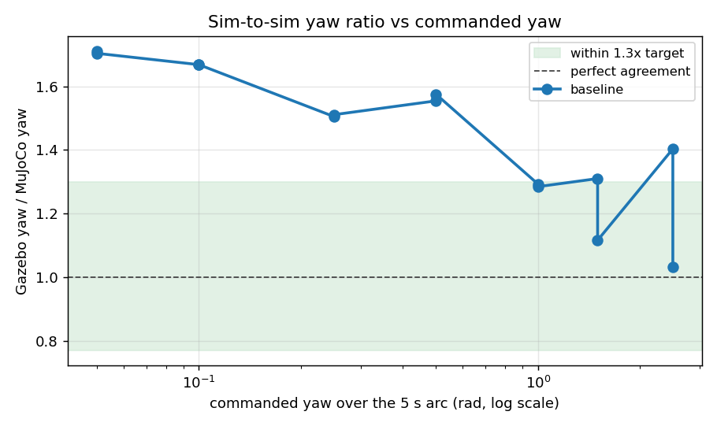
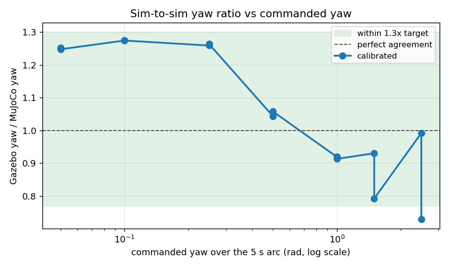

# Measured results

Every number here was measured on the machine described below, with the
command needed to reproduce it. Where something does not work, it is
reported as not working — see [pick-and-place](#pick-and-place) and
[reinforcement learning](#reinforcement-learning).

**Test machine.** Ubuntu 24.04, ROS 2 Jazzy, Gazebo Harmonic (gz-sim 8.11),
Intel laptop CPU + NVIDIA RTX 4050 (driver 580.159.03), headless
(`gui:=false`).

---

## Simulation health

Sensor and control-loop rates, measured in **simulation time** from message
stamps, so the numbers stay meaningful when the real-time factor is not 1.

```
$ ros2 run gazebo_models verify_sim.py

ok    /clock                              2984 msgs
ok    /joint_states                        100.0 Hz sim  (min 20.0)
ok    /scan                                 10.0 Hz sim  (min 8.0)
ok    /imu                                  50.0 Hz sim  (min 40.0)
ok    /camera/image_raw                     15.2 Hz sim  (min 10.0)
ok    /diff_drive_controller/odom           50.0 Hz sim  (min 30.0)
ok    /model/coco/odometry                  50.0 Hz sim  (min 40.0)

all checks passed
```

Every topic runs at its configured rate. The `min` column is the failure
threshold, deliberately well below nominal — `/joint_states` is the
loosest because the `controller_manager` loop is the first thing to dip
under load, and a slow control loop is still a working one.

Real-time factor is ≈1.0. It was ~0.23 before the model frame was fixed
— see [DESIGN_DECISIONS.md](DESIGN_DECISIONS.md#1-the-robot-was-resting-on-its-own-elbow).

---

## Navigation (Nav2)

Ten goals sent to `/navigate_to_pose` from the spawn pose, in the `map`
frame (map origin = spawn pose = world `(-2.0, 0.0)`). Reproduce with
`ros2 launch gazebo_models nav.launch.py` and the `ros2 action send_goal`
command in [RUNNING.md](RUNNING.md).

| # | Goal (map) | Result | Time |
|---|---|---|---|
| 1 | (+1.0, +0.0) | SUCCEEDED | 16.8 s |
| 2 | (+0.8, −2.2) | SUCCEEDED | 14.2 s |
| 3 | (+2.0, −1.0) | SUCCEEDED | 18.7 s |
| 4 | (+1.5, +1.0) | SUCCEEDED | 25.7 s |
| 5 | (+2.5, +0.5) | SUCCEEDED | 4.3 s |
| 6 | (+0.5, −1.5) | SUCCEEDED | 23.3 s |
| 7 | (+3.0, −0.5) | SUCCEEDED | 9.3 s |
| 8 | (+1.2, +1.8) | SUCCEEDED | 16.3 s |
| 9 | (+2.2, −2.0) | SUCCEEDED | 21.5 s |
| 10 | (+0.6, +1.2) | SUCCEEDED | 22.2 s |

**10/10 succeeded**, mean time-to-goal **17.2 s** (4.3 – 25.7 s).

Goals were verified against ground truth as well as Nav2's own report: a
goal to map (0.8, −2.2) left the robot at world (−1.137, −2.130), i.e.
within 9 cm of the requested point.

**Scope of this claim.** All ten goals are inside the mapped region.
Relocalisation from an arbitrary start pose is not exercised; AMCL is
initialised at the spawn pose.

**Superseded by M3.** The numbers above were measured with NavFn/Dijkstra
on the old map and the old world, and the corridor behind the ramp was
still unmapped. All three have since changed; the current numbers are
below.

### A\* — SmacPlanner2D, and the evidence for it

The planner was `nav2_navfn_planner::NavfnPlanner` with `use_astar:
false`, i.e. Dijkstra. Flipping that flag would have been the cheap move
and the wrong one: NavFn's A\* is *faster and produces worse paths* than
its own Dijkstra, because the gradient-descent extraction runs over a
less complete potential field. `GridBased` is now
`nav2_smac_planner::SmacPlanner2D` — real A\* on a 2D grid — and NavFn is
kept registered so the two can be compared by `planner_id` in one run.

`gazebo_models/scripts/plan_compare.py` is that comparison. Spawn → the
mission's pre-ramp pose in lane +0.75, which has to route around the Zone
A gate:

| planner | length (m) | plan (ms) | poses | min clearance (m) |
|---|---|---|---|---|
| **GridBased** (SmacPlanner2D, A\*) | **3.165** | 5.5 | 62 | 0.474 |
| NavFn (Dijkstra) | 3.373 | 5.6 | 134 | 0.496 |

A\* returns a **6.2 % shorter path at the same planning cost**, in half
the waypoints. Note the clearance column goes the other way — NavFn's
path stays 2 cm further from obstacles here. Both are far outside the
0.20 m robot radius, so it does not matter in this arena, but it is the
honest result rather than a clean sweep.

### Ten goals on the rebuilt stack

`nav_round_trip.py`, a `NavigateToPose` **action** client (the panel's
`/goal_pose` topic has no feedback, result or cancel), driving a ten-goal
tour: both pre-ramp lanes, the south-west, both lanes beside the ramp,
the east corridor in both directions, and home.

**10/10 succeeded**, mean **34.7 s**, median 27.5 s, range 11.1 – 123.5 s,
36.3 m driven, returned to within **0.12 m** of the start.

This is not comparable to the 17.2 s above — different goals, longer
routes, and it now includes the east corridor behind the ramp, which the
old map did not contain at all. The 123.5 s outlier is leg 2, a 1.5 m
lane change in front of the ramp foot that the robot has to solve by
backing out and going around.

### `allow_unknown: false`, and what it is actually protecting

With `track_unknown_space: true`, leaving `allow_unknown` true lets the
planner route confidently through unmapped space — fine in RViz, fails in
the world. It matters more than usual here: the 2D lidar sees only the
ramp's side faces, so **the ramp's interior is unknown**, and this
setting is what stops Nav2 planning a cheerful straight line over a ramp
it cannot climb. Verified — a goal at world (2.0, 0.0), inside the ramp
body:

```
planner       length m   plan ms   poses  min clear m
GridBased       FAILED
NavFn           FAILED
```

### Three more defects fixed, and one that measured nothing

- `global_costmap` ran `update_frequency`/`publish_frequency` at **1.0 Hz**
  while the local costmap ran 5.0/2.0. At 1 Hz an obstacle moving at the
  robot's own 0.25 m/s travels a quarter of a metre between updates. → 5.0.
- `collision_monitor`'s `PolygonStop` was a **0.1 m circle — smaller than
  the 0.20 m `robot_radius` both costmaps plan with**, so the stop zone
  lived inside the chassis and could only fire after contact. → 0.25, with
  slowdown and limit nested outside it at 0.40 and 0.55. All three had
  shipped as 0.1 m boxes.
- `PolygonLimit` was fully defined and **absent from the active
  `polygons:` list**; `VelocityPolygonStop` likewise, and has been deleted
  rather than left lying around. Dead config reads as protection that is
  not there.
- `BaseObstacle.scale` was **0.02 against `PathAlign`/`PathDist` at 32.0**
  — obstacle avoidance carrying 1/1600th the weight of path-following.
  Raised to 8.0, but **measuring it changed nothing**: driven clearance
  was 0.430 m at 0.02 and 0.432 m at 8.0. The route's tightest point is
  the 1.30 m Zone A gate, and a 0.4 m-wide robot centred in a 1.30 m gap
  is ~0.45 m from either side whatever the critic thinks. The measurement
  is saturated by geometry. It stays fixed because the old ratio would
  bite the moment a route offers a real choice, but no improvement is
  being claimed for it here.

An earlier version of this round *did* show clearance improving from
0.221 m to 0.43 m — that was `box_obstacle_1` being moved off the
mission's lane, not the critic. Reporting it as the critic's doing would
have been the easy mistake.

---

## Pick-and-place

### The shipped target: 4/4

`ros2 run coco_moveit_config pick_place.py`, four consecutive runs, with
the cylinder's position read from Gazebo ground truth afterwards.

| Run | Sequence | Gripper stall (rad) | Cylinder z |
|---|---|---|---|
| 1 | complete | 0.2444 / −0.1952 | 0.1280 |
| 2 | complete | 0.2348 / −0.2077 | 0.1280 |
| 3 | complete | 0.2349 / −0.2067 | 0.1280 |
| 4 | complete | 0.2361 / −0.2066 | 0.1280 |

**4/4 succeeded**, cylinder back on the pedestal at z = 0.1280 m every
time.

The "gripper stall" column is the finger position where the fingers stop,
against a commanded 0.02 rad. It is direct evidence that something is
physically held: closing on **empty air** runs all the way to the setpoint
instead. The spread across runs is 0.0096 rad (~0.5°), which is the
repeatability of the grasp itself.

### Re-targeting: 0/5 — a known limitation

`pick_place.py --target X Z` re-solves the IK and re-places the pedestal
for an arbitrary grasp point. The IK part works; the **demo does not**.

| Target (x, z) | Outcome | Cylinder z after |
|---|---|---|
| (0.160, 0.140) | rejected up front: "no hover pose above" | 0.1280 (untouched) |
| (0.150, 0.130) | aborted: empty grasp | 0.0134 (on the floor) |
| (0.145, 0.128) | aborted: empty grasp | 0.1280 |
| (0.152, 0.135) | aborted: empty grasp | 0.0137 (on the floor) |
| (0.140, 0.150) | aborted: empty grasp | 0.0140 (on the floor) |

**0/5 completed.** Only the shipped target (0.152, 0.128) works.

Two distinct behaviours, both correct as *failures*:

- (0.160, 0.140) is rejected before anything moves, because no valid hover
  pose exists above it. Clean.
- The rest reach the grasp pose, close on nothing, and abort naming the
  step. In three of four the approach knocked the cylinder off the
  pedestal onto the floor first.

**Why this is here.** Reachable IK is necessary but not sufficient: the
approach path, the re-placed pedestal and the fingertip geometry all have
to agree, and outside the tuned point they do not. This was found *by*
the grasp confirmation added in this round — before it, `move_gripper`
slept 1.5 s and returned success unconditionally, so all five of these
runs would have printed "Pick-and-place sequence complete" while the
cylinder lay on the floor. The README previously described `--target` as
working anywhere the IK finds reachable; that claim has been corrected.
Tracked in [FUTURE_WORK.md](FUTURE_WORK.md).

### Re-targeting with the magnet grasp: 5/14, and a different failure

Two changes were measured against the table above. First the MoveIt joint
tolerance went from 0.02 to 0.003 rad, which took the four points from 0/4
to 2/4 but left the ±10 mm box at 0/10. Then the friction pinch was
replaced with a gz `detachable_joint` magnet.

The ±10 mm box in that middle run **could not have passed**: at z = 0.128
the arm's x reach limit is 0.156 and the shipped grasp point (0.152, 0.128)
sits 4 mm inside it, so 4 of its 10 points were unreachable before physics
ran. The largest fully-reachable box around the shipped point is ±3 mm.
The box below is re-centred on (0.145, 0.128), where ±9 mm is reachable.

Fresh simulator per point — the DetachableJoint binds to the target model
on first spawn and never re-scans, so a second pick in the same sim welds
nothing (see below).

| Set | Points | Completed |
|---|---|---|
| `docs/RESULTS.md` four | 4 | **1** |
| ±9 mm box around (0.145, 0.128) | 10 | **4** |

**The grasp itself is solved.** Not one run failed on the grasp: the
"closed on empty air" outcome, which was every failure in the table above
and 6/6 of the reachable box points in the tolerance-only run, has
disappeared entirely. All five completed runs lifted the cylinder a
*measured* 32.4–39.8 mm, read back out of Gazebo rather than inferred from
finger positions.

**What fails now is motion planning, and it splits cleanly on x:**

| x | Outcome |
|---|---|
| ≥ 0.1505 | completed (5/5, ignoring one lift-check failure at 0.152) |
| ≤ 0.1468 | `grasp approach` failed, MoveItErrorCode 99999 (7/7) |

move_group's own log gives the reason, and it is not the grasp:

```
Constraint satisfied:: 'm_link1_Revolute-6' actual 0.322630, desired 0.321759
Constraint satisfied:: 'm_link2_Revolute-7' actual 0.920110, desired 0.919887
Found a contact between 'pedestal' (Object) and 'm_link3' (Robot link),
  which constitutes a collision
RRTConnect: Unable to sample any valid states for goal tree
```

The goal is kinematically fine and both joint constraints are satisfied.
It is rejected because the **palm intersects the pedestal**: the arm has
no wrist, so a grasp point closer to the robot is reached by curling the
forearm back over the 50 mm pedestal box. Pedestal *height* is not the
driver — points with a 90 mm pedestal fail as readily as one with 120 mm.
x is.

This matters for the fetch mission because the mission has **no
pedestal**. The four coloured objects sit on a flat ramp platform, where
the obstruction this measures does not exist. So 5/14 is the score for
*this demo scene*, not a bound on the mission, and the number to carry
forward is the grasp result: the magnet holds, verified physically, at
every point the planner will accept.

### The magnet binds once per simulator

`DetachableJoint` attaches its child the instant the model appears, not
when commanded — a cylinder spawned 1 m to the side at z = 0.80 hung there
instead of falling, and dropped the moment a detach was published. So
`pick_place.py` detaches immediately after spawning.

Worse, the binding is not renewed. Remove the target and spawn it again —
which is what `clear_scene()` does between runs — and the new model is
never bound. It falls freely, no state transition is published, and a
later attach command still answers `"attached"` while welding nothing.
Verified by attaching after a respawn and then moving the arm: the target
stayed on the ground.

That is a silent success, the exact failure class this demo was fixed for
once before, so the grasp is no longer trusted to the plugin's own state
topic. `check_lifted()` reads the target's height out of Gazebo and
requires it to have risen with the arm.

### A welded magnet stops the base turning, but not driving

Attaching on spawn has a second consequence that cost an afternoon to find.
The mission world spawns four targets on the platform, so the robot comes up
welded to four bodies six metres away. Measured, commanding −0.3 rad/s for
six seconds:

| | yaw before | yaw after |
|---|---|---|
| welded | 0.000 | **0.000** |
| detached | 0.000 | **−1.342** |

Translation is barely affected — commanded 0.3 m/s the robot still covered
1.0 m in 4 s, dragging the constraint — but it **cannot turn at all**. A
fixed joint constrains orientation as well as position, and yawing the palm
would have to swing four bodies through an arc six metres out.

This surfaced as `map_drive.py` aborting on its first waypoint, which is a
~90° turn in place, with nothing in the log but a timeout. The robot was
driving; it just could not point anywhere new. Because the first symptom
looks like a controller or steering fault, `gazebo_models/scripts/
magnet_release.py` exists to detach every target at startup, and
`full_world_robo.launch.py` runs it whenever `traverse:=true`.

---

## Inverse kinematics

Pure computation, no simulator. Reproduce with the numbers in
`coco_moveit_config/test/test_arm_ik.py`.

| Metric | Value |
|---|---|
| Round-trip recovery | 20,000 / 20,000 random joint pairs |
| Max round-trip error | 1.7 × 10⁻¹⁶ m |
| Mean round-trip error | 2.0 × 10⁻¹⁷ m |
| Solve time | 1.5 µs (≈675,000 solves/s) |
| FK at the verified grasp | fk(0.30, 0.58) = (0.1523, 0.1281) m |

Reachable pinch-point envelope in the `base_footprint` frame, sampled over
the joint-limit box:

| Axis | Range |
|---|---|
| x | −0.312 … +0.162 m |
| z | −0.063 … +0.385 m |

The envelope extends behind the robot (negative x) because the arm is rear-
mounted. Part of it is inside the chassis or below the floor and is not
usable — the envelope is the kinematic limit, not the free workspace.

---

## Tests

| Suite | Tests |
|---|---|
| `coco_rl` | 35 |
| `coco_config` | 19 |
| `coco_moveit_config` | 12 |
| `custom_teleop` | 11 |
| `gazebo_models` | 20 |
| **Total (unit)** | **97** |
| `gazebo_models` launch test (opt-in) | 6 cases |

0 failures, **0 skipped**. CI fails if the collected count drops below 75,
so a suite cannot vanish silently — which it previously did, when the
`coco_rl` tests `importorskip`'d on a `gymnasium` that CI never installed.

The rebuilt ramp added 13: 11 in `gazebo_models` for the wedge generator
(`test_gen_ramp.py`) and 2 in `coco_rl` pinning the summit goal.

> **Counting caveat.** A bare workspace-level `colcon test-result` reports a
> larger number (108 here) because ament_cmake packages keep a
> `build/<pkg>/Testing/<timestamp>/Test.xml` directory *per run*, and the scan
> sums the stale ones too. The table counts each package's current result file
> only (`pytest.xml` / `*.xunit.xml`). Delete `build/` for a clean total.

Reproduce:

```bash
colcon test --packages-select gazebo_models custom_teleop coco_config \
                              coco_moveit_config coco_rl
colcon test-result --verbose
```

---

## Reinforcement learning

The RL task was rebuilt after the original "unsolved" result was traced to
its real cause: the ramp was **geometrically unclimbable**, and the goal only
reached the ramp *foot*. Both are fixed, and the fix is measured below. Full
story in
[DESIGN_DECISIONS.md](DESIGN_DECISIONS.md#diagnosing-and-replacing-the-unclimbable-ramp).

### Before — the shipped mesh (0/10, and why)

| Metric | Value |
|---|---|
| Steps trained | 47,204 |
| Episodes | 528 |
| Rolling-mean return | −11 … −13 throughout |
| Deterministic evaluation | **0/10 successes** (0 tips, 10 timeouts) |


The robot survived (0 tips) but never climbed. The honest reason turned out
to be twofold, and neither was the policy:

1. **The mesh could not be climbed by anything.** Profiling `rampcoco.stl`
   (4.40 m run × 1.10 m rise) shows it is not a wedge: ~0.4 m from the foot
   the surface rears up into a **~66° near-vertical face with an overhang**,
   then a sustained ~39° grade. A skid-steer cannot mount a 66° face or a
   step taller than its wheel. Wheel-contact friction is `mu = 0.7` (no-slip
   to ~35°), so a clean grade would have been trivial.
2. **The goal was the foot, not the top.** `GOAL_X_PROGRESS` was 3.0 m,
   which from spawn `(-2,0)` reaches only world x≈1.0 — the ramp foot.
   "Climbing" was never the trained objective.

The 0/10 above is kept as the **before** baseline, not as the project's RL
result.

### After — the rebuilt curriculum, measured

The environment was replaced with a parametric wedge
([`gen_ramp.py`](../gazebo_models/scripts/gen_ramp.py)), a summit goal, and a
12° → 18° → 24° curriculum selected by `ramp_angle:=`. Measured on the test
machine with `./verify_all.sh`:

**The robot climbs.** `climb_check.py` drives it forward from spawn and
watches ground-truth odometry + IMU:

```
$ ros2 run gazebo_models climb_check.py
progress 5.21 m / goal 5.50 m   peak pitch 18.1 deg (>= 7.2 needed)
PASS climb_check: robot reached the 18 deg ramp summit under forward drive.
```

The **peak pitch of 18.1° against a requested 18.0° grade** is the load-bearing
number: it confirms the physics engine sees exactly the geometry `gen_ramp.py`
was asked to emit, so the grade is real rather than nominal.

**PPO smoke run** (2048 steps, seed 0, 18° wedge). This is a *plumbing check*,
and it is reported with its run-to-run spread rather than its best run, because
two identically-seeded runs disagree:

| Metric | Before (old ramp) | Run A | Run B | Run C |
|---|---|---|---|---|
| Episodes | 528 (47k steps) | 50 | 58 | 62 |
| Mean episode length | ~33 steps | 40.3 (max 130) | 34.9 (max 112) | 32.5 (max 122) |
| Mean return | −11 … −13 | −9.50 | −10.96 | −10.77 |
| Best episode return | negative throughout | +5.99 | −6.00 | −3.07 |

**Read this conservatively.** All three runs used `--seed 0`. `--seed` pins the
policy and action sampling but *not* the physics — Gazebo is not
bit-reproducible — so identically-seeded runs diverge, as the spread above
shows. Only run A reached a positive return; mean returns sit in roughly the
same band as the old ramp, and mean episode length straddles the old ~33 steps.
So 2048 steps of PPO demonstrates that the **pipeline runs correctly against
the new environment** and nothing more. It is not evidence of learning, and no
success-rate claim is made until the full curriculum has actually been trained.

The load-bearing evidence that the rebuild worked is `climb_check.py`, not
these returns: it is stable across runs (5.20–5.21 m progress, peak pitch
18.0–18.1°) and shows the robot physically reaching the summit on a grade the
old mesh made impossible.

**Nav2 is unaffected by the world change.** The rebuilt ramp and the one moved
cylinder do not disturb navigation — a goal at map `(1.0, 0.0)` still returns
`SUCCEEDED` in the same run (`./verify_all.sh --with-nav`, stage 7).

### SOLVED — 10/10 on the full task at 18° and 24°

A five-stage curriculum (`./train_curriculum.sh`) that walks the **start line** back
before raising the **grade** — 12° from +2.5 m, +1.0 m, 0 m, then 18°, then 24°, all at
the full 5.2 m goal. 207,400 env-steps, seed 0, `randomize off`.

| Stage | Episodes | Mean return | Deterministic eval |
|---|---|---|---|
| 12° from +2.5 m | 518 | 45.56 | not evaluated¹ |
| 12° from +1.0 m | 186 | 35.07 | 0/10² |
| 12° full distance | 197 | 45.41 | 0/10³ |
| **18° full distance** | 198 | 58.47 | **10/10 (100%)** |
| **24° full distance** | 214 | 60.72 | **10/10 (100%)** |

```
$ python3 -m coco_rl.evaluate phase5_24deg_s0p0.zip --episodes 10
episode  1: goal    return   69.82  steps 127
...
episode 10: goal    return   69.85  steps 127

success rate: 10/10 (100%)  tipped: 0  timeout: 0
```

126–127 steps and returns of 69.49–69.85 across ten episodes: the policy solves it the
same way every time, not occasionally by luck.

**Re-verified on the shortened ramp (M2).** The fetch mission needs a 1.5 m
platform at the crest, which only fits if the wedge's run drops 2.5 → 2.0 m
(otherwise the mirrored down-ramp lands 0.5 m from the east wall, too close for
the robot to turn around). That changes the geometry the policy trained on — at
18° the rise goes 0.81 → 0.65 m and the task 5.5 → 5.0 m — so the shipped policy
was re-evaluated rather than assumed to transfer:

| Grade | Result | Steps | Returns |
|---|---|---|---|
| 18° | **10/10**, 0 tipped, 0 timeout | 116–121 | 65.15–65.42 |
| 24° | **10/10**, 0 tipped, 0 timeout | 118–122 | 64.93–65.13 |

No retraining. The returns are ~4.5 lower purely because progress reward scales
with a task that is now 0.5 m shorter, and the step counts drop to match. The
*grade* is what the policy senses through pitch, and that did not change.

¹ Stage 1 completed, then a filename bug made the runner think it had failed; on resume
it was correctly skipped as done — and skipping a phase skips its evaluation.
² Evaluated on the full task while trained from +1.0 m, so it is scored on a metre more
than it practised. It reached 3.88 m of 5.2 m with **zero tips**.
³ A genuine matched failure: the greedy policy stalled at 4.34 m, reproducibly, with
returns identical to within 0.02. Continued training at 18° and 24° resolved it.

### The three bugs between 0/10 and 10/10

**1. The ramp was unclimbable.** Covered above.

**2. The goal sat 1.6 cm beyond the tip-over terminator.** The goal was the exact crest,
but the wedge's back face is vertical, so a robot whose base reaches the crest is already
pitching over the drop — and `is_tipped` (0.6 rad) fires before `x` crosses the line. A
completed climb at **x = 5.4838** was logged as `tipped` against a 5.5 m goal. This is
why the first 180k-step curriculum recorded **1 goal in 1,399 episodes** while best
returns reached +64. Fixed with `GOAL_MARGIN = 0.3`.

**3. `--fast` was corrupting the control loop.** The dominant cause. Unlocking the
real-time factor makes sim time outrun wall-clock ROS message delivery, so `cmd_vel`
arrives late and intermittently and the `diff_drive_controller`'s 0.5 s `cmd_vel_timeout`
**repeatedly halts the wheels**. That stop-start pumping reared the chassis nose-up and
flipped it backwards. Same seed, same configuration, only the flag differing:

| | with `--fast` | without |
|---|---|---|
| Episodes | 533 | 48 |
| Tipped | **531** | **0** |
| Goals | 2 | 31 |
| Mean return | −6.32 | +56.84 |
| Deterministic eval | **0/10** | **10/10** |
| Throughput | 8.2 steps/s | **8.7 steps/s** |

It also explains a reading that puzzled us for hours — commanded 0.4 m/s measuring only
0.11–0.15 m/s. The wheels were being halted for much of each step.

**`--fast` never bought anything.** `STEP_DT` is 0.1 s, so real time caps throughput at
10 env-steps/s, and the measured rate *with* the flag was 8.2. Physics was never the
bottleneck; the ROS round-trip always was. The flag was pure downside, and it is now
deprecated with a loud warning and removed from `train_curriculum.sh` and `verify_all.sh`.

The pattern holds across the whole investigation: every scripted check that passed
(`climb_check`, every manual probe) never called `set_physics`; every training run that
failed used `--fast`.

### Wrong diagnoses made along the way

Recorded because the process matters as much as the result. Each was stated confidently
and each was wrong:

1. *"Needs more compute."* Ignored that the environment was broken.
2. *"No per-step time penalty, so safe creeping wins."* `TIME_PENALTY = 0.01` had always
   existed; the claim came from reasoning about incentives over 10 evaluation episodes
   instead of reading 1,399 training episodes.
3. *"77–92% tipped."* Inferred from return and length, which cannot separate a tip-over
   (−10) from a `sim_stalled` truncation (reward 0.0) — the outcome was not being logged
   at all. Fixed by adding `info_keywords=('outcome',)` to the Monitor.
4. *"Wheel friction is mu = 2.5."* That is the gripper finger pads; the wheels are 0.7.
5. *"The simulator degrades over a long run."* A fresh sim gave the same result.

A 5-hour laptop suspend mid-run (03:43→09:01) is also worth recording: the run survived
it without a scratch because the env's stall deadlines use `time.monotonic()`, which does
not tick while suspended. Under the previous `time.time()` deadlines every one would have
expired at once on resume.

**Still compute-bound as well.****Still compute-bound as well.** The env steps at ~8 env steps/s (Gazebo is the
bottleneck), so each 60k phase is ~2 h. Reward shaping is the cheaper lever to
pull first; the scaling paths in [FUTURE_WORK.md](FUTURE_WORK.md) item 9 apply
after that.

**Reproducing the figure.** The Monitor CSVs are committed under
[`docs/data/`](data/):

```bash
python3 -m coco_rl.plot_curve \
    docs/data/ppo_run_part1_trimmed.monitor.csv \
    docs/data/ppo50k_b.monitor.csv \
    -o docs/images/ppo_learning_curve.png
```

This reproduces the committed PNG byte-for-byte
(md5 `dbd195d8926d8af2768220cdc7dbc64d`).

## Fetch mission — vision and object selection

`target_finder` measured against Gazebo ground truth by
[`vision_check`](../coco_perception/coco_perception/vision_check.py),
which teleports the robot to a grid of poses on the crest platform, asks
for each colour in turn, and compares the reported position with
`gz model -p`. Sim launched `traverse:=true gui:=false`, camera confirmed
at 14.9 Hz colour / 15.0 Hz depth before the run.

Teleport rather than climb, deliberately: the RL policy has a measured
+0.61 m of lateral drift, so using it as the transport would confound a
vision measurement with a locomotion one.

### Detection and position error

`d` is base_footprint to the target row; the camera sits 0.125 m further
forward. `dx`/`dy` are reported minus ground truth, in base_footprint.

| colour | Ø | d = 0.850 | 0.650 | 0.450 | 0.300 |
|---|---|---|---|---|---|
| red | 20 mm | −1.0, +2.0 | −1.0, +1.0 | −1.0, +1.0 | −1.0, −0.0 |
| green | 24 mm | −0.0, +2.0 | −1.0, +1.0 | −1.0, +1.0 | −1.0, +0.0 |
| blue | 28 mm | −1.0, +2.0 | −2.0, +1.0 | −1.0, +1.0 | −1.0, +0.0 |
| yellow | 32 mm | −1.0, +2.0 | −1.0, +1.0 | −1.0, +1.0 | −2.0, −0.0 |

**16/16 detected, 16/16 inside ±8 mm**, worst case 2 mm — against a
~27 mm approach window (see *Reach*, below). Two honest caveats:

- The status line carries three decimal places, so this measurement
  cannot resolve below 1 mm. "±2 mm" means "≤2 mm at 1 mm resolution",
  not that the error is exactly 2 mm.
- `dy` is **not** noise: it decays +2.0 → +1.0 → +1.0 → 0.0 as the robot
  closes in, which is what a constant *angular* bias looks like. 2 mm at
  0.725 m is 2.8 mrad, i.e. 0.6 px of centroid bias on a blob 6 px wide —
  sub-pixel, and it vanishes exactly where the grasp needs it to.
  `dx ≈ −1 mm` is roughly 10 % of the front-surface correction.

### Apparent width against the pinhole model

Predicted `diameter × fx / range` with fx = 221.765 px, measured from the
connected component:

| colour | 0.725 m | 0.525 m | 0.325 m | 0.175 m |
|---|---|---|---|---|
| red Ø20 | 6.1 → **6** | 8.4 → **8** | 13.6 → **14** | 25.3 → **26** |
| yellow Ø32 | 9.8 → **10** | 13.5 → **14** | 21.8 → **22** | 40.5 → **40** |

Every cell within 1 px. Note what this also shows: adjacent diameters
differ by ~1.3 px at the working distance, so **apparent size cannot
identify which object it is** — colour does that, and the width gate is
a sanity check on the range.

### Wrong-lane signal

Standing in one lane while asking for another's target. The neighbouring
object stays in frame at this distance, so the answer is a diagnosis
rather than a silence:

| asked for | standing in | result |
|---|---|---|
| red | green | `found=0 seen=green` |
| green | blue | `found=0 seen=blue` |
| blue | yellow | `found=0 seen=yellow` |

This is what the RL policy's lateral drift will show up as, and it costs
nothing to produce.

### Reach — why the targets are 158 mm tall

Scanned directly from `arm_ik.ik()`. The target's axis has to stop inside
`[chassis front + radius + 5 mm, max reach at the grasp height]`:

| grasp height | max reach | window, Ø12/18/24/30 as originally spawned |
|---|---|---|
| z = 0.030 (60 mm cylinder on the platform) | 0.1299 | +3.9 / +0.9 / **−2.1** / **−5.1** mm |

Two of the four mission targets were **geometrically impossible to
grasp**, and the other two needed the base to stop within 4 mm. Nothing
reported it: the world spawns, the camera sees them, and MoveIt returns
an unreachable goal at the last step of the mission.

At 158 mm tall the grasp band lands at z = 0.128 — `arm_ik.fk(0.30, 0.58)
= (0.15231, 0.12809)`, the exact pinch point with measured 32–40 mm
lifts — where max reach is 0.1608:

| colour | Ø | window | static tip angle |
|---|---|---|---|
| red | 20 mm | +30.8 mm | 7.2° |
| green | 24 mm | +28.8 mm | 8.6° |
| blue | 28 mm | +26.8 mm | 10.0° |
| yellow | 32 mm | +24.8 mm | 11.4° |

`coco_config/test/test_reach.py` fails if anyone shortens them again.

### Tip-over — the one risk the taller targets introduced

Measured, since 7–11° is not a large margin. RPY after spawn settling,
and again after the robot was teleported to the closest station
(base x = 3.75, its front face 0.15 m from the row) in all four lanes:

```
target_red     [4.049990 -0.750000 0.728839]  [ 0.000000 -0.000002  0.000000]
target_green   [4.049990 -0.250000 0.728839]  [ 0.000000 -0.000000  0.000000]
target_blue    [4.049990  0.250000 0.728839]  [ 0.000000 -0.000000  0.000000]
target_yellow  [4.049990  0.750000 0.728839]  [-0.000000  0.000002  0.000000]
```

Identical before and after: upright to 2 µrad, z exactly
0.6498 + 0.079, lateral drift 10 µm.

**That result holds only for a controlled approach, and the end-to-end
run below shows where it does not.** A robot arriving under RL control
with 0.59 m of lateral drift drove into `target_yellow` and knocked it
flat (`rpy [-1.5708, -0.4415, -1.5684]`). So: the taller targets are
stable against spawn settling and against the robot stopping beside
them, and they are not stable against being driven into. The cause is
the drift, not the height — but a 158 mm cylinder is easier to topple
than a 60 mm one, and that is the price of the reach fix. The fallback
(a 30 mm-deep grey plinth, ~20 mm window) is not needed for the
approach; it would not have helped here either.

### What the camera cannot do

Two limits worth stating because they are geometry, not tuning:

- **Nothing on the platform is visible from the flat ground.** The sight
  line over the crest edge (3.0, 0.6498) reaches z = 0.9068 at the target
  row from the pre-ramp pose, 0.8533 from mid-arena and 0.7750 from home;
  the targets top out at 0.8078. There is no pose from which the robot
  can survey the objects before choosing a lane, so the colour→lane
  decision is a table lookup in `coco_config.robot`.
- **The gripper's workspace is never in frame.** The arm reaches to
  base-x 0.1617 and the nearest visible ground is 0.252 at pitch 0. The
  design is classify-at-range then approach open-loop — and at the
  closest station there is 73 mm of travel left to the grasp pose, which
  at ~1 % wheel-odometry error is under 1 mm against a 27 mm window.

### End-to-end: the wrong-lane signal firing for real

One full `traverse_demo.py --colour blue` with the whole stack up — sim,
Nav2 (`arbiter:=true`), `cmd_vel_arbiter`, `target_finder`, `ramp_driver`
on the phase-5 policy:

| step | result |
|---|---|
| 1. nav to the pre-ramp pose (0.5, +0.25) | SUCCEEDED, 41.7 s |
| 2. RL climb | `outcome=goal`, 63 steps, `progress=4.70`, **`lateral=+0.59`** |
| 2b. confirm blue is in front | **`sel=blue found=0 seen=yellow`** |
| 3. scripted descent | `outcome=goal`, 423 steps, `progress=6.65` |
| 4. nav home | SUCCEEDED, 61.7 s |

`TRAVERSE COMPLETE`, home to within **0.03 m**. Arbiter source trace
`nav → rl → rl → nav`, one publisher on the wheel topic throughout.

The interesting line is 2b. The robot was sent to lane **+0.25** and
arrived at **+0.84** — 0.59 m of drift, which lands it in **yellow's**
lane at +0.75. `target_finder` reported exactly that: the requested blue
was not in front, and what *was* in front was yellow. This is the
wrong-lane diagnosis working on a real failure rather than a staged one,
and it independently reproduces the +0.61 m drift measured in M4.

It also puts a number on why M6 is blocked. The drift does not merely
miss the target: it drove the robot into a *different* target and
knocked it over. Grasping cannot be attempted until the policy holds a
lane.

### A bringup trap that cost three runs

The first three attempts at the run above failed with Nav2 rejecting
every goal (`bt_navigator: Action server is inactive`). The cause was not
Nav2: `ros2 launch gazebo_models full_world_robo.launch.py` spawns
`parameter_bridge`, `robot_state_publisher` and `cmd_vel_relay` as
**separate processes whose command lines do not contain
"full_world_robo"**. Killing only the launch pattern left six orphaned
bridges and five relays running across successive attempts, and a stale
`/clock` publisher makes every consumer see time jump backwards:

```
tf2_buffer: Detected jump back in time. Clearing TF buffer.
global_costmap: ... 'map' and 'base_footprint' ... are not part of the
                same tree. Tf has two or more unconnected trees.
amcl: Message Filter dropping message ... 'discarding because the queue
      is full'
```

AMCL then never updates, its `map→odom` expires, `global_costmap` never
finishes activating, `bt_navigator` is never activated, and it rejects
goals — four layers away from the actual fault. Each successive run was
*worse* than the last, which is the tell. Kill by process name, not by
launch-file name.

## Fetch mission — grasp and carry (M6)

### The +0.6 m drift was never the policy steering badly

M4 measured +0.61 m of lateral drift over the climb and M5 measured
+0.59 m, and both were written up as "the policy has no closed-loop
lateral control". That is true, and it is not the cause.

Teleport the robot to the pre-ramp pose at **exactly yaw 0** and the bare
policy climbs 2.5 m with **+0.03 m** of drift, in every lane:

| lane | end y (gz ground truth) | drift | outcome |
|---|---|---|---|
| −0.75 | −0.7184 | +0.032 | goal |
| −0.25 | −0.2185 | +0.032 | goal |
| +0.25 | +0.2804 | +0.030 | goal |
| +0.75 | +0.7826 | +0.033 | goal |

The policy holds a line to 3 cm over 2.5 m. What it cannot do is *correct*
one — and `nav2_params.yaml` sets `yaw_goal_tolerance: 0.25`, so a Nav2
leg is allowed to finish 0.25 rad off. **2.5 m of climb at 0.25 rad is
0.64 m of lateral**, which is the entire measured drift.

That reframes it from an accuracy problem to a safety one. Starting from a
Nav2-legal heading error, open loop:

| lane | start yaw | end y | drift | outcome |
|---|---|---|---|---|
| −0.75 | +0.25 | −0.168 | +0.582 | goal |
| −0.75 | −0.25 | **−1.174** | −0.424 | **timeout** |
| −0.25 | +0.25 | +0.330 | +0.580 | goal |
| −0.25 | −0.25 | −0.729 | −0.479 | goal |
| +0.25 | +0.25 | +0.829 | +0.579 | goal |
| +0.25 | −0.25 | −0.234 | −0.484 | goal |
| +0.75 | +0.25 | **+1.182** | +0.432 | **timeout** |
| +0.75 | −0.25 | +0.273 | −0.477 | goal |

The platform ends at ±1.25 m. Both outer-lane adverse cases finish within
**70 mm of the edge**, and neither reached the summit at all.

### The lane hold, and why the gains are what they are

`ramp_driver.lateral_hold` adds a clamped cross-track + heading correction
to the policy's yaw action. Linearising about the centreline with
v = 0.4 m/s and the env's `MAX_ANG` = 0.5 rad/s gives
ω_n = √(v·MAX_ANG·K_Y) and ζ = MAX_ANG·K_YAW/(2ω_n).

The clamp was swept first, on the theory that the correction was
authority-limited (it sat pinned at 0.4 for every step of every climb):

| clamp | +0.25 yaw | −0.25 yaw |
|---|---|---|
| 0.4 | +0.219 | −0.157 |
| 0.8 | +0.216 | −0.157 |
| 1.2 | +0.212 | −0.156 |
| 2.0 | +0.213 | −0.156 |

6 mm across a 5× range — so authority was not the limit. Bandwidth was:
the climb lasts ~6 s and at K_Y = 1.2 that is ω_n·t = 2.9 rad, under half
a correction cycle. Sweeping the gains instead:

| K_Y | K_YAW | ω_n | ζ | +0.25 yaw | −0.25 yaw |
|---|---|---|---|---|---|
| off | off | — | — | +0.582 | −0.484 |
| 1.2 | 1.6 | 0.49 | 0.82 | +0.218 | −0.155 |
| **3.0** | **2.5** | **0.77** | **0.81** | **+0.053** | **−0.016** |
| 5.0 | 3.2 | 1.00 | 0.80 | −0.021 | +0.061 |
| 8.0 | 4.0 | 1.26 | 0.79 | −0.078 | +0.107 |

The **sign flips** above 3.0: past that the loop crosses the centreline
before the climb ends. That is what makes 3.0/2.5 a real minimum rather
than the best of four noisy numbers. All 8 climbs reached the goal at
every gain setting tried, against 6/8 open loop.

Shipped: `LATERAL_GAIN = 3.0`, `HEADING_GAIN = 2.5`, `LATERAL_CLAMP = 0.8`
(just above the 0.625 peak those gains ask for). Worst case **0.053 m**
against 0.582 m open loop — **11×**, and no retraining.

> **Read that 0.053 m with its condition attached.** It was measured from a
> **teleported** start at a heading error of **exactly ±0.25 rad**, and it
> is displacement from where the climb began, not cross-track from the
> lane. Under **mission conditions** — arriving on a real Nav2 leg, with
> cross-track measured from the target lane centreline — the same
> controller gives **mean +0.120 m, max +0.301 m, with 3 of 20 runs more
> than a half-lane off**. Both numbers are real; they are not the same
> measurement. The comparison is laid out in
> [the envelope section below](#the-lane-holds-envelope-is-wider-than-0053-m-and-here-is-why).

### The 1.198 m nothing was driving

`GOAL_SUMMIT` ends the RL episode at world x = 2.700. The crest is at
3.000, the target row at 4.050, and the base has to stop at ~3.90 for the
arm to reach. Nav2 cannot drive that (from the flat the ramp scans as a
wall and the platform is unmapped with `allow_unknown: false`), the climb
episode has ended, and `/ramp/descend` drives straight through the row to
6.65 — which is how the M5 run knocked `target_yellow` flat.

`approach_server` fills it in four phases: `crest` (drive off the slope on
IMU pitch, 0.314 rad of grade against a 0.06 rad threshold), `servo` (pure
pursuit on `/perception/target`), `align` (turn in place to null the
bearing), `creep` (straight, blind, on wheel odometry).

`align`-then-`creep` rather than servoing to the end, because **perception
goes blind before the stop pose**: target_finder's minimum range is 0.15 m
of surface depth from a camera at base-x 0.125, so the last fix lands at a
target axis of ~0.29 m while the stop is at ~0.15. Nulling the bearing
first means the blind leg runs *along* the line to the target, so it
closes range without reintroducing lateral error.

### The approach window is 5.5 mm, and it has nothing to do with the target

Two corrections landed on this number, and the second replaced the whole
model.

**The far bound was measured at the wrong height.** `test_reach.py`
computed it as the arm's reach at the grasp height, 0.16085. The descent
starts from `GRASP_HOVER_CLEARANCE` above that, where reach is only
**0.15651** — and both ends have to be in the envelope or the plan cannot
be *started*, which move_group reports identically to an unreachable
goal. That cost 4.3 mm.

**The near bound was not what anyone thought.** With the far bound fixed
the windows still looked comfortable — 15.5 to 21.5 mm depending on
thickness, derived from `CHASSIS_FRONT_X + radius + PALM_MARGIN`. Then
the first end-to-end fetch stopped at base-x **0.1443**, comfortably
inside the 32 mm target's `[0.1410, 0.1565]`, and `/grasp/pick` failed at
*grasp approach* before physics ran.

Probing `move_group`'s `/check_state_validity` with `arm_ik` solutions at
1 mm steps found why:

| pinch base-x | `/check_state_validity` reports |
|---|---|
| ≤ 0.1440 | `chassis_link`/`m_link2` **and** `chassis_link`/`m_link3` |
| ≤ 0.1490 | `chassis_link`/`m_link2` |
| ≥ 0.1500 | valid |

The arm has no wrist. Reaching a pinch point closer to the base means
curling the forearm back over the chassis, and below 0.150 it is inside
the chassis collision box. `pick_place.py`'s `POSES` comment had said as
much in words since M3 — *"anything deeper than about [0.30, 0.58] clips
m_link2/m_link3 into the chassis box"* — this is that sentence with a
number on it.

`GRASP_SELF_COLLISION_X = 0.150` is 9 mm outside even the thickest
target's chassis bound, so it dominates all four:

| colour | Ø | chassis bound | window (target axis, base-x) | width | stop |
|---|---|---|---|---|---|
| red | 20 mm | 0.1350 | **0.1510 – 0.1565** | 5.5 mm | 0.15375 |
| green | 24 mm | 0.1370 | **0.1510 – 0.1565** | 5.5 mm | 0.15375 |
| blue | 28 mm | 0.1390 | **0.1510 – 0.1565** | 5.5 mm | 0.15375 |
| yellow | 32 mm | 0.1410 | **0.1510 – 0.1565** | 5.5 mm | 0.15375 |

At the working depth **this arm has one grasp pose, not four**. The
diameters stopped mattering the moment the bound was measured, which is
worth knowing before anyone tunes something per colour —
`test_every_colour_shares_one_window` exists so that attempt fails loudly
rather than quietly doing nothing.

The approach still stops at the **centre** rather than the demo's fixed
0.152, and centring matters more at 5.5 mm than it did at 15.5: 0.152
sits 1.0 mm above the near bound and 4.5 mm below the far one, so a stop
that aimed there would have 1 mm of margin on the side where being wrong
means the plan is rejected. Centring makes it ±2.75 mm. Nothing is lost
by moving off 0.152 — the grasp pose is solved from wherever the target
actually ends up, exactly as `pick_place.retarget()` already did.

Hitting ±2.75 mm is the reason `CREEP_SPEED` is 0.03 m/s rather than the
0.06 it started at. The creep can only stop on a control tick, so at
20 Hz the raw quantisation is 1.5 mm, plus 0.9 mm of braking at the
controller's 2.0 m/s² limit — one-sided, and measured at 3.5 mm of
overshoot on the first run. `CREEP_LEAD` subtracts half a tick plus the
braking distance from the commanded distance, which converts that into a
symmetric **±0.75 mm**.

### Only two arm poses can carry the object down the ramp

Computed against `arm_ik` with the palm rotation the weld freezes in — the
object tilts *with* the palm, it does not stay vertical — here is the
carried object's lowest point relative to the wheel contact plane:

| pose | pinch (x, z) | object tilt | level | 12° | 18° | 24° |
|---|---|---|---|---|---|---|
| `home` | (0.162, 0.148) | −16.0° | +0.025 | −0.016 | **−0.037** | −0.057 |
| `grasp` | (0.152, 0.128) | 0.0° | +0.000 | −0.032 | **−0.047** | −0.062 |
| `raise` | (0.156, 0.163) | +4.0° | +0.036 | +0.004 | **−0.012** | −0.027 |
| `lift` | (0.145, 0.235) | +12.6° | +0.110 | +0.083 | +0.068 | +0.053 |
| **`up`** | (0.045, 0.344) | +24.1° | +0.227 | +0.223 | **+0.218** | +0.210 |

The mission carries down an 18° slope. Three of the five would drag the
object into the ramp. `up` is the carry pose, with 0.218 m of clearance.

### The arm has to be stowed before the approach, not after

At `home` the pinch sits at base-x 0.162, z 0.148 — inside the volume the
target occupies once the robot has driven up to it (axis at ~0.149, body
from z 0 to 0.158). That is not merely a planning-scene collision at the
start state: it is the gripper physically walking into the cylinder during
the approach and knocking it over before anything has looked at it.
Hence `/grasp/stow`, called at step 2c, and `up` doing double duty as the
stow and the carry pose.

### The magnet fires before the fingers close

The reverse of the demo's order, and for a measured reason: the demo's
cylinder sits on a pedestal and is 28 mm thick, while these stand free on
the platform and the thinnest is 20 mm, which tips at about 7°. The
fingers do not close symmetrically — `grip2` carries a 0.2332 rad pitch in
its collision geometry — so closing first risks nudging a free-standing
target over before anything holds it. Welding first freezes it where it
stands and makes the close what it already was: corroborating evidence.

### End to end: the fetch completes

**M6 is closed.** One full `--colour blue` fetch on the v1 wedge world,
fresh simulator, with the corrected approach window. All seven steps,
230.9 s from the first log line to the last. Reproduce — and note the
**absolute** policy path, for the reason below:

```bash
# T1 — fresh simulator, every run
ros2 launch gazebo_models full_world_robo.launch.py traverse:=true gui:=false
# T2
ros2 launch coco_mission mission.launch.py \
    policy:=/home/gautham/coco_rl_runs/curriculum_20260726_211008/phase5_24deg_s0p0.zip
# T4
ros2 run gazebo_models traverse_demo.py --colour blue
```

| step | mode | result | time |
|---|---|---|---|
| 1. nav to the pre-ramp pose (0.5, +0.25) | `nav` | SUCCEEDED | 22.6 s |
| 2. RL climb | `rl` | `outcome=goal`, 60 steps, progress 4.72, **lateral +0.09** | 12.8 s |
| 2b. confirm blue is in front | — | `sel=blue found=1 … seen=green,blue,yellow` | 3.0 s |
| 2c. stow the arm | `idle` | `outcome=done` | 2.9 s |
| 3. approach the target | `approach` | `outcome=arrived`, travel 1.152 m | 12.7 s |
| 4. pick it up | `idle` | **`outcome=held`, `lifted=1`** | 26.9 s |
| 5. scripted descent, carrying | `rl` | `outcome=goal`, 322 steps, progress 6.65 | 16.7 s |
| 6. nav home | `nav` | SUCCEEDED | 103.6 s |
| 7. put it down at home | `idle` | `outcome=placed` | 17.7 s |

```
end (world): (-2.05, 0.02)
vision: blue CONFIRMED
home to within 0.06 m
FETCH COMPLETE — blue delivered
```

#### The window held

The number the milestone turned on:

```
arrived: target axis at base-x 0.1544 (window centre 0.1537), y -0.0000,
         creep 0.1631 of 0.1638 m
blue at base-x 0.1544, y -0.0000: grasp [0.2728, 0.5052],
                                  hover [-0.1054, 0.2935]
```

| | base-x | vs near 0.1510 | vs far 0.1565 | vs centre 0.15375 |
|---|---|---|---|---|
| first end-to-end attempt (before) | 0.1443 | **−6.7 mm, outside** | — | — |
| this run, `approach_server` reported | **0.1544** | +3.4 mm | −2.1 mm | +0.7 mm |
| this run, Gazebo ground truth | **0.1548** | +3.9 mm | −1.7 mm | +1.1 mm |

`/grasp/pick` **planned**: `check_target_pose` accepted the stop and
`solve_grasp` returned IK for both the grasp and the hover — the step the
previous attempt never reached. That attempt stopped 5.7 mm *below*
`GRASP_SELF_COLLISION_X = 0.150`. This one stopped above it by **+4.4 mm as
`approach_server` reported the stop (0.1544)** and **+4.8 mm as Gazebo
ground truth measured it (0.1548)** — two different instruments, quoted
separately rather than blended, because the gap between them is itself a
measurement and the whole window is only 5.5 mm wide.

The ground-truth row is an independent measurement, not a restatement. At
the instant the creep stopped the robot was at world (3.89573, 0.26346),
yaw −0.08396 rad, and `target_blue` sits at (4.049990, 0.250000), so the
target in `base_footprint` is (0.1548, −0.0005). That agrees with
`approach_server`'s dead-reckoned estimate to **0.45 mm in x and 0.48 mm
in y** — the same order as the ~2 mm perception residual measured in M5,
inside a 5.5 mm window.

Read the two y figures together, because they are the design working. The
base finished 13.5 mm off the lane centre in *world* y, at −4.81° of yaw,
and the target still landed 0.5 mm off the arm's plane in *base* frame.
That is what nulling the bearing before the blind leg buys: residual
heading error moves the robot **along** the line to the target instead of
sideways off it.

#### The grasp is physical, not reported

```
Magnet attached
Gripper reached closed without touching the target — the magnet, not the
  pinch, is the grasp
Target lifted 34.8 mm (z 0.7288 -> 0.7636) — the grasp is real
…
Target standing at z 0.0790 — the place is real
```

**34.8 mm of lift**, read out of Gazebo rather than inferred from finger
positions, inside the 32–40 mm band the pick-and-place demo measured. The
gripper reaching its setpoint is expected here rather than a failure: the
mission welds *before* closing, so `move_gripper` is called with
`expect_object=None` and the close is corroboration, not the grasp. The
place is confirmed the same way — `TARGET_HEIGHT / 2 = 0.0790` is the
cylinder standing on the floor, and ground truth puts `target_blue` at
world (−1.909110, −0.054373, 0.079000), beside the robot at (−2.05, 0.02).

#### One publisher on the wheels, throughout

`/cmd_vel_arbiter/status` collapsed to its transitions:

```
idle -> nav -> rl -> idle -> approach -> idle -> rl -> nav -> idle
```

which is steps 1 → 2 → 2c → 3 → 4 → 5 → 6 → 7. Four control paradigms
handed the same wheels back and forth eight times, with no interval in
which two sources were selected.

The claim rests on a guard that would have spoken, not on absence of
evidence. `cmd_vel_arbiter._check_sole_publisher()` runs on **every** status
tick, counts publishers on the output topic, and logs

> `another node is publishing {topic}. Arbitration is defeated: commands
> will interleave, not override. Point that source at an arbiter input
> instead.`

the moment there is more than one. Across the whole run the arbiter emitted
**25 log lines: 25 INFO, 0 WARN, 0 ERROR.** The guard was live and silent —
a stronger statement than "nothing was observed", because the mechanism
that caught the original four-publisher bug is the one being polled.

#### A `~` that never expands

`RUNNING.md` and `SESSION_LOG.md` both documented the launch as
`policy:=~/coco_rl_runs/…/phase5_24deg_s0p0.zip`. Bash does **not**
tilde-expand after `:=` — the word is not a variable assignment, so only a
*leading* tilde would expand — and `ramp_driver` hands the parameter
straight to `PPO.load` with no `os.path.expanduser` anywhere in the tree.
The literal `~` reaches `PPO.load` and raises inside the climb worker
thread, so it surfaces as a failed `/ramp/climb` rather than as a missing
file. Both commands now carry the absolute path; adding `expanduser` is
recorded as an open item in [SESSION_LOG.md](SESSION_LOG.md) rather than
done here.

#### Scope of this claim

Superseded by the 20-run matrix below, which replaces it with a rate.
The `--target` re-targeting limitation above (5/14) is unchanged and
unrelated — it is a property of the demo's pedestal scene, which the
mission does not have.

### The fetch matrix — 20 runs, 5 per colour

The single run above is one sample. This is the rate. Five runs of each
colour, **a fresh simulator for every one** (the `DetachableJoint` binds
once, so a reused sim welds nothing and reports success), headless, never
`--fast`, torn down by process name between runs.

```bash
# gazebo_models/scripts/ros_clean.sh between every run; per run:
ros2 launch gazebo_models full_world_robo.launch.py traverse:=true gui:=false
ros2 launch coco_mission mission.launch.py \
    policy:=/home/gautham/coco_rl_runs/curriculum_20260726_211008/phase5_24deg_s0p0.zip \
    target_colour:=<colour>
ros2 run gazebo_models traverse_demo.py --colour <colour>
```

| # | colour | lane | base-x rep | base-x truth | in win | grasp | lift mm | place | drift | dur s | furthest step |
|---|---|---|---|---|---|---|---|---|---|---|---|
| 01 | red | −0.75 | 0.1530 | 0.1534 | y | held | 34.5 | placed | +0.02 | 214.1 | 7 |
| 02 | green | −0.25 | 0.1536 | 0.1542 | y | held | 33.9 | placed | +0.05 | 256.7 | 7 |
| 03 | blue | +0.25 | 0.1545 | 0.1549 | y | held | 35.3 | placed | +0.06 | 175.6 | 7 |
| 04 | yellow | +0.75 | 0.1535 | 0.1543 | y | held | 35.4 | placed | +0.11 | 177.9 | 7 |
| 05 | red | −0.75 | 0.1538 | 0.1541 | y | held | 34.9 | placed | +0.04 | 171.3 | 7 |
| 06 | green | −0.25 | 0.1532 | 0.1539 | y | held | 34.7 | placed | +0.05 | 193.1 | 7 |
| 07 | blue | +0.25 | 0.1534 | 0.1541 | y | held | 35.9 | placed | +0.04 | 271.7 | 7 |
| 08 | yellow | +0.75 | 0.1532 | 0.1541 | y | held | 35.4 | placed | +0.11 | 322.5 | 7 |
| 09 | red | −0.75 | 0.1531 | 0.1535 | y | held | 35.1 | placed | +0.03 | 192.6 | 7 |
| 10 | green | −0.25 | 0.1531 | 0.1534 | y | held | 34.9 | placed | +0.05 | 163.7 | 7 |
| 11 | blue | +0.25 | 0.1536 | 0.1539 | y | held | 34.0 | placed | +0.02 | 197.9 | 7 |
| 12 | yellow | +0.75 | 0.1537 | 0.1544 | y | held | 35.6 | placed | +0.24 | 250.2 | 7 |
| 13 | red | −0.75 | 0.1535 | 0.1535 | y | held | 35.7 | placed | +0.03 | 224.8 | 7 |
| 14 | green | −0.25 | 0.1546 | 0.1552 | y | held | 35.9 | placed | +0.06 | 208.4 | 7 |
| **15** | **blue** | **+0.25** | **0.1533** | **0.1540** | **y** | **held** | **34.7** | **—** | **+0.03** | **116.7** | **6 — FAILED** |
| 16 | yellow | +0.75 | 0.1545 | 0.1549 | y | held | 35.1 | placed | +0.17 | 258.8 | 7 |
| 17 | red | −0.75 | 0.1541 | 0.1545 | y | held | 34.9 | placed | +0.05 | 228.6 | 7 |
| 18 | green | −0.25 | 0.1540 | 0.1544 | y | held | 35.6 | placed | +0.08 | 201.4 | 7 |
| 19 | blue | +0.25 | 0.1547 | 0.1556 | y | held | 35.7 | placed | +0.28 | 230.7 | 7 |
| 20 | yellow | +0.75 | 0.1543 | 0.1549 | y | held | 35.9 | placed | +0.10 | 198.6 | 7 |

**19/20 complete.** All four colours: red 5/5, green 5/5, yellow 5/5,
blue 4/5.

| | |
|---|---|
| base-x, ground truth | 0.1534 – 0.1556, mean **0.1543**, sd **0.6 mm** |
| base-x, reported | 0.1530 – 0.1547, mean 0.1537, sd 0.5 mm |
| \|truth − reported\| | 0.05 – 0.92 mm, mean **0.53 mm** |
| **inside the window** | **20/20** |
| grasp held | **20/20** |
| lift | 33.9 – 35.9 mm, every run |

The approach lands in a 5.5 mm window twenty times out of twenty with
0.6 mm of spread, and the grasp holds every time — including on the run
that later failed. The window is not marginal; it is comfortable.

Note the diameters do nothing, exactly as
`test_every_colour_shares_one_window` asserts: red at Ø20 and yellow at
Ø32 stop in the same place to within the noise, because
`GRASP_SELF_COLLISION_X` dominates all four.

#### The one failure: run 15, and it is a localisation failure

Run 15 picked its target and held it (`outcome=held`, `lifted=1`, 34.7 mm
lift, base-x 0.1540), descended, and then **could not be driven home**.
`nav_to` failed in 1.7 s — far too fast to be a driving failure:

```
PathDistCritic: None of the 5 first of 5 (5) points of the global plan
                were in the local costmap and free
GoalDistCritic: None of the points of the global plan were in the local costmap.
DWBLocalPlanner: No valid trajectories out of 819!
                 1.00:   PathDist/Trajectory Hits Unreachable Area.
bt_navigator: Goal failed
```

A global plan existed; none of it was anywhere near the local costmap.
The cause is AMCL, measured against ground truth in the `map` frame:

| | run 15 (failed) | run 11 (same colour, succeeded) |
|---|---|---|
| ground truth, map | (8.747, 0.149) | (−0.085, 0.016) |
| AMCL believed | (7.252, −2.962) | (−0.013, −0.055) |
| **gap** | **3.4 m** | **0.10 m** |

The descent ends at world x ≈ 6.65 — inside the corridor that
[DESIGN_DECISIONS.md §5](DESIGN_DECISIONS.md#5-one-corridor-would-not-map)
**deliberately leaves unmapped**. With no map features to scan-match,
AMCL dead-reckons on skid-steer wheel odometry, which is the one thing it
is worst at. Across the 20 runs the gap at the end of the descent was:

| | |
|---|---|
| AMCL gap at descent end | 0.119 – **1.183 m**, mean 0.378, sd 0.216 |
| run 15 | **1.182677 m — the maximum, 2.52× the next worst** |
| highest gap that still got home | **0.470066 m** (run 09) |

**What that does and does not establish.** An earlier draft of this
section said "every run ≤ 0.470 m got home", which is true and
**circular**: 0.470066 is simply the largest gap among the successes, so
the statement is true by construction and would have been true whatever
that value happened to be. Exactly **one** run sits above it.

The honest reading is that the data brackets the threshold rather than
locating it: somewhere in **(0.470, 1.183) m**, with **nothing sampled in
between**. Twenty runs is not enough to say where, and no claim is made
that 0.470 is safe or that 1.183 is the cliff.

So this is not a mission-logic defect and not a grasp defect: it is the
tail of a localisation error distribution, in a region the map was
knowingly left blank. The descent endpoint itself was normal — run 15
finished at x = 6.6477 against 6.6409 / 6.6536 / 6.6645 for the other blue
runs. **The robot fetched the object successfully and then could not find
its way home.** It is reported as a failed fetch because the mission is
not complete until the object is placed at home.

The fix is not in this session's scope. Recorded in
[FUTURE_WORK.md](FUTURE_WORK.md).

### The lane hold's envelope is wider than 0.053 m, and here is why

The gain sweep above reports a **0.053 m worst case** for `lateral_hold`.
That number is not wrong, but it was measured under a condition the
mission does not actually deliver: the robot was **teleported** to the
pre-ramp pose at exactly ±0.25 rad, the edge of Nav2's
`yaw_goal_tolerance`. These 20 runs arrive by driving a real Nav2 leg.

**Both envelopes, each with the condition that produced it.** These are
different measurements, not a correction of one by the other, and the
project quotes both rather than retiring the older one:

| condition | quantity | worst | mean |
|---|---|---|---|
| **teleported** start, heading error exactly ±0.25 rad | displacement from climb start | **0.053 m** | — |
| **mission**: arrived on a real Nav2 leg | **cross-track from the lane centreline** | **0.301 m** | **0.120 m** |
| | | 3 of 20 beyond a half-lane | 9 of 20 beyond 0.053 |

Two conditions differ between the rows and both matter: the *entry* (a
teleport pinned at ±0.25 rad versus a real Nav2 leg that lands anywhere up
to 0.472 rad) and the *quantity* (displacement from wherever the climb
started versus distance from the lane the robot was sent to). Quoting
0.053 m as the mission envelope conflates both. **The gains are unchanged**
— see the sign flip above 3.0 in the sweep, which is what makes 3.0/2.5 a
real minimum.

Measured over the 20 climbs, drift from the lane the climb started in:

| | |
|---|---|
| drift | +0.020 – **+0.280 m**, mean +0.081, sd 0.072 |
| **exceeds the documented 0.053 m** | **9 of 20** |
| worst case | **0.280 m = 5.3× the documented figure** |
| sign | **positive in all 20 runs** |

Per lane, and this is the shape of it:

| colour | lane | entry yaw (mean) | entry yaw range | drift mean | drift max |
|---|---|---|---|---|---|
| red | −0.75 | −0.2509 | −0.3912 … +0.1039 | +0.0340 | +0.050 |
| green | −0.25 | −0.1835 | −0.2425 … −0.1310 | +0.0580 | +0.080 |
| blue | +0.25 | +0.3384 | +0.2577 … +0.4721 | +0.0860 | **+0.280** |
| yellow | +0.75 | +0.3454 | +0.3065 … +0.4114 | **+0.1460** | +0.240 |

**The entry heading really is wider than the sweep assumed.** Measured at
the instant `/ramp/climb` fires:

| | |
|---|---|
| \|entry yaw\| | 0.104 – **0.472 rad (27.05°)**, mean 0.290 |
| **outside Nav2's `yaw_goal_tolerance: 0.25`** | **14 of 20** |

That is a settled pose, not a transient. In every one of the 20 runs the
yaw is unchanged over the following second (Δyaw = 0.0000), and in 12 of
the 14 over-tolerance runs the base had not translated as much as 5 mm in
the preceding 2 s. The robot has stopped, and it has stopped pointing up
to 27° off a goal that was sent with `orientation.w = 1.0`.

**It is not a localisation error.** The obvious suspect was AMCL: Nav2's
goal checker tests its estimate, so a badly localised robot could believe
it met a tolerance it missed. Measured, that is not what happens —
`/amcl_pose` against ground truth at the same instant:

| | |
|---|---|
| \|ground-truth yaw − AMCL yaw\| | 0.006 – 0.165 rad, mean **0.076** |
| AMCL believed itself within 0.25 | 7/20 |
| ground truth within 0.25 | 6/20 |

AMCL and the world agree to well under the discrepancy being explained,
and they disagree about tolerance compliance in **one run out of twenty**.
Nav2 is finishing these legs outside its own stated yaw tolerance, and
`SimpleGoalChecker`'s `stateful: true` does not explain it either — that
latches only the *xy* check, leaving yaw enforced. **The mechanism is not
yet identified** and is recorded as open rather than guessed at.

#### Does drift track the entry heading? Partly — and that is the honest answer

| | |
|---|---|
| Pearson r, entry yaw vs drift | **+0.565** (r² = 0.32) |
| Pearson r, \|entry yaw\| vs drift | +0.582 |
| least-squares fit | drift = 0.132·yaw₀ + 0.073 |

So the hypothesis is **half right**. The half that holds: a real Nav2 leg
does deliver a much wider entry heading than the teleported sweep — up to
0.472 rad against the 0.25 the sweep used, outside tolerance in 14 of 20
runs. The half that does not: entry heading explains only about a third of
the variance in drift, and **drift is positive in all 20 runs regardless of
which way the robot was pointing** — red enters at −0.25 rad on average
and still drifts +0.034 m. There is a systematic +y bias that the entry
heading does not account for, and a 0.073 m intercept in the fit is the
size of it.

Two things follow. The 0.053 m figure stands as measured *under teleport
at ±0.25 rad*, and is now qualified with that condition rather than
presented as the envelope. And the residual +y bias is a new, unexplained
observation — logged, not theorised about.

**The gains were not touched.** `LATERAL_GAIN = 3.0` / `HEADING_GAIN = 2.5`
are unchanged: the sweep that chose them showed the error *changes sign*
above 3.0, so they are a real minimum, and re-tuning against a
20-run sample without understanding the +y bias would be fitting noise.

#### The error `lateral` cannot see

One more, found while measuring the above. `lateral` is displacement from
where the **climb started** (`ramp_env` returns `y − self._y0`), so it is
blind to the robot arriving at the ramp foot already off its lane:

| | |
|---|---|
| offset from lane centre at the ramp foot | −0.035 – **+0.158 m**, mean +0.039 |
| offset from lane centre at the summit | −0.012 – **+0.301 m**, mean +0.120 |

The summit figure is the one that matters for the mission, and it is
larger than `lateral` alone reports because the two errors add. **Three of
the 20 runs finished the climb more than a half-lane (0.25 m) off centre**
(an earlier draft of this section said two — it missed run 20), and they
consume different margins:

| run | colour | lane | y at summit | offset | what it was close to |
|---|---|---|---|---|---|
| 16 | yellow | +0.75 | **+1.0512** | +0.3012 | the **platform edge at +1.25** — 0.199 m clear |
| 20 | yellow | +0.75 | **+1.0081** | +0.2581 | the same edge — 0.242 m clear |
| 19 | blue | +0.25 | **+0.5041** | +0.2541 | **yellow's lane**: nearer +0.75 than its own +0.25 |

Run 19 is the more interesting one. At y = +0.5041 the robot was past the
+0.50 midpoint — physically closer to yellow's target than to blue's — and
**vision still selected blue correctly**, because `target_finder`
classifies by *colour*, not by proximity. That is the colour-lookup design
paying for itself: a proximity-based selector would have picked the wrong
object there. Vision confirmed the requested colour in **20/20** runs, and
the approach servo absorbed the remaining offset in all of them.

Run 16 is the safety one. 0.199 m from a 0.65 m drop is the thinnest
margin anything in this mission has run to, and it is on the outer lane —
the same lane the open-loop table above records finishing within 70 mm of
the edge. The lane hold is what keeps that from being a fall, and it is
not a comfortable number.

### Cross-track, recomputed — the metric was measuring the wrong thing

Everything above this heading uses `lateral` as `ramp_driver` originally
published it: displacement from where the climb started. That is the
quantity `lateral_hold` regulates, and it is **not** cross-track error.
M7 Phase 3 asks every classical baseline for "mean cross-track error" and
M8 compares the policy against those numbers, so shipping the wrong
quantity would have put every baseline and every policy result on the
wrong axis before the comparison began.

`lateral` is now signed distance from the **target lane centreline**, and
the old quantity is kept as `disp`. Both are recomputed below from the
ground-truth logs of the same 20 runs — **recomputed, not re-run**: no new
simulation was performed, and the originally-logged values are shown
beside them.

Validation first, because a recomputation that cannot reproduce the
original is not trustworthy: recomputed `disp` matches the logged
`lateral` to a **maximum disagreement of 0.0050 m**, which is exactly the
two-decimal quantisation of the status line. The recomputation is sound.

| metric | min | max | mean | sd |
|---|---|---|---|---|
| `lateral` as logged (old) | +0.0200 | +0.2800 | +0.0810 | 0.0719 |
| `disp` recomputed (same quantity) | +0.0174 | +0.2793 | +0.0814 | 0.0721 |
| **cross-track at the summit (new)** | **−0.0119** | **+0.3012** | **+0.1203** | 0.0880 |
| cross-track at the ramp foot | −0.0353 | +0.1575 | +0.0388 | 0.0597 |

**Mean error was understated by 0.039 m — about 48 %.** The gap is the
offset the robot arrives with, which the old metric cannot see because it
re-zeros at the start of the climb.

**And the old metric ranked the lanes wrongly**, which is the part that
would have done real damage to M8:

| colour | lane | `disp` mean (old) | cross-track mean (new) |
|---|---|---|---|
| red | −0.75 | **+0.0344** — *best* | **+0.1249** — *second worst* |
| green | −0.25 | +0.0561 | +0.0871 |
| blue | +0.25 | +0.0880 | **+0.0592** — *best* |
| yellow | +0.75 | +0.1472 | +0.2099 |

By the old metric red was the best-behaved lane and blue the second
worst. By cross-track that inverts: red arrives at the ramp foot already
+0.127 m off-lane and then barely drifts, while blue arrives near centre
and drifts more. A baseline table built on the old number would have
ranked the routes backwards.

`ramp_env` and its observation vector are deliberately untouched — `obs[1]`
is a **policy input**, and redefining it would have broken the shipped
policy and invalidated every number measured against it. Only the
reporting changed.

### There is a real, constant +y policy bias — and it explains ~15 % of the drift

Drift was positive in all 20 matrix runs regardless of entry heading, with
only r² = 0.32 explained by that heading — the signature of a constant
offset rather than a correction failure. Two experiments separate the two
candidates. Both run on the flat lane at y = −2.5, which is the only 10 m
straight the arena contains outside the ramp's corridor.

**Open loop — can the machine drive straight when told to?** Constant
`linear.x`, `angular.z` held at exactly zero, no policy in the loop:

| trial | travelled | lateral | yaw change | bias |
|---|---|---|---|---|
| 1 | 10.048 m | **+0.0000 m** | +0.00000 rad | 0.00 mm/m |
| 2 | 10.047 m | **−0.0000 m** | +0.00000 rad | 0.00 mm/m |
| 3 | 10.048 m | **+0.0000 m** | +0.00000 rad | 0.00 mm/m |

Ten metres, three times, zero lateral and zero yaw change. **It is not
track width, not wheel-radius asymmetry, not the controller.** (Zero to
four decimals is what a symmetric model in a deterministic simulator
should give; the value of the test is that a real asymmetry could not have
hidden in it.)

**Bare policy — same lane, same distance.** `lateral_hold:=false`:

| condition | travelled | lateral | rate |
|---|---|---|---|
| flat, y = −2.5, trial 1 | 6.137 m | **+0.3115 m** | +50.8 mm/m |
| flat, y = −2.5, trial 2 | 6.124 m | **+0.3107 m** | +50.7 mm/m |

**Does the bias follow the robot or the lane?** Teleported to the pre-ramp
pose at **exactly yaw 0**, so no entry heading error, in all four lanes:

| lane | travelled | lateral |
|---|---|---|
| **+0.75** | 2.240 m | **+0.0452** |
| **+0.25** | 2.241 m | **+0.0452** |
| **−0.25** | 2.232 m | **+0.0438** |
| **−0.75** | 2.231 m | **+0.0438** |

Same sign and essentially the same magnitude in every lane, including the
two on opposite sides of the centreline. **The bias follows the robot, not
the lane, and the policy is what carries it** — the machine, asked the same
question directly, answers 0.0000.

This is `FUTURE_WORK.md` 9(a) with a number on it: the spawn is fixed
during training and `reward.py` has no lateral or heading term at all, so
a constant steering bias costs the policy nothing to learn and nothing to
keep. The rate is about 2.5× higher on the flat (50.8 mm/m) than on the
grade (20.2 mm/m), which is not explained here.

#### What this does NOT explain, which is most of it

An earlier draft of this section was headed "the +y bias is the policy",
and that claims more than the data supports. Putting the two magnitudes
side by side is the correction:

| | |
|---|---|
| policy bias, measured, yaw 0, on the grade | **+0.045 m** |
| worst mission cross-track over the 20 runs | **+0.301 m** |
| ratio | **≈ 6.7×** |

So the constant policy bias accounts for roughly **15 %** of the worst
observed mission drift. Entry heading covers some further part — r² = 0.32
against drift — and the two together still leave **the majority
unexplained**. Candidates not yet separated: the arrival offset the robot
inherits from the Nav2 leg (measured at up to +0.158 m at the ramp foot,
and itself unexplained), interaction between entry heading and the grade,
and whatever else the 20 runs contain.

What is established is narrower than the old heading implied, and worth
stating exactly: **a constant +y policy bias exists, is reproducible, is
independent of lane, and is not kinematic.** It is one contributor among
several, not the cause.

**Nothing was changed in response.** The gains are untouched, the policy
is untouched, and the fix belongs in M7's reward — which already
specifies cross-track and heading terms for exactly this reason.

### A test suite that had been silently red

`colcon test --packages-select coco_moveit_config` failed on every run,
and had done since before M5. `test_pick_poses.py` called
`pytest.importorskip('moveit_msgs')` at module level; wherever the MoveIt
prefix is not sourced — which includes `colcon test` and CI — that skip
fires **during collection and aborts the whole session**, so pytest
reported `collected 0 items / 1 skipped`, `test_arm_ik.py`'s five tests
never ran, and pytest's exit code 5 for an empty collection came back to
ctest as a failed package.

Importing defensively and marking only the affected tests fixes it: 5
passed + 7 skipped without the prefix, 12 passed with it. The CI test-count
floor was 75 against 245 actually collected, which would never have caught
it; it is 230 now, just under the smallest package.

---

## M7 Phase 1 — MuJoCo throughput and sim-to-sim fidelity

The question M7 Phase 1 exists to answer: **is MuJoCo actually faster here,
and does it agree with Gazebo?** Both measured below. Reproduce with the
harnesses named in each section.

### Throughput — 325× at 12 workers, and where it comes from

`SubprocVecEnv` over `coco_rl.mujoco_env.CocoMujocoEnv`, flat plane, this
machine. Gazebo's figure is the 8.7 env-steps/s from the v1 `--fast` A/B.

| workers | steps/s | vs Gazebo's 8.7 |
|---|---|---|
| 1 | 805 | 93× |
| 4 | 2,126 | 244× |
| 8 | 2,791 | 321× |
| **12** | **2,826** | **325×** |

M7_DESIGN §5.1 targeted 2,000–6,000 steps/s and said not to quote it until
measured. Measured: **2,826**, inside that band at the low end.

Two things the headline number hides, both of which matter more than it does.

**Scaling saturates at 8 workers.** 8 → 12 buys 1.3 % (2,791 → 2,826) on a
12-core machine. Past 8 the workers are contending, so the extra four are
nearly free of benefit — worth knowing before provisioning a training run
around core count.

**A single in-process env beats a single subprocess env**: 1,026 vs 805
steps/s, i.e. `SubprocVecEnv`'s IPC costs ~22 % at one worker. It only pays
from 2 workers up.

#### Attributing the speedup honestly

Crediting 325× to "MuJoCo is fast" would be wrong, and the v1 data already
says why. The `--fast` A/B measured **8.7 steps/s without the flag and 8.2
with it** — unlocking Gazebo's physics rate made throughput *worse*, not
better. So Gazebo's physics was never the constraint; the ROS round trip
was, at roughly 8–9 Hz regardless of what the solver did.

Decomposing this side of it:

| | steps/s |
|---|---|
| raw `mj_step`, no Gym wrapper | 100,401 physics/s = **1,004** control-step equivalents |
| full Gymnasium env step, 1 process | **1,026** |

Those agree to ~2 %, which is measurement noise: **the env loop — action
clipping, wheel IK, observation assembly — costs nothing detectable.** The
single-process env is physics-bound.

So the honest split is: the ~118× single-process gain is almost entirely
**the removal of the ROS round trip**, which was capping v1 at 8–9 Hz.
MuJoCo's contribution is that its physics can then sustain ~1,000
control-steps/s so nothing else becomes the new cap; multiprocessing adds
the remaining 2.8×. This is the architectural rule in M7_DESIGN §5.2
paying off — the env imports no `rclpy`, so there is no transport in the
loop to be the bottleneck.

```bash
python3 <harness>/bench_throughput.py     # outside the repo
```

### Fidelity — translation transfers, rotation does not

An identical open-loop command sequence in both simulators from the same
initial pose, 10 s, ground truth on both sides (`/model/coco/odometry` in
Gazebo). Two segments, reported separately because they answer different
questions:

| segment | command | final position error | final yaw error |
|---|---|---|---|
| 0–5 s, straight | (1.0, 0.0) | **0.0779 m over 1.9874 m — 3.9 %** | 0.0004 rad (0.02°) |
| 5–10 s, arc | (1.0, 0.5) | 1.0959 m | **1.2015 rad (68.8°)** |

**Straight-line agreement is good**: 3.9 % of distance travelled over 2 m,
with yaw matched to 0.02°. Gazebo covers slightly less ground (1.9096 m vs
1.9874 m), i.e. MuJoCo translates ~4 % further for the same command.

**Turning does not transfer at all.** Commanded 0.5 rad/s for 5 s — 2.5 rad
if the differential model were exact. Gazebo achieved 1.833 rad (73 %),
MuJoCo 0.632 rad (25 %). Both under-turn, which is what a skid-steer base
does when four wheels have to scrub sideways; they disagree about *how
much* by a factor of **2.9**.

#### A hypothesis this measurement killed

The obvious suspect was `coco_controllers.yaml`'s
`wheel_separation_multiplier: 1.10`: Gazebo's `diff_drive_controller`
commands yaw against an effective 0.3014 m track while the MJCF has the
physical 0.274 m, so it should turn more. That predicts a yaw ratio of
**1.10**. The measured ratio is **2.902**. The multiplier is real and is
part of it, but it accounts for a small fraction — **it is not the
explanation, and the remaining ~2.6× is unexplained.**

The leading candidate is contact, which is exactly where M7_DESIGN §5.3
predicted these two would part company: *"MuJoCo's soft-contact solver and
Gazebo's DART contact are not the same physics, and wheel-ground contact is
exactly where they differ most."* Lateral scrubbing resistance during a
skid-steer turn is the single most contact-sensitive thing this robot does.
**Not tuned.** Phase 1 states the divergence; §5.3's calibration step
(fitting `solref`/`solimp`/friction against a measured Gazebo rollout) is
where it gets addressed, and doing it now would be fitting before the
baseline is recorded.

**What this means for M7.** Straight-line dynamics transfer well enough to
train against. Anything whose reward depends on commanded yaw tracking —
which includes the cross-track term in M7_DESIGN §4.3 — will not transfer
until the contact calibration is done. That is a Phase 2 precondition, and
it is better to know it now than after training a policy.

```bash
python3 <harness>/fidelity_mujoco.py out_mj.csv    # no simulator needed
python3 <harness>/fidelity_gazebo.py out_gz.csv    # with the sim running
python3 <harness>/fidelity_compare.py
```

### Scope

One machine, one flat-plane model, one command sequence. The MJCF is the
**base only** — chassis and four wheels, generated by `coco_sim.mjcf` from
`coco_config` — with no arm, no sensors and no meshes, because the v1
observation vector is pure base state and adding geometry nobody has
checked would be worse than leaving it out. Inertias come from primitive
shapes carrying the xacro's masses, not from the CAD tensors: masses match,
inertia distribution does not exactly.

### Phase 1.5 — contact calibration, and a correction to the number above

**The 2.9× reported above was wrong, and about half of it was a harness
bug.** `fidelity_mujoco.py` sent the env a *normalised* action `(1.0, 0.5)`,
which it scales by `MAX_ANG` to **0.25 rad/s**, while `fidelity_gazebo.py`
published a *raw* twist of `angular.z = 0.5` — **0.5 rad/s**. The two
simulators were driven at different yaw rates and the ratio of what they
achieved was reported as a modelling divergence. Comparing achieved against
*commanded* instead gives Gazebo 73.3 % and MuJoCo 50.5 %, a real gap of
about 1.45×, not 2.9×. Everything below commands both sides in rad/s.

#### The gap is worst where the mission lives

One point at full authority said little about the small corrections
`lateral_hold` actually issues, so this sweeps commanded yaw over the 5 s
arc, both signs.



| commanded | Gazebo | MuJoCo | ratio |
|---|---|---|---|
| 0.05 rad | 103.7 % | 60.6 % | **1.711** |
| 0.10 | 102.1 % | 61.2 % | 1.668 |
| 0.25 | 97.3 % | 64.7 % | 1.505 |
| 0.50 | 80.1 % | 51.5 % | 1.554 |
| 1.00 | 69.8 % | 54.0 % | 1.293 |
| 1.50 | 70.0 % | 53.4 % | 1.310 |
| 2.50 | 75.8 % | 54.0 % | 1.404 |

**The gap is largest at the smallest commands** — 1.71× at 0.05 rad, which
is squarely the lane-hold band — and it is a roughly constant proportional
loss rather than a slip nonlinearity: MuJoCo loses ~40 % of commanded yaw
even at 0.01 rad/s, where there is essentially no scrub to lose it to.
That shape is what ruled out the first two hypotheses.

#### Three hypotheses, two of them killed by measurement

**Anisotropic friction — refuted at the source.** The expectation was that
Gazebo sets `mu1`/`mu2` with `fdir1` for low lateral friction while MuJoCo
is isotropic. It does not. The xacro sets **`mu1 = mu2 = 0.7`, isotropic,
with no `fdir1`**, and carries a comment saying why: *"Anisotropic mu1/mu2
without an explicit fdir1 is direction-lottery in DART — do not use it
here."* MuJoCo's contacts report `[0.7, 0.7, ...]`. Both engines are
isotropic; there was never an anisotropy to reproduce.

**Torsional friction — refuted by experiment.** `condim=4` adds a spin term
acting about the contact normal, which for a wheel on flat ground *is* the
yaw axis, and Gazebo has no torsional term at all. Plausible, and wrong:
`condim=3` changed achieved yaw from 60.6 % to 60.7 %.

**Actuator tracking — refuted by measurement.** A `<velocity kv="10">`
servo leaves steady-state error under load. Measured, it delivers **98.8 %**
of the commanded left–right wheel-speed difference at `kv=10`, and 99.8 %
at `kv=50`. The wheels turn at the right speed.

**What it actually is: skid-steer scrub.** The wheels rotate correctly and
the body under-rotates, so the loss is in the wheel–ground interaction —
just not in any of the parameters above. MuJoCo's contact resists lateral
scrub far more than DART's at the same nominal friction. Gazebo partly
hides its own version of this loss behind
`wheel_separation_multiplier: 1.10`, which the xacro says exists precisely
to compensate skid-steer yaw loss.

#### Calibration: softness, not friction

Sliding friction is a **weak** lever here — sweeping 0.2 → 1.5 moved yaw
efficiency only 59.5 % → 65.2 %. Contact *softness* is the strong one.

| parameter | before | after | why |
|---|---|---|---|
| wheel sliding friction | 0.7 | **0.4** | the xacro's value was inherited, not fitted |
| `solref` time constant | 0.02 (default) | **0.1** | softer contact; the dominant lever |
| `solimp` d0 | 0.9 | **0.5** | softer engagement |
| separation in the env's IK | 0.274 | **0.274 × 1.10** | parity with the deployed controller, not a fudge |
| `condim` | 4 | 4 (unchanged) | shown irrelevant |
| wheel width | 0.04 | 0.04 (unchanged) | shrinking it helped, but the wheel is 40 mm |

Gazebo was not touched: it is the deployment target and therefore the
reference.



| \|commanded\| | Gazebo (avg of ±) | before | after | ratio before | **ratio after** |
|---|---|---|---|---|---|
| 0.05 | 103.5 % | 60.6 % | 82.8 % | 1.707 | **1.250** |
| 0.10 | 102.1 % | 61.2 % | 80.2 % | 1.668 | **1.274** |
| 0.25 | 97.5 % | 64.7 % | 77.3 % | 1.508 | **1.261** |
| 0.50 | 80.7 % | 51.5 % | 76.8 % | 1.565 | **1.051** |
| 1.00 | 69.6 % | 54.0 % | 75.9 % | 1.289 | **0.916** |
| 1.50 | 64.8 % | 53.4 % | 75.2 % | 1.213 | **0.861** |
| 2.50 | 65.7 % | 54.0 % | 76.4 % | 1.217 | **0.860** |

**Worst deviation 1.707× → 1.274×. Target met.**

#### Why the ± signs are averaged, and what that exposes

MuJoCo is deterministic and perfectly sign-symmetric. **Gazebo is not**,
and past 1 rad it stops being self-consistent:

| \|commanded\| | Gazebo + | Gazebo − | its own asymmetry |
|---|---|---|---|
| 0.05 – 1.00 | 103.7 – 69.8 % | 103.3 – 69.4 % | **≤ 1.014** |
| 1.50 | 70.0 % | 59.6 % | 1.174 |
| 2.50 | 75.8 % | 55.7 % | **1.361** |

At full authority **Gazebo disagrees with its own mirrored command by
1.361×** — more than the 1.3× tolerance being targeted. No calibration can
sit within 1.3× of both signs there, so the comparison uses the magnitude
average and says so. Below 1 rad, where the mission operates, Gazebo is
symmetric to ~1 % and the average changes nothing.

#### Straight-line agreement improved

The calibration softened contact and lowered friction, all of which could
have cost longitudinal traction, so it was re-measured rather than assumed:

| | MuJoCo x over 5 s | error vs Gazebo's 1.9096 m |
|---|---|---|
| before | 1.9873 m | 0.0778 m = **4.1 %** |
| after | 1.9624 m | 0.0528 m = **2.8 %** |

Better, not worse.

#### What is left, and how it gets handled

A residual of 1.27× at small commands down to 0.86× at full authority. It
is not closed further because friction is a weak lever and the reference is
inconsistent at the top of the range, so more tuning would fit one yaw rate
at the cost of the model everywhere else. M7_DESIGN §2.5 now carries a
**yaw-gain randomisation of 0.70–1.45**, bracketing the measured 0.86–1.27
with ~20 % margin either side: transfer is bought by making the policy
insensitive to steering authority rather than by making the engines agree.

**Scope.** One machine, one flat plane, a single Gazebo run per point. At
1.5 and 2.5 rad Gazebo's own spread between signs is larger than the
difference being measured, so those two rows should be read as
approximate; repeats were not run.

```bash
python3 <harness>/yaw_sweep_mujoco.py mj.csv        # no simulator needed
python3 <harness>/yaw_sweep_gazebo.py gz.csv        # with the sim running
python3 <harness>/yaw_ratio.py gz.csv mj.csv plot.png
```
