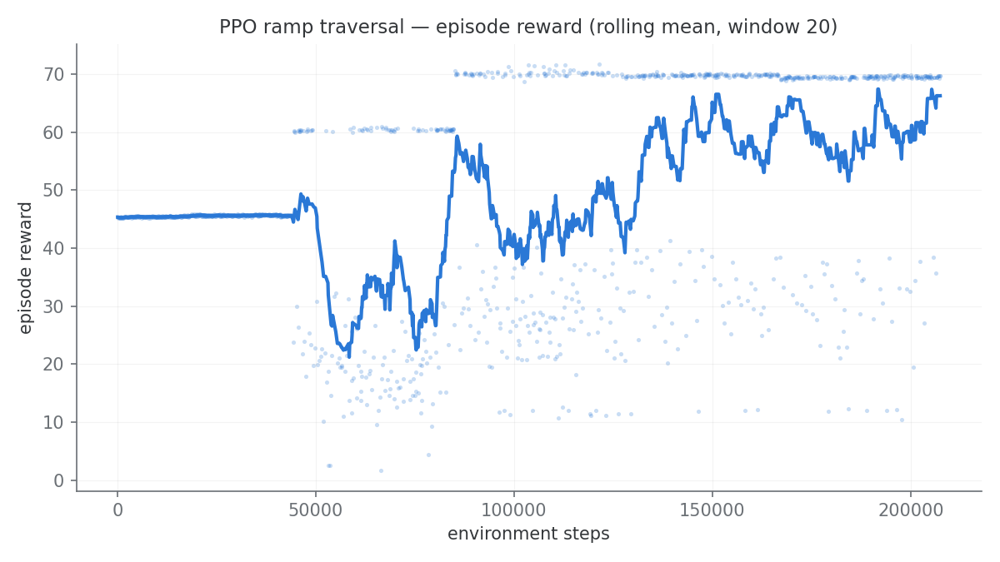

# Measured results

Every number here was measured on the machine described below, with the
command needed to reproduce it. Where something does not work, it is
reported as not working — see [pick-and-place](#pick-and-place) and
[reinforcement learning](#reinforcement-learning).

**Test machine.** Ubuntu 24.04, ROS 2 Jazzy, Gazebo Harmonic (gz-sim 8.11),
Intel laptop CPU + NVIDIA RTX 4050 (driver 580.159.03), headless
(`gui:=false`).

---

## Simulation health

Sensor and control-loop rates, measured in **simulation time** from message
stamps, so the numbers stay meaningful when the real-time factor is not 1.

```
$ ros2 run gazebo_models verify_sim.py

ok    /clock                              2984 msgs
ok    /joint_states                        100.0 Hz sim  (min 20.0)
ok    /scan                                 10.0 Hz sim  (min 8.0)
ok    /imu                                  50.0 Hz sim  (min 40.0)
ok    /camera/image_raw                     15.2 Hz sim  (min 10.0)
ok    /diff_drive_controller/odom           50.0 Hz sim  (min 30.0)
ok    /model/coco/odometry                  50.0 Hz sim  (min 40.0)

all checks passed
```

Every topic runs at its configured rate. The `min` column is the failure
threshold, deliberately well below nominal — `/joint_states` is the
loosest because the `controller_manager` loop is the first thing to dip
under load, and a slow control loop is still a working one.

Real-time factor is ≈1.0. It was ~0.23 before the model frame was fixed
— see [DESIGN_DECISIONS.md](DESIGN_DECISIONS.md#1-the-robot-was-resting-on-its-own-elbow).

---

## Navigation (Nav2)

Ten goals sent to `/navigate_to_pose` from the spawn pose, in the `map`
frame (map origin = spawn pose = world `(-2.0, 0.0)`). Reproduce with
`ros2 launch gazebo_models nav.launch.py` and the `ros2 action send_goal`
command in [RUNNING.md](RUNNING.md).

| # | Goal (map) | Result | Time |
|---|---|---|---|
| 1 | (+1.0, +0.0) | SUCCEEDED | 16.8 s |
| 2 | (+0.8, −2.2) | SUCCEEDED | 14.2 s |
| 3 | (+2.0, −1.0) | SUCCEEDED | 18.7 s |
| 4 | (+1.5, +1.0) | SUCCEEDED | 25.7 s |
| 5 | (+2.5, +0.5) | SUCCEEDED | 4.3 s |
| 6 | (+0.5, −1.5) | SUCCEEDED | 23.3 s |
| 7 | (+3.0, −0.5) | SUCCEEDED | 9.3 s |
| 8 | (+1.2, +1.8) | SUCCEEDED | 16.3 s |
| 9 | (+2.2, −2.0) | SUCCEEDED | 21.5 s |
| 10 | (+0.6, +1.2) | SUCCEEDED | 22.2 s |

**10/10 succeeded**, mean time-to-goal **17.2 s** (4.3 – 25.7 s).

Goals were verified against ground truth as well as Nav2's own report: a
goal to map (0.8, −2.2) left the robot at world (−1.137, −2.130), i.e.
within 9 cm of the requested point.

**Scope of this claim.** All ten goals are inside the mapped region. The
corridor behind the ramp (x > 5.5) is deliberately unmapped and Nav2
correctly *rejects* goals there — see
[DESIGN_DECISIONS.md](DESIGN_DECISIONS.md#5-one-corridor-would-not-map).
Relocalisation from an arbitrary start pose is not exercised; AMCL is
initialised at the spawn pose.

---

## Pick-and-place

### The shipped target: 4/4

`ros2 run coco_moveit_config pick_place.py`, four consecutive runs, with
the cylinder's position read from Gazebo ground truth afterwards.

| Run | Sequence | Gripper stall (rad) | Cylinder z |
|---|---|---|---|
| 1 | complete | 0.2444 / −0.1952 | 0.1280 |
| 2 | complete | 0.2348 / −0.2077 | 0.1280 |
| 3 | complete | 0.2349 / −0.2067 | 0.1280 |
| 4 | complete | 0.2361 / −0.2066 | 0.1280 |

**4/4 succeeded**, cylinder back on the pedestal at z = 0.1280 m every
time.

The "gripper stall" column is the finger position where the fingers stop,
against a commanded 0.02 rad. It is direct evidence that something is
physically held: closing on **empty air** runs all the way to the setpoint
instead. The spread across runs is 0.0096 rad (~0.5°), which is the
repeatability of the grasp itself.

### Re-targeting: 0/5 — a known limitation

`pick_place.py --target X Z` re-solves the IK and re-places the pedestal
for an arbitrary grasp point. The IK part works; the **demo does not**.

| Target (x, z) | Outcome | Cylinder z after |
|---|---|---|
| (0.160, 0.140) | rejected up front: "no hover pose above" | 0.1280 (untouched) |
| (0.150, 0.130) | aborted: empty grasp | 0.0134 (on the floor) |
| (0.145, 0.128) | aborted: empty grasp | 0.1280 |
| (0.152, 0.135) | aborted: empty grasp | 0.0137 (on the floor) |
| (0.140, 0.150) | aborted: empty grasp | 0.0140 (on the floor) |

**0/5 completed.** Only the shipped target (0.152, 0.128) works.

Two distinct behaviours, both correct as *failures*:

- (0.160, 0.140) is rejected before anything moves, because no valid hover
  pose exists above it. Clean.
- The rest reach the grasp pose, close on nothing, and abort naming the
  step. In three of four the approach knocked the cylinder off the
  pedestal onto the floor first.

**Why this is here.** Reachable IK is necessary but not sufficient: the
approach path, the re-placed pedestal and the fingertip geometry all have
to agree, and outside the tuned point they do not. This was found *by*
the grasp confirmation added in this round — before it, `move_gripper`
slept 1.5 s and returned success unconditionally, so all five of these
runs would have printed "Pick-and-place sequence complete" while the
cylinder lay on the floor. The README previously described `--target` as
working anywhere the IK finds reachable; that claim has been corrected.
Tracked in [FUTURE_WORK.md](FUTURE_WORK.md).

---

## Inverse kinematics

Pure computation, no simulator. Reproduce with the numbers in
`coco_moveit_config/test/test_arm_ik.py`.

| Metric | Value |
|---|---|
| Round-trip recovery | 20,000 / 20,000 random joint pairs |
| Max round-trip error | 1.7 × 10⁻¹⁶ m |
| Mean round-trip error | 2.0 × 10⁻¹⁷ m |
| Solve time | 1.5 µs (≈675,000 solves/s) |
| FK at the verified grasp | fk(0.30, 0.58) = (0.1523, 0.1281) m |

Reachable pinch-point envelope in the `base_footprint` frame, sampled over
the joint-limit box:

| Axis | Range |
|---|---|
| x | −0.312 … +0.162 m |
| z | −0.063 … +0.385 m |

The envelope extends behind the robot (negative x) because the arm is rear-
mounted. Part of it is inside the chassis or below the floor and is not
usable — the envelope is the kinematic limit, not the free workspace.

---

## Tests

| Suite | Tests |
|---|---|
| `coco_rl` | 35 |
| `coco_config` | 19 |
| `coco_moveit_config` | 12 |
| `custom_teleop` | 11 |
| `gazebo_models` | 20 |
| **Total (unit)** | **97** |
| `gazebo_models` launch test (opt-in) | 6 cases |

0 failures, **0 skipped**. CI fails if the collected count drops below 75,
so a suite cannot vanish silently — which it previously did, when the
`coco_rl` tests `importorskip`'d on a `gymnasium` that CI never installed.

The rebuilt ramp added 13: 11 in `gazebo_models` for the wedge generator
(`test_gen_ramp.py`) and 2 in `coco_rl` pinning the summit goal.

> **Counting caveat.** A bare workspace-level `colcon test-result` reports a
> larger number (108 here) because ament_cmake packages keep a
> `build/<pkg>/Testing/<timestamp>/Test.xml` directory *per run*, and the scan
> sums the stale ones too. The table counts each package's current result file
> only (`pytest.xml` / `*.xunit.xml`). Delete `build/` for a clean total.

Reproduce:

```bash
colcon test --packages-select gazebo_models custom_teleop coco_config \
                              coco_moveit_config coco_rl
colcon test-result --verbose
```

---

## Reinforcement learning

The RL task was rebuilt after the original "unsolved" result was traced to
its real cause: the ramp was **geometrically unclimbable**, and the goal only
reached the ramp *foot*. Both are fixed, and the fix is measured below. Full
story in
[DESIGN_DECISIONS.md](DESIGN_DECISIONS.md#diagnosing-and-replacing-the-unclimbable-ramp).

### Before — the shipped mesh (0/10, and why)

| Metric | Value |
|---|---|
| Steps trained | 47,204 |
| Episodes | 528 |
| Rolling-mean return | −11 … −13 throughout |
| Deterministic evaluation | **0/10 successes** (0 tips, 10 timeouts) |


The robot survived (0 tips) but never climbed. The honest reason turned out
to be twofold, and neither was the policy:

1. **The mesh could not be climbed by anything.** Profiling `rampcoco.stl`
   (4.40 m run × 1.10 m rise) shows it is not a wedge: ~0.4 m from the foot
   the surface rears up into a **~66° near-vertical face with an overhang**,
   then a sustained ~39° grade. A skid-steer cannot mount a 66° face or a
   step taller than its wheel. Wheel-contact friction is `mu = 0.7` (no-slip
   to ~35°), so a clean grade would have been trivial.
2. **The goal was the foot, not the top.** `GOAL_X_PROGRESS` was 3.0 m,
   which from spawn `(-2,0)` reaches only world x≈1.0 — the ramp foot.
   "Climbing" was never the trained objective.

The 0/10 above is kept as the **before** baseline, not as the project's RL
result.

### After — the rebuilt curriculum, measured

The environment was replaced with a parametric wedge
([`gen_ramp.py`](../gazebo_models/scripts/gen_ramp.py)), a summit goal, and a
12° → 18° → 24° curriculum selected by `ramp_angle:=`. Measured on the test
machine with `./verify_all.sh`:

**The robot climbs.** `climb_check.py` drives it forward from spawn and
watches ground-truth odometry + IMU:

```
$ ros2 run gazebo_models climb_check.py
progress 5.21 m / goal 5.50 m   peak pitch 18.1 deg (>= 7.2 needed)
PASS climb_check: robot reached the 18 deg ramp summit under forward drive.
```

The **peak pitch of 18.1° against a requested 18.0° grade** is the load-bearing
number: it confirms the physics engine sees exactly the geometry `gen_ramp.py`
was asked to emit, so the grade is real rather than nominal.

**PPO smoke run** (2048 steps, seed 0, 18° wedge). This is a *plumbing check*,
and it is reported with its run-to-run spread rather than its best run, because
two identically-seeded runs disagree:

| Metric | Before (old ramp) | Run A | Run B | Run C |
|---|---|---|---|---|
| Episodes | 528 (47k steps) | 50 | 58 | 62 |
| Mean episode length | ~33 steps | 40.3 (max 130) | 34.9 (max 112) | 32.5 (max 122) |
| Mean return | −11 … −13 | −9.50 | −10.96 | −10.77 |
| Best episode return | negative throughout | +5.99 | −6.00 | −3.07 |

**Read this conservatively.** All three runs used `--seed 0`. `--seed` pins the
policy and action sampling but *not* the physics — Gazebo is not
bit-reproducible — so identically-seeded runs diverge, as the spread above
shows. Only run A reached a positive return; mean returns sit in roughly the
same band as the old ramp, and mean episode length straddles the old ~33 steps.
So 2048 steps of PPO demonstrates that the **pipeline runs correctly against
the new environment** and nothing more. It is not evidence of learning, and no
success-rate claim is made until the full curriculum has actually been trained.

The load-bearing evidence that the rebuild worked is `climb_check.py`, not
these returns: it is stable across runs (5.20–5.21 m progress, peak pitch
18.0–18.1°) and shows the robot physically reaching the summit on a grade the
old mesh made impossible.

**Nav2 is unaffected by the world change.** The rebuilt ramp and the one moved
cylinder do not disturb navigation — a goal at map `(1.0, 0.0)` still returns
`SUCCEEDED` in the same run (`./verify_all.sh --with-nav`, stage 7).

### The full curriculum, run to completion — 0/10, and the reason

The curriculum has now actually been run, unattended, with
[`train_curriculum.sh`](../train_curriculum.sh): 3 phases × 60,000 steps,
180,370 env steps in **5 h 58 m**, weights transferred between grades, each
phase evaluated on its own grade with 10 deterministic episodes.

| Phase | Steps | Episodes | Mean return | Best return | Deterministic eval |
|---|---|---|---|---|---|
| 12° | 60,024 | 578 | −10.82 | **+64.29** | **0/10** — 2 tipped, 8 timeout |
| 18° | 60,146 | 443 | −12.55 | +12.03 | **0/10** — 8 tipped, 2 timeout |
| 24° | 60,200 | 378 | −12.00 | +11.41 | **0/10** — 2 tipped, 8 timeout |



**The result is 0/10 at every grade.** That is a negative result and is
reported as one. The cause is visible in the *distribution of how episodes
ended*, recovered from the Monitor CSVs (timeout = ran the full 400 steps;
anything shorter without the goal bonus is a tip-over; progress is backed out
of the return, accounting for the −10 tip penalty and the −0.01/step time
penalty):

| Grade | Episodes | Tipped | Mean progress when tipped | Mean length | Timeouts | Furthest timeout | Goals |
|---|---|---|---|---|---|---|---|
| 12° | 578 | **531 (92%)** | −0.06 m | 78 steps | 46 (8%) | 4.45 m | **1** |
| 18° | 443 | **378 (85%)** | −0.19 m | 90 steps | 65 (15%) | 1.60 m | **0** |
| 24° | 378 | **291 (77%)** | −0.17 m | 87 steps | 87 (23%) | 1.37 m | **0** |

**The robot tips itself over before it reaches the ramp.** The ramp foot is
3.0 m from spawn, and 77–92% of episodes end on their side after ~80 steps
(~8 simulated seconds) having covered essentially **zero** ground. At 18° and
24° *no episode in the entire run* got past 1.6 m — the policy never saw the
ramp at all, so the two steeper "curriculum" phases trained on flat-ground
tip-overs. Exactly **one** episode out of 1,399 across the whole run reached
the summit.

So the reward is *effectively sparse* even though it is written as a dense
one: the agent destroys the episode long before the dense progress term can
pay out. PPO cannot learn a climb it has seen once in 1,399 attempts.

Note the deterministic policy behaves differently from the training
distribution: evaluated greedily at 12° it mostly survives (8 timeouts, 2 tips)
and creeps ~1.3 m — positive returns of +4.36 … +9.41 — still well short of
the 3.0 m ramp foot. Survival is what it learned; locomotion is not.

**The tip-overs are real, and now measured rather than inferred.** With the
`outcome` column added to the Monitor CSV (see below), a fresh 1,024-step run at
18° ends **24 episodes out of 24** as `tipped` — not `sim_stalled`. Driving the
env directly pins down the mechanism:

| Test | Result |
|---|---|
| Constant action `[0.5, 0.0]` (half speed, no yaw) | **reaches the goal in 187 steps**, peak roll 8.3° |
| Constant action `[1.0, 0.0]` (full speed, no yaw) | **reaches the goal in 384 steps**, peak roll 3.5° |
| Constant turning actions | timeout, peak roll **0.0°** — never tips |
| `reset()` × 20 | 0/20 tipped; roll and pitch exactly 0.0° |
| Random actions, full yaw range | 8/8 tipped, mean 46 steps |
| Random actions, yaw capped to ~0.4 rad/s | 8/8 tipped, mean 46 steps |
| Random actions, **yaw disabled entirely** | 8/8 tipped, mean 37 steps |

So the task is **trivially solvable** — a single constant action solves it in 187
steps — and the action space cannot tip the robot when held steady. Yaw is not
the cause: disabling it entirely still tips 8/8. What tips the robot is
*oscillating linear commands*, which is exactly what an untrained stochastic
policy emits. Tracing one episode shows the robot pitching **nose-down
progressively** (−16° → −37° over five steps) while `x` barely moves
(0.05 → 0.11 m), and after 25 idle steps it is at −74°: it really does fall.
The `diff_drive_controller` acceleration limits (2.0 m/s², confirmed enabled at
runtime) do not prevent it.

**The blocker is therefore dynamic fragility, not the reward and not the
geometry.** PPO never survives long enough to discover that steady forward
motion solves the task, because the exploration noise that would discover it
also knocks the robot over within ~4 simulated seconds.

> **Corrections.** This section previously carried two wrong diagnoses, both
> retracted. First, "no per-step time penalty, so safe creeping wins":
> `TIME_PENALTY = 0.01` had always existed. Second, an outcome breakdown
> claiming "77–92% tipped" that was *inferred* from return and length — which
> cannot separate a tip-over (−10 penalty) from a `sim_stalled` truncation
> (reward 0.0), because the outcome was never logged. Both errors came from
> reasoning about the numbers instead of measuring. The outcome is now written
> to the Monitor CSV so this class of mistake cannot recur, and the table above
> is measured. A scripted `tip_probe.py` was also written and discarded: it
> teleported between cases without settling in sim time or zeroing velocity,
> which catapulted the robot 3.3 m into the air and produced 176° "rollovers"
> that were pure artefact.

**The environment itself is still sound** — `climb_check.py` drives the robot
to the summit at a measured 18.1° pitch on demand, and one PPO episode did
reach the goal (+64.29). What is unproven is that *this* action space and
episode structure are learnable.

Reproduce with:

```bash
./train_curriculum.sh                 # 3 x 60k steps, ~6 h, unattended
./watch_training.py                   # live progress
```

**Still compute-bound as well.** The env steps at ~8 env steps/s (Gazebo is the
bottleneck), so each 60k phase is ~2 h. Reward shaping is the cheaper lever to
pull first; the scaling paths in [FUTURE_WORK.md](FUTURE_WORK.md) item 9 apply
after that.

**Reproducing the figure.** The Monitor CSVs are committed under
[`docs/data/`](data/):

```bash
python3 -m coco_rl.plot_curve \
    docs/data/ppo_run_part1_trimmed.monitor.csv \
    docs/data/ppo50k_b.monitor.csv \
    -o docs/images/ppo_learning_curve.png
```

This reproduces the committed PNG byte-for-byte
(md5 `dbd195d8926d8af2768220cdc7dbc64d`).
