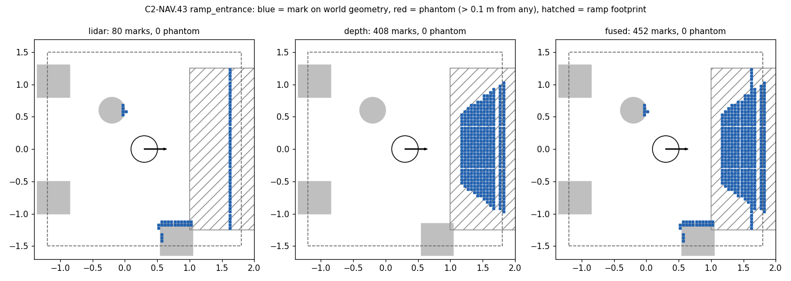

# C2-NAV.43 — command-path integration, and an optional depth-fusion experiment

Branch `c2nav43-integration`, cut from `main` at `ea66155`. Date 2026-09-17.
Every number below was produced in this session, on this branch, on fresh
simulators, never `--fast`. Run directories are under `~/coco_nav_runs/`; the
summaries that back each table are committed under `docs/data/c2nav43_live/`.

**Verdicts.** The command-path fix is **KEPT**: integrated, tested, and
re-validated live. Depth fusion is **KEPT AS A CANDIDATE, NOT a production
default**: the shipped `nav2_params.yaml` and `nav.launch.py`'s defaults are
unchanged, and §5 lists what stands between the candidate and promotion.

---

## 1. Command path

### 1.1 Old and new architecture

`main` before this branch (topology B, the one `mission.launch.py` runs):
`cmd_vel_relay` published `/cmd_vel_nav`. `nav2_bringup` remaps
controller_server's output and the velocity smoother's input onto that same
topic, and `cmd_vel_arbiter` read it. The collision monitor's output therefore
looped back into the smoother, and the arbiter forwarded the controller's RAW
command to the wheels (C2-NAV.41; PROJECT_STATE KNOWN LIMITATIONS 0).

This branch:

```
controller_server ─► /cmd_vel_nav ─► velocity_smoother ─► /cmd_vel_smoothed
  ─► collision_monitor ─► /cmd_vel ─► cmd_vel_relay (re-stamps) ─► /cmd_vel_gated
  ─► cmd_vel_arbiter ─► /diff_drive_controller/cmd_vel
```

### 1.2 Commits integrated (inspected one by one, not a branch merge)

| commit on this branch | from | what |
|---|---|---|
| `6503cd5` | `d707327` | the wiring: `GATED_TOPIC`, relay re-stamp, arbiter `nav_topic`, launch files |
| `2a66959` | `8bf1fe4` | 41 wiring tests, including a private-DDS graph test with a pre-fix positive control |
| `f3bfa0a` | `57f75d8` | `shlex.quote` of the world path: without it `gz sim` cannot start from `ros2_ws(personal)` |
| `d260749` | net of `ad2b8b8` | the owner-accepted nav2 defaults every C2-NAV.42 number was measured on: local CSF 65, the multi-pose through-poses BT (sha256 `6f61e499…`), plus the guard test |
| `a56b081` | `9412719` | ARCHITECTURE / README name `/cmd_vel_gated` |
| `0ce8b0e` | files at `1235502` | tour runner, verify-topology, nav_bench, analysis scripts — tooling only, no run data |

**Not integrated:** `coco_nav_diag` (the instrumented AMCL), every C2-NAV.0–.42
data bundle, `experiments/baseline_amcl_diag.yaml`, and the diagnosis
branch's PROJECT_STATE / SESSION_LOG / RESULTS narrative.

### 1.3 Tests

On the integrated tree before any perception work, per package, cwd inside
the package, clean graph (measured): coco_config 70, custom_teleop 75,
gazebo_models 136, coco_mission 289, coco_moveit_config 12, coco_sim 55,
coco_perception 139, coco_rl 164 — **940 passed, 0 failed, 0 skipped**.
On the final tree: gazebo_models 171, everything else unchanged —
**975 passed, 0 failed, 0 skipped**.

### 1.4 Live graph and controlled STOP (`live_b_r01`, topology B)

- `verify-topology`: **13 / 13 links OK**. `/cmd_vel_nav`: pub
  `behavior_server, controller_server`, sub `velocity_smoother` only.
  `/cmd_vel_smoothed` → `collision_monitor`. `/cmd_vel`: pub
  `collision_monitor` (+ inert `docking_server`), sub `cmd_vel_relay`.
  `/cmd_vel_gated`: pub `cmd_vel_relay` only, sub `cmd_vel_arbiter`.
- Wheel topic: **exactly 1 publisher**, `cmd_vel_arbiter`.
- Parameter readback: 0 mismatches.
- **Controlled STOP**: a stand-in controller holds raw 0.30 m/s on
  `/cmd_vel_nav` toward the west wall. STOP **held**; wheels above the
  monitor **0 / 278** samples; **71 STOP rows, 0 with the wheels driven**;
  bypass rows **0**; the wheel matched the smoother on 9 rows and the raw-only
  command on 0. The robot stopped at x = −3.651 m against the wall face at
  −3.9 (0.249 m).
- Spin goal (C2-M5.1's relocalize spin): monitor exceeded 0 / 85, bypass 0,
  wheel = smoother 11, wheel = raw only 0.

### 1.5 Regression tours

| tour | topology | legs | entry | exit | wheels above monitor | bypass rows | stale drops |
|---|---|---|---|---|---|---|---|
| `baseline_r05` | A | 7/7 | 1/1 | 1/1 | 0 / 2072 | 0 | 0 |
| `baseline_topology_b_r09` | B | 6/7 | 0/1 (TIMEOUT, yaw err 2.047 rad) | 1/1 | 9 / 2722 | 0 | 0 |

**Raw-controller → wheel bypass = 0** in every live test and every tour on
this branch, including the six Part K tours in §4.

---

## 2. Sensor system (audit + live verification)

| | 2D LiDAR | RGB-D camera (existing) |
|---|---|---|
| gz sensor | `gpu_lidar` | `rgbd_camera` |
| topic(s) | `/scan` | `/camera/image_raw`, `/camera/depth/image_raw` (32FC1), `/camera/camera_info`, `/camera/points` (PointCloud2) |
| frame | `lidar_link` | `camera_optical_frame` |
| mount (base_footprint) | (−0.09, 0.10, 0.2135), rear-left mast | (0.125, 0, 0.0685), RPY 0 |
| rate (measured) | 9.87–10.0 Hz | 14.96–15.15 Hz |
| geometry | 480 samples, ±2.0944 rad, 0.15–12 m | 320×240, hfov 1.25 rad, depth 0.1–8 m |

TF `base_footprint ← camera_optical_frame` and `← lidar_link` matched the
xacro to 0.00000 m / 0.00000 (measured, all poses). Before this work the local
costmap's `obstacle_layer` **and** `voxel_layer` both read `/scan` only; the
collision monitor reads `/scan` only and is unchanged.

**Reused:** the camera and its bridged depth image + camera_info.
**Added:** no sensor. Two installed image_pipeline nodes, off by default.

### 2.1 Why `/camera/points` was rejected (`sensors_r01`)

The gz rgbd cloud is stamped `camera_optical_frame`, but its points are in
the x-forward **link** convention. Compared with a pinhole projection of the
depth image, the median point error is 0.0015–0.0020 m for the link convention
and 0.64–0.73 m for the optical one, at three poses (the fourth received no
cloud). Projected as labelled, "floor"
points land up to **1.61 m** off the floor and box_obstacle_2 points reach
**1.31 m** on a 0.5 m box. The same depth image projected through camera_info
in the optical frame is correct: floor |z| p99 ≤ 0.004 m and max 0.0053 m;
ramp points lie on the wedge surface (median residual 0.0021 m, p99 0.005 m);
box, cylinder and wall tops read 0.502, 0.603 and 0.992–1.002 m against 0.5,
0.6 and 1.0.

### 2.2 Why the cloud is half resolution (`capture_r02`, `capture_r03`)

A **raw** subscriber with best-effort sensor-data QoS, the policy
nav2_costmap_2d's obstacle layer uses, measured 12 s per topic:

| topic | sample | delivered |
|---|---|---|
| `/camera/depth/image_raw` | 307 KB | 15.01 Hz |
| `/camera/depth/points`, full res | 1.23 MB | 1 message, then 0 |
| `/camera/points` (gz) | 1.23 MB | 0 messages |
| `/camera/depth/points`, **x0.5** | 307 KB | **14.93 Hz** alone, 14.97 Hz in the chain |

The size rule was fixed before re-measuring: no larger than the depth image,
which this transport delivers at 15 Hz. At x0.5 the half cloud is organized at
160×120 and passes the pinhole convention check against the scaled intrinsics
(median error ≈ 5e-9 m) plus every floor, ramp and object check, at five poses.

---

## 3. Perception implementation

- `gazebo_models/launch/depth_cloud.launch.py`:
  `image_proc/resize_node` (x0.5, `INTER_NEAREST`, intrinsics scaled) →
  `/camera/depth/half/{image_raw,camera_info}` →
  `depth_image_proc/point_cloud_xyz_node` → `/camera/depth/points`.
  image_transport derives `/camera/depth/camera_info`, which nothing
  publishes; that absolute name is remapped to the bridged
  `/camera/camera_info`. Both nodes subscribe lazily.
- `nav.launch.py depth_cloud:=false` (default). `mission.launch.py` never sets it.
- `nav_params_overlay.py`: a narrow `perception` experiment key. It may only
  set the **local** costmap voxel layer's `observation_sources` and add the
  blocks of the sources it lists. It can never drop `scan`, reach the obstacle
  layer, global costmap, inflation or collision monitor, or overwrite an
  existing block. Tours read the voxel sources back off the live node, and
  `verify-perception` checks that each added source has a publisher, is read
  by `local_costmap`, and DELIVERED a message in the expected frame (runner
  exit 9 otherwise). No depth cloud may run in an arm without a depth source.
- `ros_clean.sh`: `depth_cloud[.]launch.py`, both node executables, and the
  instrument's recorder.

### 3.1 The two configurations

`experiments/baseline_lidar_only.yaml` and `experiments/depth_fusion.yaml`
differ **only** in `perception` (a test pins this). Both use topology B, the
shipped params, the committed TOUR, 1 repeat, and 75 s per leg.

- **baseline**: `local_voxel_sources: [scan]`, which resolves to no change.
  nav2 loads `nav2_params.yaml` byte for byte (`6f61e499…`).
- **fusion**: `[scan, depth]`, where `depth` is PointCloud2 on
  `/camera/depth/points`. `max_obstacle_height` 2.0, `obstacle_max_range`
  2.5, `obstacle_min_range` 0.0, `raytrace_max_range` 3.0,
  `raytrace_min_range` 0.0 and `marking`/`clearing` true all equal the LiDAR
  source's values. `min_obstacle_height` 0.05 was fixed before any costmap
  run: the smallest multiple of the voxel z_resolution at or above 2× the
  measured floor height maximum (0.0053 m).

No planner, controller, safety, goal, waypoint, PolygonStop, BaseObstacle or
inflation value was touched.

### 3.2 Costmap representation at the same pose (Part G, `capture_r03`)

Three standalone `nav2_costmap_2d` nodes ran side by side on the same sensor
messages, with inflation removed. Every marked cell was classified against the
world file; "phantom" means more than 0.10 m from any geometry.

**Phantom cells: 0 in every arm at every one of six poses.** Pose table
(cells, nearest mark m, voxel column top m):

| pose | lidar | depth | fused |
|---|---|---|---|
| `ramp_entrance` (0.3, 0, 0) | 80: ramp 52 @1.312 ^0.25; box_obstacle_2 23; cylinder 5 | 408: ramp 408 @0.875 ^0.30 | 452: ramp 424 @0.875 ^0.30; box_obstacle_2 23; cylinder 5 |
| `ramp_surface` (0.55, 0.5, 0) | 44: ramp @1.075 ^0.25 | 416: ramp @0.625 ^0.35 | 432: ramp @0.625 ^0.35 |
| `ramp_edge` (2.0, −2.0, π/2) | 80: ramp 50 @0.725 ^0.25; box_obstacle_2 30 | 19: ramp @0.775 ^0.45 | 83: ramp 53 @0.725 ^0.45; box_obstacle_2 30 |
| `box_obstacles` (−2.0, −0.75, 0) | 28: gate_cube_south 20 @0.625; north 8 | 11: south @0.675 ^0.40 | 29: south 21 ^0.40; north 8 |
| `enclosure_entrance` (−3.55, 1.55, π/2) | 83: wall_west 49 @0.326; box_obstacle_1 34 @0.66 ^0.25 | 30 | 95: wall_west 60 ^0.80; box_obstacle_1 35 ^0.55 |
| `enclosure_exit` (−3.45, 2.95, −π/2) | 126: wall_west 71; box_obstacle_1 32 @0.355; wall_north 23 | 24 | 135: wall_west 76; box_obstacle_1 36 ^0.45; wall_north 23 |

**Ramp central band** (|y| ≤ 1.0 m, clear of box_obstacle_2). Representable
cells are those in the window and the camera's view with a surface at or above
0.05 m (`docs/data/c2nav43_ramp.py`):

| pose | representable | LiDAR: first mark x (surface), coverage | fused: first mark x (surface), coverage |
|---|---|---|---|
| `ramp_entrance` | 394 | 1.625 (0.203 m), **0.086** | 1.175 (0.057 m), **0.904** |
| `ramp_surface` | 413 | 1.625 (0.203 m), **0.058** | 1.175 (0.057 m), **0.864** |



The hypothesis holds, and the recorded geometry shows it. The planar LiDAR
represents the 18° ramp as a one-cell-thick **wall across its full width**,
at the x where the slope reaches the scan plane (0.2135 m). Everything below
that is free space to it. The depth source represents the slope surface from
0.057 m up, inside its ±0.625 rad view. From `ramp_edge` every arm sees only
the side face; there fused adds 3 cells and the column top reads 0.45 m
instead of 0.25.

---

## 4. Navigation (Part K)

Six fresh simulators, interleaved B F B F · B F, topology B, identical world,
robot, goals, nav2 parameters apart from the perception source, safety
settings and command topology. `baseline_lidar_only_r03` was **VOID**: its
runner was killed when the launching session ended, during leg 7, with no
bench JSON. It is excluded and was replaced by `r04` on a fresh simulator.
`docs/data/c2nav43_compare.py` → `docs/data/c2nav43_live/compare_partK.md`.

### 4.1 Per run

| run | legs | ordinary | entry | exit | tour sim s | min true clear m | STOP n / s | deadlocks | wheels above monitor | bypass rows | stale drops | Nav2 cores | depth cores |
|---|---|---|---|---|---|---|---|---|---|---|---|---|---|
| baseline r01 | 6/7 | 5/5 | 1/1 | 0/1 | 313.22 | 0.2452 | 1 / 70.17 | exit | 3/3121 | 0 | 0 | 1.027 | — |
| baseline r02 | 5/7 | 5/5 | 0/1 | 0/1 | 251.14 | 0.2459 | 1 / 63.19 | entry, exit | 7/1734 | 0 | 0 | 1.196 | — |
| baseline r04 | 5/7 | 5/5 | 0/1 | 0/1 | 258.41 | 0.2449 | 1 / 48.04 | entry, exit | 7/1882 | 0 | 0 | 1.906 | — |
| fusion r01 | 6/7 | 5/5 | 1/1 | 0/1 | 228.56 | 0.2454 | 1 / 70.16 | exit | 2/2285 | 0 | 0 | 1.139 | 0.119 |
| fusion r02 | 6/7 | 5/5 | 1/1 | 0/1 | 215.87 | 0.2434 | 1 / 70.40 | exit | 63/2161 | 2 | 0 | 1.195 | 0.125 |
| fusion r03 | 6/7 | 5/5 | 0/1 | 1/1 | 253.41 | 0.2658 | 0 / 0.0 | — | 12/2535 | 0 | 0 | 1.891 | 0.176 |

Every run passed its live readbacks: params (13 OK baseline, 23 OK fusion),
topology 13 OK, and perception (1 OK baseline, 3 OK fusion).

### 4.2 Per arm

| | baseline_lidar_only | depth_fusion |
|---|---|---|
| total legs | **16/21** | **18/21** |
| ordinary legs | 15/15 | 15/15 |
| enclosure_entry | **1/3** | **2/3** |
| enclosure_exit | **0/3** | **1/3** |
| timeouts | 5 | 3 |
| deadlocks (C2-NAV.40 definition) | 5 | 2 |
| PolygonStop activations / seconds | 3 / 181.4 | 2 / 140.56 |
| min true geometric clearance | 0.2449 m | 0.2434 m |
| median goal error, succeeded legs | 0.088 m | 0.087 m |
| median \|yaw error\|, succeeded legs | 0.421 rad | 0.424 rad |
| entry \|yaw error\| per run | 0.493, 2.556, 2.364 | 0.487, 0.508, 2.217 |
| median tour sim s | 258.41 | 228.56 |
| raw-controller bypass rows | 0 | 2 (wheel = raw controller **0**, = smoother 0) |
| wheels above monitor | 17/6737 (0.25 %) | 77/6981 (1.10 %) |
| STOP rows with wheels driven (worst) | 25/1813 (0.09 m/s) | 15/1406 (0.09 m/s) |
| costmap missed-rate lines | 0 | 0 |
| controller missed-rate lines | 13 | 8 |
| Nav2 container CPU, median of runs | 1.196 cores | 1.195 cores |
| depth-cloud nodes CPU, median | — | 0.125 cores |

Per leg (`compare_partK.md`): at `enclosure_entry` the baseline spent 111.23 s
in PolygonStop across 2 of 3 legs, and fusion 0.00 s in 0 of 3. The entry
leg's minimum true clearance was 0.2449 m in the baseline and 0.2922 m in
fusion. `enclosure_exit` spent 70.17 s (1 leg) against 140.56 s (2 legs), and
the baseline's other two exits inherited the held entry. Ordinary legs went
15/15 in both arms.

### 4.3 Local-costmap marks during navigation (recorder)

Cells more than 0.10 m from any geometry, over every published local costmap:

| | baseline (3 runs) | fusion (3 runs) |
|---|---|---|
| off-geometry cells, total (grids with any / grids) | 15,438 (560/1780) | **50,068 (835/1654)** |
| farthest from geometry | 0.749 m | 1.293 m |
| split by current view (2 runs each, recorded after `02cd725`): camera / LiDAR / neither | 1,124 / 3,584 / 4,287 | **5,896 / 21,999 / 18,116** |

The recorder samples up to 20 of these cells per grid. In the two runs
examined, the sampled cells lie 0.1–0.3 m from walls and boxes, never in open
floor. During in-place terminal rotations they move with the robot's yaw, in
both arms. The mechanism these observations fit is persistent local-costmap
marks displaced by wheel-odometry drift, not floor or pitch artefacts. Fusion
has 3.2× as many. A mechanism consistent with that, **not tested**: depth
marks voxels between 0.05 and 0.8 m that the LiDAR's planar raytrace cannot
clear, and the camera clears only its ±0.625 rad view, so depth marks outside
that view persist and drift.

### 4.4 The safety residual

The wheels exceeded the monitor in both arms, on short streaks of at most 5
rows at 10 Hz. In `fusion r02` the 63 rows are spread over all seven legs,
not concentrated near obstacles. Its 2 "bypass" rows had controller, smoother
and monitor all at 0 m/s, and the worst (wheel 0.3 m/s) is 1.1 s into
`wall_parallel`, at a leg start. C2-NAV.42 reported the same residual at
155/6304 (2.46 %) on this wiring with **no** depth source
(`C2-NAV.42_RESULTS.md` on `worktree-c2nav0-diagnosis`; not re-measured here).
Here the baseline runs span 0.096–0.40 % and the fusion runs 0.088–2.92 %,
with one fusion run carrying 63 of the arm's 77 rows. That within-arm spread
is wider than the difference between the arms, so no attribution to fusion is
claimed either way.

---

## 5. Answers and decision

1. **Did fusion describe the ramp more usefully?** Yes, statically. Coverage
   of the representable ramp area rose from 0.086 to 0.904 and from 0.058 to
   0.864, and the first mark moved from x 1.625 (surface 0.203 m) to 1.175
   (0.057 m). No tour leg drives onto or along the ramp, so the ramp's effect
   on **navigation** is not measured.
2. **Fewer false obstacle interpretations of the ramp?** The LiDAR's
   interpretation is not a phantom. It is a wall where the slope crosses the
   scan plane, with the lower slope read as free space. Fusion replaces that
   with the surface. 0 phantom cells in either arm at the ramp poses.
3. **Did enclosure entry improve?** 1/3 → 2/3; PolygonStop at entry 111.23 s
   → 0 s; entry clearance 0.2449 → 0.2922 m. N = 3, not statistical.
4. **Did enclosure exit remain safe?** 0/3 → 1/3; min true clearance
   0.2449 / 0.2434 m against the 0.2051 m circumscribed radius C2-NAV.0
   measured (not re-measured here); worst wheel
   during STOP 0.09 m/s in both arms.
5. **Did PolygonStop remain effective?** Yes: 2 activations / 140.56 s,
   holding in both arms at the same 0.09 m/s bound. The monitor still reads
   `/scan` only.
6. **Did fusion introduce phantom obstacles?** Static: no (0 at six poses).
   While driving: off-geometry marks rose 3.2× (15,438 → 50,068), all near
   real geometry, farthest 1.293 m. This is the candidate's main measured cost.
7. **Did it materially increase load?** Nav2 container median 1.196 → 1.195
   cores, plus 0.125 cores for the depth-cloud nodes. Costmap missed-rate
   warnings: 0 in both.
8. **Did it change terminal-heading behaviour?** No: median |yaw error| on
   succeeded legs 0.421 vs 0.424 rad. Each arm had one entry failure at
   2.2–2.6 rad.

**Command-path fix: KEEP.** **Depth fusion: KEEP AS CANDIDATE.** The sensor
geometry, TF, representation, safety and load criteria are met. The enclosure
direction is consistent (entry and exit 3/6 vs 1/6, deadlocks 2 vs 5) but
rests on N = 3. Two things block promotion to default: the 3.2× growth in
persistent off-geometry marks, and ramp navigation not exercised on the
mission path. **Nothing was made default:** `nav2_params.yaml` is
byte-identical to `6f61e499…` and `depth_cloud` defaults to false.

## 6. Remaining engineering work

- Merge `c2nav43-integration` into `main`, the owner's decision; the command
  path and the tooling are ready.
- M6 fetch (19/20) is **not yet measured** on the fixed command path.
- `enclosure_exit` PolygonStop deadlock at box_obstacle_1, present in both
  arms (C2-NAV.39 geometry).
- Depth-fusion stale marks: the clearing asymmetry in §4.3 must be removed or
  shown harmless before the candidate can become a default.
- `mission.launch.py` has no `depth_cloud` / perception pass-through, so the
  candidate cannot yet run on the mission path.

## Reproduce

```bash
python3 -P docs/data/c2nav43_perception.py selftest     # no ROS
bash gazebo_models/scripts/nav_tour_run.sh gazebo_models/config/experiments/baseline_lidar_only.yaml
bash gazebo_models/scripts/nav_tour_run.sh gazebo_models/config/experiments/depth_fusion.yaml
python3 -P docs/data/c2nav43_compare.py --baseline ~/coco_nav_runs/baseline_lidar_only/<runs> \
    --fusion ~/coco_nav_runs/depth_fusion/<runs>
python3 -P docs/data/c2nav43_ramp.py docs/data/c2nav43_live/capture_r03_half_res/capture.json
```

The capture itself needs a sim (no Nav2) with `depth_cloud.launch.py` running,
then `c2nav43_perception.py capture --lidar-params <shipped copy> --fused-params
<resolved params_merged.yaml>`. Name both parameter files without `nav2_`:
ros_clean's `nav[2]_` pattern matches any command line that contains it.
